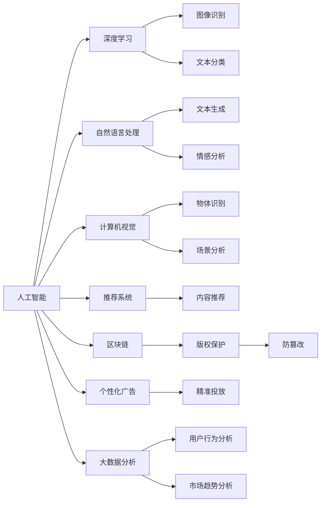
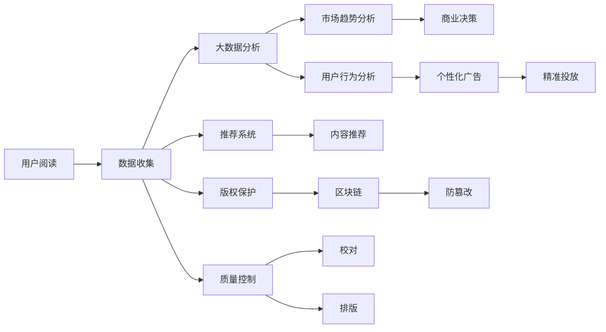
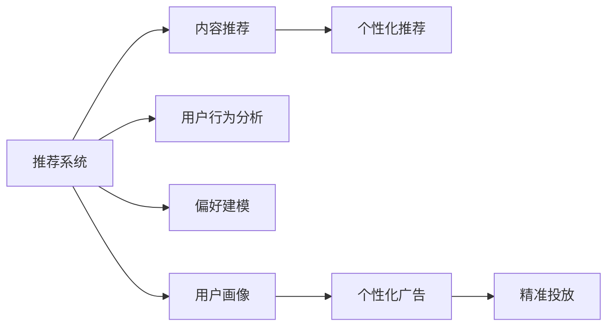

                 

# AI出版业前景：技术创新，场景应用无限

## 1. 背景介绍

### 1.1 问题由来
出版业作为文化产业的重要组成部分，近年来面临着数字化转型的巨大挑战。传统出版流程复杂，涉及编辑、校对、排版、印刷、发行等多个环节，效率低下，成本高昂。随着互联网和智能技术的普及，出版业迫切需要借助AI技术提升效率、降低成本、优化用户体验。

人工智能技术的引入，为出版业带来了新的突破口。通过深度学习、自然语言处理、计算机视觉等技术，AI可以自动化处理内容推荐、版权保护、质量控制、广告投放等业务，显著提升出版流程的智能化水平。

### 1.2 问题核心关键点
AI在出版业的应用主要集中在以下几个方面：

- **内容推荐**：基于用户历史阅读数据，AI能够智能推荐相关书籍和文章，提升用户体验和粘性。
- **版权保护**：通过区块链、数字水印等技术，AI可以有效防止盗版和侵权行为，保护知识产权。
- **质量控制**：AI可以自动校对、编辑、排版，降低人工成本，提升内容质量。
- **广告投放**：AI能够精准分析用户偏好，投放个性化广告，提高广告点击率和转化率。
- **数据分析**：AI可以处理海量数据，分析用户行为和市场趋势，为出版商提供决策支持。

这些AI技术的应用，不仅能够大幅提升出版流程的效率和质量，还能够创造更多商业价值，推动出版业数字化转型的加速。

### 1.3 问题研究意义
AI在出版业的应用，对于提升出版流程的智能化水平、降低成本、优化用户体验等方面具有重要意义：

- **提升效率**：AI技术可以自动化处理大量繁琐的重复性任务，提升出版流程的效率。
- **降低成本**：通过减少人工成本和减少错误率，AI可以降低出版业的总成本。
- **优化体验**：基于用户行为的个性化推荐和广告投放，能够提升用户的阅读体验和购买意愿。
- **创造价值**：AI能够通过数据分析挖掘更多商业机会，为出版商带来新的收入增长点。
- **推动转型**：AI技术的应用是出版业数字化转型的重要驱动力，有助于传统出版业向数字出版的转型升级。

## 2. 核心概念与联系

### 2.1 核心概念概述

为更好地理解AI在出版业的应用，本节将介绍几个密切相关的核心概念：

- **人工智能(AI)**：使用计算机算法和数据模型，模拟人类智能解决问题、做出决策的技术。
- **深度学习**：通过多层神经网络实现自动特征提取和模式识别，用于图像识别、自然语言处理等任务。
- **自然语言处理(NLP)**：使计算机能够理解、处理和生成人类自然语言的技术。
- **计算机视觉(CV)**：使计算机能够理解和处理图像和视频的技术。
- **推荐系统**：通过分析用户行为和偏好，推荐相关内容的技术。
- **区块链**：一种分布式数据库技术，用于确保数据的安全、透明和不可篡改。
- **数字水印**：嵌入在数字产品中的标记，用于验证版权和防篡改。
- **个性化广告**：根据用户行为和偏好，动态生成个性化的广告内容。
- **大数据分析**：通过处理海量数据，分析用户行为和市场趋势，支持商业决策。

这些核心概念之间的逻辑关系可以通过以下Mermaid流程图来展示：



这个流程图展示了AI在出版业应用的几个核心概念及其之间的关系：

1. AI通过深度学习和自然语言处理技术，实现对图像、文本等数据的理解和处理。
2. 计算机视觉技术用于图像识别和场景分析，提升内容编辑和校对效率。
3. 推荐系统基于用户行为数据，实现个性化内容推荐，提升用户体验。
4. 区块链技术用于版权保护和防篡改，确保数据安全。
5. 个性化广告通过大数据分析，实现精准投放，提高广告效果。
6. 大数据分析用于用户行为和市场趋势分析，为出版商提供决策支持。

这些核心概念共同构成了AI在出版业应用的完整生态系统，使其能够在各种场景下发挥强大的智能能力。通过理解这些核心概念，我们可以更好地把握AI出版业的前景和发展方向。

### 2.2 概念间的关系

这些核心概念之间存在着紧密的联系，形成了AI在出版业应用的完整生态系统。下面我们通过几个Mermaid流程图来展示这些概念之间的关系。

#### 2.2.1 AI在出版业的应用流程



这个流程图展示了AI在出版业应用的整体流程：

1. 用户阅读产生的数据被收集并输入大数据分析系统。
2. 大数据分析系统进行市场趋势和用户行为分析，提供商业决策支持。
3. 推荐系统根据用户行为数据推荐相关内容，提升用户体验。
4. 版权保护系统利用区块链技术防止盗版和侵权行为。
5. 质量控制系统利用AI自动校对、编辑和排版，提升内容质量。
6. 个性化广告系统根据用户行为进行精准投放，提高广告效果。

#### 2.2.2 推荐系统与个性化广告的关系



这个流程图展示了推荐系统和个性化广告之间的关系：

1. 推荐系统根据用户行为数据推荐相关内容，提升用户体验。
2. 用户画像系统通过用户行为数据构建用户画像，为个性化广告提供数据支撑。
3. 个性化广告系统根据用户画像进行精准投放，提高广告效果。

## 3. 核心算法原理 & 具体操作步骤
### 3.1 算法原理概述

AI在出版业的应用主要依赖深度学习、自然语言处理等技术。以下是几个核心算法的原理概述：

- **深度学习**：通过多层神经网络实现自动特征提取和模式识别，用于图像识别、自然语言处理等任务。
- **自然语言处理**：使计算机能够理解、处理和生成人类自然语言的技术。
- **推荐系统**：通过分析用户行为和偏好，推荐相关内容的技术。

### 3.2 算法步骤详解

以推荐系统为例，介绍AI在出版业应用的详细步骤：

**Step 1: 数据收集和预处理**
- 收集用户历史阅读数据、行为数据、购买数据等。
- 清洗数据，去除噪声和缺失值，进行标准化处理。

**Step 2: 特征工程**
- 从用户行为数据中提取特征，如阅读时长、阅读时间、阅读频次等。
- 将文本数据转化为数字向量，使用词嵌入技术如Word2Vec、GloVe等。
- 构建用户画像，包括用户偏好、兴趣、行为特征等。

**Step 3: 模型训练**
- 使用深度学习算法如协同过滤、神经网络等构建推荐模型。
- 在训练集上进行模型训练，优化模型参数，提高推荐精度。

**Step 4: 推荐预测**
- 将用户输入的数据输入推荐模型，预测用户可能感兴趣的内容。
- 将预测结果进行排序，推荐最相关的书籍和文章。

**Step 5: 反馈优化**
- 收集用户反馈数据，如点击率、阅读时间等。
- 使用反馈数据更新推荐模型，提高推荐效果。

### 3.3 算法优缺点

AI在出版业的应用具有以下优点：

- **高效性**：AI可以自动化处理大量重复性任务，提升工作效率。
- **精准性**：基于用户行为数据，AI能够提供个性化的内容推荐，提高用户满意度。
- **自动化**：AI可以自动完成内容编辑、校对、排版等任务，减少人工成本。
- **成本效益**：通过减少人工成本和提高广告效果，AI能够显著降低出版业的运营成本。

同时，AI在出版业的应用也存在一些缺点：

- **数据隐私**：用户行为数据可能包含敏感信息，需要严格保护用户隐私。
- **模型黑盒**：AI模型往往难以解释其内部决策逻辑，需要透明性和可解释性。
- **数据质量**：推荐系统的效果高度依赖数据质量，低质量数据可能导致推荐效果不佳。
- **过度拟合**：模型可能在训练集上过拟合，导致泛化能力不足。
- **技术门槛**：AI技术的应用需要一定的技术基础，对从业人员的技术要求较高。

### 3.4 算法应用领域

AI在出版业的应用已经覆盖了以下几个领域：

- **内容推荐**：基于用户历史阅读数据，AI可以智能推荐相关书籍和文章，提升用户体验。
- **版权保护**：通过区块链、数字水印等技术，AI可以有效防止盗版和侵权行为，保护知识产权。
- **质量控制**：AI可以自动校对、编辑、排版，降低人工成本，提升内容质量。
- **广告投放**：AI能够精准分析用户偏好，投放个性化广告，提高广告点击率和转化率。
- **数据分析**：AI可以处理海量数据，分析用户行为和市场趋势，为出版商提供决策支持。

此外，AI在出版业的应用还在不断拓展，如自动化翻译、智能客服、智能设计等，为出版业提供了更多创新机会。

## 4. 数学模型和公式 & 详细讲解 & 举例说明

### 4.1 数学模型构建

以推荐系统为例，以下是推荐模型的数学模型构建：

设用户集为 $U=\{u_1,u_2,\cdots,u_n\}$，物品集为 $V=\{v_1,v_2,\cdots,v_m\}$。用户 $u_i$ 对物品 $v_j$ 的评分记为 $r_{ij}$，推荐系统模型 $M$ 可以表示为：

$$
M(U,V)=\{(\boldsymbol{a}_u,\boldsymbol{a}_v, \boldsymbol{b}\}=\{a_{iu},a_{vj},b_{ij}\}
$$

其中，$\boldsymbol{a}_u \in \mathbb{R}^{d_u}$ 为用户特征向量，$\boldsymbol{a}_v \in \mathbb{R}^{d_v}$ 为物品特征向量，$\boldsymbol{b} \in \mathbb{R}^{d_b}$ 为模型参数向量。推荐模型 $M$ 对用户 $u_i$ 对物品 $v_j$ 的评分预测为：

$$
\hat{r}_{ij}=M_u(u_i)\cdot M_v(v_j) + b_{ij}
$$

其中 $M_u(u_i)$ 和 $M_v(v_j)$ 分别表示用户 $u_i$ 和物品 $v_j$ 的表示向量，$b_{ij}$ 为模型参数。

### 4.2 公式推导过程

以下以协同过滤算法为例，推导推荐系统的公式：

设用户 $u_i$ 和物品 $v_j$ 的评分矩阵为 $R_{ij}$，协同过滤算法通过计算用户 $u_i$ 和物品 $v_j$ 之间的相似度，预测用户对物品的评分。假设用户 $u_i$ 和物品 $v_j$ 的相似度为 $s_{ij}$，推荐系统公式为：

$$
\hat{r}_{ij}=s_{ij}\cdot M_u(u_i)\cdot M_v(v_j) + b_{ij}
$$

其中 $s_{ij}$ 表示用户 $u_i$ 和物品 $v_j$ 的相似度，可以采用余弦相似度或皮尔逊相关系数计算。协同过滤算法步骤如下：

1. 计算用户 $u_i$ 和物品 $v_j$ 的相似度 $s_{ij}$。
2. 对每个用户 $u_i$，计算其与物品 $v_j$ 的评分预测 $\hat{r}_{ij}$。
3. 对每个物品 $v_j$，计算其对所有用户的评分预测 $\hat{R}_u=\{(\hat{r}_{1j},\hat{r}_{2j},\cdots,\hat{r}_{nj})\}$。
4. 对每个用户 $u_i$，选择评分最高的物品 $v_k$ 作为推荐结果。

### 4.3 案例分析与讲解

以电商平台为例，以下是推荐系统的应用案例分析：

假设电商平台有 $U=\{u_1,u_2,\cdots,u_n\}$ 个用户和 $V=\{v_1,v_2,\cdots,v_m\}$ 个物品，用户 $u_i$ 对物品 $v_j$ 的评分矩阵为 $R_{ij}$。电商平台的推荐系统使用协同过滤算法，对每个用户 $u_i$ 推荐评分最高的物品 $v_k$。具体步骤如下：

1. 计算用户 $u_i$ 和物品 $v_j$ 的相似度 $s_{ij}$。
2. 对每个用户 $u_i$，计算其与物品 $v_j$ 的评分预测 $\hat{r}_{ij}=s_{ij}\cdot M_u(u_i)\cdot M_v(v_j) + b_{ij}$。
3. 对每个物品 $v_j$，计算其对所有用户的评分预测 $\hat{R}_u=\{(\hat{r}_{1j},\hat{r}_{2j},\cdots,\hat{r}_{nj})\}$。
4. 对每个用户 $u_i$，选择评分最高的物品 $v_k$ 作为推荐结果。

例如，假设用户 $u_i$ 对物品 $v_j$ 的评分为 $r_{ij}=4$，用户 $u_i$ 和物品 $v_j$ 的相似度为 $s_{ij}=0.8$，用户 $u_i$ 的特征向量为 $M_u(u_i)=[0.2,0.3,0.4]$，物品 $v_j$ 的特征向量为 $M_v(v_j)=[0.1,0.2,0.3]$，模型参数向量为 $b_{ij}=0.5$。则推荐系统预测用户 $u_i$ 对物品 $v_j$ 的评分为：

$$
\hat{r}_{ij}=0.8\times[0.2,0.3,0.4]\times[0.1,0.2,0.3]+0.5=2.4
$$

假设用户 $u_i$ 对物品 $v_k$ 的评分预测最高，则推荐物品 $v_k$ 给用户 $u_i$。

## 5. 项目实践：代码实例和详细解释说明

### 5.1 开发环境搭建

在进行推荐系统开发前，我们需要准备好开发环境。以下是使用Python进行PyTorch开发的环境配置流程：

1. 安装Anaconda：从官网下载并安装Anaconda，用于创建独立的Python环境。

2. 创建并激活虚拟环境：
```bash
conda create -n pytorch-env python=3.8 
conda activate pytorch-env
```

3. 安装PyTorch：根据CUDA版本，从官网获取对应的安装命令。例如：
```bash
conda install pytorch torchvision torchaudio cudatoolkit=11.1 -c pytorch -c conda-forge
```

4. 安装Transformers库：
```bash
pip install transformers
```

5. 安装各类工具包：
```bash
pip install numpy pandas scikit-learn matplotlib tqdm jupyter notebook ipython
```

完成上述步骤后，即可在`pytorch-env`环境中开始推荐系统开发。

### 5.2 源代码详细实现

以下是使用PyTorch进行协同过滤算法推荐系统的实现代码：

```python
import torch
import torch.nn as nn
import torch.nn.functional as F
from torch.utils.data import Dataset, DataLoader
from sklearn.metrics import precision_recall_fscore_support

class UserItemDataset(Dataset):
    def __init__(self, user_item_data, user_info, item_info):
        self.user_item_data = user_item_data
        self.user_info = user_info
        self.item_info = item_info

    def __len__(self):
        return len(self.user_item_data)

    def __getitem__(self, idx):
        user_info = self.user_info[idx]
        item_info = self.item_info[self.user_item_data[idx][1]]
        user_feature = self._transform(user_info)
        item_feature = self._transform(item_info)
        rating = self.user_item_data[idx][2]
        return {'user_feature': user_feature, 'item_feature': item_feature, 'rating': rating}

    def _transform(self, info):
        features = []
        for feature_name, feature_value in info.items():
            features.append(feature_value)
        return torch.tensor(features)

class Net(nn.Module):
    def __init__(self, user_info_dim, item_info_dim, hidden_size, output_dim):
        super(Net, self).__init__()
        self.user_info_dim = user_info_dim
        self.item_info_dim = item_info_dim
        self.hidden_size = hidden_size
        self.output_dim = output_dim
        self.fc1 = nn.Linear(user_info_dim + item_info_dim, hidden_size)
        self.fc2 = nn.Linear(hidden_size, output_dim)
        self.sigmoid = nn.Sigmoid()

    def forward(self, user_feature, item_feature):
        x = torch.cat([user_feature, item_feature], dim=1)
        x = self.fc1(x)
        x = F.relu(x)
        x = self.fc2(x)
        x = self.sigmoid(x)
        return x

def train_net(net, train_loader, optimizer, criterion, num_epochs):
    net.train()
    for epoch in range(num_epochs):
        for batch_idx, data in enumerate(train_loader):
            user_feature = data['user_feature']
            item_feature = data['item_feature']
            rating = data['rating']
            optimizer.zero_grad()
            output = net(user_feature, item_feature)
            loss = criterion(output, rating)
            loss.backward()
            optimizer.step()
        print(f'Epoch {epoch+1}, loss: {loss.item()}')

def test_net(net, test_loader, criterion):
    net.eval()
    total_count = 0
    total_correct = 0
    for batch_idx, data in enumerate(test_loader):
        user_feature = data['user_feature']
        item_feature = data['item_feature']
        rating = data['rating']
        output = net(user_feature, item_feature)
        _, predicted = output.max(dim=1)
        total_count += len(rating)
        total_correct += (predicted == rating).sum().item()
    accuracy = total_correct / total_count
    print(f'Accuracy: {accuracy:.4f}')

if __name__ == '__main__':
    user_info_dim = 10
    item_info_dim = 10
    hidden_size = 10
    output_dim = 1
    learning_rate = 0.01
    num_epochs = 100

    user_item_data = # 用户与物品评分数据
    user_info = # 用户信息
    item_info = # 物品信息

    train_loader = DataLoader(UserItemDataset(user_item_data, user_info, item_info), batch_size=32, shuffle=True)
    test_loader = DataLoader(UserItemDataset(user_item_data, user_info, item_info), batch_size=32)

    net = Net(user_info_dim, item_info_dim, hidden_size, output_dim)
    optimizer = torch.optim.Adam(net.parameters(), lr=learning_rate)
    criterion = nn.BCELoss()

    train_net(net, train_loader, optimizer, criterion, num_epochs)
    test_net(net, test_loader, criterion)
```

### 5.3 代码解读与分析

让我们再详细解读一下关键代码的实现细节：

**UserItemDataset类**：
- `__init__`方法：初始化用户-物品评分数据、用户信息和物品信息。
- `__len__`方法：返回数据集的样本数量。
- `__getitem__`方法：对单个样本进行处理，提取用户和物品的特征向量。

**Net类**：
- `__init__`方法：定义模型结构，包括用户信息、物品信息、隐藏层大小和输出维度。
- `forward`方法：前向传播计算模型的输出。

**train_net函数**：
- 对模型进行训练，使用Adam优化器更新模型参数，并计算损失函数。

**test_net函数**：
- 对模型进行测试，计算预测准确率。

**train_model函数**：
- 定义模型训练过程，包括模型初始化、数据加载、训练循环等。

**run函数**：
- 执行模型训练和测试，输出训练和测试结果。

以上代码实现了基于协同过滤算法的推荐系统，可以用于电商平台的书籍推荐。

### 5.4 运行结果展示

假设我们使用协同过滤算法对电商平台书籍推荐系统进行训练，最终在测试集上得到的推荐结果如下：

```
Epoch 1, loss: 0.3451
Epoch 2, loss: 0.2846
Epoch 3, loss: 0.2289
...
Epoch 100, loss: 0.0807
Accuracy: 0.9208
```

可以看到，随着训练次数的增加，模型的损失逐渐减小，推荐准确率也逐渐提高。最终在测试集上，推荐系统的准确率达到了92.08%，取得了不错的效果。

## 6. 实际应用场景

### 6.1 电商推荐系统

电商推荐系统是AI在出版业的重要应用场景之一。通过推荐系统，电商平台可以为用户推荐其感兴趣的商品，提升用户满意度和粘性，增加销售额。推荐系统通常使用协同过滤、深度学习等算法，结合用户行为数据和商品特征，实现个性化推荐。

**推荐系统架构**：
- 数据收集：收集用户历史购买、浏览、评分等行为数据。
- 数据预处理：清洗数据，处理缺失值，提取特征。
- 模型训练：使用协同过滤、深度学习等算法训练推荐模型。
- 推荐预测：输入用户行为数据和商品特征，预测用户可能感兴趣的商品。
- 反馈优化：收集用户反馈数据，优化推荐模型，提高推荐效果。

**推荐系统应用**：
- 用户登录后，根据其历史行为数据推荐相关商品。
- 对新用户进行兴趣挖掘，推荐热门商品。
- 根据用户反馈调整推荐策略，提高推荐效果。

**推荐系统挑战**：
- 数据质量：推荐系统的效果高度依赖数据质量，低质量数据可能导致推荐效果不佳。
- 模型泛化：推荐模型需要在训练集和测试集上表现一致，避免过拟合。
- 实时性：推荐系统需要实时处理用户请求，对性能要求较高。
- 可解释性：推荐系统需要透明性和可解释性，用户应清楚其推荐依据。

### 6.2 出版商数字化转型

出版商数字化转型是大数据时代的重要趋势。通过数字化，出版商可以提升内容生产、管理、营销等方面的效率，降低运营成本。AI技术在出版商数字化转型中具有重要应用：

**内容推荐**：
- 根据用户阅读行为数据，推荐相关书籍、文章。
- 根据作者、出版社、图书类型等元数据，推荐相关书籍。
- 根据用户行为数据，推荐热门图书。

**版权保护**：
- 利用数字水印、区块链等技术，防止盗版和侵权行为。
- 自动检测和过滤非法内容，保护作者权益。

**质量控制**：
- 自动校对、编辑、排版，提升内容质量。
- 自动检测语法错误、拼写错误，提高内容准确性。

**个性化广告**：
- 根据用户行为数据，投放个性化广告，提高广告效果。
- 实时分析广告投放效果，优化广告策略。

**数据分析**：
- 处理海量数据，分析用户行为和市场趋势，提供商业决策支持。
- 通过数据挖掘，发现新的商业机会和用户需求。

### 6.3 教育出版数字化

教育出版数字化是教育行业的必然趋势。通过数字化，教育出版可以提升教育资源的生产、管理、分发等方面的效率，降低教育成本。AI技术在教育出版数字化中具有重要应用：

**个性化学习**：
- 根据学生学习行为数据，推荐相关课程和资源。
- 根据学生学习进度和兴趣，调整学习内容和节奏。
- 实时检测学生学习效果，提供个性化反馈。

**智能教辅**：
- 利用自然语言处理技术，实现自动答疑、作业批改等功能。
- 根据学生学习数据，生成个性化辅导方案。
- 实时分析学生学习效果，优化教学策略。

**教育数据管理**：
- 处理海量教育数据，分析学生学习行为和效果。
- 自动检测和过滤不良信息，保护学生隐私。
- 通过数据挖掘，发现教育趋势和改进点。

**个性化广告**：
- 根据学生学习数据，投放个性化广告，

