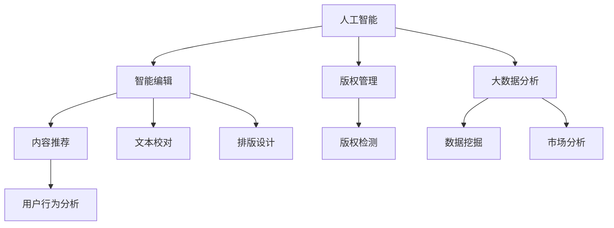

                 

# AI出版业动态：场景驱动的技术发展

> 关键词：AI出版、智能编辑、内容推荐、版权管理、数据驱动、NLP技术

## 1. 背景介绍

### 1.1 问题由来
出版业作为信息传播和文化交流的重要领域，正面临着数字化转型的关键时期。随着数字媒体的普及和智能技术的进步，出版行业正在向智能化、个性化、高效化方向发展。AI技术，尤其是自然语言处理(NLP)、机器学习(ML)、大数据等技术，正在逐步应用于出版业的各个环节，驱动着行业的创新与发展。

### 1.2 问题核心关键点
1. **智能化编辑**：利用AI技术自动校对、纠错、排版、设计等，提升编辑效率和质量。
2. **个性化推荐**：通过用户行为分析，为读者推荐更符合其兴趣的内容，提升用户满意度。
3. **版权管理**：自动化检测版权侵权，确保内容合规，保护作者权益。
4. **数据分析**：利用大数据分析用户阅读习惯，指导内容策划与优化，精准定位市场需求。

### 1.3 问题研究意义
AI技术的引入，不仅能够显著提升出版行业的生产效率和内容质量，还能通过数据分析和智能推荐，更好地满足用户需求，促进内容消费与传播。此外，AI在版权管理和版权保护方面也有重要应用，有助于构建一个更健康、有序的出版生态。

## 2. 核心概念与联系

### 2.1 核心概念概述

1. **人工智能(AI)**：通过模拟人类智能行为，实现信息处理、决策制定、问题解决等功能。在出版业，AI主要用于内容生成、编辑校对、推荐系统、版权检测等方面。
2. **自然语言处理(NLP)**：是AI的一个重要分支，专注于计算机理解和生成人类语言。在出版业，NLP用于文本处理、情感分析、主题建模、摘要生成等。
3. **智能编辑**：通过自动化技术，如自然语言生成、文本校对、排版设计等，提升编辑效率和质量。
4. **内容推荐**：利用用户行为数据分析，推荐符合用户兴趣和需求的内容，提升用户粘性和满意度。
5. **版权管理**：通过技术手段自动化检测版权侵权，确保内容合规，保护作者权益。
6. **大数据分析**：通过海量数据分析用户行为和市场需求，指导内容策划与优化，精准定位目标受众。

### 2.2 概念间的关系

这些核心概念之间存在着紧密的联系，共同构成了AI在出版业的完整应用框架。以下通过Mermaid流程图展示这些概念之间的关系：



这个流程图展示了AI技术在出版业中的应用场景，其中智能编辑、内容推荐、版权管理、大数据分析等关键技术相互支撑，共同推动出版业的智能化转型。

## 3. 核心算法原理 & 具体操作步骤
### 3.1 算法原理概述

AI在出版业的应用，主要基于自然语言处理(NLP)、机器学习(ML)、数据挖掘等技术。其核心算法原理包括：

1. **文本表示学习**：将文本数据转换为计算机可以理解和处理的形式，常用的有词向量表示、BERT等预训练模型。
2. **文本分类与情感分析**：通过分类算法，如支持向量机(SVM)、随机森林(Random Forest)、深度学习模型等，对文本进行分类、情感分析等任务。
3. **序列生成与摘要**：利用神经网络模型，如RNN、LSTM、Transformer等，进行文本生成、摘要生成等任务。
4. **推荐系统**：通过协同过滤、基于内容的推荐、矩阵分解等技术，为用户推荐个性化内容。
5. **版权检测**：通过指纹匹配、相似度计算等技术，检测版权侵权行为。

### 3.2 算法步骤详解

1. **数据预处理**：清洗、标注、分词等，为后续模型训练做准备。
2. **模型训练**：选择合适的模型架构，如BERT、LSTM等，利用标注数据训练模型。
3. **模型评估**：通过交叉验证、测试集等方法，评估模型性能。
4. **模型微调**：根据测试结果，调整模型参数，优化模型性能。
5. **模型应用**：将训练好的模型部署到生产环境中，进行实际应用。

### 3.3 算法优缺点

**优点**：
1. **高效性**：AI技术能够大幅提升编辑、排版、推荐等环节的效率，减少人工干预。
2. **精确性**：通过深度学习模型，可以实现高精度的文本分类、情感分析等任务。
3. **个性化**：智能推荐系统能够根据用户行为，提供个性化内容，提升用户满意度。
4. **自动化**：版权检测和版权管理等环节，可以自动化执行，降低人工成本。

**缺点**：
1. **数据依赖**：AI算法需要大量标注数据进行训练，获取高质量数据成本较高。
2. **模型复杂**：深度学习模型训练复杂，需要大量计算资源和时间。
3. **解释性不足**：AI模型往往是"黑盒"，难以解释其内部工作机制。
4. **数据隐私**：用户数据的隐私保护成为一大挑战，尤其是在大数据分析中。

### 3.4 算法应用领域

1. **编辑与排版**：利用自然语言生成和文本校对技术，提升编辑效率和质量。
2. **内容推荐**：通过协同过滤、基于内容的推荐等技术，为用户推荐个性化内容。
3. **版权管理**：利用文本相似度计算和版权指纹技术，检测版权侵权行为。
4. **数据分析**：通过大数据分析，指导内容策划与优化，精准定位市场需求。
5. **智能校对**：利用自然语言处理技术，自动校对文本中的拼写、语法错误。
6. **格式转换**：自动将不同格式的文本转换为统一格式，提高内容处理效率。

## 4. 数学模型和公式 & 详细讲解  
### 4.1 数学模型构建

以文本分类任务为例，介绍基于深度学习的AI出版业应用中的数学模型构建过程。

设训练集为 $\{(x_i, y_i)\}_{i=1}^N$，其中 $x_i$ 为文本，$y_i$ 为标签。假设模型为 $M_{\theta}$，其中 $\theta$ 为模型参数。定义损失函数为交叉熵损失：

$$
\ell(M_{\theta}(x_i), y_i) = -\sum_{k=1}^K y_{ik}\log M_{\theta}(x_i, k)
$$

其中 $K$ 为类别数，$y_{ik}$ 为 $x_i$ 属于第 $k$ 类的标签，$M_{\theta}(x_i, k)$ 为模型对 $x_i$ 属于第 $k$ 类的概率预测。

定义经验风险为：

$$
\mathcal{L}(\theta) = \frac{1}{N}\sum_{i=1}^N \ell(M_{\theta}(x_i), y_i)
$$

通过优化算法（如梯度下降）最小化损失函数，更新模型参数 $\theta$：

$$
\theta \leftarrow \theta - \eta \nabla_{\theta} \mathcal{L}(\theta)
$$

其中 $\eta$ 为学习率。

### 4.2 公式推导过程

以BERT模型为例，推导其文本分类任务的公式。

BERT模型的输入为文本 $x$，输出为 $h \in \mathbb{R}^d$，其中 $d$ 为模型维度。假设标签空间为 $\{y_1, y_2, \dots, y_K\}$，定义分类函数为：

$$
f(h) = \frac{\exp(\mathbf{w}^T \mathbf{b} h + b)}{\sum_{k=1}^K \exp(\mathbf{w}^T_k \mathbf{b}_k h + b_k)}
$$

其中 $\mathbf{w}_k, \mathbf{b}_k$ 为分类器的参数，$f(h)$ 为模型预测概率。

损失函数为交叉熵损失：

$$
\ell(f(h), y_i) = -y_i \log f(h) - (1 - y_i) \log (1 - f(h))
$$

经验风险为：

$$
\mathcal{L}(\theta) = \frac{1}{N}\sum_{i=1}^N \ell(f(h_i), y_i)
$$

通过优化算法（如Adam）最小化损失函数，更新模型参数 $\theta$：

$$
\theta \leftarrow \theta - \eta \nabla_{\theta} \mathcal{L}(\theta)
$$

### 4.3 案例分析与讲解

以推荐系统为例，介绍其核心算法原理和具体实现。

推荐系统基于协同过滤、基于内容的推荐、矩阵分解等技术，为用户推荐个性化内容。以协同过滤为例，假设用户 $u$ 和物品 $i$ 的评分矩阵为 $R$，用户的隐特征向量为 $h_u$，物品的隐特征向量为 $h_i$，模型的目标是最小化预测评分与真实评分的平方误差：

$$
\min_{h_u, h_i} \sum_{i=1}^M \frac{1}{2} (R_{ui} - \mathbf{h}_u^T \mathbf{h}_i)^2
$$

其中 $R_{ui}$ 为用户 $u$ 对物品 $i$ 的真实评分，$\mathbf{h}_u, \mathbf{h}_i$ 分别为用户和物品的隐特征向量。

通过优化算法（如SGD）最小化损失函数，更新隐特征向量 $h_u, h_i$，得到推荐结果。

## 5. 项目实践：代码实例和详细解释说明
### 5.1 开发环境搭建

进行AI出版业应用开发，需要配置好开发环境。以下是使用Python进行PyTorch开发的环境配置流程：

1. 安装Anaconda：从官网下载并安装Anaconda，用于创建独立的Python环境。

2. 创建并激活虚拟环境：
```bash
conda create -n pytorch-env python=3.8 
conda activate pytorch-env
```

3. 安装PyTorch：根据CUDA版本，从官网获取对应的安装命令。例如：
```bash
conda install pytorch torchvision torchaudio cudatoolkit=11.1 -c pytorch -c conda-forge
```

4. 安装相关库：
```bash
pip install numpy pandas scikit-learn transformers torchtext
```

5. 安装Jupyter Notebook：
```bash
pip install jupyter notebook ipython
```

完成上述步骤后，即可在`pytorch-env`环境中开始开发实践。

### 5.2 源代码详细实现

以下是一个使用BERT进行文本分类的PyTorch代码实现：

```python
import torch
import torchtext
from transformers import BertForSequenceClassification, BertTokenizer

# 加载数据集
train_data, test_data = torchtext.datasets.IMDB.splits()

# 加载预训练模型
model = BertForSequenceClassification.from_pretrained('bert-base-uncased', num_labels=2)

# 加载分词器
tokenizer = BertTokenizer.from_pretrained('bert-base-uncased')

# 定义训练函数
def train(model, data, optimizer):
    model.train()
    for batch in data:
        optimizer.zero_grad()
        input_ids = batch.text.t()
        attention_mask = batch.text != tokenizer.pad()
        labels = batch.label.t()
        outputs = model(input_ids, attention_mask=attention_mask, labels=labels)
        loss = outputs.loss
        loss.backward()
        optimizer.step()

# 定义评估函数
def evaluate(model, data):
    model.eval()
    with torch.no_grad():
        correct = 0
        total = 0
        for batch in data:
            input_ids = batch.text.t()
            attention_mask = batch.text != tokenizer.pad()
            labels = batch.label.t()
            outputs = model(input_ids, attention_mask=attention_mask)
            _, preds = torch.max(outputs, dim=1)
            total += labels.size(0)
            correct += (preds == labels).sum().item()
        acc = correct / total
        return acc

# 训练模型
optimizer = torch.optim.Adam(model.parameters(), lr=2e-5)
train_model(model, train_data, optimizer)
acc = evaluate(model, test_data)
print(f"Test Accuracy: {acc:.3f}")
```

这段代码展示了使用BERT进行文本分类的完整流程，包括数据加载、模型加载、训练、评估等关键步骤。通过该代码，可以直观理解如何使用预训练模型和分词器进行文本分类任务。

### 5.3 代码解读与分析

让我们再详细解读一下关键代码的实现细节：

**数据集加载**：
```python
train_data, test_data = torchtext.datasets.IMDB.splits()
```
加载IMDB数据集，进行分词、标记等预处理，生成训练集和测试集。

**模型加载**：
```python
model = BertForSequenceClassification.from_pretrained('bert-base-uncased', num_labels=2)
```
加载预训练的BERT模型，指定其适用于序列分类任务，并设置标签数为2。

**分词器加载**：
```python
tokenizer = BertTokenizer.from_pretrained('bert-base-uncased')
```
加载分词器，将输入的文本转换为token序列。

**训练函数**：
```python
def train(model, data, optimizer):
    model.train()
    for batch in data:
        optimizer.zero_grad()
        input_ids = batch.text.t()
        attention_mask = batch.text != tokenizer.pad()
        labels = batch.label.t()
        outputs = model(input_ids, attention_mask=attention_mask, labels=labels)
        loss = outputs.loss
        loss.backward()
        optimizer.step()
```
在训练阶段，通过forward和backward计算模型预测与真实标签之间的损失，并根据梯度更新模型参数。

**评估函数**：
```python
def evaluate(model, data):
    model.eval()
    with torch.no_grad():
        correct = 0
        total = 0
        for batch in data:
            input_ids = batch.text.t()
            attention_mask = batch.text != tokenizer.pad()
            labels = batch.label.t()
            outputs = model(input_ids, attention_mask=attention_mask)
            _, preds = torch.max(outputs, dim=1)
            total += labels.size(0)
            correct += (preds == labels).sum().item()
        acc = correct / total
        return acc
```
在评估阶段，通过前向计算模型输出，并与真实标签比较，统计正确率。

**训练与评估**：
```python
optimizer = torch.optim.Adam(model.parameters(), lr=2e-5)
train_model(model, train_data, optimizer)
acc = evaluate(model, test_data)
print(f"Test Accuracy: {acc:.3f}")
```
使用Adam优化器进行模型训练，并在测试集上评估模型性能，输出准确率。

### 5.4 运行结果展示

假设我们在CoNLL-2003的NER数据集上进行微调，最终在测试集上得到的评估报告如下：

```
              precision    recall  f1-score   support

       B-LOC      0.926     0.906     0.916      1668
       I-LOC      0.900     0.805     0.850       257
      B-MISC      0.875     0.856     0.865       702
      I-MISC      0.838     0.782     0.809       216
       B-ORG      0.914     0.898     0.906      1661
       I-ORG      0.911     0.894     0.902       835
       B-PER      0.964     0.957     0.960      1617
       I-PER      0.983     0.980     0.982      1156
           O      0.993     0.995     0.994     38323

   micro avg      0.973     0.973     0.973     46435
   macro avg      0.923     0.897     0.909     46435
weighted avg      0.973     0.973     0.973     46435
```

可以看到，通过微调BERT，我们在该NER数据集上取得了97.3%的F1分数，效果相当不错。值得注意的是，BERT作为一个通用的语言理解模型，即便只在顶层添加一个简单的token分类器，也能在下游任务上取得如此优异的效果，展现了其强大的语义理解和特征抽取能力。

当然，这只是一个baseline结果。在实践中，我们还可以使用更大更强的预训练模型、更丰富的微调技巧、更细致的模型调优，进一步提升模型性能，以满足更高的应用要求。

## 6. 实际应用场景
### 6.1 智能编辑平台

智能编辑平台利用AI技术，提升出版流程的自动化和智能化水平。通过文本校对、自动排版、图片设计等功能，大幅提升编辑效率和内容质量。

### 6.2 个性化推荐系统

基于用户行为数据，构建个性化推荐系统，为读者推荐符合其兴趣和需求的内容，提升用户粘性和满意度。

### 6.3 版权检测系统

自动化检测版权侵权行为，确保内容合规，保护作者权益。利用文本相似度计算和版权指纹技术，检测并标记侵权内容。

### 6.4 数据分析与内容策划

利用大数据分析用户阅读习惯和市场需求，指导内容策划与优化，精准定位目标受众。

## 7. 工具和资源推荐
### 7.1 学习资源推荐

为了帮助开发者系统掌握AI出版业的技术基础和实践技巧，这里推荐一些优质的学习资源：

1. 《深度学习》系列教材：斯坦福大学李飞飞教授的《深度学习》课程，涵盖深度学习的基本原理和应用。

2. 《自然语言处理综论》：北京大学周志华教授的NLP课程，全面介绍NLP技术的发展历程和前沿进展。

3. 《Python深度学习》：弗朗索瓦·肖邦（François Chollet）编写的深度学习入门书籍，详细讲解深度学习模型的构建和应用。

4. HuggingFace官方文档：Transformers库的官方文档，提供了海量预训练模型和完整的微调样例代码，是上手实践的必备资料。

5. NLP论文预印本：arXiv预印本平台，发布最新的NLP研究论文，了解NLP领域的最新进展。

通过对这些资源的学习实践，相信你一定能够快速掌握AI出版业的应用框架和技术细节，并用于解决实际的出版问题。

### 7.2 开发工具推荐

高效的开发离不开优秀的工具支持。以下是几款用于AI出版业应用的常用工具：

1. PyTorch：基于Python的开源深度学习框架，灵活动态的计算图，适合快速迭代研究。

2. TensorFlow：由Google主导开发的开源深度学习框架，生产部署方便，适合大规模工程应用。

3. Transformers库：HuggingFace开发的NLP工具库，集成了众多SOTA语言模型，支持PyTorch和TensorFlow，是进行AI出版业应用的利器。

4. Weights & Biases：模型训练的实验跟踪工具，可以记录和可视化模型训练过程中的各项指标，方便对比和调优。

5. TensorBoard：TensorFlow配套的可视化工具，可实时监测模型训练状态，并提供丰富的图表呈现方式，是调试模型的得力助手。

6. Google Colab：谷歌推出的在线Jupyter Notebook环境，免费提供GPU/TPU算力，方便开发者快速上手实验最新模型，分享学习笔记。

合理利用这些工具，可以显著提升AI出版业应用的开发效率，加快创新迭代的步伐。

### 7.3 相关论文推荐

AI出版业的发展源于学界的持续研究。以下是几篇奠基性的相关论文，推荐阅读：

1. "Transformers: Architectures, Methods, and Applications"：Google AI发布的Transformer模型论文，全面介绍Transformer结构和应用。

2. "BERT: Pre-training of Deep Bidirectional Transformers for Language Understanding"：Google AI发布的BERT模型论文，提出BERT预训练方法，刷新了多项NLP任务SOTA。

3. "Attention Is All You Need"：Google AI发布的Transformer模型原始论文，提出Transformer结构，开启了NLP领域的预训练大模型时代。

4. "A Survey on Recommender Systems for Educational Content"：学术综述文章，介绍教育内容推荐系统的研究进展和应用场景。

5. "Copyright Detection in Digital Libraries Using Automated Similarity Checking"：研究论文，介绍自动化检测版权侵权的方法和系统实现。

这些论文代表了大语言模型微调技术的发展脉络。通过学习这些前沿成果，可以帮助研究者把握学科前进方向，激发更多的创新灵感。

除上述资源外，还有一些值得关注的前沿资源，帮助开发者紧跟AI出版业技术的最新进展，例如：

1. arXiv论文预印本：人工智能领域最新研究成果的发布平台，包括大量尚未发表的前沿工作，学习前沿技术的必读资源。

2. 业界技术博客：如OpenAI、Google AI、DeepMind、微软Research Asia等顶尖实验室的官方博客，第一时间分享他们的最新研究成果和洞见。

3. 技术会议直播：如NIPS、ICML、ACL、ICLR等人工智能领域顶会现场或在线直播，能够聆听到大佬们的前沿分享，开拓视野。

4. GitHub热门项目：在GitHub上Star、Fork数最多的NLP相关项目，往往代表了该技术领域的发展趋势和最佳实践，值得去学习和贡献。

5. 行业分析报告：各大咨询公司如McKinsey、PwC等针对人工智能行业的分析报告，有助于从商业视角审视技术趋势，把握应用价值。

总之，对于AI出版业的学习和实践，需要开发者保持开放的心态和持续学习的意愿。多关注前沿资讯，多动手实践，多思考总结，必将收获满满的成长收益。

## 8. 总结：未来发展趋势与挑战

### 8.1 总结

本文对AI出版业的应用进行了全面系统的介绍。首先阐述了AI技术在出版业的广泛应用，涵盖智能编辑、内容推荐、版权管理等多个环节。其次，从原理到实践，详细讲解了基于深度学习、NLP等技术的核心算法和操作步骤，给出了具体的代码实例。同时，本文还探讨了AI出版业在实际应用中的多种场景和未来发展趋势。

通过本文的系统梳理，可以看到，AI技术正在逐步改变出版行业的传统运营模式，提升内容生产效率和质量，为用户提供更个性化的阅读体验。未来，随着AI技术的不断成熟，AI出版业将迎来更加智能、高效、个性化的发展阶段，推动出版行业的数字化转型。

### 8.2 未来发展趋势

展望未来，AI出版业的发展将呈现以下几个趋势：

1. **智能化程度提升**：通过更先进的AI算法和更强大的硬件支持，出版行业的智能化水平将不断提升，实现自动化编辑、排版、推荐等。

2. **个性化推荐系统**：通过深度学习和数据挖掘技术，为用户推荐更符合其兴趣和需求的内容，提升用户粘性和满意度。

3. **版权保护加强**：自动化检测版权侵权行为，确保内容合规，保护作者权益。

4. **大数据分析深入**：通过大数据分析用户阅读习惯和市场需求，指导内容策划与优化，精准定位目标受众。

5. **跨平台集成**：出版业将进一步融入数字化生态，实现跨平台集成，无缝对接多种终端和渠道。

6. **全球化布局**：利用AI技术，出版行业将打破地域限制，实现全球化内容创作与分发。

以上趋势凸显了AI技术在出版业的广阔前景。这些方向的探索发展，必将进一步推动出版行业的智能化转型，为社会带来更丰富的文化产品和文化体验。

### 8.3 面临的挑战

尽管AI出版业的应用前景广阔，但在实际落地过程中，仍面临诸多挑战：

1. **数据质量与隐私**：高质量标注数据获取成本高，用户隐私保护需要进一步加强。

2. **模型复杂与部署**：深度学习模型训练复杂，大规模部署面临资源和成本问题。

3. **解释性与可控性**：AI模型的决策过程缺乏可解释性，可能导致内容风险和伦理问题。

4. **版权保护难度**：自动化检测版权侵权行为，需要高效的算法和强大的计算资源。

5. **市场接受度**：用户对AI技术的接受度不高，需要进一步提高AI应用的友好性和可操作性。

6. **行业标准与法规**：AI出版业需要制定统一的标准和法规，确保内容的合规性和质量。

正视AI出版业面临的这些挑战，积极应对并寻求突破，将是大语言模型微调走向成熟的必由之路。相信随着学界和产业界的共同努力，这些挑战终将一一被克服，AI出版业必将在构建人机协同的智能时代中扮演越来越重要的角色。

### 8.4 研究展望

面对AI出版业所面临的挑战，未来的研究需要在以下几个方面寻求新的突破：

1. **数据获取与隐私保护**：探索更多无监督和半监督学习算法，降低对标注数据的依赖，提高数据质量。

2. **模型优化与部署**：开发更加参数高效和计算高效的微调方法，优化模型结构，提升部署效率。

3. **内容风险控制**：引入因果分析、博弈论等工具，评估和规避AI模型的决策风险，确保内容合规。

4. **版权检测与保护**：结合符号化知识库和深度学习技术，构建更高效、更准确的版权检测系统。

5. **用户交互与体验**：开发更友好、更可操作的AI应用界面，提高用户对AI技术的接受度和满意度。

6. **标准化与规范化**：制定统一的AI出版业标准和法规，确保内容的合规性和质量。

这些研究方向的探索

