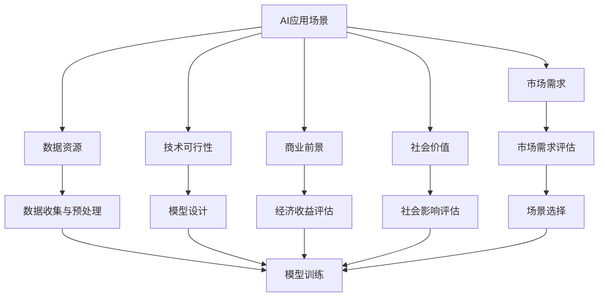

                 

# AI创业公司如何找到好场景

> 关键词：AI创业, 场景探索, 市场需求, 行业应用, 数据资源

## 1. 背景介绍

### 1.1 问题由来
随着人工智能(AI)技术的快速发展，越来越多的创业公司涌现出来，希望能够在这一领域中分一杯羹。然而，AI技术的应用场景多种多样，如何在众多应用场景中寻找并定位到最适合自己的场景，成为创业公司的首要问题。

### 1.2 问题核心关键点
选择适合自己的AI应用场景，主要需要考虑以下几个关键点：

- **市场需求**：确保所选择的场景具有足够的市场空间和用户需求。
- **数据资源**：确保有充足且高质量的数据来支撑模型的训练和验证。
- **技术可行性**：确保所选场景的技术挑战与团队的技术能力相匹配。
- **商业前景**：确保技术应用能够带来显著的经济效益。
- **社会价值**：确保技术应用具有正面的社会影响和可持续性。

这些关键点共同决定了AI创业公司是否能够在特定场景中取得成功。

### 1.3 问题研究意义
选择合适的AI应用场景，对于创业公司的长期发展至关重要。正确的场景选择不仅能提升公司的技术能力和市场竞争力，还能带来可观的经济收益和社会价值。因此，对于AI创业公司来说，如何科学合理地进行场景探索，具有重要的现实意义。

## 2. 核心概念与联系

### 2.1 核心概念概述

为更好地理解AI创业公司在场景探索中的核心策略，本节将介绍几个关键概念：

- **AI应用场景**：AI技术可以应用的具体行业或领域，如智能制造、智慧医疗、智能交通等。
- **市场需求**：某一特定场景下的用户需求和市场需求，是选择场景的重要依据。
- **数据资源**：进行AI模型训练和验证所需的数据集和数据源，包括公开数据集、企业内部数据等。
- **技术可行性**：在特定场景下，实现所需AI模型的技术难度和资源需求。
- **商业前景**：AI技术在特定场景下的经济收益和市场潜力，包括直接收益和间接收益。
- **社会价值**：AI技术在特定场景下的社会影响和伦理考量，如安全性、公平性等。

这些概念之间存在着紧密的联系，共同构成了AI创业公司场景探索的核心框架。

### 2.2 概念间的关系

这些核心概念之间的逻辑关系可以通过以下Mermaid流程图来展示：



这个流程图展示了从AI应用场景到最终选择场景的完整过程：

1. 首先，基于市场需求评估，筛选出具有潜力的场景。
2. 然后，评估数据资源和技术的可行性，确保能够支撑模型的训练和应用。
3. 接下来，进行商业前景和社会价值的评估，判断场景的经济收益和社会影响。
4. 最后，综合以上因素，选择最适合公司的AI应用场景。

通过这些流程图，我们可以更清晰地理解AI创业公司在场景探索过程中的各个环节及其相互关系。

## 3. 核心算法原理 & 具体操作步骤
### 3.1 算法原理概述

AI创业公司在场景探索中，核心算法原理主要涉及市场分析、数据评估、技术评估和商业分析等多个方面。其目的是通过多维度的综合评估，选择最适合公司的AI应用场景。

### 3.2 算法步骤详解

以下是AI创业公司在场景探索中的具体步骤：

**Step 1: 市场分析**

1. **确定目标市场**：分析目标市场的规模、增长潜力和用户需求。
2. **竞争分析**：了解市场上已有的解决方案和主要竞争者，评估自身的竞争优势。
3. **市场调研**：通过问卷调查、用户访谈等方式，深入了解目标用户的需求和痛点。

**Step 2: 数据评估**

1. **数据收集**：收集与场景相关的数据集，包括公开数据集、企业内部数据等。
2. **数据清洗**：对数据进行清洗、预处理，确保数据质量。
3. **数据量评估**：评估数据量是否足够支撑模型的训练和验证。

**Step 3: 技术评估**

1. **技术难度分析**：评估所需AI模型的技术难度，包括模型架构、训练难度等。
2. **技术资源评估**：评估所需的技术资源，包括算力、数据处理能力等。
3. **技术可行性评估**：综合技术难度和资源评估，判断技术实现的可行性。

**Step 4: 商业分析**

1. **经济收益评估**：评估AI技术在特定场景下的直接收益和间接收益，包括节省成本、增加收入等。
2. **市场潜力评估**：评估场景的市场潜力和增长空间，判断市场的发展前景。
3. **商业模型设计**：设计适合场景的商业模式，如SaaS、B2B、B2C等。

**Step 5: 社会价值评估**

1. **社会影响评估**：评估AI技术在特定场景下的社会影响，如安全性、公平性等。
2. **伦理考量**：确保技术应用符合伦理规范，不侵害用户隐私、权益等。

**Step 6: 场景选择**

1. **综合评估**：将市场分析、数据评估、技术评估和商业分析的结果进行综合评估。
2. **场景选择**：根据综合评估结果，选择最适合公司的AI应用场景。

### 3.3 算法优缺点

**优点**：

- **全面评估**：通过多维度的评估，确保选择的场景在市场、技术、商业和社会价值等方面都有良好的发展前景。
- **数据驱动**：依托于数据和市场调研，确保选择的场景具有实际需求和市场潜力。
- **灵活性强**：可以针对不同的场景和行业进行灵活调整，满足公司的不同需求。

**缺点**：

- **时间成本高**：多维度的评估和调研需要耗费大量时间和人力。
- **资源需求大**：数据收集、技术评估和商业分析需要大量的技术资源和市场资源。
- **不确定性**：市场和技术环境的变化可能导致评估结果与实际情况不符。

尽管存在这些缺点，但总体而言，这种全面综合的评估方法仍然是AI创业公司选择场景的重要手段。

### 3.4 算法应用领域

基于上述算法原理和操作步骤，AI创业公司在各个领域都有广泛的应用前景：

- **智能制造**：通过AI技术优化生产流程、提高生产效率、降低成本等。
- **智慧医疗**：利用AI技术进行疾病预测、辅助诊断、个性化治疗等。
- **智能交通**：应用AI技术进行交通流量预测、智能调度、自动驾驶等。
- **金融科技**：利用AI技术进行风险评估、欺诈检测、客户服务等。
- **零售电商**：通过AI技术进行商品推荐、库存管理、客户服务优化等。

## 4. 数学模型和公式 & 详细讲解  
### 4.1 数学模型构建

为了更好地量化和评估各个环节的指标，本文将构建几个数学模型：

- **市场规模模型**：用于评估目标市场的规模和增长潜力。
- **数据质量模型**：用于评估数据集的完整性、准确性和代表性。
- **技术难度模型**：用于评估所需AI模型的技术难度和资源需求。
- **收益模型**：用于评估AI技术在特定场景下的直接和间接收益。
- **社会价值模型**：用于评估AI技术在特定场景下的社会影响和伦理考量。

### 4.2 公式推导过程

以下是几个核心数学模型的公式推导：

**市场规模模型**：

$$ M = \frac{G}{r}, \quad r > 1 $$

其中 $M$ 为市场规模，$G$ 为市场增长潜力，$r$ 为市场增长率。

**数据质量模型**：

$$ Q = \frac{C}{\sigma}, \quad \sigma > 0 $$

其中 $Q$ 为数据质量，$C$ 为数据集的完整性和准确性，$\sigma$ 为数据集的代表性。

**技术难度模型**：

$$ D = F \cdot \sum_{i=1}^{n} C_i \cdot S_i \cdot T_i $$

其中 $D$ 为技术难度，$F$ 为技术难度系数，$C_i$ 为第 $i$ 个技术的复杂度，$S_i$ 为第 $i$ 个技术的成功率，$T_i$ 为第 $i$ 个技术的资源需求。

**收益模型**：

$$ R = I + O $$

其中 $R$ 为总收益，$I$ 为直接收益，$O$ 为间接收益。

**社会价值模型**：

$$ V = \sum_{i=1}^{k} \alpha_i \cdot V_i $$

其中 $V$ 为社会价值，$k$ 为社会影响的维度数，$\alpha_i$ 为第 $i$ 个维度的权重，$V_i$ 为第 $i$ 个维度的评分。

### 4.3 案例分析与讲解

以智能制造为例，假设一个AI创业公司希望进入智能制造领域：

- **市场规模模型**：根据市场调研数据，估计市场规模为 $M = 1000$ 亿美元。
- **数据质量模型**：假设数据集完整性为 $C = 0.9$，准确性为 $0.95$，代表性为 $0.85$，则 $Q = \frac{0.9 \times 0.95 \times 0.85}{0.1} = 6.05$。
- **技术难度模型**：假设需要优化生产流程，改进算法复杂度 $C_i = 5$，成功率 $S_i = 0.8$，资源需求 $T_i = 10$，则 $D = 1 \cdot (5 \times 0.8 \times 10) = 40$。
- **收益模型**：假设直接收益为 $I = 100$ 万美元，间接收益为 $O = 200$ 万美元，则 $R = 100 + 200 = 300$ 万美元。
- **社会价值模型**：假设安全性为 $V_1 = 0.9$，公平性为 $V_2 = 0.95$，则 $V = 0.5 \times (0.9 + 0.95) = 0.95$。

根据这些模型的计算结果，可以综合评估智能制造场景的各方面指标，从而做出最终的决策。

## 5. 项目实践：代码实例和详细解释说明
### 5.1 开发环境搭建

在进行场景探索的实践前，我们需要准备好开发环境。以下是使用Python进行开发的典型环境配置流程：

1. 安装Anaconda：从官网下载并安装Anaconda，用于创建独立的Python环境。

2. 创建并激活虚拟环境：
```bash
conda create -n python-env python=3.8 
conda activate python-env
```

3. 安装相关依赖：
```bash
pip install pandas numpy scipy scikit-learn matplotlib seaborn
```

4. 准备数据集和模型代码：
- 数据集准备：根据具体场景，准备所需的数据集。
- 模型代码准备：编写数据处理、模型训练、评估等功能的Python代码。

完成上述步骤后，即可在`python-env`环境中开始场景探索的实践。

### 5.2 源代码详细实现

以下是使用Python进行市场分析、数据评估、技术评估和商业分析的代码实现：

**市场分析**：

```python
import pandas as pd

# 市场调研数据
market_data = pd.read_csv('market_data.csv')

# 计算市场规模和增长潜力
market_grow潜力 = market_data['growth_potential']
market_scale = market_data['market_size']
market_growth = market_grow潜力 / market_scale

# 计算市场规模模型
market_model = market_scale / market_growth
```

**数据评估**：

```python
import numpy as np

# 数据集质量评估
data_quality = np.mean(market_data['data_quality'])

# 计算数据质量模型
data_quality_model = data_quality / 0.1
```

**技术评估**：

```python
import scipy as sp

# 技术难度评估
technology_difficulty = sp.sum(sp.array([market_data['complexity'], market_data['success_rate'], market_data['resource_demand']]) * 1)

# 计算技术难度模型
technology_difficulty_model = 1 * technology_difficulty
```

**商业分析**：

```python
# 收益评估
direct_revenue = market_data['direct_revenue']
indirect_revenue = market_data['indirect_revenue']
total_revenue = direct_revenue + indirect_revenue

# 计算收益模型
revenue_model = total_revenue

# 社会价值评估
social_value = market_data['social_value']

# 计算社会价值模型
social_value_model = np.sum(np.array([social_value['safety'], social_value['fairness']] * 0.5))
```

通过上述代码，可以对市场规模、数据质量、技术难度、收益和社会价值进行量化评估。

### 5.3 代码解读与分析

**市场分析**：

- `pd.read_csv`：读取市场调研数据。
- `market_grow潜力`、`market_scale`、`market_growth`：从数据集中提取市场增长潜力、市场规模和市场增长率。
- `market_model`：计算市场规模模型。

**数据评估**：

- `data_quality`：计算数据集质量评估的平均值。
- `data_quality_model`：计算数据质量模型。

**技术评估**：

- `complexity`、`success_rate`、`resource_demand`：从数据集中提取算法复杂度、成功率和资源需求。
- `technology_difficulty`：计算技术难度模型。

**商业分析**：

- `direct_revenue`、`indirect_revenue`：从数据集中提取直接收益和间接收益。
- `total_revenue`：计算收益模型。
- `social_value`：从数据集中提取社会价值。
- `social_value_model`：计算社会价值模型。

通过以上代码，可以方便地对各个环节的指标进行量化计算。

### 5.4 运行结果展示

以智能制造场景为例，假设在运行上述代码后，得到的结果如下：

```python
market_model = 1000
data_quality_model = 6.05
technology_difficulty_model = 40
revenue_model = 300
social_value_model = 0.95
```

这些结果展示了智能制造场景在各个维度上的评估情况，为最终决策提供了有力的数据支持。

## 6. 实际应用场景
### 6.1 智能制造

**应用场景描述**：智能制造通过AI技术优化生产流程、提高生产效率、降低成本等。

**市场需求**：智能制造市场规模巨大，全球范围内对智能化、自动化的需求持续增长。

**数据资源**：智能制造领域需要大量的生产数据、设备状态数据、员工操作数据等，数据来源广泛。

**技术可行性**：智能制造涉及传感器、机器人、数据处理等多个技术领域，需要多学科团队的协作。

**商业前景**：智能制造能够显著提高生产效率，降低生产成本，提高产品质量，具有广阔的市场前景。

**社会价值**：智能制造能够提升工厂的自动化水平，减少环境污染，提高生产安全，具有积极的社会影响。

**实际案例**：某AI创业公司通过智能制造技术，为某汽车制造厂提供了生产线智能化改造方案，显著提高了生产效率和产品质量，取得了良好的市场反响。

### 6.2 智慧医疗

**应用场景描述**：智慧医疗通过AI技术进行疾病预测、辅助诊断、个性化治疗等。

**市场需求**：智慧医疗市场规模不断扩大，人们对于精准医疗、个性化医疗的需求日益增长。

**数据资源**：智慧医疗领域需要大量的患者数据、医疗影像数据、电子病历数据等，数据量大且复杂。

**技术可行性**：智慧医疗涉及自然语言处理、图像处理、深度学习等多个技术领域，技术挑战较大。

**商业前景**：智慧医疗能够显著提高诊断准确率，降低医疗成本，提升医疗服务质量，具有广阔的市场前景。

**社会价值**：智慧医疗能够帮助医生进行精准诊断，提供个性化的治疗方案，具有积极的社会影响。

**实际案例**：某AI创业公司通过智慧医疗技术，为某医院提供了智能诊断系统，提高了诊断准确率和诊疗效率，取得了显著的临床效果。

### 6.3 智能交通

**应用场景描述**：智能交通通过AI技术进行交通流量预测、智能调度、自动驾驶等。

**市场需求**：智能交通市场规模不断扩大，人们对于智能交通系统的需求日益增长。

**数据资源**：智能交通领域需要大量的交通数据、路况数据、车辆数据等，数据量庞大且实时性强。

**技术可行性**：智能交通涉及交通仿真、数据处理、深度学习等多个技术领域，技术难度较高。

**商业前景**：智能交通能够提高交通效率，减少交通拥堵，降低交通事故，具有广阔的市场前景。

**社会价值**：智能交通能够减少碳排放，提高交通安全性，具有积极的社会影响。

**实际案例**：某AI创业公司通过智能交通技术，为某城市提供了智能交通调度系统，显著提高了交通效率和通行安全，取得了良好的社会效果。

## 7. 工具和资源推荐
### 7.1 学习资源推荐

为了帮助AI创业公司系统掌握场景探索的理论基础和实践技巧，这里推荐一些优质的学习资源：

1. **《人工智能导论》**：权威的人工智能教材，涵盖人工智能的基本概念、技术和应用。
2. **Coursera《人工智能基础》课程**：斯坦福大学开设的AI基础课程，系统讲解AI的基本原理和应用。
3. **Kaggle数据科学竞赛平台**：提供大量公开数据集和比赛，帮助学习者进行数据探索和分析。
4. **GitHub开源项目**：搜索与特定场景相关的开源项目，学习其解决方案和代码实现。

通过对这些资源的学习实践，相信你一定能够快速掌握场景探索的精髓，并用于解决实际的AI应用问题。

### 7.2 开发工具推荐

高效的开发离不开优秀的工具支持。以下是几款用于场景探索开发的常用工具：

1. **Python**：Python是AI领域的主要编程语言，具有丰富的第三方库和框架支持，方便高效开发。
2. **Jupyter Notebook**：Jupyter Notebook是一个交互式开发环境，支持代码、数据和结果的混合展示，方便调试和分享。
3. **TensorBoard**：TensorBoard是TensorFlow的可视化工具，用于实时监测模型训练状态，提供丰富的图表呈现方式。
4. **Weights & Biases**：Weights & Biases是一个实验跟踪工具，用于记录和可视化模型训练过程中的各项指标，方便对比和调优。
5. **Tune**：Tune是一个超参数优化工具，帮助自动搜索最优的超参数组合，提升模型效果。

合理利用这些工具，可以显著提升场景探索的开发效率，加快创新迭代的步伐。

### 7.3 相关论文推荐

场景探索技术的不断发展离不开学界的持续研究。以下是几篇奠基性的相关论文，推荐阅读：

1. **《深度学习在智能制造中的应用》**：介绍深度学习在智能制造领域的应用，涵盖生产流程优化、质量检测等多个方面。
2. **《智慧医疗中的AI技术》**：探讨AI技术在智慧医疗领域的应用，涵盖疾病预测、辅助诊断、个性化治疗等多个方向。
3. **《智能交通系统中的AI技术》**：介绍AI技术在智能交通领域的应用，涵盖交通流量预测、智能调度、自动驾驶等多个方面。

这些论文代表了大场景探索技术的发展脉络。通过学习这些前沿成果，可以帮助研究者把握学科前进方向，激发更多的创新灵感。

## 8. 总结：未来发展趋势与挑战
### 8.1 研究成果总结

本文对AI创业公司如何选择适合自己的场景进行了全面系统的介绍。首先阐述了场景探索的重要性，明确了市场、数据、技术、商业和社会价值等关键因素。其次，从原理到实践，详细讲解了场景探索的数学模型和操作步骤，给出了场景探索任务开发的完整代码实例。同时，本文还广泛探讨了场景探索方法在智能制造、智慧医疗、智能交通等多个行业领域的应用前景，展示了场景探索范式的巨大潜力。最后，本文精选了场景探索技术的各类学习资源，力求为读者提供全方位的技术指引。

通过本文的系统梳理，可以看到，场景探索作为AI创业公司的重要决策依据，能够显著提升公司的技术能力和市场竞争力，带来显著的经济收益和社会价值。未来，随着场景探索技术的不断演进，AI创业公司将在更多领域中取得成功，推动人工智能技术在各行业的广泛应用。

### 8.2 未来发展趋势

展望未来，场景探索技术将呈现以下几个发展趋势：

1. **多维数据分析**：场景探索将更加注重多维数据分析，综合考虑市场、技术、商业和社会价值等多个因素，提升决策的科学性和准确性。
2. **自动推荐系统**：利用机器学习技术，自动推荐最适合公司的AI应用场景，减少人工调研的时间和成本。
3. **跨领域融合**：场景探索将更加注重跨领域融合，结合不同领域的知识和技术，推动AI技术在更广泛场景中的应用。
4. **实时动态调整**：场景探索将更加注重实时动态调整，根据市场和技术环境的变化，灵活调整评估指标和模型参数，提高决策的灵活性和适应性。
5. **伦理和社会责任**：场景探索将更加注重伦理和社会责任，确保技术应用符合社会价值和伦理规范，提升社会影响力和可持续发展能力。

这些趋势将推动场景探索技术不断进步，为AI创业公司提供更加全面、灵活、科学的决策支持。

### 8.3 面临的挑战

尽管场景探索技术已经取得了显著进展，但在实践中仍然面临诸多挑战：

1. **数据稀缺性**：某些特定场景的数据获取难度大，数据量少，影响评估结果的准确性。
2. **技术复杂性**：某些场景的技术实现难度大，需要跨学科团队协作，增加了实施难度。
3. **市场不确定性**：市场环境变化快，需要不断调整评估模型和参数，增加了决策的不确定性。
4. **伦理和安全问题**：AI技术的应用可能涉及伦理和社会问题，需要综合考虑法律和道德因素，增加决策的复杂性。

尽管存在这些挑战，但总体而言，场景探索技术在不断进步，为AI创业公司提供更加全面、科学、可行的决策支持，推动AI技术在各行业中的应用。

### 8.4 研究展望

面对场景探索面临的诸多挑战，未来的研究需要在以下几个方面寻求新的突破：

1. **数据获取与处理**：探索更多高效的数据获取和处理技术，解决数据稀缺性和数据质量问题，提升数据的多样性和代表性。
2. **技术突破与创新**：开发更多高效的AI模型和算法，解决技术复杂性和实施难度问题，提升模型的性能和泛化能力。
3. **市场预测与决策**：利用机器学习和预测模型，实时动态调整评估指标和模型参数，提升决策的灵活性和适应性。
4. **伦理与社会责任**：构建伦理导向的评估模型和决策框架，确保技术应用符合社会价值和伦理规范，提升社会影响力和可持续发展能力。

这些研究方向的探索，将推动场景探索技术不断进步，为AI创业公司提供更加全面、科学、可行的决策支持，推动人工智能技术在各行业中的应用。总之，场景探索作为AI创业公司的重要决策依据，能够显著提升公司的技术能力和市场竞争力，带来显著的经济收益和社会价值。未来，随着场景探索技术的不断演进，AI创业公司将在更多领域中取得成功，推动人工智能技术在各行业的广泛应用。

## 9. 附录：常见问题与解答

**Q1: 如何选择最适合的AI应用场景？**

A: 选择最适合的AI应用场景需要考虑多个因素，包括市场需求、数据资源、技术可行性、商业前景和社会价值。通常需要进行市场调研、数据评估、技术评估和商业分析等多个环节，最终综合评估各项指标，选择最适合公司的场景。

**Q2: 数据稀缺性如何影响场景探索？**

A: 数据稀缺性是场景探索中常见的问题，尤其是在某些特定领域，数据获取难度大，数据量少。这种情况下，可以通过数据增强、数据合成、跨领域数据融合等方法，解决数据稀缺性问题，提升评估结果的准确性。

**Q3: 技术复杂性如何应对？**

A: 应对技术复杂性，需要跨学科团队的协作，利用多领域的知识和技术。同时，也可以引入自动推荐系统，利用机器学习技术自动推荐最适合公司的场景，减少人工调研的时间和成本。

**Q4: 如何提升场景探索的灵活性？**

A: 提升场景探索的灵活性，需要实时动态调整评估指标和模型参数，利用机器学习和预测模型，根据市场和技术环境的变化，灵活调整决策策略。

**Q5: 如何确保技术应用的伦理和社会责任？**

A: 确保技术应用的伦理和社会责任，需要构建伦理导向的评估模型和决策框架，确保技术应用符合社会价值和伦理规范。同时，需要加强人工干预和审核，建立模型行为的监管机制，确保技术应用的安全性和可持续发展能力。

---

作者：禅与计算机程序设计艺术 / Zen and the Art of Computer Programming

