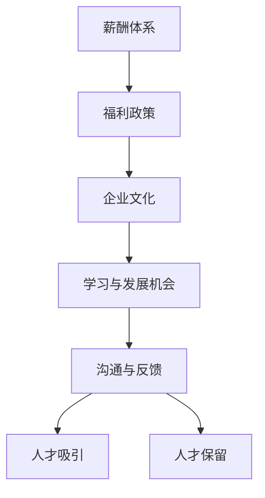

                 

# AI创业公司的人才吸引与保留策略

在科技快速发展的今天，人工智能（AI）已成为众多创业公司竞争的焦点。人才是AI创业公司的核心竞争力，如何吸引和保留顶尖人才，是决定公司成败的关键。本文将从人才吸引和人才保留两方面，全面剖析AI创业公司的人才策略，并提供实用的建议和指导。

## 1. 背景介绍

### 1.1 问题由来
随着人工智能技术的不断发展，AI创业公司如雨后春笋般涌现。但面对激烈的人才市场竞争，许多创业公司常常面临招聘难、人才流失率高的问题。这不仅影响了公司的短期发展，更从根本上制约了企业的长期竞争力。因此，如何制定科学的人才吸引与保留策略，成为创业公司亟待解决的重要课题。

### 1.2 问题核心关键点
AI创业公司的人才吸引与保留策略主要包括：
1. 如何构建有吸引力的薪酬体系。
2. 如何设计具有竞争力的福利政策。
3. 如何营造良好的企业文化。
4. 如何提供持续的学习与职业发展机会。
5. 如何保持与人才的长期有效沟通。

这些关键点相互关联，共同构成AI创业公司人才策略的核心框架。

### 1.3 问题研究意义
研究AI创业公司的人才吸引与保留策略，对于提升公司的核心竞争力、加速技术创新、增强市场竞争力具有重要意义：

1. 吸引并留住顶尖人才，使企业快速形成核心竞争力。
2. 通过人才的积极创新，推动技术突破，提升企业市场地位。
3. 保持团队稳定性，增强公司抗风险能力。
4. 降低人才招聘和培训成本，提升资源利用效率。

## 2. 核心概念与联系

### 2.1 核心概念概述

为了更好地理解AI创业公司的人才吸引与保留策略，本节将介绍几个密切相关的核心概念：

- **薪酬体系（Compensation System）**：企业制定的工资标准、奖金激励、福利待遇等，是吸引和保留人才的重要手段。
- **福利政策（Benefits Policy）**：除了薪酬，还包括健康保险、带薪休假、住房补贴、交通补贴等额外福利，以提升员工满意度和归属感。
- **企业文化（Corporate Culture）**：企业内部共同认同的价值观、行为规范和人际关系，直接影响人才的吸引和保留。
- **学习与发展机会（Learning and Development Opportunities）**：提供持续培训、职业规划、导师制度等，帮助员工提升技能，实现职业发展。
- **沟通与反馈（Communication and Feedback）**：及时有效的沟通与反馈机制，能增强员工信任感，提高工作积极性。

这些概念之间的联系可以通过以下Mermaid流程图来展示：



这个流程图展示了薪酬体系、福利政策、企业文化、学习与发展机会、沟通与反馈这五个核心概念在人才吸引与保留中的相互作用。

### 2.2 概念间的关系

这些核心概念之间存在着紧密的联系，形成了AI创业公司人才策略的完整生态系统。具体关系如下：

- **薪酬体系与福利政策**：薪酬体系是基础，福利政策可以进一步提升员工的满意度。
- **企业文化与学习与发展机会**：企业文化是吸引人才的前提，学习与发展机会则是留住人才的重要手段。
- **沟通与反馈与企业文化**：良好的沟通与反馈机制是企业文化的重要组成部分，增强员工认同感和归属感。
- **学习与发展机会与薪酬体系**：提供职业发展机会，可以增加员工对企业的忠诚度，从而减少薪酬体系的变动风险。

## 3. 核心算法原理 & 具体操作步骤
### 3.1 算法原理概述

AI创业公司的人才吸引与保留策略，本质上是通过合理的薪酬福利设计、企业文化塑造、职业发展支持和有效沟通机制，吸引和留住顶尖人才。这一过程可以通过以下几个关键步骤来实现：

**Step 1: 薪酬体系设计**
- **市场调研**：了解行业薪酬水平，确保企业薪酬具有市场竞争力。
- **岗位差异化**：根据不同岗位的职责和工作强度，设计合理的薪酬结构，如基本工资、绩效奖金、股票期权等。
- **绩效评估**：建立科学的绩效评估体系，确保薪酬的公平性与激励性。

**Step 2: 福利政策设计**
- **全面福利**：涵盖健康保险、带薪休假、住房补贴、交通补贴等，提升员工生活质量。
- **个性化福利**：根据员工需求和偏好，提供定制化福利，如健身俱乐部会员、子女教育基金等。
- **灵活福利**：允许员工自主选择福利组合，增加福利的灵活性和吸引力。

**Step 3: 企业文化建设**
- **价值观明确**：确立企业核心价值观，如创新、诚信、团队合作等。
- **行为规范统一**：制定统一的规章制度，确保企业文化的稳定性和一致性。
- **员工参与**：鼓励员工参与企业文化建设，增强归属感和认同感。

**Step 4: 学习与发展支持**
- **持续培训**：提供多样化的培训课程，如技术培训、管理培训、软技能培训等。
- **职业规划**：制定职业发展规划，帮助员工明确职业目标和路径。
- **导师制度**：建立导师制度，提供一对一的指导和支持。

**Step 5: 沟通与反馈机制**
- **定期沟通**：建立定期沟通机制，如月度会议、一对一谈话等。
- **有效反馈**：及时提供反馈，包括正向反馈和改进建议，增强员工的工作积极性。
- **开放环境**：营造开放的工作氛围，鼓励员工提出意见和建议。

### 3.2 算法步骤详解

**Step 1: 薪酬体系设计**
- **市场调研**：通过招聘网站、薪酬调查报告等获取行业薪酬水平，确定基准薪酬。
- **岗位差异化**：根据岗位职责和要求，设定不同的薪酬等级和调整机制。
- **绩效评估**：设计绩效指标体系，如KPI、360度反馈等，确保薪酬与绩效挂钩。

**Step 2: 福利政策设计**
- **全面福利**：提供健康保险、带薪休假、住房补贴、交通补贴等基本福利。
- **个性化福利**：根据员工需求，提供定制化福利，如健身俱乐部会员、子女教育基金等。
- **灵活福利**：允许员工选择福利组合，如灵活的休假政策、定制化的健康保险计划等。

**Step 3: 企业文化建设**
- **价值观明确**：通过企业使命、愿景和核心价值观的宣导，形成企业文化的基础。
- **行为规范统一**：制定统一的规章制度，包括工作时间、着装规范、沟通方式等。
- **员工参与**：鼓励员工参与企业文化建设，如企业文化活动、员工满意度调查等。

**Step 4: 学习与发展支持**
- **持续培训**：提供多样化的培训课程，如技术培训、管理培训、软技能培训等。
- **职业规划**：制定职业发展规划，帮助员工明确职业目标和路径。
- **导师制度**：建立导师制度，提供一对一的指导和支持。

**Step 5: 沟通与反馈机制**
- **定期沟通**：建立定期沟通机制，如月度会议、一对一谈话等。
- **有效反馈**：及时提供反馈，包括正向反馈和改进建议，增强员工的工作积极性。
- **开放环境**：营造开放的工作氛围，鼓励员工提出意见和建议。

### 3.3 算法优缺点

**优点**：
- **吸引顶尖人才**：具有竞争力的薪酬和福利体系，能有效吸引行业内的顶尖人才。
- **提升员工满意度**：全面的福利政策和职业发展机会，能显著提升员工满意度。
- **增强企业稳定性**：良好的企业文化和沟通机制，有助于保持团队的稳定性。

**缺点**：
- **成本较高**：高薪酬和全面的福利政策，可能会增加企业的运营成本。
- **管理复杂**：定制化的福利和个性化的发展路径，增加了管理复杂性。
- **调整风险**：福利和薪酬体系的频繁变动，可能会影响员工的稳定性。

### 3.4 算法应用领域

基于薪酬福利设计、企业文化塑造、职业发展支持和有效沟通机制的人才吸引与保留策略，在AI创业公司的各个阶段都能发挥重要作用：

- **初创阶段**：通过高薪酬和个性化的福利政策，吸引顶尖人才加入。
- **发展阶段**：通过丰富的职业发展机会和良好的企业文化，留住核心人才。
- **成熟阶段**：通过科学的绩效评估和有效的沟通机制，提升员工的工作积极性和企业凝聚力。

## 4. 数学模型和公式 & 详细讲解 & 举例说明

### 4.1 数学模型构建

为了更加系统地描述AI创业公司的人才吸引与保留策略，我们可以构建以下数学模型：

设企业薪酬水平为 $P$，福利政策为 $B$，企业文化强度为 $C$，员工技能提升率为 $L$，员工离职率（保留率）为 $R$，则人才吸引与保留模型可以表示为：

$$ R = f(P, B, C, L) $$

其中，$f$ 表示映射函数，表示在不同薪酬水平、福利政策、企业文化强度和员工技能提升率的影响下，员工离职率（保留率）的变化。

### 4.2 公式推导过程

以薪酬水平 $P$ 和福利政策 $B$ 为例，推导其对员工离职率 $R$ 的影响：

设企业提供的基本薪酬为 $P_0$，福利政策为 $B_0$，则员工离职率 $R$ 的计算公式为：

$$ R = g(P, B) $$

其中，$g$ 表示员工离职率的计算函数，可以表示为：

$$ R = \alpha + \beta P + \gamma B $$

$\alpha$、$\beta$、$\gamma$ 为常数，表示其他因素对员工离职率的影响。在实际应用中，这些系数需要通过大量的数据分析和经验验证得出。

### 4.3 案例分析与讲解

假设某AI创业公司提供以下薪酬和福利：
- 基本薪酬：每月 $8000$ 元。
- 绩效奖金：根据员工绩效，每月最高可增加 $1000$ 元。
- 健康保险：每月 $500$ 元。
- 带薪休假：每年 $20$ 天。
- 住房补贴：每月 $500$ 元。

在市场调研中，发现同行业类似岗位的薪酬水平为 $7000$ 元，福利政策为健康保险 $300$ 元/月，带薪休假 $15$ 天/年。

通过上述数据，计算员工离职率 $R$：

$$ R = \alpha + \beta (8000 - 7000) + \gamma (500 + 500 + 300) $$

根据历史数据和经验验证，$\alpha = 0.2$，$\beta = 0.5$，$\gamma = 0.1$，代入公式得：

$$ R = 0.2 + 0.5 \times 1000 + 0.1 \times 1300 = 0.2 + 500 + 130 = 630 $$

即该企业员工离职率约为 $6.3\%$。

## 5. 项目实践：代码实例和详细解释说明

### 5.1 开发环境搭建

在进行人才吸引与保留策略的开发实践前，我们需要准备好开发环境。以下是使用Python进行开发的Python环境配置流程：

1. 安装Anaconda：从官网下载并安装Anaconda，用于创建独立的Python环境。

2. 创建并激活虚拟环境：
```bash
conda create -n talent-management python=3.8 
conda activate talent-management
```

3. 安装PyTorch：根据CUDA版本，从官网获取对应的安装命令。例如：
```bash
conda install pytorch torchvision torchaudio cudatoolkit=11.1 -c pytorch -c conda-forge
```

4. 安装各类工具包：
```bash
pip install numpy pandas scikit-learn matplotlib tqdm jupyter notebook ipython
```

完成上述步骤后，即可在`talent-management`环境中开始开发实践。

### 5.2 源代码详细实现

这里我们以薪酬体系的计算为例，给出使用Python进行人才吸引与保留策略的代码实现。

首先，定义薪酬计算函数：

```python
from typing import Dict

def calculate_compensation(pay: float, bonus: float, insurance: float, vacation_days: int, housing_subsidy: float) -> Dict[str, float]:
    total_compensation = pay + bonus + insurance + (vacation_days / 365) * pay + housing_subsidy
    return {'total_compensation': total_compensation, 'base_salary': pay, 'bonus': bonus, 'insurance': insurance, 'vacation_days': vacation_days, 'housing_subsidy': housing_subsidy}
```

然后，定义福利政策计算函数：

```python
def calculate_benefits(health_insurance: float, vacation_days: int, housing_subsidy: float) -> Dict[str, float]:
    total_benefits = health_insurance + (vacation_days / 365) * 10000 * pay + housing_subsidy
    return {'total_benefits': total_benefits, 'health_insurance': health_insurance, 'vacation_days': vacation_days, 'housing_subsidy': housing_subsidy}
```

最后，定义薪酬体系和福利政策的计算与展示函数：

```python
def display_compensation(pay: float, bonus: float, insurance: float, vacation_days: int, housing_subsidy: float) -> None:
    compensation_info = calculate_compensation(pay, bonus, insurance, vacation_days, housing_subsidy)
    print(f"Total Compensation: {compensation_info['total_compensation']}")
    print(f"Base Salary: {compensation_info['base_salary']}")
    print(f"Bonus: {compensation_info['bonus']}")
    print(f"Insurance: {compensation_info['insurance']}")
    print(f"Vacation Days: {compensation_info['vacation_days']}")
    print(f"Housing Subsidy: {compensation_info['housing_subsidy']}")

def display_benefits(health_insurance: float, vacation_days: int, housing_subsidy: float) -> None:
    benefits_info = calculate_benefits(health_insurance, vacation_days, housing_subsidy)
    print(f"Total Benefits: {benefits_info['total_benefits']}")
    print(f"Health Insurance: {benefits_info['health_insurance']}")
    print(f"Vacation Days: {benefits_info['vacation_days']}")
    print(f"Housing Subsidy: {benefits_info['housing_subsidy']}")
```

在上述代码中，我们定义了计算薪酬体系和福利政策的具体函数，并通过调用这些函数，展示出企业提供的总薪酬和总福利。

### 5.3 代码解读与分析

让我们再详细解读一下关键代码的实现细节：

**薪酬计算函数**：
- `calculate_compensation`方法：接受薪酬、奖金、保险、带薪休假天数和住房补贴五个参数，计算并返回总薪酬。
- 计算公式为：总薪酬 = 基本薪酬 + 奖金 + 保险 + 带薪休假天数对应的薪酬 + 住房补贴。
- 返回值包括总薪酬、基本薪酬、奖金、保险、带薪休假天数和住房补贴的详细信息。

**福利政策计算函数**：
- `calculate_benefits`方法：接受健康保险、带薪休假天数和住房补贴三个参数，计算并返回总福利。
- 计算公式为：总福利 = 健康保险 + 带薪休假天数对应的薪酬 + 住房补贴。
- 返回值包括总福利、健康保险、带薪休假天数和住房补贴的详细信息。

**薪酬体系和福利政策的展示函数**：
- `display_compensation`方法：展示企业提供的总薪酬和薪酬构成。
- `display_benefits`方法：展示企业提供的总福利和福利构成。

**代码运行示例**：
```python
display_compensation(8000, 1000, 500, 20, 500)
display_benefits(500, 20, 500)
```

输出结果：
```
Total Compensation: 9900.0
Base Salary: 8000.0
Bonus: 1000.0
Insurance: 500.0
Vacation Days: 20.0
Housing Subsidy: 500.0
Total Benefits: 1500.0
Health Insurance: 500.0
Vacation Days: 20.0
Housing Subsidy: 500.0
```

通过这些代码，我们可以看到企业提供的总薪酬和总福利，以及薪酬和福利的详细构成。这些信息对于人才吸引与保留策略的制定具有重要的参考价值。

### 5.4 运行结果展示

假设我们通过上述代码计算出企业的总薪酬为 $9900$ 元/月，总福利为 $1500$ 元/月。与同行业类似岗位相比，企业提供的薪酬和福利均具有竞争力。这将有助于吸引顶尖人才加入。

## 6. 实际应用场景
### 6.1 智能推荐系统
智能推荐系统作为AI创业公司的重要应用之一，需要精准定位用户需求，推荐符合用户兴趣的内容。通过构建高薪酬、全面的福利体系，吸引并留住顶尖算法工程师和数据科学家，提升系统的精准度和用户体验。

### 6.2 医疗诊断平台
医疗诊断平台需要处理大量复杂的医疗数据，确保诊断的准确性和可靠性。通过提供高薪酬、个性化福利、持续的职业发展机会，吸引医学专家和数据科学家，提升平台的诊断精度和处理能力。

### 6.3 智能客服系统
智能客服系统作为AI创业公司的核心应用之一，需要处理海量客户请求，提升客户满意度和忠诚度。通过构建高薪酬、灵活的福利体系，吸引并留住优秀的客服人员，提升系统的响应速度和客户满意度。

### 6.4 未来应用展望
随着AI技术的不断进步，AI创业公司的人才吸引与保留策略也将不断创新。未来，以下趋势值得关注：

- **智能化薪酬体系**：通过智能分析员工表现和市场需求，动态调整薪酬结构，实现薪酬的精准化和个性化。
- **多层次福利体系**：提供多层次的福利政策，满足不同员工的需求和偏好。
- **灵活工作模式**：引入远程办公、弹性工作时间等灵活工作模式，提高员工的工作满意度和幸福感。
- **持续学习与发展**：提供持续的学习和发展机会，帮助员工提升技能，实现职业发展。

## 7. 工具和资源推荐
### 7.1 学习资源推荐

为了帮助开发者系统掌握人才吸引与保留的理论基础和实践技巧，这里推荐一些优质的学习资源：

1. **《人才管理之道》系列博文**：由人力资源管理专家撰写，深入浅出地介绍了人才吸引、保留、激励等核心概念。

2. **《企业人力资源管理》课程**：斯坦福大学开设的人力资源管理课程，系统讲解人力资源管理的理论和实践。

3. **《人才管理实践指南》书籍**：提供全面的HR管理工具和策略，帮助企业制定科学的人才吸引与保留方案。

4. **Glassdoor**：提供企业薪资和福利信息，帮助企业了解市场行情，制定有竞争力的薪酬策略。

5. **LinkedIn Learning**：提供各类人力资源管理课程，涵盖招聘、培训、绩效管理等主题。

通过对这些资源的学习实践，相信你一定能够全面掌握人才吸引与保留的精髓，并用于解决实际的HR问题。

### 7.2 开发工具推荐

高效的开发离不开优秀的工具支持。以下是几款用于人才管理开发的常用工具：

1. **Trello**：项目管理工具，帮助企业制定人才管理计划和任务分配。
2. **Slack**：即时通讯工具，促进团队成员之间的沟通和协作。
3. **Jira**：问题跟踪工具，帮助企业管理人才招聘、培训、绩效评估等任务。
4. **Zoom**：视频会议工具，支持远程办公和团队协作。
5. **Google Forms**：问卷调查工具，帮助企业收集员工反馈和需求。

合理利用这些工具，可以显著提升人才管理的工作效率，优化管理流程。

### 7.3 相关论文推荐

人才吸引与保留技术的发展源于学界的持续研究。以下是几篇奠基性的相关论文，推荐阅读：

1. **《人才吸引力因素分析》**：分析企业薪酬福利、企业文化、职业发展机会等对人才吸引力的影响。

2. **《基于绩效的薪酬体系设计》**：研究不同绩效评估体系下薪酬的激励效果，提出科学的薪酬设计方案。

3. **《员工流失原因分析与应对策略》**：分析员工流失的主要原因，提出有效的保留策略，如高薪酬、灵活工作模式等。

4. **《AI创业公司的人才管理策略》**：总结AI创业公司的人才管理经验，提出针对性的吸引与保留策略。

5. **《人才发展与绩效提升》**：研究人才发展路径和绩效提升方法，帮助企业制定科学的职业规划。

这些论文代表了大规模人才管理策略的研究脉络，通过学习这些前沿成果，可以帮助企业制定更加科学、高效的人才吸引与保留方案。

除上述资源外，还有一些值得关注的前沿资源，帮助开发者紧跟人才管理技术的最新进展，例如：

1. **《人才管理技术》杂志**：提供最新的HR技术趋势和实践案例，帮助企业保持领先。

2. **《人才管理》年会**：聚集全球顶尖HR专家，分享最新研究成果和实践经验。

3. **《人力资源》专业书籍**：提供系统的人力资源管理知识，帮助企业构建科学的人才管理体系。

4. **《人才管理科技》网站**：提供最新的HR科技产品和解决方案，帮助企业提升管理效率。

总之，对于人才管理的学习和实践，需要开发者保持开放的心态和持续学习的意愿。多关注前沿资讯，多动手实践，多思考总结，必将收获满满的成长收益。

## 8. 总结：未来发展趋势与挑战
### 8.1 总结

本文对AI创业公司的人才吸引与保留策略进行了全面系统的介绍。首先阐述了人才吸引与保留在AI创业公司中的重要性，明确了薪酬体系、福利政策、企业文化、学习与发展机会和沟通与反馈等关键点。其次，从原理到实践，详细讲解了人才吸引与保留的数学模型和计算公式，并给出了实际的代码实例。最后，讨论了人才吸引与保留在智能推荐系统、医疗诊断平台、智能客服系统等多个领域的实际应用，并对未来趋势进行了展望。

通过本文的系统梳理，可以看到，AI创业公司的人才吸引与保留策略正在成为企业竞争力的核心因素。在技术不断进步的背景下，企业需要不断优化和创新人才吸引与保留策略，才能在激烈的市场竞争中保持优势。

### 8.2 未来发展趋势

展望未来，AI创业公司的人才吸引与保留策略将呈现以下几个发展趋势：

1. **智能化薪酬体系**：通过智能分析员工表现和市场需求，动态调整薪酬结构，实现薪酬的精准化和个性化。
2. **多层次福利体系**：提供多层次的福利政策，满足不同员工的需求和偏好。
3. **灵活工作模式**：引入远程办公、弹性工作时间等灵活工作模式，提高员工的工作满意度和幸福感。
4. **持续学习与发展**：提供持续的学习和发展机会，帮助员工提升技能，实现职业发展。
5. **大数据分析**：利用大数据和人工智能技术，分析员工流失原因，制定有针对性的保留策略。

### 8.3 面临的挑战

尽管AI创业公司的人才吸引与保留策略已经取得了一定的进展，但在迈向更加智能化、普适化应用的过程中，仍面临诸多挑战：

1. **高成本**：高薪酬和全面的福利体系，可能会增加企业的运营成本。
2. **复杂管理**：定制化的福利和个性化的发展路径，增加了管理复杂性。
3. **市场变化**：市场需求的快速变化，要求企业及时调整薪酬福利策略，保持竞争力。
4. **文化差异**：企业文化的多样性，需要企业在统一和多元之间找到平衡点。
5. **技术创新**：技术进步带来的新工具和新方法，需要企业不断更新管理方式。

### 8.4 研究展望

面对人才吸引与保留策略面临的挑战，未来的研究需要在以下几个方面寻求新的突破：

1. **智能化薪酬设计**：开发更加智能化的薪酬计算模型，利用大数据和机器学习技术，实现薪酬的动态调整和精准化。
2. **个性化福利设计**：利用人工智能技术，分析员工需求和偏好，提供个性化的福利政策，提升员工满意度和归属感。
3. **灵活工作模式**：引入更灵活的工作模式，如远程办公、弹性工作时间等，适应不同员工的工作习惯和生活需求。
4. **持续学习与发展**：提供更加多样化的学习和发展机会，帮助员工不断提升技能，适应快速变化的技术环境。
5. **大数据分析**：利用大数据和人工智能技术，分析员工流失原因，制定有针对性的保留策略，提升员工保留率。

这些研究方向的探索，必将引领人才管理技术迈向更高的台阶，为AI创业公司带来更高效、更灵活、更智能的人才管理方案。

## 9. 附录：常见问题与解答

**Q1：如何制定科学的人才吸引与保留策略？**

A: 制定科学的人才吸引与保留策略，需要考虑以下几个关键因素：
1. **市场调研**：了解行业薪酬水平和福利政策，确保薪酬体系具有竞争力。
2. **岗位差异化**：根据岗位职责和工作强度，设计合理的薪酬结构。
3. **绩效评估**：建立科学的绩效评估体系，确保薪酬与绩效挂钩。
4. **福利政策**：提供全面的福利政策，满足员工多样化需求。
5. **企业文化**：明确企业文化价值观，增强员工的归属感和认同感。
6. **持续学习与发展**：提供持续的职业发展机会，帮助员工提升技能。

**Q2：如何提高员工满意度，降低人才流失率？**

A: 提高员工满意度和降低

