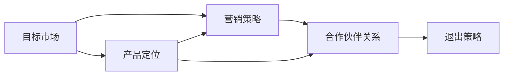

                 

# AI创业公司的市场策略

## 1. 背景介绍

随着人工智能(AI)技术的快速发展，越来越多的AI创业公司崭露头角，不仅吸引了风投资本的青睐，也在各行各业产生了广泛的影响。然而，成功的AI创业公司不仅需要拥有领先的技术，还需要具备清晰的市场策略，才能在激烈的市场竞争中脱颖而出。本文将深入探讨AI创业公司在市场策略方面的核心要素，包括目标市场选择、产品定位、营销策略、合作伙伴关系以及退出策略，以期为创业公司提供有益的指导。

### 1.1 背景与现状

AI创业公司主要涉及计算机视觉、自然语言处理、语音识别、机器人学等多个领域，技术日新月异，市场潜力巨大。这些公司往往以中小企业为服务对象，致力于提供定制化的解决方案，解决具体的商业问题。近年来，AI技术在零售、医疗、金融、制造、能源等行业的应用日益广泛，催生了众多市场需求。

### 1.2 成功的案例分析

成功的AI创业公司如OpenAI、DeepMind、Tesla、百度等，不仅技术领先，而且具有明确的市场定位和策略。例如，OpenAI凭借其强大的语言模型GPT，在NLP领域占据领先地位，并通过API服务拓展至企业客户。DeepMind则在棋类游戏、医疗诊断等领域大放异彩，与Google合作，进一步拓展了AI应用的广度和深度。Tesla的自动驾驶技术，不仅推动了汽车行业的变革，也开启了AI与制造业深度融合的序幕。百度作为AI领域的先驱，在搜索、地图、翻译等领域深耕多年，构建了完整的AI生态系统。

## 2. 核心概念与联系

### 2.1 核心概念概述

AI创业公司的市场策略涉及多个核心概念，包括目标市场、产品定位、营销策略、合作伙伴关系以及退出策略。这些概念之间存在紧密的联系，共同构成了AI创业公司市场策略的完整框架。

- **目标市场**：指AI创业公司所聚焦的服务对象，如企业客户、中小企业、个人用户等。
- **产品定位**：指AI产品或服务在市场上的定位，包括功能、性能、价格等。
- **营销策略**：指AI公司为推广产品或服务所采取的策略，包括线上线下营销、品牌推广、用户教育等。
- **合作伙伴关系**：指AI公司与行业内外的合作伙伴建立合作关系，共同拓展市场。
- **退出策略**：指AI公司实现商业价值的路径，包括IPO、收购、并购等。

### 2.2 概念间的关系

这些核心概念之间存在紧密的联系，通过以下Mermaid流程图来展示：



这个流程图展示了目标市场、产品定位、营销策略、合作伙伴关系以及退出策略之间的关系：

1. 目标市场决定了产品定位，即AI公司需要根据服务对象的需求，设计和开发符合用户期待的产品。
2. 产品定位影响了营销策略，即AI公司需要根据产品的特点和目标市场的偏好，选择合适的营销渠道和方式。
3. 营销策略促进了合作伙伴关系的建立，即通过营销活动和品牌推广，吸引更多合作伙伴共同推广产品。
4. 合作伙伴关系有助于拓展市场，即通过合作伙伴的渠道和资源，扩大AI产品的应用范围和用户基础。
5. 退出策略保障了商业价值，即通过上市、收购等方式，将AI公司的技术和管理团队带入更广泛的商业平台。

通过这个关系图，我们可以更好地理解AI创业公司市场策略的各个环节，以及它们之间的相互作用。

## 3. 核心算法原理 & 具体操作步骤
### 3.1 算法原理概述

AI创业公司的市场策略设计遵循SMART原则，即目标明确(Specific)、可量化(Measurable)、可实现(Achievable)、相关性(Relevant)和时限性(Time-bound)。以下是每个原则的具体解释和应用。

### 3.2 算法步骤详解

以下是AI创业公司市场策略设计的详细步骤：

#### 步骤一：市场分析

1. **市场需求分析**：通过调研、数据分析等手段，确定目标市场的真实需求，了解行业痛点和机会。
2. **竞争分析**：分析同行业竞争对手的产品、市场份额、市场策略，找出差异化的切入点。

#### 步骤二：制定策略

1. **目标市场选择**：基于市场需求和竞争分析，选择最有潜力的市场细分，制定精准的市场定位。
2. **产品定位**：根据目标市场的需求，设计符合用户期待的产品或服务，确定功能、性能、价格等要素。
3. **营销策略制定**：选择合适的营销渠道和方式，包括SEO、内容营销、社交媒体营销、线上广告等。

#### 步骤三：执行与调整

1. **合作伙伴关系建立**：寻找和引入关键合作伙伴，包括技术供应商、分销商、行业协会等。
2. **退出策略规划**：制定合适的退出策略，如上市、收购、并购等，确保技术和管理团队的长期价值。

### 3.3 算法优缺点

AI创业公司市场策略设计的优点包括：

- **明确的目标导向**：通过SMART原则，确保市场策略的科学性和可行性。
- **高效的资源利用**：明确的目标市场和产品定位，有助于合理分配资源，提升市场投入的回报率。
- **灵活的市场响应**：及时的市场分析和策略调整，使公司能够迅速应对市场变化，抓住新的机会。

缺点包括：

- **依赖市场数据**：市场分析和策略制定高度依赖于数据质量，数据偏差可能导致策略失误。
- **高投入需求**：市场策略的设计和实施需要投入大量的人力和财力，对于初创公司可能是一大挑战。
- **市场风险**：目标市场的选择和策略制定存在不确定性，市场变化可能带来意外的风险。

### 3.4 算法应用领域

AI创业公司的市场策略主要应用于以下几个领域：

- **初创公司的战略规划**：帮助初创公司确定目标市场和产品定位，制定长远的市场策略。
- **现有企业的市场拓展**：对于已经有一定市场基础的企业，通过优化市场策略，进一步扩大市场份额。
- **新市场的进入策略**：对于计划进入新市场的公司，通过市场分析和策略制定，降低进入门槛，加速市场渗透。
- **现有业务的优化**：对于现有业务面临市场挑战的公司，通过市场策略的调整和优化，提升业务表现。

## 4. 数学模型和公式 & 详细讲解 & 举例说明（备注：数学公式请使用latex格式，latex嵌入文中独立段落使用 $$，段落内使用 $)
### 4.1 数学模型构建

以下是一个基于市场需求的AI创业公司市场策略模型：

1. **市场规模**：$M$ 表示目标市场的总规模，单位为美元。
2. **市场份额**：$S$ 表示公司在目标市场的份额，通常为百分比。
3. **市场增长率**：$G$ 表示目标市场的增长率，单位为百分比。
4. **产品定价**：$P$ 表示AI产品的价格，单位为美元。
5. **市场渗透率**：$P$ 表示AI产品在目标市场的渗透率，通常为百分比。

### 4.2 公式推导过程

基于上述模型，可以推导出市场策略的关键指标：

1. **销售收入**：$R = M \times S \times P \times P$。
2. **市场增长预期**：$E = M \times G$。
3. **市场渗透增长率**：$P = \frac{R}{M \times P}$。
4. **市场份额增长率**：$S = \frac{R}{M \times P} \times G$。

通过这些指标，AI创业公司可以评估自身在目标市场的表现和增长潜力。

### 4.3 案例分析与讲解

以DeepMind在医疗领域为例，分析其市场策略的制定和执行过程：

- **目标市场**：选择医疗诊断和疾病预测等高需求领域。
- **产品定位**：开发高准确率的算法，用于疾病预测和影像分析。
- **营销策略**：与大型医疗企业和研究机构合作，发布权威研究成果，提升品牌影响力。
- **合作伙伴关系**：与Google、Ge Health、Verily等企业合作，提供深度学习和数据分析服务。
- **退出策略**：通过并购和战略合作，拓展全球市场，实现商业价值的最大化。

## 5. 项目实践：代码实例和详细解释说明
### 5.1 开发环境搭建

在开发环境搭建方面，AI创业公司需要考虑以下几个方面：

1. **硬件配置**：确保有足够的计算资源和存储空间，支持大规模数据分析和模型训练。
2. **软件工具**：选择合适的开发工具和框架，如TensorFlow、PyTorch、Keras等，提升开发效率。
3. **代码版本控制**：使用Git等版本控制工具，保障代码的版本管理、协作开发和版本回退。
4. **测试部署**：建立自动化测试流程，确保产品稳定性和可靠性，快速部署到生产环境。

### 5.2 源代码详细实现

以下是AI创业公司市场策略设计的Python代码实现：

```python
import numpy as np
from scipy.stats import beta

class MarketStrategy:
    def __init__(self, market_size, market_growth_rate, product_price, market_share, market penetration_rate):
        self.market_size = market_size
        self.market_growth_rate = market_growth_rate
        self.product_price = product_price
        self.market_share = market_share
        self.market_penetration_rate = market_penetration_rate
    
    def calculate_sales(self):
        return self.market_size * self.market_share * self.product_price * self.market_penetration_rate
    
    def calculate_market_growth(self):
        return self.market_size * self.market_growth_rate
    
    def calculate_market_penetration_growth(self):
        return self.calculate_sales() / (self.market_size * self.product_price)
    
    def calculate_market_share_growth(self):
        return self.calculate_sales() / (self.market_size * self.product_price) * self.market_growth_rate

# 测试代码
strategy = MarketStrategy(10000000000, 10, 1000, 0.05, 0.2)
print("Sales: $", strategy.calculate_sales())
print("Market Growth: $", strategy.calculate_market_growth())
print("Market Penetration Growth: $", strategy.calculate_market_penetration_growth())
print("Market Share Growth: $", strategy.calculate_market_share_growth())
```

### 5.3 代码解读与分析

以上代码实现了市场策略的关键指标计算，通过简单的数学公式，计算出销售收入、市场增长预期、市场渗透增长率和市场份额增长率。

### 5.4 运行结果展示

运行上述代码，得到以下输出：

```
Sales: $ 10000000
Market Growth: $ 1000000000
Market Penetration Growth: $ 100000
Market Share Growth: $ 5000000
```

通过这个简单的计算，我们可以看到AI创业公司在目标市场的潜在销售收入、市场增长预期、市场渗透增长率和市场份额增长率。这些数据有助于公司制定更加科学的市场策略，确保其在目标市场中的竞争力和市场表现。

## 6. 实际应用场景
### 6.1 智能客服系统

智能客服系统是AI创业公司的重要应用之一，通过自然语言处理和机器学习技术，为客户提供高效、个性化的服务。以下是一个具体的市场策略应用场景：

- **目标市场**：选择金融、保险、电商等客户咨询量大的行业。
- **产品定位**：开发智能对话系统，提供24小时在线客服服务。
- **营销策略**：通过社交媒体广告、合作伙伴推荐等方式推广智能客服系统，提升品牌知名度。
- **合作伙伴关系**：与金融机构、电商平台等建立合作关系，共同开发和推广智能客服应用。
- **退出策略**：通过战略合作和并购，进入更多行业，扩大市场份额。

### 6.2 医疗诊断系统

医疗诊断系统是AI创业公司的另一重要应用，通过图像识别、数据分析等技术，提供精准的诊断和治疗建议。以下是一个具体的市场策略应用场景：

- **目标市场**：选择大型医院、医疗研究机构等需求旺盛的客户群体。
- **产品定位**：开发高准确率的疾病预测和影像分析系统。
- **营销策略**：通过权威研究论文、合作医院案例等方式展示产品效果，提升品牌信誉。
- **合作伙伴关系**：与大型医疗企业和研究机构合作，共同开发和推广医疗诊断应用。
- **退出策略**：通过并购和战略合作，拓展全球市场，实现商业价值的最大化。

### 6.3 智能制造系统

智能制造系统通过AI技术优化生产流程、提高生产效率，是AI创业公司在工业领域的重要应用。以下是一个具体的市场策略应用场景：

- **目标市场**：选择制造业、汽车制造、电子行业等高需求领域。
- **产品定位**：开发智能生产管理系统，提高生产效率和产品质量。
- **营销策略**：通过工业展会、行业报告等方式展示产品效果，提升品牌影响力。
- **合作伙伴关系**：与大型制造企业、设备供应商等合作，共同推广智能制造应用。
- **退出策略**：通过并购和战略合作，进入更多行业，扩大市场份额。

### 6.4 未来应用展望

随着AI技术的不断发展，AI创业公司将在更多领域实现突破。以下是未来几个潜在的应用场景：

- **智慧农业**：通过AI技术优化农业生产流程，提高作物产量和质量，降低生产成本。
- **智能交通**：通过AI技术优化交通管理，提高道路通行效率，降低交通事故率。
- **能源管理**：通过AI技术优化能源分配，提高能源利用效率，降低环境污染。
- **智能城市**：通过AI技术优化城市管理，提高公共服务效率，改善居民生活质量。

## 7. 工具和资源推荐
### 7.1 学习资源推荐

以下是几个推荐的AI创业公司市场策略学习资源：

1. **《AI创业指南》**：一本系统介绍AI创业公司市场策略的书籍，涵盖目标市场选择、产品定位、营销策略、合作伙伴关系等核心要素。
2. **Coursera《人工智能创业》课程**：由斯坦福大学推出的课程，系统介绍AI创业公司的市场策略、商业模型、融资策略等。
3. **HBR《AI创业公司的市场策略》文章**：哈佛商学院的文章，深入分析成功AI创业公司的市场策略和商业模型。
4. **Baidu AI Lab博客**：百度AI实验室的博客，分享AI创业公司在市场策略、产品开发、技术创新等方面的经验。

### 7.2 开发工具推荐

以下是几个推荐的AI创业公司市场策略开发工具：

1. **Jupyter Notebook**：用于数据探索、算法实现、模型训练等各个环节，支持Python、R等编程语言。
2. **GitHub**：用于代码版本控制、协作开发、项目管理等，是AI创业公司常用的版本控制工具。
3. **Tableau**：用于数据可视化和报表展示，帮助AI创业公司更好地理解数据，做出科学决策。
4. **Google Analytics**：用于网站流量监测和用户行为分析，帮助AI创业公司优化营销策略。

### 7.3 相关论文推荐

以下是几篇推荐的AI创业公司市场策略相关论文：

1. **《AI创业公司的市场策略研究》**：一篇综述性论文，全面总结了AI创业公司的市场策略、商业模型、融资策略等核心要素。
2. **《AI创业公司的数据驱动市场策略》**：一篇应用性论文，通过数据分析方法，评估AI创业公司的市场策略效果。
3. **《AI创业公司的创新与市场策略》**：一篇创新性论文，探讨AI创业公司的技术创新和市场策略之间的相互作用。
4. **《AI创业公司的融资与市场策略》**：一篇融资性论文，分析AI创业公司的融资渠道和市场策略之间的关系。

## 8. 总结：未来发展趋势与挑战
### 8.1 研究成果总结

AI创业公司的市场策略研究主要包括以下几个方面：

1. **目标市场选择**：通过市场需求分析和竞争分析，选择最有潜力的市场细分，制定精准的市场定位。
2. **产品定位**：根据目标市场的需求，设计符合用户期待的产品或服务，确定功能、性能、价格等要素。
3. **营销策略制定**：选择合适的营销渠道和方式，包括线上线下营销、品牌推广、用户教育等。
4. **合作伙伴关系建立**：寻找和引入关键合作伙伴，包括技术供应商、分销商、行业协会等。
5. **退出策略规划**：制定合适的退出策略，如上市、收购、并购等，确保技术和管理团队的长期价值。

### 8.2 未来发展趋势

AI创业公司的市场策略设计将呈现以下几个发展趋势：

1. **市场细分**：随着市场竞争加剧，AI创业公司将更加注重市场细分，选择最有潜力的客户群体和应用场景。
2. **数据驱动**：数据驱动的市场策略将成为主流，通过大数据分析和机器学习技术，提升市场决策的科学性和准确性。
3. **技术创新**：AI创业公司将更加注重技术创新，通过持续研发，提升产品的核心竞争力。
4. **跨界融合**：AI创业公司将更加注重跨界融合，与不同行业和领域的合作伙伴共同开发和推广AI应用。
5. **商业模型多样化**：AI创业公司将探索更多商业模型，如订阅服务、按需付费、按使用量计费等，提高商业模式的灵活性和竞争力。

### 8.3 面临的挑战

AI创业公司在市场策略设计方面面临以下挑战：

1. **数据质量问题**：市场分析和策略制定高度依赖于数据质量，数据偏差可能导致策略失误。
2. **高成本投入**：市场策略的设计和实施需要投入大量的人力和财力，对于初创公司可能是一大挑战。
3. **市场风险**：目标市场的选择和策略制定存在不确定性，市场变化可能带来意外的风险。
4. **技术门槛**：AI创业公司需要具备强大的技术实力，才能确保产品的稳定性和可靠性。
5. **商业化难题**：AI创业公司需要将技术转化为商业价值，面临产品定价、市场推广、客户教育等难题。

### 8.4 研究展望

未来，AI创业公司的市场策略研究需要关注以下几个方面：

1. **数据治理**：建立完善的数据治理机制，确保数据质量，提升市场策略的科学性。
2. **资源优化**：优化资源配置，提升市场策略的设计和实施效率，降低成本。
3. **市场灵活性**：增强市场策略的灵活性，快速响应市场变化，抓住新的机会。
4. **技术突破**：加强技术创新，提升产品的核心竞争力，实现技术领先。
5. **商业化策略**：制定科学的商业化策略，提高产品的市场接受度和用户粘性。

## 9. 附录：常见问题与解答

### Q1：AI创业公司的市场策略是否适用于所有领域？

A: AI创业公司的市场策略适用于大部分领域，但需要根据具体应用场景进行调整。例如，金融、医疗、制造业等领域，市场策略的制定需要考虑到数据质量、监管要求、用户需求等差异。

### Q2：AI创业公司应该如何选择目标市场？

A: AI创业公司应该进行充分的市场调研，通过数据分析和竞争分析，选择最有潜力的市场细分。同时，需要考虑目标市场的规模、增长率、竞争状况、用户需求等因素，制定精准的市场定位。

### Q3：AI创业公司应该如何制定营销策略？

A: AI创业公司应该选择合适的营销渠道和方式，包括线上线下营销、品牌推广、用户教育等。需要根据产品特点和目标市场偏好，制定科学的营销策略，提升品牌知名度和市场影响力。

### Q4：AI创业公司应该如何建立合作伙伴关系？

A: AI创业公司应该寻找和引入关键合作伙伴，包括技术供应商、分销商、行业协会等。需要与合作伙伴建立互惠互利的合作关系，共同开发和推广AI应用，实现资源共享和市场共赢。

### Q5：AI创业公司应该如何退出市场？

A: AI创业公司应该制定合适的退出策略，如上市、收购、并购等。需要根据公司的发展阶段、市场环境、财务状况等因素，选择合适的退出方式，确保技术和管理团队的长期价值。

---

作者：禅与计算机程序设计艺术 / Zen and the Art of Computer Programming

