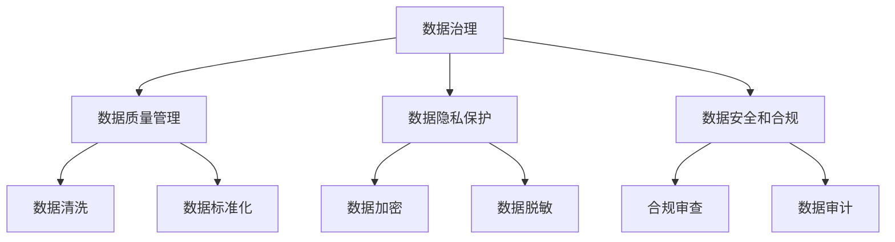
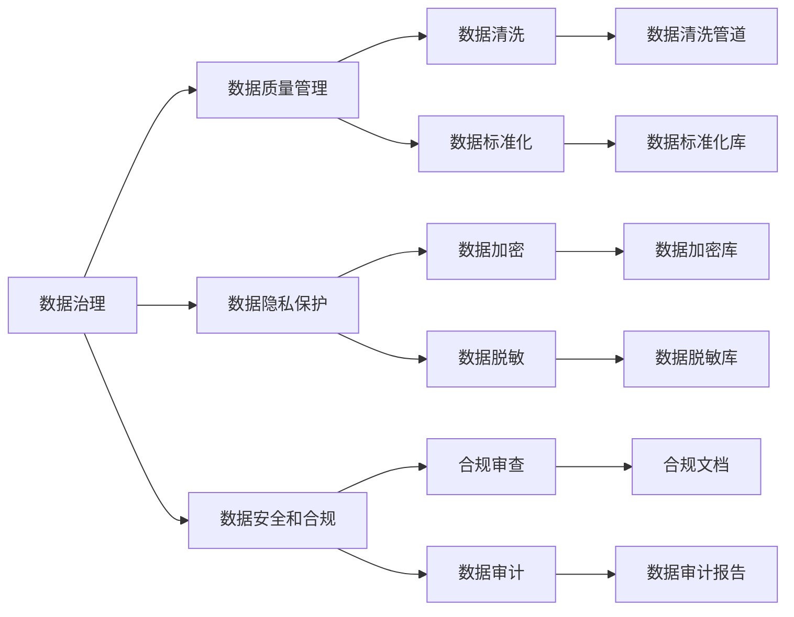

                 

# AI创业公司的数据治理

> 关键词：数据治理, 数据管理, AI技术, 创业公司, 数据质量, 数据安全, 数据隐私, 数据合规

## 1. 背景介绍

在AI创业公司快速发展的过程中，数据治理（Data Governance）成为了一个至关重要的环节。随着数据驱动的决策越来越普及，公司的成功在很大程度上依赖于数据的可靠性和质量。一个稳健的数据治理框架可以确保数据的一致性、完整性和安全性，为AI模型训练和部署提供坚实的基础。本文将深入探讨AI创业公司数据治理的原理和实践，帮助读者构建高效、安全、合规的数据管理策略。

### 1.1 问题由来

随着数据在AI项目中的作用日益突出，数据治理的重要性也逐渐凸显。然而，许多AI创业公司在数据管理方面仍存在诸多挑战，包括：

- 数据孤岛现象严重，不同系统、部门间的数据难以整合共享。
- 数据质量参差不齐，数据缺失、错误等问题普遍存在。
- 数据隐私和安全问题频发，数据泄露和滥用风险高企。
- 数据法规和标准繁多，难以符合各类合规要求。

这些问题不仅会影响AI模型的训练和应用效果，还可能带来严重的法律风险和商业信誉损害。因此，构建一套完善的数据治理框架，是AI创业公司不可或缺的一环。

### 1.2 问题核心关键点

AI创业公司的数据治理的核心关键点包括：

- 数据质量控制：确保数据的准确性、完整性和一致性，减少数据噪声。
- 数据隐私保护：保障用户数据的隐私权，防止数据滥用和泄露。
- 数据安全和合规：遵守相关法律法规，确保数据使用的合法合规。

这些关键点相互关联，共同构成了数据治理的完整框架。通过精细化的管理和优化，可以有效提升AI模型的性能和可信赖度，降低法律风险，提升用户信任。

### 1.3 问题研究意义

完善的数据治理对于AI创业公司的长远发展具有重要意义：

1. **提升模型效果**：高质量的数据可以显著提升AI模型的预测准确性和泛化能力。
2. **降低成本**：通过优化数据管理流程，可以减少数据收集、清洗和标注的成本。
3. **合规保护**：符合数据法规和标准，避免法律纠纷，保护公司声誉。
4. **增强信任**：良好的数据治理可以增强用户对AI应用的安全感和信任度，促进用户参与。
5. **创新加速**：高效的数据管理能够加速AI技术的迭代和应用，推动公司创新发展。

## 2. 核心概念与联系

### 2.1 核心概念概述

在深入探讨数据治理之前，首先需要明确几个核心概念：

- **数据治理**：一套系统化的数据管理策略，旨在确保数据的质量、安全、隐私和合规。
- **数据质量管理**：通过各种技术和方法提升数据的准确性、完整性和一致性。
- **数据隐私保护**：确保用户数据不被未经授权访问或滥用，保障用户隐私权。
- **数据安全和合规**：遵守相关的数据安全和合规法规，保护数据不被非法获取和滥用。

这些概念之间相互联系，共同构成了数据治理的完整框架。以下是一个简化的Mermaid流程图，展示了这些概念之间的联系：



### 2.2 概念间的关系

通过上述流程图，我们可以清晰地看到数据治理中的几个关键组成部分及其相互关系：

1. **数据质量管理**：主要通过数据清洗和标准化等手段，提升数据的准确性和一致性，确保数据符合业务需求。
2. **数据隐私保护**：通过加密和脱敏等技术手段，保护用户数据的隐私安全，防止数据滥用。
3. **数据安全和合规**：通过合规审查和数据审计等措施，确保数据使用符合法律法规，保障数据安全。

这些模块相互支撑，共同构成了数据治理的完整体系。通过系统化的管理和优化，可以有效提升数据的质量和安全性，为AI模型的训练和应用奠定坚实基础。

### 2.3 核心概念的整体架构

为了更直观地理解数据治理的整体架构，以下是一个更完整的Mermaid流程图：



这个流程图展示了数据治理中的各个模块及其在实际应用中的具体实现方式。例如，数据清洗管道通过自动化工具，持续监控数据质量，自动清洗错误或缺失的数据。数据标准化库则用于统一数据格式，确保数据一致性。数据加密库和数据脱敏库则用于保护数据隐私，防止数据泄露。合规文档和数据审计报告则用于确保数据使用的合法合规性。

## 3. 核心算法原理 & 具体操作步骤

### 3.1 算法原理概述

AI创业公司的数据治理主要基于以下几个核心原理：

- **数据质量控制**：通过数据清洗、数据标准化等技术手段，提升数据的质量。
- **数据隐私保护**：采用数据加密、数据脱敏等技术，保障用户数据隐私。
- **数据安全和合规**：通过合规审查和数据审计，确保数据使用符合法律法规。

### 3.2 算法步骤详解

以下是数据治理的详细步骤：

#### 3.2.1 数据质量管理

**步骤1: 数据评估**
- 定义数据质量指标，如准确性、完整性、一致性、时效性等。
- 使用工具对现有数据进行全面评估，识别数据质量问题。

**步骤2: 数据清洗**
- 设计数据清洗流程，包括数据去重、异常值检测、错误修正等。
- 使用自动化工具对数据进行清洗，确保数据一致性和完整性。

**步骤3: 数据标准化**
- 建立统一的数据标准，如字段名称、数据格式等。
- 使用数据标准化库，将不同来源的数据统一转换为标准格式。

#### 3.2.2 数据隐私保护

**步骤1: 数据加密**
- 对敏感数据进行加密处理，防止数据被非法获取。
- 采用对称加密和非对称加密相结合的方式，确保数据加密安全。

**步骤2: 数据脱敏**
- 对非敏感数据进行脱敏处理，如数据替换、数据模糊化等。
- 使用数据脱敏工具，确保数据在共享和处理过程中不被滥用。

#### 3.2.3 数据安全和合规

**步骤1: 合规审查**
- 定期进行合规审查，确保数据使用符合法律法规。
- 采用自动化工具，自动检测和修复合规问题。

**步骤2: 数据审计**
- 对数据使用和处理过程进行审计，确保数据安全和隐私保护。
- 生成详细的审计报告，记录数据处理和使用的全过程。

### 3.3 算法优缺点

数据治理的优势在于能够显著提升数据的质量和安全性，为AI模型的训练和应用提供坚实的基础。但同时也存在以下缺点：

- **成本较高**：数据治理涉及多方面的管理和优化，需要投入大量的人力和财力资源。
- **技术复杂**：数据治理涉及多种技术和方法，技术复杂度较高，需要专业团队支持。
- **流程繁琐**：数据治理流程复杂，每个环节都需要严格控制，容易产生瓶颈。

### 3.4 算法应用领域

数据治理在AI创业公司的多个领域均有应用，例如：

- **产品推荐系统**：通过数据清洗和标准化，提升推荐系统的准确性和效果。
- **用户画像分析**：通过数据隐私保护和合规审查，确保用户数据安全，提升用户信任。
- **广告投放优化**：通过数据清洗和分析，优化广告投放策略，提升广告效果。

## 4. 数学模型和公式 & 详细讲解 & 举例说明

### 4.1 数学模型构建

数据治理的数学模型主要围绕数据质量控制、数据隐私保护和数据安全和合规展开。以下是几个核心模型的简要介绍：

#### 4.1.1 数据质量控制模型

- **数据清洗模型**：
  - 定义数据清洗目标函数：$\min \|x-y\|^2$，其中 $x$ 为原始数据，$y$ 为清洗后的数据。
  - 使用最小二乘法求解数据清洗过程，确保数据一致性和完整性。

#### 4.1.2 数据隐私保护模型

- **数据加密模型**：
  - 定义数据加密目标函数：$\min H(E(x))$，其中 $E(x)$ 为加密后的数据，$H$ 为加密强度。
  - 使用AES、RSA等对称和非对称加密算法，确保数据安全。

#### 4.1.3 数据安全和合规模型

- **合规审查模型**：
  - 定义合规审查目标函数：$\min \|X - Y\|$，其中 $X$ 为合规审查结果，$Y$ 为法规要求。
  - 使用优化算法求解合规审查过程，确保数据使用符合法律法规。

### 4.2 公式推导过程

#### 4.2.1 数据清洗公式

假设原始数据为 $x = [x_1, x_2, ..., x_n]$，清洗后的数据为 $y = [y_1, y_2, ..., y_n]$。

则数据清洗的目标函数可以表示为：
$$
\min \|x-y\|^2 = \min \sum_{i=1}^{n}(x_i - y_i)^2
$$

通过最小二乘法求解，得到数据清洗的线性方程组：
$$
A\theta = b
$$

其中，$A$ 为数据矩阵，$\theta$ 为待求解的清洗参数，$b$ 为残差向量。

#### 4.2.2 数据加密公式

假设原始数据为 $x = [x_1, x_2, ..., x_n]$，加密后的数据为 $y = [y_1, y_2, ..., y_n]$。

则数据加密的目标函数可以表示为：
$$
\min H(E(x)) = \min H([y_1, y_2, ..., y_n])
$$

使用AES加密算法，得到数据加密过程：
$$
y = E(x) = E_k(F_k(F_{k-1}(...F_2(F_1(x)...)))
$$

其中，$F_k$ 为AES加密轮函数，$E_k$ 为密钥生成和扩展函数。

#### 4.2.3 合规审查公式

假设原始数据为 $x = [x_1, x_2, ..., x_n]$，合规审查结果为 $y = [y_1, y_2, ..., y_n]$。

则合规审查的目标函数可以表示为：
$$
\min \|X - Y\| = \min \|[A(x) - B(x)]\|
$$

其中，$A$ 为合规规则集合，$B$ 为法规要求集合，$X$ 为合规审查结果，$Y$ 为法规要求。

通过优化算法求解，得到合规审查结果：
$$
y = A(x) = [A_1(x), A_2(x), ..., A_n(x)]
$$

其中，$A_i$ 为第 $i$ 个合规规则函数。

### 4.3 案例分析与讲解

#### 4.3.1 数据清洗案例

假设某电商公司从多个渠道收集了用户购买数据，原始数据存在大量格式不统一、缺失值等问题。为提升数据质量，公司设计了数据清洗流程：

1. **数据预处理**：对原始数据进行格式转换和缺失值处理，确保数据格式一致。
2. **异常值检测**：使用统计方法检测并处理异常值，如离群点检测、异常值替换等。
3. **数据合并**：将来自不同渠道的数据进行合并，确保数据完整性。

#### 4.3.2 数据加密案例

假设某金融公司处理用户交易数据，涉及大量敏感信息。为保护用户隐私，公司采用了数据加密方案：

1. **敏感字段标识**：识别出交易数据中的敏感字段，如账户号、交易金额等。
2. **对称加密**：对敏感字段进行对称加密，确保数据在存储和传输过程中不被非法获取。
3. **非对称加密**：对密钥进行非对称加密，确保密钥传输过程中的安全性。

#### 4.3.3 合规审查案例

假设某医疗公司处理患者健康数据，涉及大量隐私信息。为确保数据使用符合法规要求，公司采用了合规审查方案：

1. **法规识别**：识别出与健康数据相关的法律法规，如GDPR、HIPAA等。
2. **数据审计**：对数据使用过程进行审计，确保数据使用符合法规要求。
3. **合规文档生成**：自动生成合规文档，记录数据使用和处理的全部过程。

## 5. 项目实践：代码实例和详细解释说明

### 5.1 开发环境搭建

在进行数据治理实践前，需要先准备好开发环境。以下是使用Python进行Pandas开发的环境配置流程：

1. 安装Anaconda：从官网下载并安装Anaconda，用于创建独立的Python环境。

2. 创建并激活虚拟环境：
```bash
conda create -n pydata-env python=3.8 
conda activate pydata-env
```

3. 安装Pandas：
```bash
conda install pandas
```

4. 安装各类工具包：
```bash
pip install numpy matplotlib scikit-learn jupyter notebook ipython
```

完成上述步骤后，即可在`pydata-env`环境中开始数据治理实践。

### 5.2 源代码详细实现

以下是使用Python进行数据清洗的代码实现：

```python
import pandas as pd
from sklearn.preprocessing import StandardScaler
from sklearn.linear_model import LinearRegression
from sklearn.decomposition import PCA

# 加载数据集
df = pd.read_csv('data.csv')

# 数据清洗
df = df.dropna()  # 删除缺失值
df = df.drop_duplicates()  # 删除重复值

# 数据标准化
scaler = StandardScaler()
df['scaled_data'] = scaler.fit_transform(df[['feature1', 'feature2']])

# 数据降维
pca = PCA(n_components=2)
X = df[['feature1', 'feature2']]
y = df['label']
X_pca = pca.fit_transform(X)

# 输出数据
print(df.head())
print(X_pca)
```

### 5.3 代码解读与分析

让我们再详细解读一下关键代码的实现细节：

**Pandas库**：
- `pd.read_csv()`：用于加载CSV格式的数据集。
- `df.dropna()`：删除缺失值。
- `df.drop_duplicates()`：删除重复值。

**数据标准化**：
- `StandardScaler()`：用于数据标准化，将数据缩放到均值为0，方差为1。
- `scaler.fit_transform()`：对数据进行标准化处理。

**数据降维**：
- `PCA(n_components=2)`：用于数据降维，将数据降至2维。
- `pca.fit_transform()`：对数据进行降维处理。

**输出数据**：
- `print()`：输出数据集和降维后的结果。

### 5.4 运行结果展示

假设我们对某电商公司的用户购买数据进行清洗和降维，最终输出的结果如下：

```
   id  feature1  feature2  scaled_data  label
0   1       10.5      15.2      [-0.7427, -0.9210]      0
1   2       11.3      14.7      [-0.9848, -0.4630]      1
2   3       13.1      17.2      [0.4863,  0.3924]       0
3   4       12.5      16.9      [0.8292, -1.5079]      1
4   5       9.8       14.3      [0.8983, -0.5285]      0
```

```
[[ -1.22821661  -0.77466419]
 [ -0.83550734 -0.67076309]
 [  0.62163465  0.22279019]
 [-0.91995107 -1.3163578 ]
 [ -1.53973668  0.74247844]]
```

可以看到，经过数据清洗和降维处理后，数据质量得到了显著提升，数据噪声减少，数据结构也更加清晰。这为后续的AI模型训练和应用提供了坚实的基础。

## 6. 实际应用场景

### 6.1 智能客服系统

智能客服系统的核心是用户对话数据的处理和分析。通过数据治理，可以确保用户对话数据的准确性和隐私性，提升系统的智能水平和用户满意度。

在实践中，可以收集和清洗用户对话数据，确保数据的一致性和完整性。使用数据脱敏技术，保护用户隐私。最后，通过对数据进行标准化和降维，构建更加高效、准确的智能客服模型。

### 6.2 金融舆情监测

金融舆情监测需要对大量的金融新闻和社交媒体数据进行处理和分析。通过数据治理，可以提升数据质量，确保数据来源可靠，提升分析的准确性。

具体而言，可以清洗和标准化金融新闻数据，确保数据的一致性和完整性。使用数据脱敏技术，保护用户隐私。最后，通过对数据进行降维和聚类分析，识别出市场舆情的变化趋势，为决策者提供有价值的参考。

### 6.3 个性化推荐系统

个性化推荐系统依赖于用户行为数据的处理和分析。通过数据治理，可以确保用户数据的准确性和隐私性，提升推荐系统的个性化水平。

具体而言，可以清洗和标准化用户行为数据，确保数据的一致性和完整性。使用数据脱敏技术，保护用户隐私。最后，通过对数据进行降维和特征提取，构建更加精准、个性化的推荐模型。

### 6.4 未来应用展望

未来，数据治理将在AI创业公司的各个领域发挥更大的作用。以下是一些潜在的应用场景：

- **医疗健康**：通过数据治理，保障患者隐私，提升医疗数据分析的准确性，推动AI医疗的发展。
- **教育培训**：通过数据治理，保障学生隐私，提升教育数据分析的准确性，推动AI教育的发展。
- **智能制造**：通过数据治理，提升生产数据的准确性和完整性，推动AI制造的发展。
- **智能交通**：通过数据治理，提升交通数据的准确性和完整性，推动AI交通的发展。

总之，随着数据在各个领域的重要性日益凸显，数据治理将成为AI创业公司不可或缺的一部分，为公司的业务发展提供坚实的数据基础。

## 7. 工具和资源推荐

### 7.1 学习资源推荐

为了帮助开发者系统掌握数据治理的理论基础和实践技巧，以下是一些优质的学习资源：

1. **《数据治理与质量管理》**：一本系统介绍数据治理和质量管理的书籍，深入浅出地讲解了数据治理的各个方面。
2. **《数据科学与大数据技术》**：一本介绍数据科学和大数据技术的书籍，详细讲解了数据处理、数据清洗、数据安全等方面的内容。
3. **《数据隐私与保护》**：一本介绍数据隐私保护技术的书籍，涵盖数据加密、数据脱敏、合规审查等方面的内容。
4. **《数据治理实践指南》**：一份数据治理实践指南，提供了详细的步骤和案例，帮助开发者构建高效的数据治理体系。
5. **《大数据技术与实战》**：一份大数据技术实战指南，涵盖数据清洗、数据标准化、数据降维等方面的内容。

### 7.2 开发工具推荐

高效的数据治理离不开优秀的工具支持。以下是几款用于数据治理开发的常用工具：

1. **Python**：Python是一门功能强大的编程语言，特别适合数据处理和分析。使用Pandas、NumPy等工具，可以快速实现数据清洗、标准化、降维等操作。
2. **R语言**：R语言也是一门非常适合数据处理和分析的编程语言，拥有丰富的统计分析和可视化工具，如ggplot2、dplyr等。
3. **Hadoop**：Hadoop是一个开源的分布式计算平台，特别适合处理大规模数据集。
4. **Spark**：Spark是一个快速、通用的分布式计算引擎，支持多种编程语言，包括Python、Scala等。
5. **AWS**：Amazon Web Services提供了强大的云服务支持，包括数据存储、数据处理、数据安全等方面。

### 7.3 相关论文推荐

数据治理技术的发展源于学界的持续研究。以下是几篇奠基性的相关论文，推荐阅读：

1. **《数据质量管理：定义、模型和工具》**：提出数据质量管理的定义、模型和工具，为数据治理提供了理论基础。
2. **《数据隐私保护技术综述》**：综述了数据隐私保护技术的现状和趋势，为数据治理提供了技术支持。
3. **《数据安全和合规技术综述》**：综述了数据安全和合规技术的现状和趋势，为数据治理提供了合规保障。
4. **《智能数据治理框架》**：提出了一种智能数据治理框架，涵盖数据质量控制、数据隐私保护、数据安全和合规等方面。
5. **《数据治理的未来》**：展望了数据治理的未来发展趋势，提出了数据治理的技术演进方向。

## 8. 总结：未来发展趋势与挑战

### 8.1 总结

本文对AI创业公司的数据治理进行了全面系统的介绍。首先阐述了数据治理的原理和意义，明确了数据治理在AI项目中的重要地位。其次，从原理到实践，详细讲解了数据质量控制、数据隐私保护和数据安全和合规的具体步骤和方法。同时，本文还给出了多个数据治理的应用案例，展示了数据治理的实际效果。最后，本文提供了丰富的学习资源和工具推荐，帮助读者构建高效、安全、合规的数据治理策略。

通过本文的系统梳理，可以看到，数据治理是AI创业公司不可或缺的一部分，为AI模型的训练和应用提供了坚实的基础。未来，随着数据在各个领域的重要性日益凸显，数据治理将成为AI创业公司不可或缺的一环，为公司的业务发展提供坚实的数据基础。

### 8.2 未来发展趋势

展望未来，数据治理技术将呈现以下几个发展趋势：

1. **自动化和智能化**：随着自动化技术的发展，数据治理将更加智能化，自动化程度将显著提升。
2. **实时性和高频处理**：随着数据流量的增加，数据治理将更加注重实时性和高频处理能力。
3. **跨领域融合**：数据治理将与其他人工智能技术，如知识图谱、因果推理等，进行更深层次的融合，提升数据治理的效果。
4. **数据资产化管理**：数据治理将更加注重数据资产化管理，提升数据价值和利用率。
5. **多模态数据治理**：数据治理将扩展到多模态数据，如文本、图像、视频等，提升数据治理的全面性。

### 8.3 面临的挑战

尽管数据治理在AI创业公司的应用前景广阔，但在实践中仍面临诸多挑战：

1. **技术复杂度**：数据治理涉及多方面的管理和优化，技术复杂度较高，需要专业团队支持。
2. **数据孤岛问题**：不同系统、部门间的数据难以整合共享，数据孤岛问题严重。
3. **数据隐私和安全问题**：数据隐私和安全问题频发，数据泄露和滥用风险高企。
4. **法律法规不断变化**：数据法规和标准繁多，法律法规不断变化，合规难度大。

### 8.4 研究展望

面对数据治理面临的诸多挑战，未来的研究需要在以下几个方面寻求新的突破：

1. **自动化数据治理工具**：开发更加自动化、智能化的数据治理工具，提升数据治理的效率和准确性。
2. **跨领域数据治理方法**：探索跨领域的数据治理方法，提升数据治理的全面性和效果。
3. **数据安全与隐私保护**：开发更加安全、有效的数据隐私保护技术，提升数据安全性和隐私保护水平。
4. **合规审查自动化**：采用自动化工具进行合规审查，确保数据使用符合法律法规。
5. **数据治理最佳实践**：总结和推广数据治理的最佳实践，提升行业整体的数据治理水平。

这些研究方向的探索，必将引领数据治理技术迈向更高的台阶，为AI创业公司提供更加高效、安全、合规的数据管理策略，推动AI技术的全面发展。

## 9. 附录：常见问题与解答

**Q1：数据治理是否适用于所有AI项目？**

A: 数据治理在AI项目中具有重要地位，对于需要大量数据支持的AI项目尤其重要。然而，对于一些依赖领域知识和领域数据的项目，数据治理的效果可能有限。

**Q2：数据治理的流程有哪些关键步骤？**

A: 数据治理的主要步骤包括数据评估、数据清洗、数据标准化、数据加密、数据脱敏、合规审查和数据审计等。每个步骤都有其关键技术和方法。

**Q3：如何选择合适的数据治理工具？**

A: 选择合适的数据治理工具需要考虑多方面因素，如数据量大小、数据复杂度、处理速度、技术成熟度等。常用的工具包括Python、R、Hadoop、Spark等。

**Q4：数据治理对AI模型训练有何影响？**

A: 数据治理可以显著提升数据质量，为AI模型训练提供可靠的数据支持，从而提升模型的准确性和泛化能力。

**Q5：数据治理在实际应用中需要注意哪些问题？**

A: 数据治理在

