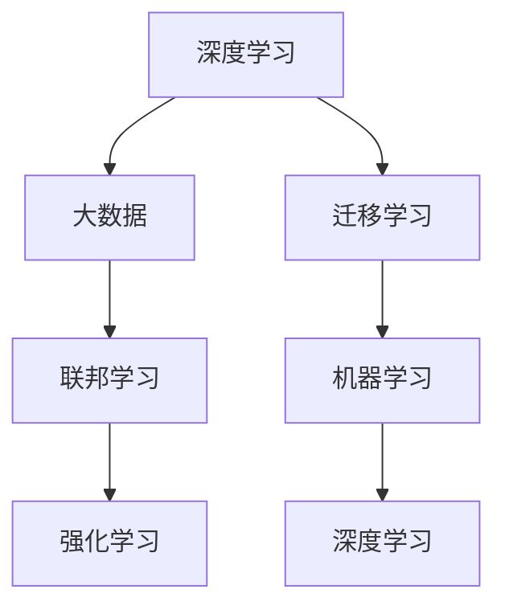
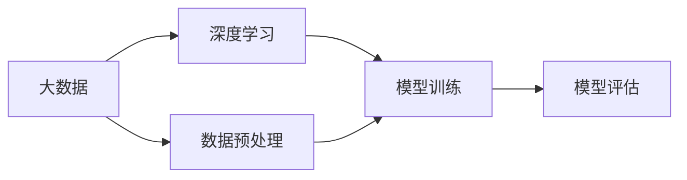
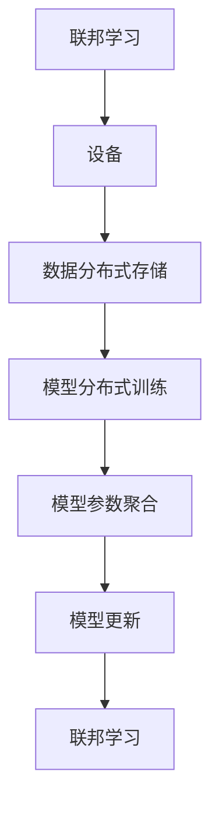

                 

# AI发展的三大关键因素

> 关键词：人工智能, 深度学习, 强化学习, 大数据, 联邦学习

## 1. 背景介绍

### 1.1 问题由来

随着人工智能技术的迅猛发展，AI已成为推动经济和社会进步的重要引擎。然而，AI的发展并非一帆风顺，面临着诸多挑战和困境。特别是在算法复杂度、数据需求和计算资源等方面，AI技术需要突破瓶颈，才能实现更广泛的应用和深入的发展。本文将探讨AI发展的三大关键因素，并分析其对未来AI技术的影响。

### 1.2 问题核心关键点

AI发展的三大关键因素主要包括深度学习、大数据和联邦学习。它们在AI算法、数据处理和模型训练等方面起到了至关重要的作用。

- 深度学习：通过神经网络实现特征提取和模式识别，是当前AI的主流技术。
- 大数据：提供高质量的数据资源，是深度学习算法的有力支撑。
- 联邦学习：利用分布式计算和多设备协同，保护用户隐私的同时实现高效模型训练。

## 2. 核心概念与联系

### 2.1 核心概念概述

为更好地理解AI发展的三大关键因素，本节将介绍几个密切相关的核心概念：

- 深度学习：一种通过多层次神经网络实现特征提取和模式识别的机器学习方法。
- 大数据：指规模巨大、类型多样、高速动态的数据集合，是深度学习算法训练的基础。
- 联邦学习：一种分布式机器学习方法，通过多设备协同训练模型，保护用户隐私的同时提高模型性能。
- 强化学习：通过奖励和惩罚机制，使AI系统在与环境的交互中不断优化行为策略。
- 迁移学习：将一个领域学到的知识，迁移应用到另一个不同但相关的领域的学习范式。

这些核心概念之间的逻辑关系可以通过以下Mermaid流程图来展示：



这个流程图展示了大数据、深度学习、联邦学习和强化学习等核心概念在机器学习中的相互关系。深度学习利用大数据进行模型训练，联邦学习在大数据的基础上提升模型性能，强化学习通过与环境的交互不断优化策略，而迁移学习则使不同领域之间的知识得以共享。这些概念共同构成了现代AI的核心算法和技术框架。

### 2.2 概念间的关系

这些核心概念之间存在着紧密的联系，形成了AI技术的整体架构。下面通过几个Mermaid流程图来展示这些概念之间的关系。

#### 2.2.1 AI技术架构


这个综合流程图展示了深度学习、大数据、联邦学习、强化学习和迁移学习在大AI技术架构中的作用。

#### 2.2.2 深度学习与大数据的关系



这个流程图展示了深度学习在大数据上的应用流程。首先对大数据进行预处理，然后通过深度学习算法进行模型训练，最后对训练好的模型进行评估。

#### 2.2.3 联邦学习的应用



这个流程图展示了联邦学习的基本流程。联邦学习通过多设备协同训练模型，首先设备将本地数据分布式存储，然后各设备在本地进行模型训练，并将训练结果进行参数聚合，最后更新全局模型。

#### 2.2.4 强化学习的基本框架


这个流程图展示了强化学习的基本框架。强化学习通过与环境进行交互，首先观察当前状态，然后根据策略选择动作，执行动作并获得奖励信号，最后根据奖励信号更新策略。

## 3. 核心算法原理 & 具体操作步骤
### 3.1 算法原理概述

AI发展的三大关键因素在算法原理上有着不同的侧重点。深度学习通过多层次神经网络实现特征提取和模式识别，大数据提供了高质量的数据资源，而联邦学习利用分布式计算和多设备协同，保护用户隐私的同时实现高效模型训练。

### 3.2 算法步骤详解

#### 3.2.1 深度学习算法步骤

1. **数据预处理**：对原始数据进行清洗、归一化和分词等预处理操作。
2. **模型构建**：设计多层神经网络模型，并选择合适的激活函数、损失函数和优化器。
3. **模型训练**：使用训练数据集对模型进行反向传播训练，优化模型参数。
4. **模型评估**：使用测试数据集对训练好的模型进行性能评估，如准确率、召回率和F1分数等。
5. **模型调优**：根据评估结果对模型进行调优，如调整超参数、增加正则化项等。

#### 3.2.2 大数据处理流程

1. **数据采集**：从不同来源获取大规模数据集。
2. **数据存储**：使用分布式文件系统（如HDFS、S3）进行数据存储。
3. **数据清洗**：去除噪声和异常值，填补缺失值。
4. **数据特征工程**：提取和构造特征，生成特征矩阵。
5. **数据加载**：将数据加载到内存中进行模型训练。
6. **数据增强**：使用数据增强技术（如翻转、裁剪、旋转等）扩充数据集。

#### 3.2.3 联邦学习算法步骤

1. **设备选择**：选择多个设备（如手机、电脑、服务器等）参与模型训练。
2. **数据分布式存储**：将数据存储在各个设备上，保证数据隐私和安全。
3. **模型分布式训练**：各设备在本地进行模型训练，并将训练结果发送到中央服务器。
4. **参数聚合**：中央服务器将各设备的模型参数进行聚合，更新全局模型参数。
5. **模型更新**：根据聚合后的全局参数，更新各设备的模型。

### 3.3 算法优缺点

#### 3.3.1 深度学习的优缺点

- **优点**：
  - **强大特征提取能力**：通过多层次神经网络实现高效的特征提取和模式识别。
  - **自适应性**：能够适应各种复杂的非线性关系。
  - **应用广泛**：已经在图像、语音、自然语言处理等领域取得显著成果。

- **缺点**：
  - **数据需求高**：需要大量的标注数据进行训练，数据获取成本高。
  - **计算资源消耗大**：需要高性能的计算资源，如GPU和TPU。
  - **模型复杂度高**：神经网络参数量大，难以解释和调试。

#### 3.3.2 大数据的优缺点

- **优点**：
  - **数据质量高**：大规模数据集包含丰富的领域知识，提高模型性能。
  - **泛化能力强**：覆盖各种数据分布，增强模型的泛化能力。
  - **应用广泛**：广泛应用在搜索引擎、推荐系统、金融风控等领域。

- **缺点**：
  - **数据隐私问题**：数据泄露可能导致用户隐私被侵犯。
  - **数据获取难**：数据获取成本高，数据处理复杂。
  - **数据质量差**：存在噪声、缺失值和异常值等问题，影响模型训练。

#### 3.3.3 联邦学习的优缺点

- **优点**：
  - **隐私保护**：数据在本地训练，保护用户隐私。
  - **分布式训练**：利用分布式计算资源，提高模型训练效率。
  - **模型泛化能力强**：不同设备的数据具有多样性，增强模型泛化能力。

- **缺点**：
  - **通信开销大**：各设备需要频繁交换数据，通信开销大。
  - **算法复杂度高**：联邦学习算法复杂度高，实现难度大。
  - **模型同步困难**：设备间数据分布不均，模型同步困难。

### 3.4 算法应用领域

#### 3.4.1 深度学习的应用领域

深度学习已经在图像识别、语音识别、自然语言处理、推荐系统等领域取得了显著成果。

1. **图像识别**：如人脸识别、物体检测、医学影像分析等。
2. **语音识别**：如语音转文字、语音合成、语音情感识别等。
3. **自然语言处理**：如机器翻译、文本分类、情感分析、问答系统等。
4. **推荐系统**：如协同过滤、内容推荐、广告推荐等。

#### 3.4.2 大数据的应用领域

大数据在搜索引擎、推荐系统、金融风控、智慧城市等领域发挥了重要作用。

1. **搜索引擎**：如Google、Bing等搜索引擎，利用大数据提升搜索准确度和用户体验。
2. **推荐系统**：如Amazon、淘宝等电商平台，利用大数据进行个性化推荐。
3. **金融风控**：如阿里巴巴、京东等金融平台，利用大数据进行风险评估和信用评分。
4. **智慧城市**：如智慧交通、智慧医疗、智慧教育等，利用大数据提升城市管理效率。

#### 3.4.3 联邦学习的应用领域

联邦学习在移动设备、物联网、智慧医疗、金融风控等领域具有广泛的应用前景。

1. **移动设备**：如智能手机、智能手表等移动设备，利用联邦学习保护用户隐私。
2. **物联网**：如智能家居、智能交通等物联网设备，利用联邦学习进行数据共享和协同训练。
3. **智慧医疗**：如医疗影像、电子病历等医疗数据，利用联邦学习保护患者隐私。
4. **金融风控**：如银行、保险公司等金融机构，利用联邦学习进行模型训练和风险评估。

## 4. 数学模型和公式 & 详细讲解 & 举例说明

### 4.1 数学模型构建

深度学习模型的基本结构包括输入层、隐藏层和输出层。以卷积神经网络（CNN）为例，数学模型构建过程如下：

$$
\mathcal{H} = \mathcal{X} \xrightarrow[]{W^{(1)}} \mathcal{X}^{(1)} \xrightarrow[]{W^{(2)}} \mathcal{X}^{(2)} \xrightarrow[]{W^{(3)}} \mathcal{Y}
$$

其中，$\mathcal{H}$表示隐藏层，$\mathcal{X}$表示输入层，$\mathcal{Y}$表示输出层。$W^{(1)}$、$W^{(2)}$和$W^{(3)}$分别为各层的权重矩阵。

### 4.2 公式推导过程

以单层神经网络为例，假设输入为$x_i$，输出为$y_i$，目标为$y^*$。根据误差平方和损失函数，推导前向传播和反向传播公式：

$$
y_i = f(x_i W)
$$

$$
J = \frac{1}{2} ||y_i - y^*||^2
$$

$$
\frac{\partial J}{\partial W} = (y_i - y^*) \frac{\partial f(x_i W)}{\partial W}
$$

其中，$f$为激活函数，$||.||$表示欧几里得范数，$\frac{\partial f(x_i W)}{\partial W}$表示激活函数的梯度。

### 4.3 案例分析与讲解

以图像分类为例，假设输入为28x28的灰度图像，输出为10个类别的概率分布。使用softmax函数作为激活函数，构建多层神经网络。

1. **输入层**：将图像展开成784维向量，即$x_i \in \mathbb{R}^{784}$。
2. **隐藏层**：使用ReLU激活函数，构建多个卷积层和池化层，生成特征图。
3. **输出层**：使用softmax函数将特征图映射到10个类别的概率分布，即$y_i \in \mathbb{R}^{10}$。
4. **损失函数**：使用交叉熵损失函数，即$J = -\sum_i y^* \log y_i$。
5. **优化器**：使用随机梯度下降算法（SGD）进行优化，学习率设置为0.01。

## 5. 项目实践：代码实例和详细解释说明

### 5.1 开发环境搭建

在进行AI项目实践前，需要先准备好开发环境。以下是使用Python进行TensorFlow开发的环境配置流程：

1. 安装Anaconda：从官网下载并安装Anaconda，用于创建独立的Python环境。

2. 创建并激活虚拟环境：
```bash
conda create -n tf-env python=3.8 
conda activate tf-env
```

3. 安装TensorFlow：根据CUDA版本，从官网获取对应的安装命令。例如：
```bash
conda install tensorflow -c tensorflow
```

4. 安装各类工具包：
```bash
pip install numpy pandas scikit-learn matplotlib tqdm jupyter notebook ipython
```

完成上述步骤后，即可在`tf-env`环境中开始AI项目实践。

### 5.2 源代码详细实现

下面我们以图像分类任务为例，给出使用TensorFlow进行卷积神经网络（CNN）模型训练的Python代码实现。

```python
import tensorflow as tf
from tensorflow.keras.datasets import mnist
from tensorflow.keras.models import Sequential
from tensorflow.keras.layers import Conv2D, MaxPooling2D, Flatten, Dense, Dropout

# 加载MNIST数据集
(x_train, y_train), (x_test, y_test) = mnist.load_data()

# 数据预处理
x_train = x_train.reshape(-1, 28, 28, 1).astype('float32') / 255.0
x_test = x_test.reshape(-1, 28, 28, 1).astype('float32') / 255.0
y_train = tf.keras.utils.to_categorical(y_train, num_classes=10)
y_test = tf.keras.utils.to_categorical(y_test, num_classes=10)

# 构建CNN模型
model = Sequential()
model.add(Conv2D(32, (3, 3), activation='relu', input_shape=(28, 28, 1)))
model.add(MaxPooling2D((2, 2)))
model.add(Conv2D(64, (3, 3), activation='relu'))
model.add(MaxPooling2D((2, 2)))
model.add(Flatten())
model.add(Dense(128, activation='relu'))
model.add(Dropout(0.5))
model.add(Dense(10, activation='softmax'))

# 编译模型
model.compile(optimizer='adam', loss='categorical_crossentropy', metrics=['accuracy'])

# 训练模型
model.fit(x_train, y_train, epochs=10, batch_size=128, validation_data=(x_test, y_test))

# 评估模型
loss, accuracy = model.evaluate(x_test, y_test)
print(f'Test loss: {loss:.4f}')
print(f'Test accuracy: {accuracy:.4f}')
```

### 5.3 代码解读与分析

让我们再详细解读一下关键代码的实现细节：

**模型构建**：
- 使用`Sequential`构建CNN模型，包含两个卷积层和两个池化层，最后添加一个全连接层。
- 使用`Conv2D`层进行卷积操作，`MaxPooling2D`层进行池化操作，`Flatten`层将特征图展开为向量，`Dense`层进行全连接操作，`Dropout`层进行正则化，防止过拟合。
- 最后添加一个`Dense`层作为输出层，使用`softmax`函数将特征图映射到10个类别的概率分布。

**数据预处理**：
- 将输入数据`x_train`和`x_test`展开成28x28x1的图像，并将像素值归一化到[0, 1]之间。
- 使用`to_categorical`函数将标签`y_train`和`y_test`转换为独热编码。

**模型编译与训练**：
- 使用`compile`方法编译模型，选择`adam`优化器和`categorical_crossentropy`损失函数。
- 使用`fit`方法训练模型，设置训练轮数为10，批次大小为128，并在测试集上进行验证。

**模型评估**：
- 使用`evaluate`方法在测试集上评估模型性能，输出损失和准确率。

可以看到，TensorFlow提供了丰富的API和工具，方便进行深度学习模型的构建和训练。开发者可以灵活使用各种层和函数，实现各种复杂模型，并结合GPU加速提升训练效率。

## 6. 实际应用场景

### 6.1 智能推荐系统

智能推荐系统广泛应用于电商、社交网络、视频平台等领域，利用用户行为数据和物品特征进行个性化推荐。

1. **电商推荐**：如Amazon、淘宝等电商平台，通过用户浏览、购买行为数据，生成推荐商品列表。
2. **社交网络**：如微信、微博等社交平台，通过用户互动数据，推荐好友动态和兴趣内容。
3. **视频平台**：如Netflix、YouTube等视频平台，通过用户观看行为数据，推荐相关视频内容。

### 6.2 医疗影像诊断

医疗影像诊断利用深度学习算法进行图像识别和分析，辅助医生进行疾病诊断和治疗决策。

1. **病灶检测**：如肺部CT、乳腺X光等影像，通过卷积神经网络进行病灶检测和分类。
2. **病理分析**：如病理学切片，通过卷积神经网络进行肿瘤、炎症等病理分析。
3. **医学影像生成**：如医学图像增强、3D重建等，通过生成对抗网络（GAN）进行医学影像生成。

### 6.3 金融风险评估

金融风险评估利用深度学习和大数据技术，对贷款、投资等金融行为进行风险评估和信用评分。

1. **信用评分**：如银行、保险公司等金融机构，通过用户信用历史、行为数据，生成信用评分。
2. **欺诈检测**：如金融诈骗检测，通过用户交易行为数据，检测异常交易行为。
3. **投资分析**：如股票、基金等投资行为分析，通过深度学习算法进行投资策略优化。

### 6.4 未来应用展望

未来，随着深度学习、大数据和联邦学习的不断发展，AI技术将在更多领域得到应用，为人类社会带来更多便利和创新。

1. **自动驾驶**：利用深度学习和大数据技术，进行道路识别、障碍物检测和路径规划，提升驾驶安全性。
2. **智能制造**：利用深度学习和大数据技术，进行设备故障检测、质量控制和工艺优化，提升生产效率。
3. **智能客服**：利用深度学习和大数据技术，进行自然语言处理和对话生成，提升客户服务质量。
4. **智能医疗**：利用深度学习和大数据技术，进行疾病预测、基因组分析和个性化治疗，提升医疗水平。

## 7. 工具和资源推荐

### 7.1 学习资源推荐

为了帮助开发者系统掌握深度学习、大数据和联邦学习的基础知识和应用技巧，这里推荐一些优质的学习资源：

1. **《深度学习》课程**：由斯坦福大学Andrew Ng教授主讲，系统介绍深度学习的基本概念和算法。
2. **《大数据技术与应用》课程**：由清华大学刘强教授主讲，系统介绍大数据的基本概念和应用技术。
3. **《联邦学习》课程**：由微软研究院讲授，系统介绍联邦学习的基本原理和应用场景。
4. **TensorFlow官方文档**：提供详细的TensorFlow API和示例代码，方便开发者快速上手。
5. **PyTorch官方文档**：提供详细的PyTorch API和示例代码，方便开发者快速上手。

通过这些资源的学习实践，相信你一定能够快速掌握深度学习、大数据和联邦学习的精髓，并用于解决实际的AI问题。

### 7.2 开发工具推荐

高效的开发离不开优秀的工具支持。以下是几款用于深度学习、大数据和联邦学习开发的常用工具：

1. TensorFlow：由Google主导开发的深度学习框架，生产部署方便，适合大规模工程应用。
2. PyTorch：由Facebook主导开发的深度学习框架，灵活易用，适合研究型应用。
3. Hadoop：由Apache基金会主导的大数据处理框架，支持大规模数据存储和计算。
4. Spark：由Apache基金会主导的大数据处理框架，支持分布式计算和大数据处理。
5. Apache Cassandra：由Apache基金会主导的分布式数据库系统，支持海量数据存储和高可用性。

合理利用这些工具，可以显著提升AI项目的开发效率，加快创新迭代的步伐。

### 7.3 相关论文推荐

深度学习、大数据和联邦学习的发展源于学界的持续研究。以下是几篇奠基性的相关论文，推荐阅读：

1. **ImageNet Classification with Deep Convolutional Neural Networks**：Alex Krizhevsky等，介绍卷积神经网络在图像分类任务上的应用。
2. **Big Data: Principles and Best Practices of Scalable Realtime Data Systems**：Jeff Dean等，介绍大数据系统的基本原理和应用实践。
3. **Federated Learning**：Jian Liu等，介绍联邦学习的基本原理和应用场景。
4. **Deep Learning**：Ian Goodfellow等，介绍深度学习的基本概念和算法。
5. **TensorFlow: A System for Large-Scale Machine Learning**：Martín Abadi等，介绍TensorFlow深度学习框架的设计理念和实现细节。

这些论文代表了大数据、深度学习和联邦学习的发展脉络。通过学习这些前沿成果，可以帮助研究者把握学科前进方向，激发更多的创新灵感。

除上述资源外，还有一些值得关注的前沿资源，帮助开发者紧跟大AI技术的发展趋势，例如：

1. arXiv论文预印本：人工智能领域最新研究成果的发布平台，包括大量尚未发表的前沿工作，学习前沿技术的必读资源。
2. 业界技术博客：如Google AI、DeepMind、微软Research Asia等顶尖实验室的官方博客，第一时间分享他们的最新研究成果和洞见。
3. 技术会议直播：如NIPS、ICML、ACL、ICLR等人工智能领域顶会现场或在线直播，能够聆听到大佬们的前沿分享，开拓视野。
4. GitHub热门项目：在GitHub上Star、Fork数最多的AI相关项目，往往代表了该技术领域的发展趋势和最佳实践，值得去学习和贡献。
5. 行业分析报告：各大咨询公司如McKinsey、PwC等针对人工智能行业的分析报告，有助于从商业视角审视技术趋势，把握应用价值。

总之，对于深度学习、大数据和联邦学习的学习和实践，需要开发者保持开放的心态和持续学习的意愿。多关注前沿资讯，多动手实践，多思考总结，必将收获满满的成长收益。

## 8. 总结：未来发展趋势与挑战

### 8.1 总结

本文对深度学习、大数据和联邦学习这三大AI发展的关键因素进行了全面系统的介绍。首先阐述了它们在AI算法、数据处理和模型训练等方面的重要作用，并通过一系列具体的案例和实践，展示了它们在实际应用中的广泛应用。

### 8.2 未来发展趋势

展望未来，深度学习、大数据和联邦学习将继续引领AI技术的发展，推动更多领域的智能化转型。

1. **深度学习**：模型结构将更加复杂，网络深度和宽度将进一步提升，数据需求和计算资源消耗将大幅增加。
2. **大数据**：数据种类和规模将进一步丰富，数据处理技术将更加高效，数据隐私和安全将更加重视。
3. **联邦学习**：联邦学习将更加普及，多设备协同训练将更加高效，分布式计算资源将更加丰富。

### 8.3 面临的挑战

尽管深度学习、大数据和联邦学习在AI发展中起到了关键作用，但在迈向更加智能化、普适化应用的过程中，它们也面临诸多挑战：

1. **深度学习**：模型复杂度高，数据需求大，计算资源消耗大，难以解释和调试。
2. **大数据**：数据获取成本高，数据隐私问题突出，数据处理复杂。
3. **联邦学习**：通信开销大，算法复杂度高，模型同步困难。

### 8.4 研究展望

面对这些挑战，未来的研究需要在以下几个方面寻求新的突破：

1. **模型压缩和剪枝**：通过模型压缩和剪枝技术，减少模型参数量，提高推理速度。
2. **迁移学习和多任务学习**：通过迁移学习和多任务学习技术，减少数据需求，提高模型泛化能力。
3. **联邦学习优化**：通过分布式优化算法和模型同步策略，提高联邦学习效率，减少通信开销。
4. **深度学习模型解释性**：通过模型解释性技术和可解释AI，提升模型透明性和可解释性。
5. **大数据隐私保护**：通过差分隐私和联邦学习技术，保护用户数据隐私。

这些研究方向的探索，必将引领深度学习、大数据和联邦学习技术迈向更高的台阶，为构建安全、可靠、可解释、可控的智能系统铺平道路。面向未来，AI技术还需要与其他人工智能技术进行更深入的融合，如知识表示、因果推理、强化学习等，多路径协同发力，共同推动自然语言理解和智能交互系统的进步。只有勇于创新、敢于突破，才能不断拓展AI技术的边界，让智能技术更好地造福人类社会。

## 9. 附录：常见问题与解答

**Q1

