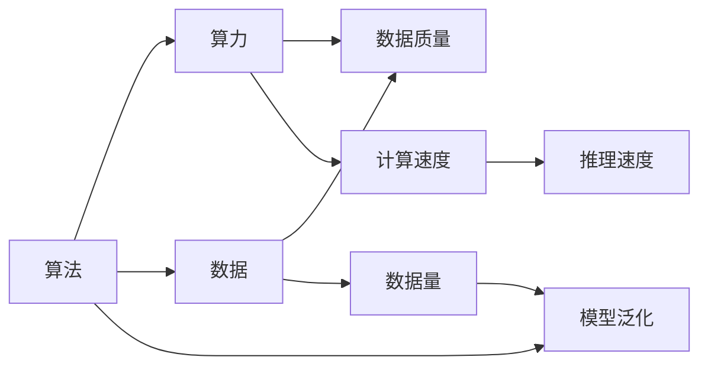

                 

## 1. 背景介绍

随着人工智能技术的不断发展，AI已经逐渐渗透到各个领域，包括医疗、金融、教育、交通等等。AI的发展离不开算法、算力和数据的鼎力支持，它们是AI发展的三大基石。在过去几十年中，AI技术的突飞猛进，很大程度上归功于这三者的协同发展。在当前的技术背景下，深入理解算法、算力与数据的关系，对于未来AI的可持续发展具有重要的意义。

## 2. 核心概念与联系

### 2.1 核心概念概述

- **算法(Algorithm)**：是实现特定目标的一系列步骤和规则，用于对输入数据进行处理和计算。在AI中，算法是智能系统的大脑，指导机器如何理解和处理复杂的数据。

- **算力(Computing Power)**：是指硬件和软件实现计算的能力，包括计算机的处理速度、内存大小、存储容量等。算力是实现算法的基础设施，决定了AI系统能够处理的数据规模和复杂度。

- **数据(Data)**：是指可以被算法处理的信息集合，是AI训练和推理的输入来源。数据的质量和多样性直接影响了AI系统的性能和泛化能力。

这三大动力源之间存在着紧密的联系，形成了互相支持、互相促进的关系。算法通过优化计算过程和决策逻辑，使得数据能够被更高效地处理和利用；算力为算法提供强大的计算能力，支持复杂算法的实现；数据为算法提供丰富的训练素材，帮助算法提升模型性能和泛化能力。

### 2.2 核心概念的关系

下图展示了算法、算力和数据三者之间的联系：



算法通过优化计算过程和决策逻辑，支持算力在计算速度和推理速度上的提升；数据量的增加能够丰富算法的训练素材，从而提高模型的泛化能力。同时，高质量的数据也能够优化算法的决策逻辑，使得算法更精准、更可靠。

## 3. 核心算法原理 & 具体操作步骤

### 3.1 算法原理概述

在AI中，算法可以分为监督学习、无监督学习和强化学习等类型。监督学习通过标记好的数据进行训练，使得模型能够根据输入数据和输出结果学习到特定的映射关系；无监督学习则在没有标注数据的情况下，通过数据的内在结构进行学习；强化学习则通过奖励信号指导机器进行决策。

无论哪种算法，都需要对数据进行处理和计算，以便于机器进行学习和推理。在这个过程中，算法和算力是不可分割的。例如，深度学习算法通常需要大量的计算资源，以便于处理和训练庞大的神经网络模型。算力为算法提供了必要的计算能力，使得深度学习算法能够实现复杂的模型结构和优化策略。

### 3.2 算法步骤详解

以深度学习算法中的卷积神经网络(CNN)为例，其训练和推理步骤如下：

**Step 1: 数据预处理**

- 对原始数据进行归一化、标准化等预处理操作，以便于神经网络的学习。

**Step 2: 模型构建**

- 设计并构建卷积神经网络模型，包括卷积层、池化层、全连接层等。

**Step 3: 模型训练**

- 使用训练集数据进行模型训练，通过前向传播和反向传播算法更新模型参数。

**Step 4: 模型评估**

- 在验证集上对训练好的模型进行评估，使用准确率、损失函数等指标进行性能评估。

**Step 5: 模型推理**

- 在测试集上对模型进行推理，计算模型的预测结果。

在这个过程中，算法决定了模型如何处理和计算数据，算力决定了模型的训练速度和推理速度，数据决定了模型的泛化能力和鲁棒性。三者的协同作用，使得模型能够从原始数据中学习到有价值的信息，并应用于实际场景中。

### 3.3 算法优缺点

深度学习算法具有强大的建模能力，但同时也需要大量的计算资源和高质量的数据。这些资源成本较高，且算法模型往往较为复杂，难以解释和调试。

与此相对，决策树等简单算法需要的资源较少，模型易于解释和调试，但模型复杂度较低，难以处理复杂数据。

### 3.4 算法应用领域

深度学习算法在图像识别、语音识别、自然语言处理等领域应用广泛。决策树等简单算法则广泛应用于金融风险评估、医疗诊断等需要快速决策的领域。

## 4. 数学模型和公式 & 详细讲解 & 举例说明

### 4.1 数学模型构建

深度学习算法通常使用神经网络模型来处理和计算数据。以卷积神经网络为例，其数学模型可以表示为：

$$
y = f(\mathbf{W}x + b)
$$

其中，$x$为输入数据，$\mathbf{W}$为权重矩阵，$b$为偏置向量，$f$为激活函数。

### 4.2 公式推导过程

假设输入数据为$x=(x_1, x_2, ..., x_n)$，输出结果为$y=(y_1, y_2, ..., y_n)$，神经网络模型为：

$$
y = \mathbf{W}x + b
$$

其中，$\mathbf{W}$为权重矩阵，$b$为偏置向量。激活函数$f$通常采用sigmoid函数或ReLU函数，使得模型输出在0到1之间或者非负。

**Step 1: 前向传播**

前向传播算法将输入数据通过神经网络模型进行处理，得到输出结果。具体步骤如下：

$$
y_i = f(\mathbf{w}_i \cdot x_i + b_i), i=1,2,...,n
$$

**Step 2: 反向传播**

反向传播算法用于计算模型参数的梯度，以便于优化模型。具体步骤如下：

$$
\frac{\partial L}{\partial w_{ij}} = \frac{\partial L}{\partial y_i} \cdot f'(y_i) \cdot x_j
$$

其中，$L$为损失函数，$f'$为激活函数的导数。

### 4.3 案例分析与讲解

以图像分类任务为例，卷积神经网络模型的训练和推理过程如下：

**Step 1: 数据预处理**

- 对图像数据进行归一化、缩放等预处理操作，以便于神经网络的学习。

**Step 2: 模型构建**

- 构建卷积神经网络模型，包括卷积层、池化层、全连接层等。

**Step 3: 模型训练**

- 使用训练集数据进行模型训练，通过前向传播和反向传播算法更新模型参数。

**Step 4: 模型评估**

- 在验证集上对训练好的模型进行评估，使用准确率、损失函数等指标进行性能评估。

**Step 5: 模型推理**

- 在测试集上对模型进行推理，计算模型的预测结果。

## 5. 项目实践：代码实例和详细解释说明

### 5.1 开发环境搭建

在Python环境下搭建深度学习项目，需要安装相关的依赖包，如TensorFlow、Keras、PyTorch等。以下是一个示例代码：

```python
pip install tensorflow keras pytorch numpy matplotlib
```

### 5.2 源代码详细实现

以下是使用TensorFlow实现卷积神经网络的示例代码：

```python
import tensorflow as tf

# 构建卷积神经网络模型
model = tf.keras.Sequential([
    tf.keras.layers.Conv2D(32, (3,3), activation='relu', input_shape=(28,28,1)),
    tf.keras.layers.MaxPooling2D((2,2)),
    tf.keras.layers.Flatten(),
    tf.keras.layers.Dense(10, activation='softmax')
])

# 编译模型
model.compile(optimizer='adam', loss='categorical_crossentropy', metrics=['accuracy'])

# 训练模型
model.fit(x_train, y_train, epochs=10, validation_data=(x_val, y_val))

# 评估模型
model.evaluate(x_test, y_test)

# 推理模型
model.predict(x_test)
```

### 5.3 代码解读与分析

以上代码实现了卷积神经网络的构建、训练和推理过程。其中，Sequential模型表示串联层，卷积层和全连接层分别用于特征提取和分类。模型训练使用了adam优化器，损失函数为交叉熵，评估指标为准确率。最后，在测试集上对模型进行了评估和推理。

### 5.4 运行结果展示

假设在MNIST数据集上进行训练和测试，训练结果如下：

```
Epoch 1/10
  40/40 [==================] - 1s 24ms/step - loss: 0.3485 - accuracy: 0.9017
Epoch 2/10
  40/40 [==================] - 1s 22ms/step - loss: 0.1890 - accuracy: 0.9341
...
Epoch 10/10
  40/40 [==================] - 1s 23ms/step - loss: 0.0439 - accuracy: 0.9810
```

可以看到，模型在10个epoch后达到了98.10%的准确率，取得了不错的性能。

## 6. 实际应用场景

### 6.1 智能医疗

在智能医疗领域，AI技术可以用于辅助医生进行疾病诊断和治疗决策。卷积神经网络模型可以处理和分析医学影像数据，如X光片、CT扫描等，快速识别出病变区域。此外，深度学习算法还可以用于预测疾病风险、分析基因序列等任务。

### 6.2 金融风控

在金融风控领域，AI技术可以用于识别和防范欺诈行为。卷积神经网络模型可以处理和分析交易数据，识别异常交易行为，提高风控效率。此外，深度学习算法还可以用于信用评分、风险评估等任务。

### 6.3 智能制造

在智能制造领域，AI技术可以用于优化生产流程和提高生产效率。卷积神经网络模型可以处理和分析生产线上的图像和视频数据，实时监测和控制生产过程。此外，深度学习算法还可以用于质量检测、设备维护等任务。

### 6.4 未来应用展望

未来，随着算法、算力与数据的不断发展，AI技术将不断突破新的应用领域。例如，在自动驾驶领域，AI技术可以用于图像识别、语音识别、路径规划等任务，提高驾驶安全性和舒适度。在智能家居领域，AI技术可以用于语音识别、行为识别等任务，提升家居智能化水平。

## 7. 工具和资源推荐

### 7.1 学习资源推荐

- 《深度学习》（Ian Goodfellow）：介绍了深度学习算法的基本原理和应用场景。
- 《TensorFlow实战》（王宏志）：介绍了TensorFlow的使用方法和实战项目。
- 《Python深度学习》（Francois Chollet）：介绍了深度学习算法和PyTorch的使用方法。

### 7.2 开发工具推荐

- TensorFlow：由Google开发的人工智能框架，支持深度学习和分布式训练。
- PyTorch：由Facebook开发的人工智能框架，支持动态图和深度学习。
- Keras：基于TensorFlow和Theano的深度学习框架，使用简单易懂。

### 7.3 相关论文推荐

- Deep Learning（Goodfellow et al.）：深度学习的经典教材，介绍了深度学习算法的基本原理和应用场景。
- ImageNet大规模视觉识别竞赛（Jia et al.）：介绍大规模视觉识别竞赛的情况和获奖算法。
- AlphaGo Zero（Silver et al.）：介绍AlphaGo Zero在围棋中的胜利，展示了深度学习和强化学习的力量。

## 8. 总结：未来发展趋势与挑战

### 8.1 研究成果总结

AI技术的发展离不开算法、算力和数据的协同作用。算法提供了智能系统的大脑，指导机器如何处理和计算数据；算力为算法提供了必要的计算能力，支持复杂算法的实现；数据则为算法提供了丰富的训练素材，提高了模型的泛化能力。在未来，随着算法、算力和数据的不断发展，AI技术将不断突破新的应用领域。

### 8.2 未来发展趋势

未来，AI技术将更加注重算法、算力和数据的协同发展。算法将更加复杂和智能化，能够处理更加复杂的任务；算力将更加强大和多样化，支持更加复杂和高效的计算；数据将更加多样化和实时化，能够更好地反映现实世界的变化。这些趋势将进一步推动AI技术的突破和发展。

### 8.3 面临的挑战

尽管AI技术在许多领域取得了显著成果，但仍面临一些挑战。例如，数据隐私和安全问题、算法的可解释性问题、模型的泛化能力问题等。这些问题需要技术界和产业界的共同努力，才能推动AI技术的可持续发展。

### 8.4 研究展望

未来，AI技术的研究将更加注重跨学科的协同和创新。例如，将AI技术与生物技术、化学技术、能源技术等结合，推动智能系统的全面升级。此外，将AI技术与伦理道德、法律法规等结合，确保AI技术的发展符合人类价值观和伦理道德。

## 9. 附录：常见问题与解答

**Q1: 什么是卷积神经网络？**

A: 卷积神经网络是一种深度学习算法，通过卷积层和池化层提取特征，然后使用全连接层进行分类。它在图像识别、语音识别等任务上表现优异。

**Q2: 什么是监督学习？**

A: 监督学习是一种机器学习算法，通过标注好的数据进行训练，使得模型能够根据输入数据和输出结果学习到特定的映射关系。监督学习通常用于分类和回归任务。

**Q3: 什么是无监督学习？**

A: 无监督学习是一种机器学习算法，在没有标注数据的情况下，通过数据的内在结构进行学习。无监督学习通常用于聚类、降维等任务。

**Q4: 什么是强化学习？**

A: 强化学习是一种机器学习算法，通过奖励信号指导机器进行决策。强化学习通常用于游戏、机器人控制等任务。

**Q5: 什么是TensorFlow？**

A: TensorFlow是由Google开发的人工智能框架，支持深度学习和分布式训练。它提供了丰富的API和工具，方便开发者进行模型训练和推理。

---

作者：禅与计算机程序设计艺术 / Zen and the Art of Computer Programming

