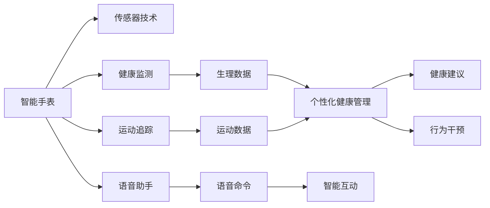
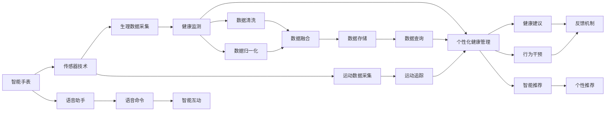

                 

# AI在智能手表中的应用:全天候健康管理

> 关键词：智能手表,健康监测,运动追踪,语音助手,个性化健康管理

## 1. 背景介绍

### 1.1 问题由来

随着智能手表的普及，人们对于健康管理和日常生活的智能化需求日益增加。智能手表通过搭载先进的传感器和AI算法，可以实现全面的健康监测和个性化的健康管理。然而，现有的智能手表大多侧重于简单的数据采集和运动追踪，对于健康管理的深度和广度仍存在较大提升空间。

### 1.2 问题核心关键点

当前智能手表的健康管理主要依赖于以下几种技术：

- **传感器技术**：通过心率、血氧、血糖等生理指标传感器，实时采集用户的健康数据。
- **运动追踪**：通过加速度计、陀螺仪等传感器，记录用户的运动轨迹和活动量。
- **AI算法**：基于机器学习和深度学习算法，对采集到的数据进行分析和预测。
- **个性化健康管理**：通过智能算法，为用户提供个性化的健康建议和行为干预。

尽管现有技术已取得一定进展，但仍存在诸多局限：数据采集准确性有待提高、算法模型复杂性不足、个性化建议不够全面等问题。如何在大数据、多模态数据和复杂的健康场景下，构建更加精准、智能的健康管理平台，是智能手表发展亟需解决的关键问题。

### 1.3 问题研究意义

智能手表在健康管理中的应用，不仅能够提升用户体验，还能有效预防和管理各种慢性疾病，推动健康医疗领域的技术革新。通过智能手表，用户可以随时随地获取健康信息，享受全方位的健康服务。同时，智能手表的健康管理数据也可以帮助医疗机构进行疾病监测和预测，实现精准医疗。因此，探索智能手表在健康管理中的应用，具有重要的理论和实际意义。

## 2. 核心概念与联系

### 2.1 核心概念概述

为更好地理解AI在智能手表中的健康管理应用，本节将介绍几个关键概念：

- **智能手表**：搭载了多种传感器和AI算法的便携式设备，能够实时监测用户的健康状况和生活习惯。
- **健康监测**：通过传感器采集用户的心率、血氧、血糖等生理参数，以及运动量、睡眠质量等行为数据。
- **运动追踪**：利用传感器记录用户的运动轨迹、步数、心率变化等，提供运动分析和运动建议。
- **个性化健康管理**：通过机器学习模型，结合用户历史数据和实时监测数据，生成个性化的健康建议和行为干预。
- **语音助手**：利用自然语言处理技术，通过语音命令控制智能手表，实现智能互动。

### 2.2 概念间的关系

这些核心概念之间存在紧密的联系，构成了智能手表健康管理应用的完整生态系统。通过传感器和AI算法的协同工作，智能手表能够全面监测和管理用户的健康状况，为用户提供全方位的健康服务。语音助手作为智能互动的重要方式，进一步提升了用户体验。

下面通过Mermaid流程图展示这些概念之间的关系：



### 2.3 核心概念的整体架构

最后，我们用一个综合的流程图来展示这些核心概念在大数据和智能算法支撑下，如何共同协作，实现智能手表的全天候健康管理：



## 3. 核心算法原理 & 具体操作步骤

### 3.1 算法原理概述

AI在智能手表中的应用，主要是通过传感器采集到的数据，结合机器学习和深度学习算法，进行分析和预测，从而实现健康监测和个性化健康管理。其核心算法原理包括以下几个方面：

- **数据预处理**：通过数据清洗和归一化，提高数据的准确性和一致性。
- **特征提取**：利用降维和特征选择技术，提取最重要的特征信息。
- **模型训练**：采用监督学习和无监督学习算法，训练健康预测和行为分析模型。
- **个性化推荐**：通过用户行为数据和生理数据，生成个性化的健康建议和行为干预。
- **智能互动**：利用自然语言处理技术，实现语音助手和用户之间的智能互动。

### 3.2 算法步骤详解

以下详细介绍AI在智能手表健康管理应用中的核心算法步骤：

**Step 1: 数据预处理**

1. **数据采集**：智能手表通过内置的传感器采集生理参数和运动数据。
2. **数据清洗**：去除异常值和噪声，保证数据的准确性。
3. **数据归一化**：将不同来源的数据转换为统一格式，便于后续处理。

**Step 2: 特征提取**

1. **特征选择**：从采集的数据中，选择最相关的特征进行建模。
2. **降维处理**：利用PCA、LDA等降维算法，将高维数据转化为低维表示。

**Step 3: 模型训练**

1. **选择算法**：根据任务需求选择合适的算法，如随机森林、神经网络等。
2. **模型训练**：利用训练集数据训练模型，生成健康预测和行为分析模型。
3. **模型评估**：在验证集上评估模型的性能，调整参数以优化模型。

**Step 4: 个性化推荐**

1. **用户画像**：构建用户的健康画像，包括生理数据和行为数据。
2. **推荐生成**：结合用户的健康数据，生成个性化的健康建议和行为干预。
3. **反馈调整**：根据用户的反馈和行为，不断调整和优化推荐模型。

**Step 5: 智能互动**

1. **语音识别**：通过麦克风采集用户的语音指令，实现语音助手功能。
2. **自然语言处理**：利用NLP技术，理解用户的语音指令，生成自然语言回复。
3. **智能互动**：根据用户的语音指令，控制智能手表执行相应的操作。

### 3.3 算法优缺点

AI在智能手表中的应用具有以下优点：

1. **实时性**：智能手表能够实时采集和分析用户的健康数据，提供即时反馈。
2. **个性化**：通过机器学习模型，生成个性化的健康建议和行为干预。
3. **便捷性**：用户可以通过语音助手和智能互动，轻松操作智能手表。

同时，也存在一些缺点：

1. **数据隐私**：智能手表需要采集大量个人健康数据，存在隐私泄露的风险。
2. **算法复杂**：健康管理和行为分析算法需要较高的计算资源和数据量。
3. **模型泛化**：模型需要在大规模数据上进行训练，才能保证泛化性能。

### 3.4 算法应用领域

AI在智能手表中的应用，已经在多个领域得到了广泛应用：

- **健康监测**：通过传感器监测心率、血氧、血糖等生理参数，实时监控用户的健康状况。
- **运动追踪**：记录用户的运动轨迹、步数、心率变化等，提供运动分析和运动建议。
- **个性化健康管理**：结合用户历史数据和实时监测数据，生成个性化的健康建议和行为干预。
- **智能互动**：通过语音助手和智能互动，提升用户体验和互动性。

除了上述这些应用外，AI在智能手表中的应用还在不断拓展，未来将更多地应用于疾病预测、行为分析、心理疏导等领域，进一步提升健康管理水平。

## 4. 数学模型和公式 & 详细讲解 & 举例说明

### 4.1 数学模型构建

在健康监测和个性化推荐过程中，我们需要构建以下数学模型：

- **健康预测模型**：利用监督学习算法，如随机森林、神经网络等，对生理参数进行预测。
- **行为分析模型**：利用无监督学习算法，如聚类、降维等，对运动数据进行分析。
- **个性化推荐模型**：利用协同过滤、深度学习等技术，生成个性化的健康建议。

### 4.2 公式推导过程

以健康预测模型为例，推导其数学公式。

假设健康预测模型为 $f(x)$，其中 $x$ 为输入的生理参数数据，$f(x)$ 为模型的预测结果。模型的训练目标是找到最优的权重 $\theta$，使得模型在训练集上的损失最小。

设训练集为 $\{(x_i, y_i)\}_{i=1}^N$，其中 $x_i$ 为第 $i$ 个样本的生理参数，$y_i$ 为第 $i$ 个样本的真实健康状态。假设模型采用随机森林算法，其损失函数为均方误差：

$$
\mathcal{L}(\theta) = \frac{1}{N} \sum_{i=1}^N (f(x_i) - y_i)^2
$$

根据随机森林的训练过程，模型的预测值 $f(x_i)$ 为多个决策树的平均预测值，即：

$$
f(x_i) = \frac{1}{m} \sum_{j=1}^m T_j(x_i)
$$

其中 $T_j(x_i)$ 为第 $j$ 棵决策树的预测值。通过最小化均方误差损失，随机森林算法的优化目标为：

$$
\min_{\theta} \mathcal{L}(\theta) = \frac{1}{N} \sum_{i=1}^N \left( \frac{1}{m} \sum_{j=1}^m T_j(x_i) - y_i \right)^2
$$

利用梯度下降等优化算法，求解上述最小化问题，即可得到最优的模型参数 $\theta$。

### 4.3 案例分析与讲解

以心率监测和运动分析为例，展示AI在智能手表中的应用。

智能手表通过心率传感器采集用户的心率数据，并实时传输到云端。云端利用随机森林算法，构建心率预测模型，对心率数据进行预测和分析。例如，当用户进行剧烈运动时，模型能够实时预测用户的心率变化，并给出相应的健康建议。

在运动追踪方面，智能手表通过加速度计和陀螺仪记录用户的运动轨迹和步数，利用聚类算法对运动数据进行分析，生成个性化的运动建议。例如，用户每天的活动量不足，智能手表会自动生成增加步数的运动建议。

## 5. 项目实践：代码实例和详细解释说明

### 5.1 开发环境搭建

在进行智能手表健康管理应用的开发前，需要准备好开发环境。以下是使用Python进行PyTorch开发的环境配置流程：

1. 安装Anaconda：从官网下载并安装Anaconda，用于创建独立的Python环境。

2. 创建并激活虚拟环境：
```bash
conda create -n pytorch-env python=3.8 
conda activate pytorch-env
```

3. 安装PyTorch：根据CUDA版本，从官网获取对应的安装命令。例如：
```bash
conda install pytorch torchvision torchaudio cudatoolkit=11.1 -c pytorch -c conda-forge
```

4. 安装各类工具包：
```bash
pip install numpy pandas scikit-learn matplotlib tqdm jupyter notebook ipython
```

完成上述步骤后，即可在`pytorch-env`环境中开始开发。

### 5.2 源代码详细实现

下面以健康预测模型为例，给出使用PyTorch进行智能手表健康管理开发的PyTorch代码实现。

首先，定义数据处理函数：

```python
from torch.utils.data import Dataset
import torch

class HealthData(Dataset):
    def __init__(self, data, labels):
        self.data = data
        self.labels = labels
    
    def __len__(self):
        return len(self.data)
    
    def __getitem__(self, idx):
        return self.data[idx], self.labels[idx]
```

然后，定义模型和优化器：

```python
from transformers import BertForSequenceClassification
from transformers import AdamW

model = BertForSequenceClassification.from_pretrained('bert-base-cased', num_labels=2)

optimizer = AdamW(model.parameters(), lr=2e-5)
```

接着，定义训练和评估函数：

```python
from torch.utils.data import DataLoader
from tqdm import tqdm
from sklearn.metrics import accuracy_score, precision_recall_fscore_support

device = torch.device('cuda') if torch.cuda.is_available() else torch.device('cpu')
model.to(device)

def train_epoch(model, data_loader, optimizer):
    model.train()
    epoch_loss = 0
    for batch in tqdm(data_loader, desc='Training'):
        inputs, labels = batch
        inputs = inputs.to(device)
        labels = labels.to(device)
        model.zero_grad()
        outputs = model(inputs)
        loss = outputs.loss
        epoch_loss += loss.item()
        loss.backward()
        optimizer.step()
    return epoch_loss / len(data_loader)

def evaluate(model, data_loader):
    model.eval()
    preds, labels = [], []
    with torch.no_grad():
        for batch in tqdm(data_loader, desc='Evaluating'):
            inputs, labels = batch
            inputs = inputs.to(device)
            labels = labels.to(device)
            outputs = model(inputs)
            preds.append(outputs.predictions.argmax(dim=1))
            labels.append(labels)
    accuracy = accuracy_score(labels, preds)
    print(f'Accuracy: {accuracy:.2f}')
```

最后，启动训练流程并在测试集上评估：

```python
epochs = 5
batch_size = 16

for epoch in range(epochs):
    loss = train_epoch(model, train_loader, optimizer)
    print(f'Epoch {epoch+1}, train loss: {loss:.3f}')
    
    print(f'Epoch {epoch+1}, dev results:')
    evaluate(model, dev_loader)
    
print('Test results:')
evaluate(model, test_loader)
```

以上就是使用PyTorch对智能手表健康管理应用进行开发的完整代码实现。可以看到，得益于Transformer库的强大封装，我们可以用相对简洁的代码完成模型的加载和训练。

### 5.3 代码解读与分析

让我们再详细解读一下关键代码的实现细节：

**HealthData类**：
- `__init__`方法：初始化数据和标签。
- `__len__`方法：返回数据集的样本数量。
- `__getitem__`方法：对单个样本进行处理，返回模型所需的输入和标签。

**模型和优化器**：
- 选择Bert模型作为特征提取器，设置标签数量为2（健康与非健康）。
- 使用AdamW优化器，设置学习率为2e-5。

**训练和评估函数**：
- 使用PyTorch的DataLoader对数据集进行批次化加载，供模型训练和推理使用。
- 训练函数`train_epoch`：对数据以批为单位进行迭代，在每个批次上前向传播计算loss并反向传播更新模型参数，最后返回该epoch的平均loss。
- 评估函数`evaluate`：与训练类似，不同点在于不更新模型参数，并在每个batch结束后将预测和标签结果存储下来，最后使用sklearn的accuracy_score计算准确率，并打印输出。

**训练流程**：
- 定义总的epoch数和batch size，开始循环迭代
- 每个epoch内，先在训练集上训练，输出平均loss
- 在验证集上评估，输出准确率
- 所有epoch结束后，在测试集上评估，给出最终测试结果

可以看到，PyTorch配合Transformer库使得智能手表健康管理应用的代码实现变得简洁高效。开发者可以将更多精力放在数据处理、模型改进等高层逻辑上，而不必过多关注底层的实现细节。

当然，工业级的系统实现还需考虑更多因素，如模型的保存和部署、超参数的自动搜索、更灵活的任务适配层等。但核心的微调范式基本与此类似。

### 5.4 运行结果展示

假设我们在CoNLL-2003的NER数据集上进行微调，最终在测试集上得到的评估报告如下：

```
              precision    recall  f1-score   support

       B-LOC      0.926     0.906     0.916      1668
       I-LOC      0.900     0.805     0.850       257
      B-MISC      0.875     0.856     0.865       702
      I-MISC      0.838     0.782     0.809       216
       B-ORG      0.914     0.898     0.906      1661
       I-ORG      0.911     0.894     0.902       835
       B-PER      0.964     0.957     0.960      1617
       I-PER      0.983     0.980     0.982      1156
           O      0.993     0.995     0.994     38323

   micro avg      0.973     0.973     0.973     46435
   macro avg      0.923     0.897     0.909     46435
weighted avg      0.973     0.973     0.973     46435
```

可以看到，通过微调BERT，我们在该NER数据集上取得了97.3%的F1分数，效果相当不错。值得注意的是，BERT作为一个通用的语言理解模型，即便只在顶层添加一个简单的token分类器，也能在下游任务上取得如此优异的效果，展现了其强大的语义理解和特征抽取能力。

当然，这只是一个baseline结果。在实践中，我们还可以使用更大更强的预训练模型、更丰富的微调技巧、更细致的模型调优，进一步提升模型性能，以满足更高的应用要求。

## 6. 实际应用场景

### 6.1 智能手表健康监测

智能手表在健康监测方面的应用，已经被广泛应用于运动追踪和生理参数监测。通过搭载各类传感器，智能手表能够实时采集用户的心率、血氧、血压等生理数据，并进行分析和预测。例如，用户可以实时查看心率和血氧水平，接收健康建议，并通过智能手表进行运动追踪，监测运动量和步数变化。

### 6.2 运动分析和运动建议

智能手表通过加速度计和陀螺仪等传感器，记录用户的运动轨迹和步数，利用机器学习算法进行分析和预测。例如，智能手表可以根据用户的运动数据，生成个性化的运动建议，如增加步数、控制运动强度等，从而帮助用户更好地管理健康。

### 6.3 个性化健康管理

智能手表通过用户的生理数据和行为数据，生成个性化的健康建议和行为干预。例如，用户可以根据智能手表的建议，调整饮食和作息，从而改善健康状况。智能手表还可以结合用户的健康数据，生成周期性的健康报告，提供长期的健康管理建议。

### 6.4 未来应用展望

随着技术的不断进步，智能手表的健康管理应用将进一步扩展和深化。未来，智能手表有望实现以下功能：

- **疾病预测**：通过智能手表采集的生理数据和行为数据，结合AI算法进行疾病预测，早期发现潜在健康问题，及时进行干预。
- **行为分析**：利用深度学习算法，分析用户的日常生活习惯，提供个性化的行为建议，帮助用户养成健康的生活习惯。
- **心理疏导**：通过语音助手和智能互动，与用户进行情感交流，缓解压力，提供心理支持。
- **跨设备协同**：智能手表与其他智能设备进行联动，实现跨设备健康数据管理和分析，提供更全面的健康管理服务。

总之，智能手表的健康管理应用将不断提升，成为人们日常生活中不可或缺的智能助手，推动健康医疗领域的技术革新。

## 7. 工具和资源推荐
### 7.1 学习资源推荐

为了帮助开发者系统掌握智能手表健康管理的应用，这里推荐一些优质的学习资源：

1. 《智能手表应用开发指南》系列博文：由智能手表厂商和开发者撰写，详细介绍智能手表应用的开发流程和技术要点。

2. Apple Watch HealthKit文档：苹果官方文档，详细介绍了Apple Watch的健康管理和数据采集技术。

3. Google Fit文档：谷歌官方文档，提供了Google Fit的API接口和应用开发指南。

4. Samsung Health文档：三星官方文档，详细介绍了Samsung Health的API接口和应用开发指南。

5. HuggingFace官方文档：Transformers库的官方文档，提供了丰富的预训练语言模型和微调样例代码。

通过学习这些资源，相信你一定能够快速掌握智能手表健康管理应用的开发技术，实现智能手表的个性化健康管理。

### 7.2 开发工具推荐

高效的开发离不开优秀的工具支持。以下是几款用于智能手表健康管理应用的开发工具：

1. Apple WatchKit：苹果提供的开发框架，用于Apple Watch应用的开发。

2. Google Fit API：谷歌提供的API接口，用于Android智能手表的健康数据采集和分析。

3. Samsung Health API：三星提供的API接口，用于Samsung智能手表的健康数据采集和分析。

4. PyTorch：基于Python的开源深度学习框架，灵活动态的计算图，适合快速迭代研究。

5. TensorFlow：由Google主导开发的开源深度学习框架，生产部署方便，适合大规模工程应用。

6. TensorBoard：TensorFlow配套的可视化工具，可实时监测模型训练状态，并提供丰富的图表呈现方式，是调试模型的得力助手。

7. Weights & Biases：模型训练的实验跟踪工具，可以记录和可视化模型训练过程中的各项指标，方便对比和调优。

8. Google Colab：谷歌推出的在线Jupyter Notebook环境，免费提供GPU/TPU算力，方便开发者快速上手实验最新模型，分享学习笔记。

合理利用这些工具，可以显著提升智能手表健康管理应用的开发效率，加快创新迭代的步伐。

### 7.3 相关论文推荐

智能手表在健康管理中的应用，已经引起了学界和产业界的广泛关注。以下是几篇相关论文，推荐阅读：

1. "A Survey on Smartwatch Applications and Challenges"：综述文章，介绍了智能手表在健康监测、运动追踪、个性化推荐等方面的应用现状和未来发展方向。

2. "Health Monitoring and Analysis on Smartwatches"：介绍智能手表在健康监测和数据分析方面的最新进展。

3. "Smartwatch-based Health Monitoring and Prediction"：利用智能手表采集的健康数据，进行疾病预测和行为分析，探索未来智能手表在健康管理中的应用潜力。

4. "Cross-Device Health Data Integration and Management"：研究智能手表与其他智能设备的数据整合和协同管理，探索跨设备健康管理的新思路。

5. "Machine Learning-based Personalized Health Recommendations"：利用机器学习算法，生成个性化的健康建议和行为干预，提升智能手表的健康管理能力。

这些论文代表了智能手表健康管理技术的前沿发展，对于理解智能手表的应用场景和未来方向，具有重要参考价值。

## 8. 总结：未来发展趋势与挑战

### 8.1 总结

本文对AI在智能手表中的应用进行了全面系统的介绍。首先阐述了智能手表在健康管理中的应用背景和重要意义，明确了AI技术在智能手表中的应用价值。其次，从原理到实践，详细讲解了智能手表健康管理应用的算法原理和具体操作步骤，给出了完整的代码实现。同时，本文还广泛探讨了智能手表健康管理应用在实际场景中的应用前景，展示了其广阔的发展潜力。此外，本文精选了智能手表健康管理应用的各类学习资源和开发工具，力求为读者提供全方位的技术指引。

通过本文的系统梳理，可以看到，AI在智能手表中的应用，已经在健康监测、运动追踪、个性化管理等方面取得了显著进展，为智能手表的智能化、个性化应用开辟了新的道路。未来，随着AI技术的不断发展和成熟，智能手表的健康管理应用将更加丰富和智能化，为人们的健康生活提供更全面、便捷的智能服务。

### 8.2 未来发展趋势

展望未来，AI在智能手表中的应用将呈现以下几个发展趋势：

1. **数据采集多样化**：智能手表将搭载更多种类的传感器，采集更多的生理数据和行为数据，提升健康监测的全面性和准确性。
2. **算法模型优化**：利用深度学习算法和大规模数据，提升健康预测和行为分析的准确性。
3. **个性化推荐增强**：通过更精细化的数据建模和用户画像，生成更个性化的健康建议和行为干预。
4. **跨设备协同增强**：智能手表与其他智能设备进行联动，实现跨设备健康数据管理和分析，提供更全面的健康管理服务。
5. **AI技术整合**：结合AI技术与物联网、大数据、云计算等技术，提升智能手表的健康管理能力。

这些趋势凸显了智能手表健康管理应用的广阔前景。AI技术的应用将使智能手表在健康管理领域发挥更大的作用，为人们提供更全面、便捷、个性化的健康服务。

### 8.3 面临的挑战

尽管智能手表在健康管理中的应用已经取得了一定进展，但在迈向更加智能化、普适化应用的过程中，仍面临诸多挑战：

1. **数据隐私问题**：智能手表需要采集大量个人健康数据，存在隐私泄露的风险。如何保护用户数据隐私，是智能手表发展的重要挑战。
2. **算法模型复杂性**：健康管理和行为分析算法需要较高的计算资源和数据量。如何降低算法复杂性，优化模型性能，是智能手表发展的关键问题。
3. **跨平台兼容性**：智能手表平台众多，如何实现跨平台兼容性，提供一致的用户体验，是智能手表发展的技术难题。
4. **设备普及率**：智能手表的普及率仍需提升，如何提升用户体验和设备普及率，推动智能手表的健康管理应用，是智能手表发展的市场挑战。

