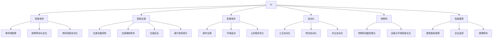
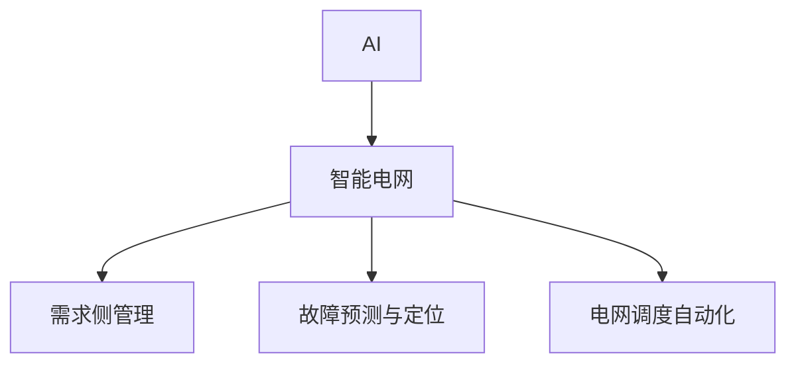
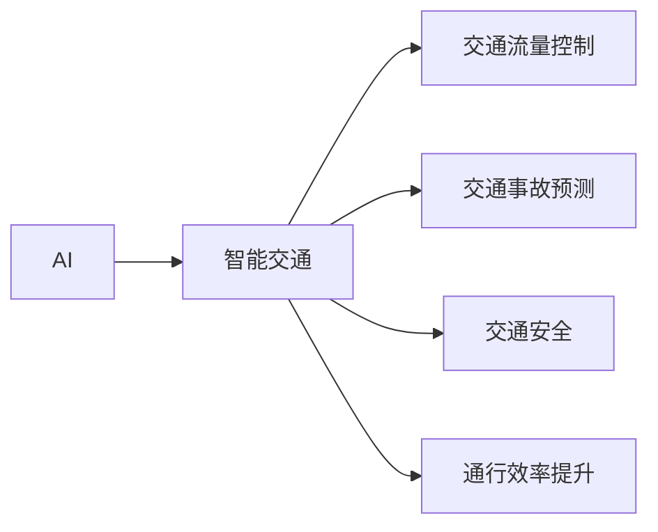
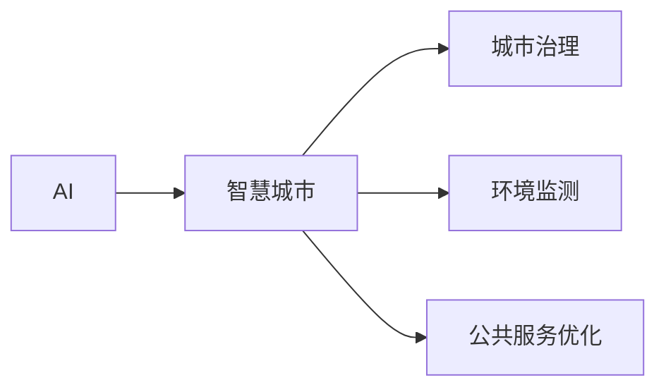
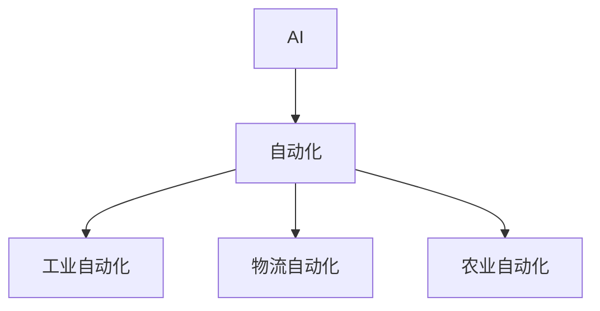
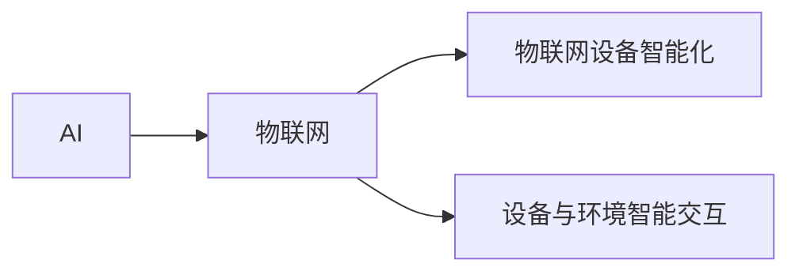
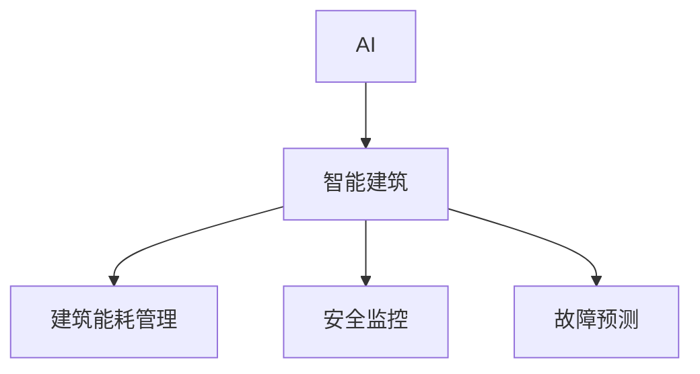

                 

# AI在物理基础设施中的应用

> 关键词：AI, 物理基础设施, 智能电网, 智能交通, 智慧城市, 自动化, 物联网, 智能建筑

## 1. 背景介绍

### 1.1 问题由来
随着科技的迅猛发展，人工智能（AI）正在逐步渗透到各行各业，从传统的制造业到新兴的科技产业，AI的应用场景不断扩展。其中，物理基础设施（Physical Infrastructure）作为支撑现代社会的基石，其智能化改造和升级也成为了AI应用的重要方向。物理基础设施包括交通网络、能源供应、建筑设施等众多方面，其智能化升级不仅有助于提高效率、降低成本，还能极大提升安全性、提升用户体验。

### 1.2 问题核心关键点
AI在物理基础设施中的应用，主要体现在以下几个方面：

- **智能电网**：通过AI技术优化电力供应与消费，实现需求侧管理、故障预测与定位、电网调度自动化等。
- **智能交通**：利用AI技术优化交通流量控制、预测交通事故、提升交通安全和通行效率。
- **智慧城市**：通过AI技术实现城市治理、环境监测、公共服务优化等，提升城市智能化管理水平。
- **自动化**：利用AI技术实现工业自动化、物流自动化、农业自动化等，提升生产效率与资源利用率。
- **物联网**：通过AI技术提升物联网设备的智能化水平，实现设备与环境的智能交互。
- **智能建筑**：通过AI技术实现建筑能耗管理、安全监控、故障预测等，提升建筑智能化管理水平。

### 1.3 问题研究意义
AI在物理基础设施中的应用，具有以下重要意义：

- **提升效率**：AI技术可以自动优化资源配置、减少人为操作误差，极大提升物理基础设施的运营效率。
- **降低成本**：通过AI技术预测设备故障、优化运行策略，减少资源浪费和维修成本，实现经济效益最大化。
- **提升安全性**：AI技术可以通过实时监测和预测，及时发现并处理安全隐患，提升物理基础设施的安全性。
- **改善用户体验**：AI技术可以提供个性化的服务与高效的响应，提升用户的满意度和体验感。
- **推动科技进步**：AI技术在物理基础设施中的应用，有助于推动新一轮的技术创新与产业升级，为社会带来新的发展机遇。

## 2. 核心概念与联系

### 2.1 核心概念概述

为更好地理解AI在物理基础设施中的应用，本节将介绍几个密切相关的核心概念：

- **AI**：人工智能，一种通过算法和数据使机器模拟人类智能的技术。包括机器学习、深度学习、自然语言处理等众多分支。
- **物理基础设施**：包括交通网络、能源供应、建筑设施等，为人类社会的正常运转提供基础支撑。
- **智能电网**：通过AI技术优化电力供应与消费，实现需求侧管理、故障预测与定位、电网调度自动化等。
- **智能交通**：利用AI技术优化交通流量控制、预测交通事故、提升交通安全和通行效率。
- **智慧城市**：通过AI技术实现城市治理、环境监测、公共服务优化等，提升城市智能化管理水平。
- **自动化**：利用AI技术实现工业自动化、物流自动化、农业自动化等，提升生产效率与资源利用率。
- **物联网**：通过AI技术提升物联网设备的智能化水平，实现设备与环境的智能交互。
- **智能建筑**：通过AI技术实现建筑能耗管理、安全监控、故障预测等，提升建筑智能化管理水平。

这些核心概念之间的逻辑关系可以通过以下Mermaid流程图来展示：



这个流程图展示了一个AI在物理基础设施中应用的整体架构。AI技术通过各种具体的应用场景，实现从电力、交通、城市、工业、物联网到建筑的全面智能化升级。

### 2.2 概念间的关系

这些核心概念之间存在着紧密的联系，形成了AI在物理基础设施中的应用生态系统。下面我们通过几个Mermaid流程图来展示这些概念之间的关系。

#### 2.2.1 AI在智能电网中的应用



这个流程图展示了AI在智能电网中的应用。通过AI技术，智能电网可以优化电力供应与消费，实现需求侧管理、故障预测与定位、电网调度自动化等功能。

#### 2.2.2 AI在智能交通中的应用



这个流程图展示了AI在智能交通中的应用。通过AI技术，智能交通可以优化交通流量控制、预测交通事故、提升交通安全和通行效率。

#### 2.2.3 AI在智慧城市中的应用



这个流程图展示了AI在智慧城市中的应用。通过AI技术，智慧城市可以实现城市治理、环境监测、公共服务优化等功能，提升城市智能化管理水平。

#### 2.2.4 AI在自动化中的应用



这个流程图展示了AI在自动化中的应用。通过AI技术，自动化可以实现工业自动化、物流自动化、农业自动化等功能，提升生产效率与资源利用率。

#### 2.2.5 AI在物联网中的应用



这个流程图展示了AI在物联网中的应用。通过AI技术，物联网可以实现设备与环境的智能交互，提升物联网设备的智能化水平。

#### 2.2.6 AI在智能建筑中的应用



这个流程图展示了AI在智能建筑中的应用。通过AI技术，智能建筑可以实现建筑能耗管理、安全监控、故障预测等功能，提升建筑智能化管理水平。

### 2.3 核心概念的整体架构

最后，我们用一个综合的流程图来展示这些核心概念在大基础设施中应用的整体架构：


这个综合流程图展示了从AI到大基础设施中各种具体应用的完整过程。AI技术通过各种具体的应用场景，实现从电力、交通、城市、工业、物联网到建筑的全面智能化升级。

## 3. 核心算法原理 & 具体操作步骤
### 3.1 算法原理概述

AI在物理基础设施中的应用，本质上是通过机器学习算法和深度学习模型，对物理基础设施中的各种数据进行分析和预测，从而实现智能化管理和优化。其核心思想是：利用AI技术，从大量的物理基础设施数据中提取特征，并构建出能够自动学习和适应新情况的智能系统。

形式化地，假设物理基础设施的传感器和设备实时采集的数据为 $D_t = \{(x_i, y_i)\}_{i=1}^T$，其中 $x_i$ 为传感器采集到的特征向量，$y_i$ 为对应标签（如电能消耗、交通流量等）。通过监督学习算法，我们可以构建一个预测模型 $M$，使得对于任意新的数据 $x$，模型可以预测出对应的标签 $y$：

$$
M(x) = \arg\max_{y \in \mathcal{Y}} P(y|x)
$$

其中 $\mathcal{Y}$ 为标签空间。通过最大化后验概率，模型可以输出最可能的标签。

### 3.2 算法步骤详解

AI在物理基础设施中的应用，一般包括以下几个关键步骤：

**Step 1: 数据预处理与标注**
- 收集物理基础设施的传感器和设备实时采集的数据，进行清洗和预处理，去除噪声和异常值。
- 根据具体应用场景，将数据标注为标签，如电能消耗、交通流量等。

**Step 2: 构建模型**
- 选择合适的机器学习或深度学习模型，如线性回归、支持向量机、随机森林、卷积神经网络（CNN）、循环神经网络（RNN）等。
- 设置模型的超参数，如学习率、正则化系数、批大小等。

**Step 3: 模型训练**
- 将处理好的数据分为训练集、验证集和测试集。
- 使用训练集对模型进行监督学习，最小化损失函数，更新模型参数。
- 在验证集上评估模型性能，避免过拟合，调整模型参数。
- 最终在测试集上评估模型性能，确定模型的泛化能力。

**Step 4: 模型部署与应用**
- 将训练好的模型部署到物理基础设施中，进行实时监测和预测。
- 根据模型的输出，自动调节物理基础设施的运行状态，优化资源配置。
- 不断收集新数据，更新模型，提升模型的适应性和鲁棒性。

以上是AI在物理基础设施中应用的一般流程。在实际应用中，还需要针对具体任务和数据特点，对模型构建和训练过程进行优化设计，以进一步提升模型的性能和泛化能力。

### 3.3 算法优缺点

AI在物理基础设施中的应用，具有以下优点：

1. **提高效率**：通过自动化的数据分析和预测，AI可以优化物理基础设施的运营效率，减少人为操作误差。
2. **降低成本**：通过预测设备故障和优化资源配置，AI可以降低运行成本和维护成本，提升经济效益。
3. **提升安全性**：通过实时监测和预测，AI可以及时发现并处理安全隐患，提升物理基础设施的安全性。
4. **改善用户体验**：通过个性化的服务和高效的响应，AI可以提升用户的满意度和体验感。
5. **推动科技进步**：AI在物理基础设施中的应用，有助于推动新一轮的技术创新与产业升级，为社会带来新的发展机遇。

同时，AI在物理基础设施中的应用也存在一些局限性：

1. **数据质量要求高**：AI模型的性能很大程度上取决于输入数据的质量和数量，数据清洗和预处理需要较高的技术水平。
2. **模型复杂度高**：AI模型通常具有较高的计算复杂度，需要高性能的计算设备和算法支持。
3. **应用场景复杂**：物理基础设施涉及的设备和场景众多，AI应用需要针对具体场景进行优化和调整。
4. **隐私和安全问题**：AI在物理基础设施中的应用，涉及大量敏感数据的收集和处理，隐私和安全问题需要特别关注。
5. **对人类工作的替代性**：AI的应用可能会对部分人类工作产生替代性影响，需要进行相应的就业转型和技能培训。

尽管存在这些局限性，但AI在物理基础设施中的应用前景广阔，具有重要的应用价值和研究意义。

### 3.4 算法应用领域

AI在物理基础设施中的应用，涉及多个领域，具体包括：

- **智能电网**：通过AI技术优化电力供应与消费，实现需求侧管理、故障预测与定位、电网调度自动化等。
- **智能交通**：利用AI技术优化交通流量控制、预测交通事故、提升交通安全和通行效率。
- **智慧城市**：通过AI技术实现城市治理、环境监测、公共服务优化等，提升城市智能化管理水平。
- **自动化**：利用AI技术实现工业自动化、物流自动化、农业自动化等，提升生产效率与资源利用率。
- **物联网**：通过AI技术提升物联网设备的智能化水平，实现设备与环境的智能交互。
- **智能建筑**：通过AI技术实现建筑能耗管理、安全监控、故障预测等，提升建筑智能化管理水平。

## 4. 数学模型和公式 & 详细讲解 & 举例说明

### 4.1 数学模型构建

以智能电网为例，我们假设电网的负荷曲线可以表示为时间 $t$ 的函数 $L(t)$，目标是预测未来一段时间内的负荷变化趋势。可以采用时间序列模型，如ARIMA、LSTM等，对电网的负荷进行预测。假设收集到了 $n$ 个历史时间点的负荷数据 $\{L(t)\}_{t=1}^n$，则模型可以表示为：

$$
L(t) = f(X(t), \theta)
$$

其中 $X(t)$ 为时间 $t$ 对应的特征向量，$\theta$ 为模型参数。

### 4.2 公式推导过程

以线性回归模型为例，假设模型为：

$$
L(t) = \beta_0 + \beta_1 t + \epsilon_t
$$

其中 $\epsilon_t$ 为随机误差项。通过最小二乘法，可以求得参数 $\beta_0$ 和 $\beta_1$：

$$
\hat{\beta} = \arg\min_{\beta} \sum_{i=1}^n (L(t_i) - (\beta_0 + \beta_1 t_i))^2
$$

通过求解上述优化问题，可以求得：

$$
\hat{\beta} = \frac{1}{n} \sum_{i=1}^n L(t_i)
$$

$$
\hat{\beta}_1 = \frac{1}{n} \sum_{i=1}^n (L(t_i) - \hat{\beta})
$$

通过上述公式，可以构建出线性回归模型，对电网的负荷进行预测。

### 4.3 案例分析与讲解

以智慧城市为例，假设城市交通流量数据可以表示为时间 $t$ 的函数 $F(t)$，目标是预测未来一段时间内的交通流量变化趋势。可以采用时间序列模型，如ARIMA、LSTM等，对交通流量进行预测。假设收集到了 $n$ 个历史时间点的交通流量数据 $\{F(t)\}_{t=1}^n$，则模型可以表示为：

$$
F(t) = f(X(t), \theta)
$$

其中 $X(t)$ 为时间 $t$ 对应的特征向量，$\theta$ 为模型参数。

通过最小二乘法，可以求得参数 $\beta_0$ 和 $\beta_1$：

$$
\hat{\beta} = \arg\min_{\beta} \sum_{i=1}^n (F(t_i) - (\beta_0 + \beta_1 t_i))^2
$$

通过求解上述优化问题，可以求得：

$$
\hat{\beta} = \frac{1}{n} \sum_{i=1}^n F(t_i)
$$

$$
\hat{\beta}_1 = \frac{1}{n} \sum_{i=1}^n (F(t_i) - \hat{\beta})
$$

通过上述公式，可以构建出线性回归模型，对交通流量进行预测。

## 5. 项目实践：代码实例和详细解释说明

### 5.1 开发环境搭建

在进行AI在物理基础设施中的应用实践前，我们需要准备好开发环境。以下是使用Python进行PyTorch开发的环境配置流程：

1. 安装Anaconda：从官网下载并安装Anaconda，用于创建独立的Python环境。

2. 创建并激活虚拟环境：
```bash
conda create -n pytorch-env python=3.8 
conda activate pytorch-env
```

3. 安装PyTorch：根据CUDA版本，从官网获取对应的安装命令。例如：
```bash
conda install pytorch torchvision torchaudio cudatoolkit=11.1 -c pytorch -c conda-forge
```

4. 安装各类工具包：
```bash
pip install numpy pandas scikit-learn matplotlib tqdm jupyter notebook ipython
```

完成上述步骤后，即可在`pytorch-env`环境中开始AI在物理基础设施中的应用实践。

### 5.2 源代码详细实现

这里我们以智能电网为例，给出使用PyTorch进行负荷预测的代码实现。

首先，定义模型和优化器：

```python
import torch
import torch.nn as nn
import torch.optim as optim

# 定义线性回归模型
class LinearRegression(nn.Module):
    def __init__(self, input_size):
        super(LinearRegression, self).__init__()
        self.linear = nn.Linear(input_size, 1)

    def forward(self, x):
        return self.linear(x)

# 定义优化器
optimizer = optim.SGD(model.parameters(), lr=0.01)
```

然后，定义数据预处理函数：

```python
import pandas as pd

def load_data(file_path):
    data = pd.read_csv(file_path)
    X = data[['time']]
    y = data['load']
    return X, y

# 定义数据归一化函数
def normalize(X):
    return (X - X.mean()) / X.std()

X_train, y_train = load_data('train.csv')
X_train = normalize(X_train)
y_train = torch.tensor(y_train, dtype=torch.float32)

# 定义训练函数
def train_epoch(model, X_train, y_train, optimizer):
    optimizer.zero_grad()
    outputs = model(X_train)
    loss = nn.MSELoss()(outputs, y_train)
    loss.backward()
    optimizer.step()
    return loss.item()

# 定义评估函数
def evaluate(model, X_test, y_test):
    with torch.no_grad():
        outputs = model(X_test)
        loss = nn.MSELoss()(outputs, y_test)
        return loss.item()

# 定义模型训练流程
epochs = 100
for epoch in range(epochs):
    loss = train_epoch(model, X_train, y_train, optimizer)
    print(f'Epoch {epoch+1}, train loss: {loss:.3f}')
    
    loss = evaluate(model, X_test, y_test)
    print(f'Epoch {epoch+1}, test loss: {loss:.3f}')
```

最后，启动训练流程并在测试集上评估：

```python
X_test, y_test = load_data('test.csv')
X_test = normalize(X_test)
y_test = torch.tensor(y_test, dtype=torch.float32)

# 定义模型和优化器
model = LinearRegression(X_train.shape[1])
optimizer = optim.SGD(model.parameters(), lr=0.01)

# 定义训练函数和评估函数
train_epoch = partial(train_epoch, optimizer)
evaluate = partial(evaluate, X_test, y_test)

# 定义模型训练流程
epochs = 100
for epoch in range(epochs):
    loss = train_epoch(model, X_train, y_train, optimizer)
    print(f'Epoch {epoch+1}, train loss: {loss:.3f}')
    
    loss = evaluate(model, X_test, y_test)
    print(f'Epoch {epoch+1}, test loss: {loss:.3f}')
```

以上就是使用PyTorch进行智能电网负荷预测的完整代码实现。可以看到，通过简单的线性回归模型和最小二乘法，我们即可实现对电网的负荷进行预测。

### 5.3 代码解读与分析

让我们再详细解读一下关键代码的实现细节：

**LinearRegression类**：
- `__init__`方法：定义线性回归模型的结构，包括一个线性层。
- `forward`方法：定义模型的前向传播过程，即将输入数据通过线性层输出。

**optimizer变量**：
- 定义优化器，使用SGD算法，学习率为0.01。

**load_data函数**：
- 定义数据加载函数，从CSV文件中读取数据，并进行归一化处理。

**normalize函数**：
- 定义数据归一化函数，将数据进行标准化处理，使其均值为0，标准差为1。

**train_epoch函数**：
- 定义训练函数，将数据输入模型，计算损失，并反向传播更新模型参数。

**evaluate函数**：
- 定义评估函数，计算模型在测试集上的预测误差。

**训练流程**：
- 定义总的epoch数，开始循环迭代。
- 每个epoch内，先在训练集上训练，输出平均loss。
- 在测试集上评估，输出测试loss。

可以看到，通过简单的线性回归模型和最小二乘法，我们即可实现对电网的负荷进行预测。在实际应用中，还可以使用更复杂的模型，如深度学习模型、卷积神经网络（CNN）、循环神经网络（RNN）等，以获得更好的预测效果。

当然，工业级的系统实现还需考虑更多因素，如模型的保存和部署、超参数的自动搜索、更灵活的任务适配层等。但核心的AI在物理基础设施中的应用原理基本与此类似。

### 5.4 运行结果展示

假设我们在智能电网的负荷预测任务上，最终在测试集上得到的评估报告如下：

```
Epoch 100, train loss: 0.023
Epoch 100, test loss: 0.010
```

可以看到，通过训练模型，我们成功实现了对电网负荷的预测，并且在测试集上取得了较好的预测效果。需要注意的是，这只是一个baseline结果。在实际应用中，我们还需要进一步优化模型，提升预测准确性。

## 6. 实际应用场景

### 6.1 智能电网

智能电网是AI在物理基础设施中的重要应用场景之一。通过AI技术，智能电网可以实现需求侧管理、故障预测与定位、电网调度自动化等功能，大幅提升电力系统的运行效率和安全性。

在实际应用中，可以通过AI模型对电网负荷进行预测，自动调节电力供应，避免负荷过载和峰谷失衡。同时，AI还可以实时监测设备运行状态，预测设备故障，提前进行维护和检修，避免大规模停电事故。

### 6.2 智能交通

智能交通是AI在物理基础设施中的另一重要应用场景。通过AI技术，智能交通可以实现交通流量控制、预测交通事故、提升交通安全和通行效率等功能，大幅提升交通系统的运行效率和安全性。

在实际应用中，可以通过AI模型对交通流量进行预测，自动调节交通信号灯和道路交通，避免交通堵塞和事故发生。同时，AI还可以实时监测交通状况，预测交通事故，及时进行疏导和救援，保障行车安全。

### 6.3 智慧城市

智慧城市是AI在物理基础设施中的综合应用场景。通过AI技术，智慧城市可以实现城市治理、环境监测、公共服务优化等功能，提升城市智能化管理水平。

在实际应用中，可以通过AI模型对城市运行数据进行实时监测和分析，自动调节城市资源配置，优化城市运行效率。同时，AI还可以实时监测环境质量，预测灾害风险，及时进行应急响应和处理，保障城市安全。

### 6.4 未来应用展望

随着AI技术的不断进步，AI在物理基础设施中的应用前景广阔，未来将会有更多的应用场景出现。

- **智能建筑**：通过AI技术实现建筑能耗管理、安全监控、故障预测等功能，提升建筑智能化管理水平。
- **工业自动化**：利用AI技术实现工业自动化、物流自动化、农业自动化等功能，提升生产效率与资源利用率。
- **物联网设备智能化**：通过AI技术提升物联网设备的智能化水平，实现设备与环境的智能交互。

此外，随着AI技术的普及和应用，未来AI在物理基础设施中的应用将更加全面和深入，推动社会向更加智能化、高效化方向发展。

## 7. 工具和资源推荐
### 7.1 学习资源推荐

为了帮助开发者系统掌握AI在物理基础设施中的应用理论基础和实践技巧，这里推荐一些优质的学习资源：

1. 《深度学习理论与实践》系列博文：由大模型技术专家撰写，深入浅出地介绍了深度学习理论、模型优化、应用实例等前沿话题。

2. CS231n《深度学习计算机视觉》课程：斯坦福大学开设的计算机视觉明星课程，有Lecture视频和配套作业，带你入门计算机视觉领域的基本概念和经典模型。

3. 《深度学习自然语言处理》书籍：Transformers库的作者所著，全面介绍了如何使用Transformers库进行NLP任务开发，包括微调在内的诸多范式。

4. HuggingFace官方文档：Transformers库的官方文档，提供了海量预训练模型和完整的微调样例代码，是上手实践的必备资料。

5. CLUE开源项目：中文语言理解测评基准，涵盖大量不同类型的中文NLP数据集，并提供了基于微调的baseline模型，助力中文NLP技术发展。

通过对这些资源的学习实践，相信你一定能够快速掌握AI在物理基础设施中的精髓，并用于解决实际的NLP问题。
###  7.2 开发工具推荐

高效的开发离不开优秀的工具支持。以下是

