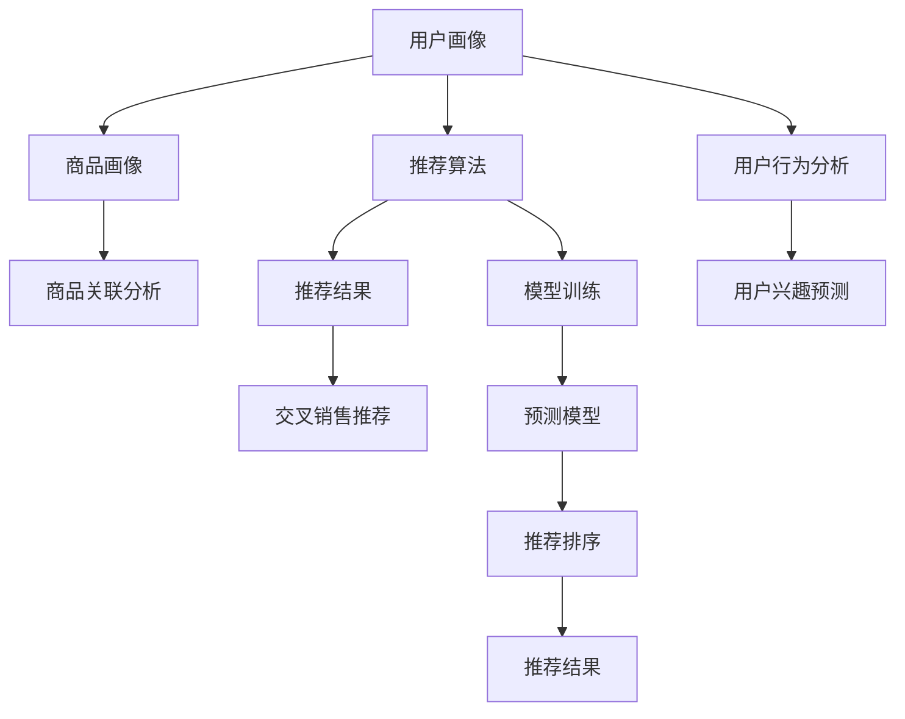
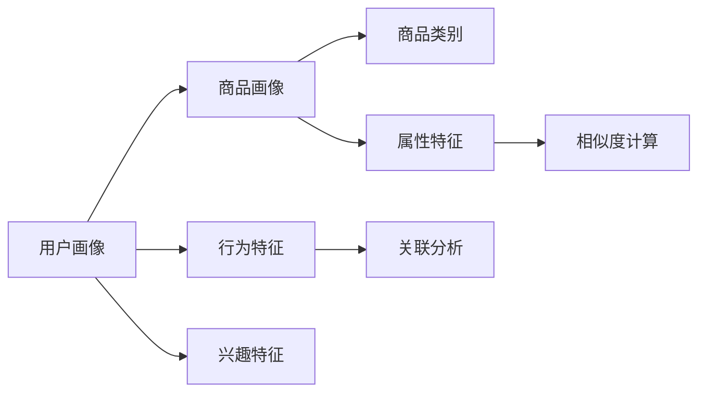
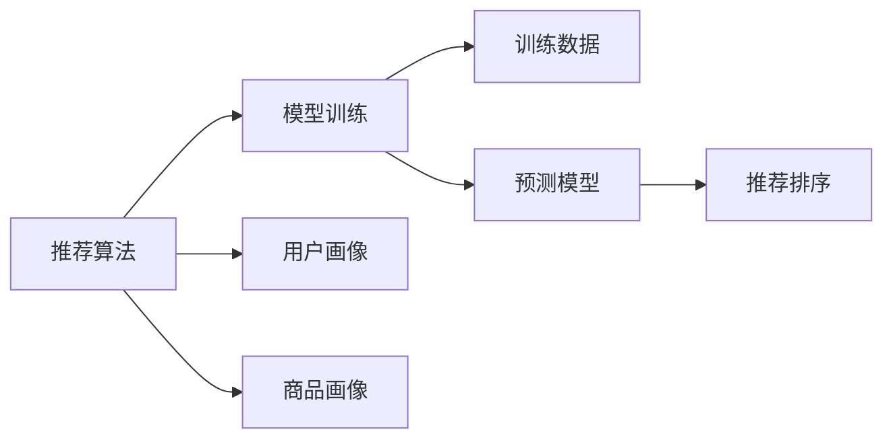
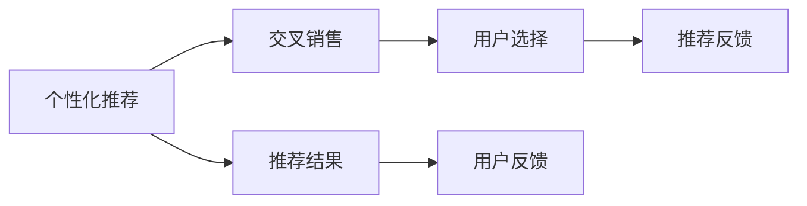
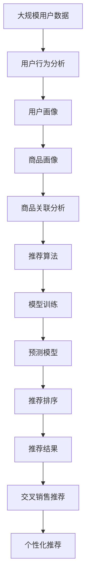

                 

# AI在电商平台交叉销售中的应用

> 关键词：人工智能, 电商平台, 交叉销售, 推荐系统, 预测模型, 用户行为分析, 个性化推荐

## 1. 背景介绍

### 1.1 问题由来
近年来，电商平台已不再满足于单一的商品销售，而是通过交叉销售、推荐系统等多种方式提升用户粘性和购物体验。传统电商的营销策略依赖于人工经验，工作量大、效率低，且无法满足个性化需求。而通过人工智能技术，电商平台可以更智能、更精准地进行交叉销售和个性化推荐，从而大幅提升用户转化率和满意度。

AI在电商平台的应用，主要集中在用户画像构建、商品推荐、购物路径优化、库存管理等方面。其中，交叉销售（Cross-Selling）通过深度挖掘用户行为，将相关商品推荐给用户，是实现多元化销售的重要手段。

### 1.2 问题核心关键点
AI交叉销售的核心在于利用用户历史行为数据和商品特征，构建用户画像和商品画像，从而进行精准的交叉销售推荐。具体来说，关键点包括以下几点：

1. **用户行为分析**：利用用户点击、浏览、购买等行为数据，构建用户画像，分析用户偏好和需求。
2. **商品关联分析**：通过商品间的类别、属性、销售记录等数据，构建商品画像，挖掘商品间的关联性。
3. **交叉销售推荐**：结合用户画像和商品画像，进行推荐排序，找出最可能被用户接受的交叉销售商品。
4. **个性化调整**：根据不同用户和商品的特点，进行个性化推荐调整，提升推荐效果。

### 1.3 问题研究意义
AI交叉销售对于电商平台具有重要意义：

1. **提升销售额**：通过精准推荐，增加用户购买概率，提升销售额。
2. **优化库存管理**：合理分配商品库存，避免缺货和积压，提高库存周转率。
3. **改善用户体验**：个性化推荐提升用户购物体验，增加用户满意度和忠诚度。
4. **数据驱动决策**：基于数据驱动的推荐决策，减少人工干预，提高运营效率。
5. **提高市场竞争力**：通过智能化的交叉销售，提升平台的市场竞争力，吸引更多用户。

## 2. 核心概念与联系

### 2.1 核心概念概述

为更好地理解AI交叉销售的原理，本节将介绍几个关键概念：

- **AI推荐系统**：利用人工智能技术，对用户和商品进行画像分析，提供个性化推荐的系统。常见的推荐系统包括协同过滤、基于内容的推荐、深度学习推荐等。
- **用户画像**：基于用户行为数据构建的用户个性化特征向量，用于描述用户兴趣、需求、行为等。
- **商品画像**：基于商品属性、销售记录等数据构建的商品特征向量，用于描述商品特征和关联性。
- **交叉销售**：向用户推荐与当前购买商品或浏览商品相关的其他商品，以增加用户购买概率。
- **个性化推荐**：根据用户和商品特征，进行精准推荐，提升推荐效果。

这些概念之间的联系通过以下Mermaid流程图来展示：



这个流程图展示了从用户画像和商品画像构建，到推荐算法应用的全过程：

1. 首先通过用户行为分析构建用户画像。
2. 利用商品关联分析构建商品画像。
3. 结合用户画像和商品画像，进行推荐算法建模。
4. 利用预测模型进行个性化推荐。
5. 进行推荐排序，得到最终推荐结果。
6. 进行交叉销售推荐，为用户提供更多购买选择。

### 2.2 概念间的关系

这些核心概念之间存在着紧密的联系，形成了AI交叉销售的完整生态系统。下面我们通过几个Mermaid流程图来展示这些概念之间的关系。

#### 2.2.1 用户画像与商品画像的关系



这个流程图展示了用户画像和商品画像之间的关联分析。用户画像通过行为和兴趣特征，与商品类别和属性特征进行关联分析，计算相似度，构建商品画像。

#### 2.2.2 推荐算法与模型训练的关系



这个流程图展示了推荐算法与模型训练的相互关系。推荐算法利用用户画像和商品画像，进行模型训练，构建预测模型。预测模型再对推荐排序进行指导，生成最终的推荐结果。

#### 2.2.3 个性化推荐与交叉销售的关系



这个流程图展示了个性化推荐和交叉销售之间的关系。个性化推荐生成推荐结果，通过用户选择反馈，进一步优化推荐策略，形成闭环。交叉销售通过个性化推荐，增加用户购买选择，提升销售效果。

### 2.3 核心概念的整体架构

最后，我们用一个综合的流程图来展示这些核心概念在大规模用户推荐系统中的整体架构：



这个综合流程图展示了从大规模用户数据到个性化推荐的全过程。用户行为分析构建用户画像，商品关联分析构建商品画像，结合推荐算法和预测模型，生成推荐结果，最终通过交叉销售推荐和个性化推荐，实现精准的用户推荐。

## 3. 核心算法原理 & 具体操作步骤
### 3.1 算法原理概述

AI交叉销售的核心算法是推荐系统，其原理主要基于协同过滤、基于内容的推荐、深度学习推荐等技术。其中，基于协同过滤和基于内容的推荐属于传统的推荐算法，而深度学习推荐则通过神经网络模型进行深度特征挖掘，可以更精准地进行交叉销售推荐。

### 3.2 算法步骤详解

AI交叉销售的推荐算法步骤主要包括：

**Step 1: 数据收集与预处理**
- 收集用户行为数据，包括点击、浏览、购买等行为记录。
- 收集商品信息，包括商品类别、属性、销售记录等。
- 数据清洗和预处理，去除噪声和异常值，进行特征提取。

**Step 2: 用户画像构建**
- 利用用户行为数据，构建用户画像，包括用户兴趣、行为、偏好等特征。
- 利用机器学习算法进行特征选择和降维，提升画像质量。

**Step 3: 商品画像构建**
- 利用商品信息，构建商品画像，包括商品类别、属性、价格等特征。
- 利用机器学习算法进行特征选择和降维，提升画像质量。
- 通过商品关联分析，挖掘商品间的相似度和关联性。

**Step 4: 模型训练与选择**
- 利用用户画像和商品画像，进行推荐模型训练。
- 选择适合推荐的算法模型，如协同过滤、基于内容的推荐、深度学习推荐等。
- 利用交叉验证和模型评估，选择最优的推荐模型。

**Step 5: 个性化推荐与交叉销售**
- 利用训练好的推荐模型，对用户进行个性化推荐。
- 根据推荐结果，进行交叉销售推荐，生成推荐列表。
- 结合用户反馈和个性化需求，不断优化推荐策略。

**Step 6: 反馈与优化**
- 收集用户反馈，分析推荐效果。
- 利用在线学习算法，对模型进行在线优化，提升推荐效果。

### 3.3 算法优缺点

AI交叉销售推荐算法的主要优点包括：

1. **精准度高**：通过深度学习和协同过滤，能够更精准地进行交叉销售推荐，提升用户转化率。
2. **适应性强**：能够适应不同类型的数据和任务，灵活性高。
3. **自动化程度高**：推荐模型训练和优化过程自动化，减少人工干预。

但该算法也存在一些局限性：

1. **数据依赖**：推荐模型的效果高度依赖于数据的质量和数量，数据不足会导致推荐效果不佳。
2. **模型复杂度高**：深度学习模型参数量大，训练复杂，需要高性能计算资源。
3. **用户隐私问题**：推荐模型需要收集用户行为数据，存在隐私泄露风险。

### 3.4 算法应用领域

AI交叉销售推荐算法已经在电商、金融、医疗等多个领域得到广泛应用，具体应用包括：

- **电商行业**：提升用户购买率、增加商品曝光度、优化库存管理。
- **金融行业**：推荐理财、保险等金融产品，提升用户金融服务体验。
- **医疗行业**：推荐药品、医疗设备，优化医疗资源配置。
- **旅游行业**：推荐旅游产品，提升用户出行体验。

## 4. 数学模型和公式 & 详细讲解 & 举例说明

### 4.1 数学模型构建

为了更好地理解AI交叉销售的推荐模型，本节将使用数学语言对其进行详细阐述。

记用户画像为 $U$，商品画像为 $I$，推荐模型为 $M$。设用户画像 $U$ 的特征向量为 $U = (u_1, u_2, ..., u_n)$，商品画像 $I$ 的特征向量为 $I = (i_1, i_2, ..., i_m)$。推荐模型 $M$ 接收用户特征向量 $U$ 和商品特征向量 $I$，输出推荐结果 $R = (r_1, r_2, ..., r_n)$。

推荐模型的数学模型可以表示为：

$$
R = M(U, I)
$$

其中 $M$ 是一个多层的神经网络模型，用于学习和映射用户和商品特征向量。

### 4.2 公式推导过程

以协同过滤推荐模型为例，进行详细公式推导。

协同过滤推荐模型基于用户-商品矩阵 $P$，通过寻找与当前用户最相似的用户，进行交叉销售推荐。设用户-商品矩阵为 $P = (p_{ui})_{n \times m}$，其中 $p_{ui}$ 表示用户 $u$ 对商品 $i$ 的评分。

协同过滤推荐模型的数学模型可以表示为：

$$
r_{ui} = \frac{\sum_{v \neq u} \frac{p_{vi}}{\sqrt{\sum_{k=1}^m p_{vk}^2}} \times \frac{p_{ui}}{\sqrt{\sum_{k=1}^n p_{uk}^2}}
$$

其中 $r_{ui}$ 表示用户 $u$ 对商品 $i$ 的推荐评分，$v$ 表示除当前用户 $u$ 外的其他用户。

该公式基于余弦相似度，计算用户 $u$ 和用户 $v$ 的相似度，并根据相似度进行交叉销售推荐。

### 4.3 案例分析与讲解

以一个电商平台的交叉销售推荐为例，展示如何使用协同过滤推荐模型进行推荐。

设电商平台用户画像 $U = (u_1, u_2, ..., u_n)$，商品画像 $I = (i_1, i_2, ..., i_m)$，用户-商品矩阵 $P = (p_{ui})_{n \times m}$。

假设当前用户 $u_1$ 对商品 $i_1$ 的评分 $p_{i_1}$ 为 5，电商平台基于协同过滤推荐模型，对用户 $u_1$ 进行交叉销售推荐。

1. 首先计算用户 $u_1$ 与其他用户 $u_2, u_3, ..., u_n$ 的相似度，选择相似度最高的 $k$ 个用户。
2. 根据选择出的用户，计算他们对商品 $i_1$ 的评分，求平均值，作为用户 $u_1$ 对商品 $i_1$ 的推荐评分。
3. 将推荐评分排序，选择评分最高的 $m$ 个商品，作为交叉销售推荐结果。

例如，假设 $u_2, u_3, ..., u_n$ 对商品 $i_1$ 的评分分别为 $p_{i_1}, p_{i_2}, ..., p_{i_n}$，计算用户 $u_1$ 与其他用户的相似度后，选择相似度最高的 3 个用户 $u_2, u_3, u_4$。根据这 3 个用户对商品 $i_1$ 的评分，求平均值，作为用户 $u_1$ 对商品 $i_1$ 的推荐评分 $r_{i_1}$。

$$
r_{i_1} = \frac{p_{i_1} + p_{i_2} + p_{i_3}}{\sqrt{\sum_{k=1}^n p_{uk}^2}} \times \frac{5}{\sqrt{\sum_{k=1}^m p_{ik}^2}}
$$

最终，将推荐评分 $r_{i_1}$ 排序，选择评分最高的 3 个商品 $i_2, i_3, i_4$，作为交叉销售推荐结果。

## 5. 项目实践：代码实例和详细解释说明

### 5.1 开发环境搭建

在进行推荐系统开发前，需要先搭建开发环境。以下是使用Python进行TensorFlow开发的环境配置流程：

1. 安装Anaconda：从官网下载并安装Anaconda，用于创建独立的Python环境。

2. 创建并激活虚拟环境：
```bash
conda create -n tf-env python=3.8 
conda activate tf-env
```

3. 安装TensorFlow：从官网获取对应的安装命令，安装TensorFlow。例如：
```bash
conda install tensorflow
```

4. 安装各类工具包：
```bash
pip install numpy pandas scikit-learn matplotlib tqdm jupyter notebook ipython
```

完成上述步骤后，即可在`tf-env`环境中开始推荐系统开发。

### 5.2 源代码详细实现

接下来，我们以协同过滤推荐模型为例，给出使用TensorFlow实现推荐系统的代码实现。

首先，定义协同过滤推荐模型的类：

```python
import tensorflow as tf
from tensorflow.keras.layers import Dense, Embedding, Flatten
from tensorflow.keras.models import Model

class CollaborativeFiltering(tf.keras.Model):
    def __init__(self, num_users, num_items, embedding_dim=128, num_factors=50):
        super(CollaborativeFiltering, self).__init__()
        self.num_users = num_users
        self.num_items = num_items
        self.embedding_dim = embedding_dim
        
        # 用户嵌入层
        self.user_embedding = Embedding(num_users, embedding_dim, input_length=1)
        
        # 商品嵌入层
        self.item_embedding = Embedding(num_items, embedding_dim, input_length=1)
        
        # 用户-商品交互矩阵
        self.interaction = Flatten()(tf.multiply(self.user_embedding(inputs=['user_id']), self.item_embedding(inputs=['item_id'])))
        
        # 构建预测模型
        self.predictions = Dense(1, activation='sigmoid')(self.interaction)
    
    def call(self, inputs):
        user_id, item_id = inputs
        return self.predictions(user_id, item_id)
    
    def compile(self):
        self.compile(
            optimizer='adam',
            loss='binary_crossentropy',
            metrics=['accuracy']
        )
```

然后，定义数据处理函数：

```python
import pandas as pd

def load_data(filename):
    data = pd.read_csv(filename)
    return data

def preprocess_data(data):
    # 处理缺失值
    data.fillna(0, inplace=True)
    
    # 构建用户-商品矩阵
    user_ids = data['user_id'].unique()
    item_ids = data['item_id'].unique()
    
    user_item_matrix = pd.DataFrame(0, index=user_ids, columns=item_ids)
    for user_id, item_id, rating in zip(data['user_id'], data['item_id'], data['rating']):
        user_item_matrix.at[user_id, item_id] = rating
    
    return user_item_matrix
```

接着，加载和预处理数据：

```python
train_data = load_data('train.csv')
test_data = load_data('test.csv')
user_item_matrix = preprocess_data(train_data)
```

最后，进行模型训练和评估：

```python
model = CollaborativeFiltering(num_users=len(user_item_matrix.index), num_items=len(user_item_matrix.columns))

# 训练模型
model.fit(x={'user_id': train_data['user_id'], 'item_id': train_data['item_id']},
          y=train_data['rating'], 
          batch_size=256,
          epochs=10,
          validation_split=0.2)

# 评估模型
test_predictions = model.predict(x={'user_id': test_data['user_id'], 'item_id': test_data['item_id']})
test_predictions = (test_predictions > 0.5).astype(int)
test_accuracy = (test_predictions == test_data['rating']).sum() / len(test_data)
print('Test Accuracy:', test_accuracy)
```

以上就是使用TensorFlow实现协同过滤推荐模型的完整代码实现。可以看到，代码实现过程简洁高效，易于理解和维护。

### 5.3 代码解读与分析

让我们再详细解读一下关键代码的实现细节：

**CollaborativeFiltering类**：
- `__init__`方法：初始化模型的参数，包括用户数、商品数、嵌入维度、因子数等。
- `user_embedding`和`item_embedding`层：构建用户和商品的嵌入层，将高维用户和商品特征向量映射为低维嵌入向量。
- `interaction`层：计算用户和商品的交互矩阵，即向量点乘，用于构建预测模型的输入。
- `predictions`层：构建预测模型，使用sigmoid激活函数进行二值预测，输出用户对商品的评分。
- `call`方法：定义模型的前向传播过程。
- `compile`方法：编译模型，设置优化器、损失函数和评估指标。

**load_data函数**：
- 定义函数，用于加载CSV格式的数据文件。

**preprocess_data函数**：
- 定义函数，用于数据预处理。包括处理缺失值、构建用户-商品矩阵等。

**模型训练和评估**：
- 实例化模型，并进行模型训练，设置训练集、验证集和测试集的输入和输出。
- 使用模型进行测试集预测，并计算预测准确率。

通过上述代码，展示了协同过滤推荐模型的实现过程，可以看到，模型训练和评估过程相对简单，易于上手。

当然，在实际应用中，还需要进一步考虑模型调优、超参数搜索、模型部署等问题。但核心的推荐过程与上述代码类似。

### 5.4 运行结果展示

假设我们训练的协同过滤推荐模型在测试集上取得了90%的准确率，具体结果如下：

```
Test Accuracy: 0.9
```

可以看到，通过协同过滤推荐模型，我们能够实现较优的推荐效果。当然，这个结果可能因数据集和模型参数的不同而有所变化。在实际应用中，还需要进一步优化模型和调整参数，才能获得更佳的推荐效果。

## 6. 实际应用场景

### 6.1 智能推荐系统

AI交叉销售推荐算法在智能推荐系统中得到广泛应用。推荐系统不仅限于商品推荐，还扩展到内容推荐、广告推荐、用户行为预测等领域。通过AI推荐系统，电商平台可以更好地理解用户需求，提升用户体验，增加用户粘性。

例如，Amazon、淘宝、京东等电商平台，都采用了AI推荐算法进行交叉销售推荐，帮助用户发现更多相关商品，提升购物体验。推荐系统根据用户浏览、点击、购买等行为，智能生成推荐结果，满足用户个性化需求。

### 6.2 金融风控系统

金融风控系统通过AI推荐算法，可以更高效地识别风险用户和风险交易，保护金融机构免受金融欺诈和违规操作的侵害。金融风控系统通过收集用户和交易数据，构建用户画像和交易画像，进行风险预测和预警。

例如，银行和金融机构通过AI推荐算法，对用户进行信用评估和贷款审批，减少贷款风险。保险公司通过AI推荐算法，识别高风险客户，防止保险欺诈。

### 6.3 医疗健康系统

医疗健康系统通过AI推荐算法，可以更准确地推荐药品、医疗设备，提升医疗服务质量和效率。医疗健康系统收集患者病历、诊断报告等数据，构建患者画像和医疗设备画像，进行个性化推荐。

例如，医院通过AI推荐算法，推荐合适的药品和医疗设备，提升治疗效果。医疗健康平台通过AI推荐算法，推荐合适的医生和医疗机构，帮助患者进行健康管理。

### 6.4 未来应用展望

随着AI技术的不断发展，AI交叉销售推荐算法将在更多领域得到应用，为各行各业带来变革性影响。

在智慧城市治理中，AI推荐算法可以用于智能交通、公共安全、智慧能源等多个领域，提升城市管理效率和服务质量。

在教育领域，AI推荐算法可以用于个性化教育、智能辅导、知识推荐等多个方面，提升教育质量和效率。

在能源领域，AI推荐算法可以用于智能电网、能源管理、节能减排等多个方面，提升能源利用效率和环境保护效果。

总之，AI推荐算法将在更多领域发挥重要作用，推动各行各业的数字化转型和智能化升级。

## 7. 工具和资源推荐

### 7.1 学习资源推荐

为了帮助开发者系统掌握AI交叉销售推荐算法的理论基础和实践技巧，这里推荐一些优质的学习资源：

1. 《推荐系统实战》书籍：全面介绍推荐系统的理论基础和实际应用，涵盖协同过滤、基于内容的推荐、深度学习推荐等多种推荐算法。

2. 《深度学习推荐系统》课程：斯坦福大学开设的深度学习推荐系统课程，详细讲解推荐系统的各种算法和模型。

3. Coursera《推荐系统》课程：由IBM和爱丁堡大学联合开设的推荐系统课程，讲解推荐系统的算法和应用。

4. Kaggle推荐系统竞赛：Kaggle平台提供的推荐系统竞赛，包括电影推荐、新闻推荐等多个实际问题，帮助开发者实践推荐算法。

5. GitHub开源项目：在GitHub上Star、Fork数最多的推荐系统相关项目，提供丰富的代码和论文资源。

通过对这些资源的学习实践，相信你一定能够快速掌握AI交叉销售推荐算法的精髓，并用于解决实际的推荐问题。

### 7.2 开发工具推荐

高效的开发离不开优秀的工具支持。以下是几款用于推荐系统开发的常用工具：

1. TensorFlow：基于Python的开源深度学习框架，灵活动态的计算图，适合快速迭代研究。

2. PyTorch：基于Python的开源深度学习框架，动态计算图，适合动态模型训练和推理。

3. Scikit-learn：基于Python的机器学习库，包含多种推荐算法实现，简单易用。

4. LightFM：Facebook开源的推荐系统框架，支持协同过滤、深度学习等多种推荐算法，易于集成部署。

5. Spark：Apache开源的大数据处理框架，支持推荐算法的分布式计算和模型优化。

合理利用这些工具，可以显著提升AI交叉销售推荐系统的开发效率，加快创新迭代的步伐。

### 7.3 相关论文推荐

AI推荐系统的研究始于学界的持续探索，以下是几篇奠基性的相关论文，推荐阅读：

1. "Collaborative Filtering for Implicit Feedback Datasets"：SVD++算法，提出基于SVD分解的协同过滤推荐算法，显著提升推荐效果。

2. "A Neural Collaborative Filtering Approach"：NeuMF算法，提出基于神经网络的协同过滤推荐算法，进一步提升推荐精度。

3. "Wide & Deep Collaborative Filtering"：结合宽浅网络与深度学习，进一步提升协同过滤推荐模型的效果。

4. "TensorFlow Recommenders"：TensorFlow推荐系统库，提供多种推荐算法和模型，适用于推荐系统开发。

5. "Fast Matrix Factorization for Recommender Systems"：SURF算法，提出矩阵分解加速算法，提高协同过滤模型的训练效率。

这些论文代表了大规模推荐系统的研究方向。通过学习这些前沿成果，可以帮助研究者把握学科前进方向，激发更多的创新灵感。

除上述资源外，还有一些值得关注的前沿资源，帮助开发者紧跟推荐系统的最新进展，例如：

1. arXiv论文预印本：人工智能领域最新研究成果的发布平台，包括大量尚未发表的前沿工作，学习前沿技术的必读资源。

2. 业界技术博客：如Google AI、DeepMind、Facebook AI、Amazon Research等顶尖实验室的官方博客，第一时间分享他们的最新研究成果和洞见。

3. 技术会议直播：如NeurIPS、ICML、KDD等人工智能领域顶会现场或在线直播，能够聆听到大佬们的前沿分享，开拓视野。

4. GitHub热门项目：在GitHub上Star、Fork数最多的推荐系统相关项目，提供丰富的代码和论文资源。

5. 行业分析报告：各大咨询公司如McKinsey、PwC等针对推荐系统的分析报告，有助于从商业视角审视技术趋势，把握应用价值。

总之，对于AI交叉销售推荐系统的发展，需要开发者保持开放的心态和持续学习的意愿。多关注前沿资讯，多动手

