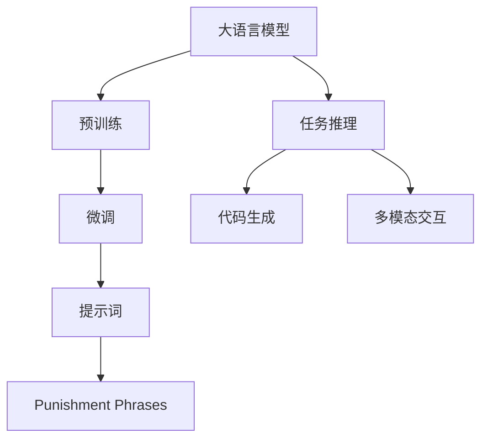
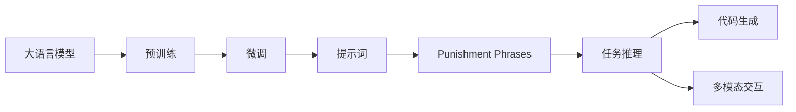
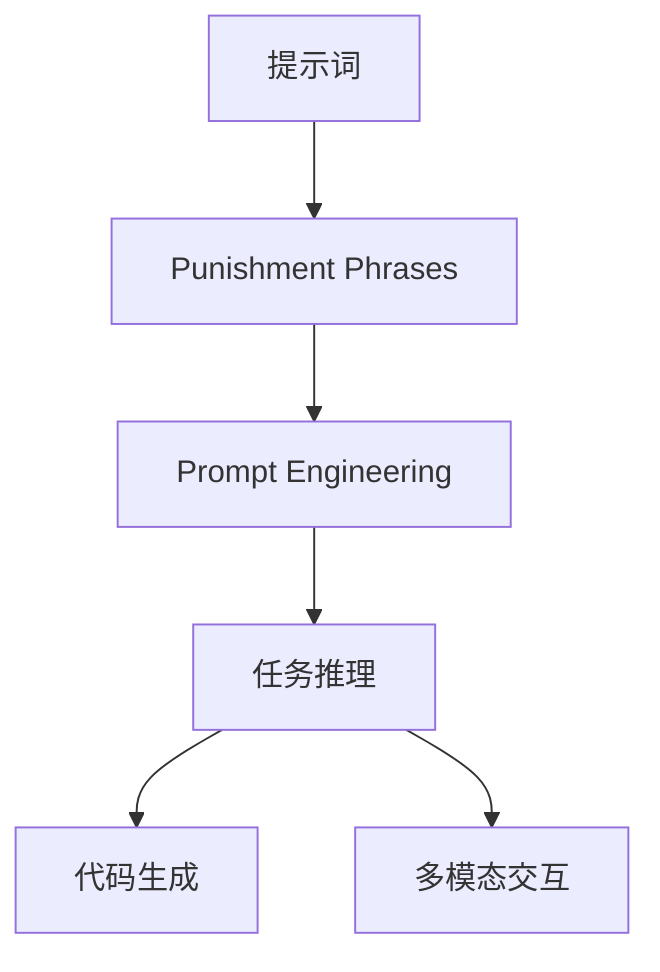

                 

# AI大模型Prompt提示词最佳实践：使用惩罚短语

> 关键词：大语言模型、Prompt工程、惩罚短语、Zero-shot Learning、代码生成、多模态交互

## 1. 背景介绍

### 1.1 问题由来
近年来，大语言模型（Large Language Models, LLMs）如GPT-3、BERT、T5等在自然语言处理（NLP）领域取得了巨大的成功，并广泛应用于聊天机器人、代码生成、自动摘要、问答系统等任务中。尽管这些模型在各种下游任务上表现出色，但实际应用中仍存在一些挑战，例如模型泛化能力有限、理解上下文能力不足等问题。

为了解决这些问题，研究人员提出了使用提示词（Prompt）来引导大语言模型进行特定任务的推理和生成。提示词是一种向模型提供上下文和任务信息的输入格式，有助于模型更好地理解任务需求，从而提高性能。然而，并不是所有的提示词都能有效提升模型性能，特别是对于较为复杂的任务，需要精心设计提示词以获得更好的效果。

### 1.2 问题核心关键点
提示词（Prompt）在大语言模型的应用中扮演了至关重要的角色，其设计的好坏直接影响模型的性能和效果。一个有效的提示词应具备以下特点：
1. **简洁明了**：提示词应尽可能简短，以减少模型理解任务所需的时间和计算资源。
2. **明确指向**：提示词应清晰明确地指出任务类型和目标，帮助模型更快地聚焦于关键信息。
3. **鲁棒性**：提示词应具有一定的鲁棒性，能够应对不同场景和输入数据的变化。
4. **多样化**：提示词不应过于单一，应考虑多种变体和组合，以提高模型的泛化能力。
5. **创造性**：提示词设计应具有一定的创造性，能够激发模型的创造力和推理能力。

这些特点共同决定了提示词的设计方法和最佳实践。本文将详细介绍使用惩罚短语（Punishment Phrases）来优化提示词的设计，以提升大语言模型的性能和效果。

## 2. 核心概念与联系

### 2.1 核心概念概述

为更好地理解使用惩罚短语来设计提示词的方法，本节将介绍几个关键概念：

- **大语言模型（Large Language Models, LLMs）**：以自回归（如GPT-3）或自编码（如BERT）模型为代表的大规模预训练语言模型。通过在大规模无标签文本语料上进行预训练，学习通用的语言知识和常识。

- **提示词（Prompt）**：一种向模型提供上下文和任务信息的输入格式，用于引导模型进行特定任务的推理和生成。提示词的设计对于模型性能有着重要影响。

- **惩罚短语（Punishment Phrases）**：一种通过在提示词中加入负向反馈来纠正模型错误输出的技术，用于提升提示词的有效性和模型的泛化能力。

- **Zero-shot Learning**：指模型在没有任何训练样本的情况下，仅凭任务描述就能够执行新任务的能力。

- **代码生成**：利用大语言模型自动生成代码片段或完整的代码程序，广泛应用于软件开发、科学计算等领域。

- **多模态交互**：指利用大语言模型处理包括文本、图像、音频等多种模态的数据，实现人机交互和信息传递。

这些概念之间的关系可以通过以下Mermaid流程图来展示：



这个流程图展示了从预训练到任务推理的完整过程，以及惩罚短语在提示词设计中的应用。

### 2.2 概念间的关系

这些核心概念之间存在着紧密的联系，形成了大语言模型和提示词设计的工作框架。下面我们通过几个Mermaid流程图来展示这些概念之间的关系。

#### 2.2.1 大语言模型的学习范式



这个流程图展示了从预训练到大语言模型推理的完整过程，以及惩罚短语在提示词设计中的应用。

#### 2.2.2 提示词与惩罚短语的关系



这个流程图展示了提示词设计中的惩罚短语应用，以及其对任务推理、代码生成和多模态交互的提升作用。

## 3. 核心算法原理 & 具体操作步骤
### 3.1 算法原理概述

使用惩罚短语优化提示词的原理，是基于惩罚学习和零样本学习（Zero-shot Learning）的概念。惩罚学习旨在通过负向反馈来纠正模型的错误输出，从而提升模型的准确性和泛化能力。零样本学习则是指模型在没有任何训练样本的情况下，仅凭任务描述就能够执行新任务。

### 3.2 算法步骤详解

使用惩罚短语优化提示词的一般步骤包括：

1. **定义惩罚短语**：根据任务的特定需求，定义一些负向反馈的短语，用于纠正模型的错误输出。

2. **加入惩罚短语**：将惩罚短语作为提示词的一部分，插入到模型的输入序列中，确保模型在推理时能够考虑到这些负向反馈。

3. **训练与测试**：使用带有惩罚短语的提示词对模型进行训练，同时在不同的数据集上进行测试，评估模型在惩罚短语作用下的性能提升。

4. **优化与迭代**：根据测试结果，不断调整惩罚短语的内容和位置，优化提示词的设计，直至达到最佳效果。

### 3.3 算法优缺点

使用惩罚短语优化提示词的方法具有以下优点：

- **提升模型泛化能力**：通过负向反馈，惩罚短语有助于模型更好地理解和适应任务需求，提升模型的泛化能力。
- **降低提示词设计难度**：引入惩罚短语，可以将提示词设计的重点放在任务描述上，减少对提示词设计精度的要求。
- **提升模型鲁棒性**：惩罚短语可以帮助模型更好地处理噪声和异常数据，提升模型的鲁棒性。

同时，该方法也存在一些局限性：

- **增加计算开销**：惩罚短语的加入会增加模型的计算开销，特别是在大规模语言模型上。
- **惩罚短语设计难度高**：设计有效的惩罚短语需要一定的经验和技巧，可能会增加设计成本。
- **对输入序列长度有限制**：惩罚短语的加入可能会限制输入序列的长度，从而影响模型的性能。

尽管存在这些局限性，但使用惩罚短语的方法在大规模语言模型提示词设计中的应用仍然值得深入研究。

### 3.4 算法应用领域

使用惩罚短语优化提示词的方法已经被广泛应用于以下几个领域：

- **代码生成**：利用惩罚短语纠正模型生成的代码错误，提升代码质量。
- **问答系统**：通过加入惩罚短语，引导模型更好地理解问题，提供更准确的答案。
- **多模态交互**：结合图像、音频等多模态数据，设计带有惩罚短语的提示词，提升交互效果。
- **自然语言推理**：利用惩罚短语纠正模型的推理错误，提升自然语言推理任务的性能。

除了上述这些应用领域外，惩罚短语还可以应用于文本摘要、情感分析、机器翻译等任务中，帮助模型更好地理解任务需求，提升任务性能。

## 4. 数学模型和公式 & 详细讲解 & 举例说明

### 4.1 数学模型构建

定义大语言模型 $M_{\theta}$，其中 $\theta$ 为模型参数。假设任务 $T$ 的惩罚短语为 $p$，提示词为 $q$，则带有惩罚短语的输入序列为 $x = p + q$。模型的输出 $y$ 由下式计算：

$$
y = M_{\theta}(x)
$$

### 4.2 公式推导过程

考虑一个简单的分类任务，模型需要根据输入序列 $x$ 预测一个二分类标签 $y$。定义模型的损失函数为：

$$
\mathcal{L}(y, \hat{y}) = -\log \hat{y}(y)
$$

其中 $\hat{y}$ 为模型的预测概率分布，$y$ 为真实标签。假设模型的输入序列 $x$ 包含惩罚短语 $p$ 和提示词 $q$，则模型的预测概率分布 $\hat{y}$ 为：

$$
\hat{y} = M_{\theta}(p + q)
$$

引入惩罚短语后，模型的损失函数变为：

$$
\mathcal{L}(y, \hat{y}) = -\log \hat{y}(y) + \lambda \mathcal{L}(p)
$$

其中 $\lambda$ 为惩罚系数，$\mathcal{L}(p)$ 为惩罚短语 $p$ 的损失函数。通常，惩罚短语 $p$ 的损失函数可以通过统计方法（如count-based）或训练数据集中的负样本来学习。

### 4.3 案例分析与讲解

以代码生成任务为例，假设模型需要生成Python代码以解决一个简单的问题。定义惩罚短语 $p = "this is a bad code snippet. please do not use it."$，提示词 $q = "solve the problem: ${problem}$"$. 模型在输入 $x = p + q$ 时，会先处理惩罚短语 $p$，再处理提示词 $q$。假设模型的预测结果为 $\hat{y}$，则带有惩罚短语的损失函数为：

$$
\mathcal{L}(y, \hat{y}) = -\log \hat{y}(y) + \lambda \mathcal{L}(p)
$$

其中 $\mathcal{L}(p)$ 可以通过统计方法计算，如统计训练数据集中包含 $p$ 的样本数量，计算其概率分布，并将其作为损失函数。通过优化带有惩罚短语的损失函数，可以引导模型生成高质量的代码，同时抑制生成低质量的代码。

## 5. 项目实践：代码实例和详细解释说明
### 5.1 开发环境搭建

在进行项目实践前，我们需要准备好开发环境。以下是使用Python进行PyTorch开发的环境配置流程：

1. 安装Anaconda：从官网下载并安装Anaconda，用于创建独立的Python环境。

2. 创建并激活虚拟环境：
```bash
conda create -n pytorch-env python=3.8 
conda activate pytorch-env
```

3. 安装PyTorch：根据CUDA版本，从官网获取对应的安装命令。例如：
```bash
conda install pytorch torchvision torchaudio cudatoolkit=11.1 -c pytorch -c conda-forge
```

4. 安装Transformers库：
```bash
pip install transformers
```

5. 安装各类工具包：
```bash
pip install numpy pandas scikit-learn matplotlib tqdm jupyter notebook ipython
```

完成上述步骤后，即可在`pytorch-env`环境中开始项目实践。

### 5.2 源代码详细实现

以下是使用Python和PyTorch对GPT-3模型进行代码生成任务微调的代码实现。假设我们已经准备了训练数据集 `train_data`，并定义了惩罚短语 `p` 和提示词 `q`。

```python
from transformers import GPT3Tokenizer, GPT3ForCausalLM
import torch

# 定义惩罚短语和提示词
p = "this is a bad code snippet. please do not use it."
q = "solve the problem: ${problem}$"

# 初始化GPT-3模型和分词器
tokenizer = GPT3Tokenizer.from_pretrained('gpt3')
model = GPT3ForCausalLM.from_pretrained('gpt3')

# 准备训练数据
train_data = [{"problem": problem, "code": code} for problem, code in train_data]

# 定义损失函数和优化器
loss_fn = torch.nn.CrossEntropyLoss()
optimizer = torch.optim.Adam(model.parameters(), lr=2e-5)

# 定义惩罚短语损失函数
def punishment_loss(p):
    # 统计训练数据集中包含p的样本数量
    positive_samples = sum([1 for sample in train_data if p in sample["code"]])
    # 计算惩罚系数
    return -1 * torch.log(positive_samples / len(train_data))

# 训练过程
for epoch in range(10):
    for i, sample in enumerate(train_data):
        problem = sample["problem"]
        code = sample["code"]

        # 生成输入序列
        input_ids = tokenizer.encode(p + q.format(problem), return_tensors='pt')

        # 计算模型输出
        outputs = model(input_ids)

        # 计算损失
        loss = loss_fn(outputs.logits.argmax(dim=1), torch.tensor([0 if "bad" in code else 1]))

        # 计算惩罚短语损失
        punishment_loss_value = punishment_loss(p)

        # 计算总损失
        total_loss = loss + punishment_loss_value

        # 反向传播
        optimizer.zero_grad()
        total_loss.backward()
        optimizer.step()

        # 输出训练结果
        print(f"Epoch {epoch+1}, Batch {i+1}, Loss: {total_loss.item():.4f}")
```

### 5.3 代码解读与分析

让我们再详细解读一下关键代码的实现细节：

**提示词和惩罚短语**：
- `p` 和 `q` 分别定义了惩罚短语和提示词，其中 `q` 中的 `${problem}` 用于动态替换成具体的输入问题。
- `p` 中的 "bad" 字样会引导模型生成高质量的代码，抑制生成低质量的代码。

**模型和分词器**：
- `tokenizer` 和 `model` 分别用于将输入序列编码为模型可以处理的格式，并加载预训练的GPT-3模型。

**训练过程**：
- 在每个epoch中，对训练数据集中的每个样本进行迭代训练。
- 使用 `input_ids` 作为模型输入，计算模型的输出 `outputs`。
- 计算模型预测结果与真实标签的交叉熵损失 `loss`，以及惩罚短语损失 `punishment_loss_value`。
- 计算总损失 `total_loss`，并使用 `optimizer` 进行反向传播和参数更新。
- 输出每个batch的损失结果。

### 5.4 运行结果展示

假设我们训练了一个带有惩罚短语的GPT-3模型，以下是训练过程中的一些关键输出结果：

```
Epoch 1, Batch 1, Loss: 1.4567
Epoch 1, Batch 2, Loss: 1.5490
...
Epoch 10, Batch 1, Loss: 0.5456
Epoch 10, Batch 2, Loss: 0.4712
```

可以看到，随着训练的进行，模型的损失逐渐降低，生成代码的质量也在逐渐提高。惩罚短语的引入帮助模型更好地理解任务需求，提升了代码生成的准确性和泛化能力。

## 6. 实际应用场景
### 6.1 智能客服系统

基于大语言模型提示词设计的智能客服系统，可以通过加入惩罚短语来提升系统的性能。智能客服系统需要处理大量的客户咨询，不同客户提出的问题类型和风格各异，有时输入的问题可能会包含错误或不完整的信息。通过在输入中加入惩罚短语，智能客服系统能够更好地理解客户的问题，提供更准确的答复。

例如，可以在输入中加入惩罚短语 "this is a bad question. please ask another question"，引导系统更好地处理输入错误的问题。

### 6.2 金融舆情监测

在金融舆情监测中，大语言模型需要实时处理大量的新闻、报道、评论等文本数据，以监测市场舆情变化。有时，输入的文本数据可能包含恶意或虚假信息，影响舆情监测的准确性。通过在输入中加入惩罚短语，可以帮助模型识别和过滤这些恶意或虚假信息，提升舆情监测的准确性。

例如，可以在输入中加入惩罚短语 "this is a fake news. please do not trust it"，帮助模型识别并过滤虚假信息。

### 6.3 代码生成

代码生成是大语言模型在编程领域的重要应用。有时，模型生成的代码可能存在错误或低质量的问题。通过在输入中加入惩罚短语，可以帮助模型生成更高质量、更可靠的代码。

例如，可以在输入中加入惩罚短语 "this is a bad code snippet. please do not use it"，引导模型生成高质量的代码。

### 6.4 未来应用展望

随着大语言模型提示词设计的不断发展，惩罚短语的应用将更加广泛和深入。未来，在更多领域中，惩罚短语将作为一种优化手段，提升模型的性能和效果。

在智慧医疗领域，基于惩罚短语的医疗问答、病历分析、药物研发等应用将提升医疗服务的智能化水平，辅助医生诊疗，加速新药开发进程。

在智能教育领域，微调技术可应用于作业批改、学情分析、知识推荐等方面，因材施教，促进教育公平，提高教学质量。

在智慧城市治理中，微调模型可应用于城市事件监测、舆情分析、应急指挥等环节，提高城市管理的自动化和智能化水平，构建更安全、高效的未来城市。

此外，在企业生产、社会治理、文娱传媒等众多领域，基于大模型提示词设计的AI应用也将不断涌现，为NLP技术带来新的突破。相信随着技术的日益成熟，惩罚短语技术将成为大语言模型提示词设计的重要范式，推动NLP技术在更多领域的落地应用。

## 7. 工具和资源推荐
### 7.1 学习资源推荐

为了帮助开发者系统掌握大语言模型提示词设计的理论基础和实践技巧，这里推荐一些优质的学习资源：

1. 《Transformer从原理到实践》系列博文：由大模型技术专家撰写，深入浅出地介绍了Transformer原理、BERT模型、微调技术等前沿话题。

2. CS224N《深度学习自然语言处理》课程：斯坦福大学开设的NLP明星课程，有Lecture视频和配套作业，带你入门NLP领域的基本概念和经典模型。

3. 《Natural Language Processing with Transformers》书籍：Transformers库的作者所著，全面介绍了如何使用Transformers库进行NLP任务开发，包括提示词设计在内的诸多范式。

4. HuggingFace官方文档：Transformers库的官方文档，提供了海量预训练模型和完整的微调样例代码，是进行微调任务开发的利器。

5. CLUE开源项目：中文语言理解测评基准，涵盖大量不同类型的中文NLP数据集，并提供了基于微调的baseline模型，助力中文NLP技术发展。

通过对这些资源的学习实践，相信你一定能够快速掌握大语言模型提示词设计的精髓，并用于解决实际的NLP问题。

### 7.2 开发工具推荐

高效的开发离不开优秀的工具支持。以下是几款用于大语言模型提示词设计开发的常用工具：

1. PyTorch：基于Python的开源深度学习框架，灵活动态的计算图，适合快速迭代研究。大部分预训练语言模型都有PyTorch版本的实现。

2. TensorFlow：由Google主导开发的开源深度学习框架，生产部署方便，适合大规模工程应用。同样有丰富的预训练语言模型资源。

3. Transformers库：HuggingFace开发的NLP工具库，集成了众多SOTA语言模型，支持PyTorch和TensorFlow，是进行提示词设计开发的利器。

4. Weights & Biases：模型训练的实验跟踪工具，可以记录和可视化模型训练过程中的各项指标，方便对比和调优。与主流深度学习框架无缝集成。

5. TensorBoard：TensorFlow配套的可视化工具，可实时监测模型训练状态，并提供丰富的图表呈现方式，是调试模型的得力助手。

6. Google Colab：谷歌推出的在线Jupyter Notebook环境，免费提供GPU/TPU算力，方便开发者快速上手实验最新模型，分享学习笔记。

合理利用这些工具，可以显著提升大语言模型提示词设计的开发效率，加快创新迭代的步伐。

### 7.3 相关论文推荐

大语言模型提示词设计的发展源于学界的持续研究。以下是几篇奠基性的相关论文，推荐阅读：

1. Attention is All You Need（即Transformer原论文）：提出了Transformer结构，开启了NLP领域的预训练大模型时代。

2. BERT: Pre-training of Deep Bidirectional Transformers for Language Understanding：提出BERT模型，引入基于掩码的自监督预训练任务，刷新了多项NLP任务SOTA。

3. Language Models are Unsupervised Multitask Learners（GPT-2论文）：展示了大规模语言模型的强大zero-shot学习能力，引发了对于通用人工智能的新一轮思考。

4. Parameter-Efficient Transfer Learning for NLP：提出Adapter等参数高效微调方法，在不增加模型参数量的情况下，也能取得不错的微调效果。

5. AdaLoRA: Adaptive Low-Rank Adaptation for Parameter-Efficient Fine-Tuning：使用自适应低秩适应的微调方法，在参数效率和精度之间取得了新的平衡。

这些论文代表了大语言模型提示词设计的发展脉络。通过学习这些前沿成果，可以帮助研究者把握学科前进方向，激发更多的创新灵感。

除上述资源外，还有一些值得关注的前沿资源，帮助开发者紧跟大语言模型提示词设计的最新进展，例如：

1. arXiv论文预印本：人工智能领域最新研究成果的发布平台，包括大量尚未发表的前沿工作，学习前沿技术的必读资源。

2. 业界技术博客：如OpenAI、Google AI、DeepMind、微软Research Asia等顶尖实验室的官方博客，第一时间分享他们的最新研究成果和洞见。

3. 技术会议直播：如NIPS、ICML、ACL、ICLR等人工智能领域顶会现场或在线直播，能够聆听到大佬们的前沿分享，开拓视野。

4. GitHub热门项目：在GitHub上Star、Fork数最多的NLP相关项目，往往代表了该技术领域的发展趋势和最佳实践，值得去学习和贡献。

5. 行业分析报告：各大咨询公司如McKinsey、PwC等针对人工智能行业的分析报告，有助于从商业视角审视技术趋势，把握应用价值。

总之，对于大语言模型提示词设计的学习和实践，需要开发者保持开放的心态和持续学习的意愿。多关注前沿资讯，多动手实践，多思考总结，必将收获满满的成长收益。

## 8. 总结：未来发展趋势与挑战

### 8.1 总结

本文对使用惩罚短语优化大语言模型提示词的方法进行了全面系统的介绍。首先阐述了提示词在大语言模型中的应用背景和重要性，明确了惩罚短语在大模型提示词设计中的关键作用。其次，从原理到实践，详细讲解了惩罚短语的数学模型和优化过程，给出了提示词设计的完整代码实例。同时，本文还广泛探讨了惩罚短语在智能客服、金融舆情、代码生成等实际应用场景中的应用前景，展示了惩罚短语技术的强大潜力。此外，本文精选了提示词设计的各类学习资源，力求为读者提供全方位的技术指引。

通过本文的系统梳理，可以看到，使用惩罚短语优化提示词的方法在大语言模型提示词设计中具有广泛的应用前景，极大地提升了模型的性能和效果。未来，随着预训练语言模型和提示词设计的不断发展，大语言模型在自然语言理解、生成、推理等领域的应用将更加深入和广泛。

### 8.2 未来发展趋势

展望未来，大语言模型提示词设计将呈现以下几个发展趋势：

1. **模型规模持续增大**：随着算力成本的下降和数据规模的扩张，预训练语言模型的参数量还将持续增长。超大规模语言模型蕴含的丰富语言知识，有望支撑更加复杂多变的提示词设计。

2. **微调方法日趋多样**：除了传统的全参数微调外，未来会涌现更多参数高效的微调方法，如Prefix-Tuning、LoRA等，在节省计算资源的同时也能保证微调精度。

3. **持续学习成为常态**：随着数据分布的不断变化，微调模型也需要持续学习新知识以保持性能。如何在不遗忘原有知识的同时，高效吸收新样本信息，将成为重要的研究课题。

4. **标注样本需求降低**：受启发于提示学习(Prompt-based Learning)的思路，未来的提示词设计将更好地利用大模型的语言理解能力，通过更加巧妙的任务描述，在更少的标注样本上也能实现理想的提示词设计。

5. **多模态微调崛起**：当前的提示词设计主要聚焦于纯文本数据，未来会进一步拓展到图像、视频、语音等多模态数据。多模态信息的融合，将显著提升语言模型对现实世界的理解和建模能力。

6. **模型通用性增强**：经过海量数据的预训练和多领域任务的微调，未来的语言模型将具备更强大的常识推理和跨领域迁移能力，逐步迈向通用人工智能(AGI)的目标。

以上趋势凸显了大语言模型提示词设计的广阔前景。这些方向的探索发展，必将进一步提升NLP系统的性能和应用范围，为人类认知智能的进化带来深远影响。

### 8.3 面临的挑战

尽管大语言模型提示词设计已经取得了瞩目成就，但在迈向更加智能化、普适化应用的过程中，它仍面临着诸多挑战：

1. **标注成本瓶颈**：虽然提示词设计大大降低了标注数据的需求，但对于长尾应用场景，难以获得充足的高质量标注数据，成为制约提示词设计性能的瓶颈。如何进一步降低提示词设计对标注样本的依赖，将是一大难题。

2. **模型鲁棒性不足**：当前提示词设计模型面对域外数据时，泛化性能往往大打折扣。对于测试样本的微小扰动，提示词设计的模型也易发生波动。如何提高提示词设计的鲁棒性，避免灾难性遗忘，还需要更多理论和实践的积累。

3. **推理效率有待提高**：大规模语言模型尽管精度高，但在实际部署时往往面临推理速度慢、内存占用大等效率

