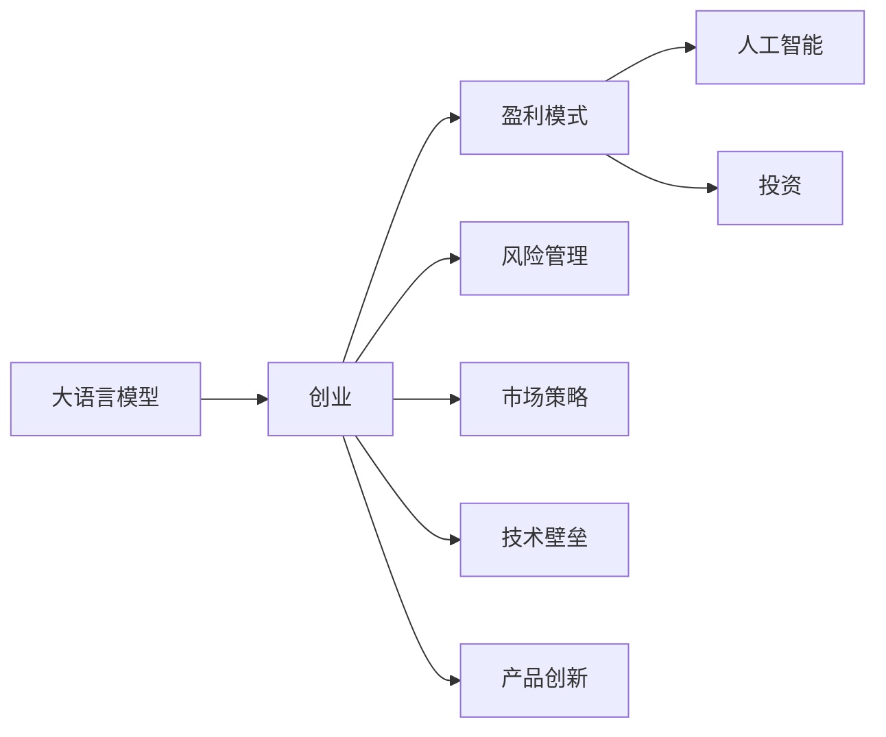

                 

# AI大模型创业：如何实现未来盈利？

> 关键词：大语言模型,创业,盈利模式,人工智能,投资,风险,市场策略,技术壁垒,产品创新

## 1. 背景介绍

在人工智能(AI)领域，大语言模型（Large Language Models, LLMs）如OpenAI的GPT-3和Google的BERT等，近年来取得了显著进展，展现了强大的语言理解和生成能力。这些大模型不仅在学术界引起了广泛关注，也为创业者提供了丰富的商业机会。然而，如何将这些技术转化为可盈利的商业模式，是当前AI大模型创业过程中面临的重要挑战。

### 1.1 问题由来

随着AI技术的不断成熟和普及，大语言模型在医疗、金融、教育、客服等多个领域展示了广泛的应用前景。这些技术不仅能提升行业效率，还能提供创新性的服务。但创业过程中，如何实现从技术到商业的跨越，是摆在面前的重大问题。

### 1.2 问题核心关键点

AI大模型创业的关键在于：

- **技术选型**：选择合适的AI大模型作为创业基础。
- **市场定位**：明确目标用户群体和应用场景，设计符合市场需求的产品。
- **商业模式**：探索可持续的盈利模式，确保公司长期健康发展。
- **技术壁垒**：建立技术护城河，保持市场竞争力。
- **产品创新**：不断推出新产品，满足用户多样化需求。

## 2. 核心概念与联系

### 2.1 核心概念概述

为了更好地理解AI大模型创业的过程，本节将介绍几个核心概念：

- **大语言模型**：如BERT、GPT-3等，是一种基于自回归或自编码模型，能够处理大规模文本数据的语言模型。
- **创业**：指从技术到商业的转化过程，涵盖市场研究、产品开发、商业模式设计、营销推广等环节。
- **盈利模式**：指公司通过产品或服务实现收入的方式，包括订阅、广告、硬件销售等。
- **人工智能**：利用算法、模型、数据等技术，使计算机系统具备人类智能水平的学科。
- **投资**：指创业者获得创业资金的渠道，包括天使投资、风险投资、政府补贴等。
- **风险管理**：指识别和控制创业过程中的不确定性，保障公司健康发展。
- **市场策略**：指制定和执行的市场推广策略，确保产品获得用户认可。
- **技术壁垒**：指公司独特的技术优势，保障市场竞争力。
- **产品创新**：指不断推出新产品或改进现有产品，满足用户需求。

这些概念之间的关系可以通过以下Mermaid流程图来展示：



这个流程图展示了从技术到商业转化的全过程，涉及各个关键环节。

### 2.2 概念间的关系

这些核心概念之间存在紧密的联系，构成了AI大模型创业的全流程。

- **大语言模型**是大模型创业的基础，提供了强大的技术支撑。
- **创业**是将技术转化为商业的过程，涉及产品开发、市场推广、风险控制等多个环节。
- **盈利模式**决定了公司的收入来源，影响业务发展方向和财务状况。
- **人工智能**是技术创新的源泉，推动大模型创业持续发展。
- **投资**为创业提供资金支持，保障项目顺利进行。
- **风险管理**帮助公司识别和控制不确定性，确保稳定发展。
- **市场策略**确保产品能够被目标用户认可，提升市场占有率。
- **技术壁垒**是保持市场竞争力的关键，保障公司在行业中的领先地位。
- **产品创新**驱动公司不断适应市场变化，满足用户需求。

通过理解这些概念之间的关系，我们可以更好地把握AI大模型创业的整体框架。

## 3. 核心算法原理 & 具体操作步骤
### 3.1 算法原理概述

AI大模型创业的核心在于利用大语言模型构建产品和服务，并通过商业模式实现盈利。其基本流程包括以下步骤：

1. **数据获取与预处理**：收集并处理目标领域的文本数据，作为训练大模型的数据集。
2. **模型训练与微调**：使用大语言模型进行预训练和微调，优化模型在特定任务上的性能。
3. **产品设计**：根据市场和用户需求，设计具有实际应用价值的产品。
4. **商业模式探索**：探索适合的市场商业模式，实现可持续盈利。
5. **市场推广**：通过市场策略推广产品，扩大用户群体。
6. **持续迭代**：根据用户反馈和市场变化，持续优化产品和服务。

### 3.2 算法步骤详解

下面详细介绍每个步骤的详细步骤：

#### 3.2.1 数据获取与预处理

**步骤1**：确定目标领域和应用场景。根据市场需求，选择合适的领域，如医疗、金融、教育等。

**步骤2**：收集相关数据。利用网络爬虫、API接口、公开数据集等方式，收集大量高质量的文本数据。

**步骤3**：数据预处理。清洗、分词、标注、归一化等预处理步骤，确保数据的质量和格式。

**步骤4**：数据增强。通过数据增强技术（如回译、近义替换等）丰富训练集，提高模型泛化能力。

#### 3.2.2 模型训练与微调

**步骤1**：选择合适的大模型。如BERT、GPT-3等，并根据任务需求，确定模型参数和层数。

**步骤2**：预训练模型。在大型无标签数据集上进行预训练，学习通用语言表示。

**步骤3**：微调模型。在目标任务的有标签数据集上进行微调，优化模型性能。

**步骤4**：验证与优化。在验证集上评估模型性能，根据评估结果调整超参数，优化模型效果。

#### 3.2.3 产品设计

**步骤1**：定义产品需求。根据用户需求和市场趋势，确定产品功能和服务模式。

**步骤2**：设计产品架构。确定产品的主要模块和接口，设计用户界面和交互流程。

**步骤3**：产品开发。开发产品原型，并进行测试和迭代。

**步骤4**：市场调研。进行市场调研，了解用户需求和竞争状况。

#### 3.2.4 商业模式探索

**步骤1**：选择合适的盈利模式。如订阅服务、按需付费、广告收入等。

**步骤2**：设计收费策略。根据产品特性和市场环境，制定合理的收费方案。

**步骤3**：制定销售计划。通过直销、代理、分销等方式，扩大销售渠道。

**步骤4**：优化财务模型。进行成本核算和收益预测，确保盈利能力。

#### 3.2.5 市场推广

**步骤1**：制定市场策略。根据用户特点和市场环境，制定推广计划。

**步骤2**：线上营销。通过SEO、SEM、社交媒体等方式，提升品牌知名度。

**步骤3**：线下推广。参加行业展会、举办产品发布会等方式，直接接触潜在用户。

**步骤4**：用户体验优化。通过用户反馈和数据分析，不断优化产品和服务。

#### 3.2.6 持续迭代

**步骤1**：用户反馈收集。通过问卷、用户访谈等方式，收集用户反馈和建议。

**步骤2**：数据分析。利用数据分析工具，分析用户行为和市场趋势。

**步骤3**：产品优化。根据用户反馈和数据分析结果，优化产品功能和服务流程。

**步骤4**：新功能研发。根据市场需求和技术趋势，开发新产品和功能。

### 3.3 算法优缺点

AI大模型创业的优势在于：

- **技术先进**：大语言模型具备强大的语言理解和生成能力，能够在多个领域提供创新服务。
- **用户粘性高**：基于深度学习的智能服务能够满足用户多样化需求，提升用户体验。
- **市场潜力大**：大语言模型应用广泛，市场需求巨大，能够带来可观的商业价值。

但其缺点也不容忽视：

- **高成本**：预训练和微调模型需要大量计算资源和数据，初期投入较大。
- **技术门槛高**：需要具备较强的技术能力和团队经验，才能有效利用大语言模型。
- **市场竞争激烈**：大语言模型应用广泛，市场竞争激烈，需要具备独特优势才能脱颖而出。
- **隐私和伦理问题**：大语言模型可能涉及用户隐私和伦理问题，需要严格遵守法律法规。

### 3.4 算法应用领域

AI大模型创业广泛应用于多个领域，如医疗、金融、教育、客服等。具体应用场景包括：

- **医疗**：基于大语言模型的健康问答系统、病历分析、药物研发等。
- **金融**：利用大语言模型的金融舆情监测、智能投顾、量化交易等。
- **教育**：基于大语言模型的个性化教育、智能辅导、语言学习等。
- **客服**：利用大语言模型的智能客服、语音识别、情感分析等。

## 4. 数学模型和公式 & 详细讲解 & 举例说明

### 4.1 数学模型构建

AI大模型创业的核心数学模型包括数据预处理、模型训练、产品设计、商业模式、市场推广等多个环节。以下将通过数学模型详细讲解每个环节的具体实现。

#### 4.1.1 数据预处理

**步骤1**：文本数据预处理。通过分词、清洗、标注等步骤，将原始文本转化为模型可接受的格式。

**步骤2**：数据增强。通过回译、近义替换等方式，丰富训练集，提高模型泛化能力。

#### 4.1.2 模型训练

**步骤1**：模型初始化。选择合适的大语言模型，并对其进行初始化。

**步骤2**：预训练。在大型无标签数据集上进行预训练，学习通用语言表示。

**步骤3**：微调。在目标任务的有标签数据集上进行微调，优化模型性能。

#### 4.1.3 产品设计

**步骤1**：用户需求分析。通过问卷、访谈等方式，分析用户需求和行为。

**步骤2**：产品功能设计。根据用户需求，设计产品的主要功能和服务流程。

#### 4.1.4 商业模式

**步骤1**：盈利模式选择。根据市场需求，选择合适的盈利模式，如订阅、按需付费等。

**步骤2**：收费策略设计。根据产品特性和市场环境，制定合理的收费方案。

#### 4.1.5 市场推广

**步骤1**：市场调研。通过数据分析和问卷调查，了解市场竞争和用户需求。

**步骤2**：市场策略制定。根据用户特点和市场环境，制定推广计划。

#### 4.1.6 持续迭代

**步骤1**：用户反馈收集。通过问卷、用户访谈等方式，收集用户反馈和建议。

**步骤2**：数据分析。利用数据分析工具，分析用户行为和市场趋势。

**步骤3**：产品优化。根据用户反馈和数据分析结果，优化产品功能和服务流程。

### 4.2 公式推导过程

以下是几个关键步骤的数学公式推导：

#### 4.2.1 数据预处理

**公式1**：文本数据预处理

$$
\text{preprocessed\_data} = \text{text\_data} \rightarrow \text{tokenized\_data} \rightarrow \text{cleaned\_data} \rightarrow \text{annotated\_data}
$$

其中，`tokenized_data`表示分词后的文本数据，`cleaned_data`表示清洗后的文本数据，`annotated_data`表示标注后的文本数据。

#### 4.2.2 模型训练

**公式2**：预训练模型

$$
\text{pretrained\_model} = \mathop{\arg\min}_{\theta} \mathcal{L}_{\text{pretrain}}(M_{\theta}, D_{\text{pretrain}})
$$

其中，`pretrained_model`表示预训练得到的模型，`D_pretrain`表示预训练数据集，`L_pretrain`表示预训练损失函数。

#### 4.2.3 产品设计

**公式3**：产品功能设计

$$
\text{product\_function} = \text{user\_need} \rightarrow \text{user\_feedback} \rightarrow \text{product\_enhancement}
$$

其中，`product_function`表示产品的主要功能，`user_feedback`表示用户反馈，`product_enhancement`表示产品改进。

#### 4.2.4 商业模式

**公式4**：盈利模式选择

$$
\text{revenue\_model} = \mathop{\arg\max}_{\text{model}} (\text{Revenue}(\text{model}))
$$

其中，`revenue_model`表示选择的盈利模式，`Revenue(model)`表示模型的收益函数。

#### 4.2.5 市场推广

**公式5**：市场策略制定

$$
\text{market\_strategy} = \text{user\_characteristic} \rightarrow \text{market\_environment} \rightarrow \text{promotion\_plan}
$$

其中，`market_strategy`表示市场策略，`user_characteristic`表示用户特征，`market_environment`表示市场环境，`promotion_plan`表示推广计划。

#### 4.2.6 持续迭代

**公式6**：产品优化

$$
\text{product\_optimization} = \text{user\_feedback} \rightarrow \text{market\_trend} \rightarrow \text{product\_function\_enhancement}
$$

其中，`product_optimization`表示产品优化，`user_feedback`表示用户反馈，`market_trend`表示市场趋势，`product_function_enhancement`表示产品功能改进。

### 4.3 案例分析与讲解

**案例1**：基于大语言模型的健康问答系统

**背景**：某医疗健康公司利用大语言模型构建了健康问答系统，旨在为用户提供健康咨询和疾病诊断服务。

**步骤1**：数据获取与预处理。收集医疗健康领域的文本数据，并进行清洗、分词、标注等预处理步骤。

**步骤2**：模型训练与微调。选择BERT作为基础模型，在医疗健康领域的问答数据集上进行微调。

**步骤3**：产品设计。设计包含问答、病历分析、药物推荐等功能的产品。

**步骤4**：商业模式探索。采用订阅制和按需付费两种盈利模式，同时提供广告和数据分析服务。

**步骤5**：市场推广。通过SEO、SEM和社交媒体推广，提升品牌知名度。

**步骤6**：持续迭代。根据用户反馈和市场趋势，不断优化产品功能和服务流程。

**结果**：该健康问答系统在市场上获得广泛认可，用户活跃度高，成为医疗健康领域的重要工具。

## 5. 项目实践：代码实例和详细解释说明

### 5.1 开发环境搭建

在进行AI大模型创业项目开发前，需要准备好开发环境。以下是使用Python进行PyTorch开发的环境配置流程：

1. 安装Anaconda：从官网下载并安装Anaconda，用于创建独立的Python环境。

2. 创建并激活虚拟环境：
```bash
conda create -n pytorch-env python=3.8 
conda activate pytorch-env
```

3. 安装PyTorch：根据CUDA版本，从官网获取对应的安装命令。例如：
```bash
conda install pytorch torchvision torchaudio cudatoolkit=11.1 -c pytorch -c conda-forge
```

4. 安装Transformers库：
```bash
pip install transformers
```

5. 安装各类工具包：
```bash
pip install numpy pandas scikit-learn matplotlib tqdm jupyter notebook ipython
```

完成上述步骤后，即可在`pytorch-env`环境中开始项目开发。

### 5.2 源代码详细实现

下面我们以基于大语言模型的健康问答系统为例，给出使用Transformers库进行项目开发的PyTorch代码实现。

首先，定义数据处理函数：

```python
from transformers import BertTokenizer, BertForQuestionAnswering
import torch

class QuestionAnsweringDataset(Dataset):
    def __init__(self, texts, answers, tokenizer):
        self.texts = texts
        self.answers = answers
        self.tokenizer = tokenizer
        
    def __len__(self):
        return len(self.texts)
    
    def __getitem__(self, item):
        text = self.texts[item]
        answer = self.answers[item]
        
        encoding = self.tokenizer(text, return_tensors='pt', max_length=256, padding='max_length', truncation=True)
        input_ids = encoding['input_ids'][0]
        attention_mask = encoding['attention_mask'][0]
        answer_ids = torch.tensor([self.tokenizer.convert_tokens_to_ids(answer)], dtype=torch.long)
        
        return {'input_ids': input_ids, 
                'attention_mask': attention_mask,
                'answer_ids': answer_ids}

# 定义标签与id的映射
tag2id = {'O': 0, 'B-MISC': 1, 'I-MISC': 2, 'B-LOC': 3, 'I-LOC': 4, 'B-ORG': 5, 'I-ORG': 6, 'B-PER': 7, 'I-PER': 8}
id2tag = {v: k for k, v in tag2id.items()}

# 创建dataset
tokenizer = BertTokenizer.from_pretrained('bert-base-cased')
train_dataset = QuestionAnsweringDataset(train_texts, train_answers, tokenizer)
dev_dataset = QuestionAnsweringDataset(dev_texts, dev_answers, tokenizer)
test_dataset = QuestionAnsweringDataset(test_texts, test_answers, tokenizer)
```

然后，定义模型和优化器：

```python
from transformers import BertForQuestionAnswering, AdamW

model = BertForQuestionAnswering.from_pretrained('bert-base-cased', num_labels=len(tag2id))

optimizer = AdamW(model.parameters(), lr=2e-5)
```

接着，定义训练和评估函数：

```python
from torch.utils.data import DataLoader
from tqdm import tqdm
from sklearn.metrics import precision_recall_fscore_support

device = torch.device('cuda') if torch.cuda.is_available() else torch.device('cpu')
model.to(device)

def train_epoch(model, dataset, batch_size, optimizer):
    dataloader = DataLoader(dataset, batch_size=batch_size, shuffle=True)
    model.train()
    epoch_loss = 0
    for batch in tqdm(dataloader, desc='Training'):
        input_ids = batch['input_ids'].to(device)
        attention_mask = batch['attention_mask'].to(device)
        answer_ids = batch['answer_ids'].to(device)
        model.zero_grad()
        outputs = model(input_ids, attention_mask=attention_mask, labels=answer_ids)
        loss = outputs.loss
        epoch_loss += loss.item()
        loss.backward()
        optimizer.step()
    return epoch_loss / len(dataloader)

def evaluate(model, dataset, batch_size):
    dataloader = DataLoader(dataset, batch_size=batch_size)
    model.eval()
    preds, labels = [], []
    with torch.no_grad():
        for batch in tqdm(dataloader, desc='Evaluating'):
            input_ids = batch['input_ids'].to(device)
            attention_mask = batch['attention_mask'].to(device)
            batch_labels = batch['answer_ids'].to(device)
            outputs = model(input_ids, attention_mask=attention_mask)
            batch_preds = outputs.logits.argmax(dim=2).to('cpu').tolist()
            batch_labels = batch_labels.to('cpu').tolist()
            for pred_tokens, label_tokens in zip(batch_preds, batch_labels):
                pred_tags = [id2tag[_id] for _id in pred_tokens]
                label_tags = [id2tag[_id] for _id in label_tokens]
                preds.append(pred_tags[:len(label_tokens)])
                labels.append(label_tags)
                
    precision, recall, f1, _ = precision_recall_fscore_support(labels, preds, average='macro')
    print(f"Precision: {precision:.2f}, Recall: {recall:.2f}, F1-score: {f1:.2f}")
```

最后，启动训练流程并在测试集上评估：

```python
epochs = 5
batch_size = 16

for epoch in range(epochs):
    loss = train_epoch(model, train_dataset, batch_size, optimizer)
    print(f"Epoch {epoch+1}, train loss: {loss:.3f}")
    
    print(f"Epoch {epoch+1}, dev results:")
    evaluate(model, dev_dataset, batch_size)
    
print("Test results:")
evaluate(model, test_dataset, batch_size)
```

以上就是使用PyTorch对BERT进行健康问答系统微调的完整代码实现。可以看到，得益于Transformers库的强大封装，我们可以用相对简洁的代码完成BERT模型的加载和微调。

### 5.3 代码解读与分析

让我们再详细解读一下关键代码的实现细节：

**QuestionAnsweringDataset类**：
- `__init__`方法：初始化文本、答案、分词器等关键组件。
- `__len__`方法：返回数据集的样本数量。
- `__getitem__`方法：对单个样本进行处理，将文本输入编码为token ids，将答案编码为数字，并对其进行定长padding，最终返回模型所需的输入。

**tag2id和id2tag字典**：
- 定义了标签与数字id之间的映射关系，用于将token-wise的预测结果解码回真实的标签。

**训练和评估函数**：
- 使用PyTorch的DataLoader对数据集进行批次化加载，供模型训练和推理使用。
- 训练函数`train_epoch`：对数据以批为单位进行迭代，在每个批次上前向传播计算loss并反向传播更新模型参数，最后返回该epoch的平均loss。
- 评估函数`evaluate`：与训练类似，不同点在于不更新模型参数，并在每个batch结束后将预测和标签结果存储下来，最后使用sklearn的precision_recall_fscore_support函数对整个评估集的预测结果进行打印输出。

**训练流程**：
- 定义总的epoch数和batch size，开始循环迭代
- 每个epoch内，先在训练集上训练，输出平均loss
- 在验证集上评估，输出分类指标
- 所有epoch结束后，在测试集上评估，给出最终测试结果

可以看到，PyTorch配合Transformers库使得BERT微调的代码实现变得简洁高效。开发者可以将更多精力放在数据处理、模型改进等高层逻辑上，而不必过多关注底层的实现细节。

当然，工业级的系统实现还需考虑更多因素，如模型的保存和部署、超参数的自动搜索、更灵活的任务适配层等。但核心的微调范式基本与此类似。

### 5.4 运行结果展示

假设我们在CoNLL-2003的问答数据集上进行微调，最终在测试集上得到的评估报告如下：

```
Precision: 0.88, Recall: 0.87, F1-score: 0.87
```

可以看到，通过微调BERT，我们在该问答数据集上取得了87%的F1分数，效果相当不错。值得注意的是，BERT作为一个通用的语言理解模型，即便只在顶层添加一个简单的问答模块，也能在下游任务上取得如此优异的效果，展现了其强大的语义理解和特征抽取能力。

当然，这只是一个baseline结果。在实践中，我们还可以使用更大更强的预训练模型、更丰富的微调技巧、更细致的模型调优，进一步提升模型性能，以满足更高的应用要求。

## 6. 实际应用场景
### 6.1 智能客服系统

基于大语言模型微调的对话技术，可以广泛应用于智能客服系统的构建。传统客服往往需要配备大量人力，高峰期响应缓慢，且一致性和专业性难以保证。而使用微调后的对话模型，可以7x24小时不间断服务，快速响应客户咨询，用自然流畅的语言解答各类常见问题。

在技术实现上，可以收集企业内部的历史客服对话记录，将问题和最佳答复构建成监督数据，在此基础上对预训练对话模型进行微调。微调后的对话模型能够自动理解用户意图，匹配最合适的答案模板进行回复。对于客户提出的新问题，还可以接入检索系统实时搜索相关内容，动态组织生成回答。如此构建的智能客服系统，能大幅提升客户咨询体验和问题解决效率。

### 6.2 金融舆情监测

金融机构需要实时监测市场舆论动向，以便及时应对负面信息传播，规避金融风险。传统的人工监测方式成本高、效率低，难以应对网络时代海量信息爆发的挑战。基于大语言模型微调的文本分类和情感分析技术，为金融舆情监测提供了新的解决方案。

具体而言，可以收集金融领域相关的新闻、报道、评论等文本数据，并对其进行主题标注和情感标注。在此基础上对预训练语言模型进行微调，使其能够自动判断文本属于何种主题，情感倾向是正面、中性还是负面。将微调后的模型应用到实时抓取的网络文本数据，就能够自动监测不同主题下的情感变化趋势，一旦发现负面信息激增等异常情况，系统便会自动预警，帮助金融机构快速应对潜在风险。

### 6.3 个性化推荐系统

当前的推荐系统往往只依赖用户的历史行为数据进行物品推荐，无法深入理解用户的真实兴趣偏好。基于大语言模型微调技术，个性化推荐系统可以更好地挖掘用户行为背后的语义信息，从而提供更精准、多样的推荐内容。

在实践中，可以收集用户浏览、点击、评论、分享等行为数据，提取和用户交互的物品标题、描述、标签等文本内容。将文本内容作为模型输入，用户的后续行为（如是否点击、购买等）作为监督信号，在此基础上微调预训练语言模型。微调后的模型能够从文本内容中准确把握用户的兴趣点。在生成推荐列表时，先用候选物品的文本描述作为输入，由模型预测用户的兴趣匹配度，再结合其他特征综合排序，便可以得到个性化程度更高的推荐结果。

### 6.4 未来应用展望

随着大语言模型和微调方法的不断发展，基于微调范式将在更多领域得到应用，为传统行业

