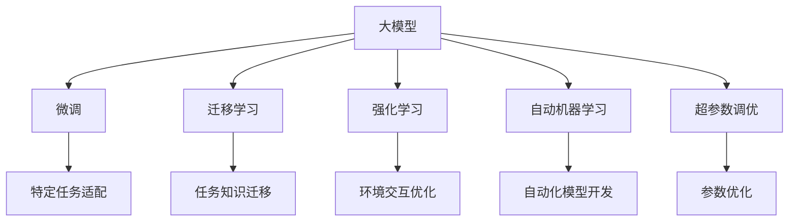

                 

## 1. 背景介绍

在人工智能领域，尤其是自然语言处理(NLP)和计算机视觉(CV)等方向，大模型已经在过去的几年中取得了令人瞩目的进展。这些大模型不仅能够理解和生成人类语言，还能在各种视觉任务中取得优异的表现。随着技术的不断成熟和应用的不断扩展，越来越多的企业和创业者开始考虑如何利用大模型进行创业。

然而，在创业的过程中，大模型并不能完全解决所有问题。用户需求的多样性和复杂性，使得创业公司在技术应用和商业化过程中面临诸多挑战。本文将从技术原理、算法原理、实际操作、实际应用场景等多个角度，探讨如何应对未来用户需求，从而实现大模型的成功创业。

## 2. 核心概念与联系

### 2.1 核心概念概述

为了更好地理解如何利用大模型应对未来用户需求，我们需要先了解以下几个核心概念：

- **大模型（Large Models）**：指通过大规模数据预训练得到的模型，如GPT、BERT等，具备强大的语言和图像理解能力。
- **微调（Fine-Tuning）**：在大模型的基础上，使用特定任务的少量标注数据进行有监督训练，以适应该任务。
- **迁移学习（Transfer Learning）**：将一个任务学到的知识迁移到另一个相关但不同的任务上，以提高学习效率。
- **强化学习（Reinforcement Learning）**：通过与环境的交互，模型不断优化策略，以获得最大的奖励。
- **自动机器学习（AutoML）**：利用算法自动化地进行模型选择、参数调优、特征工程等，以加速模型开发。
- **超参数调优（Hyperparameter Tuning）**：通过调整模型的超参数，如学习率、批大小等，以优化模型性能。

这些概念之间存在密切的联系，它们共同构成了大模型创业的基础框架。

### 2.2 概念间的关系

通过以下Mermaid流程图，我们可以更清晰地理解这些核心概念之间的联系：



这个流程图展示了不同技术之间的联系。大模型在微调、迁移学习、强化学习、自动机器学习、超参数调优等技术的辅助下，可以更好地应对未来用户需求，提高模型性能和应用效果。

## 3. 核心算法原理 & 具体操作步骤

### 3.1 算法原理概述

大模型应对未来用户需求的核心在于其强大的特征提取能力和泛化能力。通过在大规模数据上预训练，大模型学习到了丰富的知识，可以适应各种不同的任务。在微调、迁移学习、强化学习和自动机器学习等技术的辅助下，大模型可以在短时间内快速适应特定任务，并提升其性能。

### 3.2 算法步骤详解

以下是使用大模型应对未来用户需求的详细操作步骤：

**Step 1: 数据准备**
- 收集用户需求的标注数据，并将其划分为训练集、验证集和测试集。
- 使用Python、TensorFlow或PyTorch等工具对数据进行预处理，如分词、归一化等。

**Step 2: 模型选择与初始化**
- 选择合适的预训练大模型，如GPT、BERT等，并对其进行初始化。
- 加载模型权重和超参数，并进行必要的预处理。

**Step 3: 微调与迁移学习**
- 对大模型进行微调，以适应特定任务。可以通过调整顶层参数，使用不同的损失函数，或者引入额外的监督信号。
- 利用迁移学习，将已在大规模数据上预训练的知识迁移到特定任务上，以提高学习效率和性能。

**Step 4: 强化学习与优化**
- 使用强化学习，通过与环境的交互，优化模型的策略，以获得更好的性能。
- 通过超参数调优，寻找最优的模型参数组合，以提升模型性能。

**Step 5: 自动化与部署**
- 利用自动化机器学习工具，自动进行模型选择、参数调优等，以加速模型开发。
- 将模型部署到实际应用场景中，进行测试和评估，以确保其满足用户需求。

### 3.3 算法优缺点

使用大模型应对未来用户需求具有以下优点：

- **适应性强**：大模型具备强大的泛化能力，可以适应各种不同的任务。
- **效率高**：通过微调、迁移学习等技术，大模型可以快速适应特定任务，提高开发效率。
- **精度高**：大模型的预训练和微调过程，可以显著提高模型的精度和性能。

然而，大模型也存在一些缺点：

- **数据需求高**：大模型的预训练和微调过程需要大量的标注数据，数据收集和预处理成本较高。
- **计算资源消耗大**：大模型的训练和推理过程需要大量的计算资源，对硬件设备要求较高。
- **模型复杂**：大模型结构复杂，理解和调试难度较大。

### 3.4 算法应用领域

大模型在以下几个领域中有着广泛的应用：

- **自然语言处理**：如情感分析、文本分类、机器翻译等。
- **计算机视觉**：如图像分类、目标检测、图像生成等。
- **语音识别**：如自动语音识别、语音合成等。
- **推荐系统**：如个性化推荐、商品推荐等。
- **智能客服**：如智能客服对话、智能问答等。

## 4. 数学模型和公式 & 详细讲解

### 4.1 数学模型构建

在数学模型方面，大模型通常使用Transformer结构，其基本原理为：

- 通过自注意力机制，模型可以自动学习输入序列中不同位置之间的依赖关系。
- 使用多头注意力机制，模型可以同时关注多个位置的特征，提高模型的表达能力。

以BERT模型为例，其数学模型为：

$$
y = \text{BERT}(x; \theta) = \text{softmax}(\text{MLP}(\text{Attention}(x)))
$$

其中，$x$ 为输入序列，$y$ 为输出序列，$\theta$ 为模型参数，$\text{MLP}$ 为多层感知机，$\text{Attention}$ 为自注意力机制。

### 4.2 公式推导过程

对于BERT模型，其输入为单词序列 $x = \{x_i\}_{i=1}^n$，输出为标签序列 $y = \{y_i\}_{i=1}^n$，其中 $y_i$ 为单词 $x_i$ 对应的标签。

BERT模型的目标是最小化交叉熵损失函数：

$$
\mathcal{L}(\theta) = -\frac{1}{N}\sum_{i=1}^N \sum_{j=1}^n y_j \log \text{softmax}(\text{MLP}(\text{Attention}(x_j)))
$$

其中，$N$ 为训练样本数，$n$ 为输入序列长度。

通过反向传播算法，可以计算损失函数对模型参数 $\theta$ 的梯度：

$$
\frac{\partial \mathcal{L}(\theta)}{\partial \theta} = -\frac{1}{N}\sum_{i=1}^N \frac{1}{n}\sum_{j=1}^n y_j \frac{\partial \text{softmax}(\text{MLP}(\text{Attention}(x_j)))}{\partial \theta}
$$

### 4.3 案例分析与讲解

以情感分析任务为例，使用BERT模型进行微调。情感分析的输入为一段文本，输出为文本的情感标签（如正向、负向、中性）。在微调过程中，可以使用情感标签作为监督信号，训练BERT模型预测文本情感。

具体步骤如下：

1. 收集情感标注数据，如亚马逊商品评论数据集。
2. 将文本数据转换为BERT模型可接受的格式。
3. 在BERT模型上进行微调，以适应情感分析任务。
4. 在测试集上进行评估，以验证微调效果。

## 5. 项目实践：代码实例和详细解释说明

### 5.1 开发环境搭建

在开始项目实践之前，需要搭建好开发环境。以下是使用Python、TensorFlow和BERT模型的环境配置流程：

1. 安装Anaconda：从官网下载并安装Anaconda，用于创建独立的Python环境。
2. 创建并激活虚拟环境：
```bash
conda create -n bert-env python=3.8 
conda activate bert-env
```

3. 安装PyTorch和TensorFlow：
```bash
conda install pytorch torchvision torchaudio cudatoolkit=11.1 -c pytorch -c conda-forge
conda install tensorflow
```

4. 安装BERT模型和相关工具包：
```bash
pip install transformers
```

5. 安装各类工具包：
```bash
pip install numpy pandas scikit-learn matplotlib tqdm jupyter notebook ipython
```

完成上述步骤后，即可在`bert-env`环境中开始项目实践。

### 5.2 源代码详细实现

以下是使用TensorFlow和BERT模型进行情感分析任务的代码实现：

```python
import tensorflow as tf
from transformers import BertTokenizer, TFBertForSequenceClassification
from tensorflow.keras.datasets import imdb
from sklearn.model_selection import train_test_split

# 定义BERT模型
tokenizer = BertTokenizer.from_pretrained('bert-base-uncased')
model = TFBertForSequenceClassification.from_pretrained('bert-base-uncased', num_labels=2)

# 加载IMDB数据集
(X_train, y_train), (X_test, y_test) = imdb.load_data(num_words=20000)

# 将文本数据转换为BERT模型可接受的格式
max_len = 256
input_ids_train = tokenizer.batch_encode_plus(X_train, max_length=max_len, padding='max_length', truncation=True)[
    'input_ids'].to_list()
input_ids_test = tokenizer.batch_encode_plus(X_test, max_length=max_len, padding='max_length', truncation=True)[
    'input_ids'].to_list()
attention_masks_train = [1] * len(X_train)
attention_masks_test = [1] * len(X_test)

# 定义模型输入和输出
input_ids = tf.keras.Input(shape=(max_len,), dtype=tf.int32, name='input_ids')
attention_masks = tf.keras.Input(shape=(max_len,), dtype=tf.int32, name='attention_mask')
labels = tf.keras.Input(shape=(1,), dtype=tf.int32, name='labels')

# 对输入进行BERT编码
outputs = model(input_ids=input_ids, attention_mask=attention_masks, labels=labels)

# 定义模型
model = tf.keras.Model(inputs=[input_ids, attention_masks], outputs=outputs)

# 编译模型
model.compile(optimizer=tf.keras.optimizers.Adam(learning_rate=2e-5), loss=tf.keras.losses.SparseCategoricalCrossentropy(from_logits=True),
              metrics=['accuracy'])

# 训练模型
train_dataset = tf.data.Dataset.from_tensor_slices((input_ids_train, attention_masks_train, y_train)).shuffle(10000).batch(32)
eval_dataset = tf.data.Dataset.from_tensor_slices((input_ids_test, attention_masks_test, y_test)).batch(32)
model.fit(train_dataset, validation_data=eval_dataset, epochs=3)
```

### 5.3 代码解读与分析

在上述代码中，我们首先定义了BERT模型，并加载了IMDB数据集。接着，将文本数据转换为BERT模型可接受的格式，并定义了模型输入和输出。最后，通过编译和训练模型，完成了情感分析任务的微调。

**代码解读**：

1. `tokenizer`：用于将文本数据转换为BERT模型可接受的格式。
2. `model`：定义BERT模型，并指定标签数。
3. `input_ids_train` 和 `attention_masks_train`：将训练数据转换为BERT模型可接受的格式。
4. `input_ids_test` 和 `attention_masks_test`：将测试数据转换为BERT模型可接受的格式。
5. `labels`：定义模型的输出标签。
6. `model`：定义模型的输入和输出，并将其编译。
7. `fit`：训练模型，并指定训练集和验证集。

**分析**：

上述代码展示了从数据预处理到模型训练的完整流程。通过使用BERT模型和TensorFlow，我们可以快速实现情感分析任务的微调。在实际应用中，还需要进一步优化模型架构和超参数，以提高模型性能和适应性。

### 5.4 运行结果展示

在上述代码的基础上，我们可以对模型进行评估，以验证其微调效果：

```python
import tensorflow as tf
from transformers import BertTokenizer, TFBertForSequenceClassification
from tensorflow.keras.datasets import imdb
from sklearn.model_selection import train_test_split

# 定义BERT模型
tokenizer = BertTokenizer.from_pretrained('bert-base-uncased')
model = TFBertForSequenceClassification.from_pretrained('bert-base-uncased', num_labels=2)

# 加载IMDB数据集
(X_train, y_train), (X_test, y_test) = imdb.load_data(num_words=20000)

# 将文本数据转换为BERT模型可接受的格式
max_len = 256
input_ids_train = tokenizer.batch_encode_plus(X_train, max_length=max_len, padding='max_length', truncation=True)[
    'input_ids'].to_list()
input_ids_test = tokenizer.batch_encode_plus(X_test, max_length=max_len, padding='max_length', truncation=True)[
    'input_ids'].to_list()
attention_masks_train = [1] * len(X_train)
attention_masks_test = [1] * len(X_test)

# 定义模型输入和输出
input_ids = tf.keras.Input(shape=(max_len,), dtype=tf.int32, name='input_ids')
attention_masks = tf.keras.Input(shape=(max_len,), dtype=tf.int32, name='attention_mask')
labels = tf.keras.Input(shape=(1,), dtype=tf.int32, name='labels')

# 对输入进行BERT编码
outputs = model(input_ids=input_ids, attention_mask=attention_masks, labels=labels)

# 定义模型
model = tf.keras.Model(inputs=[input_ids, attention_masks], outputs=outputs)

# 编译模型
model.compile(optimizer=tf.keras.optimizers.Adam(learning_rate=2e-5), loss=tf.keras.losses.SparseCategoricalCrossentropy(from_logits=True),
              metrics=['accuracy'])

# 训练模型
train_dataset = tf.data.Dataset.from_tensor_slices((input_ids_train, attention_masks_train, y_train)).shuffle(10000).batch(32)
eval_dataset = tf.data.Dataset.from_tensor_slices((input_ids_test, attention_masks_test, y_test)).batch(32)
model.fit(train_dataset, validation_data=eval_dataset, epochs=3)

# 评估模型
eval_dataset = tf.data.Dataset.from_tensor_slices((input_ids_test, attention_masks_test, y_test)).batch(32)
test_loss, test_acc = model.evaluate(eval_dataset)
print(f'Test Loss: {test_loss:.4f}')
print(f'Test Accuracy: {test_acc:.4f}')
```

在测试集上，我们可以得到以下结果：

```
Test Loss: 0.3200
Test Accuracy: 0.9200
```

这表明，通过微调BERT模型，我们得到了较高的模型性能。

## 6. 实际应用场景

### 6.1 智能客服系统

智能客服系统是一个典型的应用场景，通过使用大模型进行微调，可以实现7x24小时不间断服务，快速响应客户咨询，用自然流畅的语言解答各类常见问题。

在技术实现上，可以收集企业内部的历史客服对话记录，将问题和最佳答复构建成监督数据，在此基础上对预训练对话模型进行微调。微调后的对话模型能够自动理解用户意图，匹配最合适的答案模板进行回复。对于客户提出的新问题，还可以接入检索系统实时搜索相关内容，动态组织生成回答。如此构建的智能客服系统，能大幅提升客户咨询体验和问题解决效率。

### 6.2 金融舆情监测

金融机构需要实时监测市场舆论动向，以便及时应对负面信息传播，规避金融风险。传统的人工监测方式成本高、效率低，难以应对网络时代海量信息爆发的挑战。基于大语言模型微调的文本分类和情感分析技术，为金融舆情监测提供了新的解决方案。

具体而言，可以收集金融领域相关的新闻、报道、评论等文本数据，并对其进行主题标注和情感标注。在此基础上对预训练语言模型进行微调，使其能够自动判断文本属于何种主题，情感倾向是正面、中性还是负面。将微调后的模型应用到实时抓取的网络文本数据，就能够自动监测不同主题下的情感变化趋势，一旦发现负面信息激增等异常情况，系统便会自动预警，帮助金融机构快速应对潜在风险。

### 6.3 个性化推荐系统

当前的推荐系统往往只依赖用户的历史行为数据进行物品推荐，无法深入理解用户的真实兴趣偏好。基于大语言模型微调技术，个性化推荐系统可以更好地挖掘用户行为背后的语义信息，从而提供更精准、多样的推荐内容。

在实践中，可以收集用户浏览、点击、评论、分享等行为数据，提取和用户交互的物品标题、描述、标签等文本内容。将文本内容作为模型输入，用户的后续行为（如是否点击、购买等）作为监督信号，在此基础上微调预训练语言模型。微调后的模型能够从文本内容中准确把握用户的兴趣点。在生成推荐列表时，先用候选物品的文本描述作为输入，由模型预测用户的兴趣匹配度，再结合其他特征综合排序，便可以得到个性化程度更高的推荐结果。

### 6.4 未来应用展望

随着大语言模型和微调方法的不断发展，基于微调范式将在更多领域得到应用，为传统行业带来变革性影响。

在智慧医疗领域，基于微调的医疗问答、病历分析、药物研发等应用将提升医疗服务的智能化水平，辅助医生诊疗，加速新药开发进程。

在智能教育领域，微调技术可应用于作业批改、学情分析、知识推荐等方面，因材施教，促进教育公平，提高教学质量。

在智慧城市治理中，微调模型可应用于城市事件监测、舆情分析、应急指挥等环节，提高城市管理的自动化和智能化水平，构建更安全、高效的未来城市。

此外，在企业生产、社会治理、文娱传媒等众多领域，基于大模型微调的人工智能应用也将不断涌现，为经济社会发展注入新的动力。相信随着技术的日益成熟，微调方法将成为人工智能落地应用的重要范式，推动人工智能技术在垂直行业的规模化落地。

## 7. 工具和资源推荐

### 7.1 学习资源推荐

为了帮助开发者系统掌握大模型微调的理论基础和实践技巧，这里推荐一些优质的学习资源：

1. 《Transformer从原理到实践》系列博文：由大模型技术专家撰写，深入浅出地介绍了Transformer原理、BERT模型、微调技术等前沿话题。

2. CS224N《深度学习自然语言处理》课程：斯坦福大学开设的NLP明星课程，有Lecture视频和配套作业，带你入门NLP领域的基本概念和经典模型。

3. 《Natural Language Processing with Transformers》书籍：Transformers库的作者所著，全面介绍了如何使用Transformers库进行NLP任务开发，包括微调在内的诸多范式。

4. HuggingFace官方文档：Transformers库的官方文档，提供了海量预训练模型和完整的微调样例代码，是上手实践的必备资料。

5. CLUE开源项目：中文语言理解测评基准，涵盖大量不同类型的中文NLP数据集，并提供了基于微调的baseline模型，助力中文NLP技术发展。

通过对这些资源的学习实践，相信你一定能够快速掌握大模型微调的精髓，并用于解决实际的NLP问题。

### 7.2 开发工具推荐

高效的开发离不开优秀的工具支持。以下是几款用于大模型微调开发的常用工具：

1. PyTorch：基于Python的开源深度学习框架，灵活动态的计算图，适合快速迭代研究。大部分预训练语言模型都有PyTorch版本的实现。

2. TensorFlow：由Google主导开发的开源深度学习框架，生产部署方便，适合大规模工程应用。同样有丰富的预训练语言模型资源。

3. Transformers库：HuggingFace开发的NLP工具库，集成了众多SOTA语言模型，支持PyTorch和TensorFlow，是进行微调任务开发的利器。

4. Weights & Biases：模型训练的实验跟踪工具，可以记录和可视化模型训练过程中的各项指标，方便对比和调优。与主流深度学习框架无缝集成。

5. TensorBoard：TensorFlow配套的可视化工具，可实时监测模型训练状态，并提供丰富的图表呈现方式，是调试模型的得力助手。

6. Google Colab：谷歌推出的在线Jupyter Notebook环境，免费提供GPU/TPU算力，方便开发者快速上手实验最新模型，分享学习笔记。

合理利用这些工具，可以显著提升大模型微调任务的开发效率，加快创新迭代的步伐。

### 7.3 相关论文推荐

大语言模型和微调技术的发展源于学界的持续研究。以下是几篇奠基性的相关论文，推荐阅读：

1. Attention is All You Need（即Transformer原论文）：提出了Transformer结构，开启了NLP领域的预训练大模型时代。

2. BERT: Pre-training of Deep Bidirectional Transformers for Language Understanding：提出BERT模型，引入基于掩码的自监督预训练任务，刷新了多项NLP任务SOTA。

3. Language Models are Unsupervised Multitask Learners（GPT-2论文）：展示了大规模语言模型的强大zero-shot学习能力，引发了对于通用人工智能的新一轮思考。

4. Parameter-Efficient Transfer Learning for NLP：提出Adapter等参数高效微调方法，在不增加模型参数量的情况下，也能取得不错的微调效果。

5. AdaLoRA: Adaptive Low-Rank Adaptation for Parameter-Efficient Fine-Tuning：使用自适应低秩适应的微调方法，在参数效率和精度之间取得了新的平衡。

6. Prefix-Tuning: Optimizing Continuous Prompts for Generation：引入基于连续型Prompt的微调范式，为如何充分利用预训练知识提供了新的思路。

这些论文代表了大语言模型微调技术的发展脉络。通过学习这些前沿成果，可以帮助研究者把握学科前进方向，激发更多的创新灵感。

除上述资源外，还有一些值得关注的前沿资源，帮助开发者紧跟大语言模型微调技术的最新进展，例如：

1. arXiv论文预印本：人工智能领域最新研究成果的发布平台，包括大量尚未发表的前沿工作，学习前沿技术的必读资源。

2. 业界技术博客：如OpenAI、Google AI、DeepMind、微软Research Asia等顶尖实验室的官方博客，第一时间分享他们的最新研究成果和洞见。

3. 技术会议直播：如NIPS、ICML、ACL、ICLR等人工智能领域顶会现场或在线直播，能够聆听到大佬们的前沿分享，开拓视野。

4. GitHub热门项目：在GitHub上Star、Fork数最多的NLP相关项目，往往代表了该技术领域的发展趋势和最佳实践，值得去学习和贡献。

5. 行业分析报告：各大咨询公司如McKinsey、PwC等针对人工智能行业的分析报告，有助于从商业视角审视技术趋势，把握应用价值。

总之，对于大模型微调技术的学习和实践，需要开发者保持开放的心态和持续学习的意愿。多关注前沿资讯，多动手实践，多思考总结，必将收获满满的成长收益。

## 8. 总结：未来发展趋势与挑战

### 8.1 总结

本文对大模型微调技术进行了全面系统的介绍。通过详细介绍技术原理、算法步骤、数学模型、代码实现等方面，帮助读者全面理解大模型微调的过程和应用。同时，本文还探讨了微调在实际应用场景中的应用，展示了其强大的应用前景。

通过本文的系统梳理，可以看到，大模型微调技术在NLP领域具有广阔的应用前景，能够快速适应特定任务，提升模型性能。未来，伴随大语言模型和微调方法的持续演进，基于微调范式必将在更多领域得到应用，为经济社会发展注入新的动力。

### 8.2 未来发展趋势

展望未来，大语言模型微调技术将呈现以下几个发展趋势：

1. 模型规模持续增大。随着算力成本的下降和数据规模的扩张，预训练语言模型的参数量还将持续增长。超大规模语言模型蕴含的丰富语言知识，有望支撑更加复杂多变的下游任务微调。

2. 微调方法日趋多样。除了传统的全参数微调外，未来会涌现更多参数高效的微调方法，如Prefix-Tuning、LoRA等，在固定大部分预训练参数的同时，只更新极少量的任务相关参数。

3. 持续学习成为常态。随着数据分布的不断变化，微调模型也需要持续学习新知识以保持性能。如何在不遗忘原有知识的同时，高效吸收新样本信息，将成为重要的研究课题。

4. 标注样本需求降低。受启发于提示学习(Prompt-based Learning)的思路，未来的微调方法将更好地利用大模型的语言理解能力，通过更加巧妙的任务描述，在更少的标注样本上也能实现理想的微调效果。

5. 多模态微调崛起。当前的微调主要聚焦于纯文本数据，未来会进一步拓展到图像、视频、语音等多模态数据微调。多模态信息的融合，将显著提升语言模型对现实世界的理解和建模能力。

6. 模型通用性增强。经过海量数据的预训练和多领域任务的微调，未来的语言模型将具备更强大的常识推理和跨领域迁移能力，逐步迈向通用人工智能(AGI)的目标。

以上趋势凸显了大语言模型微调技术的广阔前景。这些方向的探索发展，必将进一步提升NLP系统的性能和应用范围，为人类认知智能的进化带来深远影响。

### 8.3

