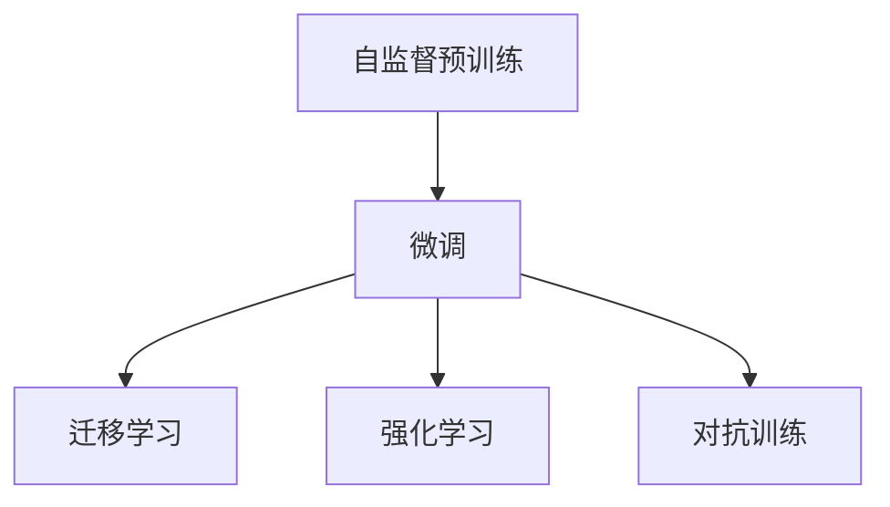

                 

# AI大模型创业：如何应对未来竞争对手？

> 关键词：AI大模型、创业、竞争策略、市场分析、技术优势、商业化路径

## 1. 背景介绍

随着人工智能技术的飞速发展，AI大模型（Large AI Models, LAMs）已经成为引领行业创新与竞争的关键驱动力。无论是学术界还是工业界，众多公司都纷纷投入巨资研发和部署AI大模型，旨在通过这种先进技术实现商业价值的最大化。然而，AI大模型创业的竞争环境激烈，如何在激烈的市场竞争中脱颖而出，成为创业成功的关键。本文将从AI大模型的核心概念、算法原理与操作步骤、市场分析、技术优势与挑战等方面展开探讨，并提出一套应对未来竞争对手的有效策略。

## 2. 核心概念与联系

### 2.1 核心概念概述

AI大模型通常指的是使用深度学习技术，在大规模数据集上进行自监督或监督学习训练的大型神经网络模型。这些模型经过预训练或微调，具备强大的模式识别、自然语言处理、图像识别、语音识别等多种能力，能够在各行各业中发挥重要作用。

在AI大模型的创业过程中，以下核心概念至关重要：

- **自监督预训练**：使用大规模无标签数据进行模型训练，使得模型能够学习到通用的知识表示，从而在下游任务上表现更好。
- **微调**：在自监督预训练基础上，使用任务特定数据进行有监督学习，使模型在特定任务上表现更优。
- **迁移学习**：将在一个任务上学习到的知识迁移到另一个任务中，减少在新任务上从头训练的需求。
- **强化学习**：通过奖励和惩罚机制，使模型在特定任务上不断优化，提升任务表现。
- **对抗训练**：通过生成对抗性样本，增强模型对噪声的鲁棒性。

这些概念相互关联，共同构成了AI大模型的核心技术框架。

### 2.2 核心概念间的关系

以下是一个简单的Mermaid流程图，展示了AI大模型的核心概念间的关系：



这个流程图说明，自监督预训练为后续的微调、迁移学习、强化学习和对抗训练提供了基础知识表示。微调进一步提高了模型在特定任务上的性能，而迁移学习、强化学习和对抗训练则在不同方面提升了模型的鲁棒性和泛化能力。

## 3. 核心算法原理 & 具体操作步骤

### 3.1 算法原理概述

AI大模型的核心算法原理主要包括自监督预训练和微调两部分。

**自监督预训练**：使用大规模无标签数据进行训练，通过自我监督的方式学习数据的潜在结构。常见的自监督任务包括语言模型预测、掩码语言模型预测、图像分类、物体检测等。

**微调**：在自监督预训练基础上，使用任务特定数据进行有监督学习，调整模型参数以适应特定任务。微调可以进一步提高模型在特定任务上的表现，减少从头训练的成本和复杂度。

### 3.2 算法步骤详解

AI大模型的创业过程中，核心算法步骤包括以下几个关键环节：

1. **数据收集与预处理**：收集高质量的训练数据，并进行清洗、标注、分词等预处理工作。
2. **自监督预训练**：使用大规模无标签数据进行自监督训练，使模型学习到通用的知识表示。
3. **微调**：在自监督预训练的基础上，使用任务特定数据进行微调，调整模型参数以适应特定任务。
4. **评估与优化**：在验证集和测试集上评估模型性能，根据评估结果进行模型调优，提高模型表现。

### 3.3 算法优缺点

AI大模型的优点包括：

- **强大的通用能力**：自监督预训练使得模型具备通用的知识表示，能够应用于多种任务。
- **高效的迁移学习**：预训练模型可以在不同任务间迁移，减少从头训练的需求。
- **鲁棒的对抗训练**：通过对抗训练，模型能够学习到更加鲁棒的特征表示，提升鲁棒性。

缺点包括：

- **高昂的训练成本**：大规模数据集和复杂模型训练需要大量的计算资源。
- **模型复杂度高**：大模型参数众多，模型训练和推理复杂度较高。
- **泛化能力有限**：模型性能依赖于训练数据的泛化能力，过度依赖特定领域的训练数据可能导致泛化能力不足。

### 3.4 算法应用领域

AI大模型在多个领域都有广泛应用，包括但不限于：

- **自然语言处理（NLP）**：如文本分类、命名实体识别、情感分析、机器翻译等。
- **计算机视觉（CV）**：如图像分类、物体检测、图像分割、图像生成等。
- **语音识别**：如语音识别、语音合成、语音情感识别等。
- **推荐系统**：如商品推荐、新闻推荐、音乐推荐等。
- **医疗健康**：如医学影像诊断、疾病预测、基因组学分析等。

## 4. 数学模型和公式 & 详细讲解 & 举例说明

### 4.1 数学模型构建

AI大模型的数学模型构建通常包括自监督预训练和微调两部分。以下是一个简单的数学模型示例：

**自监督预训练**：

$$
\min_{\theta} \mathcal{L}_{unsup}(\theta) = \mathcal{L}_{mlm}(\theta) + \mathcal{L}_{image}(\theta)
$$

其中 $\theta$ 为模型参数，$\mathcal{L}_{unsup}$ 为自监督预训练的损失函数，包括语言模型损失 $\mathcal{L}_{mlm}$ 和图像模型损失 $\mathcal{L}_{image}$。

**微调**：

$$
\min_{\theta} \mathcal{L}_{sup}(\theta) = \mathcal{L}_{task}(\theta) + \mathcal{L}_{reg}(\theta)
$$

其中 $\mathcal{L}_{sup}$ 为微调的损失函数，包括任务损失 $\mathcal{L}_{task}$ 和正则化损失 $\mathcal{L}_{reg}$。

### 4.2 公式推导过程

以图像分类任务为例，公式推导过程如下：

**自监督预训练**：

1. 使用大规模无标签图像数据进行训练，通过卷积神经网络（CNN）提取图像特征。
2. 对图像特征进行分类，预测其属于不同类别的概率。
3. 使用交叉熵损失函数计算预测结果与真实标签的差异，最小化损失函数。

**微调**：

1. 在自监督预训练的基础上，使用带有标签的图像数据进行微调。
2. 对图像特征进行分类，预测其属于不同类别的概率。
3. 使用交叉熵损失函数计算预测结果与真实标签的差异，最小化损失函数。
4. 使用优化算法（如Adam、SGD等）更新模型参数。

### 4.3 案例分析与讲解

假设我们有一个用于图像分类的AI大模型，已经在大规模无标签数据上进行自监督预训练。现在希望在特定图像分类任务上进行微调，具体步骤如下：

1. 收集带有标签的图像数据，进行预处理和标注。
2. 在预处理后的图像数据上，使用微调的损失函数计算损失。
3. 使用优化算法更新模型参数。
4. 在验证集上评估模型性能，调整超参数，直到满足预设的性能指标。
5. 在测试集上评估模型性能，进行最终评估。

## 5. 项目实践：代码实例和详细解释说明

### 5.1 开发环境搭建

为了进行AI大模型的创业实践，我们需要准备好相应的开发环境。以下是一个简单的开发环境搭建步骤：

1. **安装Python**：确保Python版本为3.8或以上。
2. **安装PyTorch和TensorFlow**：使用pip安装PyTorch和TensorFlow，配置GPU或TPU资源。
3. **安装其他依赖库**：如Pandas、NumPy、Scikit-learn等。
4. **安装Transformers库**：用于加载和使用预训练模型。

### 5.2 源代码详细实现

以下是一个使用PyTorch进行图像分类的AI大模型微调的代码实现示例：

```python
import torch
import torch.nn as nn
import torch.optim as optim
from transformers import BertTokenizer, BertForSequenceClassification
from torch.utils.data import DataLoader, Dataset

class ImageDataset(Dataset):
    def __init__(self, images, labels):
        self.images = images
        self.labels = labels
        self.tokenizer = BertTokenizer.from_pretrained('bert-base-uncased')

    def __len__(self):
        return len(self.images)

    def __getitem__(self, index):
        image = self.images[index]
        label = self.labels[index]

        # 将图像转换为像素值表示
        pixel_values = image

        # 使用BertTokenizer进行分词
        input_ids = self.tokenizer(pixel_values, padding='max_length', truncation=True)

        # 将分词结果转换为Tensor
        pixel_values = torch.tensor(pixel_values, dtype=torch.float32)
        input_ids = torch.tensor(input_ids.input_ids, dtype=torch.long)
        attention_mask = torch.tensor(input_ids.ne(-100), dtype=torch.long)

        return {'pixel_values': pixel_values, 
                'input_ids': input_ids,
                'attention_mask': attention_mask,
                'labels': torch.tensor(label, dtype=torch.long)}

# 定义模型和优化器
model = BertForSequenceClassification.from_pretrained('bert-base-uncased', num_labels=10)
optimizer = optim.AdamW(model.parameters(), lr=2e-5)

# 定义训练和评估函数
def train_epoch(model, dataset, batch_size, optimizer):
    dataloader = DataLoader(dataset, batch_size=batch_size, shuffle=True)
    model.train()
    epoch_loss = 0
    for batch in dataloader:
        pixel_values = batch['pixel_values'].to(device)
        input_ids = batch['input_ids'].to(device)
        attention_mask = batch['attention_mask'].to(device)
        labels = batch['labels'].to(device)
        model.zero_grad()
        outputs = model(pixel_values, input_ids, attention_mask=attention_mask, labels=labels)
        loss = outputs.loss
        epoch_loss += loss.item()
        loss.backward()
        optimizer.step()
    return epoch_loss / len(dataloader)

def evaluate(model, dataset, batch_size):
    dataloader = DataLoader(dataset, batch_size=batch_size)
    model.eval()
    preds, labels = [], []
    with torch.no_grad():
        for batch in dataloader:
            pixel_values = batch['pixel_values'].to(device)
            input_ids = batch['input_ids'].to(device)
            attention_mask = batch['attention_mask'].to(device)
            batch_labels = batch['labels']
            outputs = model(pixel_values, input_ids, attention_mask=attention_mask)
            batch_preds = outputs.logits.argmax(dim=2).to('cpu').tolist()
            batch_labels = batch_labels.to('cpu').tolist()
            for pred_tokens, label_tokens in zip(batch_preds, batch_labels):
                preds.append(pred_tokens[:len(label_tokens)])
                labels.append(label_tokens)

    print(classification_report(labels, preds))

# 训练和评估模型
epochs = 5
batch_size = 16

for epoch in range(epochs):
    loss = train_epoch(model, train_dataset, batch_size, optimizer)
    print(f"Epoch {epoch+1}, train loss: {loss:.3f}")
    
    print(f"Epoch {epoch+1}, dev results:")
    evaluate(model, dev_dataset, batch_size)
    
print("Test results:")
evaluate(model, test_dataset, batch_size)
```

### 5.3 代码解读与分析

上述代码示例展示了从数据准备到模型训练的全过程。以下是对代码的详细解读：

1. **数据集定义**：定义了一个名为`ImageDataset`的数据集，用于加载图像数据和标签。
2. **模型定义**：加载了预训练的Bert模型，并设置了优化器。
3. **训练函数定义**：定义了`train_epoch`函数，用于计算模型在训练集上的损失，并更新模型参数。
4. **评估函数定义**：定义了`evaluate`函数，用于在验证集和测试集上评估模型性能。
5. **训练和评估过程**：在训练集上进行训练，并在验证集和测试集上评估模型性能，循环执行5个epoch。

## 6. 实际应用场景

### 6.1 金融智能分析

金融行业利用AI大模型进行智能分析，可以显著提升风险控制和投资决策的准确性。AI大模型可以处理海量数据，进行情感分析、风险评估、预测市场趋势等。例如，通过分析新闻报道和社交媒体上的情绪变化，模型可以预测股票市场的波动，帮助投资者做出更明智的决策。

### 6.2 医疗影像诊断

AI大模型在医疗影像诊断中具有广泛应用。通过学习大量医学影像数据，模型可以自动分析影像，检测病变，辅助医生进行诊断。例如，利用深度学习技术，模型可以自动识别肿瘤、分析X光片等，提高诊断效率和准确性。

### 6.3 自动驾驶

自动驾驶技术依赖于AI大模型进行环境感知和行为决策。通过学习大量传感器数据和人类驾驶行为，模型可以感知周围环境，识别交通标志、行人、车辆等，并进行路径规划和行为决策，确保行车安全。

## 7. 工具和资源推荐

### 7.1 学习资源推荐

以下是一些优秀的学习资源，帮助创业者深入了解AI大模型：

1. **Deep Learning Specialization**：由Andrew Ng教授主讲的Coursera课程，涵盖了深度学习的基础知识和最新进展。
2. **Fast.ai**：Fast.ai提供了一系列深度学习课程和实践项目，帮助学习者快速上手实践。
3. **PyTorch官方文档**：PyTorch的官方文档提供了详细的API文档和示例代码，方便开发者学习和使用。
4. **Transformers官方文档**：Transformers库的官方文档，介绍了如何使用预训练模型进行微调和推理。
5. **ArXiv论文预印本**：ArXiv上的最新研究成果，涵盖了深度学习和AI大模型领域的最新进展。

### 7.2 开发工具推荐

以下是一些常用的开发工具，帮助创业者高效开发AI大模型：

1. **PyTorch**：开源深度学习框架，提供了丰富的API和优化器。
2. **TensorFlow**：由Google主导的开源框架，支持分布式计算和GPU加速。
3. **Jupyter Notebook**：交互式开发环境，方便进行模型训练和实验。
4. **Weights & Biases**：模型训练的实验跟踪工具，方便记录和可视化实验结果。
5. **TensorBoard**：TensorFlow的可视化工具，方便监控模型训练状态和结果。

### 7.3 相关论文推荐

以下是一些前沿的AI大模型论文，推荐阅读：

1. **ImageNet Classification with Deep Convolutional Neural Networks**：AlexNet论文，提出了卷积神经网络在图像分类任务上的应用。
2. **Deep Residual Learning for Image Recognition**：ResNet论文，提出了残差网络结构，解决了深度网络训练中的梯度消失问题。
3. **Natural Language Processing with Transformers**：Transformer论文，提出了Transformer结构，用于自然语言处理任务。
4. **BERT: Pre-training of Deep Bidirectional Transformers for Language Understanding**：BERT论文，提出了预训练语言模型，用于自然语言理解任务。
5. **AdaLoRA: Adaptive Low-Rank Adaptation for Parameter-Efficient Fine-Tuning**：AdaLoRA论文，提出了自适应低秩适应的微调方法。

## 8. 总结：未来发展趋势与挑战

### 8.1 研究成果总结

AI大模型在自监督预训练和微调技术上取得了显著进展，广泛应用于多个领域，取得了显著成效。然而，仍存在一些挑战，如计算资源消耗高、模型复杂度高、泛化能力有限等问题。

### 8.2 未来发展趋势

未来的AI大模型将呈现以下几个发展趋势：

1. **模型规模不断增大**：随着计算资源的不断提升，大模型的参数量将进一步增加，学习到的知识表示也将更加丰富。
2. **计算效率不断提升**：通过优化模型结构和算法，AI大模型的计算效率将不断提升，更适用于实际应用场景。
3. **应用领域不断扩展**：AI大模型将在更多领域实现应用，如智能家居、智慧城市、智能制造等。
4. **技术创新不断涌现**：新的AI大模型架构和技术方法将不断涌现，推动AI大模型的持续进步。
5. **多模态学习不断普及**：AI大模型将更多地应用于多模态数据处理，提升其在多个数据源上的表现。

### 8.3 面临的挑战

尽管AI大模型取得了显著进展，但仍面临诸多挑战：

1. **计算资源限制**：大规模模型的训练和推理需要大量的计算资源，如何在资源受限的情况下进行高效训练和推理是一个重要问题。
2. **模型泛化能力不足**：模型在特定任务上的表现受限于训练数据的质量和数量，如何提高模型的泛化能力是一个关键问题。
3. **数据隐私和安全**：在使用AI大模型处理敏感数据时，如何保护数据隐私和安全是一个重要问题。
4. **模型解释性和透明性**：如何解释AI大模型的决策过程，确保其透明性和可靠性是一个关键问题。
5. **伦理和社会影响**：如何确保AI大模型的使用符合伦理和社会规范，是一个重要问题。

### 8.4 研究展望

未来，AI大模型的研究将从以下几个方面进行：

1. **资源优化**：开发更高效的模型架构和算法，提升AI大模型的计算效率和资源利用率。
2. **多模态学习**：推动多模态学习技术的发展，提升AI大模型在多模态数据上的表现。
3. **数据隐私保护**：研究如何在保护数据隐私和安全的前提下，高效利用AI大模型进行数据分析和处理。
4. **模型解释性**：研究如何提高AI大模型的透明性和解释性，确保其决策过程可解释、可信任。
5. **伦理和社会影响**：研究如何确保AI大模型的使用符合伦理和社会规范，确保其安全和可靠性。

## 9. 附录：常见问题与解答

### Q1: AI大模型在创业过程中面临的最大挑战是什么？

A: AI大模型在创业过程中面临的最大挑战包括计算资源限制、模型泛化能力不足、数据隐私和安全问题、模型解释性和透明性问题、伦理和社会影响问题等。

### Q2: 如何选择适合创业的AI大模型？

A: 选择适合创业的AI大模型需要考虑多个因素，包括模型规模、计算效率、应用领域、技术创新、模型解释性等。建议选择经过广泛验证、具有良好性能和稳定性的预训练模型，并进行适当的微调和优化。

### Q3: 如何进行AI大模型的创业项目策划？

A: AI大模型的创业项目策划需要从市场分析、技术路线、产品规划、团队建设等多个方面进行全面的规划和设计。建议进行市场调研，明确目标用户和市场需求，选择合适的技术路线和产品规划，构建高效的团队。

### Q4: 如何在AI大模型创业中保持技术领先？

A: 在AI大模型创业中保持技术领先，需要持续关注领域内的最新进展，积极参与学术会议和技术交流，与学术界和产业界保持紧密联系，持续进行技术创新和优化。

### Q5: 如何应对未来竞争对手？

A: 应对未来竞争对手，需要构建强大的技术壁垒，进行持续的技术创新和优化，保持高效的市场响应能力，构建完善的商业模式，建立强大的品牌和市场影响力。同时，需要关注法律法规和伦理问题，确保企业合法合规运营。

---

作者：禅与计算机程序设计艺术 / Zen and the Art of Computer Programming

