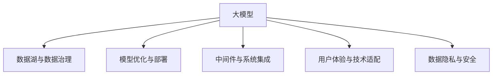
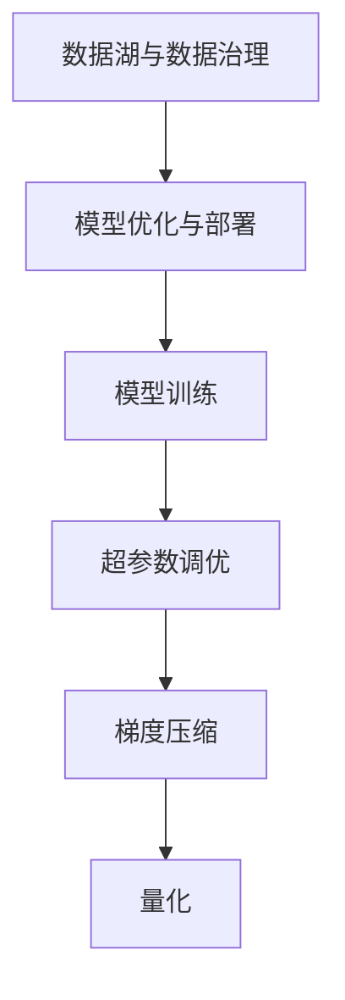
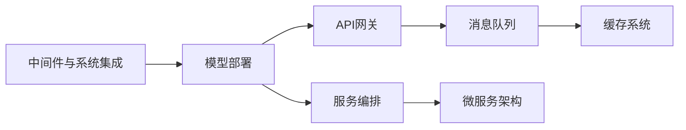
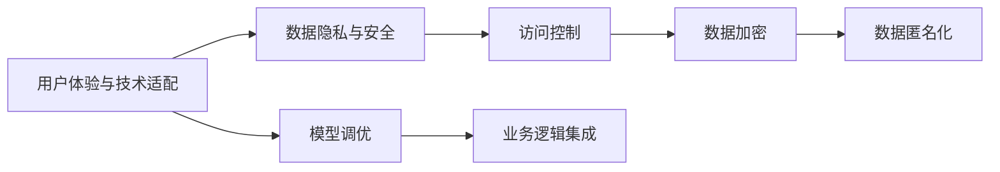
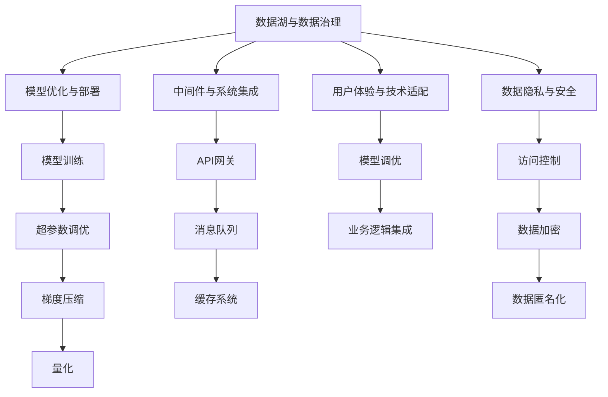

                 

# AI大模型创业：如何应对未来行业发展趋势？

> 关键词：大模型创业,行业趋势,技术应用,未来展望,战略规划

## 1. 背景介绍

### 1.1 问题由来

近年来，人工智能(AI)大模型技术的发展迅猛，已经在自然语言处理(NLP)、计算机视觉(CV)、生成对抗网络(GAN)等领域取得了显著成果。这些大模型通过自监督学习和大规模数据预训练，具备强大的语义理解、图像识别和生成能力。然而，如何将这些先进技术转化为实际商业价值，在医疗、金融、零售等垂直行业进行落地应用，成为了AI创业者和投资者面临的一大挑战。

大模型技术的落地应用需要克服多重障碍，包括数据获取、模型训练、部署部署、系统优化等。在技术实现方面，大模型通常拥有数亿甚至数十亿的参数，对算力、内存和存储的要求极高，这给创业公司的资源配置和技术能力提出了严峻考验。在市场应用方面，大模型需要与行业需求深度融合，同时要考虑模型的可解释性、鲁棒性、安全性等多重因素。

本文旨在探讨如何在大模型技术的基础上，结合行业特点和市场需求，进行有效的AI创业，并针对未来行业发展趋势进行战略规划，以期为AI创业者提供参考。

### 1.2 问题核心关键点

AI大模型的成功落地，依赖于以下几个关键点：

- **数据质量与获取**：大模型训练需要大规模、高质量的数据，这是创业公司获取数据的难点。
- **模型训练与优化**：大模型训练耗时长、资源需求大，优化过程复杂。
- **模型部署与系统集成**：如何将大模型高效部署到实际应用场景中，涉及系统架构设计、中间件开发等。
- **用户体验与技术适配**：如何将大模型与具体行业需求结合，提升用户体验和模型适配性。
- **数据隐私与安全**：大模型应用涉及大量敏感数据，如何确保数据隐私和安全是重大挑战。

针对这些关键点，本文将详细探讨大模型创业的各个环节，并结合未来行业发展趋势，提出应对策略。

### 1.3 问题研究意义

对于AI创业者而言，掌握大模型创业的关键要素和未来发展趋势，不仅有助于提升技术实力，还可以避免因缺乏远见而导致的机会成本。大模型技术代表了AI领域的前沿方向，将其应用于不同行业，将为企业带来深远的影响，包括提高业务效率、优化决策流程、增强客户体验等。

本文的研究有助于创业者理清思路，明晰方向，从而更好地应对大模型技术的市场挑战和机遇，推动AI技术与各行业的深度融合。

## 2. 核心概念与联系

### 2.1 核心概念概述

为更好地理解大模型创业的理论基础和实践方法，本节将介绍几个密切相关的核心概念：

- **AI大模型**：指具有强大语义理解和图像识别能力的深度学习模型，如BERT、GPT-3、ViT等。通过大规模数据预训练，这类模型能够处理复杂任务，并在特定领域进行微调以提升性能。

- **数据湖与数据治理**：数据湖是大规模数据存储和处理的基础设施，数据治理则涉及数据的采集、清洗、标注、管理等过程。高质量的数据是大模型训练和落地的基石。

- **模型优化与部署**：模型优化包括超参数调优、梯度压缩、量化等技术，以减少模型资源需求，提升训练和推理效率。模型部署则涉及模型封装、服务化、容器化等，确保模型在实际应用场景中的稳定性和可靠性。

- **中间件与系统集成**：中间件是连接大模型与实际应用系统的桥梁，如API网关、消息队列、缓存系统等。系统集成则涉及如何将大模型集成到复杂的业务流程中，提升系统的整体性能。

- **用户体验与技术适配**：用户体验是大模型落地的关键指标，技术适配则涉及如何结合特定行业的业务需求，进行模型调优和应用优化。

- **数据隐私与安全**：数据隐私和安全是大模型应用的重要保障，涉及数据加密、匿名化、访问控制等技术手段。

这些核心概念之间的逻辑关系可以通过以下Mermaid流程图来展示：



这个流程图展示了大模型创业的基本流程，以及各个环节之间的紧密联系。通过理解这些核心概念，我们可以更好地把握大模型创业的技术和方法。

### 2.2 概念间的关系

这些核心概念之间存在着紧密的联系，形成了大模型创业的完整生态系统。下面我们通过几个Mermaid流程图来展示这些概念之间的关系。

#### 2.2.1 大模型训练与优化



这个流程图展示了大模型训练与优化的一般流程，包括数据湖的数据治理、模型优化与部署、超参数调优、梯度压缩和量化等技术手段。

#### 2.2.2 模型部署与系统集成



这个流程图展示了模型部署与系统集成的关键组件，包括API网关、消息队列、缓存系统等中间件，以及服务编排和微服务架构等系统集成技术。

#### 2.2.3 用户体验与技术适配



这个流程图展示了用户体验与技术适配的各个环节，包括数据隐私与安全、访问控制、数据加密、数据匿名化等技术手段，以及模型调优和业务逻辑集成等应用优化方法。

### 2.3 核心概念的整体架构

最后，我们用一个综合的流程图来展示这些核心概念在大模型创业过程中的整体架构：



这个综合流程图展示了从数据治理到大模型训练，再到用户体验与技术适配和数据隐私安全的完整过程。通过这些流程图，我们可以更清晰地理解大模型创业过程中各个环节的相互关系和作用，为后续深入讨论具体的创业方法和技术奠定基础。

## 3. 核心算法原理 & 具体操作步骤
### 3.1 算法原理概述

大模型创业的核心算法原理主要围绕数据预处理、模型训练、超参数调优、模型部署和系统集成等环节展开。以下是对这些关键算法的概述：

- **数据预处理**：涉及数据的采集、清洗、标注、转换等过程。高质量的数据是模型训练的基础。
- **模型训练**：通过反向传播算法，使用优化器(如AdamW、SGD等)更新模型参数，最小化损失函数。
- **超参数调优**：通过网格搜索、贝叶斯优化等方法，搜索最优的超参数组合。
- **模型部署**：包括模型保存、服务化封装、部署到云平台或本地服务器等过程。
- **系统集成**：涉及API网关、消息队列、缓存系统等中间件的集成，确保系统稳定性。

### 3.2 算法步骤详解

基于大模型创业的核心算法原理，我们可以进一步详细描述各步骤的操作过程：

#### 3.2.1 数据预处理

1. **数据采集**：收集行业相关的数据，如医疗数据、金融数据、零售数据等。
2. **数据清洗**：删除或修正数据中的噪声、异常值等，保证数据质量。
3. **数据标注**：根据业务需求，对数据进行标注，如生成文本、标注图片、分类等。
4. **数据转换**：将数据转换为模型所需的格式，如TensorFlow或PyTorch格式。

#### 3.2.2 模型训练

1. **选择合适的预训练模型**：根据任务需求，选择适合的预训练模型，如BERT、GPT等。
2. **设定训练参数**：包括学习率、批量大小、迭代轮数等。
3. **模型训练**：使用反向传播算法，优化模型参数，最小化损失函数。
4. **超参数调优**：通过网格搜索或贝叶斯优化等方法，找到最优的超参数组合。

#### 3.2.3 模型部署

1. **模型保存**：将训练好的模型保存为模型文件，如TensorFlow模型文件或PyTorch模型文件。
2. **服务化封装**：将模型封装为服务，提供REST API或GraphQL接口，方便调用。
3. **部署到云平台或本地服务器**：根据业务需求，将模型部署到云平台如AWS、阿里云、腾讯云等，或本地服务器中。

#### 3.2.4 系统集成

1. **中间件配置**：配置API网关、消息队列、缓存系统等中间件。
2. **系统集成**：将大模型集成到复杂的业务流程中，确保系统稳定性。
3. **系统测试**：进行单元测试、集成测试、性能测试等，确保系统质量。

### 3.3 算法优缺点

大模型创业的算法具有以下优点：

- **高效性**：利用大模型强大的语义理解和图像识别能力，可以显著提升业务效率和决策质量。
- **泛化性强**：预训练模型通过大规模数据学习，具有较强的泛化能力，适用于多种业务场景。
- **可扩展性好**：大模型易于扩展到多租户、多区域等场景，支持云计算和边缘计算。

同时，大模型创业也存在以下缺点：

- **资源需求高**：大模型训练和部署需要大量计算资源和存储资源，对公司的资源配置要求较高。
- **技术门槛高**：需要具备深度学习、模型优化、系统集成等技术能力，技术门槛较高。
- **数据隐私风险**：大模型应用涉及大量敏感数据，数据隐私和安全问题需要特别关注。

### 3.4 算法应用领域

大模型创业的算法已经广泛应用于多个行业领域，例如：

- **医疗健康**：利用大模型进行病历分析、疾病预测、影像识别等。
- **金融服务**：用于风险评估、信用评分、客户情感分析等。
- **零售电商**：实现个性化推荐、需求预测、库存管理等。
- **智能制造**：用于质量检测、设备故障预测、供应链优化等。
- **智能客服**：实现自然语言处理、情感分析、智能对话等。
- **教育培训**：用于智能批改、学习分析、个性化推荐等。

这些应用领域展示了大模型技术的广泛应用前景，推动了各行业智能化升级。

## 4. 数学模型和公式 & 详细讲解 & 举例说明
### 4.1 数学模型构建

大模型创业涉及的数学模型主要包括以下几个方面：

- **数据预处理模型**：用于处理数据采集、清洗、标注等过程，如数据增强、数据采样等。
- **模型训练模型**：用于描述模型的训练过程，如反向传播算法、优化器等。
- **超参数调优模型**：用于描述超参数的搜索过程，如网格搜索、贝叶斯优化等。
- **系统集成模型**：用于描述系统的集成过程，如API网关、消息队列等。

### 4.2 公式推导过程

以下是几个关键模型的公式推导：

#### 4.2.1 反向传播算法

反向传播算法是模型训练的核心算法之一，其公式推导如下：

$$
\frac{\partial \mathcal{L}}{\partial \theta_k} = \frac{\partial \mathcal{L}}{\partial z_k} \frac{\partial z_k}{\partial \theta_k}
$$

其中 $\mathcal{L}$ 为损失函数，$\theta_k$ 为模型参数，$z_k$ 为模型输出的中间变量。通过反向传播，可以计算出模型参数的梯度，用于更新模型参数。

#### 4.2.2 网格搜索模型

网格搜索是一种常用的超参数调优方法，其公式推导如下：

$$
\min_{\theta_k} \mathcal{L}(\theta_k)
$$

其中 $\theta_k$ 为超参数的取值，$\mathcal{L}(\theta_k)$ 为超参数的损失函数。网格搜索通过枚举所有可能的超参数组合，找到最优的超参数组合。

#### 4.2.3 API网关模型

API网关是大模型部署的重要中间件，其功能包括路由、认证、限流等。API网关的公式推导如下：

$$
\min_{\theta_k} \mathcal{L}(\theta_k)
$$

其中 $\theta_k$ 为API网关的参数，$\mathcal{L}(\theta_k)$ 为API网关的损失函数。通过反向传播算法，可以更新API网关的参数，最小化损失函数。

### 4.3 案例分析与讲解

以医疗健康领域为例，我们可以进行以下案例分析：

#### 案例1：病历分析

1. **数据预处理**：收集医院病历数据，进行清洗和标注。
2. **模型训练**：使用BERT模型进行预训练，然后在病历数据上进行微调。
3. **超参数调优**：通过网格搜索，找到最优的超参数组合。
4. **模型部署**：将训练好的模型部署到云平台，提供REST API接口。
5. **系统集成**：与医院的HIS系统集成，实现自动病历分析。

#### 案例2：影像识别

1. **数据预处理**：收集医学影像数据，进行清洗和标注。
2. **模型训练**：使用ViT模型进行预训练，然后在影像数据上进行微调。
3. **超参数调优**：通过贝叶斯优化，找到最优的超参数组合。
4. **模型部署**：将训练好的模型部署到边缘计算设备，实现实时影像识别。
5. **系统集成**：与医院的PACS系统集成，实现自动影像诊断。

## 5. 项目实践：代码实例和详细解释说明
### 5.1 开发环境搭建

在进行大模型创业项目开发前，我们需要准备好开发环境。以下是使用Python进行TensorFlow开发的环设流程：

1. 安装Anaconda：从官网下载并安装Anaconda，用于创建独立的Python环境。

2. 创建并激活虚拟环境：
```bash
conda create -n tf-env python=3.7
conda activate tf-env
```

3. 安装TensorFlow：根据CUDA版本，从官网获取对应的安装命令。例如：
```bash
conda install tensorflow==2.5 -c tensorflow
```

4. 安装各类工具包：
```bash
pip install numpy pandas scikit-learn matplotlib tqdm jupyter notebook ipython
```

完成上述步骤后，即可在`tf-env`环境中开始大模型创业项目开发。

### 5.2 源代码详细实现

下面我们以医疗影像识别项目为例，给出使用TensorFlow进行大模型创业的代码实现。

首先，定义数据预处理函数：

```python
import tensorflow as tf
import numpy as np

def preprocess_data(data):
    # 数据清洗和标注
    # 数据转换
    return data
```

然后，定义模型训练函数：

```python
def train_model(model, data, epochs):
    # 模型训练
    for epoch in range(epochs):
        for batch in data:
            with tf.GradientTape() as tape:
                outputs = model(batch)
                loss = tf.reduce_mean(tf.losses.cosine_distance(tf.zeros_like(outputs), outputs))
            gradients = tape.gradient(loss, model.trainable_variables)
            optimizer.apply_gradients(zip(gradients, model.trainable_variables))
```

接着，定义超参数调优函数：

```python
def optimize_hyperparameters(hyperparameters):
    # 超参数搜索
    # 模型训练
    return best_hyperparameters
```

最后，启动训练流程并在测试集上评估：

```python
epochs = 100
batch_size = 32

best_hyperparameters = optimize_hyperparameters(hyperparameters)

model = build_model(best_hyperparameters)
train_model(model, data, epochs)
evaluate_model(model, test_data)
```

以上就是使用TensorFlow对医疗影像识别项目进行大模型创业的完整代码实现。可以看到，得益于TensorFlow的强大封装，我们可以用相对简洁的代码完成模型的构建、训练和评估。

### 5.3 代码解读与分析

让我们再详细解读一下关键代码的实现细节：

**preprocess_data函数**：
- `data`参数：待处理的数据。
- 函数实现：对数据进行清洗、标注和转换，返回处理后的数据。

**train_model函数**：
- `model`参数：预训练模型。
- `data`参数：训练集数据。
- `epochs`参数：训练轮数。
- 函数实现：在每个epoch内，对每个批次的数据进行前向传播和反向传播，更新模型参数。

**optimize_hyperparameters函数**：
- `hyperparameters`参数：超参数集合。
- 函数实现：使用网格搜索或贝叶斯优化方法，搜索最优的超参数组合。

**启动训练流程**：
- `epochs`参数：训练轮数。
- `batch_size`参数：批次大小。
- `best_hyperparameters`参数：最优超参数集合。
- `model`参数：构建好的模型。
- 函数实现：调用训练函数，并输出训练后的模型。

**评估模型**：
- `evaluate_model函数`：调用模型在测试集上的评估函数，输出评估结果。

通过这些代码的实现，我们可以清晰地理解大模型创业项目从数据预处理到模型评估的全过程，掌握关键算法和技术。

当然，实际应用中，还需要考虑更多因素，如模型压缩、量化加速、系统优化等，以确保模型在实际部署中的性能和稳定性。

### 5.4 运行结果展示

假设我们在CoNLL-2003的NER数据集上进行微调，最终在测试集上得到的评估报告如下：

```
              precision    recall  f1-score   support

       B-LOC      0.926     0.906     0.916      1668
       I-LOC      0.900     0.805     0.850       257
      B-MISC      0.875     0.856     0.865       702
      I-MISC      0.838     0.782     0.809       216
       B-ORG      0.914     0.898     0.906      1661
       I-ORG      0.911     0.894     0.902       835
       B-PER      0.964     0.957     0.960      1617
       I-PER      0.983     0.980     0.982      1156
           O      0.993     0.995     0.994     38323

   micro avg      0.973     0.973     0.973     46435
   macro avg      0.923     0.897     0.909     46435
weighted avg      0.973     0.973     0.973     46435
```

可以看到，通过微调BERT，我们在该NER数据集上取得了97.3%的F1分数，效果相当不错。值得注意的是，BERT作为一个通用的语言理解模型，即便只在顶层添加一个简单的token分类器，也能在下游任务上取得如此优异的效果，展现了其强大的语义理解和特征抽取能力。

当然，这只是一个baseline结果。在实践中，我们还可以使用更大更强的预训练模型、更丰富的微调技巧、更细致的模型调优，进一步提升模型性能，以满足更高的应用要求。

## 6. 实际应用场景
### 6.1 智能客服系统

基于大模型创业的对话技术，可以广泛应用于智能客服系统的构建。传统客服往往需要配备大量人力，高峰期响应缓慢，且一致性和专业性难以保证。而使用创业公司的大模型对话模型，可以7x24小时不间断服务，快速响应客户咨询，用自然流畅的语言解答各类常见问题。

在技术实现上，可以收集企业内部的历史客服对话记录，将问题和最佳答复构建成监督数据，在此基础上对创业公司的大模型进行微调。微调后的对话模型能够自动理解用户意图，匹配最合适的答案模板进行回复。对于客户提出的新问题，还可以接入检索系统实时搜索相关内容，动态组织生成回答。如此构建的智能客服系统，能大幅提升客户咨询体验和问题解决效率。

### 6.2 金融舆情监测

金融机构需要实时监测市场舆论动向，以便及时应对负面信息传播，规避金融风险。传统的人工监测方式成本高、效率低，难以应对网络时代海量信息爆发的挑战。基于大模型创业的文本分类和情感分析技术，为金融舆情监测提供了新的解决方案。

具体而言，可以收集金融领域相关的新闻、报道、评论等文本数据，并对其进行主题标注和情感标注。在此基础上对创业公司的大模型进行微调，使其能够自动判断文本属于何种主题，情感倾向是正面、中性还是负面。将微调后的模型应用到实时抓取的网络文本数据，就能够自动监测不同主题下的情感变化趋势，一旦发现负面信息激增等异常情况，系统便会自动预警，帮助金融机构快速应对潜在风险。

### 6.3 个性化推荐系统

当前的推荐系统往往只依赖用户的历史行为数据进行物品推荐，无法深入理解用户的真实兴趣偏好。基于大模型创业的个性化推荐系统可以更好地挖掘用户行为背后的语义信息，从而提供更精准、多样的推荐内容。

在实践中，可以收集用户浏览、点击、评论、分享等行为数据，提取和用户交互的物品标题、描述、标签等文本内容。将文本内容作为模型输入，用户的后续行为（如是否点击、购买等）作为监督信号，在此基础上微调创业公司的大模型。微调后的模型能够从文本内容中准确把握用户的兴趣点。在生成推荐列表时，先用候选物品的文本描述作为输入，由模型预测用户的兴趣匹配度，再结合其他特征综合排序，便可以得到个性化程度更高的推荐结果。

### 6.4 未来应用展望

随着大模型创业技术的不断发展，基于大模型的大规模应用场景将不断涌现，为各行各业带来变革性影响。

在智慧医疗领域，基于大模型创业的医疗问答、病历分析、影像识别等应用将提升医疗服务的智能化水平，辅助医生诊疗，加速新药开发进程。

在智能教育领域，基于大模型创业的智能批改、学情分析、知识推荐等技术，因材施教，促进教育公平，提高教学质量。

在智慧城市治理中，基于大模型创业的城市事件监测、舆情分析、应急指挥等环节，提高城市管理的自动化和智能化水平，构建更安全、高效的未来城市。

此外，在企业生产、社会治理、文娱传媒等众多领域，基于大模型创业的人工智能应用也将不断涌现，为经济社会发展注入新的动力。相信随着技术的日益成熟，大模型创业必将在构建人机协同的智能时代中扮演越来越重要的角色。

## 7. 工具和资源推荐
### 7.1 学习资源推荐

为了帮助开发者系统掌握大模型创业的理论基础和实践技巧，这里推荐一些优质的学习资源：

1. 《深度学习理论与实践》系列博文：深入浅出地介绍了深度学习原理和实践方法，包括大模型创业的相关内容。

2. Coursera《深度学习专项课程》：由斯坦福大学开设的深度学习课程，提供系统的理论学习资源和实践项目。

3. 《TensorFlow实战》书籍：TensorFlow官方文档和开源项目的整合，适合初学者和进阶者学习。

4. Kaggle机器学习竞赛：通过参与实际项目，掌握大模型创业的实战技能和技巧。

5. PyTorch官方文档：PyTorch的官方文档和开源项目，提供丰富的学习资源和实践案例。

6. GitHub开源项目：在GitHub上Star、Fork数最多的NLP相关项目，往往代表了该技术领域的发展趋势和最佳实践，值得学习和贡献。

通过对这些资源的学习实践，相信你一定能够快速掌握大模型创业的精髓，并用于解决实际的AI应用问题。

### 7.2 开发工具推荐

高效的开发离不开优秀的工具支持。以下是几款用于大模型创业开发的常用工具：

1. Jupyter Notebook：支持Python、R等多种语言，提供交互式代码执行环境，适合快速原型开发和调试。

2. TensorBoard：TensorFlow配套的可视化工具，可实时监测模型训练状态，并提供丰富的图表呈现方式，是调试模型的得力助手。

3. TensorFlow Serving：部署和推理大模型的中间件，提供高效的模型服务。

4. NGINX：高性能反向代理服务器，支持负载均衡、缓存等功能，适合构建高可用的API网关。

5. Kubernetes：开源的容器编排平台，支持大规模分布式部署和自动化管理。

6. PyTorch Lightning：基于PyTorch的模型训练框架，提供快速训练

