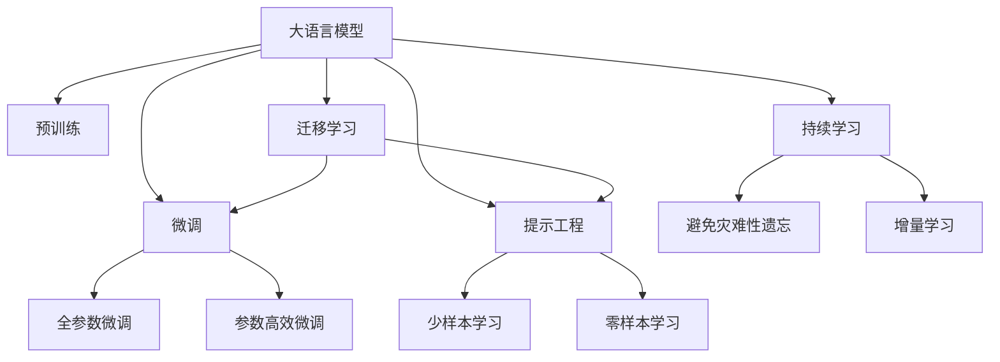
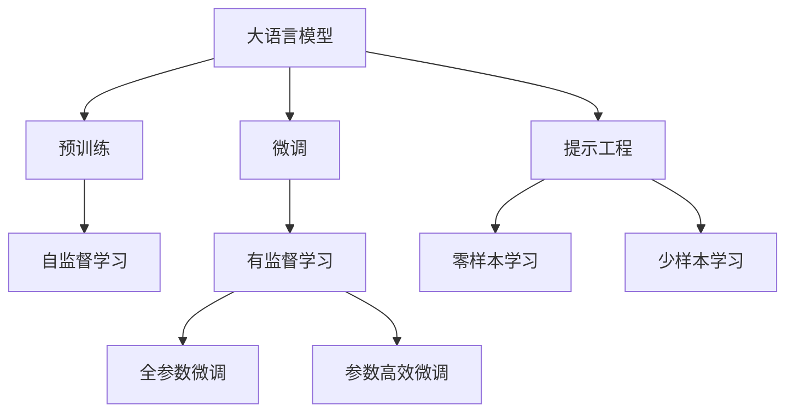
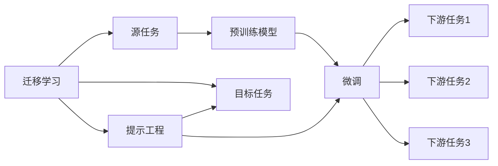
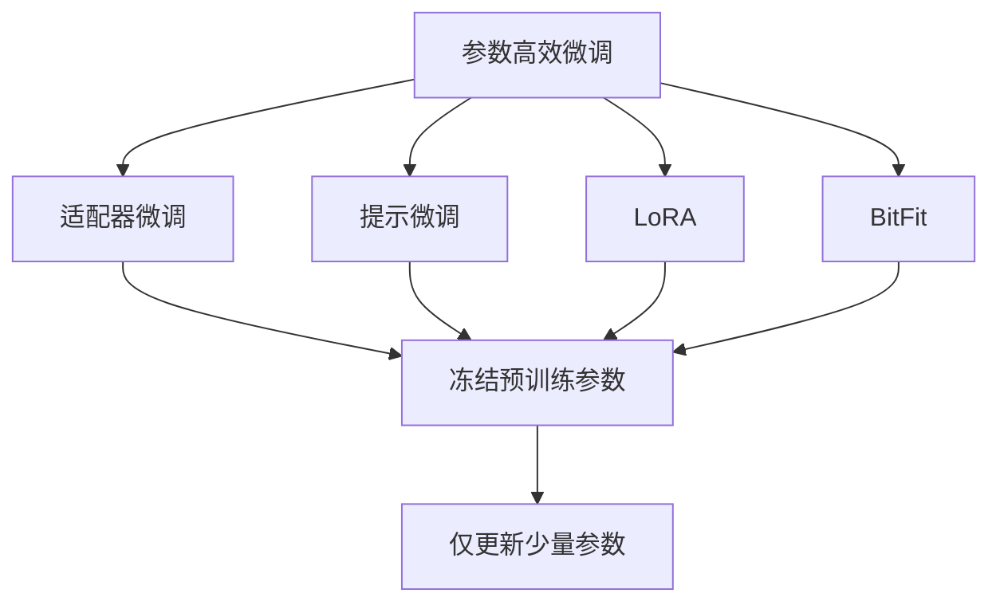
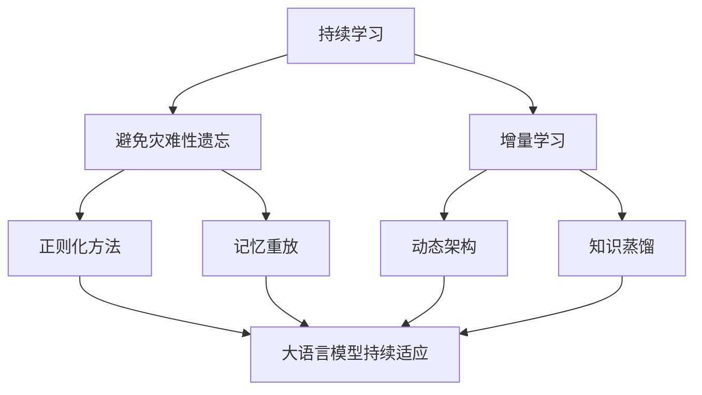
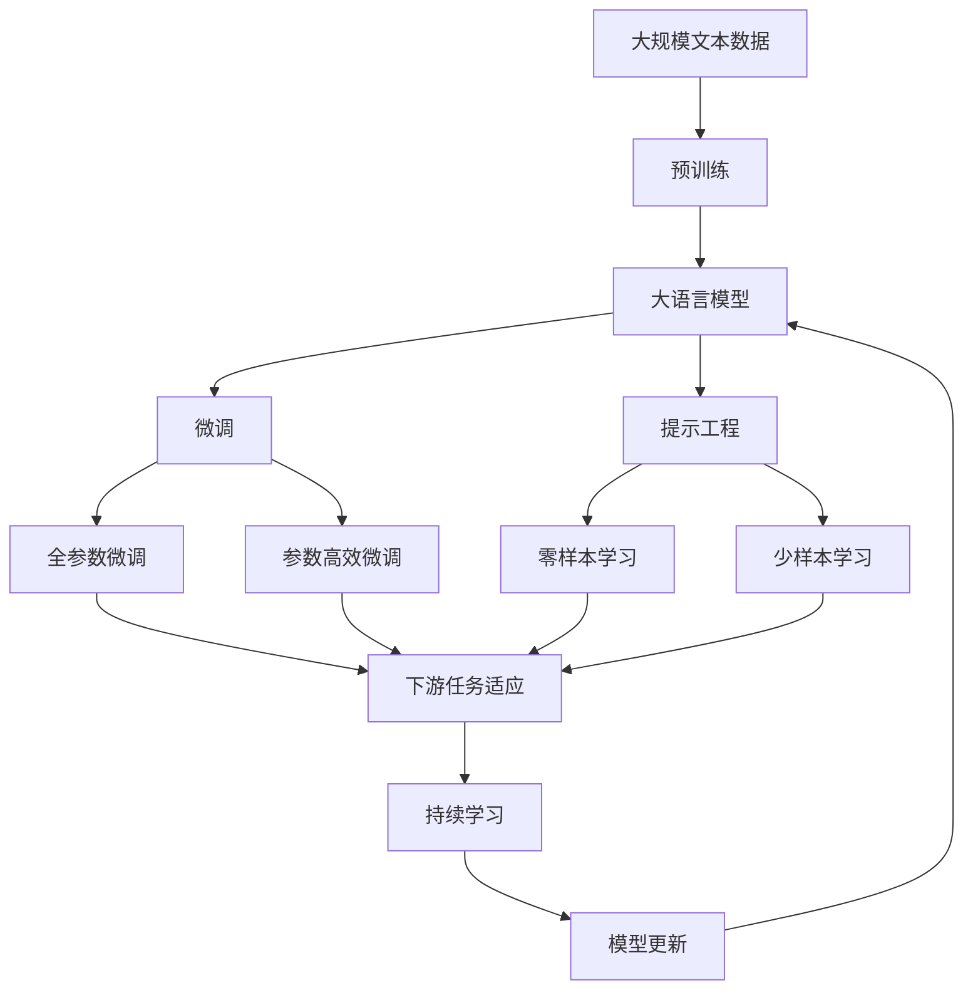

                 

# AI工程学：大模型应用开发实战：提示工程

> 关键词：大语言模型,提示工程,预训练,微调,自然语言处理(NLP),Transformer,BERT,预训练-微调

## 1. 背景介绍

### 1.1 问题由来
近年来，深度学习技术的飞速发展，特别是在自然语言处理(NLP)领域的突破性进展，使得大规模预训练语言模型成为研究热点。这些模型通过在无标签大规模文本数据上进行自监督预训练，学习到了丰富的语言知识和常识。但这些模型通常需要在特定任务上进行微调，以获得更好的性能，而提示工程（Prompt Engineering）则是在微调过程中非常重要的一环。

### 1.2 问题核心关键点
提示工程（Prompt Engineering）是指通过精心设计输入文本的格式，引导预训练模型按期望方式输出，减少微调参数，提高模型在特定任务上的表现。其核心思想在于如何构建有效的提示（Prompt），使得模型能够更准确、更高效地理解和生成文本。

提示工程在大规模预训练模型微调中的应用，可以大幅降低微调对标注数据的依赖，提升模型的泛化能力和性能，同时保持模型的灵活性和可扩展性。提示工程涉及多个关键问题，如提示的设计、优化、评估等，是微调过程中不可或缺的一部分。

### 1.3 问题研究意义
提示工程作为大模型微调的重要组成部分，对提升模型的应用效果、降低开发成本、加速模型部署等方面具有重要意义：

1. 降低开发成本。提示工程能够有效利用预训练模型，减少从头开发所需的数据、计算和人力等成本投入。
2. 提升模型效果。通过精心设计提示，可以显著提高模型在特定任务上的表现。
3. 加速模型部署。提示工程使得开发者可以更快地完成任务适配，缩短开发周期。
4. 带来技术创新。提示工程促进了对预训练-微调的深入研究，催生了零样本学习和少样本学习等新的研究方向。
5. 赋能产业升级。提示工程使得NLP技术更容易被各行各业所采用，为传统行业数字化转型升级提供新的技术路径。

## 2. 核心概念与联系

### 2.1 核心概念概述

为更好地理解提示工程在大模型微调中的应用，本节将介绍几个密切相关的核心概念：

- 大语言模型(Large Language Model, LLM)：以自回归(如GPT)或自编码(如BERT)模型为代表的大规模预训练语言模型。通过在大规模无标签文本语料上进行预训练，学习通用的语言表示，具备强大的语言理解和生成能力。

- 预训练(Pre-training)：指在大规模无标签文本语料上，通过自监督学习任务训练通用语言模型的过程。常见的预训练任务包括言语建模、遮挡语言模型等。

- 微调(Fine-tuning)：指在预训练模型的基础上，使用下游任务的少量标注数据，通过有监督地训练来优化模型在该任务上的性能。通常只需要调整顶层分类器或解码器，并以较小的学习率更新全部或部分的模型参数。

- 提示工程(Prompt Engineering)：通过在输入文本中添加提示模板(Prompt Template)，引导大语言模型进行特定任务的推理和生成。可以在不更新模型参数的情况下，实现零样本或少样本学习。

- 少样本学习(Few-shot Learning)：指在只有少量标注样本的情况下，模型能够快速适应新任务的学习方法。在大语言模型中，通常通过在输入中提供少量示例来实现，无需更新模型参数。

- 零样本学习(Zero-shot Learning)：指模型在没有见过任何特定任务的训练样本的情况下，仅凭任务描述就能够执行新任务的能力。大语言模型通过预训练获得的广泛知识，使其能够理解任务指令并生成相应输出。

- 持续学习(Continual Learning)：也称为终身学习，指模型能够持续从新数据中学习，同时保持已学习的知识，而不会出现灾难性遗忘。这对于保持大语言模型的时效性和适应性至关重要。

这些核心概念之间的逻辑关系可以通过以下Mermaid流程图来展示：



这个流程图展示了大语言模型的核心概念及其之间的关系：

1. 大语言模型通过预训练获得基础能力。
2. 微调是对预训练模型进行任务特定的优化，可以分为全参数微调和参数高效微调（PEFT）。
3. 提示工程是一种不更新模型参数的方法，可以实现少样本学习和零样本学习。
4. 迁移学习是连接预训练模型与下游任务的桥梁，可以通过微调或提示工程来实现。
5. 持续学习旨在使模型能够不断学习新知识，同时避免遗忘旧知识。

这些核心概念共同构成了大语言模型的学习和应用框架，使其能够在各种场景下发挥强大的语言理解和生成能力。通过理解这些核心概念，我们可以更好地把握大语言模型的工作原理和优化方向。

### 2.2 概念间的关系

这些核心概念之间存在着紧密的联系，形成了大语言模型微调的完整生态系统。下面我通过几个Mermaid流程图来展示这些概念之间的关系。

#### 2.2.1 大语言模型的学习范式



这个流程图展示了大语言模型的三种主要学习范式：预训练、微调和提示工程。预训练主要采用自监督学习方法，而微调则是有监督学习的过程。提示工程可以实现零样本和少样本学习，可以在不更新模型参数的情况下，实现微调。

#### 2.2.2 迁移学习与提示工程的关系



这个流程图展示了迁移学习的基本原理，以及它与提示工程的关系。迁移学习涉及源任务和目标任务，预训练模型在源任务上学习，然后通过微调适应各种下游任务（目标任务）。提示工程可以辅助微调过程，实现零样本和少样本学习。

#### 2.2.3 参数高效微调方法



这个流程图展示了几种常见的参数高效微调方法，包括适配器微调、提示微调、LoRA和BitFit。这些方法的共同特点是冻结大部分预训练参数，只更新少量参数，从而提高微调效率。

#### 2.2.4 持续学习在大语言模型中的应用



这个流程图展示了持续学习在大语言模型中的应用。持续学习的主要目标是避免灾难性遗忘和实现增量学习。通过正则化方法、记忆重放、动态架构和知识蒸馏等技术，可以使大语言模型持续适应新的任务和数据。

### 2.3 核心概念的整体架构

最后，我们用一个综合的流程图来展示这些核心概念在大语言模型微调过程中的整体架构：



这个综合流程图展示了从预训练到微调，再到持续学习的完整过程。大语言模型首先在大规模文本数据上进行预训练，然后通过微调（包括全参数微调和参数高效微调）或提示工程（包括零样本和少样本学习）来适应下游任务。最后，通过持续学习技术，模型可以不断更新和适应新的任务和数据。 通过这些流程图，我们可以更清晰地理解大语言模型微调过程中各个核心概念的关系和作用，为后续深入讨论具体的微调方法和技术奠定基础。

## 3. 核心算法原理 & 具体操作步骤
### 3.1 算法原理概述

提示工程作为大语言模型微调的一部分，其实质是一种基于输入文本的优化技术，通过精心设计的提示（Prompt）引导模型输出，从而在特定任务上获得更好的表现。其核心思想在于如何通过提示模板（Prompt Template），将通用语言知识转化为特定任务的知识，使模型在无需微调的情况下，也能实现对新任务的适应。

形式化地，假设预训练模型为 $M_{\theta}$，其中 $\theta$ 为预训练得到的模型参数。给定下游任务 $T$ 的少量标注数据集 $D=\{(x_i, y_i)\}_{i=1}^N$，其中 $x_i$ 为输入文本，$y_i$ 为任务标签。提示工程的目标是找到最优的提示模板 $P$，使得模型在 $P$ 引导下的输出 $M_{\theta}(P(x_i))$ 尽可能接近 $y_i$。

数学上，可以将提示工程问题转化为优化问题：

$$
\min_{P} \mathcal{L}(P, D) = \frac{1}{N} \sum_{i=1}^N \ell(M_{\theta}(P(x_i)), y_i)
$$

其中，$\ell$ 为损失函数，衡量模型输出与真实标签之间的差异。常见的损失函数包括交叉熵损失、均方误差损失等。

通过优化上述损失函数，可以找到最优的提示模板 $P$，使得模型在 $P$ 的引导下，在特定任务上表现更好。需要注意的是，提示工程的优化目标是固定的预训练模型 $M_{\theta}$，而不涉及模型参数的微调。

### 3.2 算法步骤详解

提示工程的实现步骤主要包括：

1. 收集任务数据：收集特定任务的少量标注数据，作为微调的基础。
2. 设计提示模板：根据任务特点，设计有效的提示模板，引导模型输出。
3. 提示工程优化：使用优化算法（如梯度下降），寻找最优的提示模板 $P$，使得模型在 $P$ 的引导下，在特定任务上表现更好。
4. 测试和部署：在测试集上评估提示工程的效果，并在实际应用中集成到模型中。

以下是具体的优化步骤：

- **提示模板设计**：
    - 定义输入文本的格式，通常包括标题、段落、标签等信息。
    - 设计输出格式，如分类任务的"yes/no"格式，生成任务的"start-of-sentence"标记等。
    - 参考前人经验和领域知识，设计提示模板。

- **优化算法**：
    - 选择优化算法（如Adam、SGD等）及其超参数。
    - 设置学习率、迭代次数等优化参数。
    - 使用梯度下降等优化算法，最小化损失函数 $\mathcal{L}(P, D)$，找到最优的提示模板 $P$。

- **测试和部署**：
    - 在验证集上评估提示模板 $P$ 的效果。
    - 将提示模板 $P$ 集成到模型中，在新的输入文本上输出结果。
    - 持续收集新数据，定期更新提示模板，保持模型性能。

### 3.3 算法优缺点

提示工程具有以下优点：

1. 减少微调成本：提示工程可以显著减少微调对标注数据的依赖，降低微调成本。
2. 提升模型泛化能力：通过精心设计的提示，可以提升模型在不同任务上的泛化能力。
3. 灵活性强：提示模板可以灵活调整，适应不同任务的特点。
4. 适应性广：提示工程可以应用于各种NLP任务，包括分类、匹配、生成等。

同时，提示工程也存在一些局限性：

1. 设计复杂：提示模板的设计需要一定的经验和技巧，设计不当可能导致效果不佳。
2. 优化困难：提示工程的优化过程可能涉及复杂的超参数调整，需要丰富的试验和调试。
3. 效果依赖于数据：提示模板的设计和优化效果高度依赖于任务数据的质量和数量。
4. 模型依赖性高：提示工程的效果高度依赖于预训练模型的质量和参数设置。

尽管存在这些局限性，提示工程作为一种高效、灵活的微调方法，在大语言模型中的应用前景广阔，值得进一步研究和探索。

### 3.4 算法应用领域

提示工程在大语言模型的应用中，已广泛应用于多种NLP任务，例如：

- 文本分类：如情感分析、主题分类、意图识别等。通过设计合适的提示模板，可以使模型在分类任务上表现更好。
- 命名实体识别：识别文本中的人名、地名、机构名等特定实体。通过设计包含实体边界和类型的提示模板，可以使模型更准确地识别实体。
- 关系抽取：从文本中抽取实体之间的语义关系。通过设计包含关系类型和实体边界的信息提示模板，可以使模型更好地抽取关系。
- 问答系统：对自然语言问题给出答案。通过设计包含问题模板的提示模板，可以使模型更准确地回答问题。
- 机器翻译：将源语言文本翻译成目标语言。通过设计包含翻译方向和目标语言的提示模板，可以使模型更准确地翻译文本。
- 文本摘要：将长文本压缩成简短摘要。通过设计包含摘要格式和长度限制的提示模板，可以使模型生成更合适的摘要。
- 对话系统：使机器能够与人自然对话。通过设计包含对话历史和上下文提示模板，可以使模型生成更自然的对话回复。

除了上述这些经典任务外，提示工程也被创新性地应用到更多场景中，如可控文本生成、常识推理、代码生成、数据增强等，为NLP技术带来了全新的突破。

## 4. 数学模型和公式 & 详细讲解  
### 4.1 数学模型构建

本节将使用数学语言对提示工程在大语言模型微调过程中的优化目标和实现方法进行更加严格的刻画。

记预训练语言模型为 $M_{\theta}$，其中 $\theta$ 为预训练得到的模型参数。假设微调任务的训练集为 $D=\{(x_i, y_i)\}_{i=1}^N$，其中 $x_i$ 为输入文本，$y_i$ 为任务标签。

定义模型 $M_{\theta}$ 在输入文本 $x_i$ 上，使用提示模板 $P$ 引导下的输出为 $\hat{y}=M_{\theta}(P(x_i))$。提示工程的优化目标是最小化损失函数：

$$
\mathcal{L}(P, D) = \frac{1}{N} \sum_{i=1}^N \ell(M_{\theta}(P(x_i)), y_i)
$$

其中，$\ell$ 为损失函数，衡量模型输出与真实标签之间的差异。常见的损失函数包括交叉熵损失、均方误差损失等。

在优化过程中，我们通常使用基于梯度的优化算法（如Adam、SGD等）来最小化损失函数 $\mathcal{L}(P, D)$，找到最优的提示模板 $P$。

### 4.2 公式推导过程

以下我们以二分类任务为例，推导提示工程的优化目标和梯度计算公式。

假设模型 $M_{\theta}$ 在输入 $x$ 上的输出为 $\hat{y}=M_{\theta}(x) \in [0,1]$，表示样本属于正类的概率。真实标签 $y \in \{0,1\}$。

定义模型 $M_{\theta}$ 在输入文本 $x_i$ 上，使用提示模板 $P$ 引导下的输出为 $\hat{y}=M_{\theta}(P(x_i))$。则二分类交叉熵损失函数定义为：

$$
\ell(M_{\theta}(P(x_i)), y_i) = -[y_i\log \hat{y} + (1-y_i)\log (1-\hat{y})]
$$

将其代入损失函数公式，得：

$$
\mathcal{L}(P, D) = -\frac{1}{N}\sum_{i=1}^N [y_i\log M_{\theta}(P(x_i))+ (1-y_i)\log(1-M_{\theta}(P(x_i)))
$$

在优化过程中，使用梯度下降等优化算法，最小化损失函数 $\mathcal{L}(P, D)$，找到最优的提示模板 $P$。

假设提示模板 $P$ 中包含 $k$ 个提示子序列，则有 $P=(p_1, p_2, ..., p_k)$。优化目标可以写为：

$$
\min_{P} \mathcal{L}(P, D) = \frac{1}{N} \sum_{i=1}^N \sum_{j=1}^k \ell(M_{\theta}(P(x_i)), y_i)
$$

根据链式法则，损失函数对提示模板 $P$ 的梯度为：

$$
\frac{\partial \mathcal{L}(P, D)}{\partial P} = \frac{1}{N} \sum_{i=1}^N \sum_{j=1}^k \frac{\partial \ell(M_{\theta}(P(x_i)), y_i)}{\partial \theta_k}
$$

其中 $\theta_k$ 为提示模板 $P$ 中第 $k$ 个提示子序列的参数。

在得到损失函数的梯度后，即可带入优化算法，完成提示工程的优化过程。

### 4.3 案例分析与讲解

假设我们要在情感分析任务上进行提示工程，设计一个包含情感描述的提示模板 $P$。以下是具体的步骤：

1. 收集情感分析任务的数据集，包含情感描述和分类标签。
2. 设计提示模板 $P$，包含情感描述，如“请描述您的情绪”。
3. 使用优化算法（如Adam），最小化损失函数 $\mathcal{L}(P, D)$，找到最优的提示模板 $P$。
4. 在测试集上评估提示模板 $P$ 的效果，验证提示工程的效果。

以下是具体的代码实现：

```python
import transformers
import torch
import numpy as np

# 加载模型
model = transformers.BertModel.from_pretrained('bert-base-cased')

# 定义提示模板
prompt = "请描述您的情绪："

# 加载数据集
train_dataset = transformers.TextDataset(train_data, tokenizer=transformers.BertTokenizer.from_pretrained('bert-base-cased'), 
                                       label_ids=train_labels)

# 定义优化器
optimizer = torch.optim.Adam(model.parameters(), lr=0.001)

# 定义提示工程优化过程
for epoch in range(10):
    for i in range(len(train_dataset)):
        inputs = train_dataset[i]['input_ids']
        labels = train_dataset[i]['label_ids']
        
        # 定义提示模板
        inputs = torch.tensor([inputs[0] + ' ' + prompt], dtype=torch.long).unsqueeze(0)
        
        # 前向传播
        outputs = model(inputs)
        
        # 计算损失
        loss = torch.nn.functional.cross_entropy(outputs.logits, labels)
        
        # 反向传播
        optimizer.zero_grad()
        loss.backward()
        optimizer.step()
        
    # 在验证集上评估提示模板
    eval_dataset = transformers.TextDataset(eval_data, tokenizer=transformers.BertTokenizer.from_pretrained('bert-base-cased'), 
                                         label_ids=eval_labels)
    eval_loss = 0
    eval_correct = 0
    for i in range(len(eval_dataset)):
        inputs = eval_dataset[i]['input_ids']
        labels = eval_dataset[i]['label_ids']
        
        # 定义提示模板
        inputs = torch.tensor([inputs[0] + ' ' + prompt], dtype=torch.long).unsqueeze(0)
        
        # 前向传播
        outputs = model(inputs)
        
        # 计算损失
        loss = torch.nn.functional.cross_entropy(outputs.logits, labels)
        eval_loss += loss.item()
        
        # 计算正确率
        pred_labels = torch.argmax(outputs.logits, dim=1)
        eval_correct += (pred_labels == labels).sum().item()
    
    print(f"Epoch {epoch+1}, eval loss: {eval_loss/len(eval_dataset)}, eval acc: {eval_correct/len(eval_dataset)}")
```

以上代码实现了在情感分析任务上进行提示工程优化，通过引入提示模板，使模型在特定的提示下，能够更好地理解和生成情感描述，从而提升情感分析的效果。

## 5. 项目实践：代码实例和详细解释说明
### 5.1 开发环境搭建

在进行提示工程实践前，我们需要准备好开发环境。以下是使用Python进行PyTorch开发的环境配置流程：

1. 安装Anaconda：从官网下载并安装Anaconda，用于创建独立的Python环境。

2. 创建并激活虚拟环境：
```bash
conda create -n pytorch-env python=3.8 
conda activate pytorch-env
```

3. 安装PyTorch：根据CUDA版本，从官网获取对应的安装命令。例如：
```bash
conda install pytorch torchvision torchaudio cudatoolkit=11.1 -c pytorch -c conda-forge
```

4. 安装Transformers库：
```bash
pip install transformers
```

5. 安装各类工具包：
```bash
pip install numpy pandas scikit-learn matplotlib tqdm jupyter notebook ipython
```

完成上述步骤后，即可在`pytorch-env`环境中开始提示工程的实践。

### 5.2 源代码详细实现

这里我们以命名实体识别(NER)任务为例，给出使用Transformers库对BERT模型进行提示工程的PyTorch代码实现。

首先，定义NER任务的数据处理函数：

```python
from transformers import BertTokenizer
from torch.utils.data import Dataset
import torch

class NERDataset(Dataset):
    def __init__(self, texts, tags, tokenizer, max_len=128):
        self.texts = texts
        self.tags = tags
        self.tokenizer = tokenizer
        self.max_len = max_len
        
    def __len__(self):
        return len(self.texts)
    
    def __getitem__(self, item):
        text = self.texts[item]
        tags = self.tags[item]
        
        encoding = self.tokenizer(text, return_tensors='pt', max_length=self.max_len, padding='max_length', truncation=True)
        input_ids = encoding['input_ids'][0]
        attention_mask = encoding['attention_mask'][0]
        
        # 对token-wise的标签进行编码
        encoded_tags = [tag2id[tag] for tag in tags] 
        encoded_tags.extend([tag2id['O']] * (self.max_len - len(encoded_tags)))
        labels = torch.tensor(encoded_tags, dtype=torch.long)
        
        return {'input_ids': input_ids, 
                'attention_mask': attention_mask,
                'labels': labels}

# 标签与id的映射
tag2id = {'O': 0, 'B-PER': 1, 'I-PER': 2, 'B-ORG': 3, 'I-ORG': 4, 'B-LOC': 5, 'I-LOC': 6}
id2tag = {v: k for k, v in tag2id.items()}

# 创建dataset
tokenizer = BertTokenizer.from_pretrained('bert-base-cased')

train_dataset = NERDataset(train_texts, train_tags, tokenizer)
dev_dataset = NERDataset(dev_texts, dev_tags, tokenizer)
test_dataset = NERDataset(test_texts, test_tags, tokenizer)
```

然后，定义模型和优化器：

```python
from transformers import BertForTokenClassification, AdamW

model = BertForTokenClassification.from_pretrained('bert-base-cased', num_labels=len(tag2id))

optimizer = AdamW(model.parameters(), lr=2e-5)
```

接着，定义训练和评估函数：

```python
from torch.utils.data import DataLoader
from tqdm import tqdm
from sklearn.metrics import classification_report

device = torch.device('cuda') if torch.cuda.is_available() else torch.device('cpu')
model.to(device)

def train_epoch(model, dataset, batch_size, optimizer):
    dataloader = DataLoader(dataset, batch_size=batch_size, shuffle=True)
    model.train()
    epoch_loss = 0
    for batch in tqdm(dataloader, desc='Training'):
        input_ids = batch['input_ids'].to(device)
        attention_mask = batch['attention_mask'].to(device)
        labels = batch['labels'].to(device)
        model.zero_grad()
        outputs = model(input_ids, attention_mask=attention_mask

