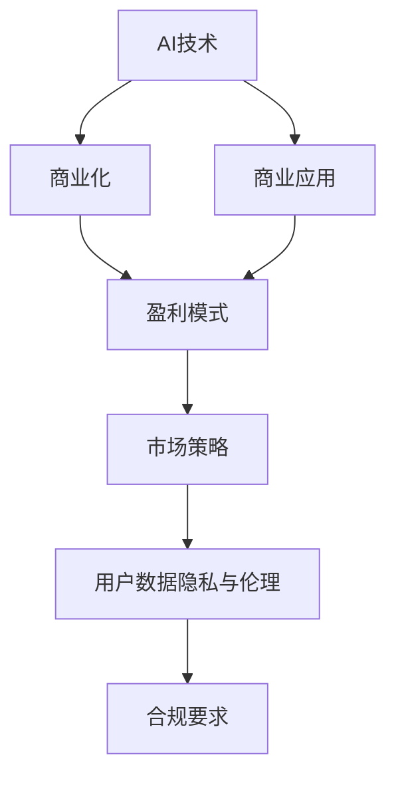
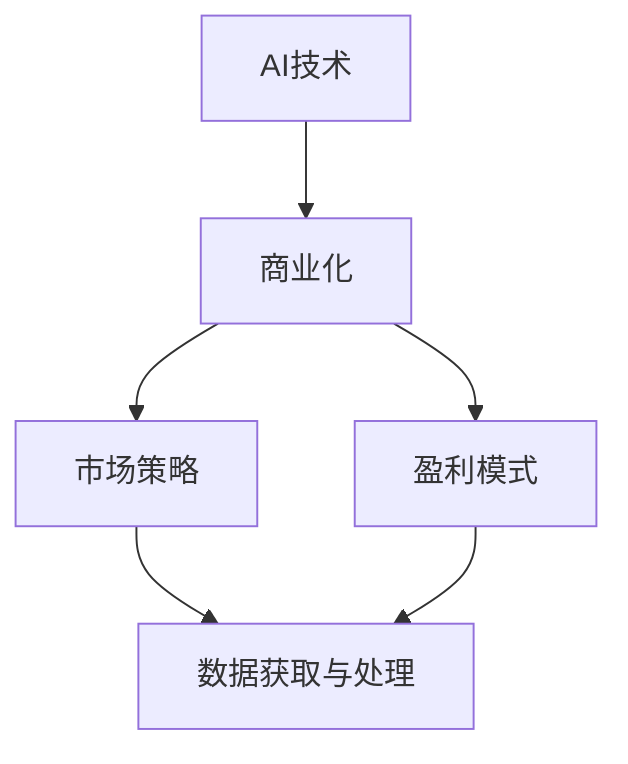
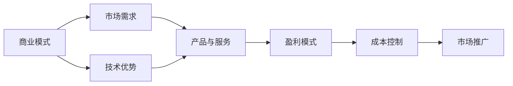
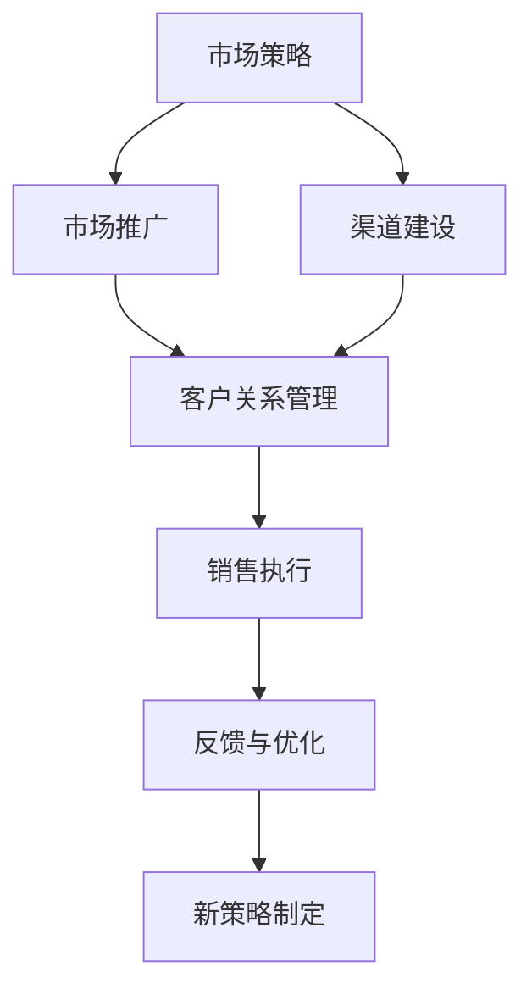
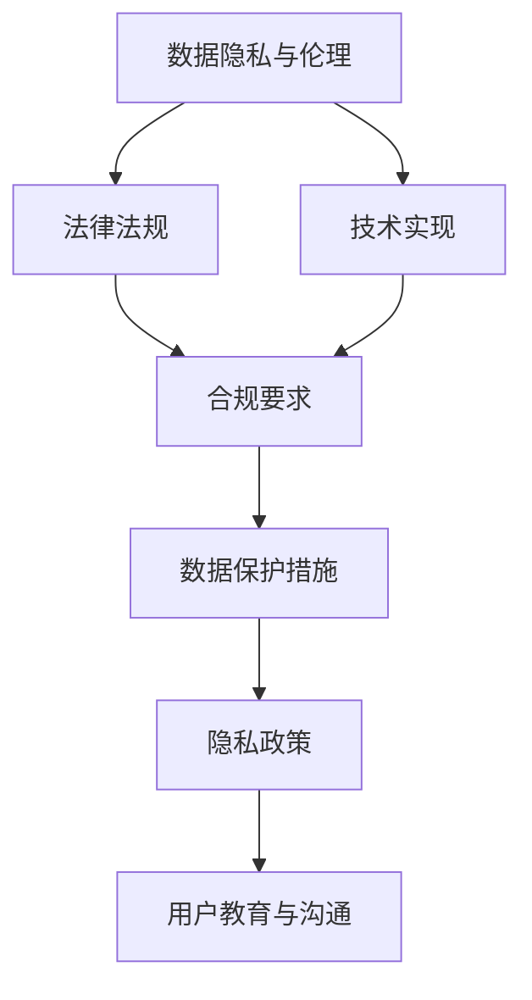
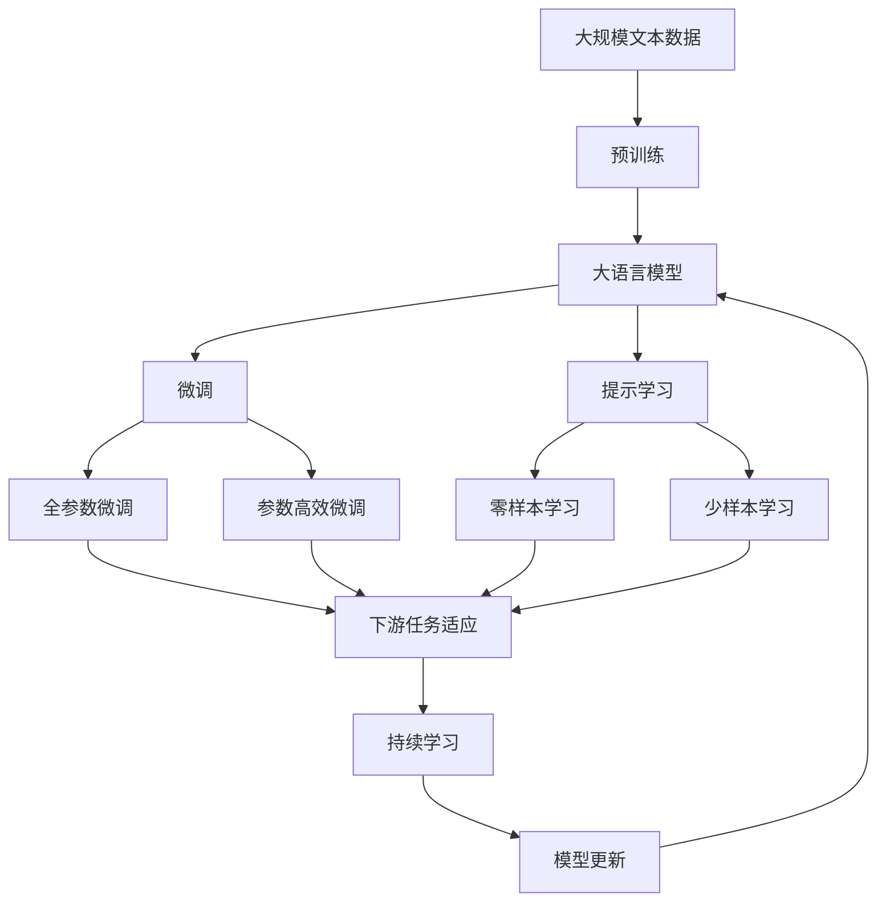

                 

# AI技术与商业模式的结合

> 关键词：AI技术, 商业化, 产业转型, 商业模式, 创新驱动

## 1. 背景介绍

随着人工智能技术的飞速发展，AI技术已经成为推动产业升级和商业创新的重要引擎。AI技术的应用覆盖了从金融、医疗、制造到零售、教育、娱乐等各个领域，深刻改变了企业的运营模式和市场格局。然而，如何最大化AI技术的商业价值，将技术优势转化为商业成功，依然是摆在企业家和技术开发者面前的重大挑战。

### 1.1 问题由来

在AI技术日益成熟和普及的背景下，商业化路径、盈利模式、市场策略等诸多方面，都发生了深刻的变化。传统行业和新兴产业都在探索如何借助AI技术实现商业升级。然而，AI技术的复杂性和多样性，以及商业环境的动态变化，使得这一过程充满挑战。

首先，AI技术本身的技术复杂性高，算法和模型构建难度大，需要庞大的数据和计算资源支持。如何将这些技术优势转化为具体的商业价值，是一个关键问题。

其次，AI技术的商业应用场景复杂多样，需要结合具体行业的业务逻辑、数据特征和用户需求，进行深度定制化开发。如何构建适合不同行业的AI技术应用，是一个需要深入研究的课题。

第三，AI技术的商业应用往往涉及数据隐私、伦理道德、合规性等多个维度。如何在保证用户隐私和安全的前提下，进行数据获取和处理，是一个需要系统性解决方案的问题。

最后，AI技术的商业化过程中，需要构建一套有效的盈利模式和运营策略，以实现自我造血和可持续发展。如何将技术优势转化为稳定的商业回报，是AI技术应用的关键。

### 1.2 问题核心关键点

为解决上述问题，本节将围绕以下几个核心关键点进行讨论：

1. **AI技术的商业化路径**：如何选择和优化AI技术的商业应用场景，并建立有效的盈利模式。
2. **商业模式的设计与创新**：如何设计适合AI技术特点的商业模式，并利用AI技术推动创新。
3. **市场策略的制定与执行**：如何制定和执行符合AI技术特点的市场策略，以最大化商业价值。
4. **合规与伦理管理**：如何在AI技术的商业应用中，兼顾数据隐私、伦理道德和合规性要求。

这些问题涵盖了从技术到商业、从创新到运营、从合规到伦理的全方位内容，旨在为读者提供一个系统的AI技术商业化框架。

## 2. 核心概念与联系

### 2.1 核心概念概述

在讨论AI技术与商业模式的结合时，有几个核心概念是必须明确和理解的：

- **AI技术**：指利用人工智能算法和模型处理和分析数据，以实现自动化的决策和任务执行的技术。AI技术包括机器学习、深度学习、自然语言处理、计算机视觉等多个领域。

- **商业模式**：指企业在市场中的盈利和运营方式。商业模式的构建需要考虑市场需求、竞争环境、技术优势等多个维度，是企业成功的关键。

- **商业化**：指将技术转化为商业价值的过程。商业化需要解决技术可行性与市场接受度、盈利模式设计等多个问题。

- **AI技术的商业应用**：指在具体行业和场景中，AI技术的应用场景、需求匹配、技术实现、商业价值等综合因素。

- **数据隐私与伦理**：指在AI技术应用中，如何保护用户数据隐私、遵循伦理道德规范，以及符合法律合规要求。

- **市场策略**：指企业为实现商业目标，所采取的市场推广、销售渠道、价格策略等手段。

这些核心概念之间的逻辑关系可以通过以下Mermaid流程图来展示：



这个流程图展示了大语言模型微调过程中各个核心概念的关系和作用：

1. AI技术是商业化的基础，商业应用是商业化的具体实现。
2. 商业化过程中，需要构建盈利模式以实现自我造血。
3. 市场策略是商业化的执行手段，用户数据隐私与伦理是商业化的合规保障。
4. 合规要求是商业化的法律依据。

### 2.2 概念间的关系

这些核心概念之间存在着紧密的联系，形成了AI技术商业化的完整生态系统。下面我们通过几个Mermaid流程图来展示这些概念之间的关系。

#### 2.2.1 AI技术的商业化路径



这个流程图展示了大语言模型微调过程中AI技术的商业化路径：

1. 通过AI技术构建商业化基础。
2. 制定市场策略以推动商业化。
3. 构建盈利模式以实现自我造血。
4. 数据获取与处理是商业化的前提。

#### 2.2.2 商业模式的设计与创新



这个流程图展示了商业模式的设计与创新过程：

1. 根据市场需求设计产品和服务。
2. 利用技术优势提升产品竞争力。
3. 设计适合的盈利模式。
4. 控制成本，保证盈利性。
5. 进行市场推广，提升用户认知。

#### 2.2.3 市场策略的制定与执行



这个流程图展示了市场策略的制定与执行过程：

1. 制定市场推广策略。
2. 建设销售渠道。
3. 管理客户关系。
4. 执行销售策略。
5. 根据反馈优化策略。
6. 制定新策略以适应市场变化。

#### 2.2.4 合规与伦理管理



这个流程图展示了合规与伦理管理过程：

1. 基于法律法规设计合规要求。
2. 在技术实现中遵循合规要求。
3. 实施数据保护措施。
4. 制定隐私政策。
5. 对用户进行隐私教育与沟通。

### 2.3 核心概念的整体架构

最后，我们用一个综合的流程图来展示这些核心概念在大语言模型微调过程中的整体架构：



这个综合流程图展示了从预训练到微调，再到持续学习的完整过程。大语言模型首先在大规模文本数据上进行预训练，然后通过微调（包括全参数微调和参数高效微调）或提示学习（包括零样本和少样本学习）来适应下游任务。最后，通过持续学习技术，模型可以不断更新和适应新的任务和数据。

## 3. 核心算法原理 & 具体操作步骤
### 3.1 算法原理概述

AI技术的商业化本质上是将技术优势转化为商业价值的过程。这一过程中，需要构建一套有效的商业模式，并结合市场需求、技术优势、市场策略等综合因素，制定可行的商业化路径。

AI技术的商业化主要包括以下几个关键步骤：

1. **市场需求分析**：识别市场需求，分析目标用户群体，了解用户需求和痛点。
2. **产品与服务设计**：根据市场需求设计产品和服务，明确技术应用场景和解决方案。
3. **技术实现与优化**：利用AI技术构建产品原型，并进行技术优化和性能提升。
4. **市场策略制定**：制定市场推广策略，选择合适的销售渠道和市场定位。
5. **盈利模式设计**：设计合理的盈利模式，实现商业自给自足。
6. **持续迭代与优化**：根据市场反馈，持续迭代产品和服务，优化市场策略和盈利模式。

### 3.2 算法步骤详解

以下将详细介绍AI技术商业化的具体步骤：

**Step 1: 市场调研与分析**

- 收集和分析市场数据，了解行业发展趋势和用户需求。
- 识别目标用户群体，分析其行为特征和需求。
- 分析竞争对手，评估自身技术优势和市场定位。

**Step 2: 产品与服务设计**

- 根据市场需求，设计具有技术优势的产品和服务。
- 明确产品定位和应用场景，确保技术可解决用户痛点。
- 制定产品和服务的功能规格和性能指标。

**Step 3: 技术实现与优化**

- 选择合适的AI技术，进行初步的技术验证和算法选择。
- 构建产品原型，并进行技术实现和性能优化。
- 进行系统集成，确保产品功能的完整性和稳定性。

**Step 4: 市场策略制定**

- 制定市场推广策略，选择合适的销售渠道和市场定位。
- 设计市场推广活动，提升产品知名度和用户认知。
- 建立客户关系管理系统，维护用户关系。

**Step 5: 盈利模式设计**

- 根据市场需求和技术优势，设计合理的盈利模式。
- 制定产品定价策略，确保盈利性。
- 优化成本结构，实现盈利最大化。

**Step 6: 持续迭代与优化**

- 根据市场反馈，持续优化产品和服务。
- 调整市场策略和盈利模式，适应市场变化。
- 进行技术升级和创新，提升产品竞争力。

### 3.3 算法优缺点

AI技术的商业化具有以下优点：

- **高效性**：AI技术可以大幅提高业务效率，降低运营成本。
- **准确性**：AI技术通过数据驱动的决策，可以提升决策的准确性和可靠性。
- **创新性**：AI技术可以实现自动化和智能化，带来新的业务模式和市场机会。

同时，AI技术的商业化也存在一些缺点：

- **技术复杂性**：AI技术的实现和优化需要较高的技术门槛和数据资源。
- **市场风险**：市场策略和需求预测的不确定性，可能导致投资失败。
- **数据隐私**：AI技术的应用涉及大量用户数据，数据隐私和安全风险较高。

### 3.4 算法应用领域

AI技术的商业化已经在多个领域取得了显著成果：

- **金融领域**：AI技术在风险控制、欺诈检测、智能投顾等领域得到了广泛应用。
- **医疗健康**：AI技术在疾病诊断、治疗方案、患者管理等领域提高了医疗服务质量。
- **制造业**：AI技术在智能制造、质量控制、供应链优化等领域提升了生产效率。
- **零售电商**：AI技术在推荐系统、库存管理、用户行为分析等领域改善了用户体验。
- **智能家居**：AI技术在智能设备互联、语音助手、安全监控等领域推动了智能家居发展。
- **教育培训**：AI技术在智能辅导、个性化学习、课程推荐等领域提高了教育效果。
- **媒体娱乐**：AI技术在内容推荐、广告投放、用户画像分析等领域提升了用户体验。

## 4. 数学模型和公式 & 详细讲解 & 举例说明
### 4.1 数学模型构建

在进行AI技术商业化分析时，可以构建以下数学模型：

1. **市场需求模型**：
   $$
   D = f(X)
   $$
   其中，$D$表示市场需求，$X$表示影响需求的因素，包括技术优势、市场策略、用户需求等。

2. **产品利润模型**：
   $$
   P = C - A
   $$
   其中，$P$表示产品利润，$C$表示成本，$A$表示市场价格。

3. **市场策略效果模型**：
   $$
   E = k \times (P - C)
   $$
   其中，$E$表示市场策略效果，$k$表示策略的执行效果系数，$P$表示利润，$C$表示成本。

4. **技术优化模型**：
   $$
   O = g(T)
   $$
   其中，$O$表示技术优化效果，$T$表示技术优化措施。

### 4.2 公式推导过程

以市场需求模型为例，推导过程如下：

1. **市场需求与技术优势的关系**：
   $$
   D = a \times T + b \times C + c \times U
   $$
   其中，$T$表示技术优势，$C$表示市场策略，$U$表示用户需求。

2. **市场需求与市场策略的关系**：
   $$
   D = d \times S + e \times P
   $$
   其中，$S$表示销售渠道，$P$表示市场价格。

3. **市场需求与用户需求的关系**：
   $$
   D = f(U)
   $$
   其中，$U$表示用户需求。

结合上述三个公式，可以得到市场需求与技术优势、市场策略、用户需求之间的关系式：

$$
D = a \times T + b \times C + c \times U = d \times S + e \times P
$$

### 4.3 案例分析与讲解

以智能家居领域的AI技术商业化为例，分析其市场需求模型：

1. **市场需求分析**：智能家居市场的主要用户需求包括便捷性、安全性和舒适性。
2. **技术优势**：AI技术可以实现语音控制、自动调节、智能推荐等功能。
3. **市场策略**：通过线上线下结合的方式，推广智能家居产品。
4. **用户需求**：用户对智能家居的便捷性和安全性有较高的期望。

结合上述分析，市场需求模型可以表示为：

$$
D = a \times T + b \times C + c \times U = d \times S + e \times P
$$

其中，$a$、$b$、$c$、$d$、$e$为系数，需要通过实际数据分析和优化得出。

## 5. 项目实践：代码实例和详细解释说明
### 5.1 开发环境搭建

在进行AI技术商业化项目实践时，需要搭建适合的开发环境。以下是Python环境下常见的开发环境搭建步骤：

1. 安装Python：选择适合的Python版本（如3.7、3.8等），并安装完成后进行环境变量设置。

2. 安装依赖包：安装常用的Python库（如numpy、pandas、scikit-learn等）和AI技术库（如TensorFlow、PyTorch、Keras等）。

3. 设置工作目录：将所有项目文件存放到一个工作目录中，并创建相应的文件夹和子文件夹。

4. 配置版本控制：使用git等版本控制工具，确保代码管理的规范性和可追溯性。

5. 搭建开发工具：使用Jupyter Notebook、PyCharm等开发工具，提升代码开发和调试效率。

### 5.2 源代码详细实现

以下以智能推荐系统为例，展示AI技术商业化项目的源代码实现过程：

1. **数据预处理**：
   - 使用pandas进行数据导入和清洗。
   - 使用scikit-learn进行特征提取和归一化。

2. **模型训练与优化**：
   - 使用TensorFlow或PyTorch进行模型搭建和训练。
   - 使用Adam、SGD等优化器进行模型优化。
   - 使用L2正则、Dropout等技术进行模型防止过拟合。

3. **产品部署与测试**：
   - 使用Flask或FastAPI等框架进行模型部署。
   - 使用JMeter等工具进行模型测试和性能优化。

4. **市场策略制定与执行**：
   - 使用Scrapy等爬虫工具进行市场数据收集。
   - 使用Tushare等金融数据接口进行市场行情分析。
   - 使用WeChat等社交媒体工具进行市场推广。

5. **用户数据隐私与伦理管理**：
   - 使用Flask-Login等工具进行用户身份验证。
   - 使用AES等加密技术进行数据加密存储。
   - 使用GDPR等法律法规进行用户隐私保护。

### 5.3 代码解读与分析

1. **数据预处理代码**：
   ```python
   import pandas as pd
   import numpy as np
   
   def preprocess_data(data_path):
       # 读取数据文件
       data = pd.read_csv(data_path)
       
       # 清洗数据
       data = data.dropna()
       
       # 特征提取
       data['feature'] = data['feature'].apply(lambda x: x.replace('na', np.nan))
       data['feature'] = data['feature'].apply(lambda x: x.lower())
       
       # 归一化
       data['feature'] = (data['feature'] - data['feature'].mean()) / data['feature'].std()
       
       return data
   ```

   这段代码实现了数据的导入、清洗、特征提取和归一化。通过数据预处理，使得数据更加适合模型训练和应用。

2. **模型训练代码**：
   ```python
   import tensorflow as tf
   from tensorflow.keras import layers
   
   def build_model(input_dim, output_dim):
       model = tf.keras.Sequential([
           layers.Dense(64, activation='relu', input_dim=input_dim),
           layers.Dense(32, activation='relu'),
           layers.Dense(output_dim, activation='softmax')
       ])
       model.compile(optimizer='adam', loss='categorical_crossentropy', metrics=['accuracy'])
       return model
   
   def train_model(model, train_data, epochs=10, batch_size=32):
       model.fit(train_data['input'], train_data['target'], epochs=epochs, batch_size=batch_size, validation_split=0.2)
   ```

   这段代码实现了模型的搭建、编译和训练。使用TensorFlow进行模型的构建和优化，通过多轮训练提升模型的准确性。

3. **产品部署代码**：
   ```python
   from flask import Flask, request
   
   app = Flask(__name__)
   
   @app.route('/predict', methods=['POST'])
   def predict():
       data = request.json
       input_data = np.array(data['input'])
       predictions = model.predict(input_data)
       return {'predictions': predictions.tolist()}
   
   if __name__ == '__main__':
       app.run(host='0.0.0.0', port=5000)
   ```

   这段代码实现了模型的部署和接口调用。使用Flask进行API服务搭建，使得模型可以通过接口进行调用和测试。

4. **市场策略制定代码**：
   ```python
   import requests
   
   def get_market_data(symbol):
       url = f'https://api.finance.com/{symbol}'
       response = requests.get(url)
       return response.json()
   
   def analyze_market(ticker, window_size=30):
       data = get_market_data(ticker)
       features = [data['open'], data['close'], data['volume']]
       for i in range(1, window_size):
           features.append(data['open'][i])
           features.append(data['close'][i])
           features.append(data['volume'][i])
       features.append(data['close'][-1])
       return features
   ```

   这段代码实现了市场数据的收集和分析。使用requests等工具进行市场数据接口调用，通过滚动窗口方法计算市场特征。

## 6. 实际应用场景
### 6.1 金融领域的AI技术商业化

在金融领域，AI技术主要应用于风险控制、欺诈检测、智能投顾等领域。以智能投顾为例，通过AI技术进行算法交易和资产配置，可以显著提高投资回报率。

**市场需求分析**：金融市场风险高，投资回报率不稳定，投资者希望通过智能投顾实现稳健投资。

**产品与服务设计**：智能投顾系统通过算法模型分析市场行情，提供智能买卖建议和资产配置方案。

**技术实现与优化**：使用深度学习、机器学习等技术构建投资模型，并进行性能优化。

**市场策略制定**：通过社交媒体、金融论坛等渠道进行推广，吸引用户注册使用。

**盈利模式设计**：根据用户投资收益收取佣金或手续费，进行盈利。

### 6.2 医疗健康领域的AI技术商业化

在医疗健康领域，AI技术主要应用于疾病诊断、治疗方案、患者管理等领域。以疾病诊断为例，通过AI技术进行医学影像分析，可以提高疾病诊断的准确性和效率。

**市场需求分析**：医疗资源紧张，医生工作压力大，患者希望通过AI技术快速获取诊断结果。

**产品与服务设计**：AI诊断系统通过医学影像数据，进行自动分析和诊断，提供初步诊断建议。

**技术实现与优化**：使用深度学习、计算机视觉等技术构建诊断模型，并进行性能优化。

**市场策略制定**：通过医院、诊所等渠道进行推广，提供免费试用和合作机会。

**盈利模式设计**：根据使用次数或诊断结果收费，进行盈利。

### 6.3 智能家居领域的AI技术商业化

在智能家居领域，AI技术主要应用于语音助手、自动调节、智能推荐等领域。以语音助手为例，通过AI技术实现语音识别和智能对话，可以提升用户使用体验。

**市场需求分析**：用户希望通过语音助手实现便捷操作，提高生活质量。

**产品与服务设计**：语音助手系统通过语音识别和自然语言处理技术，提供智能对话和操作服务。

**技术实现与优化**：使用深度学习、自然语言处理等技术构建语音助手模型，并进行性能优化。

**市场策略制定**：通过线上线下结合的方式进行推广，提高用户认知和使用率。

**盈利模式设计**：根据用户使用时长或服务次数收费，进行盈利。

## 7. 工具和资源推荐
### 7.1 学习资源推荐

为帮助开发者系统掌握AI技术的商业化理论基础和实践技巧，这里推荐一些优质的学习资源：

1. **《AI商业化实战指南》书籍**：由行业专家撰写，详细介绍了AI技术商业化的各个环节，包括市场需求分析、产品与服务设计、技术实现与优化等。

2. **Coursera《AI与商业战略》课程**：斯坦福大学开设的AI与商业战略课程，讲解了AI技术在各个行业的应用和商业策略。

3. **Udacity《AI产品经理》课程**：Udacity的AI产品经理课程，帮助开发者理解AI技术在产品管理中的应用。

4. **Kaggle竞赛项目**：Kaggle平台上大量的AI技术竞赛项目，通过实际问题练习AI技术商业化实践。

5. **Hacker News AI商业化讨论区**：Hacker News上的AI商业化讨论区，汇聚了大量行业专家和开发者，交流经验和学习心得。

通过对这些资源的学习实践，相信你一定能够快速掌握AI技术商业化的精髓，并用于解决实际的商业问题。

### 7.2 开发工具推荐

高效的开发离不开优秀的工具支持。以下是几款用于AI技术商业化开发的常用工具：

1. **Jupyter Notebook**：Python环境下常用的交互式开发工具，支持多语言混合开发和代码展示。

2. **PyCharm**：Python环境下常用的IDE开发工具，支持代码调试和性能优化。

3. **TensorFlow**：由Google主导开发的深度学习框架，支持分布式计算和模型优化。

4. **PyTorch**：由Facebook主导开发的深度学习框架，支持动态计算图和模型部署。

5. **Scikit-learn**：Python环境下常用的机器学习库，支持数据预处理和模型训练。

6. **Flask**：Python环境下常用的Web框架，支持快速搭建API服务。

7. **Django**：Python环境下常用的Web框架，支持前后端开发和数据库管理。

这些工具可以帮助开发者高效地进行AI技术商业化项目开发，提高开发效率和项目质量。

### 7.3 相关论文推荐

AI技术商业化的研究源于学界的持续探索。以下是几篇奠基性的相关论文，推荐阅读：

1. **《深度学习商业化：理论和实践》**：由深度学习领域的顶尖学者撰写，系统介绍了深度学习在商业应用中的实践和挑战。

2. **《AI商业化：从概念到现实》**：由AI技术商业化领域的专家撰写，详细介绍了AI技术商业化的各个环节和案例。

3. **《AI技术在各行业的应用与挑战》**：由AI技术应用领域的专家撰写，分析了AI技术在金融、医疗、制造等多个行业的应用和挑战。

4. **《AI技术商业化的法律与伦理问题》**：由法律和伦理领域的专家撰写，探讨了AI技术商业化中的法律和伦理问题。

这些论文代表了大语言模型微调技术的发展脉络。通过学习这些前沿成果，可以帮助研究者把握学科前进方向，激发更多的创新灵感。

除上述资源外，还有一些值得关注的前沿资源，帮助开发者紧跟AI技术商业化的最新进展，例如：

1. **arXiv论文预印本**：人工智能领域最新研究成果的发布平台，包括大量尚未发表的前沿工作，学习前沿技术的必读资源。

2. **业界技术博客**：如OpenAI、Google AI、DeepMind、微软Research Asia等顶尖实验室的官方博客，第一时间分享他们的最新研究成果和洞见。

3. **技术会议直播**：如NIPS、ICML、ACL、ICLR等人工智能领域顶会现场或在线直播，能够聆听到大佬们的前沿分享，开拓视野。

4. **GitHub热门项目**：在GitHub上Star、

