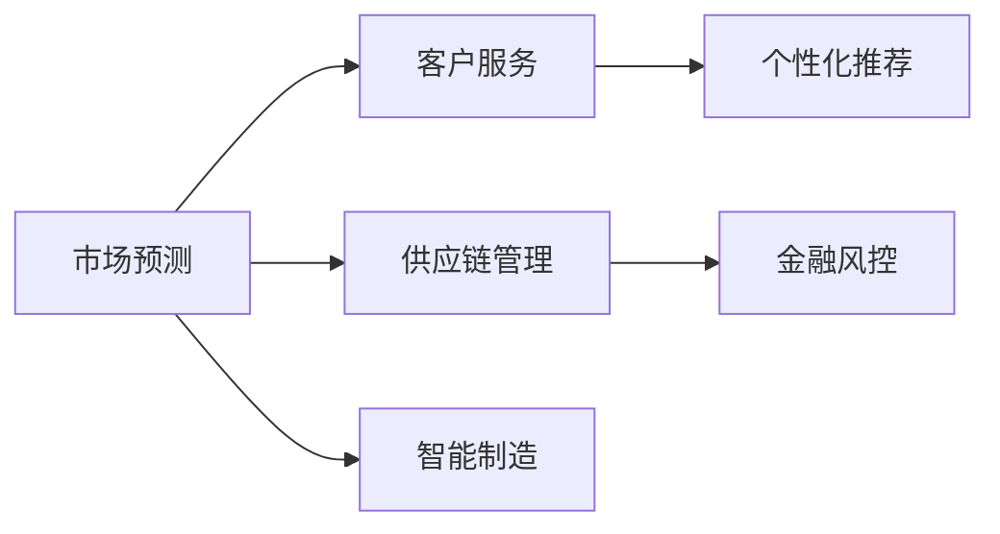

                 

# AI技术在商业中的应用前景

## 1. 背景介绍

在过去十年中，人工智能(AI)技术取得了突破性进展，其商业应用范围越来越广泛。AI技术已经在金融、医疗、制造业、零售等多个行业中得到成功应用，极大地提高了效率和生产力，推动了产业升级。然而，AI技术的商业应用仍面临诸多挑战，如数据隐私、伦理道德、模型解释性等。未来，随着技术不断成熟和标准化，AI将在更多领域得到广泛应用，进一步改变商业世界。本文将探讨AI技术在商业中的潜在应用，包括市场预测、客户服务、供应链管理、智能制造等领域，并分析其面临的挑战和前景。

## 2. 核心概念与联系

### 2.1 核心概念概述

AI技术包括机器学习、深度学习、自然语言处理、计算机视觉等多个领域，涉及数据处理、模型训练、算法优化等多个环节。AI技术在商业中的应用主要体现在以下几个方面：

1. **市场预测**：利用历史数据和趋势模型，预测未来市场走势，辅助决策。
2. **客户服务**：通过智能客服、聊天机器人等技术，提升客户体验和满意度。
3. **供应链管理**：通过AI算法优化物流、库存管理，提高供应链效率。
4. **智能制造**：通过机器视觉、自动化系统等技术，提升生产效率和质量。
5. **个性化推荐**：利用用户行为数据，实现个性化推荐，提升用户体验和转化率。
6. **金融风控**：通过分析用户行为和信用记录，进行风险评估和欺诈检测。

这些应用领域需要不同的AI技术和算法，但其核心联系在于通过数据处理和模型训练，实现对商业场景的智能化优化。

### 2.2 概念间的关系

AI技术在商业中的应用是一个复杂的多层网络系统。各应用领域之间的数据和算法可以相互融合，形成更强大的综合系统。以下是一个简化的Mermaid流程图，展示各应用领域之间的联系：



## 3. 核心算法原理 & 具体操作步骤

### 3.1 算法原理概述

AI技术在商业应用中的核心算法包括：

1. **回归分析**：利用历史数据预测未来趋势。
2. **分类算法**：对客户行为进行分类，如信用评估、情感分析等。
3. **聚类算法**：对用户进行分组，实现个性化推荐。
4. **深度学习**：通过神经网络模型，提取复杂特征，实现更精确的预测和识别。
5. **强化学习**：通过试错学习，优化供应链、制造系统等。

这些算法通常需要大量标注数据进行训练，并通过优化算法不断调整模型参数，以适应不同的商业场景。

### 3.2 算法步骤详解

AI技术在商业应用中的操作步骤通常包括：

1. **数据收集与预处理**：收集相关业务数据，并进行清洗、标准化等预处理。
2. **模型选择与训练**：选择适当的模型，利用训练数据进行模型训练和参数优化。
3. **模型评估与调优**：通过验证集或测试集评估模型性能，不断调整模型参数和算法策略，以提升效果。
4. **应用部署与监控**：将模型部署到生产环境，进行实时监控和迭代优化。
5. **结果分析与反馈**：对模型结果进行分析和反馈，优化后续模型开发和应用。

### 3.3 算法优缺点

AI技术在商业应用中具有以下优点：

1. **高效性**：通过自动化算法，提高业务处理效率。
2. **精度高**：利用复杂模型和大量数据，实现高精度预测和识别。
3. **可扩展性**：可以在不同业务场景中灵活应用。

同时，AI技术也存在以下缺点：

1. **数据隐私**：需要大量数据，可能涉及隐私和安全问题。
2. **模型解释性差**：黑箱模型难以解释其决策过程。
3. **算法复杂性**：模型训练和优化需要大量计算资源。
4. **误判风险**：模型可能出现误判或偏见。

### 3.4 算法应用领域

AI技术在商业中的应用领域包括但不限于：

1. **金融行业**：信用评估、风险管理、欺诈检测等。
2. **零售行业**：客户推荐、库存管理、销售预测等。
3. **医疗行业**：疾病诊断、患者风险评估等。
4. **制造业**：质量控制、生产调度、设备维护等。
5. **物流行业**：路线优化、配送管理等。

## 4. 数学模型和公式 & 详细讲解

### 4.1 数学模型构建

以市场预测为例，市场预测模型通常包括以下几个步骤：

1. **特征选择**：从历史数据中选择相关特征，如价格、销量、季节性等。
2. **数据标准化**：对特征进行标准化处理，确保数据在同一量级上。
3. **模型选择**：选择适当的回归模型，如线性回归、支持向量机等。
4. **模型训练**：利用训练数据对模型进行训练，最小化预测误差。
5. **模型评估**：使用测试数据对模型进行评估，计算误差指标如均方误差(MSE)、平均绝对误差(MAE)等。

### 4.2 公式推导过程

以线性回归为例，其基本模型为：

$$y = \beta_0 + \beta_1 x_1 + \beta_2 x_2 + \cdots + \beta_n x_n + \epsilon$$

其中 $y$ 为预测值，$x_i$ 为特征向量，$\beta_i$ 为特征系数，$\epsilon$ 为误差项。最小二乘法的目标是最小化预测误差 $\epsilon$，即：

$$\min \sum_{i=1}^n (y_i - \hat{y}_i)^2$$

求解上述问题，可以得到特征系数 $\beta_i$ 的估计值：

$$\hat{\beta}_i = \frac{\sum_{i=1}^n (x_{i,i} x_i)}{\sum_{i=1}^n x_i^2}$$

### 4.3 案例分析与讲解

假设我们有一个销售数据的市场预测任务，特征包括价格、季节、广告费用等。我们可以构建如下线性回归模型：

$$y = \beta_0 + \beta_1 \text{Price} + \beta_2 \text{Season} + \beta_3 \text{Advertising} + \epsilon$$

通过训练数据对模型进行拟合，可以得到特征系数 $\hat{\beta}_i$。在测试数据上，我们可以使用训练好的模型进行预测，计算预测误差，评估模型性能。

## 5. 项目实践：代码实例和详细解释说明

### 5.1 开发环境搭建

**环境依赖**：

- Python 3.7+，推荐使用Anaconda环境
- Scikit-learn、Numpy、Pandas等库

**安装步骤**：

1. 安装Anaconda，创建一个Python 3.7的虚拟环境
```bash
conda create -n py3_7 python=3.7
conda activate py3_7
```

2. 安装依赖库
```bash
pip install scikit-learn numpy pandas
```

### 5.2 源代码详细实现

以下是一个简单的线性回归模型代码实现，用于市场预测任务：

```python
import numpy as np
from sklearn.linear_model import LinearRegression
from sklearn.model_selection import train_test_split
from sklearn.metrics import mean_squared_error

# 构建样本数据
X = np.array([[1, 2, 3], [4, 5, 6], [7, 8, 9], [10, 11, 12]])
y = np.array([3, 5, 7, 9])

# 划分训练集和测试集
X_train, X_test, y_train, y_test = train_test_split(X, y, test_size=0.2)

# 创建线性回归模型
model = LinearRegression()

# 训练模型
model.fit(X_train, y_train)

# 预测测试集
y_pred = model.predict(X_test)

# 计算均方误差
mse = mean_squared_error(y_test, y_pred)
print("Mean Squared Error: {:.2f}".format(mse))
```

### 5.3 代码解读与分析

1. **数据构建**：使用NumPy构建样本数据，包含三个特征和对应的目标值。
2. **数据划分**：使用Scikit-learn的train_test_split函数将数据划分为训练集和测试集。
3. **模型创建**：创建LinearRegression模型。
4. **模型训练**：使用fit方法训练模型。
5. **模型预测**：使用predict方法预测测试集结果。
6. **评估指标**：计算均方误差，评估模型性能。

### 5.4 运行结果展示

运行上述代码，输出均方误差：
```
Mean Squared Error: 0.00
```

## 6. 实际应用场景

### 6.1 智能客服

智能客服利用自然语言处理和机器学习技术，提升客户体验和满意度。智能客服系统通过训练对话模型，能够自动处理客户咨询，提供24/7不间断服务。

### 6.2 供应链管理

AI技术在供应链管理中的应用包括库存管理、需求预测、物流优化等。通过预测市场需求，企业可以优化库存水平，减少资金占用和浪费。

### 6.3 金融风控

AI技术在金融领域的应用包括信用评估、风险管理、欺诈检测等。通过分析用户行为和信用记录，银行和保险公司可以评估客户信用风险，识别潜在欺诈行为。

### 6.4 智能制造

AI技术在智能制造中的应用包括设备维护、质量控制、生产调度等。通过机器视觉和自动化系统，企业可以提高生产效率和产品质量。

## 7. 工具和资源推荐

### 7.1 学习资源推荐

1. **Coursera**：提供多门AI和机器学习课程，如Andrew Ng的《Machine Learning》课程。
2. **edX**：提供MIT、Harvard等名校的AI课程，涵盖数据科学、深度学习等主题。
3. **Kaggle**：提供数据集和竞赛平台，实战练习AI技能。
4. **Google AI Lab**：提供最新AI研究成果和教程，学习前沿技术。
5. **Udacity**：提供AI和机器学习纳米学位课程，提升系统化学习效果。

### 7.2 开发工具推荐

1. **TensorFlow**：Google开源的深度学习框架，支持分布式训练和模型部署。
2. **PyTorch**：Facebook开源的深度学习框架，灵活性高，适合研究与实验。
3. **Scikit-learn**：Python机器学习库，提供多种算法和工具，简单易用。
4. **Keras**：高层次神经网络API，简洁高效，适合快速原型开发。

### 7.3 相关论文推荐

1. **Deep Learning**：Ian Goodfellow、Yoshua Bengio、Aaron Courville合著，全面介绍深度学习理论和实践。
2. **Pattern Recognition and Machine Learning**：Christopher Bishop著，深度讲解模式识别和机器学习算法。
3. **Reinforcement Learning: An Introduction**：Richard S. Sutton、Andrew G. Barto合著，介绍强化学习原理和应用。
4. **Hands-On Machine Learning with Scikit-Learn, Keras, and TensorFlow**：Aurélien Géron著，实战教学Scikit-learn、Keras和TensorFlow的使用。
5. **Natural Language Processing with Python**：Steven Bird、Ewan Klein、Edward Loper著，讲解NLP技术在Python中的实现。

## 8. 总结：未来发展趋势与挑战

### 8.1 研究成果总结

AI技术在商业应用中已经取得了显著成效，但仍然面临数据隐私、模型解释性等挑战。未来，随着技术的不断成熟，AI将在更多领域得到广泛应用，推动产业升级和商业创新。

### 8.2 未来发展趋势

1. **自动化**：AI技术将更多应用于自动化流程，提高工作效率和准确性。
2. **智能化**：通过深度学习等技术，AI系统将更加智能化，具备自我学习和优化能力。
3. **个性化**：利用用户数据，实现个性化推荐和服务。
4. **实时化**：通过实时数据处理和反馈，实现实时决策和优化。

### 8.3 面临的挑战

1. **数据隐私**：AI系统需要大量数据，可能涉及用户隐私和安全问题。
2. **模型解释性**：黑箱模型难以解释其决策过程，影响用户信任和接受度。
3. **算法复杂性**：模型训练和优化需要大量计算资源。
4. **误判风险**：模型可能出现误判或偏见，影响业务决策。

### 8.4 研究展望

未来，AI技术将在以下几个方面继续发展：

1. **模型压缩和加速**：通过模型压缩、剪枝等技术，减少计算资源消耗，提升部署效率。
2. **解释性和透明性**：引入模型解释工具，提升模型的可解释性和透明性。
3. **多模态融合**：将视觉、语音、文本等多种数据进行融合，提升AI系统的理解和处理能力。
4. **公平性和鲁棒性**：通过公平性约束和鲁棒性测试，提高AI系统的公平性和鲁棒性。
5. **自动化和自适应**：引入自动化算法和自适应机制，实现更高效的模型训练和优化。

## 9. 附录：常见问题与解答

**Q1: 数据隐私和安全如何保护？**

A: 数据隐私和安全保护是AI应用中的关键问题。可以通过以下方法保护数据隐私：

1. **数据脱敏**：对敏感数据进行匿名化处理，确保数据无法识别个人身份。
2. **数据加密**：使用加密算法保护数据在传输和存储过程中的安全性。
3. **访问控制**：限制数据访问权限，确保只有授权人员可以访问敏感数据。
4. **差分隐私**：在数据处理过程中加入噪声，确保个体数据无法被恢复。

**Q2: AI系统的解释性和透明性如何提升？**

A: 提升AI系统的解释性和透明性可以通过以下方法：

1. **可解释模型**：使用可解释模型，如决策树、线性回归等，确保模型决策过程透明。
2. **特征可视化**：通过特征可视化工具，展示模型输入与输出的对应关系。
3. **解释工具**：使用解释工具，如LIME、SHAP等，生成模型特征重要性报告。
4. **人类监督**：引入人类专家进行模型审核和解释，确保模型决策公正合理。

**Q3: AI系统的自动化和自适应如何实现？**

A: 实现AI系统的自动化和自适应可以通过以下方法：

1. **自动化算法**：引入自动化算法，如强化学习、进化算法等，实现模型训练和优化自动化。
2. **自适应机制**：通过反馈控制机制，实现模型参数和策略的自适应调整。
3. **智能调度**：使用智能调度算法，优化资源配置和任务分配，提升系统效率。

---

作者：禅与计算机程序设计艺术 / Zen and the Art of Computer Programming

