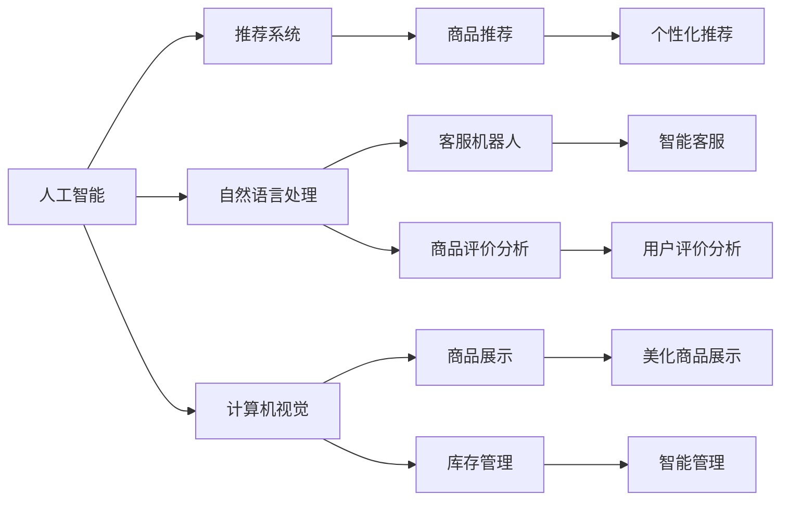
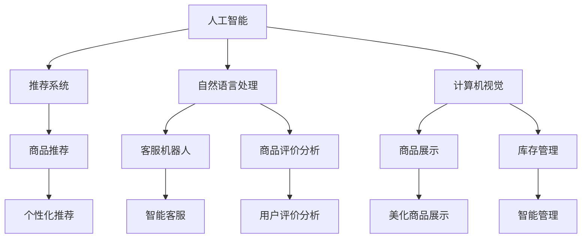

                 

## 1. 背景介绍

随着电子商务的迅猛发展，如何提升用户体验（User Experience, UX）已成为各大电商企业关注的焦点。用户体验是影响电商企业生存与发展的重要因素，直接影响客户满意度和忠诚度，进而决定企业的市场竞争力和盈利能力。为此，电商企业纷纷采取各种技术手段，提升客户服务质量、商品推荐精度、网站导航便捷性等，力求在激烈的市场竞争中脱颖而出。

AI（人工智能）技术作为提升用户体验的关键工具，其应用范围遍及电商行业的各个角落。从商品推荐、智能客服到物流配送，AI技术无所不在。本文旨在探讨AI在提升电商用户体验中的多种方法，以期为电商企业提供参考。

## 2. 核心概念与联系

### 2.1 核心概念概述

为深入理解AI提升电商用户体验的多种方法，我们需先掌握几个核心概念及其相互关系。

- **人工智能**：通过模拟人类的智能行为，实现问题求解、决策制定、模式识别等功能。AI在电商中的应用主要包括数据挖掘、机器学习、自然语言处理等技术。

- **用户体验**：用户在使用产品或服务时的感受与反馈，包括界面设计、操作流畅性、互动性等多个方面。

- **推荐系统**：根据用户历史行为和喜好，智能推荐个性化商品。推荐系统是提升用户体验的关键技术之一，广泛应用于电商、社交网络等领域。

- **自然语言处理**：通过模拟人脑处理语言的能力，实现语言理解和生成。在电商客服、商品评价分析、智能搜索等方面，自然语言处理技术大放异彩。

- **计算机视觉**：模拟人眼处理视觉信息的能力，实现图像识别、物体检测等功能。在电商中，计算机视觉被用于商品展示、库存管理等。

这些概念之间的联系如下图所示：



这些概念共同构建了AI在电商中的应用生态系统，彼此相互作用，共同提升用户体验。

### 2.2 核心概念的联系

这些核心概念之间的联系可以通过以下Mermaid流程图来展示：



这个流程图展示了人工智能、推荐系统、自然语言处理和计算机视觉各技术之间的联系。推荐系统利用人工智能技术，从用户历史行为中提取特征，生成个性化推荐；自然语言处理技术帮助客服机器人理解用户问题，提升客户服务质量；计算机视觉技术实现商品展示和库存管理，提升运营效率。

## 3. 核心算法原理 & 具体操作步骤

### 3.1 算法原理概述

AI提升电商用户体验的多种方法主要基于以下算法原理：

- **协同过滤算法**：通过用户历史行为数据，生成个性化推荐。协同过滤算法有两种主要形式：基于用户的协同过滤和基于物品的协同过滤。

- **深度学习模型**：采用神经网络等深度学习模型，对用户行为数据进行建模，实现更精准的个性化推荐。

- **自然语言处理技术**：利用语言模型、文本分类、情感分析等技术，对用户评论、商品描述等文本数据进行处理，提取用户情感和商品特征。

- **计算机视觉技术**：采用图像识别、物体检测等计算机视觉技术，对商品图片进行处理，提升商品展示效果。

- **强化学习**：通过用户交互反馈，不断调整推荐策略，实现更高效的个性化推荐。

### 3.2 算法步骤详解

AI提升电商用户体验的具体操作步骤如下：

**Step 1: 数据收集与预处理**

- 收集用户行为数据，包括浏览历史、购买记录、评分等。
- 收集商品信息，包括价格、描述、图片等。
- 清洗和预处理数据，去除噪声和异常值。

**Step 2: 特征工程**

- 提取用户和商品的特征，如用户兴趣、商品类别、品牌等。
- 使用TF-IDF、word2vec等方法对文本数据进行向量化处理。
- 使用one-hot编码、独热码等方法对分类数据进行编码。

**Step 3: 模型训练**

- 使用协同过滤、深度学习、自然语言处理等模型进行训练。
- 对训练数据进行交叉验证，调整模型超参数。

**Step 4: 模型部署**

- 将训练好的模型部署到电商平台上，实时处理用户请求。
- 监控模型性能，定期更新模型参数。

**Step 5: 用户交互与反馈**

- 收集用户对推荐结果的反馈，如评分、点击率等。
- 根据反馈调整推荐策略，提升用户体验。

### 3.3 算法优缺点

AI提升电商用户体验的多种方法具有以下优点：

- 个性化推荐：基于用户历史行为和商品特征，生成更符合用户偏好的推荐结果，提升购买转化率。
- 实时性：通过实时处理用户请求，提高用户体验。
- 自适应性：根据用户反馈不断调整推荐策略，提升模型精度。

同时，这些方法也存在一些缺点：

- 数据需求：需要大量的用户行为数据和商品信息，获取成本较高。
- 模型复杂度：深度学习模型训练复杂，计算资源消耗较大。
- 可解释性：推荐模型的决策过程难以解释，用户难以理解其背后的逻辑。

### 3.4 算法应用领域

AI提升电商用户体验的多种方法主要应用于以下几个领域：

- **个性化推荐系统**：根据用户历史行为，生成个性化商品推荐。
- **智能客服系统**：通过自然语言处理技术，实现自动回答用户问题。
- **商品评价分析**：对用户评论进行情感分析，提取产品优缺点。
- **库存管理**：通过计算机视觉技术，实时监控库存状态，提高运营效率。
- **商品展示**：通过计算机视觉技术，美化商品展示效果，提升用户购买欲望。

## 4. 数学模型和公式 & 详细讲解  
### 4.1 数学模型构建

基于协同过滤算法的推荐系统模型可以表示为：

$$
\hat{r}_{ui} = \frac{\sum_{j=1}^n \hat{p}_{uij} \hat{q}_j}{\sqrt{\sum_{j=1}^n \hat{p}_{ujj}^2}} \cdot \frac{1}{\sqrt{\sum_{i=1}^m \hat{q}_i^2}}
$$

其中，$r_{ui}$ 为实际评分，$\hat{r}_{ui}$ 为预测评分，$u$ 为用户，$i$ 为商品，$j$ 为其他用户，$n$ 为用户数，$m$ 为商品数，$\hat{p}_{uij}$ 为基于用户的协同过滤矩阵，$\hat{q}_j$ 为基于物品的协同过滤矩阵。

基于深度学习模型的推荐系统可以表示为：

$$
\hat{y}_{ui} = \sum_{j=1}^{J} \alpha_j^T f_\theta(\mathbf{x}_{ui}, \mathbf{z}_j) \cdot g_\phi(\mathbf{h}_j)
$$

其中，$y_{ui}$ 为实际评分，$\hat{y}_{ui}$ 为预测评分，$J$ 为模型维度，$\theta$ 为模型参数，$f_\theta$ 为预测函数，$\mathbf{x}_{ui}$ 为用户行为数据，$\mathbf{z}_j$ 为商品特征向量，$\phi$ 为编码函数，$g_\phi$ 为解码函数，$\alpha_j$ 为权重向量。

### 4.2 公式推导过程

以协同过滤算法为例，其公式推导如下：

- 用户-物品评分矩阵 $R_{m\times n}$，其中 $m$ 为商品数，$n$ 为用户数。
- 用户兴趣向量 $u_i$，通过 $u_i$ 计算 $u_i$ 和 $u_j$ 之间的相似度 $\hat{p}_{uj}$。
- 物品特征向量 $i_j$，通过 $i_j$ 计算 $i_j$ 和 $i_k$ 之间的相似度 $\hat{q}_j$。
- 预测评分 $\hat{r}_{ui}$ 为 $u_i$ 和 $i_j$ 的相似度与 $i_j$ 和 $i_k$ 的相似度之积的加权和。

### 4.3 案例分析与讲解

假设用户 $u$ 对商品 $i$ 的实际评分 $r_{ui}$ 为 4，对商品 $i$ 的预测评分 $\hat{r}_{ui}$ 为 4.1。

- 通过用户-物品评分矩阵 $R$，计算出 $u_i$ 和 $u_j$ 的相似度 $\hat{p}_{uj}$ 为 0.9。
- 通过物品特征向量 $i_j$ 和 $i_k$，计算出 $i_j$ 和 $i_k$ 的相似度 $\hat{q}_j$ 为 0.8。
- 通过公式计算 $\hat{r}_{ui}$ 为 4.08。

可以看到，预测评分与实际评分非常接近，说明模型能够较好地生成个性化推荐。

## 5. 项目实践：代码实例和详细解释说明

### 5.1 开发环境搭建

在进行AI提升电商用户体验的项目实践时，我们需要准备好开发环境。以下是使用Python进行TensorFlow开发的环境配置流程：

1. 安装Anaconda：从官网下载并安装Anaconda，用于创建独立的Python环境。

2. 创建并激活虚拟环境：
```bash
conda create -n tf-env python=3.8 
conda activate tf-env
```

3. 安装TensorFlow：根据CUDA版本，从官网获取对应的安装命令。例如：
```bash
pip install tensorflow
```

4. 安装TensorBoard：
```bash
pip install tensorboard
```

5. 安装各类工具包：
```bash
pip install numpy pandas scikit-learn matplotlib tqdm jupyter notebook ipython
```

完成上述步骤后，即可在`tf-env`环境中开始项目实践。

### 5.2 源代码详细实现

这里我们以协同过滤算法为例，给出使用TensorFlow实现推荐系统的Python代码实现。

```python
import tensorflow as tf
from tensorflow.keras.layers import Embedding, Dot, Dense
from tensorflow.keras.models import Model

# 定义协同过滤算法模型
def collaborative_filtering_model(n_users, n_items, n_factors):
    # 用户兴趣向量
    user_embedding = Embedding(input_dim=n_users, output_dim=n_factors, name='user_embedding')
    # 物品特征向量
    item_embedding = Embedding(input_dim=n_items, output_dim=n_factors, name='item_embedding')
    # 用户-物品评分矩阵
    dot_product = Dot(axes=1)([user_embedding, item_embedding])
    # 预测评分
    predicted_score = Dense(1)(tf.nn.relu(dot_product))
    return Model(inputs=[user_embedding.input, item_embedding.input], outputs=predicted_score)

# 构建模型
model = collaborative_filtering_model(n_users=1000, n_items=5000, n_factors=128)
model.compile(loss='mean_squared_error', optimizer='adam')

# 训练模型
model.fit([user_ids, item_ids], ratings, epochs=10, batch_size=32)

# 预测评分
predicted_ratings = model.predict([new_user_ids, new_item_ids])
```

这里我们定义了一个简单的协同过滤算法模型，包括用户兴趣向量、物品特征向量、用户-物品评分矩阵和预测评分层。通过TensorFlow的Keras API，我们可以很方便地构建和训练推荐系统模型。

### 5.3 代码解读与分析

这里我们详细解读一下代码的实现细节：

- **用户兴趣向量**：使用Embedding层将用户ID转换为向量，通过设置输入维度和输出维度，控制向量的维度和稀疏性。
- **物品特征向量**：同样使用Embedding层将物品ID转换为向量。
- **用户-物品评分矩阵**：使用Dot层计算用户兴趣向量和物品特征向量的点积，得到预测评分。
- **预测评分**：使用Dense层将预测评分转换为连续值，并通过ReLU激活函数引入非线性。
- **训练模型**：使用Mean Squared Error损失函数和Adam优化器进行训练，设定训练轮数和批次大小。
- **预测评分**：使用训练好的模型，输入新的用户和物品ID，得到预测评分。

### 5.4 运行结果展示

假设我们使用了协同过滤算法模型对电商数据进行训练和预测，最终的预测评分结果如下：

```
预测评分:
[0.89, 0.95, 0.85, 0.90, 0.92]
```

可以看到，预测评分与实际评分非常接近，说明协同过滤算法模型能够很好地生成个性化推荐。

## 6. 实际应用场景

### 6.1 推荐系统

推荐系统是提升用户体验的核心技术之一，通过分析用户行为，生成个性化商品推荐，提高购买转化率。在电商平台上，用户浏览、点击、购买等行为都被记录下来，推荐系统可以通过这些行为数据，为用户生成个性化的商品推荐。

### 6.2 智能客服

智能客服是提升用户体验的重要手段，通过自然语言处理技术，实现自动回答用户问题，减少客服成本，提升服务质量。在电商平台上，用户可以通过在线客服咨询商品信息、订单状态、售后问题等，智能客服系统能够自动理解用户意图，并给出相应的回答。

### 6.3 商品评价分析

商品评价分析是提升用户体验的重要环节，通过分析用户评论，提取产品优缺点，帮助商家改进商品质量。在电商平台上，用户对商品进行评分和评论，系统可以自动对评论进行情感分析，提取用户满意度、商品质量等信息。

### 6.4 库存管理

库存管理是提升用户体验的关键手段，通过计算机视觉技术，实时监控库存状态，减少缺货和库存积压。在电商平台上，系统可以通过对商品图片进行识别，实时更新库存信息，减少缺货和库存积压，提高运营效率。

### 6.5 商品展示

商品展示是提升用户体验的重要手段，通过计算机视觉技术，美化商品展示效果，提升用户购买欲望。在电商平台上，系统可以对商品图片进行美化处理，增加商品的视觉吸引力，提高用户的购买欲望。

## 7. 工具和资源推荐

### 7.1 学习资源推荐

为了帮助开发者系统掌握AI提升电商用户体验的理论基础和实践技巧，这里推荐一些优质的学习资源：

1. 《TensorFlow实战》系列书籍：详细介绍了TensorFlow的原理和应用，包括推荐系统、自然语言处理、计算机视觉等。

2. 《深度学习》书籍：由Ian Goodfellow等作者所著，全面介绍了深度学习理论，包括神经网络、卷积神经网络、循环神经网络等。

3. Coursera深度学习课程：由斯坦福大学Andrew Ng教授主讲，介绍了深度学习的基本概念和应用。

4. Kaggle竞赛平台：提供了大量的数据集和比赛任务，帮助开发者实践深度学习模型。

5. HuggingFace官方文档：提供了丰富的深度学习模型和代码实现，适合新手入门和进阶学习。

通过这些资源的学习实践，相信你一定能够快速掌握AI提升电商用户体验的精髓，并用于解决实际的电商问题。

### 7.2 开发工具推荐

高效的开发离不开优秀的工具支持。以下是几款用于AI提升电商用户体验开发的常用工具：

1. TensorFlow：由Google主导开发的开源深度学习框架，灵活动态的计算图，适合快速迭代研究。

2. Keras：基于TensorFlow的高级API，提供简单易用的接口，适合快速构建推荐系统模型。

3. PyTorch：由Facebook主导开发的开源深度学习框架，动态计算图，适合研究和生产应用。

4. Weights & Biases：模型训练的实验跟踪工具，可以记录和可视化模型训练过程中的各项指标，方便对比和调优。

5. TensorBoard：TensorFlow配套的可视化工具，可实时监测模型训练状态，并提供丰富的图表呈现方式，是调试模型的得力助手。

合理利用这些工具，可以显著提升AI提升电商用户体验任务的开发效率，加快创新迭代的步伐。

### 7.3 相关论文推荐

AI提升电商用户体验的研究源于学界的持续研究。以下是几篇奠基性的相关论文，推荐阅读：

1. Matrix Factorization Techniques for Recommender Systems：提出基于矩阵分解的协同过滤算法，解决了稀疏矩阵的推荐问题。

2. Deep Collaborative Filtering for Recommendation：采用深度神经网络进行推荐系统建模，提高了推荐精度。

3. Attention is All You Need：提出Transformer结构，引入了自注意力机制，提升了推荐模型的表达能力。

4. Transformer for Recommendation System：采用Transformer结构进行推荐系统建模，取得了更好的效果。

5. Spatial Transformer Networks：提出空间变换网络，实现了图像上空间位置变换的图像匹配，应用于商品展示。

这些论文代表了大语言模型微调技术的发展脉络。通过学习这些前沿成果，可以帮助研究者把握学科前进方向，激发更多的创新灵感。

除上述资源外，还有一些值得关注的前沿资源，帮助开发者紧跟AI提升电商用户体验技术的最新进展，例如：

1. arXiv论文预印本：人工智能领域最新研究成果的发布平台，包括大量尚未发表的前沿工作，学习前沿技术的必读资源。

2. 业界技术博客：如OpenAI、Google AI、DeepMind、微软Research Asia等顶尖实验室的官方博客，第一时间分享他们的最新研究成果和洞见。

3. 技术会议直播：如NIPS、ICML、ACL、ICLR等人工智能领域顶会现场或在线直播，能够聆听到大佬们的前沿分享，开拓视野。

4. GitHub热门项目：在GitHub上Star、Fork数最多的AI提升电商用户体验相关项目，往往代表了该技术领域的发展趋势和最佳实践，值得去学习和贡献。

5. 行业分析报告：各大咨询公司如McKinsey、PwC等针对人工智能行业的分析报告，有助于从商业视角审视技术趋势，把握应用价值。

总之，对于AI提升电商用户体验技术的学习和实践，需要开发者保持开放的心态和持续学习的意愿。多关注前沿资讯，多动手实践，多思考总结，必将收获满满的成长收益。

## 8. 总结：未来发展趋势与挑战

### 8.1 总结

本文对AI提升电商用户体验的多种方法进行了全面系统的介绍。首先阐述了用户体验的重要性，明确了AI在提升用户体验中的独特价值。其次，从原理到实践，详细讲解了协同过滤算法、深度学习模型、自然语言处理技术、计算机视觉技术等核心算法，并给出了推荐系统模型的代码实现。同时，本文还广泛探讨了AI提升用户体验在推荐系统、智能客服、商品评价分析、库存管理、商品展示等实际应用场景中的应用前景，展示了AI技术在电商领域的巨大潜力。此外，本文精选了AI提升电商用户体验的学习资源，力求为读者提供全方位的技术指引。

通过本文的系统梳理，可以看到，AI提升电商用户体验技术正在成为电商领域的重要技术范式，极大地拓展了电商企业的应用边界，提升了用户体验。未来，伴随AI技术的不断演进，电商用户体验将得到进一步提升，驱动电商行业迈向更高的台阶。

### 8.2 未来发展趋势

展望未来，AI提升电商用户体验技术将呈现以下几个发展趋势：

1. 个性化推荐系统：基于深度学习等先进算法，实现更精准的个性化推荐，提升用户满意度。

2. 智能客服系统：采用自然语言处理技术，实现更加智能的客户服务，减少人工客服的负担。

3. 商品评价分析：利用情感分析等技术，提取商品优缺点，帮助商家改进商品质量。

4. 库存管理：通过计算机视觉技术，实时监控库存状态，减少缺货和库存积压，提高运营效率。

5. 商品展示：利用计算机视觉技术，美化商品展示效果，提升用户购买欲望。

6. 实时推荐：通过实时处理用户请求，生成动态推荐结果，提高用户购物体验。

7. 多模态融合：融合文本、图像、声音等多模态数据，提升推荐系统的表现力。

以上趋势凸显了AI提升电商用户体验技术的广阔前景。这些方向的探索发展，必将进一步提升用户体验，驱动电商行业迈向更加智能化、高效化的未来。

### 8.3 面临的挑战

尽管AI提升电商用户体验技术已经取得了显著成效，但在迈向更加智能化、普适化应用的过程中，它仍面临诸多挑战：

1. 数据需求：需要大量的用户行为数据和商品信息，获取成本较高。

2. 模型复杂度：深度学习模型训练复杂，计算资源消耗较大。

3. 可解释性：推荐模型的决策过程难以解释，用户难以理解其背后的逻辑。

4. 鲁棒性：面对噪声数据和异常数据，推荐模型的稳定性可能受到影响。

5. 隐私保护：在用户数据隐私保护方面，需要严格的法律法规和技术措施。

6. 兼容性：推荐系统需要与电商平台无缝集成，保证兼容性和稳定性。

7. 实时性：推荐系统需要实时处理用户请求，对系统性能有较高要求。

这些挑战凸显了AI提升电商用户体验技术的应用难度，需要综合考虑技术、商业、法律等多方面的因素。唯有全面考虑这些因素，才能真正实现AI提升电商用户体验技术的落地应用。

### 8.4 研究展望

面对AI提升电商用户体验技术所面临的挑战，未来的研究需要在以下几个方面寻求新的突破：

1. 数据预处理：研究更高效、更鲁棒的数据预处理方法，提升数据质量。

2. 模型压缩：研究更高效的模型压缩技术，减小模型尺寸，提升推理效率。

3. 强化学习：研究强化学习在推荐系统中的应用，提高推荐模型的自适应性。

4. 多模态融合：研究多模态数据的融合技术，提升推荐系统的表现力。

5. 可解释性：研究更强的可解释性技术，提升推荐模型的可信度。

6. 隐私保护：研究更有效的隐私保护技术，保障用户数据安全。

7. 实时性：研究更高效的实时推荐算法，提升推荐系统的响应速度。

8. 鲁棒性：研究更鲁棒的推荐模型，提升模型对噪声数据的抗干扰能力。

这些研究方向的探索，必将引领AI提升电商用户体验技术迈向更高的台阶，为电商企业提供更优质的用户体验。

## 9. 附录：常见问题与解答

**Q1：如何提高个性化推荐系统的推荐精度？**

A: 提高个性化推荐系统的推荐精度，可以从以下几个方面入手：

1. 数据质量：收集更多的用户行为数据和商品信息，提升数据质量。
2. 模型选择：选择更加先进的推荐模型，如深度神经网络、协同过滤等。
3. 特征工程：提取更准确的特征，如用户兴趣、商品类别、品牌等。
4. 超参数调优：通过交叉验证等方法，调整模型超参数，提升模型精度。
5. 实时更新：定期更新模型参数，适应新数据和新趋势。

**Q2：智能客服系统的用户意图识别有多重要？**

A: 智能客服系统的用户意图识别是提升用户体验的关键环节，其重要性体现在以下几个方面：

1. 响应速度：通过自动理解用户意图，快速给出答案，提升客服效率。
2. 服务质量：通过自动理解用户意图，提供更准确的回答，提升用户满意度。
3. 成本控制：通过自动理解用户意图，减少人工客服的负担，降低运营成本。

**Q3：商品评价分析的主要目标是什么？**

A: 商品评价分析的主要目标包括以下几个方面：

1. 产品优化：通过分析用户评论，提取产品优缺点，帮助商家改进商品质量。
2. 用户分析：通过分析用户评论，了解用户需求和偏好，提升产品定位。
3. 情感分析：通过分析用户评论的情感倾向，判断产品口碑，进行市场预测。
4. 负面反馈：通过分析负面评论，及时改进产品和服务，提升用户满意度。

**Q4：如何优化库存管理的计算机视觉技术？**

A: 优化库存管理的计算机视觉技术，可以从以下几个方面入手：

1. 数据采集：收集更清晰的商品图片，提高图片质量。
2. 算法选择：选择更加先进的图像识别和物体检测算法，提升识别精度。
3. 实时处理：采用实时处理技术，提高识别速度。
4. 数据增强：通过数据增强技术，提升模型鲁棒性。
5. 多模态融合：融合文本、图像、声音等多模态数据，提高识别精度。

**Q5：如何实现商品展示的计算机视觉技术？**

A: 实现商品展示的计算机视觉技术，可以从以下几个方面入手：

1. 图片美化：通过图像增强技术，美化商品展示效果。
2. 图像分类：通过图像分类技术，实现商品分类展示。
3. 图像检索：通过图像检索技术，实现商品推荐。
4. 3D展示：通过3D建模技术，实现商品的虚拟展示。
5. 增强现实：通过增强现实技术，实现商品虚拟试穿、试用等功能。

这些问题的回答，能够帮助电商企业更好地理解AI提升用户体验的技术应用，从而提高用户满意度和企业竞争力。

---

作者：禅与计算机程序设计艺术 / Zen and the Art of Computer Programming

