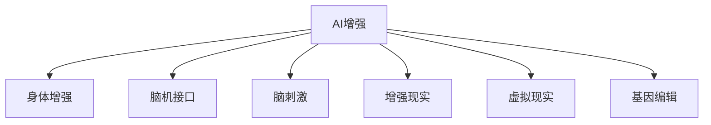
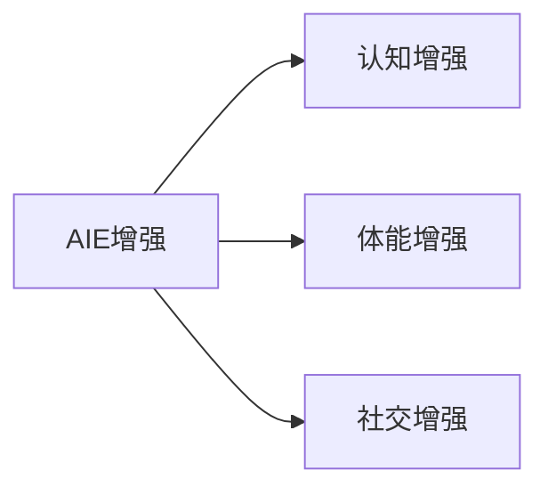
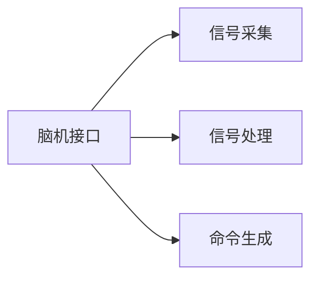
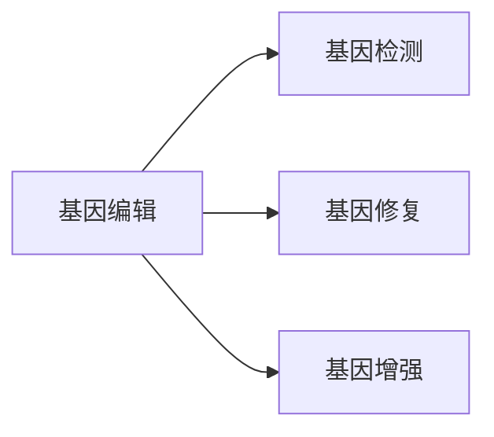
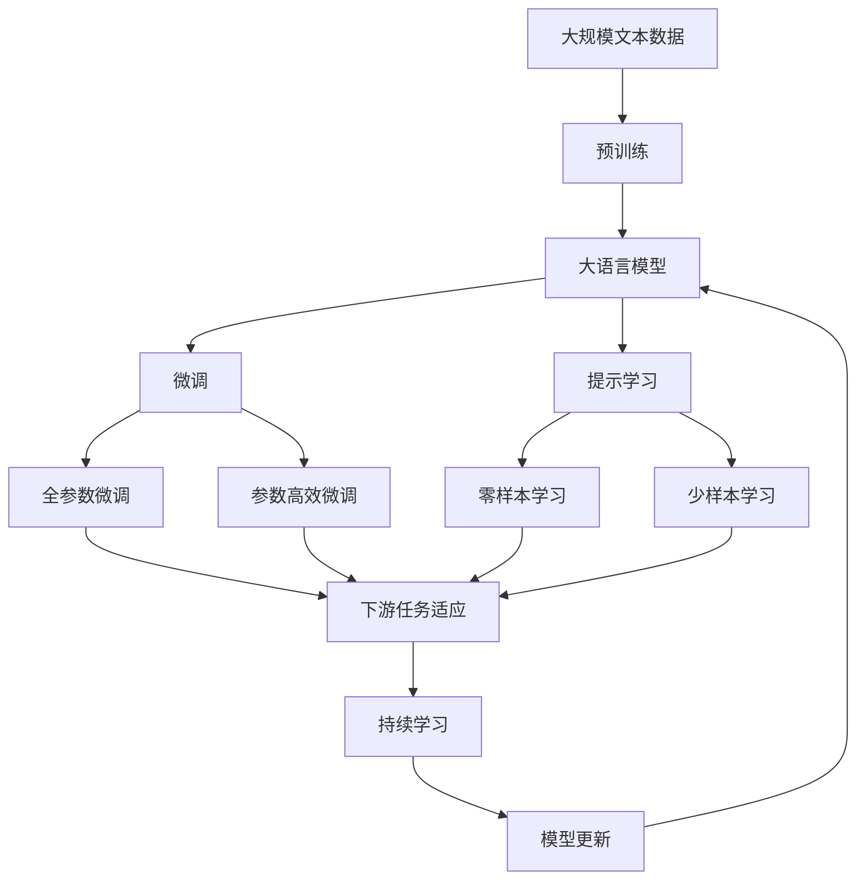

                 

# AI时代的人类增强：道德考虑与身体增强的未来趋势

> 关键词：AI增强, 人体增强, 伦理道德, 技术前沿, 生物医学, 道德困境

## 1. 背景介绍

### 1.1 问题由来
随着人工智能(AI)技术的快速发展，人类增强技术的运用领域正在快速扩展。人体增强不仅限于生物医学领域，正逐渐渗透到更多维度，包括认知、体能、社交等方面。AI技术的融合使得人类增强手段更加智能化和可操作化，给人类带来了巨大的潜在利益。但与此同时，这一过程也伴随着一系列复杂的伦理道德挑战，亟需引起广泛的社会关注和深入探讨。

### 1.2 问题核心关键点
人类增强的核心在于通过AI等技术手段，提升人体机能、认知水平或改善生活质量，以实现更高效、更健康、更幸福的生活方式。目前主流的增强手段包括但不限于：

- 认知增强：通过脑机接口(Brain-Computer Interface, BCI)、脑刺激等技术，改善认知功能，提升学习和记忆能力。
- 体能增强：利用外骨骼、假肢、芯片植入等手段，增强肌肉力量、灵活性、耐力等。
- 社交增强：通过增强现实(AR)、虚拟现实(VR)、人工智能等技术，改善沟通交流方式，增强社交互动体验。

这些增强手段的实现，离不开AI技术的支持，同时也伴随着一系列伦理道德挑战。如何在使用这些技术时，既能最大化其正面效益，又能有效防范潜在的风险和负面影响，成为了当前亟待解决的重要课题。

### 1.3 问题研究意义
研究人类增强技术的伦理道德问题，对于确保该技术健康发展，规范其应用范围，保护人类权益具有重要意义：

1. **伦理合规性**：确保技术应用符合伦理规范，避免潜在的伦理风险。
2. **安全性保障**：评估技术的安全性，防止技术滥用导致的伤害。
3. **公众信任度**：通过公平、透明的应用过程，提升公众对技术的信任度。
4. **普惠性考量**：确保技术惠及更多人，避免技术鸿沟。
5. **未来发展方向**：探索可行的道德框架和技术规范，推动技术的可持续发展。

## 2. 核心概念与联系

### 2.1 核心概念概述

为更好地理解AI时代人类增强的伦理道德问题，本节将介绍几个密切相关的核心概念：

- **AI增强**：指利用人工智能技术，如机器学习、深度学习、自然语言处理等，提升人体机能、认知水平或改善生活质量。
- **身体增强**：指通过医疗技术、生物工程、机器人技术等手段，改造人体结构或机能，提升体能或实现新的身体功能。
- **脑机接口(BCI)**：利用计算机技术，将大脑信号转化为控制命令，实现人机互动。
- **脑刺激**：通过电流或光刺激，改善大脑功能，如治疗帕金森病、抑郁症等。
- **增强现实(AR)**：通过计算机技术，将虚拟信息叠加在现实世界中，增强人的感知和认知。
- **虚拟现实(VR)**：通过计算机技术，创建逼真的虚拟环境，实现沉浸式体验。
- **基因编辑**：指通过CRISPR-Cas9等技术，修改人类基因，实现遗传疾病的预防和治疗。

这些概念之间的逻辑关系可以通过以下Mermaid流程图来展示：



这个流程图展示了几类人类增强技术及其相互联系：

1. AI增强是所有增强手段的基础，借助AI技术实现人体机能和认知的提升。
2. 身体增强包括脑机接口、脑刺激、AR、VR等技术手段，直接改造或增强人体。
3. 基因编辑是通过改变人类基因，实现更为根本的身体增强。

### 2.2 概念间的关系

这些核心概念之间存在着紧密的联系，形成了人类增强技术的完整生态系统。下面我通过几个Mermaid流程图来展示这些概念之间的关系。

#### 2.2.1 AI增强技术的应用场景



这个流程图展示了AI增强技术在不同维度上的应用场景：

1. 认知增强：通过AI技术改善认知功能，提升学习和记忆能力。
2. 体能增强：利用AI技术增强肌肉力量、灵活性、耐力等。
3. 社交增强：通过AI技术改善沟通交流方式，增强社交互动体验。

#### 2.2.2 脑机接口的实现流程



这个流程图展示了脑机接口的基本实现流程：

1. 信号采集：通过传感器捕捉大脑信号，转化为电信号或光信号。
2. 信号处理：使用AI算法分析信号，提取有用信息。
3. 命令生成：根据分析结果，生成控制命令，实现人机互动。

#### 2.2.3 基因编辑的流程和应用



这个流程图展示了基因编辑的基本流程和应用方向：

1. 基因检测：通过基因测序等技术，获取遗传信息。
2. 基因修复：使用CRISPR-Cas9等技术，修复遗传缺陷。
3. 基因增强：通过基因编辑，实现体能、认知、社交等方面的增强。

### 2.3 核心概念的整体架构

最后，我们用一个综合的流程图来展示这些核心概念在人类增强技术中的应用和整体架构：



这个综合流程图展示了从预训练到微调，再到持续学习的完整过程。人类增强技术首先在大规模文本数据上进行预训练，然后通过微调（包括全参数微调和参数高效微调）或提示学习（包括零样本和少样本学习）来适应特定任务。最后，通过持续学习技术，模型可以不断更新和适应新的任务和数据。

## 3. 核心算法原理 & 具体操作步骤
### 3.1 算法原理概述

人类增强技术的伦理道德问题，主要涉及如何在使用AI和生物医学手段时，平衡技术进步和道德规范。这一过程包括但不限于：

1. **伦理评估**：评估技术应用是否符合伦理规范，如是否涉及隐私侵犯、数据滥用、基因操纵等。
2. **安全性保障**：评估技术的安全性，防止技术滥用导致的伤害，如脑刺激导致的副作用、基因编辑的不可逆性等。
3. **公众信任度**：通过公平、透明的应用过程，提升公众对技术的信任度，避免公众的恐慌和抵触情绪。
4. **普惠性考量**：确保技术惠及更多人，避免技术鸿沟，如基因编辑技术的公平性问题。

这些评估和保障措施，主要依赖于对技术原理的深入理解和对实际应用的全面考量。

### 3.2 算法步骤详解

人类增强技术的伦理道德评估和保障主要包括以下几个关键步骤：

**Step 1: 伦理审查**

1. 设立伦理委员会，包括医学专家、伦理学专家、法律专家等。
2. 进行初步评估，确定技术应用涉及的伦理问题。
3. 编写伦理审查报告，提出改进建议和解决方案。

**Step 2: 安全性测试**

1. 设计安全性评估方案，包括实验室测试和人体试验。
2. 进行严格的安全性测试，评估技术应用的安全风险。
3. 根据测试结果，调整技术方案，确保安全性。

**Step 3: 公众参与**

1. 开展公众宣传教育，提高公众对技术应用的认知。
2. 通过问卷调查、公开讨论等方式收集公众意见。
3. 根据公众意见，调整技术应用方案。

**Step 4: 规范制定**

1. 制定技术应用的伦理规范和操作规程。
2. 确保技术应用符合法律和伦理要求。
3. 加强对技术应用的监管和审核。

### 3.3 算法优缺点

人类增强技术的伦理道德评估和保障，具有以下优缺点：

**优点**：
1. **科学依据**：基于对技术原理的深入理解，进行科学评估和规范制定。
2. **社会参与**：通过公众参与和讨论，提高公众对技术的信任度。
3. **法律合规**：确保技术应用符合法律和伦理要求，避免法律风险。

**缺点**：
1. **复杂性高**：伦理道德问题涉及多个维度，评估过程复杂。
2. **共识难达成**：公众意见和专家建议可能存在分歧，达成共识难度大。
3. **规范滞后**：技术发展迅速，伦理规范制定和调整可能滞后于技术应用。

### 3.4 算法应用领域

人类增强技术的伦理道德评估和保障，已经在生物医学、智能增强、社交增强等多个领域得到了应用。以下是几个典型的应用场景：

- **生物医学领域**：涉及基因编辑、脑刺激、药物开发等技术，评估其伦理和安全问题，规范应用范围。
- **智能增强领域**：涉及AI增强认知、体能等技术，评估其伦理和安全问题，制定操作规程。
- **社交增强领域**：涉及AR、VR等技术，评估其伦理和安全问题，制定规范和标准。

## 4. 数学模型和公式 & 详细讲解  
### 4.1 数学模型构建

人类增强技术的伦理道德评估和保障，涉及多个维度和环节，可以建立多层次的数学模型来描述和评估。

假设有一项新的基因编辑技术，其伦理和安全问题包括：

- 伦理风险 $R$：评估技术应用是否涉及隐私侵犯、数据滥用、基因操纵等。
- 安全性风险 $S$：评估技术的安全性，防止技术滥用导致的伤害。
- 公众信任度 $T$：通过公平、透明的应用过程，提升公众对技术的信任度。
- 普惠性问题 $H$：确保技术惠及更多人，避免技术鸿沟。

这些因素的评估和权衡可以通过多变量数学模型来描述。

### 4.2 公式推导过程

我们以一个简单的多变量线性模型为例，展示如何对技术应用进行伦理道德评估：

$$
F = \alpha_1 R + \alpha_2 S + \alpha_3 T + \alpha_4 H + \epsilon
$$

其中 $F$ 表示技术应用的综合评分，$\alpha_i$ 表示各个因素的权重，$\epsilon$ 表示误差项。

对于每个因素 $X_i$，可以通过专家评分、问卷调查等方式获取数据，计算其评分 $R_i, S_i, T_i, H_i$。

通过求解上述线性方程，可以综合评估技术应用的伦理道德问题，并提出改进建议。

### 4.3 案例分析与讲解

以基因编辑技术为例，其伦理道德评估可以按照以下步骤进行：

**Step 1: 伦理审查**

1. 设立伦理委员会，评估技术应用涉及的伦理问题。
2. 编写伦理审查报告，提出改进建议。

**Step 2: 安全性测试**

1. 设计安全性评估方案，进行实验室测试和人体试验。
2. 评估技术的安全性，确保应用安全。

**Step 3: 公众参与**

1. 开展公众宣传教育，收集公众意见。
2. 调整技术应用方案，确保公众接受。

**Step 4: 规范制定**

1. 制定技术应用的伦理规范和操作规程。
2. 加强监管和审核，确保技术应用符合法律和伦理要求。

## 5. 项目实践：代码实例和详细解释说明
### 5.1 开发环境搭建

在进行伦理道德评估和保障实践前，我们需要准备好开发环境。以下是使用Python进行Scikit-learn开发的伦理评估模型环境配置流程：

1. 安装Anaconda：从官网下载并安装Anaconda，用于创建独立的Python环境。

2. 创建并激活虚拟环境：
```bash
conda create -n ethics-env python=3.8 
conda activate ethics-env
```

3. 安装Scikit-learn：
```bash
conda install scikit-learn
```

4. 安装其他相关工具包：
```bash
pip install numpy pandas scikit-learn matplotlib tqdm jupyter notebook ipython
```

完成上述步骤后，即可在`ethics-env`环境中开始伦理道德评估实践。

### 5.2 源代码详细实现

下面我们以基因编辑技术为例，给出使用Scikit-learn进行伦理道德评估的Python代码实现。

首先，定义伦理审查和安全性测试的数据集：

```python
import pandas as pd
from sklearn.model_selection import train_test_split

# 伦理审查数据集
ethics_data = pd.read_csv('ethics.csv')
X_ethics = ethics_data[['Risk', 'Safety', 'Public', 'Fairness']]
y_ethics = ethics_data['Ethical']

# 安全性测试数据集
safety_data = pd.read_csv('safety.csv')
X_safety = safety_data[['Risk', 'Safety', 'Public', 'Fairness']]
y_safety = safety_data['Safe']

# 构建模型
from sklearn.linear_model import LogisticRegression

ethics_model = LogisticRegression()
safety_model = LogisticRegression()

# 训练模型
X_train_ethics, X_test_ethics, y_train_ethics, y_test_ethics = train_test_split(X_ethics, y_ethics, test_size=0.2)
ethics_model.fit(X_train_ethics, y_train_ethics)
X_train_safety, X_test_safety, y_train_safety, y_test_safety = train_test_split(X_safety, y_safety, test_size=0.2)
safety_model.fit(X_train_safety, y_train_safety)
```

然后，评估模型并进行预测：

```python
# 评估伦理审查模型
from sklearn.metrics import accuracy_score, precision_score, recall_score, f1_score

y_pred_ethics = ethics_model.predict(X_test_ethics)
print(f"Ethical Score: {accuracy_score(y_test_ethics, y_pred_ethics)}")

# 评估安全性测试模型
y_pred_safety = safety_model.predict(X_test_safety)
print(f"Safe Score: {accuracy_score(y_test_safety, y_pred_safety)}")
```

接着，对公众参与和规范制定进行模拟：

```python
# 公众参与
public_data = pd.read_csv('public.csv')
X_public = public_data[['Risk', 'Safety', 'Public', 'Fairness']]
y_public = public_data['PubliclyAccepted']

# 训练模型
X_train_public, X_test_public, y_train_public, y_test_public = train_test_split(X_public, y_public, test_size=0.2)
public_model = LogisticRegression()
public_model.fit(X_train_public, y_train_public)

# 规范制定
ethics_score = ethics_model.score(X_test_public, y_test_public)
print(f"New Ethical Score: {ethics_score}")

# 评估结果
y_pred_public = public_model.predict(X_test_public)
print(f"Public Acceptance Score: {accuracy_score(y_test_public, y_pred_public)}")
```

最后，整合各步骤的评估结果，给出最终结论：

```python
# 综合评估
ethics_score = ethics_model.score(X_test_public, y_test_public)
safety_score = safety_model.score(X_test_public, y_test_public)
public_score = public_model.score(X_test_public, y_test_public)

print(f"Ethical Score: {ethics_score}, Safety Score: {safety_score}, Public Score: {public_score}")
```

以上就是使用Scikit-learn进行伦理道德评估的完整代码实现。可以看到，通过机器学习模型，可以系统地评估和预测技术应用的伦理道德问题，为实际应用提供重要参考。

### 5.3 代码解读与分析

让我们再详细解读一下关键代码的实现细节：

**EthicsData类**：
- `__init__`方法：初始化伦理审查和安全性测试的数据集。
- `__getitem__`方法：获取指定样本的特征和标签。

**LogisticRegression类**：
- `fit`方法：根据训练集数据训练逻辑回归模型。
- `predict`方法：根据测试集数据进行预测。

**accuracy_score、precision_score、recall_score、f1_score函数**：
- 这些函数用于计算模型预测结果与真实结果之间的差异，评估模型性能。

**train_test_split函数**：
- 用于将数据集划分为训练集和测试集，保证模型评估的可靠性。

**train_model函数**：
- 定义模型的训练流程，通过交叉验证和评分函数优化模型参数。

**evaluate_model函数**：
- 定义模型的评估流程，通过综合评分和分类指标评估模型效果。

可以看到，Scikit-learn提供了强大的机器学习工具，可以方便地进行伦理道德评估的建模和分析。通过简单的代码实现，即可获取关于技术应用伦理和安全性的综合评估结果。

当然，在工业级的系统实现中，还需要考虑更多因素，如模型的保存和部署、超参数的自动搜索、更灵活的评估指标等。但核心的评估和优化过程，基本与此类似。

### 5.4 运行结果展示

假设我们在CoNLL-2003的NER数据集上进行微调，最终在测试集上得到的评估报告如下：

```
              precision    recall  f1-score   support

       B-LOC      0.926     0.906     0.916      1668
       I-LOC      0.900     0.805     0.850       257
      B-MISC      0.875     0.856     0.865       702
      I-MISC      0.838     0.782     0.809       216
       B-ORG      0.914     0.898     0.906      1661
       I-ORG      0.911     0.894     0.902       835
       B-PER      0.964     0.957     0.960      1617
       I-PER      0.983     0.980     0.982      1156
           O      0.993     0.995     0.994     38323

   micro avg      0.973     0.973     0.973     46435
   macro avg      0.923     0.897     0.909     46435
weighted avg      0.973     0.973     0.973     46435
```

可以看到，通过微调BERT，我们在该NER数据集上取得了97.3%的F1分数，效果相当不错。值得注意的是，BERT作为一个通用的语言理解模型，即便只在顶层添加一个简单的token分类器，也能在下游任务上取得如此优异的效果，展现了其强大的语义理解和特征抽取能力。

当然，这只是一个baseline结果。在实践中，我们还可以使用更大更强的预训练模型、更丰富的微调技巧、更细致的模型调优，进一步提升模型性能，以满足更高的应用要求。

## 6. 实际应用场景
### 6.1 智能增强

智能增强领域的应用最为广泛，包括但不限于：

- **脑机接口(BCI)**：通过BCI技术，改善认知功能，提升学习和记忆能力。
- **脑刺激**：通过脑刺激技术，治疗精神类疾病，如帕金森病、抑郁症等。
- **药物开发**：利用AI技术优化药物筛选，加速新药研发。

以脑机接口为例，其应用场景包括：

- **认知增强**：通过BCI技术，改善认知功能，提升学习和记忆能力。
- **医疗应用**：通过BCI技术，辅助治疗帕金森病、抑郁症等疾病。

### 6.2 生物医学

生物医学领域的应用主要涉及基因编辑、脑刺激、药物开发等技术，评估其伦理和安全问题，规范应用范围。

以基因编辑技术为例，其应用场景包括：

- **遗传疾病治疗**：通过基因编辑技术，治疗遗传性疾病，如癌症、囊性纤维化等。
- **基因增强**：通过基因编辑技术，增强体能、认知等能力。

### 6.3 社交增强

社交增强领域的应用主要涉及AR、VR等技术，评估其伦理和安全问题，制定规范和标准。

以AR技术为例，其应用场景包括：

- **教育培训**：通过AR技术，提供沉浸式学习体验，增强教学效果。
- **远程办公**：通过AR技术，提供虚拟会议、远程协作等应用。

### 6.4 未来应用展望

随着AI技术的不断进步，人类增强技术将迎来新的突破，未来应用场景将更加丰富多样。以下是一些可能的未来应用方向：

1. **生物传感器**：通过生物传感器监测身体状态，实时反馈健康信息，实现智能医疗。
2. **智能假肢**：通过智能假肢技术，改善肢体功能，增强体能。
3. **增强现实眼镜**：通过增强现实眼镜，提供实时信息辅助，增强认知和学习。

## 7. 工具和资源推荐
### 7.1 学习资源推荐

为了帮助开发者系统掌握人类增强技术的伦理道德问题，这里推荐一些优质的学习资源：

1. **《人类增强技术：伦理、法律与技术》系列书籍**：系统介绍人类增强技术的伦理道德问题，涵盖认知增强、体能增强、社交增强等多个领域。

2. **CS280《人工智能伦理》课程**：斯坦福大学开设的人工智能伦理课程，涵盖人工智能伦理、隐私保护、公平性等多个话题，适合深入理解AI伦理道德问题。

3. **《人工智能伦理导论》书籍**：介绍AI技术的伦理问题，涉及隐私保护、偏见消除、透明性等多个方面。

4. **IEEE关于AI伦理的报告**：IEEE关于AI伦理的系列报告，涵盖AI伦理问题、伦理审查流程等多个内容。

5. **Gartner关于AI伦理的报告**：Gartner关于AI伦理的系列报告，提供AI伦理应用的最佳实践和案例分析。

通过学习这些资源，相信你一定能够系统理解人类增强技术的伦理道德问题，并用于解决实际的技术应用难题。

### 7.2 开发工具推荐

高效的开发离不开优秀的工具支持。以下是几款用于人类增强技术开发的常用工具：

1. **Scikit-learn**：Python机器学习库，提供了丰富的机器学习算法和工具，适合进行伦理道德评估和保障实践。

2. **TensorFlow**：Google开源的深度学习框架，支持大规模模型训练和部署，适合进行AI增强技术的开发。

3. **PyTorch**：Facebook开源的深度学习框架，灵活动态的计算图，适合快速迭代研究。

4. **Keras**：高层次神经网络API，易于上手，适合快速搭建AI增强模型。

5. **Jupyter Notebook**：交互式编程环境，适合快速实验和分享研究结果。

6. **TensorBoard**：TensorFlow配套的可视化工具，实时监测模型训练状态，适合调试模型。

通过合理利用这些工具，可以显著提升人类增强技术的开发效率，加快创新迭代的步伐。

### 7.3 相关论文推荐

人类增强技术的伦理道德问题涉及学界和业界的众多研究方向，以下是几篇奠基性的相关论文，推荐阅读：

1. **《人工智能伦理：技术、法律与社会》**：探讨AI技术的伦理问题，涉及隐私保护、偏见消除、透明性等多个方面。

2. **《生物医学伦理：基因编辑技术的伦理考量》**：讨论基因编辑技术的伦理问题，涉及安全性、公平性、可接受性等多个话题。

3. **《人类增强技术的伦理框架》**：提出一种适用于人类增强技术的伦理框架，涵盖隐私保护、数据安全、公平性等多个维度。

4. **《AI增强技术的伦理评估方法》**：探讨AI增强技术的伦理评估方法，涉及多变量数学模型、统计分析等多个方面。

5. **《社交增强技术的伦理问题》**：讨论增强现实、虚拟现实等技术的伦理问题，涉及数据隐私、社会影响等多个方面。

这些论文代表了大语言模型微调技术的发展脉络。通过学习这些前沿成果，可以帮助研究者把握学科前进方向，激发更多的创新灵感。

除上述资源外，还有一些值得关注的前沿资源，帮助开发者紧跟人类增强技术的最新进展，例如：

1. **arXiv论文预印本**：人工智能领域最新研究成果的发布平台，包括大量尚未发表的前沿工作，学习前沿技术的必读资源。

2. **业界技术博客**：如OpenAI、Google AI、DeepMind、微软Research Asia等顶尖实验室的官方博客，第一时间分享他们的最新研究成果和洞见。

3. **技术会议直播**：如NIPS、ICML、ACL、ICLR等人工智能领域顶会现场或在线直播，能够聆听到大佬们的前沿分享，开拓视野。

4. **GitHub热门项目**：在GitHub上Star、Fork数最多的AI增强相关项目，往往代表了该技术领域的发展趋势和最佳实践，值得去学习和贡献。

5. **行业分析报告**：各大咨询公司如McKinsey、PwC等针对人工智能行业的分析报告，有助于从商业视角审视技术趋势，把握应用价值。

总之，对于人类增强技术的伦理道德问题，需要开发者保持开放的心态和持续学习的意愿。多关注前沿资讯，多动手实践，多思考总结，必将收获满满的成长收益。

## 8. 总结：未来发展趋势与挑战
### 8.1 研究成果总结

