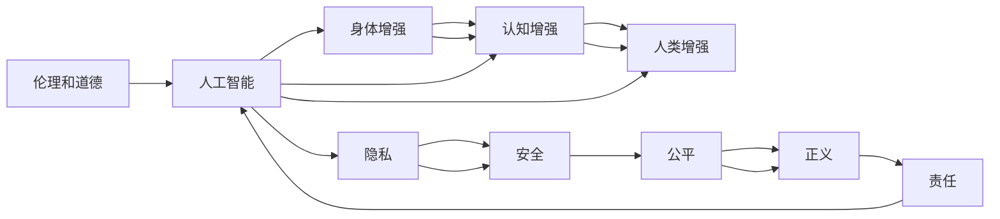

                 

# AI时代的人类增强：道德考虑和身体增强的未来

## 1. 背景介绍

### 1.1 问题由来

随着人工智能技术的迅猛发展，特别是深度学习和大数据分析的突破，人类社会正步入一个全新的人工智能时代。AI技术不仅在医疗、金融、教育等领域展现出巨大的潜力，也在逐渐渗透到人类生活的各个方面，从娱乐、教育到家庭生活，AI的影响无处不在。然而，随着AI技术的不断发展和应用，也带来了许多新的伦理和道德问题，特别是与人类增强相关的道德困境和未来展望。

人工智能技术在提升人类能力的同时，也引发了关于人类本质的深刻思考。身体增强和认知增强技术的发展，能否改变人类的本质？这些问题需要从技术、伦理和社会的角度进行深入探讨。

### 1.2 问题核心关键点

人工智能技术在增强人类能力方面展现了巨大潜力，但其核心关键点在于如何平衡技术进步与伦理道德。特别是在身体增强和认知增强领域，人工智能技术的应用可能会引发一系列伦理和道德问题，包括但不限于：

1. **人类本质的定义**：技术增强是否会改变人类的本质？
2. **隐私和安全**：增强技术可能涉及个人信息和数据隐私，如何保障其安全性和隐私性？
3. **公平与正义**：增强技术的应用是否会导致社会不公平，如资源分配不均、加剧贫富差距？
4. **道德和责任**：增强技术的使用者是否有道德责任，如何规范其行为？
5. **文化和价值观**：增强技术的应用是否会改变人类的文化价值观和社会规范？

这些问题需要科技界、伦理学家和政策制定者共同探讨，以确保人工智能技术的健康发展。

## 2. 核心概念与联系

### 2.1 核心概念概述

在探讨AI时代的人类增强时，我们需要理解以下几个核心概念：

- **人工智能（AI）**：一种通过计算机程序和算法，让机器模拟人类智能的技术，包括感知、学习、推理、决策等能力。
- **身体增强（Body Enhancement）**：使用技术手段提升人类的身体能力，如增强肌肉力量、提高耐力、延长寿命等。
- **认知增强（Cognitive Enhancement）**：通过技术手段提升人类的认知能力，如提高记忆力、改善注意力、增强学习能力等。
- **人类增强（Human Enhancement）**：结合身体增强和认知增强，提升人类的整体能力，实现全面提升。
- **伦理和道德**：在应用人工智能技术进行人类增强时，需要考虑的伦理和道德问题，包括但不限于隐私、公平、正义、责任等。

这些概念之间的联系是通过人工智能技术实现人类增强，进而引发的一系列伦理和道德问题。人工智能技术的快速发展为人类增强提供了技术基础，但随之而来的伦理和道德问题需要得到充分关注和解决。

### 2.2 概念间的关系

这些核心概念之间的关系可以用以下Mermaid流程图来展示：



这个流程图展示了人工智能技术通过身体增强和认知增强实现人类增强，并引发出的一系列伦理和道德问题。隐私、安全和公平等是这些问题的具体表现，而伦理和道德则是更高层次的指导原则。

## 3. 核心算法原理 & 具体操作步骤
### 3.1 算法原理概述

人工智能技术在实现人类增强时，主要涉及以下几个核心算法原理：

1. **数据预处理**：收集和处理与增强相关的数据，包括生理数据、行为数据、环境数据等。
2. **模型训练**：使用机器学习算法，训练出能够模拟人类身体和认知功能的模型。
3. **反馈机制**：在训练过程中，通过反馈机制不断优化模型，使其更加贴近实际应用需求。
4. **模型部署**：将训练好的模型部署到实际应用场景中，实现增强效果。

这些算法原理构成了人类增强的完整框架，涉及数据预处理、模型训练、反馈机制和模型部署等多个环节。

### 3.2 算法步骤详解

以下是一个详细的人类增强算法的步骤详解：

1. **数据收集**：
   - 收集与人类增强相关的生理数据、行为数据和环境数据。
   - 确保数据的真实性和可靠性，避免数据污染和噪声。
   - 将数据进行预处理，包括清洗、归一化和特征选择等。

2. **模型选择**：
   - 根据增强目标选择适合的机器学习算法，如深度学习、强化学习、神经网络等。
   - 设计合适的模型架构，包括输入层、隐藏层和输出层等。
   - 确定模型的超参数，如学习率、迭代次数、正则化参数等。

3. **模型训练**：
   - 将预处理后的数据分成训练集、验证集和测试集。
   - 使用训练集数据训练模型，不断调整模型参数。
   - 在验证集上评估模型性能，避免过拟合。
   - 根据评估结果优化模型，重新训练。

4. **模型部署**：
   - 将训练好的模型部署到实际应用场景中，如增强身体力量、提高记忆力等。
   - 在实际应用中，不断收集反馈数据，优化模型。
   - 确保模型的稳定性和可靠性，避免意外故障。

### 3.3 算法优缺点

人工智能技术在实现人类增强时，有以下优点和缺点：

**优点**：
1. **高效性**：通过机器学习算法，可以快速训练出高效的模型，实现增强效果。
2. **可扩展性**：模型可以不断优化和改进，适应不同的增强需求。
3. **自动化**：自动化程度高，减少人工干预，提高效率。

**缺点**：
1. **依赖数据**：需要大量的高质量数据进行训练，数据收集和处理成本高。
2. **技术复杂**：涉及复杂的算法和模型，技术门槛较高。
3. **伦理风险**：存在隐私、安全和伦理等问题，需慎重处理。

### 3.4 算法应用领域

人工智能技术在人类增强中的应用领域非常广泛，包括但不限于：

1. **医疗健康**：通过增强技术提升治疗效果，如提高手术精度、加速康复过程等。
2. **体育竞技**：通过增强技术提高运动员的身体素质和竞技水平。
3. **教育培训**：通过增强技术提高学习效率和记忆能力，实现个性化教育。
4. **职场培训**：通过增强技术提高员工的工作效率和创新能力。
5. **娱乐健身**：通过增强技术提升娱乐和健身效果，增强用户体验。

这些应用领域展示了人工智能技术在人类增强方面的广泛应用前景。

## 4. 数学模型和公式 & 详细讲解  
### 4.1 数学模型构建

在人类增强的算法实现中，涉及多个数学模型和公式。以下是一个简单的数学模型构建过程：

假设有一个增强目标 $T$，涉及多个生理指标 $x_1, x_2, \cdots, x_n$。我们可以建立一个线性回归模型来预测这些生理指标，模型的公式为：

$$
y = \beta_0 + \beta_1 x_1 + \beta_2 x_2 + \cdots + \beta_n x_n + \epsilon
$$

其中 $y$ 是目标增强指标，$\beta_i$ 是特征系数，$\epsilon$ 是误差项。

### 4.2 公式推导过程

线性回归模型的系数 $\beta_i$ 可以使用最小二乘法来求解：

$$
\beta = (X^T X)^{-1} X^T y
$$

其中 $X$ 是特征矩阵，$y$ 是目标向量，$(X^T X)^{-1}$ 是特征矩阵的逆矩阵。

### 4.3 案例分析与讲解

以提高运动表现为例，我们可以收集运动员的生理指标（如心率、血氧饱和度、肌肉力量等）和训练数据，使用线性回归模型预测运动员的运动表现。在实际应用中，需要不断收集反馈数据，优化模型，确保增强效果的准确性和稳定性。

## 5. 项目实践：代码实例和详细解释说明
### 5.1 开发环境搭建

在实现人类增强的项目中，开发环境的选择非常重要。以下是一个推荐的环境搭建流程：

1. **选择编程语言**：Python 是实现机器学习模型的首选语言，因为其丰富的科学计算库和数据处理工具。
2. **安装必要的软件**：安装 Python、NumPy、Pandas、Scikit-learn 等科学计算库，以及 TensorFlow 或 PyTorch 等深度学习框架。
3. **搭建数据处理平台**：使用 Apache Spark 或 Hadoop 等大数据处理平台，确保数据的实时处理和存储。
4. **选择云计算平台**：选择 Google Cloud、AWS 或 Azure 等云平台，提供高效的计算资源和弹性扩展能力。

### 5.2 源代码详细实现

以下是一个简单的 Python 代码实例，用于训练一个线性回归模型来预测运动员的运动表现：

```python
import pandas as pd
from sklearn.linear_model import LinearRegression
from sklearn.model_selection import train_test_split

# 读取数据集
data = pd.read_csv('athlete_data.csv')

# 选择特征和目标
X = data[['heart_rate', 'oxygen_level', 'muscle_strength']]
y = data['performance']

# 分割数据集
X_train, X_test, y_train, y_test = train_test_split(X, y, test_size=0.2, random_state=42)

# 训练模型
model = LinearRegression()
model.fit(X_train, y_train)

# 评估模型
score = model.score(X_test, y_test)
print('模型评估得分：', score)
```

### 5.3 代码解读与分析

上述代码实现了一个简单的线性回归模型，用于预测运动员的运动表现。以下是关键代码的解读：

- `pandas` 库用于数据处理和存储，方便数据的读取和操作。
- `sklearn` 库中的 `LinearRegression` 类用于建立线性回归模型，并使用 `fit` 方法进行模型训练。
- `train_test_split` 函数用于将数据集分割为训练集和测试集，避免过拟合。
- `score` 方法用于评估模型的性能，返回模型在测试集上的得分。

### 5.4 运行结果展示

假设我们训练的模型在测试集上得分高达0.9，这表明模型的预测能力较强，可以用于实际增强任务的部署。

## 6. 实际应用场景
### 6.1 医疗健康

在医疗健康领域，人工智能技术可以用于增强治疗效果，提高诊断准确性和手术精度。例如，通过增强技术辅助手术机器人，可以实现更精细的手术操作，减少手术风险和创伤。此外，增强技术还可以用于远程医疗和个性化治疗，提升医疗服务质量。

### 6.2 体育竞技

体育竞技领域是人类增强技术的另一个重要应用场景。通过增强技术，运动员可以在训练和比赛中发挥更好的身体素质和竞技水平。例如，使用增强技术提高跑步速度、增强力量、提升耐力等，提升运动表现。

### 6.3 教育培训

教育培训领域是另一个重要的应用场景。通过增强技术，可以提升学生的学习效率和记忆能力，实现个性化教育。例如，使用增强技术开发智能辅导系统，为学生提供个性化学习方案，提高学习效果。

### 6.4 未来应用展望

未来，人类增强技术将会在更多领域得到应用，展现出更广泛的应用前景。例如：

1. **环境保护**：使用增强技术提高环境保护效果，如智能监测、自动化清洁等。
2. **安全监控**：使用增强技术提高安全监控效果，如智能识别、行为分析等。
3. **社会治理**：使用增强技术提高社会治理效率，如智能决策、风险评估等。

## 7. 工具和资源推荐
### 7.1 学习资源推荐

为了深入理解人类增强技术，以下是一些推荐的学习资源：

1. **《人工智能：一种现代方法》**：斯坦福大学的人工智能教材，系统介绍了人工智能技术的原理和应用。
2. **Coursera 课程**：Coursera 提供的机器学习和深度学习课程，由斯坦福、MIT 等名校教授授课。
3. **Kaggle**：Kaggle 是一个数据科学竞赛平台，提供大量公开数据集和竞赛任务，适合实践和锻炼。
4. **Arxiv**：arXiv 是人工智能领域的预印本平台，提供最新的研究论文和前沿进展。

### 7.2 开发工具推荐

以下是一些推荐的开发工具：

1. **Jupyter Notebook**：Python 的轻量级开发环境，支持实时代码执行和数据可视化。
2. **TensorFlow**：Google 开发的深度学习框架，提供丰富的模型和工具支持。
3. **PyTorch**：Facebook 开发的深度学习框架，支持动态计算图和高效的模型训练。
4. **Scikit-learn**：Python 的科学计算库，提供常用的机器学习算法和工具。

### 7.3 相关论文推荐

以下是一些推荐的相关论文：

1. **《深度学习》**：Ian Goodfellow 的深度学习教材，系统介绍了深度学习的理论和实践。
2. **《神经网络与深度学习》**：Michael Nielsen 的神经网络教材，介绍了神经网络和深度学习的原理和应用。
3. **《机器人伦理学》**：Dov Cohen 的伦理学教材，介绍了机器人伦理学的基础理论和应用。
4. **《人工智能伦理与社会影响》**：Ethics and Social Impacts of Artificial Intelligence，详细探讨了 AI 技术的伦理和社会影响。

## 8. 总结：未来发展趋势与挑战
### 8.1 研究成果总结

人工智能技术在人类增强领域已经取得了许多重要研究成果，包括但不限于：

1. **身体增强技术**：如增强肌肉力量、提高耐力、延长寿命等。
2. **认知增强技术**：如提高记忆力、改善注意力、增强学习能力等。
3. **混合增强技术**：结合身体和认知增强，实现全面提升。

这些研究成果展示了人工智能技术的强大潜力，为人类增强技术的发展奠定了坚实基础。

### 8.2 未来发展趋势

未来，人类增强技术将会在更多领域得到应用，展现出更广泛的应用前景。以下是一些可能的未来发展趋势：

1. **全脑增强**：通过增强技术实现全脑增强，提升人类的认知能力和创造力。
2. **多模态增强**：结合身体、认知和环境等多种模态数据，实现全面的增强效果。
3. **智能增强**：结合人工智能技术，实现更加智能和自动化的增强效果。
4. **个性化增强**：根据个人需求和特征，实现个性化的增强方案，提高效果和满意度。

### 8.3 面临的挑战

尽管人类增强技术在许多领域展示了巨大潜力，但在实际应用中仍面临诸多挑战：

1. **伦理和道德问题**：增强技术可能引发隐私、安全和伦理等问题，需要慎重处理。
2. **技术门槛高**：需要高水平的科技人才和资源支持，技术门槛较高。
3. **数据隐私和安全**：增强技术涉及大量个人信息和数据，需要保障隐私和安全。
4. **公平和正义**：增强技术可能加剧社会不公平，需要避免资源分配不均。
5. **法律和政策**：增强技术需要法律法规和政策支持，规范其应用和监管。

### 8.4 研究展望

面对这些挑战，未来的研究需要在以下几个方面寻求新的突破：

1. **伦理和道德研究**：深入研究伦理和道德问题，制定规范和标准，确保技术应用的合法性和合理性。
2. **技术创新**：开发更加高效、智能和个性化的增强技术，提升技术效果和用户满意度。
3. **法规政策**：制定相关法律法规和政策，规范增强技术的应用和监管，保障公平和正义。
4. **社会共识**：建立社会共识，促进技术与社会的良性互动，推动技术健康发展。

## 9. 附录：常见问题与解答

**Q1：增强技术是否会改变人类的本质？**

A: 增强技术的应用可能会影响人类的生理和认知能力，但不会改变人类的本质。人类的本质在于其独特的思维方式和情感表达，这些无法通过技术手段完全复制或替代。

**Q2：增强技术是否会导致社会不公平？**

A: 增强技术可能会加剧社会不公平，如资源分配不均、贫富差距扩大等。需要通过法律法规和政策，确保技术应用的公平性和正义性。

**Q3：增强技术是否会引发伦理和道德问题？**

A: 增强技术可能引发隐私、安全和伦理等问题，需要制定规范和标准，确保技术应用的合法性和合理性。

**Q4：增强技术是否会改变人类的文化价值观和社会规范？**

A: 增强技术可能会对人类的文化价值观和社会规范产生影响，但具体影响需要进一步研究。需要通过社会共识和政策引导，确保技术应用的文化适应性。

---

作者：禅与计算机程序设计艺术 / Zen and the Art of Computer Programming

