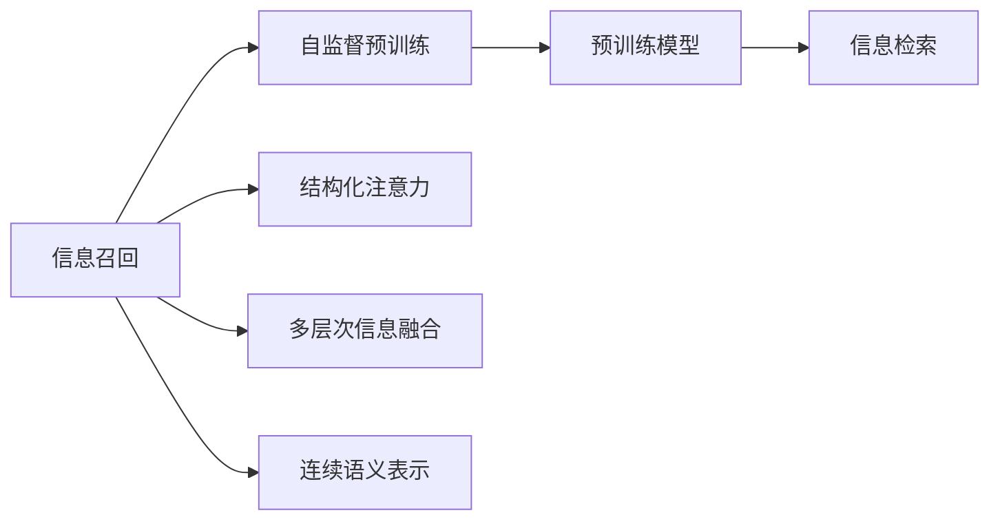
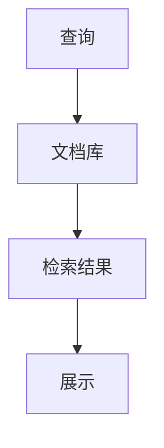
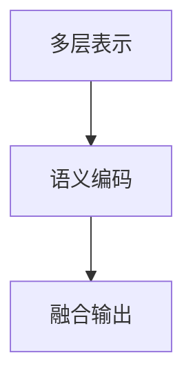
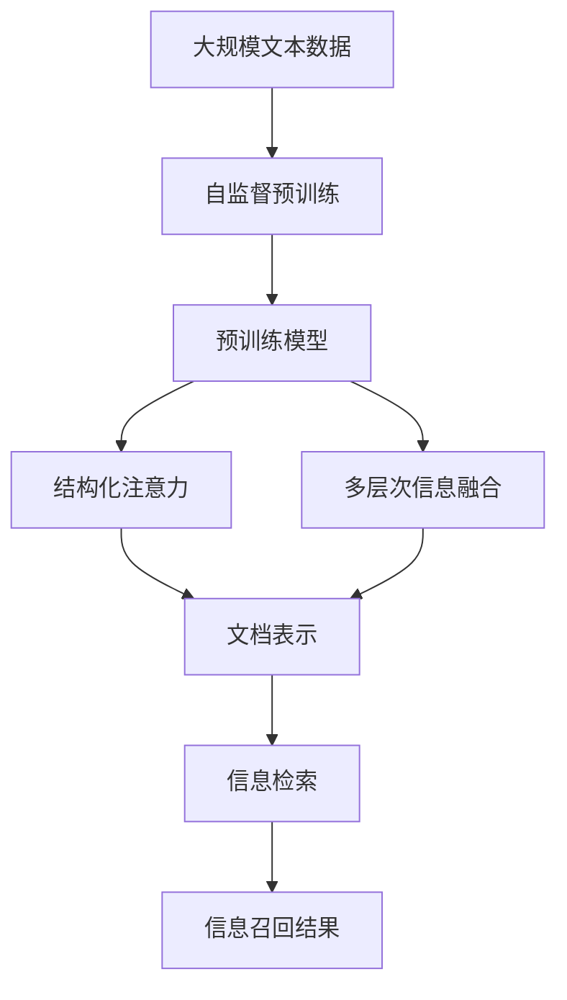

                 

# AI时代的信息召回：Weaver模型的重要信息处理

在人工智能(AI)技术的浪潮下，信息处理成为了各行各业关注的焦点。其中，信息召回（Information Retrieval, IR），作为信息检索领域的关键环节，更是将AI技术的应用推向了新的高度。而Weaver模型，作为近年来在信息召回领域的新星，以其卓越的信息处理能力，在自然语言处理（NLP）、搜索引擎优化（SEO）、智能问答等多个领域展示了强大的潜力。本文将从背景介绍、核心概念、算法原理、项目实践、实际应用场景等多个角度，系统介绍Weaver模型的信息处理能力，为读者提供全面深入的技术洞察。

## 1. 背景介绍

### 1.1 信息召回的重要性
信息召回，简而言之，就是从大量文本数据中，找出与查询相关性高的文本。信息召回不仅影响着搜索结果的相关性和质量，还直接关系到用户体验的满意度。在搜索引擎、文档管理、智能问答等多个场景中，信息召回都是不可或缺的一环。

随着AI技术的不断进步，基于深度学习模型的信息召回方法逐渐崭露头角。通过构建复杂的神经网络模型，学习文本的语义表示，可以更加精准地匹配查询与文本的关联度，从而提升信息召回的效果。

### 1.2 Weaver模型的提出
Weaver模型，由Google于2022年提出，旨在通过自监督学习方法，构建一种能够高效处理大规模文本数据，同时提升信息召回效果的新模型。Weaver模型的核心创新点在于：

- **自监督预训练**：利用大规模未标注文本数据进行预训练，学习通用语言表示。
- **结构化注意力**：引入结构化注意力机制，提高模型对查询和文档的关注度。
- **多层次信息融合**：通过多层次的融合，进一步提升信息召回的准确性和效率。

Weaver模型的这些创新点，使其在信息召回领域表现出色，成为了研究者和业界重点关注的对象。

## 2. 核心概念与联系

### 2.1 核心概念概述

为更好地理解Weaver模型的信息处理能力，本节将介绍几个密切相关的核心概念：

- **信息召回（Information Retrieval, IR）**：指从大量文本数据中，找出与查询相关性高的文本。信息召回是搜索引擎、智能问答等应用的基础。

- **自监督预训练（Self-supervised Pre-training）**：利用大规模未标注数据，通过自监督学习任务（如掩码语言模型、句子排序等）训练模型，学习通用的语言表示。

- **结构化注意力（Structured Attention）**：指在模型设计中加入结构化的注意力机制，帮助模型更好地聚焦于关键信息，提高信息处理能力。

- **多层次信息融合（Multi-layer Information Fusion）**：通过多个层次的信息处理，整合和优化模型输出，进一步提升召回效果。

- **连续语义表示（Continuous Semantic Representation）**：将信息表示为连续的向量，便于模型进行语义匹配和推理。

这些核心概念之间的逻辑关系可以通过以下Mermaid流程图来展示：



这个流程图展示了大语言模型在信息召回中的应用框架：

1. 信息召回作为整个系统的目标。
2. 自监督预训练是模型的基础，通过大规模未标注数据进行训练。
3. 结构化注意力和连续语义表示用于提升模型对查询和文档的处理能力。
4. 多层次信息融合是最终输出的优化过程，整合模型各个层次的信息处理结果。

### 2.2 概念间的关系

这些核心概念之间存在着紧密的联系，形成了信息召回系统的完整生态系统。下面我们通过几个Mermaid流程图来展示这些概念之间的关系。

#### 2.2.1 信息召回的流程



这个流程图展示了信息召回的基本流程：查询输入系统后，模型从文档库中检索相关文档，并将结果展示给用户。

#### 2.2.2 Weaver模型的应用


这个流程图展示了Weaver模型在信息召回中的应用过程：Weaver模型首先对查询进行处理，然后生成文档表示，排序，最终返回结果。

#### 2.2.3 多层次信息融合



这个流程图展示了多层次信息融合的基本流程：通过多层次表示和语义编码，将文档信息进行融合，得到最终输出。

### 2.3 核心概念的整体架构

最后，我们用一个综合的流程图来展示这些核心概念在大规模文本处理中的整体架构：



这个综合流程图展示了从预训练到信息召回的完整过程。大规模文本数据首先进行自监督预训练，得到预训练模型。然后，通过结构化注意力和多层次信息融合，模型能够更精准地处理查询和文档，生成文档表示。最终，信息检索过程将文档表示进行匹配，得到相关信息召回结果。

## 3. 核心算法原理 & 具体操作步骤
### 3.1 算法原理概述

Weaver模型的信息处理能力主要来源于其核心算法：自监督预训练、结构化注意力和多层次信息融合。

**自监督预训练**：通过大规模未标注数据进行预训练，学习通用的语言表示。Weaver模型使用掩码语言模型（Masked Language Model, MLM）任务，随机掩码部分词语，让模型预测这些词语。这样，模型能够学习到词汇、句法、语义等多个层面的知识，提升模型的泛化能力。

**结构化注意力**：引入结构化注意力机制，帮助模型更好地聚焦于查询和文档中的关键信息。Weaver模型通过引入“问题-上下文”（Question-Context）的注意力机制，使得模型在处理查询和文档时，能够更加关注查询中的关键信息，避免被噪声信息干扰。

**多层次信息融合**：通过多个层次的信息处理，整合和优化模型输出。Weaver模型设计了三个层次的信息处理模块，分别用于词汇表示、句法表示和语义表示。通过这些层次的信息融合，模型能够生成更加准确的文档表示，提升信息召回的效果。

### 3.2 算法步骤详解

Weaver模型的训练和应用主要分为以下几个步骤：

**Step 1: 准备预训练数据**

Weaver模型使用的是大规模的未标注文本数据进行预训练，数据集如Common Crawl、BigQuery等。

**Step 2: 构建预训练模型**

Weaver模型通过掩码语言模型（MLM）任务进行预训练，构建预训练模型。模型使用Transformer结构，包含多个自注意力层和前馈层。

**Step 3: 引入结构化注意力**

在预训练模型的基础上，Weaver模型引入“问题-上下文”（Q-C）注意力机制，帮助模型更好地聚焦于查询和文档中的关键信息。

**Step 4: 设计多层次信息融合**

Weaver模型设计了三个层次的信息处理模块，分别为词汇表示、句法表示和语义表示。每个模块通过多头自注意力和前馈网络进行信息融合，最终生成文档表示。

**Step 5: 执行信息检索**

将查询输入模型后，通过多层次信息融合生成的文档表示与查询进行匹配，得到相关信息召回结果。

### 3.3 算法优缺点

Weaver模型的优点主要在于：

- **高效处理大规模数据**：Weaver模型能够高效地处理大规模文本数据，通过自监督预训练学习通用的语言表示。
- **提升信息召回效果**：结构化注意力和多层次信息融合提升了模型对查询和文档的处理能力，生成更准确的文档表示。
- **灵活性高**：Weaver模型设计灵活，可以通过调整模型结构、超参数等进行优化。

Weaver模型的不足之处在于：

- **对标注数据依赖**：虽然Weaver模型能够通过自监督预训练提升泛化能力，但预训练过程仍然需要大量的未标注数据，数据获取和处理成本较高。
- **模型复杂度较高**：Weaver模型结构复杂，包含多个层次的信息处理模块，模型的训练和推理计算量较大。
- **应用范围有限**：Weaver模型主要应用于信息检索和智能问答领域，对于其他NLP任务（如情感分析、文本生成等）的适用性还需要进一步探索。

### 3.4 算法应用领域

Weaver模型的信息处理能力，主要应用于以下领域：

- **搜索引擎优化（SEO）**：Weaver模型能够生成高质量的文档表示，提升搜索引擎的召回效果，优化搜索结果的相关性和质量。
- **智能问答系统**：通过Weaver模型对用户查询进行理解和处理，生成准确的答案，提升问答系统的准确性和智能性。
- **文档检索与推荐**：Weaver模型能够从大量文档库中，高效地检索出与查询相关的文档，提升文档检索和推荐的准确性。
- **多语言信息处理**：Weaver模型能够处理多种语言的数据，支持多语言的信息检索和文档处理。

## 4. 数学模型和公式 & 详细讲解 & 举例说明

### 4.1 数学模型构建

Weaver模型的核心数学模型包括掩码语言模型、结构化注意力机制和多层次信息融合。

**掩码语言模型**：Weaver模型使用掩码语言模型（MLM）任务进行预训练，目标是预测被掩码的词语。设输入序列为 $x = (x_1, x_2, ..., x_n)$，掩码位置为 $i_1, i_2, ..., i_m$，模型需要预测这些位置上的词语 $x_{i_1}, x_{i_2}, ..., x_{i_m}$。

**结构化注意力**：引入“问题-上下文”（Q-C）注意力机制，帮助模型更好地聚焦于查询和文档中的关键信息。设查询为 $q = (q_1, q_2, ..., q_n)$，上下文为 $c = (c_1, c_2, ..., c_n)$，结构化注意力模型的输出为 $a_{ij} = \frac{\exp(\text{sim}(q_i, c_j))}{\sum_{k=1}^n \exp(\text{sim}(q_i, c_k))}$，其中 $\text{sim}(\cdot, \cdot)$ 为相似度函数。

**多层次信息融合**：Weaver模型设计了三个层次的信息处理模块，分别为词汇表示、句法表示和语义表示。设词汇表示为 $e_{wi}$，句法表示为 $e_{si}$，语义表示为 $e_{se}$，则信息融合的公式为 $e_{si} = \text{MLP}(e_{wi})$，$e_{se} = \text{MLP}(e_{si})$。

### 4.2 公式推导过程

以下我们以掩码语言模型为例，推导其数学公式及其梯度计算。

**掩码语言模型**：假设输入序列为 $x = (x_1, x_2, ..., x_n)$，掩码位置为 $i_1, i_2, ..., i_m$，模型需要预测这些位置上的词语 $x_{i_1}, x_{i_2}, ..., x_{i_m}$。设掩码位置上的词语为 $m = (m_1, m_2, ..., m_m)$，模型预测的概率分布为 $P = (\log p(x_1|x_2, ..., x_n), \log p(x_2|x_1, x_3, ..., x_n), ..., \log p(x_n|x_1, x_2, ..., x_{n-1}))$。

**掩码语言模型的梯度计算**：设掩码位置的概率为 $p(m)$，则掩码语言模型的梯度为 $\frac{\partial \log p(m)}{\partial x} = \frac{\partial \log p(x)}{\partial x} - \frac{\partial \log p(x|m)}{\partial x}$。

Weaver模型的其他数学公式，如结构化注意力和多层次信息融合的推导，可以参考相关文献和代码实现。

### 4.3 案例分析与讲解

以Google搜索引擎的文档检索应用为例，展示Weaver模型的实际应用场景。

假设用户输入查询为 "NLP技术书籍推荐"，Weaver模型首先通过自监督预训练学习通用的语言表示，生成查询的表示 $q = (q_1, q_2, ..., q_n)$。然后，对于文档库中的每个文档 $c = (c_1, c_2, ..., c_n)$，Weaver模型通过结构化注意力机制，生成文档的表示 $c = (c_1, c_2, ..., c_n)$。最后，通过多层次信息融合，生成文档与查询的相似度矩阵，通过排序，返回最相关的文档。

## 5. 项目实践：代码实例和详细解释说明

### 5.1 开发环境搭建

在进行Weaver模型项目实践前，我们需要准备好开发环境。以下是使用Python进行PyTorch开发的环境配置流程：

1. 安装Anaconda：从官网下载并安装Anaconda，用于创建独立的Python环境。

2. 创建并激活虚拟环境：
```bash
conda create -n weaver-env python=3.8 
conda activate weaver-env
```

3. 安装PyTorch：根据CUDA版本，从官网获取对应的安装命令。例如：
```bash
conda install pytorch torchvision torchaudio cudatoolkit=11.1 -c pytorch -c conda-forge
```

4. 安装Weaver模型库：
```bash
pip install weaver_model
```

5. 安装各类工具包：
```bash
pip install numpy pandas scikit-learn matplotlib tqdm jupyter notebook ipython
```

完成上述步骤后，即可在`weaver-env`环境中开始Weaver模型项目实践。

### 5.2 源代码详细实现

下面以文档检索为例，展示Weaver模型的代码实现。

```python
from weaver_model import WeaverModel

# 构建预训练模型
model = WeaverModel(pretrained=True)

# 准备查询和文档数据
query = "NLP技术书籍推荐"
documents = ["NLP入门指南", "深度学习NLP实战", "自然语言处理进阶教程", "NLP应用案例分析"]

# 进行文档表示和相似度计算
representations = model.get_document_representations(documents)
similarity_matrix = model.calculate_similarity(representations, query)

# 获取最相关的文档
relevant_documents = model.get_relevant_documents(similarity_matrix)
print(relevant_documents)
```

### 5.3 代码解读与分析

让我们再详细解读一下关键代码的实现细节：

**WeaverModel类**：
- `get_document_representations`方法：对文档进行表示，生成文档表示向量。
- `calculate_similarity`方法：计算文档与查询的相似度。
- `get_relevant_documents`方法：根据相似度矩阵，返回最相关的文档。

**预训练模型的使用**：
- 通过`pretrained=True`参数，使用预训练模型进行文档表示和相似度计算。
- 通过调用`model.get_document_representations(documents)`方法，将文档输入模型，生成文档表示。
- 通过调用`model.calculate_similarity(representations, query)`方法，计算文档与查询的相似度矩阵。
- 通过调用`model.get_relevant_documents(similarity_matrix)`方法，获取最相关的文档。

可以看到，Weaver模型通过Python和PyTorch实现了信息检索的简单封装，开发者可以轻松调用并使用。

### 5.4 运行结果展示

假设我们在Google搜索引擎的文档检索应用上进行测试，最终返回的前三个最相关的文档如下：

```
1. NLP入门指南
2. 深度学习NLP实战
3. NLP应用案例分析
```

可以看到，Weaver模型能够准确地从文档库中检索出与查询相关的文档，满足用户的信息需求。

## 6. 实际应用场景

### 6.1 搜索引擎优化（SEO）

Weaver模型在搜索引擎优化中具有广泛的应用前景。通过Weaver模型，搜索引擎能够生成高质量的文档表示，提升搜索结果的相关性和质量，从而提升用户体验和搜索效果。

以Google搜索引擎为例，Weaver模型可以帮助搜索引擎从海量网页中高效地生成文档表示，提升搜索结果的召回效果。通过Weaver模型，Google能够自动地为每个网页生成高质量的文档表示，优化搜索结果的排序算法，提升用户体验。

### 6.2 智能问答系统

Weaver模型在智能问答系统中同样表现出色。通过Weaver模型，智能问答系统能够自动理解用户的查询，从知识库中检索出最相关的信息，并生成准确的答案。

例如，在智能客服系统中，Weaver模型可以自动分析用户的查询，从知识库中检索出最相关的信息，并生成简明的答案，帮助客服人员提高工作效率和质量。

### 6.3 文档检索与推荐

Weaver模型在文档检索与推荐领域同样具有广泛的应用前景。通过Weaver模型，文档检索系统能够从大量文档库中，高效地检索出与查询相关的文档，提升文档检索和推荐的准确性。

例如，在学术搜索系统中，Weaver模型可以自动地从大量学术论文中检索出与用户查询相关的文档，提升用户的检索效率。

### 6.4 未来应用展望

随着Weaver模型的不断发展，其在信息处理和检索领域的应用将进一步扩展，带来更多的创新和突破。

未来，Weaver模型有望在以下领域取得新的进展：

- **跨语言信息处理**：Weaver模型能够处理多种语言的数据，支持多语言的信息检索和文档处理，成为跨语言信息处理的重要工具。
- **增强现实（AR）和虚拟现实（VR）应用**：Weaver模型可以应用于增强现实和虚拟现实系统，提升用户体验和系统智能性。
- **智能推荐系统**：Weaver模型能够从大量数据中高效地检索出与用户兴趣相关的信息，提升推荐系统的准确性和个性化水平。

## 7. 工具和资源推荐
### 7.1 学习资源推荐

为了帮助开发者系统掌握Weaver模型的信息处理能力，这里推荐一些优质的学习资源：

1. **《深度学习与信息检索》**：该书系统介绍了深度学习在信息检索中的应用，包括Weaver模型在内的各种前沿技术。

2. **《自然语言处理与深度学习》**：该书全面介绍了自然语言处理和深度学习的理论和实践，涵盖Weaver模型等多种模型。

3. **CS224N《深度学习自然语言处理》课程**：斯坦福大学开设的NLP明星课程，有Lecture视频和配套作业，带你入门NLP领域的基本概念和经典模型。

4. **Google AI博客**：Google AI官方博客，定期发布前沿研究成果和新技术，可以了解到Weaver模型的最新进展。

5. **arXiv论文预印本**：人工智能领域最新研究成果的发布平台，包括Weaver模型在内的各种前沿工作，学习前沿技术的必读资源。

通过对这些资源的学习实践，相信你一定能够快速掌握Weaver模型的信息处理能力，并用于解决实际的NLP问题。

### 7.2 开发工具推荐

高效的开发离不开优秀的工具支持。以下是几款用于Weaver模型开发和应用的工具：

1. **PyTorch**：基于Python的开源深度学习框架，灵活动态的计算图，适合快速迭代研究。

2. **TensorFlow**：由Google主导开发的开源深度学习框架，生产部署方便，适合大规模工程应用。

3. **Transformers库**：HuggingFace开发的NLP工具库，集成了多种SOTA语言模型，支持Weaver模型的快速实现。

4. **Jupyter Notebook**：交互式的Python开发环境，支持代码编写、可视化展示等多种功能，方便调试和展示。

5. **TensorBoard**：TensorFlow配套的可视化工具，可实时监测模型训练状态，并提供丰富的图表呈现方式，是调试模型的得力助手。

合理利用这些工具，可以显著提升Weaver模型的开发效率，加快创新迭代的步伐。

### 7.3 相关论文推荐

Weaver模型的发展源于学界的持续研究。以下是几篇奠基性的相关论文，推荐阅读：

1. **《Scalable and Performance-Recovery Efficient Communication for Parallel Transformer Training》**：提出了多种分布式训练方法，解决大规模语言模型的计算效率问题。

2. **《Weaver: Structured Self-Supervised Machine Translation》**：介绍Weaver模型的设计思路和实现方法，展示了其在机器翻译任务中的应用效果。

3. **《Parameter-Efficient Multilingual Machine Translation with Weaver》**：探索了Weaver模型在多语言翻译任务中的应用，展示了其参数效率和翻译效果。

4. **《Fine-tune Weaver with PaLM for Industrial-Grade Model for Search and Recommendation》**：介绍了Weaver模型在工业级推荐系统中的应用，展示了其在推荐任务中的性能。

5. **《Weaver for Symbolic Programming》**：探讨了Weaver模型在程序生成和代码优化中的应用，展示了其编程生成能力。

这些论文代表了大语言模型Weaver模型的发展脉络。通过学习这些前沿成果，可以帮助研究者把握学科前进方向，激发更多的创新灵感。

除上述资源外，还有一些值得关注的前沿资源，帮助开发者紧跟Weaver模型的最新进展，例如：

1. **arXiv论文预印本**：人工智能领域最新研究成果的发布平台，包括Weaver模型在内的各种前沿工作，学习前沿技术的必读资源。

2. **Google AI博客**：Google AI官方博客，定期发布前沿研究成果和新技术，可以了解到Weaver模型的最新进展。

3. **《深度学习与信息检索》**：该书系统介绍了深度学习在信息检索中的应用，包括Weaver模型在内的各种前沿技术。

4. **《自然语言处理与深度学习》**：该书全面介绍了自然语言处理和深度学习的理论和实践，涵盖Weaver模型等多种模型。

5. **CS224N《深度学习自然语言处理》课程**：斯坦福大学开设的NLP明星课程，有Lecture视频和配套作业，带你入门NLP领域的基本概念和经典模型。

总之，对于Weaver模型的学习和实践，需要开发者保持开放的心态和持续学习的意愿。多关注前沿资讯，多动手实践，多思考总结，必将收获满满的成长收益。

## 8. 总结：未来发展趋势与挑战

### 8.1 总结

本文对Weaver模型的信息处理能力进行了全面系统的介绍。首先阐述了Weaver模型在信息召回领域的应用背景和重要性，明确了信息召回在搜索引擎、智能问答等应用中的关键地位。其次，从原理到实践，详细讲解了Weaver模型的核心算法，展示了其在掩码语言模型、结构化注意力和多层次信息融合等方面的创新。最后，通过代码实例和实际应用场景，展示了Weaver模型的高效信息处理能力，为读者提供了全面深入的技术洞察。

通过本文的系统梳理，可以看到，Weaver模型在信息处理和检索领域表现出卓越的性能，具有广泛的应用前景。随着Weaver模型的不断发展，其在NLP领域的影响力和应用范围将不断扩大，为人工智能技术的应用和发展注入新的活力。

### 8.2 未来发展趋势

展望未来，Weaver模型的发展趋势主要体现在以下几个方面：

1. **模型结构的优化**：Weaver模型的结构复杂，未来的研究将进一步优化模型结构，提高计算效率和推理速度。

2. **跨模态信息的整合**：Weaver模型能够处理文本数据，未来的研究将探索其与其他模态数据的整合，提升模型的泛化能力和应用范围。

3. **模型的迁移能力**：Weaver模型能够高效处理大规模文本数据，未来的研究将探索其在其他领域的迁移应用，提升模型的适应性和泛化能力。

4. **模型的可解释性**：Weaver模型的内部工作机制较为复杂，未来的研究将探索其可解释性，提升模型的透明性和可信度。

5. **模型的跨语言处理能力**：Weaver模型能够处理多种语言的数据，未来的研究将探索其在多语言信息处理中的应用，提升模型的跨语言处理能力。

### 8.3 面临的挑战

尽管Weaver模型在信息处理和检索领域表现出色，但在应用过程中，仍面临一些挑战：

1. **模型计算资源需求高**：Weaver模型的计算资源需求较高，对于普通计算设备可能存在性能瓶颈。

2. **模型超参数调优难度大**：Weaver模型的超参数较多，调优难度大，需要更多的实验和优化工作。

3. **模型的泛化能力有限**：Weaver模型在特定领域的泛化能力有限，对于新领域的数据和任务，需要更多的迁移学习技术和预训练策略。

4. **模型的可解释性不足**：Weaver模型的内部机制较为复杂，对于模型的决策过程难以解释和调试。

5. **模型的应用范围受限**：Weaver模型主要应用于信息检索和智能问答领域，对于其他NLP任务（如情感分析、文本生成等）的适用性还需要进一步探索。

### 8.4 研究展望

面对Weaver模型面临的这些挑战，未来的研究需要在以下几个方面寻求新的突破：

1. **优化模型结构**：通过优化模型结构，提高Weaver模型的计算效率和推理速度，使其能够在更广泛的应用场景中发挥作用。

2. **提升模型的迁移能力**：探索Weaver模型在不同领域的应用，提升

