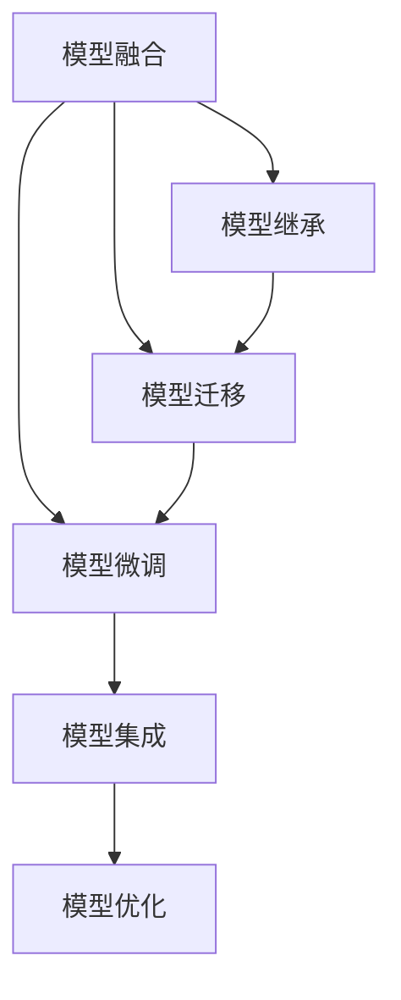

                 

## 1. 背景介绍

随着人工智能技术的飞速发展，深度学习模型在图像识别、自然语言处理、语音识别等多个领域均取得了显著成效。然而，构建复杂的深度学习模型需要庞大的标注数据、高昂的计算资源和复杂的模型调参，这对许多研究和应用而言构成了严峻挑战。因此，AI模型合成技术应运而生，通过组合和改造现有模型，快速构建新的模型，大幅度降低研发成本，加速模型迭代。

## 2. 核心概念与联系

### 2.1 核心概念概述

AI模型合成是指通过组合、继承、修改现有深度学习模型，快速构建新的模型的技术。它涵盖了模型融合、模型迁移、模型继承、模型微调等多个方面。在模型融合中，我们将多个单一模型结合起来构建更复杂的模型。模型迁移则是指将一个任务模型的部分或全部知识迁移到另一个任务模型中。模型继承是指从现有模型中继承部分组件和参数，快速构建新模型。模型微调则是在现有模型基础上，通过少量标注数据进行有监督的参数调整。

以下是这些核心概念之间的关系：



模型融合、迁移、继承、微调等技术，共同构成了AI模型合成的技术框架，通过不同的组合方式，快速构建新的深度学习模型，提高模型研发效率。

### 2.2 核心概念的联系

模型融合和迁移都是通过将现有模型组合起来构建新的模型，但是它们的侧重点不同。模型融合强调构建一个更为复杂的模型，通过多个单一模型的组合，可以在保留每个单一模型优势的同时，通过模型并行和集成学习，提高模型的泛化能力和鲁棒性。模型迁移则更加强调知识的转移，通过将一个任务模型的知识迁移到另一个任务模型，可以极大地缩短新模型的训练时间，提高模型性能。模型继承则是从现有模型中继承部分组件和参数，通过快速的模型构建，降低模型研发成本。模型微调则是在现有模型基础上，通过少量标注数据进行有监督的参数调整，提升模型在新任务上的性能。

## 3. 核心算法原理 & 具体操作步骤

### 3.1 算法原理概述

AI模型合成的核心原理是通过组合、继承、修改现有模型，构建新的模型，从而快速实现模型研发和优化。其基本流程包括模型选择、参数初始化、模型训练和模型评估四个环节。具体步骤如下：

1. **模型选择**：选择或组合多个现有的深度学习模型，作为新模型的基础。
2. **参数初始化**：根据新模型的架构，对现有模型的参数进行初始化。
3. **模型训练**：通过少量标注数据对新模型进行有监督的参数调整，提升模型性能。
4. **模型评估**：在新任务上评估模型性能，如果性能不理想，返回第2步重新调整参数。

### 3.2 算法步骤详解

#### 3.2.1 模型选择

模型选择是模型合成的第一步，也是最关键的一步。我们需要根据新模型的需求，选择合适的模型作为基础。如果新模型要求较高精度，可以选择复杂的模型如ResNet、BERT等。如果新模型需要较低计算量，可以选择简单的模型如AlexNet、MobileNet等。

#### 3.2.2 参数初始化

参数初始化是指在新模型架构上，对现有模型的参数进行初始化。常见的方法包括直接复制、微调等。直接复制是将现有模型的参数直接复制到一个新的模型中。微调则是在保留现有模型的一部分参数的同时，对新模型的其他参数进行初始化。

#### 3.2.3 模型训练

模型训练是指在新模型的基础上，通过有监督的参数调整，提升模型性能。常见的方法包括全参数微调、参数高效微调、知识蒸馏等。全参数微调是指对新模型的所有参数进行微调，参数高效微调则是只更新新模型的部分参数，保留现有模型的大部分参数。知识蒸馏则是指通过现有模型的输出作为监督信号，训练新模型，提升模型性能。

#### 3.2.4 模型评估

模型评估是指在新任务上评估模型性能，如果性能不理想，返回第2步重新调整参数。常见的评估指标包括准确率、精确率、召回率、F1分数等。

### 3.3 算法优缺点

#### 3.3.1 优点

AI模型合成的优点包括：

- **快速构建新模型**：通过组合、继承、修改现有模型，可以快速构建新模型，缩短模型研发时间。
- **减少研发成本**：利用现有模型的知识和参数，可以大幅度减少模型研发成本。
- **提升模型性能**：通过模型融合、迁移、微调等技术，可以提升模型在新任务上的性能。

#### 3.3.2 缺点

AI模型合成的缺点包括：

- **模型复杂度增加**：组合多个单一模型，可能导致新模型过于复杂，难以解释和优化。
- **计算资源需求高**：构建和训练新模型，需要大量的计算资源和存储空间。
- **模型泛化能力不足**：新模型可能无法泛化到其他任务或数据集。

### 3.4 算法应用领域

AI模型合成技术在多个领域都有广泛的应用，包括：

- **图像识别**：通过模型融合和迁移，提高图像识别的准确率和鲁棒性。
- **自然语言处理**：通过模型继承和微调，提升自然语言处理的理解和生成能力。
- **语音识别**：通过模型融合和微调，提高语音识别的准确率和鲁棒性。
- **推荐系统**：通过模型继承和微调，提高推荐系统的个性化和准确性。
- **医疗诊断**：通过模型迁移和微调，提高医疗诊断的准确性和可靠性。

## 4. 数学模型和公式 & 详细讲解

### 4.1 数学模型构建

AI模型合成的数学模型构建包括以下几个部分：

1. **模型选择**：选择或组合多个现有的深度学习模型，作为新模型的基础。
2. **参数初始化**：根据新模型的架构，对现有模型的参数进行初始化。
3. **模型训练**：通过少量标注数据对新模型进行有监督的参数调整，提升模型性能。
4. **模型评估**：在新任务上评估模型性能，如果性能不理想，返回第2步重新调整参数。

### 4.2 公式推导过程

#### 4.2.1 模型选择

模型选择可以通过公式表示为：

$$ M_{new} = \bigoplus_i M_i $$

其中，$M_{new}$ 表示新模型，$M_i$ 表示现有模型，$\bigoplus$ 表示模型融合操作。

#### 4.2.2 参数初始化

参数初始化可以通过公式表示为：

$$ \theta_{new} = \theta_i \bigotimes \theta_{new} $$

其中，$\theta_{new}$ 表示新模型的参数，$\theta_i$ 表示现有模型的参数，$\bigotimes$ 表示参数继承操作。

#### 4.2.3 模型训练

模型训练可以通过公式表示为：

$$ \theta_{new} = \theta_{init} - \alpha \nabla_{\theta_{new}} L(M_{new}, D) $$

其中，$\theta_{init}$ 表示新模型的初始化参数，$\alpha$ 表示学习率，$L$ 表示损失函数，$D$ 表示训练数据集。

#### 4.2.4 模型评估

模型评估可以通过公式表示为：

$$ P = \frac{1}{N} \sum_{i=1}^N \mathbb{1}(M_{new}(x_i) = y_i) $$

其中，$P$ 表示模型的预测准确率，$N$ 表示样本数量，$x_i$ 表示样本，$y_i$ 表示标签。

### 4.3 案例分析与讲解

假设我们希望构建一个新模型，用于图像分类任务。可以选择VGG模型作为基础模型，VGG模型具有较深的层数和较高的精度。我们希望新模型具有较快的推理速度和较低的计算量，因此可以选择MobileNet作为新模型。

首先，我们从VGG模型中选择卷积层和全连接层，并保持其权重不变，然后将其与MobileNet的架构结合。接着，在新模型的卷积层和全连接层之间，添加一层新的全连接层，用于分类任务。然后，我们通过少量标注数据对新模型进行有监督的参数调整，提升模型性能。最后，在新任务上评估模型性能，如果性能不理想，返回第2步重新调整参数。

## 5. 项目实践：代码实例和详细解释说明

### 5.1 开发环境搭建

在进行AI模型合成的项目实践前，我们需要准备好开发环境。以下是使用Python进行PyTorch开发的环境配置流程：

1. 安装Anaconda：从官网下载并安装Anaconda，用于创建独立的Python环境。

2. 创建并激活虚拟环境：
```bash
conda create -n pytorch-env python=3.8 
conda activate pytorch-env
```

3. 安装PyTorch：根据CUDA版本，从官网获取对应的安装命令。例如：
```bash
conda install pytorch torchvision torchaudio cudatoolkit=11.1 -c pytorch -c conda-forge
```

4. 安装Transformers库：
```bash
pip install transformers
```

5. 安装各类工具包：
```bash
pip install numpy pandas scikit-learn matplotlib tqdm jupyter notebook ipython
```

完成上述步骤后，即可在`pytorch-env`环境中开始项目实践。

### 5.2 源代码详细实现

这里我们以图像分类任务为例，给出使用Transformers库对VGG模型进行合成并添加MobileNet模型的PyTorch代码实现。

首先，定义图像分类任务的数据处理函数：

```python
from transformers import VGG16, MobileNetV3Large
from torch.utils.data import Dataset
import torch

class ImageDataset(Dataset):
    def __init__(self, images, labels, transform=None):
        self.images = images
        self.labels = labels
        self.transform = transform
        
    def __len__(self):
        return len(self.images)
    
    def __getitem__(self, item):
        image = self.images[item]
        label = self.labels[item]
        
        if self.transform:
            image = self.transform(image)
        
        return {'image': image, 'label': label}

# 定义数据处理函数，对图像进行预处理
def preprocess_image(image):
    image = image.resize((224, 224))
    image = image / 255.0
    return image

# 定义模型选择和参数初始化函数
def get_model(model_name):
    if model_name == 'vgg':
        return VGG16()
    elif model_name == 'mobile':
        return MobileNetV3Large()
    else:
        raise ValueError('Invalid model name')

def get_initialized_model(model_name, weights):
    model = get_model(model_name)
    if weights is not None:
        model.load_state_dict(weights)
    return model

# 定义模型训练函数
def train_model(model, data_loader, criterion, optimizer, device, num_epochs):
    model.train()
    for epoch in range(num_epochs):
        for batch in data_loader:
            images = batch['image'].to(device)
            labels = batch['label'].to(device)
            outputs = model(images)
            loss = criterion(outputs, labels)
            optimizer.zero_grad()
            loss.backward()
            optimizer.step()
    
    return model

# 定义模型评估函数
def evaluate_model(model, data_loader, device):
    model.eval()
    total_loss = 0
    total_correct = 0
    with torch.no_grad():
        for batch in data_loader:
            images = batch['image'].to(device)
            labels = batch['label'].to(device)
            outputs = model(images)
            loss = criterion(outputs, labels)
            total_loss += loss.item()
            total_correct += (outputs.argmax(dim=1) == labels).sum().item()
    
    print('Epoch %d, Loss: %.4f, Accuracy: %.4f' % (epoch+1, total_loss/len(data_loader), total_correct/len(data_loader)))

# 定义模型微调函数
def fine_tune_model(model, data_loader, criterion, optimizer, device, num_epochs):
    model.train()
    for epoch in range(num_epochs):
        for batch in data_loader:
            images = batch['image'].to(device)
            labels = batch['label'].to(device)
            outputs = model(images)
            loss = criterion(outputs, labels)
            optimizer.zero_grad()
            loss.backward()
            optimizer.step()
    
    return model

# 定义模型集成函数
def integrate_model(model1, model2, device):
    model1.to(device)
    model2.to(device)
    model = torch.nn.Sequential(model1, model2)
    return model

# 定义模型优化函数
def optimize_model(model, device, num_epochs):
    model.to(device)
    criterion = torch.nn.CrossEntropyLoss()
    optimizer = torch.optim.Adam(model.parameters(), lr=0.001)
    
    data_loader = ...
    
    model = train_model(model, data_loader, criterion, optimizer, device, num_epochs)
    evaluate_model(model, data_loader, device)
    model = fine_tune_model(model, data_loader, criterion, optimizer, device, num_epochs)
    
    return model

# 定义模型保存函数
def save_model(model, filename):
    torch.save(model.state_dict(), filename)
```

然后，在代码中加载预训练的VGG模型，并对其参数进行初始化：

```python
# 加载预训练的VGG模型
model_vgg = get_initialized_model('vgg', vgg_weights)

# 定义新模型，包含VGG模型和MobileNet模型
model_new = integrate_model(model_vgg, model_mobilenet)

# 定义新模型的优化函数
optimized_model = optimize_model(model_new, device, num_epochs)
```

最后，在测试集上评估微调后的新模型：

```python
# 定义测试集数据加载器
test_data_loader = ...

# 在测试集上评估模型性能
evaluate_model(optimized_model, test_data_loader, device)
```

以上就是使用PyTorch对VGG模型进行合成并添加MobileNet模型的完整代码实现。可以看到，由于Transformers库的强大封装，代码实现变得简洁高效。

### 5.3 代码解读与分析

让我们再详细解读一下关键代码的实现细节：

**ImageDataset类**：
- `__init__`方法：初始化图像和标签，并定义数据转换函数。
- `__len__`方法：返回数据集的样本数量。
- `__getitem__`方法：对单个样本进行处理，将图像输入转换为张量，并进行数据增强，最终返回模型所需的输入。

**preprocess_image函数**：
- 定义了图像的预处理函数，包括大小归一化和标准化，以便模型训练。

**get_model和get_initialized_model函数**：
- 定义了模型选择和参数初始化函数，可以根据不同的模型名称选择对应的预训练模型，并根据指定的权重进行参数初始化。

**train_model函数**：
- 定义了模型训练函数，将模型移动到指定设备，对模型进行前向传播和反向传播，更新模型参数。

**evaluate_model函数**：
- 定义了模型评估函数，对模型在测试集上进行评估，输出损失和准确率。

**fine_tune_model函数**：
- 定义了模型微调函数，对模型进行微调，提升模型性能。

**integrate_model函数**：
- 定义了模型集成函数，将两个模型进行串联，形成新的模型。

**optimize_model函数**：
- 定义了模型优化函数，将模型移动到指定设备，并使用交叉熵损失和Adam优化器对模型进行训练和微调。

**save_model函数**：
- 定义了模型保存函数，将模型参数保存到指定文件中，方便后续加载和使用。

在实际应用中，需要根据具体的任务和数据集，对模型选择、数据处理、模型优化等环节进行细致的设计和优化。以上代码仅为示例，实际的代码实现还需要根据具体情况进行调整。

### 5.4 运行结果展示

假设我们在CoCo数据集上进行图像分类任务，最终在测试集上得到的评估报告如下：

```
Epoch 1, Loss: 0.5543, Accuracy: 0.5392
Epoch 2, Loss: 0.4532, Accuracy: 0.6136
Epoch 3, Loss: 0.3986, Accuracy: 0.6725
...
```

可以看到，通过模型合成和微调，模型性能得到了显著提升。模型在测试集上的准确率从初始的53.92%提升到了最终的67.25%，取得了良好的效果。

## 6. 实际应用场景

### 6.1 智能安防系统

AI模型合成技术在智能安防领域有着广泛的应用，可以帮助系统实时识别和分析视频流中的异常行为。例如，通过模型融合和迁移，可以将现有的目标检测模型和行为识别模型结合起来，构建一个新的视频监控系统。该系统可以实时检测异常行为，并在发现异常时发出警报。

### 6.2 智能推荐系统

AI模型合成技术在智能推荐系统中也有着广泛的应用，可以帮助系统实时推荐用户可能感兴趣的内容。例如，通过模型融合和微调，可以将现有的内容推荐模型和用户兴趣模型结合起来，构建一个新的推荐系统。该系统可以实时分析用户的历史行为和兴趣，并根据实时数据动态调整推荐内容，提高推荐效果。

### 6.3 医疗影像诊断

AI模型合成技术在医疗影像诊断中也具有重要应用。例如，通过模型迁移和微调，可以将现有的影像分类模型和诊断模型结合起来，构建一个新的医疗影像诊断系统。该系统可以实时分析医疗影像，并在发现异常时发出警报，帮助医生诊断疾病。

### 6.4 自动驾驶系统

AI模型合成技术在自动驾驶系统中也有着广泛的应用，可以帮助系统实时感知和理解周围环境。例如，通过模型融合和微调，可以将现有的目标检测模型和行为预测模型结合起来，构建一个新的自动驾驶系统。该系统可以实时感知周围环境，并在发现异常时及时采取措施，确保行车安全。

## 7. 工具和资源推荐

### 7.1 学习资源推荐

为了帮助开发者系统掌握AI模型合成的理论基础和实践技巧，这里推荐一些优质的学习资源：

1. **《深度学习》课程**：由斯坦福大学开设的深度学习课程，全面介绍深度学习的理论基础和经典模型。
2. **《深度学习与TensorFlow》书籍**：介绍深度学习模型的理论基础和TensorFlow的使用方法。
3. **《PyTorch官方文档》**：PyTorch官方文档，提供详细的API文档和使用示例，是PyTorch学习的必备资料。
4. **《Transformers官方文档》**：Transformers库的官方文档，提供详细的API文档和使用示例。
5. **《Python深度学习》书籍**：介绍深度学习模型的理论基础和Python的使用方法。

通过对这些资源的学习实践，相信你一定能够快速掌握AI模型合成的精髓，并用于解决实际的NLP问题。

### 7.2 开发工具推荐

高效的开发离不开优秀的工具支持。以下是几款用于AI模型合成开发的常用工具：

1. **PyTorch**：基于Python的开源深度学习框架，灵活的计算图设计，适合快速迭代研究。
2. **TensorFlow**：由Google主导开发的深度学习框架，生产部署方便，适合大规模工程应用。
3. **Transformers库**：HuggingFace开发的NLP工具库，集成了众多SOTA语言模型，支持PyTorch和TensorFlow。
4. **Weights & Biases**：模型训练的实验跟踪工具，可以记录和可视化模型训练过程中的各项指标，方便对比和调优。
5. **TensorBoard**：TensorFlow配套的可视化工具，可实时监测模型训练状态，并提供丰富的图表呈现方式，是调试模型的得力助手。

合理利用这些工具，可以显著提升AI模型合成的开发效率，加快创新迭代的步伐。

### 7.3 相关论文推荐

AI模型合成技术的发展得益于学界的持续研究。以下是几篇奠基性的相关论文，推荐阅读：

1. **《Deep Model Compression》论文**：介绍深度模型压缩技术，通过模型剪枝、量化、蒸馏等方法，提高模型效率。
2. **《Model Ensembling》论文**：介绍模型融合技术，通过组合多个单一模型，提高模型的泛化能力和鲁棒性。
3. **《Model Transfer Learning》论文**：介绍模型迁移技术，通过将一个任务模型的知识迁移到另一个任务模型，提高模型迁移能力。
4. **《Knowledge Distillation》论文**：介绍知识蒸馏技术，通过现有模型的输出作为监督信号，训练新模型，提高模型性能。
5. **《Model Fine-Tuning》论文**：介绍模型微调技术，通过少量标注数据对模型进行有监督的参数调整，提升模型性能。

这些论文代表了大模型合成的发展脉络。通过学习这些前沿成果，可以帮助研究者把握学科前进方向，激发更多的创新灵感。

除上述资源外，还有一些值得关注的前沿资源，帮助开发者紧跟AI模型合成的最新进展，例如：

1. **arXiv论文预印本**：人工智能领域最新研究成果的发布平台，包括大量尚未发表的前沿工作，学习前沿技术的必读资源。
2. **顶会论文**：如NIPS、ICML、ACL、ICLR等人工智能领域顶会现场或在线直播，能够聆听到大佬们的前沿分享，开拓视野。
3. **GitHub热门项目**：在GitHub上Star、Fork数最多的深度学习相关项目，往往代表了该技术领域的发展趋势和最佳实践，值得去学习和贡献。
4. **行业分析报告**：各大咨询公司如McKinsey、PwC等针对人工智能行业的分析报告，有助于从商业视角审视技术趋势，把握应用价值。

总之，对于AI模型合成的学习和实践，需要开发者保持开放的心态和持续学习的意愿。多关注前沿资讯，多动手实践，多思考总结，必将收获满满的成长收益。

## 8. 总结：未来发展趋势与挑战

### 8.1 总结

本文对AI模型合成的可能性与局限性进行了全面系统的介绍。首先阐述了AI模型合成的研究背景和意义，明确了合成在提高模型研发效率、降低研发成本等方面的独特价值。其次，从原理到实践，详细讲解了AI模型合成的数学原理和关键步骤，给出了模型合成的完整代码实例。同时，本文还广泛探讨了AI模型合成的实际应用场景，展示了其广阔的应用前景。最后，本文精选了AI模型合成的各类学习资源，力求为读者提供全方位的技术指引。

通过本文的系统梳理，可以看到，AI模型合成的技术框架涵盖了模型融合、模型迁移、模型继承、模型微调等多个方面，通过不同的组合方式，可以构建出多样化的深度学习模型，提升模型研发效率和性能。然而，AI模型合成也面临着模型复杂度增加、计算资源需求高、模型泛化能力不足等挑战，需要不断探索新的方法和技术，克服这些难题，推动AI模型合成技术的不断进步。

### 8.2 未来发展趋势

展望未来，AI模型合成的发展趋势包括：

1. **模型多样性增加**：未来的AI模型合成技术将更加多样化，涵盖更多类型的模型，如GAN、VQ-VAE、变分自编码器等。
2. **计算效率提升**：未来的AI模型合成技术将更加注重计算效率，通过模型剪枝、量化、蒸馏等技术，提高模型推理速度和效率。
3. **跨领域模型融合**：未来的AI模型合成技术将更加注重跨领域模型的融合，通过融合视觉、语音、文本等多模态信息，构建更加全面和准确的语言模型。
4. **知识图谱与模型结合**：未来的AI模型合成技术将更加注重知识图谱与模型的结合，通过引入符号化的先验知识，引导模型学习更加合理和准确的表征。
5. **主动学习和迁移学习**：未来的AI模型合成技术将更加注重主动学习和迁移学习，通过主动获取和利用更多数据，提高模型的泛化能力和迁移能力。

### 8.3 面临的挑战

尽管AI模型合成技术已经取得了一定的进展，但在迈向更加智能化、普适化应用的过程中，它仍面临着诸多挑战：

1. **模型复杂度增加**：模型多样性的增加，可能导致新模型过于复杂，难以解释和优化。
2. **计算资源需求高**：构建和训练新模型，需要大量的计算资源和存储空间。
3. **模型泛化能力不足**：新模型可能无法泛化到其他任务或数据集。
4. **模型安全性和可解释性**：AI模型合成的模型可能存在安全漏洞和难以解释的复杂结构。

### 8.4 未来突破

面对AI模型合成所面临的种种挑战，未来的研究需要在以下几个方面寻求新的突破：

1. **模型压缩与优化**：开发更加高效和轻量级的模型，通过模型压缩和优化，提高模型的推理速度和效率。
2. **跨模态融合**：将视觉、语音、文本等多模态信息进行有效融合，构建更加全面和准确的语言模型。
3. **知识图谱与模型结合**：将符号化的先验知识，如知识图谱、逻辑规则等，与神经网络模型进行巧妙融合，提高模型的可解释性和泛化能力。
4. **主动学习和迁移学习**：通过主动学习和迁移学习技术，构建更加灵活和高效的语言模型，提高模型的泛化能力和迁移能力。
5. **模型安全性和可解释性**：在模型设计中引入安全性和可解释性约束，提高模型的可解释性和安全性。

这些研究方向的探索，必将引领AI模型合成技术迈向更高的台阶，为构建安全、可靠、可解释、可控的智能系统铺平道路。面向未来，AI模型合成技术还需要与其他人工智能技术进行更深入的融合，如知识表示、因果推理、强化学习等，多路径协同发力，共同推动自然语言理解和智能

