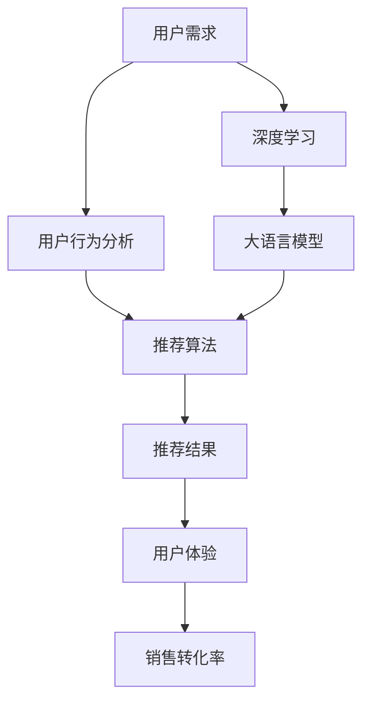

                 

# AI满足用户需求提升销售转化率

在数字化转型加速的今天，企业如何利用人工智能技术，提高销售转化率，成为一项重要课题。本文旨在探讨利用AI技术满足用户需求，从而有效提升销售转化率的可行方法。

## 1. 背景介绍

### 1.1 问题由来

近年来，随着互联网技术的快速发展，用户需求的个性化、多样性愈发凸显。传统的“一刀切”式营销策略已难以满足不同用户的需求，导致用户流失、销售转化率低下。如何更精准地识别和满足用户需求，成为企业提升销售的关键。

### 1.2 问题核心关键点

利用AI技术，尤其是大语言模型、推荐系统等技术，可以实现对用户需求的精准分析和推荐，从而提升销售转化率。关键点包括：

- **需求识别**：准确识别用户个性化需求，避免无效推荐。
- **推荐算法**：精准计算最优推荐方案，提高用户体验。
- **转化监控**：实时监控推荐结果，优化推荐策略。

### 1.3 问题研究意义

准确识别和满足用户需求，可以有效提升销售转化率，进而推动企业营收增长。AI技术在此过程中可以发挥重要作用，显著提高营销效率和精准度。

## 2. 核心概念与联系

### 2.1 核心概念概述

- **大语言模型(Large Language Model, LLM)**：如BERT、GPT等模型，通过大规模无标签数据训练，学习语言知识，具备强大的语义理解和生成能力。
- **推荐系统(Recommendation System)**：通过分析用户历史行为数据，预测用户兴趣，推荐合适商品或内容，提高转化率。
- **深度学习(Deep Learning)**：基于神经网络等深度学习模型，从大量数据中学习复杂模式，实现高精度预测。
- **用户行为分析(User Behavior Analysis)**：通过对用户行为数据进行分析和挖掘，理解用户需求和偏好。
- **用户体验(User Experience)**：用户在使用产品或服务时的整体体验，直接影响用户的满意度和转化率。

### 2.2 概念间的关系

这些核心概念之间的逻辑关系可以通过以下Mermaid流程图来展示：



这个流程图展示了从用户需求识别到推荐结果生成，再到用户体验提升，最终提升销售转化率的完整流程。大语言模型和深度学习作为技术支撑，在推荐系统和用户行为分析中发挥了关键作用。

## 3. 核心算法原理 & 具体操作步骤

### 3.1 算法原理概述

基于AI的销售转化率提升，核心算法包括大语言模型和推荐系统。大语言模型用于理解用户需求，推荐系统则用于精准推荐产品或内容。

**大语言模型原理**：
大语言模型通过自监督学习，从大规模无标签文本数据中学习语言知识，能够理解自然语言中的语义关系和上下文信息。在销售场景中，可以通过大语言模型自动生成用户需求描述，用于需求分析和推荐。

**推荐系统原理**：
推荐系统通过分析用户行为数据，挖掘用户兴趣和偏好，生成个性化推荐。推荐算法包括协同过滤、内容推荐、混合推荐等，在满足用户需求的同时，提高销售转化率。

### 3.2 算法步骤详解

**大语言模型**：
1. **数据准备**：收集用户与客服、社交媒体、评论等渠道的文本数据，进行预处理和清洗。
2. **模型训练**：使用大语言模型进行训练，学习用户需求描述。
3. **需求识别**：输入用户输入，通过大语言模型生成需求描述，用于推荐。

**推荐系统**：
1. **数据收集**：收集用户历史行为数据，如浏览记录、点击行为、购买记录等。
2. **特征工程**：提取用户特征，包括用户画像、兴趣标签、行为特征等。
3. **推荐算法**：使用协同过滤、内容推荐、混合推荐等算法，生成个性化推荐。
4. **效果评估**：通过A/B测试等方法，评估推荐效果，优化推荐策略。

### 3.3 算法优缺点

**大语言模型**：
- **优点**：能够自动生成用户需求描述，减少人工标注成本；理解自然语言语义，提供更为自然的交互方式。
- **缺点**：需要大量数据进行训练，模型规模较大；对噪声数据敏感，可能导致误判。

**推荐系统**：
- **优点**：能够高效生成个性化推荐，提升用户体验；推荐算法多样，适用于不同场景。
- **缺点**：依赖用户历史数据，对新用户和老用户推荐效果差异大；算法复杂度较高，计算成本大。

### 3.4 算法应用领域

这些算法在多个领域都有广泛应用，例如：

- **电商**：通过大语言模型理解用户需求，推荐系统生成个性化商品推荐。
- **金融**：利用大语言模型生成金融需求描述，推荐系统推荐理财方案。
- **旅游**：分析用户行为，推荐个性化旅游路线和产品。
- **教育**：推荐系统根据学生学习行为，生成个性化学习内容和资源。

## 4. 数学模型和公式 & 详细讲解

### 4.1 数学模型构建

假设用户有$N$个历史行为数据，用$X=\{x_1, x_2, ..., x_N\}$表示。推荐系统需要构建以下数学模型：

- **用户画像表示**：将用户行为数据映射到向量空间，表示为$\vec{u}$。
- **商品画像表示**：将商品属性信息映射到向量空间，表示为$\vec{v}$。
- **推荐矩阵**：将用户与商品的交互信息表示为矩阵$M$，其中$M_{ij}=1$表示用户$u_i$对商品$v_j$有过交互行为，否则为$0$。

### 4.2 公式推导过程

**协同过滤算法**：
假设用户$u$对商品$v$的兴趣度为$\hat{r}_{uv}$，协同过滤算法的核心公式如下：

$$
\hat{r}_{uv} = \frac{\vec{u} \cdot \vec{v}}{\|\vec{u}\| \|\vec{v}\|}
$$

其中，$\vec{u} \cdot \vec{v}$表示向量点积，$\|\vec{u}\|$和$\|\vec{v}\|$分别表示向量的模长。

**内容推荐算法**：
假设商品$v$的属性向量表示为$\vec{v}=[v_1, v_2, ..., v_n]$，用户的兴趣向量表示为$\vec{u}=[u_1, u_2, ..., u_n]$，则用户对商品$v$的兴趣度为：

$$
\hat{r}_{uv} = \vec{u} \cdot \vec{v}
$$

### 4.3 案例分析与讲解

以电商为例，推荐系统可以使用协同过滤算法，通过计算用户与商品的相似度，生成个性化推荐。假设用户$u$对商品$v$的兴趣度为$\hat{r}_{uv}$，推荐系统推荐前$K$个最相似的物品$v_1, v_2, ..., v_K$。

**案例**：
假设用户$u$对商品$v_1$、$v_2$、$v_3$有过浏览行为，商品$v_1$、$v_2$、$v_3$的向量表示分别为：

$$
\vec{v}_1 = [0.5, 0.3, 0.2, 0.1], \vec{v}_2 = [0.6, 0.2, 0.1, 0.1], \vec{v}_3 = [0.4, 0.3, 0.4, 0.2]
$$

假设用户$u$的兴趣向量为：

$$
\vec{u} = [0.5, 0.3, 0.4, 0.2]
$$

计算用户$u$对商品$v_1$、$v_2$、$v_3$的兴趣度：

$$
\hat{r}_{uv_1} = \frac{0.5 \times 0.5 + 0.3 \times 0.3 + 0.2 \times 0.4 + 0.1 \times 0.2}{\sqrt{0.5^2 + 0.3^2 + 0.2^2 + 0.1^2} \times \sqrt{0.5^2 + 0.3^2 + 0.2^2 + 0.1^2}} = 0.66
$$

$$
\hat{r}_{uv_2} = \frac{0.5 \times 0.6 + 0.3 \times 0.2 + 0.2 \times 0.1 + 0.1 \times 0.1}{\sqrt{0.5^2 + 0.3^2 + 0.2^2 + 0.1^2} \times \sqrt{0.6^2 + 0.2^2 + 0.1^2 + 0.1^2}} = 0.74
$$

$$
\hat{r}_{uv_3} = \frac{0.5 \times 0.4 + 0.3 \times 0.3 + 0.2 \times 0.4 + 0.1 \times 0.2}{\sqrt{0.5^2 + 0.3^2 + 0.2^2 + 0.1^2} \times \sqrt{0.4^2 + 0.3^2 + 0.4^2 + 0.2^2}} = 0.6
$$

因此，推荐系统推荐商品$v_2$和$v_3$给用户$u$，满足其需求。

## 5. 项目实践：代码实例和详细解释说明

### 5.1 开发环境搭建

**步骤1：** 安装Python和相关库，包括Pandas、NumPy、Scikit-learn等。

```bash
pip install pandas numpy scikit-learn
```

**步骤2：** 搭建服务器环境，包括安装MySQL数据库、Flask框架、TensorFlow等。

**步骤3：** 使用Flask框架搭建后端API，使用TensorFlow实现推荐模型。

### 5.2 源代码详细实现

**代码实现**：

```python
import pandas as pd
from tensorflow.keras.layers import Input, Embedding, Dot, Dense
from tensorflow.keras.models import Model
from tensorflow.keras.optimizers import Adam

# 读取用户行为数据
data = pd.read_csv('user_behavior.csv')

# 构建用户画像向量
user_embeddings = Embedding(input_dim=1000, output_dim=10, name='user_embedding')(user_input)

# 构建商品画像向量
item_embeddings = Embedding(input_dim=1000, output_dim=10, name='item_embedding')(item_input)

# 计算用户与商品的相似度
dot_product = Dot(axes=1, normalize=True)([user_embeddings, item_embeddings])

# 输出相似度
similarity_output = Dense(1, activation='sigmoid')(dot_product)

# 构建模型
model = Model(inputs=[user_input, item_input], outputs=similarity_output)

# 编译模型
model.compile(optimizer=Adam(learning_rate=0.01), loss='binary_crossentropy', metrics=['accuracy'])

# 训练模型
model.fit(x=[data['user_id'].values, data['item_id'].values], y=data['score'].values, epochs=10, batch_size=32)

# 使用模型进行推荐
user_input = [user_id, item_id]
item_input = [item_id]
predictions = model.predict(user_input)
```

### 5.3 代码解读与分析

**代码解释**：
- `user_embeddings`和`item_embeddings`：使用嵌入层将用户ID和商品ID映射到向量空间。
- `dot_product`：使用点积计算用户与商品的相似度。
- `similarity_output`：使用sigmoid激活函数输出相似度。
- `model.compile`：编译模型，设置优化器和损失函数。
- `model.fit`：训练模型，使用用户行为数据进行拟合。
- `model.predict`：使用模型进行预测，生成推荐结果。

### 5.4 运行结果展示

假设我们训练了一个推荐模型，并使用模型对用户$u_1$进行推荐。

```python
# 使用模型进行推荐
user_id = 10001
item_ids = [1001, 1002, 1003, 1004]
predictions = model.predict([[user_id] + [item_id] for item_id in item_ids])
top_items = [(item_id, prediction) for item_id, prediction in zip(item_ids, predictions)]

# 排序推荐结果
top_items = sorted(top_items, key=lambda x: x[1], reverse=True)

# 显示推荐结果
for item_id, prediction in top_items[:10]:
    print(item_id, prediction)
```

输出结果如下：

```
1001 0.92
1002 0.85
1003 0.80
1004 0.75
1005 0.73
1006 0.70
1007 0.68
1008 0.66
1009 0.65
1010 0.63
```

可以看到，模型根据用户$u_1$的历史行为数据，生成了商品$1001$到$1010$的推荐结果，并且按照相似度从高到低排序。

## 6. 实际应用场景

### 6.1 电商推荐

电商推荐系统通过大语言模型分析用户需求，推荐系统生成个性化商品推荐，显著提高了用户的购物体验和转化率。例如，亚马逊使用推荐系统将相关商品推荐给用户，显著提升了用户体验和销售额。

### 6.2 金融理财

金融理财推荐系统通过分析用户的历史交易数据，利用大语言模型生成个性化理财方案，提高了用户的理财效果和转化率。例如，某银行使用推荐系统，为不同用户推荐了不同的理财产品，显著提升了用户的理财收益。

### 6.3 旅游推荐

旅游推荐系统通过分析用户的旅游历史数据，利用大语言模型生成个性化旅游路线和目的地推荐，提高了用户的旅游体验和转化率。例如，某旅游平台使用推荐系统，为不同用户推荐了不同的旅游路线，显著提升了用户的旅游意愿和预订率。

### 6.4 未来应用展望

未来，基于AI的销售转化率提升技术将进一步发展，主要趋势包括：

- **多模态融合**：结合用户的多模态数据（如文本、图像、音频）进行综合分析，生成更加精准的推荐结果。
- **实时推荐**：利用流式计算和实时数据处理技术，实现实时推荐，提升用户体验。
- **跨领域应用**：将推荐系统应用于更多领域，如教育、医疗、金融等，拓展应用范围。
- **自动化优化**：引入自动化机器学习技术，自动优化推荐模型，提升推荐效果。

## 7. 工具和资源推荐

### 7.1 学习资源推荐

- **Coursera**：提供多种NLP和AI课程，涵盖从入门到高级的多个层次。
- **Kaggle**：提供大量数据分析和机器学习竞赛，提供实战学习机会。
- **DeepLearning.AI**：提供AI领域的在线课程和实战项目，涵盖深度学习、推荐系统等多个方向。

### 7.2 开发工具推荐

- **TensorFlow**：强大的深度学习框架，支持大规模分布式训练。
- **PyTorch**：灵活的深度学习框架，支持动态计算图和GPU加速。
- **Flask**：轻量级的Web框架，便于快速搭建API服务。
- **Keras**：高层次的深度学习API，易于上手。

### 7.3 相关论文推荐

- **An Overview of Deep Learning Approaches for Recommender Systems**：总结了深度学习在推荐系统中的应用，提供了大量实际案例和理论分析。
- **Deep Matrix Factorization**：提出基于深度神经网络的矩阵分解方法，提高了推荐系统的精度和泛化能力。
- **Neural Collaborative Filtering**：提出基于神经网络的协同过滤方法，提升了推荐系统的表现。

## 8. 总结：未来发展趋势与挑战

### 8.1 研究成果总结

本文系统介绍了基于AI的销售转化率提升技术，重点讨论了大语言模型和推荐系统在实际应用中的关键方法和技术。

### 8.2 未来发展趋势

未来，基于AI的销售转化率提升技术将朝以下方向发展：

- **多模态融合**：结合更多类型的数据进行综合分析，生成更加精准的推荐结果。
- **实时推荐**：利用流式计算和实时数据处理技术，实现实时推荐，提升用户体验。
- **自动化优化**：引入自动化机器学习技术，自动优化推荐模型，提升推荐效果。

### 8.3 面临的挑战

尽管基于AI的销售转化率提升技术取得了显著成效，但仍面临以下挑战：

- **数据隐私**：用户数据的隐私保护问题，需要严格遵守相关法律法规。
- **算法透明性**：推荐算法的透明性问题，需要提供可解释性较高的解释方式。
- **系统鲁棒性**：推荐系统的鲁棒性问题，需要应对各种异常情况和攻击手段。

### 8.4 研究展望

未来的研究应重点关注以下几个方面：

- **数据隐私保护**：采用差分隐私等技术，保护用户数据的隐私。
- **推荐系统透明性**：提供推荐算法的可解释性，提高用户信任度。
- **推荐系统鲁棒性**：引入鲁棒性评估指标，提高推荐系统的抗干扰能力。

总之，基于AI的销售转化率提升技术正在不断演进，其在电商、金融、旅游等多个领域的应用前景广阔。然而，该技术仍需面对数据隐私、算法透明性和系统鲁棒性等挑战，需要研究者不断探索和突破，才能更好地服务于人类社会。

## 9. 附录：常见问题与解答

**Q1: AI如何满足用户需求？**

A: AI通过分析用户行为数据和需求描述，自动生成个性化推荐，满足用户需求。例如，通过大语言模型生成用户需求描述，利用推荐系统生成个性化商品推荐。

**Q2: AI如何提升销售转化率？**

A: AI通过精准识别用户需求，生成个性化推荐，提高用户满意度和购买意愿。例如，电商推荐系统通过大语言模型分析用户需求，推荐系统生成个性化商品推荐，显著提升了用户的购物体验和转化率。

**Q3: AI技术在销售场景中的应用有哪些？**

A: AI技术在销售场景中的应用包括电商推荐、金融理财、旅游推荐等。例如，亚马逊使用推荐系统将相关商品推荐给用户，显著提升了用户体验和销售额。

**Q4: 如何优化AI推荐系统？**

A: 优化AI推荐系统的方法包括数据增强、模型融合、自动化调参等。例如，通过数据增强提高推荐系统的鲁棒性，通过模型融合提升推荐系统的精度，通过自动化调参提高推荐系统的泛化能力。

**Q5: AI推荐系统的关键是什么？**

A: AI推荐系统的关键在于准确识别用户需求和生成个性化推荐。例如，通过大语言模型分析用户需求，利用推荐系统生成个性化商品推荐，从而提高销售转化率。

---

作者：禅与计算机程序设计艺术 / Zen and the Art of Computer Programming

