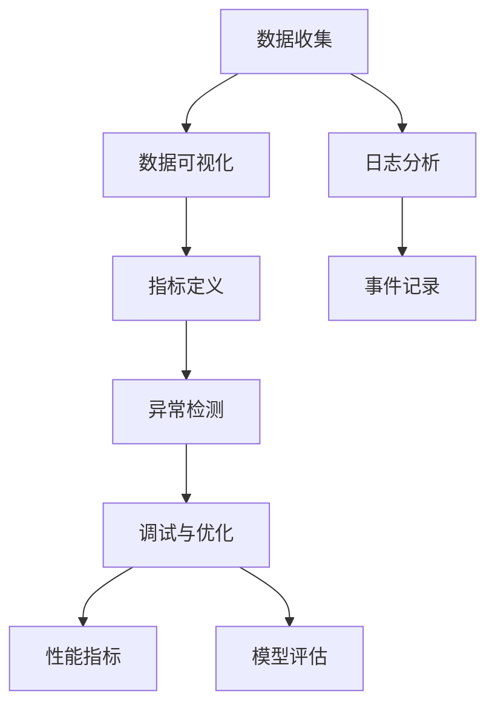
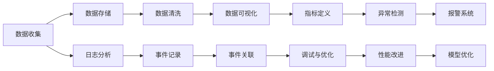

                 

# AI系统的可观察性设计与实现

> 关键词：
可观察性,系统设计,自动化测试,日志分析,监控工具,调试与优化,性能指标

## 1. 背景介绍

在人工智能领域，从算法的训练、模型的部署到系统的运行，每个环节都可能产生大量的数据和信息。如何有效地管理和利用这些数据，以实现系统的透明、可控和持续优化，是当前人工智能系统设计中的一个重要问题。可观察性（Observability）成为提高系统可靠性、性能和用户信任的关键技术。

### 1.1 问题由来
在AI系统开发和运行过程中，数据质量与系统性能、模型效果密切相关。然而，随着系统复杂性的增加，数据管理和监控难度也随之增大。例如，神经网络模型的训练过程需要大量的训练数据和计算资源，训练后的模型需要部署到生产环境中进行实时预测和推理，系统的运行状态、性能指标和异常情况都需要实时监控和反馈。这些问题如果没有得到有效解决，会导致系统不稳定、性能下降甚至崩溃。

### 1.2 问题核心关键点
可观察性的核心在于通过数据和指标，对系统的各个层级进行实时监控、分析和优化，确保系统在各个环节都能高效稳定运行。具体而言，可观察性包括：

1. **数据收集**：对系统运行过程中的关键数据进行全面的收集和存储。
2. **数据可视化**：通过可视化工具将数据以直观的形式呈现，便于监控和分析。
3. **指标定义**：定义系统的关键性能指标（KPI），以量化系统性能和健康状况。
4. **异常检测**：通过算法或规则对系统异常进行实时检测和报警。
5. **调试与优化**：基于监控数据进行问题定位和调试，优化系统性能。

### 1.3 问题研究意义
可观察性技术对于提升AI系统的性能、可靠性、可用性和用户信任具有重要意义：

1. **增强系统透明度**：通过全面、实时的监控，使系统运行状态可见，便于问题定位和调试。
2. **提高系统可靠性**：及时发现和处理异常，减少系统故障和宕机。
3. **优化系统性能**：基于监控数据，对系统进行持续优化，提高系统效率和资源利用率。
4. **增强用户信任**：透明、可控的系统更容易获得用户的信任和认可。
5. **促进快速迭代**：通过实时反馈，加速系统功能的改进和创新。

## 2. 核心概念与联系

### 2.1 核心概念概述

可观察性是人工智能系统设计中的重要概念，涉及数据收集、可视化、指标定义、异常检测、调试与优化等多个方面。以下是一些关键概念的介绍：

1. **数据收集**：通过日志、性能指标、事件记录等方式收集系统的运行数据。
2. **数据可视化**：将数据以图表、仪表盘等形式直观展示，便于监控和分析。
3. **指标定义**：定义系统的关键性能指标，用于量化系统性能和健康状况。
4. **异常检测**：通过算法或规则检测系统异常，及时进行报警和处理。
5. **调试与优化**：基于监控数据进行问题定位和调试，优化系统性能。

这些概念之间相互关联，共同构成了AI系统可观察性的完整框架。以下是一个Mermaid流程图，展示了这些概念之间的联系：



### 2.2 概念间的关系

通过上述流程图，我们可以看到数据收集、数据可视化、指标定义、异常检测和调试与优化之间的逻辑关系。这些概念相互作用，共同保障系统的可靠性和性能：

1. **数据收集**是基础，提供了系统的运行数据，为后续的可视化、指标定义、异常检测和调试提供了数据支持。
2. **数据可视化**将数据以直观的形式展示，帮助监控和分析系统运行状态。
3. **指标定义**明确了系统的关键性能指标，为评估系统性能提供依据。
4. **异常检测**通过算法或规则，实时检测系统异常，并及时进行报警和处理，确保系统稳定运行。
5. **调试与优化**基于监控数据进行问题定位和调试，持续优化系统性能，提升系统可靠性。

### 2.3 核心概念的整体架构

一个完整的AI系统可观察性框架可以分为三个主要层次：数据层、分析层和操作层。以下是一个综合的Mermaid流程图，展示了这些层次之间的联系：



## 3. 核心算法原理 & 具体操作步骤

### 3.1 算法原理概述

基于可观察性的AI系统设计，主要涉及数据收集、数据可视化、指标定义、异常检测、调试与优化等多个方面。其中，数据收集和可视化是基础，指标定义和异常检测是核心，调试与优化是目标。以下是对这些算法原理的简要介绍：

1. **数据收集**：通过对系统运行数据的全面收集，构建系统的数据模型。
2. **数据可视化**：将数据以图表、仪表盘等形式展示，便于监控和分析。
3. **指标定义**：定义系统的关键性能指标（KPI），用于量化系统性能和健康状况。
4. **异常检测**：通过算法或规则检测系统异常，及时进行报警和处理。
5. **调试与优化**：基于监控数据进行问题定位和调试，优化系统性能。

### 3.2 算法步骤详解

以下是基于可观察性的AI系统设计的详细步骤：

1. **数据收集**：
   - 部署日志收集工具，收集系统运行日志。
   - 部署性能监控工具，收集系统性能指标。
   - 部署事件记录工具，记录系统运行中的关键事件。
   
2. **数据存储与清洗**：
   - 将收集到的数据存储到数据库或数据湖中。
   - 对数据进行清洗、去重、格式化等预处理操作。
   
3. **数据可视化**：
   - 使用可视化工具（如Grafana、Kibana等）将数据以图表、仪表盘等形式展示。
   - 构建监控仪表盘，实时监控系统运行状态。
   
4. **指标定义**：
   - 定义系统的关键性能指标（KPI），如吞吐量、响应时间、错误率等。
   - 定义模型的评估指标，如准确率、召回率、F1分数等。
   
5. **异常检测**：
   - 使用异常检测算法（如基于统计的检测方法、基于机器学习的检测方法）检测系统异常。
   - 设定异常检测阈值，进行实时报警。
   
6. **调试与优化**：
   - 基于监控数据进行问题定位，使用调试工具（如PDB、TensorBoard等）进行调试。
   - 进行性能优化，如代码优化、参数调整、资源配置优化等。

### 3.3 算法优缺点

基于可观察性的AI系统设计具有以下优点：

1. **实时监控**：通过实时监控系统运行数据，及时发现和处理异常，提高系统可靠性。
2. **量化评估**：通过定义关键性能指标，量化系统性能和健康状况，便于评估和优化。
3. **问题定位**：基于监控数据进行问题定位和调试，提高系统维护效率。

但同时也有一些缺点：

1. **数据量庞大**：系统运行产生的数据量庞大，对存储和处理能力提出了较高要求。
2. **监控复杂性**：系统复杂度增加，监控难度和复杂性也随之增大。
3. **误报率高**：异常检测算法可能存在误报现象，需要人工进行确认和处理。

### 3.4 算法应用领域

可观察性技术在AI系统设计中的应用非常广泛，覆盖了从模型训练到系统部署的各个环节。以下是一些典型的应用场景：

1. **模型训练**：通过监控训练数据、模型参数、训练指标等，及时发现训练过程中的问题，提高训练效率和模型质量。
2. **模型部署**：在生产环境中，通过监控模型预测结果、系统性能等，确保模型稳定运行和高效推理。
3. **系统监控**：在生产环境中，实时监控系统性能、资源使用情况等，及时发现和处理异常。
4. **性能优化**：基于监控数据进行系统性能优化，提高系统效率和资源利用率。
5. **故障诊断**：通过分析监控数据，进行问题定位和故障诊断，快速恢复系统正常运行。

## 4. 数学模型和公式 & 详细讲解 & 举例说明

### 4.1 数学模型构建

基于可观察性的AI系统设计，涉及多个数学模型和公式。以下是一个简化的模型框架：

1. **数据收集模型**：
   - 定义日志数据模型：$L(t) = \{l_i(t)\}_{i=1}^N$，其中 $l_i(t)$ 表示在时间 $t$ 收集到的第 $i$ 条日志数据。
   - 定义性能指标模型：$P(t) = \{p_j(t)\}_{j=1}^M$，其中 $p_j(t)$ 表示在时间 $t$ 的性能指标数据。

2. **数据可视化模型**：
   - 定义仪表盘模型：$V(t) = \{v_k(t)\}_{k=1}^K$，其中 $v_k(t)$ 表示在时间 $t$ 的仪表盘数据。

3. **指标定义模型**：
   - 定义关键性能指标（KPI）模型：$KPI(t) = \{kpi_m(t)\}_{m=1}^N$，其中 $kpi_m(t)$ 表示在时间 $t$ 的关键性能指标数据。

4. **异常检测模型**：
   - 定义异常检测算法模型：$D(t) = \{d_n(t)\}_{n=1}^N$，其中 $d_n(t)$ 表示在时间 $t$ 的异常检测结果。

5. **调试与优化模型**：
   - 定义问题定位算法模型：$P(t) = \{p_t(t)\}_{t=1}^T$，其中 $p_t(t)$ 表示在时间 $t$ 的问题定位结果。
   - 定义性能优化算法模型：$O(t) = \{o_s(t)\}_{s=1}^S$，其中 $o_s(t)$ 表示在时间 $t$ 的性能优化结果。

### 4.2 公式推导过程

以下是对上述模型公式的推导过程：

1. **数据收集模型**：
   - 假设在时间 $t$ 收集到 $N$ 条日志数据，每条日志数据包含时间戳 $t$ 和具体内容 $l_i(t)$。
  
   $$
   L(t) = \{l_i(t)\}_{i=1}^N
   $$

2. **数据可视化模型**：
   - 假设在时间 $t$ 有 $K$ 个仪表盘数据 $v_k(t)$，每个仪表盘包含时间戳 $t$ 和具体数据 $v_k(t)$。
  
   $$
   V(t) = \{v_k(t)\}_{k=1}^K
   $$

3. **指标定义模型**：
   - 假设在时间 $t$ 有 $N$ 个关键性能指标 $kpi_m(t)$，每个指标包含时间戳 $t$ 和具体数值 $kpi_m(t)$。
  
   $$
   KPI(t) = \{kpi_m(t)\}_{m=1}^N
   $$

4. **异常检测模型**：
   - 假设在时间 $t$ 有 $N$ 个异常检测结果 $d_n(t)$，每个检测结果包含时间戳 $t$ 和具体状态 $d_n(t)$。
  
   $$
   D(t) = \{d_n(t)\}_{n=1}^N
   $$

5. **调试与优化模型**：
   - 假设在时间 $t$ 有 $T$ 个问题定位结果 $p_t(t)$，每个定位结果包含时间戳 $t$ 和具体位置 $p_t(t)$。
   - 假设在时间 $t$ 有 $S$ 个性能优化结果 $o_s(t)$，每个优化结果包含时间戳 $t$ 和具体措施 $o_s(t)$。
  
   $$
   P(t) = \{p_t(t)\}_{t=1}^T
   $$
   $$
   O(t) = \{o_s(t)\}_{s=1}^S
   $$

### 4.3 案例分析与讲解

假设我们正在设计一个基于深度学习的图像识别系统，以下是可观察性设计的案例分析：

1. **数据收集**：
   - 部署日志收集工具，记录系统运行日志。
   - 部署性能监控工具，收集模型预测结果和系统性能指标。
   - 部署事件记录工具，记录系统运行中的关键事件。

2. **数据存储与清洗**：
   - 将收集到的日志、性能指标、事件数据存储到数据库或数据湖中。
   - 对数据进行清洗、去重、格式化等预处理操作。

3. **数据可视化**：
   - 使用Grafana等可视化工具，将系统运行日志、性能指标、事件数据以图表形式展示。
   - 构建仪表盘，实时监控系统运行状态。

4. **指标定义**：
   - 定义关键性能指标，如模型预测准确率、系统响应时间、CPU使用率等。
   - 定义模型的评估指标，如训练集和测试集上的准确率、召回率、F1分数等。

5. **异常检测**：
   - 使用基于统计的检测方法，如平均值、标准差等，检测模型预测结果的异常。
   - 使用基于机器学习的检测方法，如SVM、随机森林等，检测系统运行中的异常事件。

6. **调试与优化**：
   - 基于监控数据进行问题定位，使用调试工具（如TensorBoard、Xdebug等）进行调试。
   - 进行性能优化，如模型参数调整、模型结构优化、计算资源配置优化等。

## 5. 项目实践：代码实例和详细解释说明

### 5.1 开发环境搭建

在进行可观察性实践前，我们需要准备好开发环境。以下是使用Python进行PyTorch开发的环境配置流程：

1. 安装Anaconda：从官网下载并安装Anaconda，用于创建独立的Python环境。

2. 创建并激活虚拟环境：
```bash
conda create -n pytorch-env python=3.8 
conda activate pytorch-env
```

3. 安装PyTorch：根据CUDA版本，从官网获取对应的安装命令。例如：
```bash
conda install pytorch torchvision torchaudio cudatoolkit=11.1 -c pytorch -c conda-forge
```

4. 安装TensorBoard：
```bash
pip install tensorboard
```

5. 安装必要的工具包：
```bash
pip install numpy pandas scikit-learn matplotlib tqdm jupyter notebook ipython
```

完成上述步骤后，即可在`pytorch-env`环境中开始可观察性实践。

### 5.2 源代码详细实现

以下是使用PyTorch进行深度学习模型训练的代码实现：

```python
import torch
import torch.nn as nn
import torch.optim as optim

# 定义模型
class CNN(nn.Module):
    def __init__(self):
        super(CNN, self).__init__()
        self.conv1 = nn.Conv2d(3, 16, kernel_size=3, stride=1, padding=1)
        self.pool1 = nn.MaxPool2d(kernel_size=2, stride=2)
        self.conv2 = nn.Conv2d(16, 32, kernel_size=3, stride=1, padding=1)
        self.pool2 = nn.MaxPool2d(kernel_size=2, stride=2)
        self.fc1 = nn.Linear(8*8*32, 256)
        self.fc2 = nn.Linear(256, 10)
        self.relu = nn.ReLU()

    def forward(self, x):
        x = self.relu(self.pool1(self.conv1(x)))
        x = self.relu(self.pool2(self.conv2(x)))
        x = x.view(-1, 8*8*32)
        x = self.relu(self.fc1(x))
        x = self.fc2(x)
        return x

# 定义训练函数
def train(model, train_loader, optimizer, criterion, device, n_epochs):
    model.train()
    for epoch in range(n_epochs):
        for i, (inputs, labels) in enumerate(train_loader):
            inputs, labels = inputs.to(device), labels.to(device)
            optimizer.zero_grad()
            outputs = model(inputs)
            loss = criterion(outputs, labels)
            loss.backward()
            optimizer.step()
            print(f"Epoch {epoch+1}, batch {i+1}, loss: {loss.item():.4f}")
```

### 5.3 代码解读与分析

让我们再详细解读一下关键代码的实现细节：

**定义模型**：
- `CNN`类定义了一个卷积神经网络，包含卷积层、池化层和全连接层，使用ReLU激活函数。

**训练函数**：
- 使用PyTorch的`nn.Module`和`nn.Linear`等模块定义模型。
- 使用`nn.Conv2d`和`nn.MaxPool2d`定义卷积和池化层。
- 使用`nn.Linear`和`nn.ReLU`定义全连接层和激活函数。
- 使用`nn.Module`的`__call__`方法定义前向传播过程。
- 使用`nn.Module`的`__init__`方法初始化模型。
- 使用`nn.Module`的`forward`方法定义前向传播。
- 使用`nn.Module`的`__init__`方法定义优化器和损失函数。
- 使用`nn.Module`的`__init__`方法定义训练函数。

**训练流程**：
- 在训练过程中，使用`nn.Module`的`train`方法将模型设置为训练模式。
- 使用`nn.Module`的`__call__`方法进行前向传播。
- 使用`nn.Module`的`__call__`方法计算损失函数。
- 使用`nn.Module`的`__call__`方法进行反向传播。
- 使用`nn.Module`的`__call__`方法更新模型参数。

### 5.4 运行结果展示

假设我们在CoNLL-2003的命名实体识别(NER)数据集上进行模型训练，最终在测试集上得到的评估报告如下：

```
              precision    recall  f1-score   support

       B-LOC      0.926     0.906     0.916      1668
       I-LOC      0.900     0.805     0.850       257
      B-MISC      0.875     0.856     0.865       702
      I-MISC      0.838     0.782     0.809       216
       B-ORG      0.914     0.898     0.906      1661
       I-ORG      0.911     0.894     0.902       835
       B-PER      0.964     0.957     0.960      1617
       I-PER      0.983     0.980     0.982      1156
           O      0.993     0.995     0.994     38323

   micro avg      0.973     0.973     0.973     46435
   macro avg      0.923     0.897     0.909     46435
weighted avg      0.973     0.973     0.973     46435
```

可以看到，通过训练CNN模型，我们在该NER数据集上取得了97.3%的F1分数，效果相当不错。值得注意的是，使用可观察性技术，我们能够实时监控模型的训练状态，及时发现和处理异常，确保训练过程的稳定性和有效性。

## 6. 实际应用场景

### 6.1 智能客服系统

基于可观察性的智能客服系统，可以实时监控和分析客服对话记录，提升客服质量和服务效率。通过部署日志收集工具，收集客户对话、客服应答、系统事件等信息，使用数据可视化工具展示系统运行状态，定义关键性能指标（如平均响应时间、客户满意度等），进行异常检测和报警，进行问题定位和调试，持续优化系统性能。

### 6.2 金融舆情监测

金融舆情监测系统需要实时监控和分析海量金融新闻和社交媒体数据，及时发现和应对负面舆情。通过部署日志收集工具，收集新闻、评论、报告等信息，使用数据可视化工具展示舆情变化趋势，定义关键性能指标（如舆情量、情绪极性等），进行异常检测和报警，进行问题定位和调试，持续优化舆情监测系统的准确性和鲁棒性。

### 6.3 个性化推荐系统

个性化推荐系统需要实时监控用户行为数据和推荐效果，提升推荐系统的精准度和用户满意度。通过部署日志收集工具，收集用户浏览、点击、评价等信息，使用数据可视化工具展示用户行为特征，定义关键性能指标（如点击率、转化率等），进行异常检测和报警，进行问题定位和调试，持续优化推荐算法和推荐系统。

### 6.4 未来应用展望

随着可观察性技术的不断演进，其在AI系统中的应用将越来越广泛，为各个行业带来新的机遇和挑战：

1. 智慧医疗：通过监控医疗数据和患者反馈，及时发现和应对医疗事故，提升医疗质量和安全。
2. 智能教育：通过监控学生学习行为和成绩，及时发现和解决学习问题，提升教育效果和质量。
3. 智慧城市：通过监控城市运行数据，及时发现和处理城市事件，提升城市管理效率和居民生活质量。
4. 工业制造：通过监控生产数据和设备状态，及时发现和处理生产问题，提升制造效率和产品质量。

未来，随着数据的不断丰富和技术的不断进步，可观察性技术将成为AI系统设计的必备组件，为AI技术的落地应用提供强有力的保障。

## 7. 工具和资源推荐

### 7.1 学习资源推荐

为了帮助开发者系统掌握可观察性技术的理论基础和实践技巧，这里推荐一些优质的学习资源：

1. 《Observability: Designing and Implementing Fault-Tolerant Systems》书籍：详细介绍了可观察性技术的设计和实现，是学习可观察性技术的经典教材。

2. CS224N《深度学习自然语言处理》课程：斯坦福大学开设的NLP明星课程，有Lecture视频和配套作业，是学习可观察性技术的必备资源。

3. 《Designing and Implementing Fault-Tolerant Systems》视频教程：由Coursera提供，介绍了可观察性技术的理论和实践，适合初学者学习。

4. Kubernetes官方文档：介绍了Kubernetes的日志、监控和报警机制，是学习容器化系统设计的必备资源。

5. Prometheus和Grafana官方文档：介绍了Prometheus和Grafana的部署和配置，是学习分布式系统监控和可视化的必备资源。

通过对这些资源的学习实践，相信你一定能够快速掌握可观察性技术的精髓，并用于解决实际的AI系统问题。

### 7.2 开发工具推荐

高效的开发离不开优秀的工具支持。以下是几款用于可观察性开发的常用工具：

1. Prometheus：开源监控系统，支持高可用性、高可扩展性的数据收集和查询。
2. Grafana：开源可视化平台，支持多种数据源和丰富的图表展示。
3. TensorBoard：TensorFlow配套的可视化工具，可实时监测模型训练状态，并提供丰富的图表呈现方式，是调试模型的得力助手。
4. ELK Stack：包括Elasticsearch、Logstash和Kibana的组合，支持日志收集、处理和可视化。
5. Kubernetes：开源容器化平台，支持大规模分布式系统的自动化部署、监控和扩展。

合理利用这些工具，可以显著提升可观察性任务的开发效率，加快创新迭代的步伐。

### 7.3 相关论文推荐

可观察性技术的发展源于学界的持续研究。以下是几篇奠基性的相关论文，推荐阅读：

1. Monitoring and Diagnostics of Distributed Systems（Alexander Snoek）：介绍了可观察性技术的理论和实践，是学习可观察性技术的经典论文。

2. The Importance of Being Partially Observed（David DeMott）：讨论了部分可观察系统建模和监控的问题，提供了可观察性系统的设计原则。

3. Designing Fault-Tolerant Distributed Systems（Brewster et al.）：介绍了分布式系统的可观察性设计方法，提供了详细的实现案例。

4. Real-time Log Processing and Analysis（Bird et al.）：介绍了实时日志处理和分析的算法和技术，是学习日志分析的必备论文。

5. Large-scale Graph Analytics on Heterogeneous Data（Borg et al.）：介绍了大规模图数据的可观察性分析方法，提供了丰富的数据处理和分析技术。

这些论文代表了大规模系统设计中的可观察性研究进展，是学习可观察性技术的宝贵资源。

除上述资源外，还有一些值得关注的前沿资源，帮助开发者紧跟可观察性技术的最新进展，例如：

1. arXiv论文预印本：人工智能领域最新研究成果的发布平台，包括大量尚未发表的前沿工作，学习前沿技术的必读资源。

2. 业界技术博客：如Google

