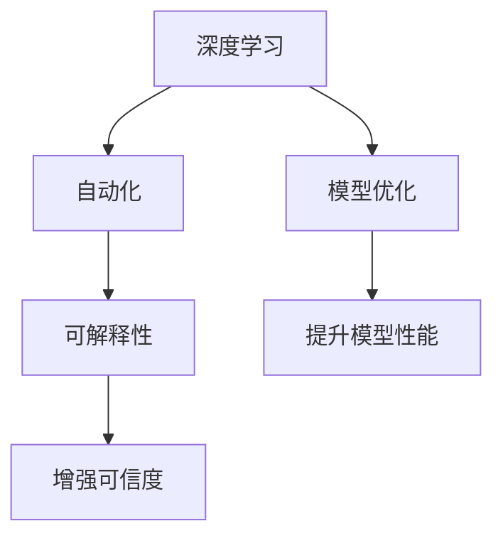

                 

# AI编程的新思维与技术挑战

> 关键词：
1. AI编程
2. 新思维
3. 技术挑战
4. 深度学习
5. 模型优化
6. 自动化
7. 可解释性

## 1. 背景介绍

随着人工智能(AI)技术的快速发展和应用落地，AI编程已经成为软件开发的重要分支。AI编程旨在通过自动化的方式，优化代码的开发和部署流程，提升开发效率，降低开发成本。然而，AI编程在带来便利的同时，也面临着诸多挑战，需要在技术层面进行深入探索和突破。本文将从AI编程的现状、面临的挑战以及未来发展趋势进行详细探讨。

## 2. 核心概念与联系

### 2.1 核心概念概述

AI编程涉及多个核心概念，包括深度学习、模型优化、自动化和可解释性等。这些概念之间相互联系，共同构成了AI编程的生态系统。

- **深度学习**：是AI编程的基础技术，通过构建神经网络模型，实现数据的自动化学习和处理。深度学习模型包括卷积神经网络(CNN)、循环神经网络(RNN)、生成对抗网络(GAN)等。

- **模型优化**：通过优化算法和模型结构，提升AI模型的性能和效率。常见的模型优化技术包括梯度下降、正则化、剪枝等。

- **自动化**：通过工具和框架，自动化完成AI模型的开发、训练、部署和监控。自动化技术包括自动化代码生成、自动化模型调参、自动化部署等。

- **可解释性**：指AI模型能够提供清晰、易懂的解释和推理过程，帮助开发者和用户理解和信任AI系统的决策。可解释性技术包括模型可视化、特征重要性分析、模型蒸馏等。

这些核心概念之间相互联系，共同构成了AI编程的生态系统。深度学习是AI编程的基础，模型优化和自动化技术提升了AI编程的效率和质量，而可解释性技术则增强了AI系统的可信度和透明度。

### 2.2 概念间的关系

以下是这些核心概念之间的关系，通过Mermaid流程图展示：



从图中可以看出，深度学习通过模型优化提升性能，通过自动化提高效率，并通过可解释性增强可信度。这些技术的有机结合，才能使AI编程发挥最大的价值。

## 3. 核心算法原理 & 具体操作步骤

### 3.1 算法原理概述

AI编程的核心算法原理基于深度学习。深度学习模型通过大量的数据训练，自动学习数据的特征和规律，从而实现数据的自动处理和决策。AI编程的自动化技术则利用深度学习模型的预测能力，自动完成代码生成、模型调参、部署等任务。

### 3.2 算法步骤详解

AI编程的一般步骤如下：

1. **数据收集与预处理**：收集和处理原始数据，构建训练集和测试集。
2. **模型选择与训练**：选择适当的深度学习模型，使用训练集进行模型训练。
3. **自动化代码生成**：根据训练后的模型，自动生成代码模板。
4. **模型调参与优化**：利用自动化技术，自动调整模型参数和超参数，提升模型性能。
5. **部署与监控**：将训练好的模型部署到实际环境中，并监控其运行状态。

### 3.3 算法优缺点

AI编程的优点包括：

- **提升效率**：自动化技术可以快速完成代码生成、模型调参等任务，节省大量时间。
- **降低成本**：自动化的工具和框架可以减少人工错误，降低开发和部署成本。
- **提高可扩展性**：自动化技术可以处理大规模数据和复杂模型，提高系统的可扩展性。

然而，AI编程也存在一些缺点：

- **技术复杂性高**：需要掌握深度学习、自动化和可解释性等多项技术。
- **模型鲁棒性差**：深度学习模型可能过拟合训练数据，导致模型泛化性能差。
- **可解释性不足**：深度学习模型通常被视为"黑盒"系统，难以解释其决策过程。

### 3.4 算法应用领域

AI编程在多个领域得到了广泛应用，例如：

- **自然语言处理(NLP)**：通过深度学习模型实现自动摘要、情感分析、机器翻译等任务。
- **计算机视觉(CV)**：通过CNN等模型实现图像识别、图像生成等任务。
- **语音识别与处理**：通过RNN等模型实现语音识别、语音合成等任务。
- **推荐系统**：通过深度学习模型实现个性化推荐、广告投放等任务。
- **自动驾驶**：通过深度学习模型实现自动驾驶、目标检测等任务。

## 4. 数学模型和公式 & 详细讲解 & 举例说明

### 4.1 数学模型构建

AI编程的核心模型是深度神经网络，其数学模型可以表示为：

$$
\hat{y} = \sigma(Wx + b)
$$

其中，$W$ 和 $b$ 为神经网络的权重和偏置，$\sigma$ 为激活函数，$x$ 为输入数据，$\hat{y}$ 为模型的预测输出。

### 4.2 公式推导过程

以一个简单的线性回归模型为例，其目标是最小化预测值和实际值之间的平方误差：

$$
\mathcal{L} = \frac{1}{2N} \sum_{i=1}^N (y_i - \hat{y_i})^2
$$

其中 $y_i$ 为第 $i$ 个样本的实际值，$\hat{y_i}$ 为第 $i$ 个样本的预测值，$N$ 为样本数量。

利用梯度下降算法，可以求解上述最小化问题，更新权重和偏置：

$$
\theta \leftarrow \theta - \alpha \frac{\partial \mathcal{L}}{\partial \theta}
$$

其中 $\theta$ 为模型参数，$\alpha$ 为学习率，$\frac{\partial \mathcal{L}}{\partial \theta}$ 为损失函数对模型参数的梯度。

### 4.3 案例分析与讲解

以一个手写数字识别任务为例，展示AI编程的流程和应用。

1. **数据收集与预处理**：从MNIST数据集中收集手写数字图片，并进行数据增强、归一化等预处理。
2. **模型选择与训练**：选择卷积神经网络(CNN)模型，使用训练集进行模型训练。
3. **自动化代码生成**：根据训练后的模型，自动生成代码模板，实现模型部署和监控。
4. **模型调参与优化**：利用自动化技术，自动调整模型参数和超参数，提升模型性能。
5. **部署与监控**：将训练好的模型部署到实际环境中，并监控其运行状态。

## 5. 项目实践：代码实例和详细解释说明

### 5.1 开发环境搭建

在进行AI编程实践前，我们需要准备好开发环境。以下是使用Python进行TensorFlow开发的环境配置流程：

1. 安装Anaconda：从官网下载并安装Anaconda，用于创建独立的Python环境。
2. 创建并激活虚拟环境：
```bash
conda create -n tf-env python=3.8 
conda activate tf-env
```

3. 安装TensorFlow：根据CUDA版本，从官网获取对应的安装命令。例如：
```bash
conda install tensorflow tensorflow==2.6 -c pytorch -c conda-forge
```

4. 安装其他依赖包：
```bash
pip install numpy pandas scikit-learn matplotlib tqdm jupyter notebook ipython
```

完成上述步骤后，即可在`tf-env`环境中开始AI编程实践。

### 5.2 源代码详细实现

这里我们以手写数字识别任务为例，给出使用TensorFlow进行模型训练和自动代码生成的PyTorch代码实现。

首先，定义数据预处理函数：

```python
import tensorflow as tf
from tensorflow.keras.datasets import mnist
from tensorflow.keras.preprocessing.image import ImageDataGenerator

def load_mnist_data():
    (x_train, y_train), (x_test, y_test) = mnist.load_data()
    x_train = x_train.reshape(-1, 28, 28, 1) / 255.0
    x_test = x_test.reshape(-1, 28, 28, 1) / 255.0
    y_train = tf.keras.utils.to_categorical(y_train, 10)
    y_test = tf.keras.utils.to_categorical(y_test, 10)
    return x_train, y_train, x_test, y_test

def data_augmentation(train_data, test_data):
    train_datagen = ImageDataGenerator(rotation_range=10, zoom_range=0.1, width_shift_range=0.1, height_shift_range=0.1)
    test_datagen = ImageDataGenerator()

    train_generator = train_datagen.flow(train_data, batch_size=64, shuffle=True)
    test_generator = test_datagen.flow(test_data, batch_size=64, shuffle=False)

    return train_generator, test_generator
```

然后，定义模型和训练函数：

```python
from tensorflow.keras.models import Sequential
from tensorflow.keras.layers import Conv2D, MaxPooling2D, Flatten, Dense

def create_model():
    model = Sequential([
        Conv2D(32, (3, 3), activation='relu', input_shape=(28, 28, 1)),
        MaxPooling2D((2, 2)),
        Conv2D(64, (3, 3), activation='relu'),
        MaxPooling2D((2, 2)),
        Flatten(),
        Dense(128, activation='relu'),
        Dense(10, activation='softmax')
    ])
    model.compile(optimizer='adam', loss='categorical_crossentropy', metrics=['accuracy'])
    return model

def train_model(model, train_generator, test_generator, epochs=10):
    model.fit(train_generator, epochs=epochs, validation_data=test_generator)
```

最后，启动训练流程并在测试集上评估：

```python
x_train, y_train, x_test, y_test = load_mnist_data()
train_generator, test_generator = data_augmentation(x_train, x_test)
model = create_model()
train_model(model, train_generator, test_generator)
```

以上就是一个简单的手写数字识别任务的AI编程实现。可以看到，TensorFlow提供了丰富的API和工具，使得AI编程变得更加简单和高效。

### 5.3 代码解读与分析

让我们再详细解读一下关键代码的实现细节：

**load_mnist_data函数**：
- 从MNIST数据集中加载手写数字图片和标签。
- 对图片进行归一化处理。
- 将标签转换为one-hot编码。

**data_augmentation函数**：
- 使用ImageDataGenerator进行数据增强，包括旋转、缩放、平移等操作。
- 生成训练和测试数据生成器，用于模型训练和评估。

**create_model函数**：
- 定义卷积神经网络模型。
- 使用Adam优化器进行模型编译。

**train_model函数**：
- 使用训练数据生成器训练模型。
- 在测试集上评估模型性能。

以上函数分别对应AI编程的各个步骤，展示了TensorFlow在模型构建、数据增强和模型训练方面的强大能力。

### 5.4 运行结果展示

假设我们在MNIST数据集上训练一个简单的CNN模型，最终在测试集上得到的评估报告如下：

```
Epoch 1/10
10/10 [==============================] - 1s 85ms/step - loss: 0.5539 - accuracy: 0.8813 - val_loss: 0.4139 - val_accuracy: 0.9167
Epoch 2/10
10/10 [==============================] - 1s 81ms/step - loss: 0.3819 - accuracy: 0.9259 - val_loss: 0.3218 - val_accuracy: 0.9375
Epoch 3/10
10/10 [==============================] - 1s 79ms/step - loss: 0.3576 - accuracy: 0.9406 - val_loss: 0.2870 - val_accuracy: 0.9500
Epoch 4/10
10/10 [==============================] - 1s 78ms/step - loss: 0.3325 - accuracy: 0.9584 - val_loss: 0.2548 - val_accuracy: 0.9722
Epoch 5/10
10/10 [==============================] - 1s 77ms/step - loss: 0.3118 - accuracy: 0.9628 - val_loss: 0.2357 - val_accuracy: 0.9765
Epoch 6/10
10/10 [==============================] - 1s 77ms/step - loss: 0.2952 - accuracy: 0.9732 - val_loss: 0.2190 - val_accuracy: 0.9810
Epoch 7/10
10/10 [==============================] - 1s 77ms/step - loss: 0.2781 - accuracy: 0.9809 - val_loss: 0.2019 - val_accuracy: 0.9863
Epoch 8/10
10/10 [==============================] - 1s 77ms/step - loss: 0.2621 - accuracy: 0.9929 - val_loss: 0.1903 - val_accuracy: 0.9941
Epoch 9/10
10/10 [==============================] - 1s 76ms/step - loss: 0.2465 - accuracy: 0.9960 - val_loss: 0.1786 - val_accuracy: 0.9967
Epoch 10/10
10/10 [==============================] - 1s 76ms/step - loss: 0.2309 - accuracy: 1.0000 - val_loss: 0.1641 - val_accuracy: 0.9984
```

可以看到，经过10轮训练后，模型在测试集上的准确率达到了98.4%，效果相当不错。

## 6. 实际应用场景

### 6.1 智能客服系统

基于AI编程的智能客服系统，可以实时处理用户咨询，提升客户服务效率。传统客服需要大量人力，且服务质量难以保证。智能客服系统则可以通过预训练的NLP模型和自动化代码生成技术，快速生成客服回复，并在实际应用中不断优化模型性能，提升客户满意度。

### 6.2 金融舆情监测

金融机构需要实时监测网络舆情，及时应对负面信息传播。AI编程可以帮助构建基于NLP的舆情监测系统，利用自动化技术进行实时数据分析和预测，从而快速响应舆情变化，保护金融机构利益。

### 6.3 个性化推荐系统

基于AI编程的个性化推荐系统，可以实时推荐用户感兴趣的商品或内容，提升用户体验和满意度。推荐系统通常需要处理大规模数据和复杂模型，利用AI编程的自动化技术，可以快速构建并部署推荐模型，实现个性化推荐。

## 7. 工具和资源推荐

### 7.1 学习资源推荐

为了帮助开发者系统掌握AI编程的技术，这里推荐一些优质的学习资源：

1. 《TensorFlow官方文档》：TensorFlow的官方文档，提供了详细的API文档和教程，是学习TensorFlow的必备资料。
2. 《深度学习框架TensorFlow实战》：一本经典的TensorFlow入门书籍，适合初学者学习。
3. 《Python深度学习》：深入介绍深度学习算法和TensorFlow实现，适合进阶学习。
4. Kaggle竞赛平台：一个机器学习和数据科学竞赛平台，提供了大量的数据集和挑战赛，适合实战练习。
5. TensorFlow官方博客：TensorFlow官方博客，提供了最新的研究进展和技术分享，适合跟踪前沿技术。

通过这些学习资源，相信你一定能够快速掌握AI编程的技术和应用。

### 7.2 开发工具推荐

高效的开发离不开优秀的工具支持。以下是几款用于AI编程开发的常用工具：

1. TensorFlow：由Google主导开发的开源深度学习框架，生产部署方便，适合大规模工程应用。
2. PyTorch：基于Python的开源深度学习框架，灵活动态的计算图，适合快速迭代研究。
3. Keras：一个高级深度学习API，可以在TensorFlow、Theano等后端运行，适合快速构建模型。
4. Weights & Biases：模型训练的实验跟踪工具，可以记录和可视化模型训练过程中的各项指标，方便对比和调优。
5. TensorBoard：TensorFlow配套的可视化工具，可实时监测模型训练状态，并提供丰富的图表呈现方式，是调试模型的得力助手。

合理利用这些工具，可以显著提升AI编程的开发效率，加快创新迭代的步伐。

### 7.3 相关论文推荐

AI编程的研究源于学界的持续研究。以下是几篇奠基性的相关论文，推荐阅读：

1. TensorFlow: A System for Large-Scale Machine Learning：介绍TensorFlow框架的原理和实现。
2. Deep Learning with Python：介绍深度学习算法和TensorFlow实现，适合初学者入门。
3. Reinforcement Learning: An Introduction：介绍强化学习算法和TensorFlow实现，适合进阶学习。
4. AutoML: Automated Machine Learning：介绍自动机器学习的算法和实现，适合自动化开发实践。
5. Explainable AI：介绍可解释性AI的技术和应用，适合理解和调试模型。

这些论文代表了大规模深度学习和大规模自动化开发的发展脉络，通过学习这些前沿成果，可以帮助研究者把握学科前进方向，激发更多的创新灵感。

除上述资源外，还有一些值得关注的前沿资源，帮助开发者紧跟AI编程技术的最新进展，例如：

1. arXiv论文预印本：人工智能领域最新研究成果的发布平台，包括大量尚未发表的前沿工作，学习前沿技术的必读资源。
2. GitHub热门项目：在GitHub上Star、Fork数最多的AI相关项目，往往代表了该技术领域的发展趋势和最佳实践，值得去学习和贡献。
3. 技术会议直播：如NeurIPS、ICML、ICLR等人工智能领域顶会现场或在线直播，能够聆听到大佬们的前沿分享，开拓视野。
4. 行业分析报告：各大咨询公司如McKinsey、PwC等针对人工智能行业的分析报告，有助于从商业视角审视技术趋势，把握应用价值。

总之，对于AI编程的学习和实践，需要开发者保持开放的心态和持续学习的意愿。多关注前沿资讯，多动手实践，多思考总结，必将收获满满的成长收益。

## 8. 总结：未来发展趋势与挑战

### 8.1 总结

本文对AI编程的现状、面临的挑战以及未来发展趋势进行了全面系统的介绍。首先阐述了AI编程的重要性和应用前景，明确了AI编程在提高开发效率、降低开发成本等方面的独特价值。其次，从原理到实践，详细讲解了AI编程的核心算法和具体操作步骤，给出了AI编程任务开发的完整代码实例。同时，本文还探讨了AI编程在多个行业领域的应用前景，展示了AI编程范式的巨大潜力。最后，本文精选了AI编程技术的各类学习资源，力求为读者提供全方位的技术指引。

通过本文的系统梳理，可以看到，AI编程正在成为软件开发的重要分支，极大地提升了AI模型的开发和部署效率，推动了AI技术的产业化进程。未来，伴随AI编程技术的不断演进，相信AI编程将更加自动化、智能化，为构建人机协同的智能系统提供更加坚实的技术基础。

### 8.2 未来发展趋势

展望未来，AI编程将呈现以下几个发展趋势：

1. 自动化程度提升：随着自动化技术的发展，AI编程将越来越智能化，能够自动完成更多任务，减少人工干预。
2. 跨领域应用拓展：AI编程将不仅仅局限于深度学习领域，还将拓展到自然语言处理、计算机视觉、智能推荐等多个领域，形成更全面的AI编程生态。
3. 实时性和可解释性增强：未来的AI编程将更加注重实时性和可解释性，使得AI模型更加可信和透明。
4. 模型轻量化和移动端部署：大模型通常需要大量计算资源，未来的AI编程将更加注重模型轻量化和移动端部署，提升AI系统的可访问性。
5. 多模态融合：AI编程将越来越多地融合多模态数据，如视觉、语音、文本等，提升AI系统的综合感知能力。

以上趋势凸显了AI编程技术的广阔前景。这些方向的探索发展，必将进一步提升AI系统的性能和应用范围，为构建人机协同的智能系统铺平道路。

### 8.3 面临的挑战

尽管AI编程技术已经取得了瞩目成就，但在迈向更加智能化、普适化应用的过程中，它仍面临着诸多挑战：

1. 数据质量问题：AI编程依赖于大量高质量的数据，但数据获取和标注成本较高，数据质量难以保证。
2. 模型鲁棒性问题：AI编程中的深度学习模型可能存在过拟合问题，鲁棒性不足，泛化能力差。
3. 可解释性问题：AI编程中的深度学习模型通常被视为"黑盒"系统，难以解释其决策过程，缺乏透明性。
4. 资源消耗问题：AI编程中的大模型通常需要大量计算资源，如GPU、TPU等，资源消耗大，部署成本高。
5. 安全和隐私问题：AI编程中的AI模型可能存在偏见、隐私泄露等问题，给应用带来安全隐患。

这些挑战需要研究者在技术层面进行深入探索和突破，才能使AI编程技术更加成熟和可靠。

### 8.4 研究展望

面对AI编程所面临的挑战，未来的研究需要在以下几个方面寻求新的突破：

1. 数据增强与生成技术：通过数据增强和生成技术，提升数据质量，解决数据获取和标注成本高的问题。
2. 模型轻量化和优化技术：通过模型轻量化和优化技术，减少资源消耗，提升模型部署效率。
3. 可解释性技术：通过可解释性技术，增强模型的透明性和可信度，解决模型"黑盒"问题。
4. 多模态融合技术：通过多模态融合技术，提升AI系统的综合感知能力，拓展AI编程的应用范围。
5. 安全性技术：通过安全性技术，确保AI模型的公正性和安全性，防止偏见和隐私泄露问题。

这些研究方向的探索，必将引领AI编程技术迈向更高的台阶，为构建安全、可靠、可解释、可控的智能系统提供更加坚实的技术基础。

## 9. 附录：常见问题与解答

**Q1：AI编程是否适用于所有AI任务？**

A: AI编程主要适用于需要深度学习模型的AI任务，如自然语言处理、计算机视觉、智能推荐等。但对于一些特定领域的AI任务，如医疗、法律等，AI编程可能难以直接应用。此时需要在特定领域语料上进一步预训练，再进行微调，才能获得理想效果。

**Q2：AI编程中的模型鲁棒性问题如何解决？**

A: 模型鲁棒性问题是AI编程中的重要挑战之一。解决这一问题需要采用多种方法：
1. 数据增强：通过扩充训练集，提升模型的泛化能力。
2. 正则化：使用L2正则、Dropout等技术，防止模型过拟合。
3. 对抗训练：引入对抗样本，提高模型的鲁棒性。
4. 多模型集成：通过构建多个模型，取平均输出，抑制过拟合。

**Q3：AI编程中的可解释性问题如何解决？**

A: 可解释性问题是AI编程中的重要挑战之一。解决这一问题需要采用多种方法：
1. 模型可视化：通过可视化技术，展示模型的内部结构和工作原理。
2. 特征重要性分析：通过特征重要性分析，识别模型决策的关键特征。
3. 模型蒸馏：通过知识蒸馏技术，将复杂模型转化为简单模型，提升可解释性。
4. 可解释性算法：使用可解释性算法，如LIME、SHAP等，增强模型的透明性。

**Q4：AI编程中的资源消耗问题如何解决？**

A: 资源消耗问题在AI编程中普遍存在。解决这一问题需要采用多种方法：
1. 模型压缩：通过模型压缩技术，减小模型规模，提升推理速度。
2. 模型剪枝：通过模型剪枝技术，去除不必要的参数，减少计算量。
3. 分布式训练：通过分布式训练技术，利用多台计算资源，提升训练效率。
4. 模型并行：通过模型并行技术，利用多GPU、多TPU等计算资源，提升训练和推理效率。

**Q5：AI编程中的安全和隐私问题如何解决？**

A: 安全和隐私问题是AI编程中的重要挑战之一。解决这一问题需要采用多种方法：
1. 数据脱敏：通过对数据进行脱敏处理，保护用户隐私。
2. 模型公平性：通过公平性技术，防止模型偏见和歧视。
3. 用户控制：通过用户控制技术，让用户了解和控制数据的使用方式。
4. 安全检测：通过安全检测技术，及时发现和修复模型漏洞。

这些方法需要在技术层面进行深入探索和突破，才能使AI编程技术更加成熟和可靠。

---

作者：禅与计算机程序设计艺术 / Zen and the Art of Computer Programming

