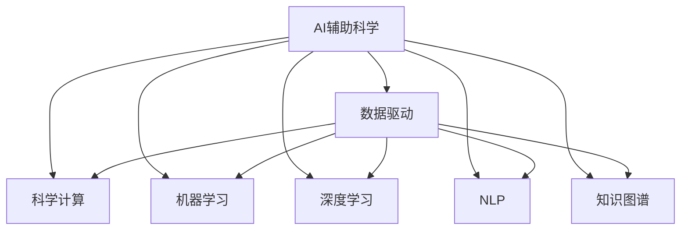
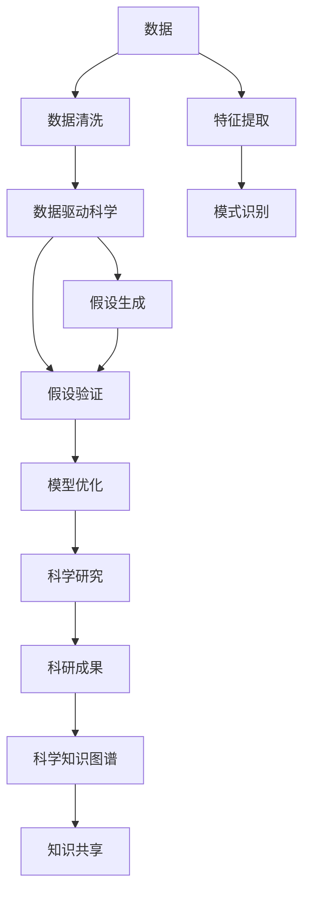

                 

# AI辅助科学研究:加速假设验证过程

> 关键词：
> - AI辅助科学
> - 假设验证
> - 加速算法
> - 数据科学
> - 机器学习
> - 科学计算
> - 深度学习

## 1. 背景介绍

### 1.1 问题由来
科学研究是人类探索未知世界的重要活动，但往往受限于实验条件和技术手段，过程繁琐且耗时。传统的科学验证方法依赖人工操作和手动分析，效率低下，且容易出错。近年来，随着人工智能（AI）和数据科学的发展，AI辅助科学（AI-Assisted Science）成为科研领域的热门话题，旨在通过智能化手段加速科学发现和验证过程。

AI辅助科学的核心思想是，利用机器学习、数据挖掘、自然语言处理等AI技术，对海量科研数据进行自动化处理和分析，辅助科学家发现潜在的科学规律和假设，加速假设验证过程，提高科研效率。

### 1.2 问题核心关键点
AI辅助科学的本质是数据驱动的科研方式。其核心关键点包括：
1. 数据处理和分析：通过数据清洗、特征提取、模式识别等技术，对科研数据进行自动化处理和分析。
2. 假设生成和验证：利用机器学习算法，基于历史数据自动生成科学假设，并通过数据验证其真实性。
3. 模型优化和迭代：根据验证结果，不断优化和迭代AI模型，提高假设验证的准确性和可靠性。
4. 跨领域融合：将AI技术与生物学、物理学、化学等多个学科融合，推动跨学科科研的发展。
5. 可解释性：使AI模型具有可解释性，帮助科学家理解和信任AI辅助的科研成果。

这些关键点共同构成了AI辅助科学的核心框架，使得科研过程更加高效、精确和可控。

### 1.3 问题研究意义
AI辅助科学对于提升科研效率、推动科学发现和创新具有重要意义：
1. 加速假设验证：通过自动化数据分析和机器学习算法，快速验证假设的真实性，缩短科研周期。
2. 降低科研成本：减少手动操作和数据处理的工作量，降低实验和分析的资源投入。
3. 提高数据利用率：利用大数据技术，从海量数据中挖掘出潜在的科学规律，避免数据浪费。
4. 推动跨学科发展：通过跨领域数据融合和知识共享，加速不同学科的交叉融合。
5. 增强科研成果的可解释性：使AI模型具有可解释性，提高科研成果的可信度和可复现性。

通过AI辅助科学，科研过程变得更加智能化、高效化和精确化，有望引领科学研究进入新纪元。

## 2. 核心概念与联系

### 2.1 核心概念概述

为更好地理解AI辅助科学，本节将介绍几个密切相关的核心概念：

- AI辅助科学：利用人工智能和数据科学技术，辅助科学家进行科研活动的全过程。
- 数据驱动科学：以数据为核心，通过自动化处理和分析，辅助科学家发现科学规律和假设。
- 科学计算：利用计算机进行科学数据的处理、分析和模拟，支持科学研究的各个环节。
- 机器学习：通过数据训练模型，使其具备自主学习和预测能力，用于数据挖掘和假设验证。
- 深度学习：一种特殊的机器学习算法，通过多层神经网络进行复杂的特征提取和模式识别。
- 自然语言处理（NLP）：使计算机能够理解、处理和生成人类语言，用于科学文献的自动化分析。
- 知识图谱：利用图结构表示和关联科学知识，辅助科学发现和推理。

这些核心概念之间的逻辑关系可以通过以下Mermaid流程图来展示：

这个流程图展示了大语言模型微调过程中各个核心概念的关系和作用：

1. AI辅助科学是数据驱动科学、科学计算、机器学习、深度学习、自然语言处理和知识图谱的综合应用。
2. 数据驱动科学通过自动化数据处理和分析，辅助科学家发现潜在的科学规律和假设。
3. 科学计算为数据驱动科学提供计算支持，包括数据处理、模拟和可视化等。
4. 机器学习和深度学习算法通过训练模型，实现数据挖掘和假设验证。
5. 自然语言处理使计算机能够理解和生成科学文本，辅助文献分析和知识抽取。
6. 知识图谱通过图结构关联科学知识，辅助科学发现和推理。

这些概念共同构成了AI辅助科学的核心框架，使得科学研究变得更加智能化和高效化。

### 2.2 概念间的关系

这些核心概念之间存在着紧密的联系，形成了AI辅助科学的全方位生态系统。下面我通过几个Mermaid流程图来展示这些概念之间的关系。

#### 2.2.1 AI辅助科学的总体框架

这个流程图展示了AI辅助科学的整体流程：

1. 从数据开始，通过数据清洗和特征提取，得到高质量的数据。
2. 利用数据驱动科学方法，生成科学假设。
3. 对科学假设进行验证，得到验证结果。
4. 根据验证结果，优化AI模型，提高假设验证的准确性和可靠性。
5. 将科研成果转化为科学知识图谱，促进知识共享。

#### 2.2.2 数据驱动科学与科学计算的关系

这个流程图展示了数据驱动科学与科学计算的关系：

1. 数据清洗是数据驱动科学的第一步，确保数据质量。
2. 科学计算为数据驱动科学提供计算支持，包括数据处理、模拟和可视化。
3. 通过科学计算，进行科学数据的处理、分析和模拟。
4. 科学模拟和可视化帮助科学家理解数据规律和模型结果。

#### 2.2.3 机器学习与深度学习的关系

这个流程图展示了机器学习和深度学习的关系：

1. 特征提取是机器学习的关键步骤，通过提取特征，使数据更具可分析性。
2. 机器学习算法通过模型训练，实现数据挖掘和假设验证。
3. 深度学习算法通过多层神经网络，实现更复杂的特征提取和模式识别。
4. 模型优化和部署确保模型在不同场景下都能发挥最佳性能。

## 3. 核心算法原理 & 具体操作步骤
### 3.1 算法原理概述

AI辅助科学的核心算法原理是数据驱动的机器学习和深度学习。其基本思想是通过数据训练模型，使模型能够自动识别数据中的模式和规律，辅助科学家进行假设验证和科学发现。具体来说，包括以下几个步骤：

1. **数据预处理**：对原始数据进行清洗、去重、标准化等处理，确保数据质量。
2. **特征提取**：通过算法提取数据中的关键特征，使得数据更具有可分析性。
3. **模型训练**：利用机器学习算法，训练模型对数据进行预测和分类，生成科学假设。
4. **假设验证**：通过实验或数据分析，验证模型的预测结果是否符合实际情况。
5. **模型优化**：根据验证结果，调整模型参数，优化模型性能。
6. **知识图谱构建**：将科研成果转化为知识图谱，促进知识共享和跨学科融合。

### 3.2 算法步骤详解

#### 3.2.1 数据预处理

数据预处理是AI辅助科学的第一步，通过数据清洗、特征提取等步骤，提高数据质量。具体步骤如下：

1. **数据清洗**：去除缺失值、异常值、重复值等，确保数据完整性和准确性。
2. **数据标准化**：对数据进行归一化、标准化等处理，使数据具有可比性。
3. **特征选择**：通过算法选择对科研结果有重要影响的特征，减少噪音和冗余。

#### 3.2.2 特征提取

特征提取是数据驱动科学的关键步骤，通过算法提取数据中的关键特征，使数据更具有可分析性。常用的特征提取算法包括：

1. **主成分分析（PCA）**：将高维数据降维到低维空间，提取主要特征。
2. **t-SNE**：将高维数据映射到低维空间，使数据分布更具有可视化性。
3. **因子分析（FA）**：通过因子分解，提取数据的本质特征。
4. **信息增益（ID3）**：基于信息熵和增益，选择对目标变量影响最大的特征。
5. **卡方检验**：通过卡方统计量，筛选出对目标变量有显著影响的特征。

#### 3.2.3 模型训练

模型训练是AI辅助科学的中心环节，通过机器学习算法，训练模型对数据进行预测和分类，生成科学假设。常用的机器学习算法包括：

1. **线性回归**：用于处理连续型数据，预测目标变量。
2. **逻辑回归**：用于处理二分类数据，预测目标变量。
3. **决策树**：通过树形结构，对数据进行分类和预测。
4. **随机森林**：通过多个决策树，提高模型的稳定性和准确性。
5. **支持向量机（SVM）**：通过核函数，将数据映射到高维空间，实现非线性分类。
6. **神经网络**：通过多层神经网络，实现复杂的特征提取和模式识别。

#### 3.2.4 假设验证

假设验证是AI辅助科学的最后一步，通过实验或数据分析，验证模型的预测结果是否符合实际情况。常用的假设验证方法包括：

1. **交叉验证**：将数据集分成训练集和测试集，交叉验证模型的预测性能。
2. **统计假设检验**：通过统计学方法，检验模型预测结果的显著性。
3. **真实实验**：通过实际实验，验证模型预测结果的正确性。
4. **模拟实验**：通过仿真模拟，评估模型预测结果的可靠性。

#### 3.2.5 模型优化

模型优化是AI辅助科学的迭代过程，根据验证结果，调整模型参数，优化模型性能。常用的模型优化方法包括：

1. **梯度下降法**：通过计算梯度，逐步调整模型参数，最小化预测误差。
2. **正则化方法**：通过L1、L2正则化，防止过拟合，提高模型泛化能力。
3. **交叉验证优化**：通过交叉验证，选择最优模型参数。
4. **超参数优化**：通过网格搜索、贝叶斯优化等方法，优化模型超参数。

#### 3.2.6 知识图谱构建

知识图谱构建是AI辅助科学的重要应用，将科研成果转化为知识图谱，促进知识共享和跨学科融合。常用的知识图谱构建方法包括：

1. **图谱生成算法**：通过算法自动生成知识图谱，涵盖数据中的实体和关系。
2. **知识抽取算法**：通过NLP技术，从科研文献中抽取实体和关系，构建知识图谱。
3. **本体映射算法**：通过映射规则，将不同数据源的知识图谱进行融合。
4. **可视化技术**：通过可视化工具，展示知识图谱的结构和关系。

### 3.3 算法优缺点

AI辅助科学作为一种数据驱动的科研方法，具有以下优点：

1. **高效性**：通过自动化数据处理和分析，显著提升科研效率。
2. **精确性**：利用机器学习算法，提高数据挖掘和假设验证的准确性。
3. **泛化性**：模型可应用于不同领域和数据集，具有较强的泛化能力。
4. **可扩展性**：通过大数据技术，处理海量数据，实现科学发现的多样化和复杂化。

同时，AI辅助科学也存在一些缺点：

1. **依赖数据质量**：数据预处理和特征提取需要高质量的数据，否则难以得出有意义的结论。
2. **模型复杂性**：机器学习算法复杂，需要较高的计算资源和专业技能。
3. **可解释性**：模型缺乏可解释性，难以理解和信任AI辅助的科研成果。
4. **伦理和安全**：AI算法可能存在偏见和歧视，需要严格监控和审查。

尽管存在这些缺点，但AI辅助科学仍然在科研领域得到了广泛应用，显示出其强大的潜力和前景。

### 3.4 算法应用领域

AI辅助科学在多个科研领域得到了广泛应用，包括但不限于：

- 生命科学：用于基因组分析、蛋白质结构预测、药物研发等。
- 天文学：用于星系演化、黑洞探测、暗物质研究等。
- 地球科学：用于地震预测、气候变化、环境监测等。
- 物理学：用于粒子物理、天体物理、高能物理等。
- 化学：用于分子模拟、材料设计、化学反应预测等。
- 工程学：用于结构优化、机械设计、工业制造等。
- 经济学：用于市场预测、金融分析、行为研究等。
- 社会科学：用于公共政策、社会网络、心理研究等。

AI辅助科学的应用领域非常广泛，涉及各个学科和行业，为科研提供了全新的视角和方法。

## 4. 数学模型和公式 & 详细讲解  
### 4.1 数学模型构建

在AI辅助科学中，我们通常使用以下数学模型进行假设验证和模型训练：

1. **线性回归模型**：用于处理连续型数据，预测目标变量。模型形式为 $y = \theta_0 + \theta_1 x_1 + \theta_2 x_2 + \cdots + \theta_n x_n$，其中 $y$ 为目标变量，$x_i$ 为特征变量，$\theta$ 为模型参数。

2. **逻辑回归模型**：用于处理二分类数据，预测目标变量。模型形式为 $P(y=1|\mathbf{x}) = \frac{1}{1+\exp(-\mathbf{w} \cdot \mathbf{x} + b)}$，其中 $\mathbf{x}$ 为特征向量，$\mathbf{w}$ 和 $b$ 为模型参数。

3. **决策树模型**：通过树形结构，对数据进行分类和预测。模型形式为 $T(x)$ = $T_k(x)$，其中 $T_k$ 为第 $k$ 层决策树，$x$ 为输入数据。

4. **随机森林模型**：通过多个决策树，提高模型的稳定性和准确性。模型形式为 $T(x)$ = $T_k(x)$，其中 $T_k$ 为第 $k$ 层决策树，$x$ 为输入数据。

5. **支持向量机模型**：通过核函数，将数据映射到高维空间，实现非线性分类。模型形式为 $f(x) = \sum_{i=1}^n \alpha_i y_i \phi(x_i) \cdot x + b$，其中 $\alpha_i$ 和 $y_i$ 为支持向量，$\phi$ 为核函数，$x$ 为输入数据，$b$ 为偏置项。

6. **神经网络模型**：通过多层神经网络，实现复杂的特征提取和模式识别。模型形式为 $h_i = \sigma(\sum_{j=1}^m w_{ij}x_j + b_i)$，其中 $h_i$ 为第 $i$ 层神经元输出，$w_{ij}$ 和 $b_i$ 为参数，$\sigma$ 为激活函数。

### 4.2 公式推导过程

#### 4.2.1 线性回归模型

线性回归模型是AI辅助科学中最常用的模型之一，用于处理连续型数据，预测目标变量。其推导过程如下：

1. 假设数据集为 $(x_i, y_i)$，其中 $x_i$ 为输入数据，$y_i$ 为目标变量。
2. 线性回归模型的假设为 $y = \theta_0 + \theta_1 x_1 + \theta_2 x_2 + \cdots + \theta_n x_n$，其中 $\theta$ 为模型参数。
3. 最小二乘法求解模型参数，目标函数为 $\sum_{i=1}^n (y_i - \hat{y}_i)^2$，其中 $\hat{y}_i$ 为模型预测值。
4. 最小二乘法的解为 $\theta = (\mathbf{X}^T \mathbf{X})^{-1} \mathbf{X}^T \mathbf{y}$，其中 $\mathbf{X} = [x_{1,1} x_{2,1} \cdots x_{n,1}]$ 为输入数据的特征矩阵。

#### 4.2.2 逻辑回归模型

逻辑回归模型是二分类问题中最常用的模型之一，用于预测目标变量是否为正类。其推导过程如下：

1. 假设数据集为 $(x_i, y_i)$，其中 $x_i$ 为输入数据，$y_i$ 为目标变量（$0$ 或 $1$）。
2. 逻辑回归模型的假设为 $P(y=1|\mathbf{x}) = \frac{1}{1+\exp(-\mathbf{w} \cdot \mathbf{x} + b)}$，其中 $\mathbf{x}$ 为特征向量，$\mathbf{w}$ 和 $b$ 为模型参数。
3. 目标函数为 $-\sum_{i=1}^n y_i \log P(y=1|\mathbf{x}) + (1-y_i) \log (1-P(y=1|\mathbf{x}))$。
4. 通过梯度下降法求解模型参数，目标函数为 $\frac{\partial \mathcal{L}}{\partial \mathbf{w}} = -\frac{1}{n} \sum_{i=1}^n (y_i - P(y=1|\mathbf{x})) \mathbf{x}$，其中 $n$ 为样本数。

#### 4.2.3 决策树模型

决策树模型通过树形结构，对数据进行分类和预测。其推导过程如下：

1. 假设数据集为 $(x_i, y_i)$，其中 $x_i$ 为输入数据，$y_i$ 为目标变量。
2. 决策树模型的假设为 $T(x)$ = $T_k(x)$，其中 $T_k$ 为第 $k$ 层决策树，$x$ 为输入数据。
3. 通过信息增益或基尼指数选择最优特征进行分裂。
4. 决策树模型通过递归分裂，构建完整的树形结构。

#### 4.2.4 随机森林模型

随机森林模型通过多个决策树，提高模型的稳定性和准确性。其推导过程如下：

1. 假设数据集为 $(x_i, y_i)$，其中 $x_i$ 为输入数据，$y_i$ 为目标变量。
2. 随机森林模型的假设为 $T(x)$ = $T_k(x)$，其中 $T_k$ 为第 $k$ 层决策树，$x$ 为输入数据。
3. 通过随机采样和随机特征选择，生成多个决策树。
4. 随机森林模型通过投票或平均，得到最终预测结果。

#### 4.2.5 支持向量机模型

支持向量机模型通过核函数，将数据映射到高维空间，实现非线性分类。其推导过程如下：

1. 假设数据集为 $(x_i, y_i)$，其中 $x_i$ 为输入数据，$y_i$ 为目标变量。
2. 支持向量机模型的假设为 $f(x) = \sum_{i=1}^n \alpha_i y_i \phi(x_i) \cdot x + b$，其中 $\alpha_i$ 和 $y_i$ 为支持向量，$\phi$ 为核函数，$x$ 为输入数据，$b$ 为偏置项。
3. 目标函数为 $\frac{1}{2} ||\mathbf{w}||^2 - \sum_{i=1}^n y_i (\mathbf{w} \cdot \phi(x_i) + b)$。
4. 通过拉格朗日乘子法求解模型参数。

#### 4.2.6 神经网络模型

神经网络模型通过多层神经网络，实现复杂的特征提取和模式识别。其推导过程如下：

1. 假设数据集为 $(x_i, y_i)$，其中 $x_i$ 为输入数据，$y_i$ 为目标变量。
2. 神经网络模型的假设为 $h_i = \sigma(\sum_{j=1}^m w_{ij}x_j + b_i)$，其中 $h_i$ 为第 $i$ 层神经元输出，$w_{ij}$ 和 $b_i$ 为参数，$\sigma$ 为激活函数。
3. 神经网络模型的目标函数为 $\mathcal{L}(\mathbf{w}, b) = \frac{1}{n} \sum_{i=1}^n \mathcal{L}(h_i, y_i)$，其中 $\mathcal{L}$ 为损失函数。
4. 通过梯度下降法求解模型参数。

### 4.3 案例分析与讲解

以深度学习在基因组分析中的应用为例，具体分析其数学模型和推导过程：

#### 4.3.1 数据预处理

基因组分析的数据通常是高维的，需要进行预处理以提高数据质量。常用的预处理方法包括：

1. **数据清洗**：去除缺失值、异常值、重复值等，确保数据完整性和准确性。
2. **数据标准化**：对数据进行归一化、标准化等处理，使数据具有可比性。
3. **特征选择**：通过算法选择对科研结果有重要影响的特征，减少噪音和冗余。

#### 4.3.2 特征提取

特征提取是基因组分析中的关键步骤，通过算法提取数据中的关键特征，使数据更具有可分析性。常用的特征提取算法包括：

1. **主成分分析（PCA）**：将高维数据降维到低维空间，提取主要特征。
2. **t-SNE**：将高维数据映射到低维空间，使数据分布更具有可视化性。
3. **因子分析（FA）**：通过因子分解，提取数据的本质特征。
4. **信息增益（ID3）**：基于信息熵和增益，选择对目标变量影响最大的特征。
5. **卡方检验**：通过卡方统计量，筛选出对目标变量有显著影响的特征。

#### 4.3.3 模型训练

模型训练是基因组分析中的中心环节，通过机器学习算法，训练模型对数据进行预测和分类，生成科学假设。常用的机器学习算法包括：

1. **线性回归**：用于处理连续型数据，预测目标变量。
2. **逻辑回归**：用于处理二分类数据，预测目标变量。
3. **决策树**：通过树形结构，对数据进行分类和预测。
4. **随机森林**：通过多个决策树，提高模型的稳定性和准确性。
5. **支持向量机（SVM）**：通过核函数，将数据映射到高维空间，实现非线性分类。
6. **神经网络**：通过多层神经网络，实现复杂的特征提取和模式识别。

#### 4.3.4 假设验证

假设验证是基因组分析的最后一步，通过实验或数据分析，验证模型的预测结果是否符合实际情况。常用的假设验证方法包括：

1. **交叉验证**：将数据集分成训练集和测试集，交叉验证模型的预测性能。
2. **统计假设检验**：通过统计学方法，检验模型预测结果的显著性。
3. **真实实验**：通过实际实验，验证模型预测结果的正确性。
4. **模拟实验**：通过仿真模拟，评估模型预测结果的可靠性。

#### 4.3.5 模型优化

模型优化是基因组分析的迭代过程，根据验证结果，调整模型参数，优化模型性能。常用的模型优化方法包括：

1. **梯度下降法**：通过计算梯度，逐步调整模型参数，最小化预测误差。
2. **正则化方法**：通过L1、L2正则化，防止过拟合，提高模型泛化能力。
3. **交叉验证优化**：通过交叉验证，选择最优模型参数。
4. **超参数优化**：通过网格搜索、贝叶斯优化等方法，优化模型超参数。

#### 4.3.6 知识图谱构建

知识图谱构建是基因组分析的重要应用，将科研成果转化为知识图谱，促进知识共享和跨学科融合。常用的知识图谱构建方法包括：

1. **图谱生成算法**：通过算法自动生成知识图谱，涵盖数据中的实体和关系。
2. **知识抽取算法**：通过NLP技术，从科研文献中抽取实体和关系，构建知识图

