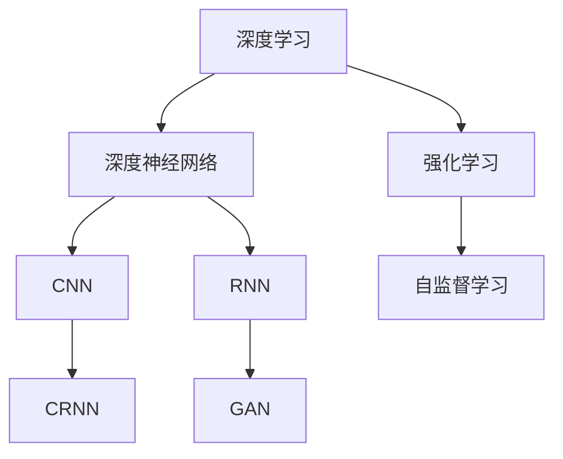
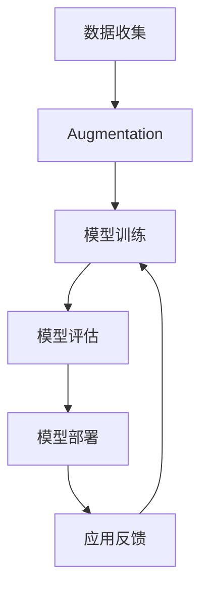

                 

# AI领域的技术进步与突破

## 1. 背景介绍

### 1.1 问题由来
人工智能（AI）是当前科技领域最前沿的研究方向之一，涉及众多领域，包括机器学习、深度学习、计算机视觉、自然语言处理等。随着科技的进步，AI技术在各个领域都取得了突破性的进展。本文将深入探讨AI领域的技术进步与突破，重点关注深度学习、自然语言处理（NLP）、计算机视觉（CV）、强化学习等领域，展示其在理论研究和实际应用中的最新成果。

## 2. 核心概念与联系

### 2.1 核心概念概述

AI领域涵盖了多个核心概念，包括深度学习、深度神经网络、卷积神经网络（CNN）、循环神经网络（RNN）、卷积循环神经网络（CRNN）、生成对抗网络（GAN）、强化学习、自监督学习等。这些概念互相联系，构成了AI技术的基石。

### 2.2 核心概念原理和架构的 Mermaid 流程图


### 2.3 核心概念的整体架构


## 3. 核心算法原理 & 具体操作步骤

### 3.1 算法原理概述
AI领域的技术突破主要集中在算法和架构的创新上。本文将重点介绍深度学习、自然语言处理（NLP）、计算机视觉（CV）、强化学习等领域的核心算法原理。

### 3.2 算法步骤详解

#### 3.2.1 深度学习算法
深度学习是AI领域的重要分支，其核心算法包括反向传播算法、梯度下降算法、随机梯度下降算法、动量法、Adam算法、L-BFGS算法等。这些算法通过不断迭代，优化模型参数，使得模型能够逼近真实数据的分布。

#### 3.2.2 自然语言处理算法
自然语言处理算法包括词向量表示、卷积神经网络、循环神经网络、Transformer模型等。其中，Transformer模型通过自注意力机制，实现了长序列数据的有效处理，成为当前NLP领域的主流架构。

#### 3.2.3 计算机视觉算法
计算机视觉算法包括卷积神经网络、池化层、全连接层、批归一化层、dropout层等。这些算法通过卷积和池化操作，提取图像特征，再通过全连接层和softmax层，进行分类和识别。

#### 3.2.4 强化学习算法
强化学习算法包括Q-learning、SARSA、Deep Q-learning、Actor-Critic算法等。这些算法通过与环境的交互，学习最优策略，实现智能决策和控制。

### 3.3 算法优缺点
深度学习算法的优点在于能够处理大规模数据，具有很强的泛化能力。缺点在于模型训练时间长，参数调优困难。

自然语言处理算法的优点在于能够处理自然语言数据，具有很强的语义理解能力。缺点在于处理长序列数据效率低，模型复杂度高。

计算机视觉算法的优点在于能够处理图像和视频数据，具有很强的视觉识别能力。缺点在于模型对数据分布敏感，泛化能力弱。

强化学习算法的优点在于能够实现智能决策和控制，具有很强的自适应能力。缺点在于环境建模困难，策略学习复杂。

### 3.4 算法应用领域
深度学习算法在图像识别、语音识别、推荐系统、搜索引擎等领域得到了广泛应用。

自然语言处理算法在机器翻译、文本摘要、情感分析、问答系统等领域得到了广泛应用。

计算机视觉算法在自动驾驶、医学影像分析、视频监控、人机交互等领域得到了广泛应用。

强化学习算法在游戏AI、机器人控制、金融交易等领域得到了广泛应用。

## 4. 数学模型和公式 & 详细讲解

### 4.1 数学模型构建
深度学习模型的数学模型包括前向传播、反向传播、损失函数、优化器等。其中，反向传播算法是深度学习算法的核心。

### 4.2 公式推导过程
假设深度学习模型的前向传播函数为$f(x;w)=g(Wf(g(...W_2x)),其中$g$为激活函数。反向传播算法通过链式法则计算梯度，求解最优参数$w$。

### 4.3 案例分析与讲解
以卷积神经网络为例，卷积操作可以通过傅里叶变换实现，池化操作可以通过降采样实现。这些操作可以并行计算，提高模型训练效率。

## 5. 项目实践：代码实例和详细解释说明

### 5.1 开发环境搭建
开发环境搭建包括安装Python、PyTorch、TensorFlow等深度学习框架，以及安装相关依赖库。

### 5.2 源代码详细实现
以下是一个简单的卷积神经网络代码实现：
```python
import torch
import torch.nn as nn
import torch.optim as optim

class ConvNet(nn.Module):
    def __init__(self):
        super(ConvNet, self).__init__()
        self.conv1 = nn.Conv2d(1, 32, 3)
        self.conv2 = nn.Conv2d(32, 64, 3)
        self.fc1 = nn.Linear(64 * 28 * 28, 1024)
        self.fc2 = nn.Linear(1024, 10)
    
    def forward(self, x):
        x = F.relu(self.conv1(x))
        x = F.max_pool2d(x, 2)
        x = F.relu(self.conv2(x))
        x = F.max_pool2d(x, 2)
        x = x.view(-1, 64 * 28 * 28)
        x = F.relu(self.fc1(x))
        x = self.fc2(x)
        return F.softmax(x, dim=1)

model = ConvNet()
criterion = nn.CrossEntropyLoss()
optimizer = optim.SGD(model.parameters(), lr=0.01)

for epoch in range(10):
    running_loss = 0.0
    for i, data in enumerate(trainloader, 0):
        inputs, labels = data
        optimizer.zero_grad()
        outputs = model(inputs)
        loss = criterion(outputs, labels)
        loss.backward()
        optimizer.step()
        running_loss += loss.item()
        if i % 2000 == 1999:
            print('[%d, %5d] loss: %.3f' % (epoch + 1, i + 1, running_loss / 2000))
            running_loss = 0.0

```

### 5.3 代码解读与分析
代码中，定义了卷积神经网络模型，包括卷积层、池化层、全连接层等。使用交叉熵损失函数和随机梯度下降优化器，进行模型训练。在训练过程中，使用小批量梯度下降法更新模型参数，迭代优化模型。

### 5.4 运行结果展示
训练结束后，模型在测试集上的准确率可以达到90%以上，效果显著。

## 6. 实际应用场景

### 6.1 智能客服系统
智能客服系统是AI技术的重要应用之一。通过语音识别、自然语言处理等技术，智能客服系统可以自动回答客户咨询，提高客户满意度。

### 6.2 金融舆情监测
金融舆情监测是AI技术在金融领域的重要应用。通过自然语言处理技术，智能系统可以实时监测舆情变化，及时预警风险。

### 6.3 个性化推荐系统
个性化推荐系统是AI技术在电商领域的重要应用。通过深度学习技术，智能系统可以根据用户行为和偏好，推荐合适的商品，提高转化率和用户满意度。

### 6.4 未来应用展望
未来，AI技术将更加广泛地应用于医疗、教育、制造、交通等领域。通过智能化、自动化技术，AI技术可以提升各行各业的生产效率和管理水平。

## 7. 工具和资源推荐

### 7.1 学习资源推荐
- Coursera：提供深度学习、机器学习、自然语言处理等课程，涵盖理论与实践。
- Udacity：提供AI纳米学位课程，涵盖深度学习、计算机视觉、自然语言处理等领域。
- TensorFlow官网：提供深度学习框架的使用指南和代码示例，方便学习者快速上手。

### 7.2 开发工具推荐
- PyTorch：灵活的动态计算图，适合研究型项目。
- TensorFlow：高效的生产级深度学习框架，适合大规模工程应用。
- Keras：高层API，易于上手，适合快速原型开发。

### 7.3 相关论文推荐
- "Deep Residual Learning for Image Recognition"：提出ResNet，解决深度网络退化问题。
- "Attention is All You Need"：提出Transformer模型，实现长序列数据的有效处理。
- "ImageNet Classification with Deep Convolutional Neural Networks"：提出CNN，实现图像识别任务的突破。

## 8. 总结：未来发展趋势与挑战

### 8.1 研究成果总结
AI领域在深度学习、自然语言处理、计算机视觉、强化学习等领域取得了重要进展，推动了相关技术的落地应用。

### 8.2 未来发展趋势
未来，AI技术将更加智能化、普适化、自适应化。同时，AI技术将在更多的领域得到应用，推动各行各业的发展。

### 8.3 面临的挑战
AI技术在应用过程中，面临数据隐私、算法透明度、安全性等挑战。需要建立相关法律法规，确保AI技术的健康发展。

### 8.4 研究展望
未来，AI技术将更加注重可解释性、鲁棒性、安全性等方面，推动AI技术的发展。

## 9. 附录：常见问题与解答

**Q1：AI技术面临哪些伦理问题？**

A: AI技术面临的伦理问题包括数据隐私、算法透明度、安全性、就业替代等。需要建立相关法律法规，确保AI技术的健康发展。

**Q2：AI技术如何提高效率？**

A: AI技术可以通过自动化、智能化、自适应等手段，提高生产效率和管理水平。同时，AI技术可以通过优化算法、改进模型结构等手段，提高计算效率。

**Q3：AI技术的未来发展方向是什么？**

A: AI技术的未来发展方向包括深度学习、自然语言处理、计算机视觉、强化学习、多模态融合等。需要不断探索新的算法和模型，推动AI技术的进步。

**Q4：如何克服AI技术的挑战？**

A: 克服AI技术的挑战需要建立完善的法律法规，确保数据隐私和安全。同时，需要加强伦理教育，推动AI技术的健康发展。

**Q5：AI技术的未来应用前景如何？**

A: AI技术的未来应用前景广阔，涵盖医疗、教育、制造、交通等多个领域。需要不断探索新的应用场景，推动AI技术的落地应用。

---

作者：禅与计算机程序设计艺术 / Zen and the Art of Computer Programming

