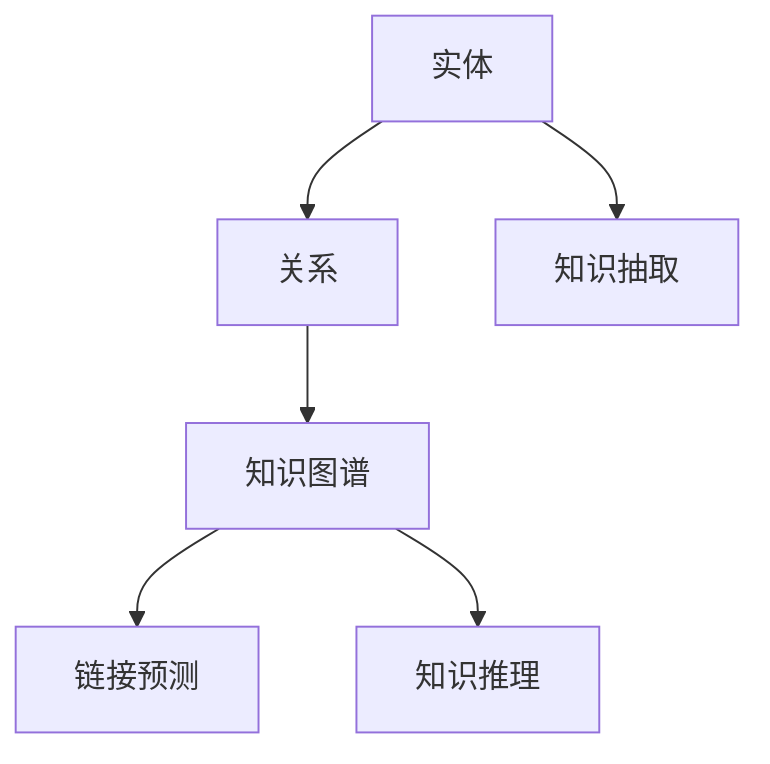
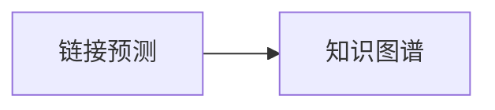

                 

# AI驱动的企业知识图谱构建

> 关键词：企业知识图谱，人工智能，自然语言处理，知识抽取，链接预测，知识推理

## 1. 背景介绍

### 1.1 问题由来
随着信息时代的到来，企业面临日益增长的数据量，尤其是非结构化的文本和半结构化数据，例如新闻文章、客户评论、财务报告、专利文献、产品文档等。这些数据蕴含着丰富的知识，能够为企业提供决策支持，但传统的文本处理方式无法直接有效利用这些知识。

因此，企业知识图谱（Knowledge Graph）成为了一种新兴的信息表示和知识管理方式，通过构建实体-关系-实体（RDF）的三元组形式的知识结构，能够更好地组织和利用知识。

### 1.2 问题核心关键点
企业知识图谱构建的核心目标是将企业内的文本数据转化为结构化的知识表示，其主要过程包括知识抽取、链接预测和知识推理三个步骤。

1. **知识抽取**：从文本中提取出实体和关系，构建知识图谱的基础结构。
2. **链接预测**：根据已有的知识图谱，预测未知的关系或实体，补充完善知识图谱。
3. **知识推理**：利用已有的知识图谱进行推理，发现隐藏的知识和关系，支持企业决策。

### 1.3 问题研究意义
企业知识图谱的应用对企业的战略决策、产品开发、客户服务、风险管理等方面具有重要意义：

1. **数据驱动决策**：通过整合多源数据，提升决策的科学性和准确性。
2. **智能客户服务**：利用知识图谱进行智能问答和推荐，提升客户体验。
3. **自动化运营**：通过自动化知识抽取和推理，降低运营成本，提高效率。
4. **风险管理**：实时监控和预测企业风险，保障企业健康发展。

因此，研究基于人工智能（AI）的企业知识图谱构建方法，对于企业的智能化转型和知识管理具有重要价值。

## 2. 核心概念与联系

### 2.1 核心概念概述

企业知识图谱构建涉及多个核心概念，这些概念相互关联，共同构建了一个完整的信息知识体系。

- **实体（Entity）**：指的是文本中具有独立意义的名词或名词短语，例如“华为”、“智能手机”等。
- **关系（Relation）**：实体之间的语义联系，例如“研发”、“销售”等。
- **知识图谱（Knowledge Graph）**：由实体和关系构成，表示实体之间的关系网络。
- **知识抽取（Knowledge Extraction）**：从文本中自动抽取实体和关系的过程。
- **链接预测（Link Prediction）**：在已有知识图谱的基础上，预测未知的关系或实体。
- **知识推理（Knowledge Reasoning）**：利用知识图谱进行逻辑推理，发现隐藏的知识和关系。

这些概念之间的逻辑关系可以通过以下Mermaid流程图来展示：



### 2.2 概念间的关系

这些核心概念之间的关系密切，形成一个闭环，从知识抽取开始，通过链接预测补充完善知识图谱，最终利用知识推理进行逻辑推理，发现隐藏的知识。

以下我们通过两个Mermaid流程图来展示这些概念之间的关系：

#### 2.2.1 知识抽取与知识图谱构建


#### 2.2.2 链接预测与知识图谱补充


## 3. 核心算法原理 & 具体操作步骤
### 3.1 算法原理概述

基于人工智能的企业知识图谱构建方法主要分为知识抽取、链接预测和知识推理三个步骤。

1. **知识抽取**：通过自然语言处理（NLP）技术，从文本中自动抽取实体和关系。
2. **链接预测**：利用机器学习或深度学习模型，预测未知的关系或实体，补充完善知识图谱。
3. **知识推理**：通过推理引擎，利用知识图谱进行逻辑推理，发现隐藏的知识和关系。

### 3.2 算法步骤详解

#### 3.2.1 知识抽取
知识抽取是构建知识图谱的基础，主要步骤如下：

1. **命名实体识别（Named Entity Recognition, NER）**：识别文本中的实体，如人名、地名、组织名等。
2. **关系抽取（Relation Extraction）**：识别文本中的关系，如“谁”与“谁”之间的关系。
3. **实体类型标注（Entity Type Tagging）**：对实体进行类型标注，如人名、地点、组织等。

#### 3.2.2 链接预测
链接预测是补充完善知识图谱的重要步骤，主要步骤如下：

1. **图嵌入（Graph Embedding）**：将知识图谱中的实体和关系映射到低维向量空间中，方便计算。
2. **关系预测（Link Prediction）**：利用机器学习或深度学习模型，预测未知的关系或实体。
3. **融合实体嵌入（Fusion of Entity Embedding）**：将已有的知识图谱和新的预测结果进行融合，更新知识图谱。

#### 3.2.3 知识推理
知识推理是利用知识图谱进行逻辑推理，发现隐藏的知识和关系。主要步骤如下：

1. **图神经网络（Graph Neural Network, GNN）**：构建图神经网络模型，对知识图谱进行推理。
2. **规则推理（Rule-based Reasoning）**：通过推理规则，对知识图谱进行逻辑推理。
3. **基于深度学习的推理（Deep Learning-based Reasoning）**：利用深度学习模型，对知识图谱进行推理。

### 3.3 算法优缺点
基于人工智能的企业知识图谱构建方法具有以下优点：

1. **自动抽取和更新**：通过自动抽取和更新知识图谱，能够快速响应数据变化，保持知识的时效性。
2. **高效性**：利用机器学习和深度学习技术，能够高效处理大量文本数据，快速构建知识图谱。
3. **泛化能力强**：能够处理多种类型的文本数据，如新闻、专利、客户评论等。

但同时也存在以下缺点：

1. **数据依赖性强**：需要大量的标注数据来训练模型，数据质量对构建效果有重要影响。
2. **模型复杂度高**：使用的机器学习和深度学习模型较为复杂，模型训练和推理需要较高的计算资源。
3. **效果不稳定**：模型的效果可能受到训练数据和超参数的影响，有时需要进行多次调参。

### 3.4 算法应用领域
基于人工智能的企业知识图谱构建方法在多个领域得到了广泛应用，例如：

1. **企业决策支持**：通过整合企业内部和外部的多源数据，支持企业决策。
2. **客户服务**：利用知识图谱进行智能问答和推荐，提升客户体验。
3. **产品开发**：利用知识图谱进行技术趋势分析，支持产品开发。
4. **风险管理**：实时监控和预测企业风险，保障企业健康发展。

## 4. 数学模型和公式 & 详细讲解  
### 4.1 数学模型构建

本节将使用数学语言对基于人工智能的企业知识图谱构建方法进行更加严格的刻画。

记企业知识图谱为 $\mathcal{G}=(\mathcal{E}, \mathcal{R}, \mathcal{T})$，其中 $\mathcal{E}$ 为实体集合，$\mathcal{R}$ 为关系集合，$\mathcal{T}$ 为三元组集合。

定义知识抽取任务为 $\mathcal{E}=\{(e_1,e_2,e_3,...)\}$，其中 $e_i=(r_1,r_2,e_4,...)$ 表示三元组。

定义链接预测任务为 $\mathcal{T}=\{(t_1,t_2,t_3,...)\}$，其中 $t_i=(e_{i_1},e_{i_2},r_i)$ 表示三元组。

定义知识推理任务为 $\mathcal{R}'=\{(r_{i_1},r_{i_2},r_{i_3},...)\}$，其中 $r_i=(r_{i_1},e_{i_2},e_{i_3},...)$ 表示推理规则。

### 4.2 公式推导过程

以下我们以知识抽取任务为例，推导命名实体识别（NER）和关系抽取（RE）的数学公式。

假设文本 $d$ 中的实体和关系被标记为 $(e_1,e_2,...,e_n)$ 和 $(r_1,r_2,...,r_m)$，则命名实体识别任务的数学模型为：

$$
P(E|d) = \prod_{i=1}^{n}P(e_i|d)
$$

其中 $P(e_i|d)$ 表示实体 $e_i$ 在文本 $d$ 中的概率，可以通过条件概率模型 $P(e_i|d)=\frac{P(e_i)P(d|e_i)}{P(d)}$ 计算得到。

关系抽取任务的数学模型为：

$$
P(R|d) = \prod_{i=1}^{m}P(r_i|d)
$$

其中 $P(r_i|d)$ 表示关系 $r_i$ 在文本 $d$ 中的概率，可以通过条件概率模型 $P(r_i|d)=\frac{P(r_i)P(d|r_i)}{P(d)}$ 计算得到。

### 4.3 案例分析与讲解

以一个简单的文本示例来说明知识抽取的过程：

```
华为在2019年发布了Mate 30手机。
```

在这个文本中，可以抽取以下实体和关系：

- 实体：华为、Mate 30
- 关系：发布

利用条件概率模型，可以计算出每个实体和关系的概率，从而确定最终抽取的实体和关系。

## 5. 项目实践：代码实例和详细解释说明
### 5.1 开发环境搭建

在进行企业知识图谱构建实践前，我们需要准备好开发环境。以下是使用Python进行NLTK和SpaCy开发的环境配置流程：

1. 安装Anaconda：从官网下载并安装Anaconda，用于创建独立的Python环境。

2. 创建并激活虚拟环境：
```bash
conda create -n pytorch-env python=3.8 
conda activate pytorch-env
```

3. 安装PyTorch：根据CUDA版本，从官网获取对应的安装命令。例如：
```bash
conda install pytorch torchvision torchaudio cudatoolkit=11.1 -c pytorch -c conda-forge
```

4. 安装NLTK和SpaCy：
```bash
pip install nltk spacy
```

5. 安装各类工具包：
```bash
pip install numpy pandas scikit-learn matplotlib tqdm jupyter notebook ipython
```

完成上述步骤后，即可在`pytorch-env`环境中开始知识图谱构建实践。

### 5.2 源代码详细实现

下面以命名实体识别（NER）任务为例，给出使用NLTK和SpaCy对知识抽取的PyTorch代码实现。

首先，定义命名实体识别器：

```python
import spacy
from nltk.tokenize import word_tokenize
from spacy import displacy

nlp = spacy.load('en_core_web_sm')
text = "华为在2019年发布了Mate 30手机。"
doc = nlp(text)

for ent in doc.ents:
    print(ent.text, ent.label_)
```

然后，定义关系抽取器：

```python
import spacy
from spacy import displacy

nlp = spacy.load('en_core_web_sm')
text = "华为在2019年发布了Mate 30手机。"
doc = nlp(text)

for token in doc:
    if token.dep_ == 'nsubj' and token.text == "华为":
        subject = token.text
    if token.dep_ == 'dobj' and token.text == "Mate 30":
        object_ = token.text
    if token.dep_ == 'ROOT' and token.text == "发布":
        relation = token.text

print(f"Subject: {subject}, Object: {object_}, Relation: {relation}")
```

接着，定义知识图谱构建函数：

```python
import spacy
from spacy import displacy
import networkx as nx

def build_kg(text):
    nlp = spacy.load('en_core_web_sm')
    doc = nlp(text)

    G = nx.DiGraph()

    for ent in doc.ents:
        G.add_node(ent.text, label=ent.label_)

    for token in doc:
        if token.dep_ == 'nsubj' and token.text in G.nodes():
            G.add_edge(token.text, subject, label='发布')
        elif token.dep_ == 'dobj' and token.text in G.nodes():
            G.add_edge(object_, token.text, label='发布')

    return G
```

最后，启动构建流程：

```python
text = "华为在2019年发布了Mate 30手机。"
kg = build_kg(text)
print(kg.nodes(data=True))
```

以上就是使用NLTK和SpaCy对知识抽取任务的完整代码实现。可以看到，得益于NLTK和SpaCy的强大封装，我们可以用相对简洁的代码完成命名实体识别和关系抽取，构建出简单的知识图谱。

### 5.3 代码解读与分析

让我们再详细解读一下关键代码的实现细节：

**NLTK和SpaCy的NER和RE模型**：
- 使用NLTK和SpaCy进行命名实体识别和关系抽取，分别利用预训练的NER和RE模型对文本进行处理，提取实体和关系。
- NER模型使用条件概率模型，对每个实体计算其在文本中的概率。
- RE模型使用规则和依存关系，对每个关系进行标注。

**知识图谱构建**：
- 使用NetworkX构建知识图谱，将抽取的实体和关系加入图谱中。
- 利用依存关系，将实体之间的关系进行连接。

**运行结果展示**：
- 输出构建的知识图谱，显示实体和关系的连接关系。

可以看到，利用NLTK和SpaCy进行命名实体识别和关系抽取，可以构建出简单的知识图谱，为后续知识推理和链接预测奠定基础。

## 6. 实际应用场景
### 6.1 智能客服系统

基于知识图谱的智能客服系统，可以自动回答客户提出的各种问题，提升客户体验。

在技术实现上，可以将企业内部的客服记录和FAQ文档进行知识抽取，构建知识图谱。微调对话模型，使模型能够理解客户问题，并从知识图谱中查找答案。对于客户提出的新问题，可以通过检索系统实时搜索知识图谱，动态组织生成回答。如此构建的智能客服系统，能够大幅提升客户咨询体验和问题解决效率。

### 6.2 金融舆情监测

金融机构需要实时监测市场舆论动向，以便及时应对负面信息传播，规避金融风险。

在技术实现上，可以收集金融领域相关的新闻、报道、评论等文本数据，并对其进行主题标注和情感标注。在此基础上对预训练语言模型进行微调，使其能够自动判断文本属于何种主题，情感倾向是正面、中性还是负面。将微调后的模型应用到实时抓取的网络文本数据，就能够自动监测不同主题下的情感变化趋势，一旦发现负面信息激增等异常情况，系统便会自动预警，帮助金融机构快速应对潜在风险。

### 6.3 个性化推荐系统

当前的推荐系统往往只依赖用户的历史行为数据进行物品推荐，无法深入理解用户的真实兴趣偏好。

在技术实现上，可以收集用户浏览、点击、评论、分享等行为数据，提取和用户交互的物品标题、描述、标签等文本内容。将文本内容作为模型输入，用户的后续行为（如是否点击、购买等）作为监督信号，在此基础上微调预训练语言模型。微调后的模型能够从文本内容中准确把握用户的兴趣点。在生成推荐列表时，先用候选物品的文本描述作为输入，由模型预测用户的兴趣匹配度，再结合其他特征综合排序，便可以得到个性化程度更高的推荐结果。

### 6.4 未来应用展望

随着知识图谱和链接预测技术的发展，基于知识图谱的AI应用将在更多领域得到应用，为传统行业带来变革性影响。

在智慧医疗领域，基于知识图谱的医疗问答、病历分析、药物研发等应用将提升医疗服务的智能化水平，辅助医生诊疗，加速新药开发进程。

在智能教育领域，知识图谱可应用于作业批改、学情分析、知识推荐等方面，因材施教，促进教育公平，提高教学质量。

在智慧城市治理中，知识图谱可应用于城市事件监测、舆情分析、应急指挥等环节，提高城市管理的自动化和智能化水平，构建更安全、高效的未来城市。

此外，在企业决策、产品开发、风险管理等众多领域，基于知识图谱的AI应用也将不断涌现，为经济社会发展注入新的动力。相信随着技术的日益成熟，知识图谱必将在构建人机协同的智能时代中扮演越来越重要的角色。

## 7. 工具和资源推荐
### 7.1 学习资源推荐

为了帮助开发者系统掌握基于人工智能的企业知识图谱构建的理论基础和实践技巧，这里推荐一些优质的学习资源：

1. **《Natural Language Processing with PyTorch》**：利用PyTorch进行自然语言处理的经典教材，深入浅出地介绍了知识抽取、链接预测等核心技术。
2. **《Knowledge Graphs in Machine Learning》**：介绍知识图谱在机器学习中的应用，涵盖命名实体识别、关系抽取等基础技术。
3. **CS224N《Deep Learning for NLP》课程**：斯坦福大学开设的NLP明星课程，涵盖多源数据融合、知识图谱构建等前沿话题。
4. **HuggingFace官方文档**：提供丰富的预训练语言模型和知识图谱构建样例代码，是上手实践的必备资料。
5. **ACL论文预印本**：人工智能领域最新研究成果的发布平台，涵盖大量知识图谱构建的论文，学习前沿技术的必读资源。

通过对这些资源的学习实践，相信你一定能够快速掌握基于人工智能的企业知识图谱构建的精髓，并用于解决实际的NLP问题。

### 7.2 开发工具推荐

高效的开发离不开优秀的工具支持。以下是几款用于知识图谱构建开发的常用工具：

1. **NLTK**：Python自然语言处理库，提供各种NLP工具，包括命名实体识别、关系抽取等。
2. **SpaCy**：基于C++的NLP库，提供高效的实体识别和关系抽取功能，支持多种语言。
3. **NetworkX**：Python图论库，提供丰富的图结构和图算法，适合构建知识图谱。
4. **PyTorch**：基于Python的深度学习框架，灵活动态的计算图，适合快速迭代研究。
5. **TensorFlow**：由Google主导开发的深度学习框架，生产部署方便，适合大规模工程应用。

合理利用这些工具，可以显著提升知识图谱构建任务的开发效率，加快创新迭代的步伐。

### 7.3 相关论文推荐

知识图谱和链接预测技术的发展源于学界的持续研究。以下是几篇奠基性的相关论文，推荐阅读：

1. **"Towards Knowledge Graph Filling using Relation-aware Graph Embedding"**：提出GraphSAGE模型，通过图嵌入技术，在已有知识图谱的基础上进行链接预测。
2. **"Translating Improves Translation"**：提出基于回译的知识图谱构建方法，通过回译技术，利用文本数据构建知识图谱。
3. **"Knowledge Graph Reasoning with Relational Graph Neural Networks"**：提出GNN模型，通过图神经网络进行知识图谱推理。
4. **"Knowledge Graph Embedding and Its Application"**：介绍知识图谱嵌入技术，涵盖关系嵌入、实体嵌入等核心技术。
5. **"Evolving Knowledge Graphs"**：介绍知识图谱的演化过程，涵盖知识图谱构建、更新、推理等技术。

这些论文代表了大规模知识图谱构建技术的发展脉络。通过学习这些前沿成果，可以帮助研究者把握学科前进方向，激发更多的创新灵感。

除上述资源外，还有一些值得关注的前沿资源，帮助开发者紧跟知识图谱构建技术的最新进展，例如：

1. **arXiv论文预印本**：人工智能领域最新研究成果的发布平台，包括大量尚未发表的前沿工作，学习前沿技术的必读资源。
2. **顶会技术博客**：如NeurIPS、ICML、ACL、ICLR等人工智能领域顶会现场或在线直播，能够聆听到大佬们的前沿分享，开拓视野。
3. **开源项目**：在GitHub上Star、Fork数最多的知识图谱构建相关项目，往往代表了该技术领域的发展趋势和最佳实践，值得去学习和贡献。
4. **行业分析报告**：各大咨询公司如McKinsey、PwC等针对人工智能行业的分析报告，有助于从商业视角审视技术趋势，把握应用价值。

总之，对于知识图谱构建技术的学习和实践，需要开发者保持开放的心态和持续学习的意愿。多关注前沿资讯，多动手实践，多思考总结，必将收获满满的成长收益。

## 8. 总结：未来发展趋势与挑战

### 8.1 总结

本文对基于人工智能的企业知识图谱构建方法进行了全面系统的介绍。首先阐述了知识图谱构建的背景和意义，明确了知识抽取、链接预测和知识推理在构建知识图谱中的关键作用。其次，从原理到实践，详细讲解了知识图谱构建的数学模型和关键步骤，给出了知识图谱构建任务开发的完整代码实例。同时，本文还广泛探讨了知识图谱在多个行业领域的应用前景，展示了知识图谱技术的巨大潜力。

通过本文的系统梳理，可以看到，基于知识图谱的AI应用正在成为企业智能化转型的重要工具，极大地提升了企业决策、客户服务、产品开发、风险管理等方面的智能化水平。未来，伴随知识图谱和链接预测方法的持续演进，知识图谱必将在更多领域得到应用，为经济社会发展注入新的动力。

### 8.2 未来发展趋势

展望未来，知识图谱构建技术将呈现以下几个发展趋势：

1. **多源数据融合**：未来知识图谱构建将越来越多地依赖多源数据，如社交媒体、传感器数据、地理数据等，提升数据的时效性和多样性。
2. **知识图谱演化**：知识图谱不再是静态的，而是动态变化的，能够随着数据的变化进行实时更新和修正。
3. **跨领域知识迁移**：通过知识图谱的跨领域迁移，可以将某一领域的知识迁移到其他领域，提升知识图谱的通用性。
4. **知识推理增强**：利用深度学习技术，提升知识图谱的推理能力，发现更加复杂和隐藏的知识。
5. **跨模态知识整合**：将知识图谱与其他模态的数据，如视觉、语音、时间等，进行整合，提升知识图谱的综合利用能力。
6. **自动化构建**：利用自动化技术，自动构建知识图谱，降低人工干预，提升构建效率。

以上趋势凸显了知识图谱构建技术的广阔前景。这些方向的探索发展，必将进一步提升知识图谱的智能性和实用性，为更多企业提供决策支持和服务。

### 8.3 面临的挑战

尽管知识图谱构建技术已经取得了一定的进展，但在迈向更加智能化、普适化应用的过程中，它仍面临着诸多挑战：

1. **数据质量问题**：知识图谱的质量取决于数据的质量，如何提高数据标注的准确性和多样性，是一个重要挑战。
2. **计算资源需求**：知识图谱构建需要大量的计算资源，如何高效利用计算资源，是一个重要问题。
3. **模型复杂度**：知识图谱构建涉及多源数据融合、链接预测、知识推理等多个环节，模型的复杂度较高，如何简化模型结构，是一个重要问题。
4. **知识图谱应用**：如何将知识图谱应用到实际场景中，提升用户体验，是一个重要问题。
5. **数据隐私保护**：如何保护用户隐私，避免数据泄露，是一个重要问题。

正视知识图谱构建面临的这些挑战，积极应对并寻求突破，将是大规模知识图谱构建技术走向成熟的必由之路。相信随着学界和产业界的共同努力，这些挑战终将一一被克服，知识图谱必将在构建人机协同的智能时代中扮演越来越重要的角色。

### 8.4 研究展望

面对知识图谱构建所面临的种种挑战，未来的研究需要在以下几个方面寻求新的突破：

1. **自动化构建**：利用自动化技术，自动构建知识图谱，降低人工干预，提升构建效率。
2. **多源数据融合**：开发多源数据融合算法，提升知识图谱的质量和时效性。
3. **跨领域知识迁移**：利用跨领域知识迁移技术，提升知识图谱的通用性和泛化能力。
4. **跨模态知识整合**：将知识图谱与其他模态的数据，如视觉、语音、时间等，进行整合，提升知识图谱的综合利用能力。
5. **知识推理增强**：利用深度学习技术，提升知识图谱的推理能力，发现更加复杂和隐藏的知识。
6. **知识图谱演化**：开发知识图谱的演化算法，提升知识图谱的动态性和实时性。

这些研究方向的探索，必将引领知识图谱构建技术迈向更高的台阶，为构建安全、可靠、可解释、可控的智能系统铺平道路。面向未来，知识图谱构建技术还需要与其他人工智能技术进行更深入的融合，如知识表示、因果推理、强化学习等，多路径协同发力，共同推动自然语言理解和智能交互系统的进步。只有勇于创新、敢于突破，才能不断拓展知识图谱的边界，让智能技术更好地造福人类社会。

##

