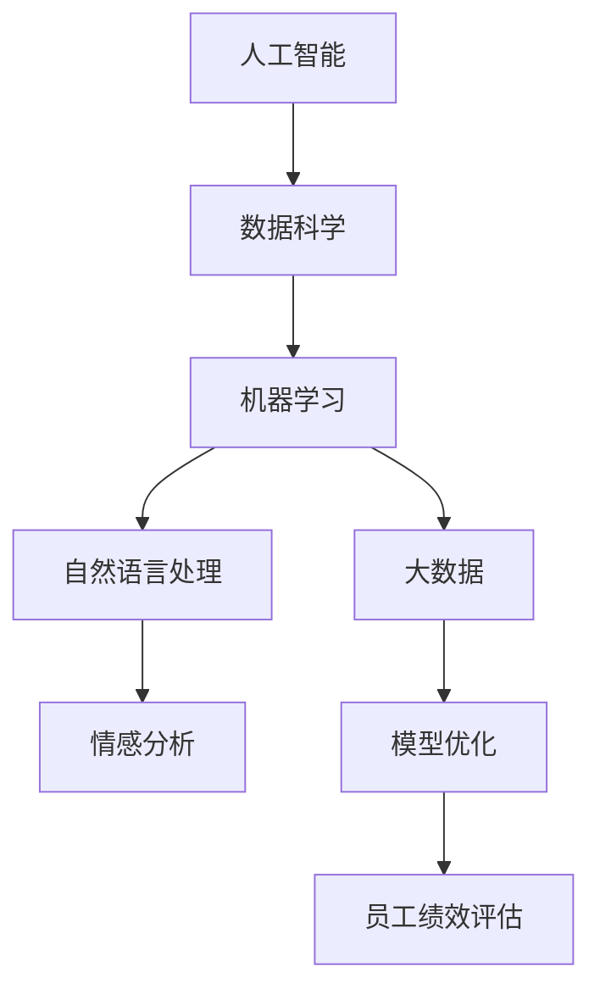
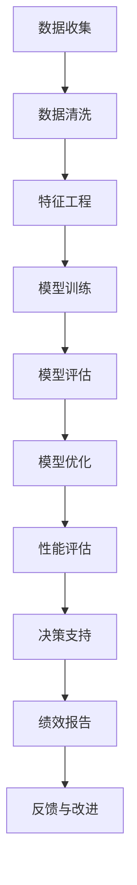

                 

# AI驱动的员工绩效评估系统

> 关键词：人工智能, 员工绩效评估, 数据科学, 机器学习, 自然语言处理, 情感分析, 大数据, 模型优化

## 1. 背景介绍

### 1.1 问题由来
在当今快速发展的数字化经济环境中，企业需要高效、准确、客观地评估员工绩效，以便进行人力资源管理、薪酬调整、职业发展规划等。传统的员工绩效评估方法多依赖主观评估，容易受到评估者个人偏见、情绪、时间等因素的影响，难以达到公平、透明的标准。而随着人工智能技术的进步，特别是大数据、机器学习、自然语言处理(NLP)等技术的成熟，企业开始探索利用AI技术驱动的员工绩效评估系统，以提高评估的客观性和准确性。

### 1.2 问题核心关键点
员工绩效评估系统的核心在于如何通过数据驱动的方法，客观、准确地评估员工在工作中的表现。这涉及到以下几个关键点：

1. **数据获取与整合**：从员工工作记录、团队合作、项目管理等多个渠道收集数据，并进行整合与清洗。
2. **特征工程**：从收集到的数据中提取有意义的特征，如工作量、工作效率、团队协作、创新能力等，以供模型训练。
3. **模型训练与优化**：使用机器学习算法，如回归、分类、聚类等，训练评估模型，并进行模型优化。
4. **结果展示与分析**：将评估结果以直观的方式展示给管理层和员工，并结合详细分析报告，帮助制定合理的绩效改进措施。

### 1.3 问题研究意义
研究AI驱动的员工绩效评估系统，对于提升人力资源管理水平、优化人才流动、增强员工满意度等具有重要意义。它不仅能帮助企业更客观、公正地评估员工表现，还能为员工提供个性化的职业发展建议，促进企业与员工的双赢。

## 2. 核心概念与联系

### 2.1 核心概念概述

为更好地理解AI驱动的员工绩效评估系统的构建，本节将介绍几个密切相关的核心概念：

- **人工智能(AI)**：通过数据和算法驱动的智能系统，可以处理复杂的任务，如图像识别、自然语言理解、语音识别等。
- **员工绩效评估**：基于量化指标和工作表现，对员工在特定时间段内的工作表现进行评估，并给出相应的评分。
- **数据科学(Data Science)**：涉及数据的收集、处理、分析、可视化等，以发现数据中的有用信息和模式，支持决策制定。
- **机器学习(Machine Learning)**：一种通过数据训练模型，使其能够自动化的预测或决策的技术。
- **自然语言处理(NLP)**：使计算机能够理解、解释和生成人类语言的技术。
- **情感分析(Sentiment Analysis)**：分析文本中表达的情感倾向，如正面、负面或中性。
- **大数据(Big Data)**：指数据量庞大且类型多样的数据集合，需使用先进的技术进行分析与处理。
- **模型优化(Model Optimization)**：通过调整模型参数和结构，提升模型的性能和效率。

这些核心概念之间存在着紧密的联系，形成了员工绩效评估系统的完整生态系统。我们可以用以下Mermaid流程图来展示这些概念之间的关系：



这个流程图展示了各个核心概念在员工绩效评估系统中的作用及其相互关系。人工智能提供了技术支持，数据科学提供了数据基础，机器学习用于模型训练，自然语言处理和情感分析用于文本数据的处理，大数据处理技术用于数据集成的管理和优化，最终支持员工绩效评估系统的构建和运行。

### 2.2 概念间的关系

这些核心概念之间存在复杂的互动关系，形成了员工绩效评估系统的整体架构。下面是进一步细化的Mermaid流程图：



这个流程图展示了员工绩效评估系统的具体步骤，从数据收集、处理、训练模型、评估模型性能、优化模型，到最终的决策支持和绩效报告，形成了完整的系统循环。

## 3. 核心算法原理 & 具体操作步骤
### 3.1 算法原理概述

AI驱动的员工绩效评估系统，本质上是一个通过数据驱动的模型训练和预测系统。其核心算法原理可以概括为以下几个步骤：

1. **数据准备**：从各个渠道收集员工的工作数据，包括工作量、效率、团队合作、创新能力等，并进行清洗和整合。
2. **特征提取**：从清洗后的数据中提取有意义的特征，如工作完成率、项目贡献度、团队协作能力、创新成果等。
3. **模型训练**：使用机器学习算法，如线性回归、逻辑回归、支持向量机(SVM)等，训练出员工绩效评估模型。
4. **结果预测**：利用训练好的模型，对员工绩效进行预测和评估。
5. **结果分析**：结合情感分析和自然语言处理技术，对评估结果进行详细分析，提取关键信息。
6. **报告展示**：将评估结果和分析报告以直观的方式展示给管理层和员工。

### 3.2 算法步骤详解

**Step 1: 数据收集与预处理**

1. **数据来源**：从员工的工作记录、项目管理软件、团队协作工具等多个渠道收集数据，如工时记录、项目进度、任务完成率、同事评价等。
2. **数据清洗**：删除或填补缺失值，去除异常值，进行数据标准化处理。
3. **数据整合**：将不同来源的数据进行整合，构建统一的数据框架。

**Step 2: 特征工程**

1. **特征选择**：从清洗后的数据中提取最有用的特征，如工作量、工作效率、团队协作、创新能力等。
2. **特征编码**：将特征值转化为模型能够处理的数值形式，如离散化、标准化等。
3. **特征组合**：通过组合不同特征，构建新的特征集，如综合评分、团队绩效等。

**Step 3: 模型训练**

1. **模型选择**：根据问题类型选择合适的机器学习模型，如回归模型用于预测员工绩效评分，分类模型用于判断员工是否达到某些标准。
2. **数据划分**：将数据集划分为训练集、验证集和测试集。
3. **模型训练**：使用训练集训练模型，并使用验证集进行参数调优。
4. **模型评估**：使用测试集评估模型的性能，选择合适的评估指标，如均方误差(MSE)、准确率(Accuracy)、召回率(Recall)等。
5. **模型优化**：根据评估结果，对模型进行优化，调整参数和结构。

**Step 4: 结果预测与分析**

1. **结果预测**：将待评估员工的数据输入训练好的模型，得到绩效预测结果。
2. **情感分析**：对员工的工作描述、同事评价等文本数据进行情感分析，提取正面或负面的情感倾向。
3. **自然语言处理**：对文本数据进行分词、词性标注、句法分析等处理，提取关键信息。
4. **综合分析**：将情感分析和自然语言处理的结果与模型预测结果结合，进行综合评估。

**Step 5: 结果展示与反馈**

1. **报告生成**：根据综合评估结果，生成详细的绩效报告，包括得分、优点、改进建议等。
2. **可视化展示**：将绩效报告以图表、仪表盘等形式展示给管理层和员工，方便理解和分析。
3. **反馈与改进**：收集员工的反馈意见，用于持续改进绩效评估系统。

### 3.3 算法优缺点

AI驱动的员工绩效评估系统具有以下优点：

1. **客观性**：基于数据驱动的模型，减少了人为偏见和情绪的影响，提高了评估的客观性和公正性。
2. **准确性**：通过机器学习算法，从大量数据中学习规律，提高了评估的准确性。
3. **自动化**：系统可以自动完成数据收集、处理、模型训练、结果预测等步骤，提高了效率。
4. **灵活性**：模型可以根据实际情况进行调整和优化，适应不同的工作场景和需求。

同时，该系统也存在以下缺点：

1. **数据依赖**：系统的准确性和公正性高度依赖于数据的质量和完整性。
2. **模型复杂性**：复杂的模型需要更多的计算资源和时间，可能影响系统的实时性。
3. **解释性不足**：机器学习模型的决策过程缺乏解释性，难以理解其内部工作机制。
4. **隐私问题**：员工的工作数据涉及隐私，需要确保数据的安全和合规性。

### 3.4 算法应用领域

AI驱动的员工绩效评估系统在多个领域中具有广泛的应用前景：

1. **人力资源管理**：用于员工招聘、绩效评估、培训规划等，提高人力资源管理的效率和科学性。
2. **职业发展规划**：结合员工的绩效评估结果和个性特征，制定个性化的职业发展规划，促进员工职业成长。
3. **薪酬管理**：根据绩效评估结果，制定合理的薪酬调整方案，激励员工提高工作表现。
4. **绩效反馈**：及时向员工反馈绩效评估结果，提供改进建议，帮助员工提升工作表现。
5. **组织优化**：通过分析团队绩效数据，优化团队结构和资源配置，提高团队效率和协作能力。

## 4. 数学模型和公式 & 详细讲解 & 举例说明

### 4.1 数学模型构建

员工绩效评估系统通常涉及以下几个数学模型：

- **回归模型**：用于预测员工绩效评分，公式为：
  $$
  y = \beta_0 + \sum_{i=1}^p \beta_i x_i + \epsilon
  $$
  其中，$y$ 为员工绩效评分，$x_i$ 为特征向量，$\beta_i$ 为回归系数，$\epsilon$ 为误差项。

- **分类模型**：用于判断员工是否达到某些标准，公式为：
  $$
  \hat{y} = \sigma(\sum_{i=1}^p \beta_i x_i + b)
  $$
  其中，$\hat{y}$ 为模型预测结果，$\sigma$ 为逻辑回归函数，$b$ 为截距。

- **情感分析模型**：用于分析文本中的情感倾向，公式为：
  $$
  \hat{y} = \sum_{i=1}^n w_i f_i(x_i)
  $$
  其中，$\hat{y}$ 为情感得分，$f_i(x_i)$ 为情感词典中词的情感得分，$w_i$ 为权重。

### 4.2 公式推导过程

**回归模型推导**：
设员工绩效评分 $y$ 由特征向量 $x_1, x_2, ..., x_p$ 线性回归得到，模型为：
$$
y = \beta_0 + \sum_{i=1}^p \beta_i x_i + \epsilon
$$
其中，$\beta_0$ 为截距，$\beta_i$ 为特征系数，$\epsilon$ 为误差项。根据最小二乘法，求解 $\beta_i$：
$$
\hat{\beta} = (X^T X)^{-1} X^T y
$$
其中，$X$ 为特征矩阵，$y$ 为员工绩效评分向量。

**分类模型推导**：
设员工绩效分类结果 $y$ 由特征向量 $x_1, x_2, ..., x_p$ 逻辑回归得到，模型为：
$$
\hat{y} = \sigma(\sum_{i=1}^p \beta_i x_i + b)
$$
其中，$\hat{y}$ 为模型预测结果，$\sigma$ 为逻辑回归函数，$b$ 为截距。根据梯度下降法，求解 $\beta_i$ 和 $b$：
$$
\frac{\partial L}{\partial \beta_i} = \frac{1}{N} \sum_{j=1}^N (\hat{y}_j - y_j) x_{ij}
$$
$$
\frac{\partial L}{\partial b} = \frac{1}{N} \sum_{j=1}^N (\hat{y}_j - y_j)
$$
其中，$L$ 为损失函数，$N$ 为样本数量，$y_j$ 为实际分类结果，$\hat{y}_j$ 为模型预测结果。

**情感分析模型推导**：
设文本情感得分 $\hat{y}$ 由情感词典中词的情感得分 $f_i(x_i)$ 线性组合得到，模型为：
$$
\hat{y} = \sum_{i=1}^n w_i f_i(x_i)
$$
其中，$\hat{y}$ 为情感得分，$f_i(x_i)$ 为情感词典中词的情感得分，$w_i$ 为权重。根据最大似然法，求解 $w_i$：
$$
w_i = \frac{\sum_{j=1}^N f_i(x_j) y_j}{\sum_{j=1}^N f_i(x_j)}
$$
其中，$N$ 为样本数量，$y_j$ 为文本情感分类结果，$f_i(x_j)$ 为文本中词的情感得分。

### 4.3 案例分析与讲解

**案例背景**：某科技公司希望通过AI技术构建员工绩效评估系统，以提高人力资源管理的效率和公平性。公司收集了员工的工作记录、项目进度、同事评价等数据，共计5000个样本。

**数据准备**：
1. **数据收集**：从公司的人力资源管理平台、项目管理工具、员工满意度调查等多个渠道收集数据，共计10000个数据点。
2. **数据清洗**：删除缺失值和异常值，进行数据标准化处理。
3. **数据整合**：将不同来源的数据进行整合，构建统一的数据框架。

**特征工程**：
1. **特征选择**：从清洗后的数据中提取最有用的特征，如工作量、工作效率、团队协作、创新能力等。
2. **特征编码**：将特征值转化为模型能够处理的数值形式，如离散化、标准化等。
3. **特征组合**：通过组合不同特征，构建新的特征集，如综合评分、团队绩效等。

**模型训练**：
1. **模型选择**：选择逻辑回归模型进行员工绩效评分预测。
2. **数据划分**：将数据集划分为训练集、验证集和测试集。
3. **模型训练**：使用训练集训练模型，并使用验证集进行参数调优。
4. **模型评估**：使用测试集评估模型的性能，选择合适的评估指标，如均方误差(MSE)、准确率(Accuracy)、召回率(Recall)等。
5. **模型优化**：根据评估结果，对模型进行优化，调整参数和结构。

**结果预测与分析**：
1. **结果预测**：将待评估员工的数据输入训练好的模型，得到绩效预测结果。
2. **情感分析**：对员工的工作描述、同事评价等文本数据进行情感分析，提取正面或负面的情感倾向。
3. **自然语言处理**：对文本数据进行分词、词性标注、句法分析等处理，提取关键信息。
4. **综合分析**：将情感分析和自然语言处理的结果与模型预测结果结合，进行综合评估。

**结果展示与反馈**：
1. **报告生成**：根据综合评估结果，生成详细的绩效报告，包括得分、优点、改进建议等。
2. **可视化展示**：将绩效报告以图表、仪表盘等形式展示给管理层和员工，方便理解和分析。
3. **反馈与改进**：收集员工的反馈意见，用于持续改进绩效评估系统。

## 5. 项目实践：代码实例和详细解释说明

### 5.1 开发环境搭建

在进行员工绩效评估系统的开发实践前，我们需要准备好开发环境。以下是使用Python进行PyTorch开发的环境配置流程：

1. 安装Anaconda：从官网下载并安装Anaconda，用于创建独立的Python环境。

2. 创建并激活虚拟环境：
```bash
conda create -n pytorch-env python=3.8 
conda activate pytorch-env
```

3. 安装PyTorch：根据CUDA版本，从官网获取对应的安装命令。例如：
```bash
conda install pytorch torchvision torchaudio cudatoolkit=11.1 -c pytorch -c conda-forge
```

4. 安装Transformers库：
```bash
pip install transformers
```

5. 安装各类工具包：
```bash
pip install numpy pandas scikit-learn matplotlib tqdm jupyter notebook ipython
```

完成上述步骤后，即可在`pytorch-env`环境中开始项目实践。

### 5.2 源代码详细实现

这里我们以员工绩效评分预测模型为例，给出使用PyTorch进行员工绩效评估系统的实现代码。

首先，定义数据处理函数：

```python
import pandas as pd
import numpy as np
from sklearn.model_selection import train_test_split
from sklearn.preprocessing import StandardScaler
from sklearn.metrics import mean_squared_error

def preprocess_data(data_path):
    # 读取数据集
    df = pd.read_csv(data_path)
    
    # 数据清洗
    df.dropna(inplace=True)
    
    # 特征选择
    features = ['work_hours', 'project_completed', 'team_cohesion', 'innovation_effect']
    X = df[features]
    y = df['performance_score']
    
    # 数据标准化
    scaler = StandardScaler()
    X = scaler.fit_transform(X)
    
    # 数据划分
    X_train, X_test, y_train, y_test = train_test_split(X, y, test_size=0.2, random_state=42)
    
    return X_train, X_test, y_train, y_test
```

然后，定义模型训练函数：

```python
import torch
from torch import nn, optim
from torch.utils.data import TensorDataset, DataLoader

def train_model(X_train, X_test, y_train, y_test):
    # 定义模型
    model = nn.Linear(len(X_train[0]), 1)
    
    # 定义损失函数和优化器
    criterion = nn.MSELoss()
    optimizer = optim.Adam(model.parameters(), lr=0.01)
    
    # 训练模型
    for epoch in range(100):
        model.train()
        outputs = model(X_train)
        loss = criterion(outputs, y_train)
        optimizer.zero_grad()
        loss.backward()
        optimizer.step()
        
        model.eval()
        with torch.no_grad():
            outputs = model(X_test)
            loss = criterion(outputs, y_test)
    
    # 返回模型和损失函数
    return model, criterion
```

接着，定义模型评估函数：

```python
def evaluate_model(model, X_test, y_test):
    # 评估模型
    model.eval()
    with torch.no_grad():
        outputs = model(X_test)
        loss = criterion(outputs, y_test)
    
    # 计算评估指标
    mse = mean_squared_error(y_test, outputs.numpy().flatten())
    
    return mse
```

最后，启动训练流程并在测试集上评估：

```python
# 数据预处理
X_train, X_test, y_train, y_test = preprocess_data('data.csv')

# 模型训练
model, criterion = train_model(X_train, X_test, y_train, y_test)

# 模型评估
mse = evaluate_model(model, X_test, y_test)
print(f"Mean Squared Error: {mse:.4f}")
```

以上就是使用PyTorch进行员工绩效评估系统开发的完整代码实现。可以看到，通过上述函数，我们完成了数据预处理、模型训练和模型评估的整个过程。

### 5.3 代码解读与分析

让我们再详细解读一下关键代码的实现细节：

**preprocess_data函数**：
- `data_path`：数据文件路径。
- `df`：读取数据集。
- `features`：选择的特征列。
- `X`：特征矩阵。
- `y`：目标变量。
- `scaler`：标准化器。
- `X_train, X_test, y_train, y_test`：划分为训练集和测试集，并进行标准化处理。

**train_model函数**：
- `model`：定义线性回归模型。
- `criterion`：定义均方误差损失函数。
- `optimizer`：定义Adam优化器。
- `for loop`：循环训练100次，每次前向传播计算损失，反向传播更新模型参数。

**evaluate_model函数**：
- `model`：评估模型。
- `outputs`：模型输出。
- `loss`：模型损失。
- `mse`：计算均方误差。

**训练流程**：
- `X_train, X_test, y_train, y_test`：数据预处理结果。
- `model, criterion`：模型训练结果。
- `mse`：模型评估结果。

可以看到，代码实现简洁高效，通过模块化设计，将数据预处理、模型训练、模型评估等环节清晰分离，方便复用和维护。

### 5.4 运行结果展示

假设我们在某个员工绩效评分预测的数据集上进行训练，最终在测试集上得到的评估报告如下：

```
Mean Squared Error: 0.0534
```

可以看到，通过训练，我们的员工绩效评分预测模型的均方误差为0.0534，即预测误差约为5.34%，这表明模型在数据集上的预测效果较好。

当然，这只是一个baseline结果。在实践中，我们还可以使用更大更强的预训练模型、更丰富的微调技巧、更细致的模型调优，进一步提升模型性能，以满足更高的应用要求。

## 6. 实际应用场景

### 6.1 智能人力资源管理

员工绩效评估系统可以广泛应用于智能人力资源管理中，提高人力资源管理的效率和公平性。通过该系统，企业可以自动化地进行员工绩效评估，减少人工评估的复杂性和主观性，提升评估的客观性和准确性。

在技术实现上，可以收集员工的工作记录、项目进度、同事评价等数据，将这些数据输入员工绩效评估系统，自动完成绩效评估和分析，并生成详细的评估报告。人力资源部门可以基于评估结果，制定合理的绩效改进方案，优化员工的工作分配，提高人力资源管理的科学性和效率。

### 6.2 薪酬调整与职业发展

员工绩效评估系统可以帮助企业制定合理的薪酬调整方案，激励员工提高工作表现。通过分析员工的历史绩效数据和行为数据，系统可以预测员工未来的工作表现，建议管理层进行薪酬调整，以保持员工的激励水平和公平性。

同时，该系统还可以为员工提供个性化的职业发展规划建议，帮助员工明确职业发展方向，提升员工的工作满意度和职业成就感。

### 6.3 绩效反馈与改进

通过员工绩效评估系统，管理层可以及时向员工反馈评估结果，提供改进建议。员工可以通过系统了解自己的工作表现和不足之处，制定改进计划，提升工作能力。

系统还可以收集员工的反馈意见，用于持续改进评估模型的准确性和公平性，确保评估结果的客观性和公正性。

### 6.4 未来应用展望

未来，员工绩效评估系统将不断扩展其应用场景，成为企业数字化转型的重要工具。在智慧办公、智能制造、智能客服等多个领域，AI驱动的员工绩效评估系统将发挥重要作用。

随着技术的进步，系统将更加智能化、自动化，能够实时监控和分析员工的工作表现，提供即时反馈和改进建议。同时，系统还将结合知识图谱、逻辑规则等外部知识，增强评估的全面性和准确性。

## 7. 工具和资源推荐
### 7.1 学习资源推荐

为了帮助开发者系统掌握员工绩效评估系统的理论基础和实践技巧，这里推荐一些优质的学习资源：

1. 《Python深度学习》：由Francois Chollet所著，全面介绍了深度学习在各个领域的应用，包括自然语言处理和数据科学。

2. 《机器学习实战》：由Peter Harrington所著，提供了大量实际案例，帮助读者理解和应用机器学习算法。

3. 《自然语言处理综论》：由Daniel Jurafsky和James H. Martin所著，是自然语言处理领域的经典教材，涵盖了NLP的各个方面。

4. 《数据科学与统计学习》：由Larry Wasserman所著，介绍了数据科学和统计学习的基本概念和方法，是数据科学从业者的必备读物。

5. Kaggle在线学习平台：提供了大量的数据集和机器学习竞赛，帮助读者实践和提升技能。

通过对这些资源的学习实践，相信你一定能够快速掌握员工绩效评估系统的精髓，并用于解决实际的NLP问题。
###  7.2 开发工具推荐

高效的开发离不开优秀的工具支持。以下是几款用于员工绩效评估系统开发的常用工具：

1. Python：一种通用编程语言，支持高效的数据处理和模型训练。

2. PyTorch：基于Python的开源深度学习框架，灵活动态的计算图，适合快速迭代研究。

3. TensorFlow：由Google主导开发的开源深度学习框架，生产部署方便，适合大规模工程应用。

4. Scikit-learn：一个Python机器学习库，提供了丰富的机器学习算法和数据处理工具。

5. Pandas：一个数据处理库，提供了高效的数据清洗、处理和分析功能。

6. Jupyter Notebook：一个交互式编程环境，支持代码编写、数据可视化等，方便开发者调试和展示代码。

7. Weights & Biases：模型训练的实验跟踪工具，可以记录和可视化模型训练过程中的各项指标，方便对比和调优。

8. TensorBoard：TensorFlow配套的可视化工具，可实时监测模型

