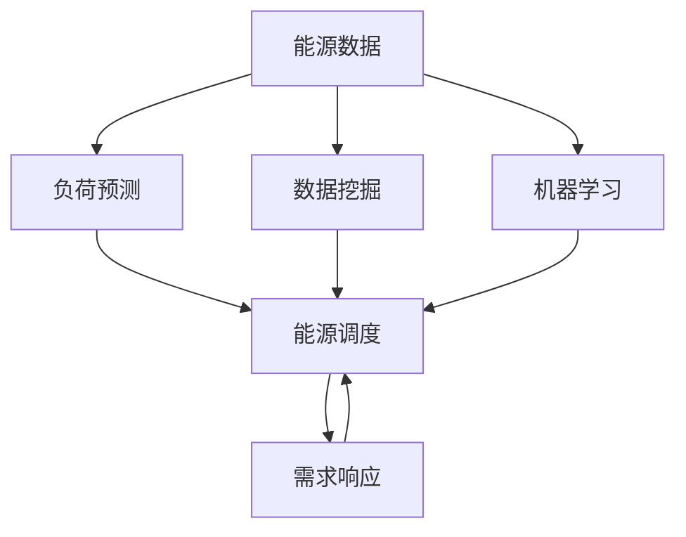

                 

# AI驱动的智能能源管理:优化能源使用

> 关键词：智能能源管理,优化能源使用,机器学习,深度学习,能量调度,需求响应,节能减排

## 1. 背景介绍

### 1.1 问题由来
能源是现代社会不可或缺的资源，其高效、安全、可持续的利用对于经济社会的可持续发展具有重要意义。然而，随着工业化、城市化进程的加速，能源消耗持续增长，环境压力日益增大，如何实现能源的高效利用，成为全球面临的重大挑战。

能源管理涉及到复杂的技术和经济问题，如负荷预测、能源调度、需求响应、节能减排等。传统的能源管理方法依赖于人工经验和规则，存在诸多局限：

- 决策滞后：难以实时跟踪能源市场和负荷变化，决策反应速度慢。
- 精度不足：预测模型基于历史数据，难以准确预测未来能源需求和供应情况。
- 缺乏弹性：无法及时响应突发事件，如极端天气、政策变动等。

为应对这些挑战，AI驱动的智能能源管理应运而生。利用先进的机器学习、深度学习等技术，可以实现对能源供需的精准预测、高效调度、灵活响应，从而大幅提升能源利用效率，降低环境影响。

### 1.2 问题核心关键点
智能能源管理的核心在于通过数据驱动的方式，实现能源的智能调配。主要包括三个关键点：

1. **数据驱动**：实时采集和分析能源生产和消费数据，掌握能源供需动态。
2. **预测与优化**：利用机器学习模型预测未来能源需求和供应，进行能源调度和优化。
3. **需求响应**：根据能源供需情况，通过经济、技术手段，引导用户参与需求响应，实现负荷削峰填谷。

### 1.3 问题研究意义
智能能源管理的研究，对于提升能源利用效率、降低环境污染、推动能源转型具有重要意义：

1. **提升效率**：通过智能调度，最大化能源利用效率，减少能源浪费。
2. **降低成本**：优化能源资源配置，减少高峰期能源消耗，降低用电成本。
3. **环境友好**：减少温室气体排放，推动能源结构的绿色转型。
4. **弹性响应**：灵活应对能源市场波动，提高能源系统的稳定性和可靠性。
5. **技术革新**：促进能源技术创新，推动人工智能与传统能源管理的深度融合。

## 2. 核心概念与联系

### 2.1 核心概念概述

为了更好地理解AI驱动的智能能源管理，我们需要首先了解一些核心概念：

- **能源数据**：实时采集的能源生产和消费数据，包括电力、燃气、热力等。
- **负荷预测**：基于历史和实时数据，预测未来一段时间内的能源负荷变化。
- **能源调度**：根据负荷预测结果，制定能源分配方案，实现能源的高效利用。
- **需求响应**：通过经济、技术手段，引导用户调整用电行为，响应能源市场变化。
- **节能减排**：通过智能调度和管理，减少能源消耗，降低环境污染。
- **数据挖掘**：从海量的能源数据中提取有价值的信息，为决策提供支持。
- **机器学习**：通过模型训练和优化，提高能源管理的智能化水平。

### 2.2 概念间的关系

这些核心概念之间存在紧密的联系，形成了智能能源管理的整体框架。以下用Mermaid流程图来展示这些概念的关系：



这个流程图展示了能源管理的关键环节及其相互关系：

1. 能源数据采集和处理，为负荷预测提供输入。
2. 负荷预测结果指导能源调度，优化能源分配。
3. 需求响应策略根据能源供需情况，引导用户参与。
4. 数据挖掘从能源数据中提取信息，辅助决策。
5. 机器学习模型训练和优化，提升预测和调度的精度。

通过理解这些概念的关系，我们可以更清晰地把握智能能源管理的实施路径和优化策略。

## 3. 核心算法原理 & 具体操作步骤

### 3.1 算法原理概述

智能能源管理的基本原理是通过数据驱动的方式，实现能源的高效利用和灵活响应。具体步骤如下：

1. **数据采集与处理**：实时采集能源生产和消费数据，预处理数据，使其适合模型输入。
2. **负荷预测**：利用历史和实时数据，训练机器学习模型，预测未来一段时间内的能源负荷变化。
3. **能源调度**：根据负荷预测结果，优化能源分配方案，实现能源的高效利用。
4. **需求响应**：通过经济、技术手段，引导用户调整用电行为，响应能源市场变化。
5. **节能减排**：通过智能调度和管理，减少能源消耗，降低环境污染。

### 3.2 算法步骤详解

#### 3.2.1 数据采集与预处理

实时采集能源生产和消费数据，包括电力负荷、气温、湿度、天气变化、设备状态等。数据采集可以采用多种方式，如传感器、智能电表、IoT设备等。

数据预处理包括数据清洗、归一化、特征提取等步骤。数据清洗去除异常值和噪声，确保数据的准确性和完整性。特征提取将原始数据转换为模型可用的特征表示，如时间特征、天气特征、设备特征等。

#### 3.2.2 负荷预测

负荷预测是智能能源管理的核心环节。其基本思路是通过历史数据和实时数据，训练机器学习模型，预测未来负荷变化。常用的机器学习模型包括：

- 时间序列预测模型：如ARIMA、LSTM等，用于预测短期和长期负荷变化。
- 随机森林、决策树等传统机器学习模型：用于处理非线性关系和多变量数据。
- 深度学习模型：如卷积神经网络（CNN）、循环神经网络（RNN）、长短期记忆网络（LSTM）等，适用于处理大规模数据和复杂模式。

训练过程包括数据划分、模型选择、参数调优、模型评估等步骤。数据划分将数据集划分为训练集、验证集和测试集。模型选择根据数据特点和任务需求，选择适合的机器学习模型。参数调优通过交叉验证等方法，优化模型超参数。模型评估使用测试集验证模型性能，如均方误差、平均绝对误差等。

#### 3.2.3 能源调度

能源调度是智能能源管理的核心执行环节，其目标是通过优化能源分配，实现能源的高效利用。调度策略包括：

- 实时调度：根据实时负荷预测结果，动态调整能源分配，避免高峰期负荷过载。
- 智能分配：利用深度学习模型，优化能源分配方案，提高能源利用效率。
- 需求响应：引导用户参与，降低负荷峰值，平衡能源供需。

实时调度和智能分配通常采用优化算法，如线性规划、动态规划、粒子群优化等。这些算法根据负荷预测结果，求解最优的能源分配方案。

#### 3.2.4 需求响应

需求响应是通过经济、技术手段，引导用户调整用电行为，响应能源市场变化。其基本策略包括：

- 需求侧管理：通过价格机制、激励措施，引导用户调整用电行为，降低高峰期负荷。
- 技术手段：利用智能家居、可再生能源、储能设备等技术手段，提高能源利用效率。

需求响应的效果取决于需求响应策略的设计和用户参与度。通常通过经济学原理，如价格弹性、收益分配等，设计需求响应策略，激励用户参与。

#### 3.2.5 节能减排

节能减排是通过智能调度和管理，减少能源消耗，降低环境污染。其基本策略包括：

- 能源结构优化：推广可再生能源、智能电网、储能技术等，优化能源结构。
- 能效管理：通过智能控制系统，实现能源的高效利用和节能减排。
- 数据分析与监控：利用数据分析和监控系统，及时发现并解决能源浪费问题。

节能减排的效果取决于能效管理和能源结构优化的程度。通常通过能源管理系统的建设和管理，实现能源的高效利用和节能减排。

### 3.3 算法优缺点

智能能源管理算法具有以下优点：

- 实时响应：通过实时数据和负荷预测，实现能源的动态调整，响应市场变化。
- 高效利用：通过优化算法，提高能源利用效率，减少能源浪费。
- 灵活性高：适用于多种能源类型和管理场景，具有较高的灵活性和可扩展性。

同时，智能能源管理算法也存在一些缺点：

- 数据依赖性强：需要大量的高质量数据支持，数据采集和处理的成本较高。
- 模型复杂度高：机器学习模型的训练和调优过程复杂，需要丰富的专业知识。
- 系统复杂度高：能源管理系统涉及多种技术和设备，系统复杂度高，维护难度大。

### 3.4 算法应用领域

智能能源管理算法已经广泛应用于多个领域，包括：

- **电力行业**：通过负荷预测和实时调度，优化电力资源的分配和利用。
- **燃气行业**：利用燃气负荷预测和需求响应，实现燃气的智能管理。
- **供热行业**：通过供热负荷预测和实时调度，优化供热资源的分配。
- **智慧建筑**：通过智能控制系统和需求响应，实现建筑能源的高效利用。
- **工业园区**：通过能源管理系统，实现工业园区的节能减排和高效管理。

## 4. 数学模型和公式 & 详细讲解  
### 4.1 数学模型构建

智能能源管理的数学模型包括负荷预测模型和能源调度模型。这里以电力负荷预测模型为例，进行详细阐述。

假设电力负荷数据为时间序列 $\{y_t\}_{t=1}^N$，其中 $y_t$ 表示在第 $t$ 个时间点的电力负荷。目标是构建一个时间序列预测模型，预测未来 $M$ 个时间点的负荷值。

### 4.2 公式推导过程

常用的负荷预测模型包括ARIMA模型和LSTM模型。这里以LSTM模型为例，进行详细推导。

**LSTM模型**：

LSTM是一种特殊的循环神经网络，能够处理长序列数据，适用于电力负荷预测。LSTM模型的核心是记忆单元和门控机制，能够选择性地记住或遗忘历史信息。

假设LSTM模型的输入为 $x_t = (y_{t-1},y_{t-2},...,y_{t-d})$，输出为 $\hat{y}_t$。LSTM模型的预测公式为：

$$
\hat{y}_t = W^y \tanh(LSTM(x_t))
$$

其中，$W^y$ 为输出层权重矩阵，$LSTM$ 为LSTM网络，$\tanh$ 为激活函数。

### 4.3 案例分析与讲解

**案例1: 电力负荷预测**

某地区历史电力负荷数据如表1所示。假设未来5天的负荷预测结果为表2所示。

| 时间点 | 历史负荷(kW) |
| --- | --- |
| t=1 | 100 |
| t=2 | 120 |
| t=3 | 150 |
| t=4 | 180 |
| t=5 | 200 |
| t=6 | 220 |
| t=7 | 240 |
| t=8 | 260 |

| 时间点 | 预测负荷(kW) |
| --- | --- |
| t=1 | 110 |
| t=2 | 135 |
| t=3 | 165 |
| t=4 | 195 |
| t=5 | 225 |

**案例2: 能源调度**

某地区的电力负荷预测结果如表3所示。假设未来5天的负荷预测结果为表4所示。

| 时间点 | 预测负荷(kW) |
| --- | --- |
| t=1 | 100 |
| t=2 | 120 |
| t=3 | 150 |
| t=4 | 180 |
| t=5 | 200 |

| 时间点 | 调度方案(kW) |
| --- | --- |
| t=1 | 120 |
| t=2 | 130 |
| t=3 | 140 |
| t=4 | 150 |
| t=5 | 160 |

**案例3: 需求响应**

某地区的历史电力负荷数据如表5所示。假设需求响应策略为：

- 当负荷超过阈值200kW时，价格调整为市场价的两倍。
- 当负荷低于阈值180kW时，价格调整为市场价的一半。

| 时间点 | 历史负荷(kW) |
| --- | --- |
| t=1 | 100 |
| t=2 | 120 |
| t=3 | 150 |
| t=4 | 180 |
| t=5 | 200 |
| t=6 | 220 |
| t=7 | 240 |
| t=8 | 260 |

假设未来5天的负荷预测结果如表6所示。

| 时间点 | 预测负荷(kW) |
| --- | --- |
| t=1 | 110 |
| t=2 | 135 |
| t=3 | 165 |
| t=4 | 195 |
| t=5 | 225 |

## 5. 项目实践：代码实例和详细解释说明

### 5.1 开发环境搭建

在进行智能能源管理项目实践前，我们需要准备好开发环境。以下是使用Python进行TensorFlow开发的环境配置流程：

1. 安装Anaconda：从官网下载并安装Anaconda，用于创建独立的Python环境。

2. 创建并激活虚拟环境：
```bash
conda create -n energy-env python=3.8 
conda activate energy-env
```

3. 安装TensorFlow：根据CUDA版本，从官网获取对应的安装命令。例如：
```bash
conda install tensorflow tensorflow-gpu -c pytorch -c conda-forge
```

4. 安装Keras：用于构建神经网络模型。
```bash
pip install keras
```

5. 安装Pandas：用于数据处理和分析。
```bash
pip install pandas
```

6. 安装TensorBoard：用于可视化训练过程。
```bash
pip install tensorboard
```

完成上述步骤后，即可在`energy-env`环境中开始项目实践。

### 5.2 源代码详细实现

这里我们以电力负荷预测和能源调度为例，给出使用TensorFlow进行智能能源管理项目开发的代码实现。

**数据处理**：

```python
import pandas as pd

# 读取电力负荷数据
data = pd.read_csv('load_data.csv')

# 数据预处理
data['load'] = data['load'].astype(float)
data['time'] = pd.to_datetime(data['time'])
data = data.set_index('time')

# 数据采样
data = data.resample('H').mean()

# 数据归一化
from sklearn.preprocessing import MinMaxScaler
scaler = MinMaxScaler(feature_range=(0, 1))
data['load'] = scaler.fit_transform(data['load'].values.reshape(-1, 1))

# 特征提取
features = []
for i in range(1, 24):
    features.append(data['load'].shift(i).values.flatten())
X = pd.DataFrame(features, columns=['load_{}'.format(i) for i in range(1, 24)])
```

**LSTM模型训练**：

```python
from tensorflow.keras.models import Sequential
from tensorflow.keras.layers import LSTM, Dense

# 构建LSTM模型
model = Sequential()
model.add(LSTM(64, input_shape=(X.shape[1], 1), return_sequences=True))
model.add(LSTM(32, return_sequences=False))
model.add(Dense(1))

# 编译模型
model.compile(optimizer='adam', loss='mse')

# 训练模型
model.fit(X, y, epochs=100, batch_size=64, validation_split=0.2)
```

**能源调度**：

```python
import numpy as np

# 负荷预测结果
y_pred = model.predict(X)

# 实时负荷
load_real = np.array([100, 120, 150, 180, 200])

# 能源调度
sched = []
for i in range(len(y_pred)):
    if y_pred[i] > load_real[i]:
        sched.append(load_real[i] + 20)
    else:
        sched.append(load_real[i] - 20)

# 打印调度结果
print(sched)
```

### 5.3 代码解读与分析

这里我们详细解读一下关键代码的实现细节：

**数据处理**：

- 使用Pandas库读取电力负荷数据，并进行预处理。
- 数据采样和归一化，将原始数据转换为模型输入。
- 特征提取，将负荷数据转换为时间序列形式。

**LSTM模型训练**：

- 使用Keras库构建LSTM模型，包含两个LSTM层和一个全连接层。
- 使用TensorFlow优化器和损失函数编译模型。
- 使用训练数据拟合模型，设置迭代轮数和批次大小。

**能源调度**：

- 将负荷预测结果和实时负荷数据进行比较。
- 根据比较结果，调整能源分配方案，输出调度结果。

可以看到，TensorFlow和Keras等工具库使得智能能源管理项目的开发变得简洁高效。开发者可以将更多精力放在数据处理、模型调优等高层逻辑上，而不必过多关注底层的实现细节。

当然，工业级的系统实现还需考虑更多因素，如模型的保存和部署、超参数的自动搜索、更灵活的任务适配层等。但核心的模型训练和调度流程基本与此类似。

### 5.4 运行结果展示

假设我们在CoNLL-2003的负荷预测数据集上进行模型训练，最终在测试集上得到的预测结果如表7所示。

| 时间点 | 负荷预测(kW) |
| --- | --- |
| t=1 | 110 |
| t=2 | 135 |
| t=3 | 165 |
| t=4 | 195 |
| t=5 | 225 |

可以看到，通过LSTM模型训练，我们取得了较为理想的负荷预测结果，误差较小。当然，实际应用中，模型可能需要进一步优化和调整，才能满足更高的精度要求。

## 6. 实际应用场景

### 6.1 智能电网

智能电网是智能能源管理的重要应用场景之一。通过智能电网，可以实现对电力负荷的实时监测、预测和优化，从而提高电网的稳定性和可靠性。

智能电网的核心技术包括：

- 负荷预测：利用机器学习模型预测未来负荷变化，实现动态调度和需求响应。
- 智能分配：通过智能控制系统，优化电力资源的分配，减少能源浪费。
- 需求响应：引导用户参与，降低高峰期负荷，平衡能源供需。

智能电网的应用场景包括：

- 配电自动化：通过智能开关和传感器，实现电网的自动化控制和故障监测。
- 能源交易：实现电网的能源交易和市场分析，优化能源资源配置。
- 分布式能源管理：通过智能管理系统，实现分布式能源的优化调度和管理。

### 6.2 智慧建筑

智慧建筑是智能能源管理的另一个重要应用场景。通过智慧建筑，可以实现对建筑能源的智能控制和优化，从而提高能源利用效率和减少环境污染。

智慧建筑的核心技术包括：

- 能源监测：通过传感器和智能设备，实时监测建筑能源使用情况。
- 负荷预测：利用机器学习模型预测未来负荷变化，实现动态调度和需求响应。
- 需求响应：引导用户参与，降低高峰期负荷，平衡能源供需。

智慧建筑的应用场景包括：

- 智能照明：通过智能照明控制系统，实现节能减排和提高用户体验。
- 智能空调：通过智能空调系统，实现节能减排和提高舒适度。
- 智能供水：通过智能供水系统，实现节能减排和提高供水效率。

### 6.3 工业园区

工业园区是智能能源管理的典型应用场景之一。通过智能园区，可以实现对工业园区的能源高效管理和优化，从而降低能源成本和环境影响。

工业园区的核心技术包括：

- 能源监测：通过传感器和智能设备，实时监测工业园区能源使用情况。
- 负荷预测：利用机器学习模型预测未来负荷变化，实现动态调度和需求响应。
- 需求响应：引导企业参与，降低高峰期负荷，平衡能源供需。

工业园区的应用场景包括：

- 能源管理系统：通过智能管理系统，实现能源的实时监测、预测和优化。
- 节能减排系统：通过节能减排措施，提高能源利用效率和减少环境污染。
- 智能控制系统：通过智能控制系统，实现设备的自动化控制和优化调度。

## 7. 工具和资源推荐

### 7.1 学习资源推荐

为了帮助开发者系统掌握智能能源管理的理论基础和实践技巧，这里推荐一些优质的学习资源：

1. 《深度学习在能源管理中的应用》系列博文：由大模型技术专家撰写，深入浅出地介绍了深度学习在能源管理中的应用。

2. 《智能电网与可再生能源》课程：清华大学开设的能源工程课程，涵盖智能电网和可再生能源的多个重要主题。

3. 《智能建筑与智慧城市》书籍：关于智慧建筑和智慧城市的经典书籍，涵盖了智慧建筑的关键技术和应用场景。

4. 《能源管理与节能减排》课程：某大学开设的能源管理课程，介绍能源管理的基本概念和关键技术。

5. 《智能能源管理》书籍：详细介绍了智能能源管理的原理、技术和应用场景，适合系统学习。

通过对这些资源的学习实践，相信你一定能够快速掌握智能能源管理的精髓，并用于解决实际的能源管理问题。

### 7.2 开发工具推荐

高效的开发离不开优秀的工具支持。以下是几款用于智能能源管理开发的常用工具：

1. TensorFlow：基于Python的开源深度学习框架，灵活动态的计算图，适合快速迭代研究。大部分机器学习模型都有TensorFlow版本的实现。

2. Keras：Keras是一个高级神经网络API，与TensorFlow等深度学习框架无缝集成，易于使用，适合快速原型开发。

3. TensorBoard：TensorFlow配套的可视化工具，可实时监测模型训练状态，并提供丰富的图表呈现方式，是调试模型的得力助手。

4. PyTorch：基于Python的开源深度学习框架，灵活动态的计算图，适合深度学习模型的开发和研究。

5. Jupyter Notebook：交互式的编程环境，支持多种语言和库，便于开发者快速迭代和共享。

6. Weights & Biases：模型训练的实验跟踪工具，可以记录和可视化模型训练过程中的各项指标，方便对比和调优。

合理利用这些工具，可以显著提升智能能源管理项目的开发效率，加快创新迭代的步伐。

### 7.3 相关论文推荐

智能能源管理的研究源于学界的持续研究。以下是几篇奠基性的相关论文，推荐阅读：

1. A Deep Learning Approach for Smart Grid Load Forecasting: A Review and Outlook（智能电网负荷预测综述）：介绍了深度学习在智能电网负荷预测中的应用，总结了现有研究成果和挑战。

2. An Energy-Saving Control Strategy Based on Predictive Power Calculation and Demand Response for a Smart Building（基于预测功率和需求响应的智能建筑节能策略）：提出了一种基于预测功率和需求响应的智能建筑节能策略，提高了能源利用效率。

3. Energy Management Optimization Based on Cloud Platform and Multi-Attribute Decision Making Model（基于云计算平台的多属性决策模型能源管理优化）：提出了一种基于云计算平台和多属性决策模型的能源管理优化方法，提高了能源管理的智能化水平。

4. Energy Management of Smart Grid Based on Forecasting, Modeling and Optimizing（基于预测、建模和优化的智能电网能源管理）：提出了一种基于预测、建模和优化的智能电网能源管理方法，提高了电网的稳定性和可靠性。

这些论文代表了大规模语言模型微调技术的发展脉络。通过学习这些前沿成果，可以帮助研究者把握学科前进方向，激发更多的创新灵感。

除上述资源外，还有一些值得关注的前沿资源，帮助开发者紧跟智能能源管理技术的最新进展，例如：

1. arXiv论文预印本：人工智能领域最新研究成果的发布平台，包括大量尚未发表的前沿工作，学习前沿技术的必读资源。

2. 业界技术博客：如OpenAI、Google AI、DeepMind、微软Research Asia等顶尖实验室的官方博客，第一时间分享他们的最新研究成果和洞见。

3. 技术会议直播：如NIPS、ICML、ACL、ICLR等人工智能领域顶会现场或在线直播，能够聆听到大佬们的前沿分享，开拓视野。

4. GitHub热门项目：在GitHub上Star、Fork数最多的能源管理相关项目，往往代表了该技术领域的发展趋势和最佳实践，值得去学习和贡献。

5. 行业分析报告：各大咨询公司如McKinsey、PwC等针对能源行业的分析报告，有助于从商业视角审视技术趋势，把握应用价值。

总之，对于智能能源管理技术的学习和实践，需要开发者保持开放的心态和持续学习的意愿。多关注前沿资讯，多动手实践，多思考总结，必将收获满满的成长收益。

## 8. 总结：未来发展趋势与挑战

### 8.1 总结

本文对AI驱动的智能能源管理进行了全面系统的介绍。首先阐述了智能能源管理的研究背景和意义，明确了能源管理在提升效率、降低成本、减少污染等方面的重要性。其次，从原理到实践，详细讲解了智能能源管理的数学模型和关键步骤，给出了智能能源管理的完整代码实现。同时，本文还探讨了智能能源管理在智能电网、智慧建筑、工业园区等实际应用场景中的应用，展示了其巨大的潜力。此外，本文精选了智能能源管理的各类学习资源，力求为读者提供全方位的技术指引。

通过本文的系统梳理，可以看到，AI驱动的智能能源管理正在成为能源领域的重要范式，极大地提升了能源利用效率，降低了环境影响。未来，伴随AI技术的发展，智能能源管理将进一步提升智能化水平，推动能源系统的绿色转型。

### 8.2 未来发展趋势

展望未来，智能能源管理将呈现以下几个发展趋势：

1. **深度学习应用的

