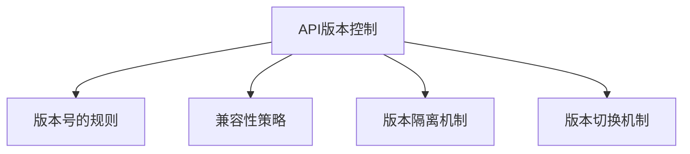
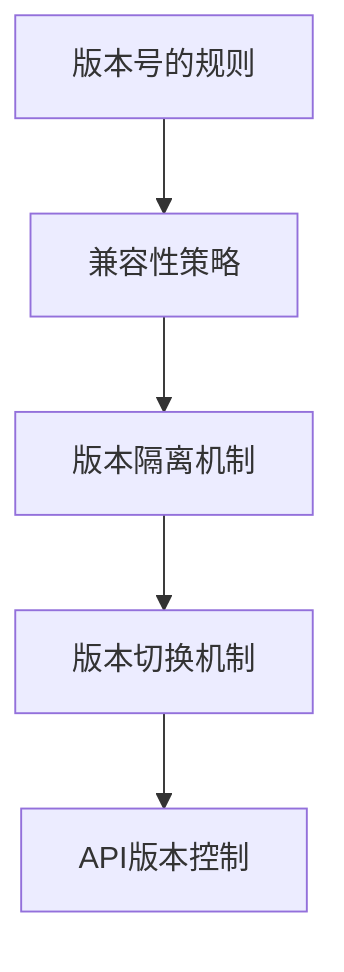

                 

## 1. 背景介绍

### 1.1 问题由来
随着Web应用的不断发展，API（Application Programming Interface）的使用变得越来越广泛。为了提高系统的稳定性和可维护性，API的版本控制机制至关重要。然而，随着API版本的不断迭代，如何有效管理API的版本变更，成为了开发者和运维人员面临的一个难题。

### 1.2 问题核心关键点
API版本控制的本质是如何处理不同版本之间的兼容性和可控性，确保新版本的API能够与旧版本兼容，同时避免版本冲突和向后不兼容的问题。API版本控制通常包括以下几个核心点：

- 版本号的规则：定义API版本的版本号格式，如Major.Minor.Patch，确保版本号的规范化。
- 兼容性策略：确定不同版本之间的兼容规则，如隐式兼容、显式兼容等。
- 版本隔离机制：对不同版本API的资源进行隔离，避免版本冲突。
- 版本切换机制：支持用户和系统无缝切换到指定的API版本。

### 1.3 问题研究意义
API版本控制对于保证系统的稳定性和可维护性具有重要意义：

- 降低变更风险：通过明确规范和兼容性策略，减少因版本变更带来的不稳定性。
- 提高系统可维护性：清晰地定义了不同版本之间的依赖关系，便于代码维护。
- 支持版本迭代：确保新版本的API可以不断演进，同时保证现有用户的体验。
- 避免冲突和适配：通过版本隔离和切换机制，防止不同版本API之间的冲突，简化适配工作。

## 2. 核心概念与联系

### 2.1 核心概念概述
为了更好地理解API版本控制的实现方法，本节将介绍几个密切相关的核心概念：

- API版本控制（Version Control）：指通过规范化的版本管理机制，确保不同版本的API之间的兼容性和可控性。
- 版本号的规则（Version Numbering）：定义API版本的版本号格式，如Major.Minor.Patch。
- 兼容性策略（Compatibility Strategy）：确定不同版本之间的兼容规则，如隐式兼容、显式兼容等。
- 版本隔离机制（Version Isolation）：对不同版本API的资源进行隔离，避免版本冲突。
- 版本切换机制（Version Switching）：支持用户和系统无缝切换到指定的API版本。

这些核心概念之间的逻辑关系可以通过以下Mermaid流程图来展示：



这个流程图展示了大语言模型微调过程中各个核心概念的关系和作用：

1. API版本控制是对API进行规范化管理和控制的核心机制。
2. 版本号的规则定义了API版本的格式，确保版本号的规范化。
3. 兼容性策略确定不同版本之间的兼容规则，确保新版本的API可以与旧版本兼容。
4. 版本隔离机制对不同版本的API进行隔离，避免版本冲突。
5. 版本切换机制支持用户和系统无缝切换到指定的API版本。

### 2.2 概念间的关系

这些核心概念之间存在着紧密的联系，形成了API版本控制的完整生态系统。下面我们通过几个Mermaid流程图来展示这些概念之间的关系。

#### 2.2.1 API版本控制的总体架构



这个综合流程图展示了API版本控制的整体架构：

1. 版本号的规则是API版本控制的基础。
2. 兼容性策略在版本号的规则基础上，确保不同版本之间的兼容。
3. 版本隔离机制通过对不同版本API的隔离，避免版本冲突。
4. 版本切换机制支持用户和系统无缝切换到指定的API版本。
5. API版本控制是整个系统的核心，通过版本号的规则、兼容性策略、版本隔离机制和版本切换机制，实现了API版本的高效管理。

## 3. 核心算法原理 & 具体操作步骤

### 3.1 算法原理概述

API版本控制的算法原理主要涉及以下几个方面：

- 版本号的生成：通过定义版本号规则，生成符合规范的版本号。
- 兼容性策略的实现：确定不同版本API之间的兼容规则，确保新版本的API可以与旧版本兼容。
- 版本隔离的实现：对不同版本的API资源进行隔离，避免版本冲突。
- 版本切换的实现：支持用户和系统无缝切换到指定的API版本。

### 3.2 算法步骤详解

API版本控制的实现步骤如下：

1. **定义版本号规则**：根据业务需求和版本管理的最佳实践，定义API版本的版本号规则。例如，使用Major.Minor.Patch的格式。
2. **实现兼容性策略**：根据定义的版本号规则，实现不同版本API之间的兼容性策略。例如，使用隐式兼容策略，即旧版本API可以处理新版本API的请求。
3. **实现版本隔离机制**：对不同版本的API资源进行隔离，避免版本冲突。例如，使用独立的URL路径或参数。
4. **实现版本切换机制**：支持用户和系统无缝切换到指定的API版本。例如，使用版本选择头或版本参数进行版本切换。

### 3.3 算法优缺点

API版本控制的算法优点包括：

- 规范化版本管理：通过定义版本号规则，确保API版本号的规范化。
- 兼容性和可控性：通过兼容性策略和版本隔离机制，确保不同版本API之间的兼容性和可控性。
- 灵活性和可扩展性：通过版本切换机制，支持用户和系统无缝切换到指定的API版本。

API版本控制的算法缺点包括：

- 开发复杂度：API版本控制机制的实现可能增加开发复杂度，特别是在版本兼容性处理方面。
- 运维难度：不同版本的API资源隔离和版本切换可能导致运维难度增加。
- 学习成本：用户和运维人员需要花费一定时间学习和理解API版本控制机制。

### 3.4 算法应用领域

API版本控制的应用领域包括但不限于：

- Web应用：对API版本进行规范化管理和控制，确保不同版本API之间的兼容性和可控性。
- 微服务架构：在微服务架构中，不同微服务可能依赖不同版本的API，API版本控制机制可以帮助实现服务之间的无缝切换。
- 移动应用：对移动应用的API版本进行管理和控制，确保不同版本API之间的兼容性和可控性。
- 企业内部应用：对企业内部API进行规范化管理和控制，提高系统的稳定性和可维护性。

## 4. 数学模型和公式 & 详细讲解 & 举例说明

### 4.1 数学模型构建

API版本控制的数学模型主要涉及以下几个方面：

- 版本号规则的数学表达：例如，使用Major.Minor.Patch的格式进行版本号的数学表达。
- 兼容性策略的数学表达：例如，使用隐式兼容或显式兼容策略进行数学表达。
- 版本隔离机制的数学表达：例如，使用独立的URL路径或参数进行数学表达。
- 版本切换机制的数学表达：例如，使用版本选择头或版本参数进行数学表达。

### 4.2 公式推导过程

以下我们以Major.Minor.Patch的格式为例，推导版本号的数学模型：

假设版本号规则为Major.Minor.Patch，其中：

- Major版本表示主要版本号，每增加一个大版本号，表示功能重大变化。
- Minor版本表示次要版本号，每增加一个小版本号，表示功能新增或改进。
- Patch版本表示补丁版本号，每增加一个补丁版本号，表示修复bug或功能优化。

则版本号可以表示为：

$$
\text{Version} = \text{Major}.(\text{Minor}(\text{Patch}))
$$

例如，版本号为1.2.3，表示主要版本为1，次要版本为2，补丁版本为3。

### 4.3 案例分析与讲解

假设我们有一个Web应用，API版本控制规则如下：

- 版本号规则：使用Major.Minor.Patch的格式。
- 兼容性策略：使用隐式兼容策略。
- 版本隔离机制：使用独立的URL路径进行隔离。
- 版本切换机制：使用版本选择头进行版本切换。

示例：

假设旧版本API的版本号为1.0.0，新版本API的版本号为1.1.0，兼容策略为隐式兼容，则新版本的API可以处理旧版本的请求，旧版本的API可以处理新版本的请求。

## 5. 项目实践：代码实例和详细解释说明

### 5.1 开发环境搭建

在进行API版本控制实践前，我们需要准备好开发环境。以下是使用Python进行Flask开发的环境配置流程：

1. 安装Anaconda：从官网下载并安装Anaconda，用于创建独立的Python环境。

2. 创建并激活虚拟环境：
```bash
conda create -n flask-env python=3.8 
conda activate flask-env
```

3. 安装Flask：
```bash
pip install flask
```

4. 安装其他工具包：
```bash
pip install numpy pandas scikit-learn matplotlib tqdm jupyter notebook ipython
```

完成上述步骤后，即可在`flask-env`环境中开始API版本控制的实践。

### 5.2 源代码详细实现

下面我们以实现一个简单的Web应用为例，展示API版本控制的Flask代码实现。

首先，定义Flask应用：

```python
from flask import Flask, request, jsonify

app = Flask(__name__)

@app.route('/')
def index():
    return jsonify({'message': 'Welcome to API Version Control'})
```

然后，定义API版本控制函数：

```python
def get_api_version():
    version = request.headers.get('X-API-Version')
    if version is None:
        return jsonify({'error': 'X-API-Version header is missing'}), 400
    else:
        return jsonify({'api_version': version})
```

接着，实现不同版本的API资源：

```python
@app.route('/v1/data')
def get_data_v1():
    # 处理v1版本的请求
    return jsonify({'message': 'Get data v1'})

@app.route('/v2/data')
def get_data_v2():
    # 处理v2版本的请求
    return jsonify({'message': 'Get data v2'})
```

最后，启动Flask应用：

```python
if __name__ == '__main__':
    app.run(debug=True)
```

### 5.3 代码解读与分析

让我们再详细解读一下关键代码的实现细节：

**Flask应用**：
- 定义Flask应用对象`app`，设置路由`/`。
- 定义路由函数`index()`，返回欢迎信息。

**API版本控制函数**：
- 定义函数`get_api_version()`，获取请求头中的`X-API-Version`，如果存在则返回，否则返回错误信息。

**不同版本的API资源**：
- 定义路由函数`get_data_v1()`和`get_data_v2()`，分别处理版本为1和版本为2的请求，返回不同的响应。

**启动Flask应用**：
- 使用`app.run()`方法启动Flask应用，并设置`debug=True`，开启调试模式。

可以看到，Flask框架提供了简单易用的路由和请求处理机制，使得API版本控制的实现变得简单高效。开发者可以根据业务需求，灵活配置路由和资源，实现不同版本的API控制。

### 5.4 运行结果展示

假设我们在运行上述代码后，访问`http://localhost:5000`，得到欢迎信息。然后通过设置`X-API-Version: 1`，访问`http://localhost:5000/v1/data`，得到版本为1的响应。通过设置`X-API-Version: 2`，访问`http://localhost:5000/v2/data`，得到版本为2的响应。

## 6. 实际应用场景

### 6.1 企业内部应用

在企业内部应用中，API版本控制可以确保不同版本的API资源之间的隔离，避免版本冲突。例如，企业内部有多个API服务，每个服务可能依赖不同版本的API，通过API版本控制机制，可以实现服务之间的无缝切换，提高系统的稳定性和可维护性。

### 6.2 移动应用

在移动应用中，API版本控制可以确保不同版本的API资源之间的兼容性和可控性。例如，移动应用在不同版本之间需要不断更新API资源，通过API版本控制机制，可以确保旧版本和新版本之间的兼容，简化适配工作。

### 6.3 金融领域

在金融领域，API版本控制可以确保不同版本的API资源之间的兼容性和可控性。例如，金融系统在不同版本之间需要不断更新API资源，通过API版本控制机制，可以确保旧版本和新版本之间的兼容，简化适配工作。

### 6.4 未来应用展望

随着API版本控制的不断发展，未来的应用场景将更加广泛，具体展望如下：

1. 自动化版本管理：通过自动化工具和脚本，自动生成和发布API版本，提高版本管理的效率和准确性。
2. 微服务架构中的API版本控制：在微服务架构中，不同微服务可能依赖不同版本的API，API版本控制机制可以帮助实现服务之间的无缝切换。
3. 云平台中的API版本控制：在云平台中，不同租户可能使用不同版本的API，API版本控制机制可以帮助实现租户之间的隔离和切换。

## 7. 工具和资源推荐

### 7.1 学习资源推荐

为了帮助开发者系统掌握API版本控制的理论基础和实践技巧，这里推荐一些优质的学习资源：

1. RESTful API设计指南：详细介绍了RESTful API设计的最佳实践和规范，帮助开发者设计高质量的API接口。
2. API设计模式：介绍了API设计的常见模式和策略，如版本控制模式、资源定位模式等，帮助开发者提高API设计的可维护性。
3. Swagger文档：Swagger是一款流行的API文档生成工具，可以生成详细的API文档，帮助开发者和用户理解API接口。
4. Postman：Postman是一款流行的API测试工具，支持多种API测试功能，帮助开发者进行API接口的测试和验证。

通过对这些资源的学习实践，相信你一定能够快速掌握API版本控制的精髓，并用于解决实际的API版本控制问题。

### 7.2 开发工具推荐

API版本控制的开发离不开优秀的工具支持。以下是几款用于API版本控制开发的常用工具：

1. Swagger：Swagger是一款流行的API文档生成工具，支持自动生成API文档，帮助开发者和用户理解API接口。
2. Postman：Postman是一款流行的API测试工具，支持多种API测试功能，帮助开发者进行API接口的测试和验证。
3. GitLab CI/CD：GitLab提供了强大的CI/CD功能，支持自动化生成和发布API版本，提高版本管理的效率和准确性。
4. Docker：Docker是一款流行的容器化工具，支持API版本的容器化部署和管理，提高API版本管理的灵活性和可扩展性。

合理利用这些工具，可以显著提升API版本控制的开发效率，加快创新迭代的步伐。

### 7.3 相关论文推荐

API版本控制的研究涉及多个领域，以下是几篇奠基性的相关论文，推荐阅读：

1. RESTful API设计规范：详细介绍了RESTful API设计的最佳实践和规范，帮助开发者设计高质量的API接口。
2. API版本控制策略：介绍了API版本控制的不同策略，如隐式兼容、显式兼容等，帮助开发者理解API版本控制的实现机制。
3. Swagger规范：详细介绍了Swagger的规范和API文档生成机制，帮助开发者生成高质量的API文档。

这些论文代表了大语言模型微调技术的发展脉络。通过学习这些前沿成果，可以帮助研究者把握学科前进方向，激发更多的创新灵感。

除上述资源外，还有一些值得关注的前沿资源，帮助开发者紧跟API版本控制技术的最新进展，例如：

1. arXiv论文预印本：人工智能领域最新研究成果的发布平台，包括大量尚未发表的前沿工作，学习前沿技术的必读资源。
2. 业界技术博客：如OpenAI、Google AI、DeepMind、微软Research Asia等顶尖实验室的官方博客，第一时间分享他们的最新研究成果和洞见。
3. 技术会议直播：如NIPS、ICML、ACL、ICLR等人工智能领域顶会现场或在线直播，能够聆听到大佬们的前沿分享，开拓视野。
4. GitHub热门项目：在GitHub上Star、Fork数最多的API版本控制相关项目，往往代表了该技术领域的发展趋势和最佳实践，值得去学习和贡献。
5. 行业分析报告：各大咨询公司如McKinsey、PwC等针对API版本控制行业的分析报告，有助于从商业视角审视技术趋势，把握应用价值。

总之，对于API版本控制技术的学习和实践，需要开发者保持开放的心态和持续学习的意愿。多关注前沿资讯，多动手实践，多思考总结，必将收获满满的成长收益。

## 8. 总结：未来发展趋势与挑战

### 8.1 总结

本文对API版本控制的实现方法进行了全面系统的介绍。首先阐述了API版本控制的背景和意义，明确了版本控制的重要性和实际应用场景。其次，从原理到实践，详细讲解了API版本控制的数学模型和核心算法步骤，给出了API版本控制的完整代码实例。同时，本文还广泛探讨了API版本控制的应用场景，展示了API版本控制的广阔前景。此外，本文精选了API版本控制的学习资源，力求为读者提供全方位的技术指引。

通过本文的系统梳理，可以看到，API版本控制是保障API系统稳定性和可维护性的重要手段，通过规范化版本管理、兼容性策略、版本隔离机制和版本切换机制，实现了API版本的高效管理。未来，伴随API版本控制的不断发展，API系统的开发和运维将更加规范和高效。

### 8.2 未来发展趋势

展望未来，API版本控制的趋势如下：

1. 自动化管理：通过自动化工具和脚本，自动生成和发布API版本，提高版本管理的效率和准确性。
2. 标准化规范：API版本控制的规范和标准将不断完善，成为API设计和管理的重要指导。
3. 跨平台兼容：API版本控制将支持多种平台和语言的兼容，提高API的普适性。
4. 动态版本管理：API版本控制将支持动态版本管理和切换，适应快速变化的需求。

### 8.3 面临的挑战

尽管API版本控制技术已经取得了不小的进展，但在迈向更加智能化、普适化应用的过程中，它仍面临着诸多挑战：

1. 开发复杂度：API版本控制的实现可能增加开发复杂度，特别是在版本兼容性处理方面。
2. 运维难度：不同版本的API资源隔离和版本切换可能导致运维难度增加。
3. 学习成本：用户和运维人员需要花费一定时间学习和理解API版本控制机制。

### 8.4 研究展望

面对API版本控制面临的种种挑战，未来的研究需要在以下几个方面寻求新的突破：

1. 探索无监督和半监督版本控制方法：摆脱对大规模标注数据的依赖，利用自监督学习、主动学习等无监督和半监督范式，最大限度利用非结构化数据，实现更加灵活高效的版本控制。
2. 研究参数高效和计算高效的版本控制范式：开发更加参数高效的版本控制方法，在固定大部分预训练参数的情况下，只更新极少量的任务相关参数。同时优化版本控制的计算图，减少前向传播和反向传播的资源消耗，实现更加轻量级、实时性的部署。
3. 融合因果分析和博弈论工具：将因果分析方法引入版本控制模型，识别出模型决策的关键特征，增强输出解释的因果性和逻辑性。借助博弈论工具刻画人机交互过程，主动探索并规避模型的脆弱点，提高系统稳定性。
4. 纳入伦理道德约束：在版本控制目标中引入伦理导向的评估指标，过滤和惩罚有偏见、有害的输出倾向。同时加强人工干预和审核，建立模型行为的监管机制，确保输出符合人类价值观和伦理道德。

这些研究方向的探索，必将引领API版本控制技术迈向更高的台阶，为构建安全、可靠、可解释、可控的API系统铺平道路。面向未来，API版本控制技术还需要与其他人工智能技术进行更深入的融合，如知识表示、因果推理、强化学习等，多路径协同发力，共同推动API系统的发展。只有勇于创新、敢于突破，才能不断拓展API版本控制的边界，让API系统更好地服务于人类社会。

## 9. 附录：常见问题与解答

**Q1：API版本控制是否适用于所有Web应用？**

A: API版本控制适用于大部分Web应用，尤其是API驱动的系统。但对于某些简单系统，可能不需要复杂的版本控制机制。

**Q2：API版本控制对系统性能有何影响？**

A: API版本控制对系统性能的影响主要取决于版本控制机制的实现方式。良好的版本控制设计可以避免因版本切换带来的性能瓶颈。

**Q3：API版本控制是否适合自动化管理？**

A: API版本控制非常适合自动化管理。通过自动化工具和脚本，可以大大提高版本管理的效率和准确性。

**Q4：API版本控制是否适用于企业内部应用？**

A: API版本控制非常适合企业内部应用。通过API版本控制，可以确保不同版本的API资源之间的隔离，避免版本冲突。

**Q5：API版本控制是否适合云平台应用？**

A: API版本控制非常适合云平台应用。通过API版本控制，可以确保不同租户使用不同版本的API，实现租户之间的隔离和切换。

**Q6：API版本控制是否适用于微服务架构？**

A: API版本控制非常适合微服务架构。在微服务架构中，不同微服务可能依赖不同版本的API，API版本控制机制可以帮助实现服务之间的无缝切换。

通过本文的系统梳理，可以看到，API版本控制是保障API系统稳定性和可维护性的重要手段。通过规范化版本管理、兼容性策略、版本隔离机制和版本切换机制，实现了API版本的高效管理。未来，伴随API版本控制的不断发展，API系统的开发和运维将更加规范和高效。

总之，API版本控制技术需要开发者根据具体业务需求，不断迭代和优化版本控制机制，方能得到理想的效果。通过API版本控制技术的应用，可以确保API系统的高效、稳定和可维护，为构建高质量的API系统奠定坚实基础。

