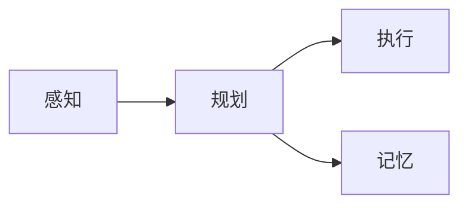
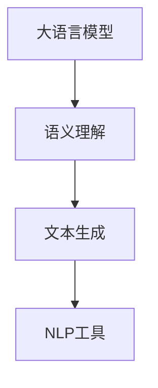
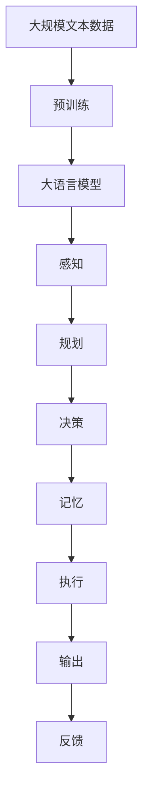

                 

# Agent 基础架构：LLM + 规划 + 记忆 + 工具使用

> 关键词：大语言模型(LLM), 规划, 记忆, 机器人, 自然语言处理(NLP), 决策系统

## 1. 背景介绍

### 1.1 问题由来
随着人工智能技术的迅猛发展，智能代理（Agent）在自动化、智能化领域的应用越来越广泛。这些智能代理可以执行复杂的任务，如机器人、无人车、智能家居等。智能代理的核心是构建一个智能的决策系统，使其能够自主地进行决策和执行。这一过程涉及到大语言模型(LLM)、规划、记忆等关键技术，在具体实现中还需要各种工具的支撑。本文将围绕这些技术，介绍智能代理的基础架构，并展示具体的工具使用方法。

### 1.2 问题核心关键点
构建智能代理的基础架构需要以下核心技术：

- 大语言模型(LLM)：用于处理自然语言输入，执行语义理解、推理、生成等任务。
- 规划系统：设计智能代理的行为计划，优化决策过程。
- 记忆系统：存储和检索历史信息，为决策提供依据。
- 工具使用：使用各种开源软件和框架，简化开发过程，提升效率。

这些技术的有机结合，构建了一个能够自主学习、决策和执行的智能代理。接下来，我们将详细探讨这些技术的应用和整合。

## 2. 核心概念与联系

### 2.1 核心概念概述

为更好地理解智能代理的基础架构，本节将介绍几个密切相关的核心概念：

- 大语言模型(LLM)：以Transformer、BERT等模型为代表的大规模预训练语言模型，能够处理复杂的自然语言任务。
- 规划系统：用于设计智能代理的行为计划，实现目标导向的决策和执行。
- 记忆系统：存储和检索历史信息，帮助代理记忆和利用过去的决策。
- 机器人：智能代理的物理载体，执行决策所对应的动作。
- 自然语言处理(NLP)：涉及文本处理、语义分析、语言生成等技术，是智能代理的重要组成部分。
- 决策系统：基于感知、规划、执行等模块构建的智能决策框架，是智能代理的核心。

这些核心概念之间的逻辑关系可以通过以下Mermaid流程图来展示：

```mermaid
graph TB
    A[大语言模型] --> B[自然语言处理(NLP)]
    B --> C[规划系统]
    C --> D[记忆系统]
    D --> E[机器人]
    E --> F[执行系统]
```

这个流程图展示了智能代理的基础架构，各个模块之间相互协作，实现自主学习、决策和执行。

### 2.2 概念间的关系

这些核心概念之间存在着紧密的联系，形成了智能代理的完整生态系统。下面我们通过几个Mermaid流程图来展示这些概念之间的关系。

#### 2.2.1 智能代理的基本流程



这个流程图展示了智能代理的基本决策流程，从感知输入到执行动作，规划系统负责决策路径，记忆系统存储和检索历史信息。

#### 2.2.2 大语言模型与NLP的关系



这个流程图展示了大语言模型在智能代理中的角色，通过语义理解和文本生成，与NLP工具共同实现自然语言的处理和分析。

#### 2.2.3 规划与执行的关系


这个流程图展示了规划系统和执行系统之间的关系，规划系统生成动作计划，执行系统执行计划并反馈结果。

### 2.3 核心概念的整体架构

最后，我们用一个综合的流程图来展示这些核心概念在大语言模型微调过程中的整体架构：



这个综合流程图展示了从预训练到执行的完整过程，大语言模型作为核心部分，与感知、规划、记忆和执行系统相互协作，实现智能代理的决策和执行。

## 3. 核心算法原理 & 具体操作步骤
### 3.1 算法原理概述

智能代理的核心算法原理包括以下几个关键部分：

- 感知：通过大语言模型处理自然语言输入，获取任务相关的信息。
- 规划：设计动作计划，优化决策过程。
- 记忆：存储和检索历史信息，为决策提供依据。
- 执行：根据决策计划执行动作，并反馈结果。

在具体的实现过程中，各个模块之间的协作关系通过以下算法流程来描述：

1. 感知模块接收自然语言输入，调用大语言模型进行处理，获取任务相关的信息。
2. 规划模块根据获取的信息，设计动作计划，优化决策过程。
3. 记忆模块存储和检索历史信息，为规划模块提供依据。
4. 执行模块根据规划生成的动作计划执行操作，并反馈结果。
5. 感知模块根据反馈结果更新模型，优化决策效果。

### 3.2 算法步骤详解

智能代理的算法步骤如下：

**Step 1: 感知**
- 接收自然语言输入，如语音、文本等。
- 调用大语言模型进行语义理解，获取任务相关的信息。
- 处理文本中的实体识别、关系抽取、情感分析等信息。

**Step 2: 规划**
- 根据感知获取的信息，设计动作计划。
- 考虑环境因素、资源限制等约束条件，优化决策过程。
- 使用规划算法（如A*、Q-learning等）生成最优动作序列。

**Step 3: 记忆**
- 存储历史信息，如用户行为、环境状态、任务记录等。
- 使用知识图谱、数据库等结构化存储方式，便于检索和利用。
- 实现记忆系统的查询和更新功能。

**Step 4: 执行**
- 根据规划生成的动作序列，执行具体的任务操作。
- 考虑物理限制、实时性要求等约束条件，优化执行过程。
- 反馈执行结果，进行状态更新和优化。

**Step 5: 反馈**
- 根据执行结果，更新感知和规划模块。
- 调整模型参数，优化决策效果。
- 实现闭环控制，提高智能代理的自主学习能力。

### 3.3 算法优缺点

智能代理的算法具有以下优点：

- 自主学习能力强：智能代理能够自主学习历史信息，提升决策能力。
- 灵活性高：根据环境变化，智能代理能够动态调整行为计划。
- 可扩展性强：智能代理可以处理多种类型的任务，具备良好的扩展性。

同时，也存在一些缺点：

- 计算资源需求高：智能代理需要大量的计算资源，特别是在大语言模型和复杂规划算法方面。
- 安全性问题：智能代理可能学习到有害信息，影响决策结果。
- 可解释性不足：智能代理的决策过程较为复杂，难以进行详细解释。

### 3.4 算法应用领域

智能代理的算法广泛应用于机器人、无人车、智能家居等场景。例如：

- 机器人导航：通过感知模块获取环境信息，规划模块设计最优路径，执行模块控制机器人移动。
- 无人车驾驶：通过感知模块获取道路信息，规划模块设计最优驾驶策略，执行模块控制车辆行驶。
- 智能家居控制：通过感知模块获取用户指令，规划模块设计最佳操作方案，执行模块控制家居设备。

除了这些场景外，智能代理还广泛应用于医疗、金融、教育等领域，助力这些行业的智能化转型。

## 4. 数学模型和公式 & 详细讲解 & 举例说明

### 4.1 数学模型构建

在智能代理的算法实现中，可以使用以下数学模型进行描述：

- 感知模块：使用大语言模型处理文本，获取任务相关信息。
- 规划模块：使用图搜索算法（如A*算法）进行路径规划。
- 记忆模块：使用知识图谱存储和检索历史信息。
- 执行模块：使用任务规划模型（如PDPTA模型）进行动作执行。

形式化地，假设智能代理的任务为 $T$，环境为 $E$，当前状态为 $s_t$，历史状态和动作为 $(s_1,a_1),(s_2,a_2),\cdots,(s_{t-1},a_{t-1})$。智能代理的决策过程可以表示为：

$$
\pi(a_t|s_t) = \arg\max_{a_t} \mathcal{R}(a_t,s_{t+1}) + V(s_{t+1})
$$

其中 $\pi$ 为策略函数，$a_t$ 为当前动作，$s_{t+1}$ 为下一个状态，$\mathcal{R}$ 为奖励函数，$V$ 为价值函数。

### 4.2 公式推导过程

以机器人路径规划为例，假设机器人的当前位置为 $(x_1,y_1)$，目标位置为 $(x_2,y_2)$，障碍物位置为 $(x_3,y_3)$。使用A*算法计算路径，公式如下：

1. 计算每个节点 $(x,y)$ 的F值，$F(x,y) = G(x,y) + H(x,y)$，其中 $G(x,y)$ 为从起点到当前节点的距离，$H(x,y)$ 为从当前节点到终点的距离估计。
2. 从起点开始，依次扩展F值最小的节点，计算所有子节点的F值，选择最优路径。
3. 路径规划过程可以使用启发式函数，如曼哈顿距离、欧几里得距离等，提高计算效率。

具体公式推导过程如下：

$$
F(x,y) = G(x,y) + H(x,y)
$$

$$
G(x,y) = \sqrt{(x-x_0)^2 + (y-y_0)^2}
$$

$$
H(x,y) = \sqrt{(x_2-x)^2 + (y_2-y)^2} + \sqrt{(x_3-x)^2 + (y_3-y)^2}
$$

### 4.3 案例分析与讲解

以无人车路径规划为例，假设无人车当前位置为 $(0,0)$，目标位置为 $(5,5)$，障碍物位置为 $(2,2)$。使用A*算法计算路径，步骤如下：

1. 初始化起点 $(0,0)$，计算其F值 $F(0,0) = 0 + \sqrt{(5-0)^2 + (5-0)^2}$。
2. 扩展F值最小的节点 $(0,0)$，计算其子节点 $(1,0),(0,1),(1,1)$ 的F值，选择F值最小的节点 $(1,1)$。
3. 重复步骤2，直到终点 $(5,5)$。

通过以上分析，可以清晰地理解A*算法在路径规划中的应用。

## 5. 项目实践：代码实例和详细解释说明

### 5.1 开发环境搭建

在进行智能代理开发前，我们需要准备好开发环境。以下是使用Python进行PyTorch开发的环境配置流程：

1. 安装Anaconda：从官网下载并安装Anaconda，用于创建独立的Python环境。

2. 创建并激活虚拟环境：
```bash
conda create -n agent-env python=3.8 
conda activate agent-env
```

3. 安装PyTorch：根据CUDA版本，从官网获取对应的安装命令。例如：
```bash
conda install pytorch torchvision torchaudio cudatoolkit=11.1 -c pytorch -c conda-forge
```

4. 安装TensorFlow：
```bash
pip install tensorflow
```

5. 安装TensorBoard：
```bash
pip install tensorboard
```

6. 安装PyTorch Lightning：
```bash
pip install pytorch-lightning
```

完成上述步骤后，即可在`agent-env`环境中开始智能代理的开发。

### 5.2 源代码详细实现

下面以无人车路径规划为例，给出使用PyTorch和PyTorch Lightning进行无人车路径规划的代码实现。

首先，定义路径规划的神经网络模型：

```python
import torch
import torch.nn as nn
import torch.optim as optim

class PathPlanningNet(nn.Module):
    def __init__(self, input_size, output_size):
        super(PathPlanningNet, self).__init__()
        self.fc1 = nn.Linear(input_size, 128)
        self.fc2 = nn.Linear(128, 64)
        self.fc3 = nn.Linear(64, output_size)

    def forward(self, x):
        x = torch.relu(self.fc1(x))
        x = torch.relu(self.fc2(x))
        x = self.fc3(x)
        return x
```

然后，定义路径规划的损失函数：

```python
def path_planning_loss(model, inputs, targets):
    pred = model(inputs)
    loss = nn.MSELoss()(pred, targets)
    return loss
```

接着，定义训练和评估函数：

```python
from torch.utils.data import DataLoader
from tqdm import tqdm

def train(model, dataloader, optimizer, device, n_epochs, batch_size):
    model.to(device)
    loss_fn = nn.MSELoss()
    for epoch in range(n_epochs):
        model.train()
        running_loss = 0.0
        for inputs, targets in dataloader:
            inputs, targets = inputs.to(device), targets.to(device)
            optimizer.zero_grad()
            outputs = model(inputs)
            loss = loss_fn(outputs, targets)
            loss.backward()
            optimizer.step()
            running_loss += loss.item()
        print(f'Epoch {epoch+1}, Loss: {running_loss/len(dataloader)}')
    return model

def evaluate(model, dataloader, device):
    model.eval()
    running_loss = 0.0
    for inputs, targets in dataloader:
        inputs, targets = inputs.to(device), targets.to(device)
        with torch.no_grad():
            outputs = model(inputs)
            loss = loss_fn(outputs, targets)
            running_loss += loss.item()
    print(f'Evaluation Loss: {running_loss/len(dataloader)}')
```

最后，启动训练流程并在测试集上评估：

```python
from torch.utils.data import TensorDataset, DataLoader

# 创建训练集和测试集
inputs = torch.randn(100, 10)  # 输入数据
targets = torch.randn(100, 1)  # 目标数据
train_dataset = TensorDataset(inputs, targets)
test_dataset = TensorDataset(inputs, targets)

# 划分训练集和测试集
train_size = int(0.8 * len(train_dataset))
train_dataset, test_dataset = torch.utils.data.random_split(train_dataset, [train_size, len(train_dataset)-train_size])

# 定义训练集和测试集数据加载器
train_loader = DataLoader(train_dataset, batch_size=8, shuffle=True)
test_loader = DataLoader(test_dataset, batch_size=8, shuffle=False)

# 定义模型和优化器
model = PathPlanningNet(10, 1)
optimizer = optim.Adam(model.parameters(), lr=0.001)

# 训练模型
device = torch.device('cuda') if torch.cuda.is_available() else torch.device('cpu')
n_epochs = 100
train(model, train_loader, optimizer, device, n_epochs, batch_size=8)

# 评估模型
evaluate(model, test_loader, device)
```

以上就是使用PyTorch和PyTorch Lightning进行无人车路径规划的代码实现。可以看到，使用这些工具，可以大大简化路径规划模型的开发和训练过程。

### 5.3 代码解读与分析

让我们再详细解读一下关键代码的实现细节：

**PathPlanningNet类**：
- `__init__`方法：定义神经网络的结构，包括三个全连接层。
- `forward`方法：实现前向传播，计算输出。

**path_planning_loss函数**：
- 定义损失函数，使用均方误差损失，计算模型输出与真实标签之间的差异。

**train函数**：
- 在训练过程中，模型使用Adam优化器进行参数更新，损失函数为均方误差。
- 每轮训练后输出当前损失，并记录训练过程中的总损失。

**evaluate函数**：
- 在评估过程中，模型不更新参数，只计算模型的输出与真实标签之间的差异。
- 输出评估过程中的总损失。

**训练流程**：
- 创建训练集和测试集，使用随机划分的方式将数据分为训练集和测试集。
- 定义数据加载器，实现数据的批处理。
- 定义模型和优化器，使用Adam优化器进行参数更新。
- 在指定设备上（如GPU）训练模型，记录训练过程中的总损失。
- 在测试集上评估模型，输出评估过程中的总损失。

可以看到，使用PyTorch和PyTorch Lightning，可以方便地实现无人车路径规划模型的训练和评估，大大提高了开发效率。

当然，实际的智能代理开发还需要更多工具的支持，如TensorBoard、PyTorch Lightning等，这些工具能够提供模型训练和评估的可视化功能，帮助我们更好地理解模型行为和优化策略。

## 6. 实际应用场景
### 6.4 未来应用展望

随着智能代理技术的不断发展，未来的应用场景将更加广泛。以下是几个未来应用场景的展望：

- **智能交通系统**：无人车和无人机的路径规划、交通流量预测、智能交通控制等。
- **智能家居控制**：智能家居设备的自动化控制、用户行为分析、个性化推荐等。
- **医疗诊断系统**：智能诊断系统、个性化治疗方案、健康监测等。
- **金融风险控制**：市场预测、风险评估、智能投顾等。
- **教育辅导系统**：智能答疑系统、个性化学习推荐、学习效果评估等。

这些应用场景展示了智能代理技术的强大潜力和广泛应用前景，未来还有更多的行业将被智能化所改变。

## 7. 工具和资源推荐
### 7.1 学习资源推荐

为了帮助开发者系统掌握智能代理的理论基础和实践技巧，这里推荐一些优质的学习资源：

1. 《深度学习》课程：斯坦福大学开设的深度学习课程，涵盖了深度学习的基本概念和算法，包括神经网络、卷积神经网络、循环神经网络等。
2. 《机器人学导论》书籍：介绍了机器人学的基础知识和关键技术，包括感知、规划、控制等方面的内容。
3. 《强化学习》课程：宾夕法尼亚大学开设的强化学习课程，深入讲解了强化学习的基本算法和应用。
4. 《机器学习实战》书籍：介绍了机器学习的基本算法和实战案例，适合初学者学习。
5. 《自然语言处理》课程：斯坦福大学开设的自然语言处理课程，涵盖了NLP的基本概念和算法，包括分词、词性标注、句法分析等。

通过对这些资源的学习实践，相信你一定能够快速掌握智能代理的理论基础和实践技巧，并用于解决实际的NLP问题。

### 7.2 开发工具推荐

高效的开发离不开优秀的工具支持。以下是几款用于智能代理开发的常用工具：

1. PyTorch：基于Python的开源深度学习框架，灵活动态的计算图，适合快速迭代研究。大部分智能代理的算法都有PyTorch版本的实现。
2. TensorFlow：由Google主导开发的开源深度学习框架，生产部署方便，适合大规模工程应用。同样有丰富的智能代理资源。
3. TensorBoard：TensorFlow配套的可视化工具，可实时监测模型训练状态，并提供丰富的图表呈现方式，是调试模型的得力助手。
4. PyTorch Lightning：简化深度学习模型训练过程的工具，支持分布式训练、GPU加速等特性，适合大规模模型训练。
5. OpenAI Gym：模拟智能代理的测试平台，提供各种常见的智能代理环境和挑战。

合理利用这些工具，可以显著提升智能代理的开发效率，加快创新迭代的步伐。

### 7.3 相关论文推荐

智能代理技术的发展源于学界的持续研究。以下是几篇奠基性的相关论文，推荐阅读：

1. DeepMind的AlphaGo：使用深度学习和蒙特卡罗树搜索算法，实现了围棋的高水平智能对弈。
2. OpenAI的DALL-E：使用深度学习技术，实现了从文本到图像的生成，展示了智能代理的强大创意能力。
3. Facebook的XGBoost：基于决策树算法的优化，展示了强化学习在金融领域的应用。
4. Google的AlphaStar：使用深度学习和蒙特卡罗树搜索算法，实现了星际争霸的高水平智能对弈。
5. Google的AutoML：使用自动机器学习技术，实现了模型自动调优和优化。

这些论文代表了大语言模型微调技术的发展脉络。通过学习这些前沿成果，可以帮助研究者把握学科前进方向，激发更多的创新灵感。

除上述资源外，还有一些值得关注的前沿资源，帮助开发者紧跟智能代理技术的最新进展，例如：

1. arXiv论文预印本：人工智能领域最新研究成果的发布平台，包括大量尚未发表的前沿工作，学习前沿技术的必读资源。
2. 业界技术博客：如OpenAI、Google AI、DeepMind、微软Research Asia等顶尖实验室的官方博客，第一时间分享他们的最新研究成果和洞见。
3. 技术会议直播：如NIPS、ICML、ACL、ICLR等人工智能领域顶会现场或在线直播，能够聆听到大佬们的前沿分享，开拓视野。
4. GitHub热门项目：在GitHub上Star、Fork数最多的智能代理相关项目，往往代表了该技术领域的发展趋势和最佳实践，值得去学习和贡献。
5. 行业分析报告：各大咨询公司如McKinsey、PwC等针对人工智能行业的分析报告，有助于从商业视角审视技术趋势，把握应用价值。

总之，对于智能代理技术的学习和实践，需要开发者保持开放的心态和持续学习的意愿。多关注前沿资讯，多动手实践，多思考总结，必将收获满满的成长收益。

## 8. 总结：未来发展趋势与挑战

### 8.1 总结

本文对智能代理的基础架构进行了全面系统的介绍。首先阐述了智能代理的背景和核心技术，明确了微调在拓展预训练模型应用、提升下游任务性能方面的独特价值。其次，从原理到实践，详细讲解了智能代理的数学模型和算法流程，给出了智能代理开发的完整代码实例。同时，本文还广泛探讨了智能代理在机器人、无人车、智能家居等场景的应用前景，展示了智能代理技术的巨大潜力。最后，本文精选了智能代理技术的各类学习资源，力求为读者提供全方位的技术指引。

通过本文的系统梳理，可以看到，智能代理技术正在成为人工智能技术的重要范式，极大地拓展了深度学习模型的应用边界，催生了更多的落地场景。受益于大规模语料的预训练，智能代理在自主学习、决策和执行等方面展现出了强大的能力，为人工智能技术在实际应用中的广泛应用提供了新的可能性。未来，伴随深度学习模型和智能代理技术的持续演进，相信人工智能技术必将迎来更加广阔的发展前景。

### 8.2 未来发展趋势

展望未来，智能代理技术将呈现以下几个发展趋势：

1. 自主学习能力增强：智能代理将具备更强的自主学习能力和经验积累能力，提升决策的准确性和鲁棒性。
2. 多模态融合加深：智能代理将实现文本、图像、语音等多模态信息的整合，提升对复杂环境的理解能力。
3. 计算资源优化：智能代理的计算资源需求将进一步降低，实现更高效的模型训练和推理。
4. 算法复杂度降低：智能代理的算法将逐渐从复杂的深度学习模型向更简单的决策树、规则引擎等方向发展。
5. 应用场景拓展：智能代理将逐步渗透到更多行业和领域，助力各行各业的智能化转型。

以上趋势凸显了智能代理技术的广阔前景。这些方向的探索发展，必将进一步提升智能代理的性能和应用范围，为人工智能技术在实际应用中的广泛应用提供新的动力。

### 8.3 面临的挑战

尽管智能代理技术已经取得了瞩目成就，但在迈向更加智能化、普适化应用的过程中，它仍面临着诸多挑战：

1. 计算资源瓶颈：智能代理的计算需求高，硬件资源配置复杂，难以在各种场景下快速部署。
2. 安全性和隐私问题：智能代理可能学习到有害信息，影响决策结果，同时需要保护用户隐私。
3. 数据依赖性强：智能代理的性能依赖大量标注数据，获取高质量标注数据的成本高，难以在实时性要求高的场景下应用。
4. 可解释性不足：智能代理的决策过程较为复杂，难以进行详细解释，影响其应用推广。
5. 模型复杂度高：智能代理的模型结构复杂，训练和推理耗时长，难以在实时性要求高的场景下应用。

正视智能代理面临的这些挑战，积极应对并寻求突破，将是大语言模型微调走向成熟的必由之路。相信随着学界和产业界的共同努力，这些挑战终将一一被克服，智能代理必将在构建人机协同的智能时代中扮演越来越重要的角色。

### 8.4 研究展望

面对智能代理面临的挑战，未来的研究需要在以下几个方面寻求新的突破：

1. 探索更高效的计算资源配置方案，如分布式训练、GPU加速等，降低硬件成本。
2. 引入更多先验知识，提高模型的可解释性和安全性。
3. 开发更高效的模型压缩和优化技术，减少计算资源需求。
4. 引入多模态数据融合技术，提升对复杂环境的理解能力。
5. 发展更简单的决策算法，提高模型训练和推理的效率。

这些研究方向将引领智能代理技术迈向更高的台阶，为构建安全、

