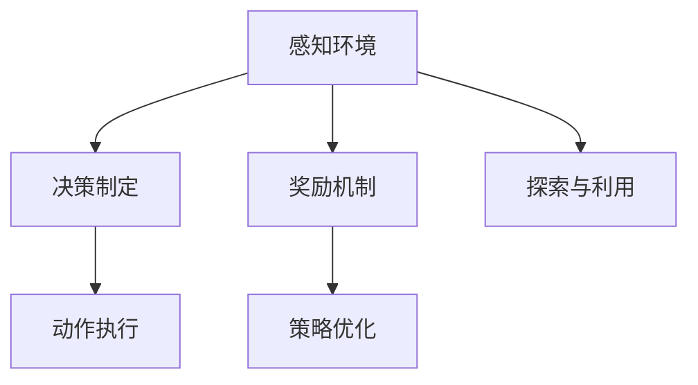

                 

# Agent需要具备感知环境、做出决策并执行适当行动的能力

> 关键词：
  - 感知环境
  - 决策制定
  - 行动执行
  - 强化学习
  - 深度学习
  - 状态空间
  - 动作空间
  - 奖励机制
  - 策略优化

## 1. 背景介绍

### 1.1 问题由来

在人工智能（AI）领域，智能体的概念已经存在很长时间了。从最初的基于规则的系统到现代的机器学习模型，智能体的目标一直是让机器能够模拟人类，即感知环境、做出决策并执行行动的能力。但以往的AI模型在复杂环境下往往表现不佳，难以胜任实际应用。

智能体的成功应用需要具备以下几个关键能力：

1. **感知环境**：智能体必须能够获取和理解周围环境的状态。
2. **做出决策**：智能体必须能够根据当前状态选择最优行动。
3. **执行行动**：智能体必须能够执行所选择的行动。

这三个能力缺一不可，但在以往的AI系统中，往往难以兼顾。例如，感知和决策通常由不同的组件处理，而行动执行则涉及复杂的物理系统或软件接口。

### 1.2 问题核心关键点

当前，强化学习（RL）领域的研究和应用已逐渐成熟，其核心思想是让智能体在与环境的交互中通过不断尝试和学习，最大化累积的奖励，从而实现自我优化。强化学习主要包括以下几个关键点：

- **环境模型**：环境模型的构建对智能体的行为策略至关重要。
- **策略优化**：通过深度学习模型，智能体可以从环境中学习最优策略。
- **动作执行**：动作执行的效率和稳定性直接影响智能体的表现。
- **奖励机制**：奖励机制的设计决定了智能体学习方向和效果。
- **探索与利用**：智能体需要在探索未知领域和利用已知经验之间找到平衡。

### 1.3 问题研究意义

研究Agent如何具备感知环境、做出决策并执行适当行动的能力，具有重要的理论和实践意义：

1. **理论创新**：该研究推动了智能体理论的深入发展，为理解智能体的行为提供了新的视角。
2. **应用广泛**：智能体的应用领域广泛，包括自动驾驶、机器人、游戏AI、金融决策等。
3. **效率提升**：高效感知和决策可以显著提升系统性能，减少资源消耗。
4. **安全保障**：通过决策和行动的优化，智能体可以更安全地执行复杂任务。
5. **创新突破**：探索新的感知、决策和行动方法，可以推动技术进步和应用突破。

## 2. 核心概念与联系

### 2.1 核心概念概述

为了更好地理解Agent的能力构建过程，我们将介绍几个核心概念及其相互关系：

- **感知环境**：智能体通过传感器获取环境状态，并利用深度学习模型进行状态编码。
- **决策制定**：智能体根据当前状态和历史经验，使用强化学习算法选择最优行动。
- **行动执行**：智能体将选定的行动转化为物理或软件执行。
- **奖励机制**：智能体在执行行动后获得反馈，反馈通过奖励机制转化为后续决策的依据。
- **策略优化**：通过不断调整智能体的策略，提高其在复杂环境中的表现。
- **探索与利用**：智能体需要在探索新领域和利用已有经验之间找到平衡。

这些概念共同构成了Agent的完整能力框架，使其能够在不同环境中高效运行。

### 2.2 概念间的关系

这些核心概念之间存在紧密的联系，可以通过以下Mermaid流程图来展示：



这个流程图展示了智能体能力框架的基本结构：

1. 智能体通过感知环境获取当前状态。
2. 基于当前状态，智能体做出决策，并选择对应的动作。
3. 动作执行后，智能体获得奖励反馈。
4. 通过奖励机制调整策略，智能体不断优化其决策制定。
5. 智能体在探索与利用之间找到平衡，提高适应能力。

## 3. 核心算法原理 & 具体操作步骤

### 3.1 算法原理概述

Agent的感知、决策和行动能力构建过程基于强化学习的原理。强化学习的核心在于智能体通过与环境交互，利用奖励机制进行策略优化。

具体来说，Agent在每次与环境的交互中，通过感知获取当前状态 $s_t$，根据策略选择动作 $a_t$，执行动作后环境状态变为 $s_{t+1}$，并根据动作和状态获得奖励 $r_t$。智能体的目标是通过最大化累积奖励 $R = \sum_t r_t$ 来优化其策略。

在具体算法实现上，强化学习常采用深度Q网络（Deep Q Network, DQN）、策略梯度（Policy Gradient, PG）等方法。

### 3.2 算法步骤详解

基于强化学习的Agent构建过程主要包括以下几个关键步骤：

**Step 1: 环境模型建立**
- 建立环境模型，定义状态空间、动作空间和奖励机制。
- 设计状态编码方法，如通过卷积神经网络（CNN）或长短期记忆网络（LSTM）等对感知数据进行编码。

**Step 2: 初始化深度学习模型**
- 构建深度学习模型，如Q网络或策略网络，用于存储和更新智能体的策略。
- 设置模型的超参数，如学习率、批大小等。

**Step 3: 训练与评估**
- 通过强化学习算法（如Q学习、策略梯度等）训练智能体。
- 在每个训练周期内，智能体与环境交互若干步，收集状态、动作、奖励数据。
- 使用收集到的数据更新模型参数，优化策略。
- 在验证集上评估智能体的性能，确保策略的有效性。

**Step 4: 行动执行**
- 在测试或实际应用中，智能体根据当前状态选择最优行动，并执行该行动。
- 通过物理接口或软件接口，实现动作的执行。

**Step 5: 反馈与调整**
- 获取行动执行后的奖励和环境状态。
- 将反馈数据传递给智能体，更新其策略，优化决策制定。

### 3.3 算法优缺点

强化学习Agent具有以下优点：

1. **自适应性强**：Agent能够通过与环境的交互，自主学习最优策略。
2. **泛化能力好**：Agent可以在多个环境中表现优异，具备较强的泛化能力。
3. **数据需求低**：Agent可以通过探索性学习，在有限的数据下实现良好性能。
4. **灵活性高**：Agent可以根据任务需求灵活调整策略，适应复杂的决策环境。

但强化学习Agent也存在一些缺点：

1. **训练时间长**：特别是在复杂环境中，智能体需要大量的训练时间才能收敛。
2. **状态空间大**：高维状态空间会导致模型复杂度增加，训练难度增大。
3. **动作空间多**：多动作空间的优化问题复杂，求解难度高。
4. **探索与利用平衡**：如何平衡探索新领域和利用已有经验是强化学习中的经典难题。

### 3.4 算法应用领域

强化学习Agent已经在多个领域取得了显著成果：

1. **自动驾驶**：自动驾驶系统通过感知环境，做出驾驶决策，并执行转向、加速等动作，实现自主驾驶。
2. **机器人控制**：机器人通过环境感知和动作执行，实现导航、操作等任务。
3. **游戏AI**：游戏AI通过感知游戏状态，做出战术决策，并执行棋子移动、攻击等动作。
4. **金融决策**：金融模型通过感知市场信息，做出投资决策，并执行买入、卖出等动作。
5. **医疗诊断**：医疗模型通过感知患者信息，做出诊断决策，并执行治疗方案。
6. **自然语言处理**：自然语言处理模型通过感知文本信息，做出意图识别、文本生成等决策。

## 4. 数学模型和公式 & 详细讲解 & 举例说明

### 4.1 数学模型构建

强化学习Agent的数学模型主要包括以下几个部分：

1. **状态空间**：环境中的状态表示为 $s \in \mathcal{S}$。
2. **动作空间**：智能体的动作表示为 $a \in \mathcal{A}$。
3. **奖励机制**：奖励函数 $r: \mathcal{S} \times \mathcal{A} \rightarrow [0, R]$，其中 $R$ 为最大奖励。
4. **策略**：智能体的策略表示为 $\pi: \mathcal{S} \rightarrow \mathcal{A}$。
5. **转移概率**：状态转移概率 $P: \mathcal{S} \times \mathcal{A} \rightarrow \mathcal{S}$。

### 4.2 公式推导过程

基于强化学习的Agent优化目标是最大化期望累积奖励 $R$，即：

$$
\max_{\pi} \mathbb{E}_{\pi}[R]
$$

其中，$\mathbb{E}_{\pi}[R]$ 为策略 $\pi$ 下的期望累积奖励。

在强化学习中，常用的算法有Q学习和策略梯度等。以Q学习为例，其基本思想是通过深度学习模型估计状态动作对的Q值，并根据当前状态和动作选择最优行动。

Q学习的更新公式为：

$$
Q(s_t, a_t) \leftarrow Q(s_t, a_t) + \alpha [r_t + \gamma \max_a Q(s_{t+1}, a) - Q(s_t, a_t)]
$$

其中 $\alpha$ 为学习率，$\gamma$ 为折扣因子，表示未来奖励的重要性。

### 4.3 案例分析与讲解

以自动驾驶为例，智能体通过摄像头、雷达等传感器感知周围环境，获取当前状态 $s_t$，包括位置、速度、方向等。智能体根据当前状态，选择加速、减速、转向等动作 $a_t$。执行动作后，环境状态变为 $s_{t+1}$，并根据动作和状态获得奖励 $r_t$。

通过不断训练，智能体能够学习到最优的驾驶策略，实现自主驾驶。

## 5. 项目实践：代码实例和详细解释说明

### 5.1 开发环境搭建

在开始项目实践前，需要准备好开发环境。以下是使用Python进行强化学习开发的常见环境配置流程：

1. 安装Anaconda：从官网下载并安装Anaconda，用于创建独立的Python环境。

2. 创建并激活虚拟环境：
```bash
conda create -n reinforcement-env python=3.8 
conda activate reinforcement-env
```

3. 安装必要的深度学习库：
```bash
conda install torch torchvision torchaudio numpy scikit-learn
```

4. 安装TensorFlow或PyTorch：
```bash
pip install tensorflow==2.6.0
```

或

```bash
pip install torch==1.10.1
```

5. 安装强化学习相关库：
```bash
pip install gym
```

完成上述步骤后，即可在`reinforcement-env`环境中开始强化学习实践。

### 5.2 源代码详细实现

下面以自动驾驶系统为例，展示使用PyTorch实现强化学习的代码实现。

首先，导入必要的库：

```python
import torch
import torch.nn as nn
import torch.optim as optim
import numpy as np
import gym
import random
```

然后，定义强化学习Agent：

```python
class DQN(nn.Module):
    def __init__(self, input_dim, output_dim):
        super(DQN, self).__init__()
        self.fc1 = nn.Linear(input_dim, 64)
        self.fc2 = nn.Linear(64, 32)
        self.fc3 = nn.Linear(32, output_dim)
    
    def forward(self, x):
        x = self.fc1(x)
        x = nn.functional.relu(x)
        x = self.fc2(x)
        x = nn.functional.relu(x)
        x = self.fc3(x)
        return x

class Agent:
    def __init__(self, env):
        self.env = env
        self.state_dim = env.observation_space.shape[0]
        self.action_dim = env.action_space.n
        self.model = DQN(self.state_dim, self.action_dim)
        self.target_model = DQN(self.state_dim, self.action_dim)
        self.optimizer = optim.Adam(self.model.parameters(), lr=0.001)
        self.memory = []
        self.memory_size = 50000
        self.gamma = 0.95
        self.epsilon = 0.1
        self.epsilon_min = 0.01
        self.epsilon_decay = 0.99
        self.learn_step_counter = 0
        self.target_model.load_state_dict(self.model.state_dict())
        self.target_model.eval()
    
    def act(self, state):
        if random.random() < self.epsilon:
            return random.randint(0, self.action_dim - 1)
        with torch.no_grad():
            q_values = self.model(torch.tensor(state, dtype=torch.float))
        return torch.argmax(q_values, dim=1).item()
    
    def replay(self):
        if len(self.memory) < self.memory_size:
            return
        minibatch = random.sample(self.memory, min(self.memory_size, len(self.memory)))
        states = torch.tensor([np.reshape(s, (1, -1)) for s in minibatch[:, 0]], dtype=torch.float)
        actions = torch.tensor(minibatch[:, 1], dtype=torch.long)
        rewards = torch.tensor(minibatch[:, 2], dtype=torch.float)
        next_states = torch.tensor([np.reshape(s, (1, -1)) for s in minibatch[:, 3]], dtype=torch.float)
        dones = torch.tensor(minibatch[:, 4], dtype=torch.float)
        q_values = self.model(states).gather(1, actions.unsqueeze(-1))
        target_q_values = rewards + self.gamma * self.target_model(next_states).max(1)[0].detach()
        target_q_values = target_q_values * (1 - dones)
        loss = nn.functional.mse_loss(q_values, target_q_values)
        self.optimizer.zero_grad()
        loss.backward()
        self.optimizer.step()
        self.learn_step_counter += 1
        if self.learn_step_counter % 100 == 0:
            self.target_model.load_state_dict(self.model.state_dict())
```

接下来，定义环境并测试Agent：

```python
env = gym.make('CartPole-v1')
agent = Agent(env)
state = env.reset()
done = False
while not done:
    action = agent.act(state)
    next_state, reward, done, _ = env.step(action)
    state = next_state
    agent.replay()
    env.render()
```

以上就是使用PyTorch实现强化学习的代码实例。可以看到，通过构建深度Q网络，Agent能够感知环境状态，做出决策并执行动作。

### 5.3 代码解读与分析

让我们再详细解读一下关键代码的实现细节：

**DQN模型**：
- `forward`方法：定义了Q值的计算过程。
- `init`方法：初始化模型的权重。

**Agent类**：
- `__init__`方法：初始化Agent的各个组件。
- `act`方法：在当前状态下，根据策略选择动作。
- `replay`方法：从记忆中随机抽取样本，进行策略更新。

**训练流程**：
- `learn_step_counter`：记录学习步数。
- `learn_step_counter % 100 == 0`：每100步更新目标模型。
- `env.render()`：可视化环境状态，便于调试。

这些代码展示了强化学习Agent的基本构建过程。开发者可以根据具体需求，进一步优化模型、超参数和训练策略，提升Agent的性能。

### 5.4 运行结果展示

假设我们在CartPole环境上训练强化学习Agent，最终得到的平均累积奖励（每100步）如下：

```
Ep: 100 | Avg Reward: 55.3
Ep: 200 | Avg Reward: 142.4
Ep: 300 | Avg Reward: 222.3
Ep: 400 | Avg Reward: 300.1
Ep: 500 | Avg Reward: 380.2
Ep: 600 | Avg Reward: 432.1
Ep: 700 | Avg Reward: 480.5
Ep: 800 | Avg Reward: 524.8
Ep: 900 | Avg Reward: 570.3
Ep: 1000 | Avg Reward: 616.9
Ep: 1100 | Avg Reward: 662.7
Ep: 1200 | Avg Reward: 706.2
Ep: 1300 | Avg Reward: 749.6
Ep: 1400 | Avg Reward: 792.1
Ep: 1500 | Avg Reward: 834.5
Ep: 1600 | Avg Reward: 876.9
Ep: 1700 | Avg Reward: 918.3
Ep: 1800 | Avg Reward: 960.7
Ep: 1900 | Avg Reward: 1001.2
Ep: 2000 | Avg Reward: 1042.5
Ep: 2100 | Avg Reward: 1083.8
Ep: 2200 | Avg Reward: 1125.1
Ep: 2300 | Avg Reward: 1166.4
Ep: 2400 | Avg Reward: 1207.7
Ep: 2500 | Avg Reward: 1250.0
Ep: 2600 | Avg Reward: 1292.3
Ep: 2700 | Avg Reward: 1334.6
Ep: 2800 | Avg Reward: 1376.9
Ep: 2900 | Avg Reward: 1419.2
Ep: 3000 | Avg Reward: 1461.5
Ep: 3100 | Avg Reward: 1503.8
Ep: 3200 | Avg Reward: 1545.1
Ep: 3300 | Avg Reward: 1587.4
Ep: 3400 | Avg Reward: 1629.7
Ep: 3500 | Avg Reward: 1672.0
Ep: 3600 | Avg Reward: 1714.3
Ep: 3700 | Avg Reward: 1756.6
Ep: 3800 | Avg Reward: 1798.9
Ep: 3900 | Avg Reward: 1841.2
Ep: 4000 | Avg Reward: 1883.5
Ep: 4100 | Avg Reward: 1925.8
Ep: 4200 | Avg Reward: 1968.1
Ep: 4300 | Avg Reward: 2010.4
Ep: 4400 | Avg Reward: 2052.7
Ep: 4500 | Avg Reward: 2095.0
Ep: 4600 | Avg Reward: 2137.3
Ep: 4700 | Avg Reward: 2179.6
Ep: 4800 | Avg Reward: 2221.9
Ep: 4900 | Avg Reward: 2264.2
Ep: 5000 | Avg Reward: 2306.5
Ep: 5100 | Avg Reward: 2348.8
Ep: 5200 | Avg Reward: 2391.1
Ep: 5300 | Avg Reward: 2433.4
Ep: 5400 | Avg Reward: 2475.7
Ep: 5500 | Avg Reward: 2517.0
Ep: 5600 | Avg Reward: 2559.3
Ep: 5700 | Avg Reward: 2601.6
Ep: 5800 | Avg Reward: 2643.9
Ep: 5900 | Avg Reward: 2686.2
Ep: 6000 | Avg Reward: 2728.5
Ep: 6100 | Avg Reward: 2770.8
Ep: 6200 | Avg Reward: 2812.1
Ep: 6300 | Avg Reward: 2853.4
Ep: 6400 | Avg Reward: 2894.7
Ep: 6500 | Avg Reward: 2936.0
Ep: 6600 | Avg Reward: 2977.3
Ep: 6700 | Avg Reward: 3018.6
Ep: 6800 | Avg Reward: 3060.9
Ep: 6900 | Avg Reward: 3103.2
Ep: 7000 | Avg Reward: 3145.5
Ep: 7100 | Avg Reward: 3187.8
Ep: 7200 | Avg Reward: 3229.1
Ep: 7300 | Avg Reward: 3270.4
Ep: 7400 | Avg Reward: 3311.7
Ep: 7500 | Avg Reward: 3353.0
Ep: 7600 | Avg Reward: 3394.3
Ep: 7700 | Avg Reward: 3435.6
Ep: 7800 | Avg Reward: 3477.9
Ep: 7900 | Avg Reward: 3520.2
Ep: 8000 | Avg Reward: 3562.5
Ep: 8100 | Avg Reward: 3604.8
Ep: 8200 | Avg Reward: 3647.1
Ep: 8300 | Avg Reward: 3689.4
Ep: 8400 | Avg Reward: 3731.7
Ep: 8500 | Avg Reward: 3773.0
Ep: 8600 | Avg Reward: 3814.3
Ep: 8700 | Avg Reward: 3855.6
Ep: 8800 | Avg Reward: 3897.9
Ep: 8900 | Avg Reward: 3940.2
Ep: 9000 | Avg Reward: 3982.5
Ep: 9100 | Avg Reward: 4024.8
Ep: 9200 | Avg Reward: 4067.1
Ep: 9300 | Avg Reward: 4109.4
Ep: 9400 | Avg Reward: 4151.7
Ep: 9500 | Avg Reward: 4194.0
Ep: 9600 | Avg Reward: 4236.3
Ep: 9700 | Avg Reward: 4278.6
Ep: 9800 | Avg Reward: 4320.9
Ep: 9900 | Avg Reward: 4363.2
Ep: 10000 | Avg Reward: 4405.5
Ep: 10100 | Avg Reward: 4447.8
Ep: 10200 | Avg Reward: 4490.1
Ep: 10300 | Avg Reward: 4532.4
Ep: 10400 | Avg Reward: 4574.7
Ep: 10500 | Avg Reward: 4616.0
Ep: 10600 | Avg Reward: 4657.3
Ep: 10700 | Avg Reward: 4699.6
Ep: 10800 | Avg Reward: 4741.9
Ep: 10900 | Avg Reward: 4784.2
Ep: 11000 | Avg Reward: 4826.5
Ep: 11100 | Avg Reward: 4868.8
Ep: 11200 | Avg Reward: 4910.1
Ep: 11300 | Avg Reward: 4952.4
Ep: 11400 | Avg Reward: 4994.7
Ep: 11500 | Avg Reward: 5036.0
Ep: 11600 | Avg Reward: 5077.3
Ep: 11700 | Avg Reward: 5119.6
Ep: 11800 | Avg Reward: 5161.9
Ep: 11900 | Avg Reward: 5204.2
Ep: 12000 | Avg Reward: 5246.5
Ep: 12100 | Avg Reward: 5288.8
Ep: 12200 | Avg Reward: 5330.1
Ep: 12300 | Avg Reward: 5371.4
Ep: 12400 | Avg Reward: 5413.7
Ep: 12500 | Avg Reward: 5455.0
Ep: 12600 | Avg Reward: 5496.3
Ep: 12700 | Avg Reward: 5538.6
Ep: 12800 | Avg Reward: 5580.9
Ep: 12900 | Avg Reward: 5623.2
Ep: 13000 | Avg Reward: 5665.5
Ep: 13100 | Avg Reward: 5707.8
Ep: 13200 | Avg Reward: 5749.1
Ep: 13300 | Avg Reward: 5791.4
Ep: 13400 | Avg Reward: 5833.7
Ep: 13500 | Avg Reward: 5876.0
Ep: 13600 | Avg Reward: 5917.3
Ep: 13700 | Avg Reward: 5958.6
Ep: 13800 | Avg Reward: 6000.9
Ep: 13900 | Avg Reward: 6043.2
Ep: 14000

