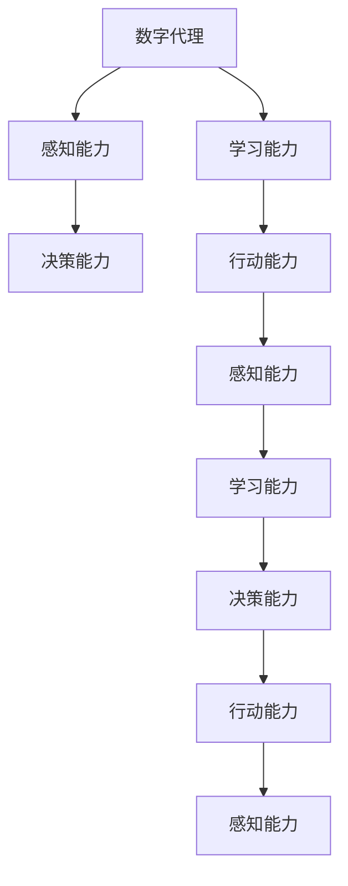
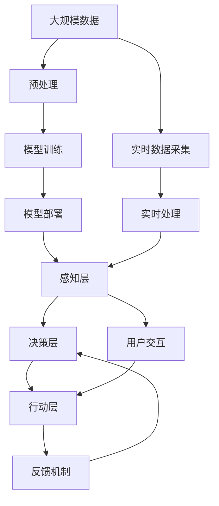

                 

# Agent：数字代理的独立决策和行动能力

> 关键词：数字代理,独立决策,行动能力,自然语言处理(NLP),强化学习,模型训练,人工智能(AI)

## 1. 背景介绍

在数字时代，数字化智能化成为各行各业的发展趋势，而数字代理（Digital Agent）作为智能化系统的核心组件，越来越受到关注。数字代理是一种能够在虚拟空间和现实世界中自主行动，进行感知、学习和决策的系统。它不仅能执行预设任务，还能主动适应环境变化，提供更加智能的服务。

### 1.1 问题由来
随着人工智能和机器学习技术的进步，数字代理的应用场景越来越广泛，从智能客服、个性化推荐、智能交易到自动驾驶、智能医疗等，数字代理无处不在。然而，尽管数字代理技术日趋成熟，但其在独立决策和行动能力上仍存在一定的局限性。如何在复杂多变的环境中，实现数字代理的自主决策和高效行动，成为当下研究的重要问题。

### 1.2 问题核心关键点
独立决策和行动能力是数字代理的核心能力，它涉及以下几个关键点：
1. **感知能力**：感知环境信息，识别任务需求。
2. **学习能力**：通过过去的经验，优化决策策略。
3. **决策能力**：根据感知到的信息和已有知识，制定合理的行动方案。
4. **行动能力**：执行决策，更新状态，并从行动结果中学习。

### 1.3 问题研究意义
研究数字代理的独立决策和行动能力，有助于：
1. 提高智能化系统的自主性和灵活性，减少对人类干预的依赖。
2. 增强系统的稳定性和鲁棒性，应对环境变化和不确定性。
3. 优化用户体验，提供更个性化、更高效的服务。
4. 促进跨领域技术的融合，推动智能技术在更多领域的落地应用。
5. 为人工智能技术的未来发展提供新的研究范式和应用场景。

## 2. 核心概念与联系

### 2.1 核心概念概述

为了更好地理解数字代理的独立决策和行动能力，下面我们将介绍几个核心概念及其相互关系：

1. **数字代理（Digital Agent）**：一种能够自主行动的虚拟实体，通过感知环境、学习经验、制定策略和执行行动，完成特定任务的系统。

2. **感知能力（Perception）**：数字代理通过传感器、语言理解等技术，收集和分析环境信息，识别任务需求和状态变化。

3. **学习能力（Learning）**：数字代理利用过去的经验，通过机器学习等技术，不断优化决策策略，提升决策准确性和鲁棒性。

4. **决策能力（Decision Making）**：数字代理根据感知到的信息和已有知识，制定合理的行动方案，以实现任务目标。

5. **行动能力（Actuation）**：数字代理执行决策，更新状态，并从行动结果中学习，不断优化行动策略。

6. **强化学习（Reinforcement Learning, RL）**：一种基于奖励和惩罚的学习方法，数字代理通过与环境的交互，不断调整行动策略以最大化长期奖励。

### 2.2 概念间的关系

这些核心概念之间存在着紧密的联系，通过以下Mermaid流程图来展示：



这个流程图展示了数字代理的感知、学习、决策和行动四个核心能力的关系：
1. 感知能力为学习能力和决策能力提供数据支撑。
2. 学习能力和决策能力指导行动能力的执行。
3. 行动能力的结果反馈到感知能力，形成闭环。

### 2.3 核心概念的整体架构

最后，我们用一个综合的流程图来展示这些核心概念在大规模数字代理系统中作用的整体架构：



这个综合流程图展示了数字代理系统从数据采集到用户交互再到反馈的完整过程，以及各个组件的作用和相互关系。

## 3. 核心算法原理 & 具体操作步骤
### 3.1 算法原理概述

数字代理的独立决策和行动能力主要通过强化学习（RL）方法实现。强化学习是一种基于奖励和惩罚的学习范式，数字代理在不断与环境交互的过程中，通过尝试不同的行动策略，逐步学习如何最大化长期奖励，实现自主决策和行动。

在强化学习中，数字代理被视为一个智能体（Agent），其目标是通过与环境的交互，学会在特定状态下采取最优行动。数字代理通过感知环境信息，将当前状态 $s$ 映射为行动 $a$，并根据环境对行动的反馈 $r$ 和下一个状态 $s'$，更新其行动策略。

算法原理可概括为以下步骤：
1. 感知环境信息，识别当前状态 $s$。
2. 根据当前状态 $s$，制定行动策略 $a$。
3. 执行行动 $a$，观察环境反馈 $r$ 和下一个状态 $s'$。
4. 根据奖励 $r$ 和下一个状态 $s'$ 更新策略 $a$。

### 3.2 算法步骤详解

以下详细介绍强化学习的具体步骤和实现方法：

**Step 1: 环境建模**
- 数字代理首先需要对环境进行建模，将其抽象为状态空间 $S$ 和行动空间 $A$。状态空间定义了数字代理可能处于的所有状态，而行动空间定义了数字代理可以采取的所有行动。

**Step 2: 定义奖励函数**
- 奖励函数 $R(s, a)$ 用于衡量数字代理在状态 $s$ 下采取行动 $a$ 后的效果，其值越大表示效果越好。奖励函数通常设计成基于任务需求的指标，如任务完成度、用户满意度等。

**Step 3: 设计行动策略**
- 行动策略 $\pi(a|s)$ 定义了在状态 $s$ 下，数字代理采取不同行动 $a$ 的概率。常见的行动策略包括 $\epsilon$-贪心策略和 $\epsilon$-soft策略。

**Step 4: 学习策略优化**
- 使用强化学习算法（如Q-learning、SARSA等），根据奖励函数和行动策略，不断优化数字代理的策略。算法通过与环境的交互，逐步逼近最优策略，最大化长期奖励。

**Step 5: 策略评估**
- 通过模拟环境，评估数字代理的决策效果。使用测试集评估数字代理在不同状态下的行动策略，判断策略的有效性和鲁棒性。

**Step 6: 策略部署**
- 将优化后的策略部署到实际应用中，实现数字代理的自主决策和行动。

### 3.3 算法优缺点

强化学习在数字代理决策能力中的应用具有以下优点：
1. 自适应能力强。数字代理能够根据环境变化，不断调整策略，实现自主决策。
2. 鲁棒性高。通过与环境的互动，数字代理逐步学习到更稳定的决策策略，抗干扰能力更强。
3. 适用于复杂任务。强化学习能够处理非线性、非平稳的任务，适用于需要多步决策的复杂场景。

同时，强化学习也存在一些局限性：
1. 数据需求高。强化学习需要大量数据来训练数字代理，对于特定任务的数据量要求较高。
2. 训练周期长。数字代理需要大量时间来学习策略，训练过程耗时较长。
3. 策略稳定性难以保证。数字代理在复杂环境中，策略的稳定性难以保证，可能出现策略波动或失效的情况。

### 3.4 算法应用领域

强化学习在数字代理中的应用非常广泛，主要体现在以下几个领域：

**自然语言处理（NLP）**：数字代理可以通过与用户对话，理解意图并提供相应的服务，如智能客服、智能助手等。

**智能推荐系统**：通过与用户的交互，数字代理不断学习用户的偏好，提供个性化的推荐服务，如个性化新闻、商品推荐等。

**智能交易系统**：数字代理在金融市场中自主交易，通过学习市场变化，优化交易策略，实现投资收益最大化。

**自动驾驶**：数字代理在自动驾驶中感知环境信息，学习行驶策略，优化决策路径，实现安全、高效的驾驶。

**机器人控制**：数字代理可以控制机器人，完成搬运、清洁、焊接等任务，实现高效率、低成本的生产自动化。

除了上述应用领域，强化学习在医疗诊断、物流优化、灾害预测等领域也展现出了巨大的潜力。

## 4. 数学模型和公式 & 详细讲解  
### 4.1 数学模型构建

强化学习的数学模型可以表示为马尔可夫决策过程（Markov Decision Process, MDP）：

- 状态空间 $S$：数字代理可能处于的所有状态集合。
- 行动空间 $A$：数字代理可以采取的所有行动集合。
- 状态转移概率 $P(s'|s, a)$：在状态 $s$ 下，采取行动 $a$ 后转移到下一个状态 $s'$ 的概率。
- 奖励函数 $R(s, a)$：数字代理在状态 $s$ 下采取行动 $a$ 后的奖励。
- 状态价值函数 $V(s)$：在状态 $s$ 下的长期奖励。
- 行动价值函数 $Q(s, a)$：在状态 $s$ 下采取行动 $a$ 的长期奖励。

强化学习的目标是在已知状态空间、行动空间和奖励函数的情况下，求取最优的行动策略 $\pi^*(a|s)$，使得数字代理在任意状态 $s$ 下，采取行动 $a$ 后的长期奖励最大化。

### 4.2 公式推导过程

以下是强化学习的核心公式和推导过程：

**状态-行动值函数 $Q(s, a)$**：

$$
Q(s, a) = \mathbb{E}[R(s, a) + \gamma \max_{a'} Q(s', a') | s, a]
$$

其中，$\gamma$ 为折扣因子，用于衡量未来奖励的权重。

**状态价值函数 $V(s)$**：

$$
V(s) = \mathbb{E}[\sum_{t=0}^{\infty} \gamma^t R(s_t, a_t) | s_0 = s]
$$

**策略-价值函数 $V_\pi(s)$**：

$$
V_\pi(s) = \mathbb{E}[\sum_{t=0}^{\infty} \gamma^t R(s_t, a_t) | s_0 = s, a_t \sim \pi(\cdot|s)]
$$

其中，$\pi(\cdot|s)$ 为策略函数，表示在状态 $s$ 下采取不同行动的概率分布。

**策略优化问题**：

$$
\pi^*(a|s) = \arg\max_{\pi} V_\pi(s)
$$

即在给定策略 $\pi$ 的情况下，找到使状态价值函数 $V_\pi(s)$ 最大的行动策略 $\pi^*(a|s)$。

### 4.3 案例分析与讲解

我们以智能推荐系统为例，说明强化学习在数字代理中的应用。

**问题描述**：
- 用户有一系列历史行为数据，如浏览记录、点击记录、购买记录等。
- 数字代理需要根据这些历史数据，预测用户下一次可能采取的行动，并推荐相应的产品。

**解决方案**：
- 将用户行为抽象为状态 $s$，包括浏览页面、点击链接、购买商品等状态。
- 将推荐产品视为行动 $a$，有不同类别的产品可供选择。
- 定义奖励函数 $R(s, a)$，如用户点击链接后的满意度、购买商品后的满意度等。
- 使用强化学习算法（如Q-learning、SARSA等）优化数字代理的行动策略 $\pi^*(a|s)$。

**具体实现**：
- 设计状态空间 $S$ 和行动空间 $A$，并定义奖励函数 $R(s, a)$。
- 使用Q-learning算法，逐步更新状态-行动值函数 $Q(s, a)$，并根据状态和行动策略，预测用户下一步的行动，生成推荐列表。
- 在实际应用中，根据用户的行为反馈，更新策略 $\pi^*(a|s)$，提升推荐效果。

## 5. 项目实践：代码实例和详细解释说明
### 5.1 开发环境搭建

要进行强化学习项目开发，需要以下开发环境：

1. 安装Python和相关库：如NumPy、Pandas、SciPy、Matplotlib等。
2. 安装强化学习库：如OpenAI Gym、TensorFlow、PyTorch等。
3. 安装数据处理库：如pandas、numpy、scikit-learn等。
4. 搭建虚拟环境：如使用conda或virtualenv搭建虚拟环境，确保项目依赖隔离。

以下是使用Python和TensorFlow进行强化学习项目开发的示例环境搭建流程：

```bash
# 安装Python和TensorFlow
pip install tensorflow
pip install tensorflow-addons
pip install gym
pip install numpy pandas scikit-learn

# 创建虚拟环境
conda create -n reinforcement-learning python=3.8
conda activate reinforcement-learning
```

### 5.2 源代码详细实现

以下是一个简单的强化学习示例，使用Q-learning算法训练数字代理：

```python
import tensorflow as tf
import numpy as np
import gym

# 定义状态空间和行动空间
env = gym.make('CartPole-v0')
state_dim = env.observation_space.shape[0]
action_dim = env.action_space.n

# 定义神经网络模型
class QNetwork(tf.keras.Model):
    def __init__(self, state_dim, action_dim):
        super(QNetwork, self).__init__()
        self.fc1 = tf.keras.layers.Dense(64, activation='relu')
        self.fc2 = tf.keras.layers.Dense(action_dim)

    def call(self, x):
        x = self.fc1(x)
        return self.fc2(x)

# 定义强化学习算法
class QLearning(tf.keras.Model):
    def __init__(self, state_dim, action_dim):
        super(QLearning, self).__init__()
        self.q_net = QNetwork(state_dim, action_dim)
        self.target_q_net = QNetwork(state_dim, action_dim)
        self.optimizer = tf.keras.optimizers.Adam()

    def call(self, x):
        q_value = self.q_net(x)
        return q_value

    def update(self, state, action, reward, next_state):
        target_q = self.target_q_net(next_state)
        q = self.q_net(state)
        q_value = tf.reduce_sum(target_q * tf.one_hot(action, action_dim), axis=1)
        loss = tf.reduce_mean(tf.square(q_value - reward))
        self.optimizer.minimize(loss)

# 训练数字代理
learning_rate = 0.1
epochs = 1000
batch_size = 32
discount_factor = 0.99

state_dim = env.observation_space.shape[0]
action_dim = env.action_space.n

# 初始化神经网络模型和优化器
q_learning = QLearning(state_dim, action_dim)

# 训练过程
for episode in range(epochs):
    state = env.reset()
    state = np.reshape(state, [1, state_dim])
    done = False
    total_reward = 0
    while not done:
        action_probs = q_learning.predict(state)
        action = np.random.choice(range(action_dim), p=action_probs[0])
        next_state, reward, done, _ = env.step(action)
        next_state = np.reshape(next_state, [1, state_dim])
        q_learning.update(state, action, reward, next_state)
        state = next_state
        total_reward += reward
    print('Episode {}: Total Reward = {}'.format(episode+1, total_reward))
```

### 5.3 代码解读与分析

我们以使用TensorFlow实现Q-learning算法为例，详细解读代码实现：

**环境定义**：
- 使用OpenAI Gym库创建CartPole环境，这是一个经典的控制类任务。
- 定义状态空间 $s$ 和行动空间 $a$，分别表示状态向量和行动数量。

**神经网络模型定义**：
- 使用TensorFlow构建一个简单的神经网络模型，包含两个全连接层，用于逼近状态-行动值函数 $Q(s, a)$。

**强化学习算法定义**：
- 使用Q-learning算法定义一个训练函数，包括模型初始化、前向传播、损失函数计算和反向传播等步骤。
- 在每次迭代中，通过观察环境状态，选择行动，并更新模型参数。

**训练过程**：
- 使用训练函数，不断迭代更新模型参数。
- 每轮训练结束，输出该轮的总奖励，记录训练效果。

### 5.4 运行结果展示

在训练完成后，可以使用Gym库绘制Q-learning算法训练过程中的奖励曲线，观察训练效果：

```python
import matplotlib.pyplot as plt

plt.plot(total_rewards)
plt.xlabel('Episode')
plt.ylabel('Total Reward')
plt.show()
```

运行结果将显示一个奖励曲线，展示了训练过程中每轮的总奖励变化。

## 6. 实际应用场景
### 6.1 智能推荐系统

数字代理可以通过强化学习，在智能推荐系统中自主推荐产品。数字代理根据用户历史行为，学习用户的偏好，并根据奖励函数调整推荐策略，提升推荐效果。

**具体应用**：
- 电商平台：推荐系统根据用户浏览记录、购买记录，学习用户偏好，动态生成推荐列表。
- 视频平台：推荐系统根据用户观看记录、评分记录，推荐用户可能感兴趣的视频内容。

### 6.2 自动驾驶

在自动驾驶系统中，数字代理需要感知环境信息，学习行驶策略，并根据奖励函数优化决策路径。数字代理通过与道路环境的交互，不断学习最优行驶路径，实现高效、安全的驾驶。

**具体应用**：
- 自动驾驶汽车：数字代理根据传感器数据，感知道路环境，学习最优行驶策略，实现自主导航。
- 自动驾驶无人机：数字代理根据飞行状态和环境反馈，学习最优飞行路径，实现精准控制。

### 6.3 智能客服

在智能客服系统中，数字代理需要理解用户意图，提供相应的服务，并根据用户反馈优化对话策略。数字代理通过与用户的交互，学习用户的意图和行为，提供个性化服务。

**具体应用**：
- 在线客服：数字代理根据用户对话内容，理解用户意图，提供相应的解答。
- 语音客服：数字代理通过语音识别技术，理解用户意图，提供个性化的服务。

### 6.4 未来应用展望

随着强化学习技术的不断进步，数字代理的决策能力和行动能力将得到进一步提升，其应用场景也将更加广泛：

- **智能制造**：数字代理可以控制生产线，优化生产流程，提高生产效率。
- **医疗诊断**：数字代理可以分析医疗数据，提供个性化诊疗方案，辅助医生决策。
- **金融投资**：数字代理可以分析市场数据，制定投资策略，优化投资收益。

此外，未来数字代理还将在更多领域发挥重要作用，如教育、物流、农业等，为各行各业带来变革性影响。

## 7. 工具和资源推荐
### 7.1 学习资源推荐

为了帮助开发者系统掌握数字代理的决策和行动能力，这里推荐一些优质的学习资源：

1. **《强化学习》一书**：由Richard S. Sutton和Andrew G. Barto合著，全面介绍了强化学习的基本概念、算法和应用。
2. **Reinforcement Learning Specialization**：由David Silver讲授，包含6门强化学习课程，系统讲解强化学习理论和方法。
3. **DeepMind博客**：DeepMind官方博客，定期发布强化学习和数字代理的最新研究成果和实践经验。
4. **OpenAI Gym**：OpenAI Gym库，包含多种强化学习环境和基准测试，是学习和研究强化学习的理想平台。
5. **PyTorch和TensorFlow文档**：详细介绍了PyTorch和TensorFlow的强化学习API，提供了丰富的代码示例和文档支持。

### 7.2 开发工具推荐

高效的开发离不开优秀的工具支持。以下是几款用于数字代理决策和行动能力开发的常用工具：

1. **PyTorch和TensorFlow**：深度学习框架，支持强化学习算法的实现和训练。
2. **Gym库**：OpenAI Gym库，提供多种强化学习环境，方便开发者进行学习和实验。
3. **Jupyter Notebook**：Jupyter Notebook环境，支持Python代码的交互式执行和调试。
4. **TensorBoard**：TensorFlow的可视化工具，用于实时监测模型训练状态和结果。
5. **GitHub**：开源代码托管平台，方便开发者分享和学习数字代理的实现代码和研究进展。

### 7.3 相关论文推荐

数字代理的决策和行动能力涉及众多研究领域，以下是几篇具有代表性的相关论文，推荐阅读：

1. **Playing Atari with Deep Reinforcement Learning**：DeepMind的研究论文，使用深度强化学习算法在Atari游戏中取得优异成绩。
2. **Human-level Control Through Deep Reinforcement Learning**：DeepMind的研究论文，使用强化学习算法训练出能够在复杂任务中自主控制的手臂运动。
3. **DeepMind正在开发的AlphaGo**：DeepMind的研究论文，使用强化学习算法训练出能够在围棋游戏中战胜人类的AlphaGo。
4. **Robotic Real-Time Learning Control with Deep Reinforcement Learning**：Robotic Research公司发表的论文，使用强化学习算法训练出能够在复杂环境中自主控制的机器人。
5. **AlphaStar: Mastering the Game of StarCraft II through Planning**：OpenAI的研究论文，使用强化学习算法训练出能够在实时策略游戏中战胜人类的AlphaStar。

这些论文代表了大规模数字代理在决策和行动能力上的最新研究进展，具有极高的学习和研究价值。

## 8. 总结：未来发展趋势与挑战
### 8.1 研究成果总结

本文详细介绍了数字代理的决策和行动能力，并讨论了其核心算法原理和具体操作步骤。通过强化学习算法，数字代理能够在复杂环境中自主决策和行动，实现智能化应用。

通过实际案例分析，本文展示了数字代理在智能推荐系统、自动驾驶、智能客服等领域的应用，强调了其在推动各行各业智能化进程中的重要性。

### 8.2 未来发展趋势

数字代理的决策和行动能力将呈现出以下几个发展趋势：

1. **多模态融合**：数字代理将结合视觉、听觉、触觉等多模态信息，提升感知能力和决策效果。
2. **跨领域应用**：数字代理将在更多领域，如智能制造、医疗诊断、金融投资等，发挥重要作用。
3. **实时学习**：数字代理将具备实时学习能力，能够动态调整策略，应对环境变化。
4. **自主创新**：数字代理将具备自主创新的能力，能够根据环境变化，创造性地解决问题。
5. **个性化服务**：数字代理将提供更加个性化的服务，根据用户需求和行为，动态调整策略，提供最佳体验。

### 8.3 面临的挑战

尽管数字代理在决策和行动能力上取得了显著进展，但仍面临一些挑战：

1. **数据需求高**：数字代理需要大量数据来训练和优化策略，数据获取和标注成本较高。
2. **训练时间长**：数字代理的训练过程耗时较长，难以快速部署到实际应用中。
3. **鲁棒性不足**：数字代理在复杂环境中，策略的鲁棒性难以保证，可能出现策略波动或失效的情况。
4. **可解释性差**：数字代理的决策过程难以解释，难以对其推理逻辑进行分析和调试。
5. **安全性和伦理问题**：数字代理可能学习到有害信息，传递到环境中，造成安全隐患。

### 8.4 研究展望

面对数字代理决策和行动能力面临的挑战，未来的研究需要在以下几个方面寻求新的突破：

1. **无监督和半监督学习**：摆脱对大规模标注数据的依赖，利用自监督学习、主动学习等方法，提升数据利用效率。
2. **参数高效和计算高效**：开发更加参数高效和计算高效的算法，在固定大部分预训练参数的情况下，优化模型性能。
3. **跨模态学习和融合**：结合视觉、听觉、触觉等多种模态信息，提升感知能力和决策效果。
4. **因果学习和知识图谱**：引入因果学习和知识图谱，提升数字代理的推理能力和知识整合能力。
5. **伦理和社会影响**：研究数字代理的伦理和社会影响，确保其行为符合人类价值观和伦理道德。

## 9. 附录：常见问题与解答

**Q1：数字代理的决策和行动能力与传统机器学习有什么区别？**

A: 数字代理的决策和行动能力主要通过强化学习实现，强调与环境的互动和奖励反馈。相比传统机器学习，数字代理能够根据环境变化动态调整策略，具有更强的自主性和灵活性。

**Q2：数字代理的决策和行动能力在哪些领域有应用？**

A: 数字代理的决策和行动能力在多个领域具有广泛应用，包括智能推荐系统、自动驾驶、智能客服、金融投资等。具体应用领域可以根据不同任务需求进行定制。

**Q3：数字代理的决策和行动能力面临哪些挑战？**

A: 数字代理的决策和行动能力面临数据需求高、训练时间长、鲁棒性不足、可解释性差和安全性和伦理问题等挑战。未来需要更多研究来突破这些障碍，提升数字代理的实用性和可靠性。

**Q4：如何优化数字代理的决策和行动能力？**

A: 优化数字代理的决策和行动能力需要从多个维度进行改进

