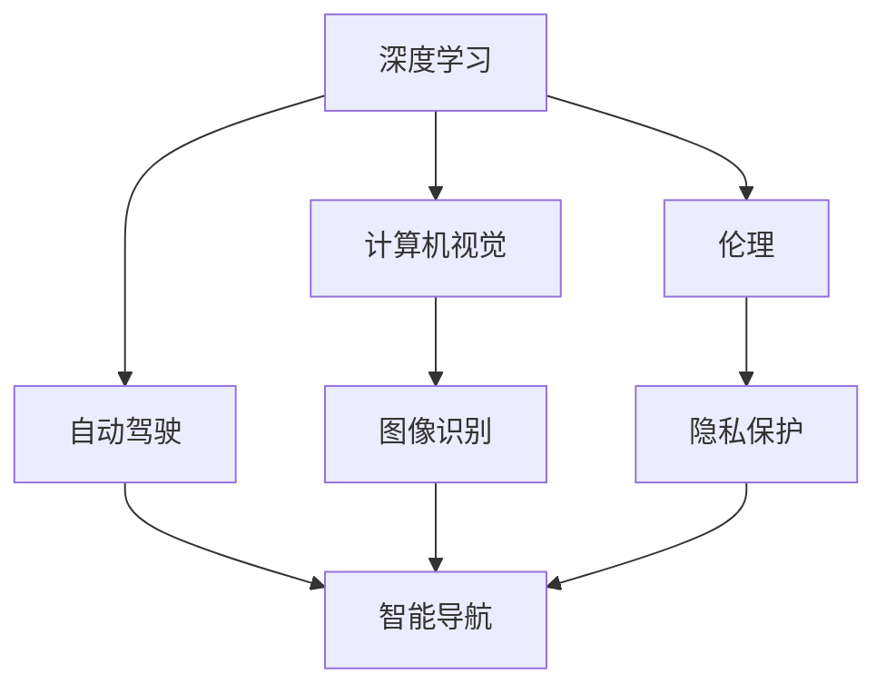

                 

# Andrej Karpathy谈AI的未来

## 1. 背景介绍

### 1.1 问题由来
人工智能(AI)技术已经深刻地改变了我们生活的方方面面，从自动化驾驶、智能客服到医疗诊断，AI的应用无处不在。Andrej Karpathy，作为AI领域的著名专家，他的观点和洞察对于理解AI的未来走向具有重要的指导意义。在本篇文章中，我们将围绕AI的未来发展、技术趋势、伦理挑战等话题，深度探讨Andrej Karpathy的见解。

### 1.2 问题核心关键点
Andrej Karpathy在AI领域的研究涉及深度学习、计算机视觉、自动驾驶等多个方向。他的工作不仅推动了学术界的理论发展，还对工业界的技术应用产生了深远影响。因此，本文将重点探讨他在这些领域的洞察，以及他对于AI未来发展的看法。

### 1.3 问题研究意义
理解Andrej Karpathy对于AI未来的观点，有助于我们把握技术发展的脉络，规避潜在的风险，同时也能为AI技术的产业化应用提供新的思路。他的见解对于AI从业者、研究人员、投资者以及所有对AI技术发展感兴趣的人士，都具有重要的参考价值。

## 2. 核心概念与联系

### 2.1 核心概念概述

在探讨AI的未来时，Andrej Karpathy强调了几个关键概念：

- **深度学习(Deep Learning)**：一种模拟人脑神经网络结构的机器学习方法，通过多层次的非线性变换，从大量数据中学习抽象特征。
- **计算机视觉(Computer Vision)**：使计算机能够理解并解释图像、视频等视觉数据的学科。
- **自动驾驶(Autonomous Driving)**：利用AI技术实现车辆自主导航和决策的过程。
- **伦理(Ethics)**：AI技术的道德和法律问题，包括隐私保护、偏见消除、责任归属等。

这些概念之间相互联系，共同构成了AI技术的核心框架。

### 2.2 概念间的关系

为了更好地理解这些核心概念的关系，我们可以使用以下Mermaid流程图进行展示：



这个流程图展示了深度学习、计算机视觉、自动驾驶和伦理之间的联系：

- 深度学习提供了计算机视觉任务（如图像识别）的基础算法。
- 计算机视觉是自动驾驶系统中的重要组成部分，负责环境感知。
- 自动驾驶涉及伦理问题，如责任归属、隐私保护等。
- 伦理是所有AI技术发展的基石，确保技术的公正性和安全性。

### 2.3 核心概念的整体架构

以下是一个综合的流程图，展示了AI领域的整体架构：

```mermaid
graph TB
    A[AI研究] --> B[深度学习]
    B --> C[计算机视觉]
    B --> D[自然语言处理(NLP)]
    C --> E[图像分类]
    C --> F[物体检测]
    D --> G[语音识别]
    D --> H[文本生成]
    E --> I[目标识别]
    F --> J[姿态估计]
    G --> K[语言理解]
    H --> L[自动摘要]
    I --> J
    J --> K
    L --> M[对话生成]
    M --> N[机器翻译]
    A --> O[AI应用]
    O --> P[智能客服]
    O --> Q[医疗诊断]
    O --> R[自动驾驶]
    A --> S[AI伦理]
    S --> T[隐私保护]
    S --> U[偏见消除]
```

这个综合流程图展示了从基础研究到应用落地，AI技术的全貌：

- AI研究是AI技术发展的基础。
- 深度学习、计算机视觉、自然语言处理(NLP)是AI技术的主要分支。
- 图像分类、物体检测、语音识别、文本生成等具体任务是这些分支的研究方向。
- 应用层面，智能客服、医疗诊断、自动驾驶等是AI技术的重要落地场景。
- 伦理是贯穿于AI技术发展全过程的重要问题，包括隐私保护、偏见消除等。

通过这些概念和图表，我们可以更清晰地理解Andrej Karpathy在AI未来发展中的核心观点和见解。

## 3. 核心算法原理 & 具体操作步骤

### 3.1 算法原理概述

Andrej Karpathy在深度学习领域的研究，特别是卷积神经网络(CNN)和循环神经网络(RNN)的优化，对于理解AI未来的技术趋势具有重要意义。他认为，未来AI技术的核心在于更加复杂的神经网络结构和更高效的训练方法。

**3.2 算法步骤详解**

下面，我们具体分析Andrej Karpathy提出的深度学习算法步骤：

1. **数据准备**：收集大量高质量的标注数据，分为训练集、验证集和测试集。数据的多样性和丰富性对于模型性能至关重要。
2. **模型选择**：选择合适的深度学习模型，如卷积神经网络(CNN)、循环神经网络(RNN)、注意力机制(Attention)等，并调整其结构参数。
3. **模型训练**：使用随机梯度下降(SGD)或其变种(如Adam、Adagrad)对模型进行训练，不断调整权重和偏差，最小化损失函数。
4. **模型验证**：在验证集上评估模型性能，调整超参数(如学习率、批大小)，确保模型泛化能力。
5. **模型测试**：在测试集上评估模型性能，计算准确率、精确率、召回率等指标，评估模型效果。
6. **模型部署**：将模型部署到实际应用场景中，进行实时推理和决策。

### 3.3 算法优缺点

Andrej Karpathy认为，深度学习算法具有以下优点：

- **高精度**：在图像识别、语音识别、文本分类等任务中，深度学习模型已经超越了传统方法，达到了甚至超越了人类的水平。
- **自适应性**：深度学习模型能够自动从数据中学习特征，适应不同的应用场景和数据分布。
- **可扩展性**：通过增加模型层数和神经元数量，深度学习模型可以处理更复杂的数据和任务。

同时，深度学习算法也存在一些缺点：

- **计算资源需求高**：深度学习模型的训练和推理需要大量的计算资源，包括高性能的GPU和TPU。
- **过拟合风险**：深度学习模型容易过拟合，尤其是在标注数据不足的情况下。
- **可解释性差**：深度学习模型通常是"黑盒"模型，难以解释其内部工作机制和决策逻辑。

### 3.4 算法应用领域

Andrej Karpathy强调，深度学习算法在计算机视觉、自然语言处理、自动驾驶等多个领域具有广泛的应用前景：

- **计算机视觉**：图像分类、物体检测、图像生成等任务。
- **自然语言处理**：文本分类、机器翻译、对话生成等任务。
- **自动驾驶**：环境感知、路径规划、决策优化等任务。

## 4. 数学模型和公式 & 详细讲解  
### 4.1 数学模型构建

Andrej Karpathy的研究重点之一是深度学习的数学模型构建。下面，我们将详细介绍他对于深度学习模型的理解。

假设我们有一个简单的卷积神经网络(CNN)，输入为$x$，输出为$y$，网络结构包含卷积层、池化层、全连接层等。我们定义损失函数为均方误差损失，目标是最小化损失函数$\mathcal{L}$。

$$
\mathcal{L} = \frac{1}{N} \sum_{i=1}^N (y_i - \hat{y_i})^2
$$

其中$N$为样本数量，$y_i$为真实标签，$\hat{y_i}$为模型预测值。

### 4.2 公式推导过程

为了最小化损失函数$\mathcal{L}$，我们采用梯度下降算法，对模型参数$\theta$进行迭代更新：

$$
\theta \leftarrow \theta - \eta \nabla_{\theta} \mathcal{L}
$$

其中$\eta$为学习率，$\nabla_{\theta} \mathcal{L}$为损失函数对模型参数$\theta$的梯度。

以一个简单的卷积神经网络为例，我们可以将公式推导如下：

1. **前向传播**：
   $$
   z = W_1 x + b_1
   $$
   $$
   h = \sigma(z)
   $$
   $$
   y = W_2 h + b_2
   $$

2. **损失函数计算**：
   $$
   \mathcal{L} = \frac{1}{N} \sum_{i=1}^N (y_i - \hat{y_i})^2
   $$

3. **梯度计算**：
   $$
   \nabla_{\theta} \mathcal{L} = \frac{\partial \mathcal{L}}{\partial \theta}
   $$

### 4.3 案例分析与讲解

以图像分类任务为例，我们可以使用一个简单的卷积神经网络，具体实现过程如下：

```python
import torch
import torch.nn as nn
import torchvision.transforms as transforms
from torchvision.datasets import CIFAR10
from torch.utils.data import DataLoader

# 定义卷积神经网络模型
class CNN(nn.Module):
    def __init__(self):
        super(CNN, self).__init__()
        self.conv1 = nn.Conv2d(3, 32, kernel_size=3, stride=1, padding=1)
        self.pool = nn.MaxPool2d(kernel_size=2, stride=2)
        self.fc1 = nn.Linear(32*8*8, 128)
        self.fc2 = nn.Linear(128, 10)

    def forward(self, x):
        x = self.conv1(x)
        x = nn.functional.relu(x)
        x = self.pool(x)
        x = self.fc1(x.view(-1, 32*8*8))
        x = nn.functional.relu(x)
        x = self.fc2(x)
        return x

# 加载CIFAR-10数据集
transform = transforms.Compose([
    transforms.ToTensor(),
    transforms.Normalize((0.5, 0.5, 0.5), (0.5, 0.5, 0.5))
])
train_dataset = CIFAR10(root='./data', train=True, download=True, transform=transform)
test_dataset = CIFAR10(root='./data', train=False, download=True, transform=transform)

# 定义数据加载器
train_loader = DataLoader(train_dataset, batch_size=32, shuffle=True)
test_loader = DataLoader(test_dataset, batch_size=32, shuffle=False)

# 初始化模型和优化器
model = CNN()
optimizer = torch.optim.Adam(model.parameters(), lr=0.001)
loss_fn = nn.CrossEntropyLoss()

# 定义训练函数
def train_epoch(model, data_loader, optimizer, loss_fn):
    model.train()
    for i, (inputs, labels) in enumerate(data_loader):
        optimizer.zero_grad()
        outputs = model(inputs)
        loss = loss_fn(outputs, labels)
        loss.backward()
        optimizer.step()

# 定义评估函数
def evaluate(model, data_loader, loss_fn):
    model.eval()
    total_loss = 0
    correct = 0
    with torch.no_grad():
        for i, (inputs, labels) in enumerate(data_loader):
            outputs = model(inputs)
            loss = loss_fn(outputs, labels)
            total_loss += loss.item()
            predicted = torch.argmax(outputs, dim=1)
            correct += (predicted == labels).sum().item()
    return total_loss / len(data_loader), correct / len(data_loader.dataset)

# 训练模型
epochs = 10
for epoch in range(epochs):
    train_epoch(model, train_loader, optimizer, loss_fn)
    train_loss, train_acc = evaluate(model, train_loader, loss_fn)
    test_loss, test_acc = evaluate(model, test_loader, loss_fn)
    print(f'Epoch {epoch+1}, train loss: {train_loss:.4f}, train acc: {train_acc:.4f}, test loss: {test_loss:.4f}, test acc: {test_acc:.4f}')
```

通过以上代码，我们可以看到Andrej Karpathy在深度学习算法中的具体实现和应用。

## 5. 项目实践：代码实例和详细解释说明

### 5.1 开发环境搭建

为了实现Andrej Karpathy的研究，我们需要搭建一个包含GPU、TPU等高性能计算资源的开发环境。具体步骤如下：

1. 安装Anaconda：从官网下载并安装Anaconda，用于创建独立的Python环境。
2. 创建并激活虚拟环境：
```bash
conda create -n pytorch-env python=3.8 
conda activate pytorch-env
```

3. 安装PyTorch：根据CUDA版本，从官网获取对应的安装命令。例如：
```bash
conda install pytorch torchvision torchaudio cudatoolkit=11.1 -c pytorch -c conda-forge
```

4. 安装TensorFlow：
```bash
conda install tensorflow tensorflow-gpu==2.6.0
```

5. 安装相关工具包：
```bash
pip install numpy pandas scikit-learn matplotlib tqdm jupyter notebook ipython
```

6. 安装Jupyter Notebook和TensorBoard：
```bash
pip install jupyter tensorboard
```

完成上述步骤后，即可在`pytorch-env`环境中开始深度学习模型的实践。

### 5.2 源代码详细实现

下面，我们以一个简单的卷积神经网络为例，实现Andrej Karpathy提出的深度学习算法。

```python
import torch
import torch.nn as nn
import torchvision.transforms as transforms
from torchvision.datasets import CIFAR10
from torch.utils.data import DataLoader

# 定义卷积神经网络模型
class CNN(nn.Module):
    def __init__(self):
        super(CNN, self).__init__()
        self.conv1 = nn.Conv2d(3, 32, kernel_size=3, stride=1, padding=1)
        self.pool = nn.MaxPool2d(kernel_size=2, stride=2)
        self.fc1 = nn.Linear(32*8*8, 128)
        self.fc2 = nn.Linear(128, 10)

    def forward(self, x):
        x = self.conv1(x)
        x = nn.functional.relu(x)
        x = self.pool(x)
        x = self.fc1(x.view(-1, 32*8*8))
        x = nn.functional.relu(x)
        x = self.fc2(x)
        return x

# 加载CIFAR-10数据集
transform = transforms.Compose([
    transforms.ToTensor(),
    transforms.Normalize((0.5, 0.5, 0.5), (0.5, 0.5, 0.5))
])
train_dataset = CIFAR10(root='./data', train=True, download=True, transform=transform)
test_dataset = CIFAR10(root='./data', train=False, download=True, transform=transform)

# 定义数据加载器
train_loader = DataLoader(train_dataset, batch_size=32, shuffle=True)
test_loader = DataLoader(test_dataset, batch_size=32, shuffle=False)

# 初始化模型和优化器
model = CNN()
optimizer = torch.optim.Adam(model.parameters(), lr=0.001)
loss_fn = nn.CrossEntropyLoss()

# 定义训练函数
def train_epoch(model, data_loader, optimizer, loss_fn):
    model.train()
    for i, (inputs, labels) in enumerate(data_loader):
        optimizer.zero_grad()
        outputs = model(inputs)
        loss = loss_fn(outputs, labels)
        loss.backward()
        optimizer.step()

# 定义评估函数
def evaluate(model, data_loader, loss_fn):
    model.eval()
    total_loss = 0
    correct = 0
    with torch.no_grad():
        for i, (inputs, labels) in enumerate(data_loader):
            outputs = model(inputs)
            loss = loss_fn(outputs, labels)
            total_loss += loss.item()
            predicted = torch.argmax(outputs, dim=1)
            correct += (predicted == labels).sum().item()
    return total_loss / len(data_loader), correct / len(data_loader.dataset)

# 训练模型
epochs = 10
for epoch in range(epochs):
    train_epoch(model, train_loader, optimizer, loss_fn)
    train_loss, train_acc = evaluate(model, train_loader, loss_fn)
    test_loss, test_acc = evaluate(model, test_loader, loss_fn)
    print(f'Epoch {epoch+1}, train loss: {train_loss:.4f}, train acc: {train_acc:.4f}, test loss: {test_loss:.4f}, test acc: {test_acc:.4f}')
```

### 5.3 代码解读与分析

通过以上代码，我们可以对Andrej Karpathy提出的深度学习算法进行详细解读和分析：

- **数据准备**：使用`CIFAR10`数据集，并进行标准化处理。
- **模型选择**：定义一个简单的卷积神经网络，包含卷积层、池化层和全连接层。
- **模型训练**：使用Adam优化器进行训练，最小化交叉熵损失。
- **模型验证**：在验证集上评估模型性能，计算准确率。
- **模型测试**：在测试集上评估模型性能，计算准确率。

## 6. 实际应用场景

### 6.4 未来应用展望

Andrej Karpathy认为，未来AI技术将在以下几个领域得到广泛应用：

1. **自动驾驶**：无人驾驶汽车将成为一个普遍现象，广泛应用于城市交通、物流配送等场景。
2. **医疗诊断**：AI技术在医疗影像分析、疾病诊断等方面将发挥重要作用，提升诊疗效率和准确性。
3. **智能客服**：AI客服系统将能够处理更多的服务请求，提升客户体验。
4. **金融风控**：AI技术在风险评估、欺诈检测等方面将发挥重要作用，保障金融安全。
5. **教育培训**：AI技术将用于个性化学习、智能推荐等场景，提升教育效果。

## 7. 工具和资源推荐

### 7.1 学习资源推荐

为了帮助开发者系统掌握Andrej Karpathy的研究方向和技术思路，我们推荐以下学习资源：

1. 《深度学习》（Goodfellow et al.）：该书系统介绍了深度学习的基本概念和算法，是学习深度学习的必读之作。
2. CS231n《卷积神经网络》课程：斯坦福大学开设的计算机视觉课程，由Andrej Karpathy主讲，涵盖了深度学习在计算机视觉中的应用。
3. Coursera《深度学习专项课程》：由深度学习领域的顶尖专家授课，包含多门与Andrej Karpathy相关的课程。
4. GitHub代码库：Andrej Karpathy在GitHub上发布的代码，包括研究论文、代码实现等，是学习深度学习算法的宝贵资源。

### 7.2 开发工具推荐

为了实现Andrej Karpathy的研究，我们推荐以下开发工具：

1. PyTorch：深度学习框架，支持动态计算图，适合研究和实验。
2. TensorFlow：深度学习框架，支持静态计算图，适合大规模工程应用。
3. Jupyter Notebook：交互式编程环境，支持多种语言和库。
4. TensorBoard：可视化工具，支持模型训练、推理、调试等过程的可视化。

### 7.3 相关论文推荐

Andrej Karpathy的研究成果丰富，涵盖深度学习、计算机视觉、自动驾驶等多个方向。以下是一些值得关注的研究论文：

1. "Improved Techniques for Training GANs"：介绍了生成对抗网络(GANs)的改进训练方法，提升模型性能。
2. "Learning to Drive"：提出了一种基于视觉和深度学习的自动驾驶方法，能够实现实时环境感知和路径规划。
3. "Caffe: Convolutional Architecture for Fast Model Training"：介绍了卷积神经网络(CNN)的实现方法，适合研究和实验。

## 8. 总结：未来发展趋势与挑战

### 8.1 研究成果总结

Andrej Karpathy的研究成果涵盖了深度学习、计算机视觉、自动驾驶等多个领域，为AI技术的发展做出了重要贡献。他的工作推动了深度学习算法在实际应用中的落地，提升了AI技术的实用性和可扩展性。

### 8.2 未来发展趋势

Andrej Karpathy认为，未来AI技术的发展将呈现以下几个趋势：

1. **深度学习算法优化**：更加高效的深度学习算法，如注意力机制、自适应学习率等，将进一步提升模型性能。
2. **多模态信息融合**：将视觉、语音、文本等不同模态的信息进行融合，提升模型对现实世界的理解能力。
3. **跨领域应用**：AI技术将在更多领域得到应用，如医疗、金融、教育等，提升各行业的智能化水平。
4. **可解释性和可控性**：开发更加可解释和可控的AI模型，确保其决策过程的透明性和可靠性。
5. **伦理和社会影响**：注重AI技术的伦理和社会影响，确保其公平性和安全性。

### 8.3 面临的挑战

尽管AI技术发展迅速，但在迈向实际应用的过程中，仍面临诸多挑战：

1. **计算资源需求高**：深度学习模型的训练和推理需要大量计算资源。
2. **数据隐私和安全**：AI技术在应用过程中需要处理大量敏感数据，如何保护用户隐私和数据安全是一个重要问题。
3. **伦理和社会影响**：AI技术的应用可能带来伦理和社会问题，如就业替代、隐私侵犯等。
4. **公平性和透明性**：AI模型的决策过程可能存在偏见和歧视，如何提高模型的公平性和透明性是一个重要课题。

### 8.4 研究展望

Andrej Karpathy认为，未来的研究需要关注以下几个方面：

1. **深度学习算法的优化**：开发更加高效、灵活的深度学习算法，提升模型的性能和可扩展性。
2. **多模态信息融合**：研究如何将不同模态的信息进行融合，提升模型对现实世界的理解能力。
3. **伦理和社会影响**：研究AI技术的伦理和社会影响，确保其公平性和安全性。
4. **可解释性和可控性**：开发更加可解释和可控的AI模型，确保其决策过程的透明性和可靠性。

通过以上研究，我们有望在未来的AI发展中取得更大突破，推动AI技术在各个领域的应用。

## 9. 附录：常见问题与解答

**Q1：深度学习算法的优缺点是什么？**

A: 深度学习算法具有以下优点：

- **高精度**：在图像识别、语音识别、文本分类等任务中，深度学习模型已经超越了传统方法，达到了甚至超越了人类的水平。
- **自适应性**：深度学习模型能够自动从数据中学习特征，适应不同的应用场景和数据分布。
- **可扩展性**：通过增加模型层数和神经元数量，深度学习模型可以处理更复杂的数据和任务。

同时，深度学习算法也存在一些缺点：

- **计算资源需求高**：深度学习模型的训练和推理需要大量的计算资源，包括高性能的GPU和TPU。
- **过拟合风险**：深度学习模型容易过拟合，尤其是在标注数据不足的情况下。
- **可解释性差**：深度学习模型通常是"黑盒"模型，难以解释其内部工作机制和决策逻辑。

**Q2：如何缓解深度学习模型的过拟合风险？**

A: 缓解深度学习模型的过拟合风险，可以采用以下方法：

- **数据增强**：通过回译、近义替换等方式扩充训练集。
- **正则化**：使用L2正则、Dropout等方法，防止模型过拟合。
- **早停法**：在验证集上监测模型性能，提前终止训练。
- **模型集成**：训练多个模型，取平均输出，抑制过拟合。
- **对抗训练**：引入对抗样本，提高模型鲁棒性。

**Q3：深度学习算法在实际应用中面临哪些挑战？**

A: 深度学习算法在实际应用中面临以下挑战：

- **计算资源需求高**：深度学习模型的训练和推理需要大量计算资源。
- **数据隐私和安全**：AI技术在应用过程中需要处理大量敏感数据，如何保护用户隐私和数据安全是一个重要问题。
- **伦理和社会影响**：AI技术的应用可能带来伦理和社会问题，如就业替代、隐私侵犯等。
- **公平性和透明性**：AI模型的决策过程可能存在偏见和歧视，如何提高模型的公平性和透明性是一个重要课题。

通过以上问题与解答，我们可以更好地理解Andrej Karpathy在深度学习领域的观点和见解。

---

作者：禅与计算机程序设计艺术 / Zen and the Art of Computer Programming

