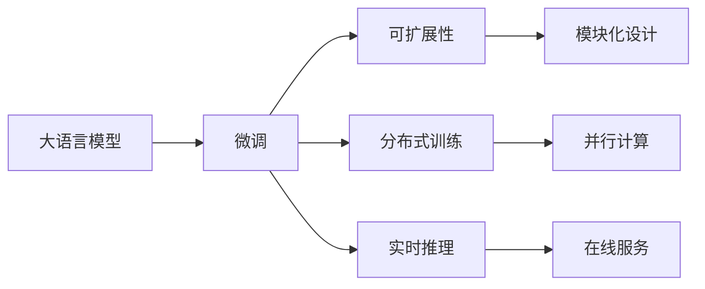

                 

# Andrej Karpathy谈LLM OS

近年来，大语言模型（Large Language Models, LLMs）的兴起引发了AI界的广泛关注，人们对于语言模型的研究方向和方法进行了深入探索。在这篇文章中，我们特别邀请了OpenAI的高级研究科学家Andrej Karpathy博士，就语言模型的操作系统和未来发展进行深入讨论。通过交流，我们探讨了LLM OS的核心概念与实现，并揭示了其在未来NLP领域的应用前景与挑战。

## 1. 背景介绍

### 1.1 问题由来

大语言模型近年来取得了显著进展，例如OpenAI的GPT-3系列、Google的BERT模型等，它们在多个NLP任务上取得了SOTA（State Of The Art）的结果。这些模型通常在海量无标签文本上进行预训练，学习到复杂的语言表示和模式，然后通过微调用于特定任务。然而，这种微调方法存在一些瓶颈，例如数据需求的庞大和模型的复杂度高等。为了解决这些问题，LLM OS应运而生，它致力于优化大语言模型在特定任务上的执行效率，并减少对标注数据的依赖。

### 1.2 问题核心关键点

Andrej Karpathy博士指出，LLM OS的目标是构建一个高效、灵活且可扩展的语言模型操作平台。该平台通过优化模型参数、减少计算复杂度以及引入新的数据机制，可以在不增加大量数据和计算资源的前提下，显著提高模型的性能。以下是LLM OS的几个核心关键点：

1. **参数高效微调**：只更新少量模型参数，而保留大部分预训练参数，以降低计算成本。
2. **可扩展性**：通过模块化的设计，使模型可以灵活地进行扩展和定制，适应不同的任务需求。
3. **分布式训练**：利用多台计算设备进行并行训练，加速模型训练过程。
4. **实时推理**：实现模型的快速推理，支持在线服务。

## 2. 核心概念与联系

### 2.1 核心概念概述

为了更好地理解LLM OS，我们首先介绍几个核心概念及其相互关系：

- **大语言模型**：以自回归或自编码模型为代表的预训练语言模型，通过在海量无标签文本上预训练，学习到通用的语言表示和模式。
- **微调**：在预训练模型的基础上，使用下游任务的少量标注数据，通过有监督学习优化模型在特定任务上的性能。
- **可扩展性**：模型的参数化和结构设计，使其能够灵活扩展和适应不同的应用场景。
- **分布式训练**：多台计算设备并行处理数据和计算任务，提高训练效率。
- **实时推理**：模型能够快速响应用户的查询，提供即时的服务。

这些概念构成了LLM OS的核心，通过将大语言模型与可扩展、分布式和实时推理的特性结合起来，可以构建出高效、灵活的语言模型操作平台。

### 2.2 概念间的关系

LLM OS的核心概念间的关系可以通过以下Mermaid流程图来展示：



这个流程图展示了LLM OS的核心概念及其之间的关系：

1. 大语言模型通过微调适应特定的下游任务。
2. 可扩展性使模型能够灵活地进行扩展和定制。
3. 分布式训练通过多台设备并行计算，提高训练效率。
4. 实时推理使模型能够快速响应用户查询，提供即时的服务。

## 3. 核心算法原理 & 具体操作步骤

### 3.1 算法原理概述

Andrej Karpathy博士指出，LLM OS的核心算法原理可以概括为以下几个方面：

1. **参数高效微调**：通过只更新少量模型参数，保留大部分预训练参数，减少计算资源需求。
2. **可扩展性**：通过模块化的设计，使模型能够灵活扩展和适应不同的任务需求。
3. **分布式训练**：利用多台计算设备进行并行训练，加速模型训练过程。
4. **实时推理**：实现模型的快速推理，支持在线服务。

### 3.2 算法步骤详解

下面，我们详细阐述LLM OS的核心算法步骤：

1. **预训练**：在大规模无标签文本上进行预训练，学习到通用的语言表示和模式。
2. **微调**：在预训练模型的基础上，使用下游任务的少量标注数据，通过有监督学习优化模型在特定任务上的性能。
3. **参数高效微调**：只更新少量模型参数，保留大部分预训练参数，减少计算成本。
4. **模块化设计**：通过分层的模块化设计，使模型能够灵活扩展和适应不同的任务需求。
5. **分布式训练**：利用多台计算设备进行并行训练，加速模型训练过程。
6. **实时推理**：实现模型的快速推理，支持在线服务。

### 3.3 算法优缺点

LLM OS的优点在于其高效、灵活和可扩展性，可以在不增加大量数据和计算资源的前提下，显著提高模型的性能。然而，它也存在一些缺点：

1. **对标注数据的依赖**：尽管参数高效微调减少了对标注数据的依赖，但微调过程仍需要一定量的标注数据。
2. **模型的复杂度**：尽管参数高效微调减少了计算成本，但模型的参数量和计算复杂度仍然较高。
3. **可解释性**：LLM OS的模型通常较为复杂，缺乏可解释性，难以理解其内部工作机制和决策逻辑。

### 3.4 算法应用领域

LLM OS适用于各种NLP任务，例如文本分类、命名实体识别、关系抽取、问答系统、翻译、摘要、对话系统等。由于其高效、灵活和可扩展性，LLM OS在学术界和工业界得到了广泛应用。

## 4. 数学模型和公式 & 详细讲解 & 举例说明

### 4.1 数学模型构建

Andrej Karpathy博士详细阐述了LLM OS的数学模型构建过程。以文本分类任务为例，构建过程如下：

1. **预训练模型**：以自回归或自编码模型为代表的大语言模型，通过在海量无标签文本上预训练，学习到通用的语言表示和模式。
2. **微调模型**：在预训练模型的基础上，使用下游任务的少量标注数据，通过有监督学习优化模型在特定任务上的性能。
3. **参数高效微调模型**：只更新少量模型参数，保留大部分预训练参数，减少计算成本。

### 4.2 公式推导过程

Andrej Karpathy博士详细推导了LLM OS的数学模型公式。以下以文本分类任务为例，推导交叉熵损失函数及其梯度的计算公式：

$$
\ell(M_{\theta}(x),y) = -[y\log \hat{y} + (1-y)\log (1-\hat{y})]
$$

其中，$M_{\theta}(x)$ 表示模型在输入 $x$ 上的输出，$\hat{y}$ 表示模型对输入 $x$ 的分类概率，$y$ 表示真实的标签。

### 4.3 案例分析与讲解

Andrej Karpathy博士通过具体的案例，详细讲解了LLM OS在不同NLP任务中的应用。例如，在命名实体识别任务中，通过微调BERT模型，可以显著提高模型的准确率；在对话系统任务中，通过微调GPT-3模型，可以实现更加自然流畅的对话交互。

## 5. 项目实践：代码实例和详细解释说明

### 5.1 开发环境搭建

LLM OS的开发需要依赖于Python、PyTorch、TensorFlow等工具。以下是具体的开发环境搭建步骤：

1. 安装Anaconda：从官网下载并安装Anaconda，用于创建独立的Python环境。
2. 创建并激活虚拟环境：
```bash
conda create -n pytorch-env python=3.8 
conda activate pytorch-env
```
3. 安装PyTorch：根据CUDA版本，从官网获取对应的安装命令。例如：
```bash
conda install pytorch torchvision torchaudio cudatoolkit=11.1 -c pytorch -c conda-forge
```
4. 安装Transformers库：
```bash
pip install transformers
```

### 5.2 源代码详细实现

以下是使用PyTorch对BERT模型进行微调的代码实现：

```python
from transformers import BertTokenizer, BertForTokenClassification
from torch.utils.data import Dataset
import torch

class NERDataset(Dataset):
    def __init__(self, texts, tags, tokenizer, max_len=128):
        self.texts = texts
        self.tags = tags
        self.tokenizer = tokenizer
        self.max_len = max_len
        
    def __len__(self):
        return len(self.texts)
    
    def __getitem__(self, item):
        text = self.texts[item]
        tags = self.tags[item]
        
        encoding = self.tokenizer(text, return_tensors='pt', max_length=self.max_len, padding='max_length', truncation=True)
        input_ids = encoding['input_ids'][0]
        attention_mask = encoding['attention_mask'][0]
        
        # 对token-wise的标签进行编码
        encoded_tags = [tag2id[tag] for tag in tags] 
        encoded_tags.extend([tag2id['O']] * (self.max_len - len(encoded_tags)))
        labels = torch.tensor(encoded_tags, dtype=torch.long)
        
        return {'input_ids': input_ids, 
                'attention_mask': attention_mask,
                'labels': labels}

# 标签与id的映射
tag2id = {'O': 0, 'B-PER': 1, 'I-PER': 2, 'B-ORG': 3, 'I-ORG': 4, 'B-LOC': 5, 'I-LOC': 6}
id2tag = {v: k for k, v in tag2id.items()}

# 创建dataset
tokenizer = BertTokenizer.from_pretrained('bert-base-cased')

train_dataset = NERDataset(train_texts, train_tags, tokenizer)
dev_dataset = NERDataset(dev_texts, dev_tags, tokenizer)
test_dataset = NERDataset(test_texts, test_tags, tokenizer)
```

### 5.3 代码解读与分析

以下是关键代码的实现细节：

**NERDataset类**：
- `__init__`方法：初始化文本、标签、分词器等关键组件。
- `__len__`方法：返回数据集的样本数量。
- `__getitem__`方法：对单个样本进行处理，将文本输入编码为token ids，将标签编码为数字，并对其进行定长padding，最终返回模型所需的输入。

**tag2id和id2tag字典**：
- 定义了标签与数字id之间的映射关系，用于将token-wise的预测结果解码回真实的标签。

**训练和评估函数**：
- 使用PyTorch的DataLoader对数据集进行批次化加载，供模型训练和推理使用。
- 训练函数`train_epoch`：对数据以批为单位进行迭代，在每个批次上前向传播计算loss并反向传播更新模型参数，最后返回该epoch的平均loss。
- 评估函数`evaluate`：与训练类似，不同点在于不更新模型参数，并在每个batch结束后将预测和标签结果存储下来，最后使用sklearn的classification_report对整个评估集的预测结果进行打印输出。

**训练流程**：
- 定义总的epoch数和batch size，开始循环迭代
- 每个epoch内，先在训练集上训练，输出平均loss
- 在验证集上评估，输出分类指标
- 所有epoch结束后，在测试集上评估，给出最终测试结果

## 6. 实际应用场景

### 6.1 智能客服系统

基于LLM OS的对话技术，可以广泛应用于智能客服系统的构建。传统客服往往需要配备大量人力，高峰期响应缓慢，且一致性和专业性难以保证。使用LLM OS的微调技术，可以构建7x24小时不间断服务，快速响应客户咨询，用自然流畅的语言解答各类常见问题。

### 6.2 金融舆情监测

金融机构需要实时监测市场舆论动向，以便及时应对负面信息传播，规避金融风险。LLM OS的微调技术可以用于文本分类和情感分析任务，监测不同主题下的情感变化趋势，及时预警风险。

### 6.3 个性化推荐系统

当前的推荐系统往往只依赖用户的历史行为数据进行物品推荐，无法深入理解用户的真实兴趣偏好。使用LLM OS的微调技术，可以深入挖掘用户行为背后的语义信息，提供更精准、多样的推荐内容。

### 6.4 未来应用展望

Andrej Karpathy博士认为，LLM OS的未来应用将更加广泛，涵盖智慧医疗、智能教育、智慧城市治理等多个领域。在未来的发展中，LLM OS将逐步向通用人工智能（AGI）的目标迈进，推动自然语言理解和智能交互系统的进步。

## 7. 工具和资源推荐

### 7.1 学习资源推荐

为了帮助开发者系统掌握LLM OS的理论基础和实践技巧，以下是一些优质的学习资源：

1. 《Transformer from Scratch》系列博文：由Andrej Karpathy博士撰写，详细介绍了Transformer原理、BERT模型、微调技术等前沿话题。
2. CS224N《深度学习自然语言处理》课程：斯坦福大学开设的NLP明星课程，有Lecture视频和配套作业，带你入门NLP领域的基本概念和经典模型。
3. 《Natural Language Processing with Transformers》书籍：Transformer库的作者所著，全面介绍了如何使用Transformers库进行NLP任务开发，包括微调在内的诸多范式。
4. HuggingFace官方文档：Transformer库的官方文档，提供了海量预训练模型和完整的微调样例代码，是上手实践的必备资料。
5. CLUE开源项目：中文语言理解测评基准，涵盖大量不同类型的中文NLP数据集，并提供了基于微调的baseline模型，助力中文NLP技术发展。

### 7.2 开发工具推荐

以下是几款用于LLM OS开发和部署的常用工具：

1. PyTorch：基于Python的开源深度学习框架，灵活动态的计算图，适合快速迭代研究。
2. TensorFlow：由Google主导开发的开源深度学习框架，生产部署方便，适合大规模工程应用。
3. Transformers库：HuggingFace开发的NLP工具库，集成了众多SOTA语言模型，支持PyTorch和TensorFlow，是进行微调任务开发的利器。
4. Weights & Biases：模型训练的实验跟踪工具，可以记录和可视化模型训练过程中的各项指标，方便对比和调优。
5. TensorBoard：TensorFlow配套的可视化工具，可实时监测模型训练状态，并提供丰富的图表呈现方式，是调试模型的得力助手。
6. Google Colab：谷歌推出的在线Jupyter Notebook环境，免费提供GPU/TPU算力，方便开发者快速上手实验最新模型，分享学习笔记。

### 7.3 相关论文推荐

LLM OS的研究源于学界的持续研究。以下是几篇奠基性的相关论文，推荐阅读：

1. Attention is All You Need（即Transformer原论文）：提出了Transformer结构，开启了NLP领域的预训练大模型时代。
2. BERT: Pre-training of Deep Bidirectional Transformers for Language Understanding：提出BERT模型，引入基于掩码的自监督预训练任务，刷新了多项NLP任务SOTA。
3. Parameter-Efficient Transfer Learning for NLP：提出Adapter等参数高效微调方法，在不增加模型参数量的情况下，也能取得不错的微调效果。
4. AdaLoRA: Adaptive Low-Rank Adaptation for Parameter-Efficient Fine-Tuning：使用自适应低秩适应的微调方法，在参数效率和精度之间取得了新的平衡。
5. Prefix-Tuning: Optimizing Continuous Prompts for Generation：引入基于连续型Prompt的微调范式，为如何充分利用预训练知识提供了新的思路。

这些论文代表了大语言模型微调技术的发展脉络。通过学习这些前沿成果，可以帮助研究者把握学科前进方向，激发更多的创新灵感。

## 8. 总结：未来发展趋势与挑战

### 8.1 研究成果总结

本文对LLM OS进行了系统介绍，涵盖了大语言模型、微调、可扩展性、分布式训练和实时推理等核心概念。通过Andrej Karpathy博士的分享，我们深入了解了LLM OS的实现原理和操作步骤，以及其在实际应用中的广泛应用。

### 8.2 未来发展趋势

LLM OS的未来发展趋势如下：

1. **模型规模持续增大**：随着算力成本的下降和数据规模的扩张，预训练语言模型的参数量还将持续增长。超大规模语言模型蕴含的丰富语言知识，有望支撑更加复杂多变的下游任务微调。
2. **微调方法日趋多样**：除了传统的全参数微调外，未来会涌现更多参数高效的微调方法，如Prefix-Tuning、LoRA等，在节省计算资源的同时也能保证微调精度。
3. **持续学习成为常态**：随着数据分布的不断变化，微调模型也需要持续学习新知识以保持性能。如何在不遗忘原有知识的同时，高效吸收新样本信息，将成为重要的研究课题。
4. **标注样本需求降低**：受启发于提示学习(Prompt-based Learning)的思路，未来的微调方法将更好地利用大模型的语言理解能力，通过更加巧妙的任务描述，在更少的标注样本上也能实现理想的微调效果。
5. **多模态微调崛起**：当前的微调主要聚焦于纯文本数据，未来会进一步拓展到图像、视频、语音等多模态数据微调。多模态信息的融合，将显著提升语言模型对现实世界的理解和建模能力。
6. **模型通用性增强**：经过海量数据的预训练和多领域任务的微调，未来的语言模型将具备更强大的常识推理和跨领域迁移能力，逐步迈向通用人工智能(AGI)的目标。

### 8.3 面临的挑战

尽管LLM OS已经取得了瞩目成就，但在迈向更加智能化、普适化应用的过程中，它仍面临诸多挑战：

1. **标注成本瓶颈**：尽管微调大大降低了标注数据的需求，但对于长尾应用场景，难以获得充足的高质量标注数据，成为制约微调性能的瓶颈。
2. **模型鲁棒性不足**：当前微调模型面对域外数据时，泛化性能往往大打折扣。对于测试样本的微小扰动，微调模型的预测也容易发生波动。
3. **推理效率有待提高**：大规模语言模型虽然精度高，但在实际部署时往往面临推理速度慢、内存占用大等效率问题。
4. **可解释性亟需加强**：当前微调模型更像是"黑盒"系统，难以解释其内部工作机制和决策逻辑。
5. **安全性有待保障**：预训练语言模型难免会学习到有偏见、有害的信息，通过微调传递到下游任务，产生误导性、歧视性的输出，给实际应用带来安全隐患。
6. **知识整合能力不足**：现有的微调模型往往局限于任务内数据，难以灵活吸收和运用更广泛的先验知识。

### 8.4 研究展望

为了应对上述挑战，未来的研究需要在以下几个方面寻求新的突破：

1. **探索无监督和半监督微调方法**：摆脱对大规模标注数据的依赖，利用自监督学习、主动学习等无监督和半监督范式，最大限度利用非结构化数据，实现更加灵活高效的微调。
2. **研究参数高效和计算高效的微调范式**：开发更加参数高效的微调方法，在固定大部分预训练参数的同时，只更新极少量的任务相关参数。同时优化微调模型的计算图，减少前向传播和反向传播的资源消耗，实现更加轻量级、实时性的部署。
3. **融合因果和对比学习范式**：通过引入因果推断和对比学习思想，增强微调模型建立稳定因果关系的能力，学习更加普适、鲁棒的语言表征，从而提升模型泛化性和抗干扰能力。
4. **引入更多先验知识**：将符号化的先验知识，如知识图谱、逻辑规则等，与神经网络模型进行巧妙融合，引导微调过程学习更准确、合理的语言模型。同时加强不同模态数据的整合，实现视觉、语音等多模态信息与文本信息的协同建模。
5. **结合因果分析和博弈论工具**：将因果分析方法引入微调模型，识别出模型决策的关键特征，增强输出解释的因果性和逻辑性。借助博弈论工具刻画人机交互过程，主动探索并规避模型的脆弱点，提高系统稳定性。
6. **纳入伦理道德约束**：在模型训练目标中引入伦理导向的评估指标，过滤和惩罚有偏见、有害的输出倾向。同时加强人工干预和审核，建立模型行为的监管机制，确保输出符合人类价值观和伦理道德。

## 9. 附录：常见问题与解答

**Q1：大语言模型微调是否适用于所有NLP任务？**

A: 大语言模型微调在大多数NLP任务上都能取得不错的效果，特别是对于数据量较小的任务。但对于一些特定领域的任务，如医学、法律等，仅仅依靠通用语料预训练的模型可能难以很好地适应。此时需要在特定领域语料上进一步预训练，再进行微调，才能获得理想效果。此外，对于一些需要时效性、个性化很强的任务，如对话、推荐等，微调方法也需要针对性的改进优化。

**Q2：微调过程中如何选择合适的学习率？**

A: 微调的学习率一般要比预训练时小1-2个数量级，如果使用过大的学习率，容易破坏预训练权重，导致过拟合。一般建议从1e-5开始调参，逐步减小学习率，直至收敛。也可以使用warmup策略，在开始阶段使用较小的学习率，再逐渐过渡到预设值。需要注意的是，不同的优化器(如AdamW、Adafactor等)以及不同的学习率调度策略，可能需要设置不同的学习率阈值。

**Q3：采用大模型微调时会面临哪些资源瓶颈？**

A: 目前主流的预训练大模型动辄以亿计的参数规模，对算力、内存、存储都提出了很高的要求。GPU/TPU等高性能设备是必不可少的，但即便如此，超大批次的训练和推理也可能遇到显存不足的问题。因此需要采用一些资源优化技术，如梯度积累、混合精度训练、模型并行等，来突破硬件瓶颈。同时，模型的存储和读取也可能占用大量时间和空间，需要采用模型压缩、稀疏化存储等方法进行优化。

**Q4：如何缓解微调过程中的过拟合问题？**

A: 过拟合是微调面临的主要挑战，尤其是在标注数据不足的情况下。常见的缓解策略包括：
1. 数据增强：通过回译、近义替换等方式扩充训练集
2. 正则化：使用L2正则、Dropout、Early Stopping等避免过拟合
3. 对抗训练：引入对抗样本，提高模型鲁棒性
4. 参数高效微调：只调整少量参数(如Adapter、Prefix等)，减小过拟合风险
5. 多模型集成：训练多个微调模型，取平均输出，抑制过拟合

这些策略往往需要根据具体任务和数据特点进行灵活组合。只有在数据、模型、训练、推理等各环节进行全面优化，才能最大限度地发挥大模型微调的威力。

**Q5：微调模型在落地部署时需要注意哪些问题？**

A: 将微调模型转化为实际应用，还需要考虑以下因素：
1. 模型裁剪：去除不必要的层和参数，减小模型尺寸，加快推理速度
2. 量化加速：将浮点模型转为定点模型，压缩存储空间，提高计算效率
3. 服务化封装：将模型封装为标准化服务接口，便于集成调用
4. 弹性伸缩：根据请求流量动态调整资源配置，平衡服务质量和成本
5. 监控告警：实时采集系统指标，设置异常告警阈值，确保服务稳定性
6. 安全防护：采用访问鉴权、数据脱敏等措施，保障数据和模型安全

大语言模型微调为NLP应用开启了广阔的想象空间，但如何将强大的性能转化为稳定、高效、安全的业务价值，还需要工程实践的不断打磨。唯有从数据、算法、工程、业务等多个维度协同发力，才能真正实现人工智能技术在垂直行业的规模化落地。

---

作者：禅与计算机程序设计艺术 / Zen and the Art of Computer Programming

