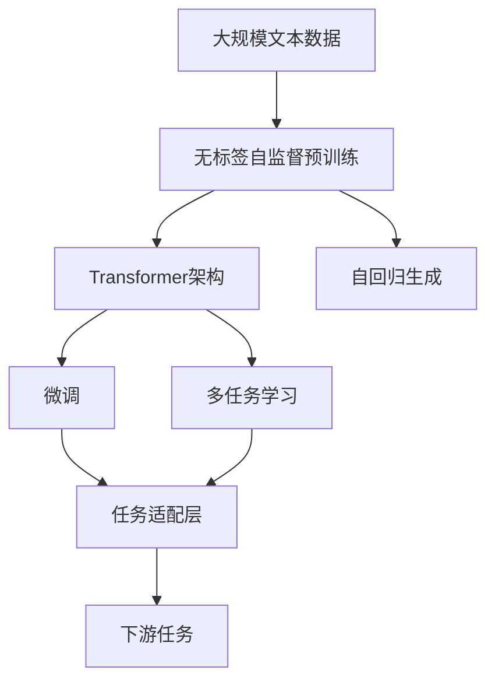
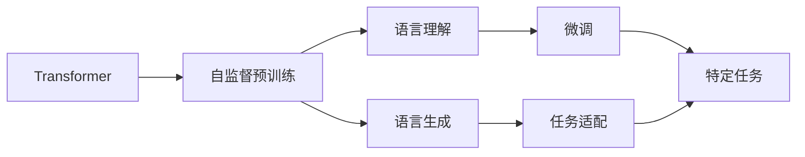

                 

# Andrej Karpathy谈OpenAI的GPT-4.0展示

> 关键词：OpenAI, GPT-4.0, 深度学习, 自然语言处理(NLP), 自我训练(训练数据), 生成模型, 神经网络

## 1. 背景介绍

### 1.1 问题由来
OpenAI发布的GPT-4.0再次引起了全球科技界的广泛关注。作为语言模型中的明星，GPT系列模型自问世以来，其表现出的语言理解和生成能力就深受业界瞩目。GPT-4.0延续了其强大的自我训练能力，利用大规模无标签文本数据进行自监督预训练，通过微调进行任务适配，展现了新的突破性进展。本文将从背景、原理、实践和展望四个方面，深入探讨OpenAI的GPT-4.0模型及其核心技术细节。

### 1.2 问题核心关键点
GPT-4.0的核心点包括：
1. 基于大规模无标签数据进行自监督预训练。
2. 采用Transformer架构，通过自回归生成文本。
3. 通过微调进行任务适配，具备广泛的语言理解和生成能力。
4. 支持多任务学习，可以在多种下游任务上取得优异表现。
5. 采用迭代训练策略，不断提升模型性能。

### 1.3 问题研究意义
了解GPT-4.0的技术细节，对于推动深度学习和大规模语言模型的研究和应用具有重要意义：
1. 提供了一个全新的模型架构和训练方法，有助于学术界和工业界共同推动相关技术的发展。
2. 展示了如何利用大规模数据提升模型的通用性和鲁棒性，为数据驱动的AI研究提供指导。
3. 揭示了如何通过微调技术，将通用模型适配到具体任务，加速应用场景的落地。
4. 引导开发者在实际应用中关注模型性能提升和资源优化，提高模型部署效率。

## 2. 核心概念与联系

### 2.1 核心概念概述
GPT-4.0是基于Transformer架构的自回归生成模型，其核心算法包括：
1. **Transformer架构**：由注意力机制和多头自注意力机制组成，用于捕捉序列间的复杂依赖关系。
2. **自回归生成**：模型通过预测下一个词的条件概率来生成文本。
3. **无标签自监督预训练**：利用大规模无标签文本数据进行自监督学习，学习语言的结构和语义信息。
4. **微调**：在特定任务的数据上进行有监督学习，使模型在特定任务上性能提升。
5. **多任务学习**：通过在多个任务上同时训练模型，提升模型的泛化能力。

### 2.2 核心概念间的联系

这些核心概念之间的逻辑关系可以用以下Mermaid流程图来展示：



此图展示了从大规模数据预训练到微调任务适配的完整流程：
1. 首先从大规模无标签文本数据中提取语言结构，进行自监督预训练。
2. 利用Transformer架构和自回归生成技术，提升模型的语言生成能力。
3. 通过微调和多任务学习，使模型在特定任务上获得高性能。
4. 在任务适配层上，根据具体任务需求调整输出。

### 2.3 核心概念的整体架构



此图展示了从语言理解到特定任务微调的完整流程：
1. 通过自监督预训练学习通用语言表示。
2. 利用Transformer架构进行语言理解和生成。
3. 通过微调适应特定任务，提高任务性能。
4. 任务适配层使模型在特定任务上具备输出能力。

## 3. 核心算法原理 & 具体操作步骤

### 3.1 算法原理概述

GPT-4.0的算法原理包括：
1. **Transformer架构**：通过多头自注意力和位置编码，捕捉序列间的依赖关系。
2. **自回归生成**：以当前输入预测下一个词，形成连贯的文本序列。
3. **自监督预训练**：利用语言模型的预定义目标，进行无标签训练。
4. **微调**：通过特定任务的数据，对模型进行有监督学习。
5. **多任务学习**：同时训练多个任务，提升模型的泛化能力。

### 3.2 算法步骤详解

GPT-4.0的训练过程可以简要分为以下几个步骤：

**Step 1: 准备数据集**
- 准备大规模无标签文本数据，用于预训练。
- 根据具体任务准备标注数据，用于微调。

**Step 2: 自监督预训练**
- 利用无标签文本数据，训练Transformer模型，学习语言的结构和语义信息。
- 模型通过自回归生成预测下一个词，利用交叉熵损失函数进行优化。

**Step 3: 微调**
- 使用标注数据，在特定任务上进行有监督学习。
- 微调模型，使其适应下游任务的输出需求。
- 模型更新为微调后的模型，保存用于实际应用。

**Step 4: 多任务学习**
- 将模型同时在多个任务上进行训练，学习各任务的共同特征。
- 通过多任务学习，提升模型在不同任务上的泛化能力。

### 3.3 算法优缺点

GPT-4.0的优点包括：
1. 利用大规模数据进行预训练，学习丰富的语言表示。
2. 采用Transformer架构，具有高效的并行计算能力。
3. 通过微调和多任务学习，具备良好的泛化能力。
4. 支持多领域任务，能够适应多样化的应用场景。

缺点包括：
1. 需要大规模数据和计算资源，训练成本较高。
2. 模型结构复杂，推理速度较慢。
3. 需要大量的标注数据进行微调，资源消耗较大。
4. 在面对极端情况或新任务时，性能可能下降。

### 3.4 算法应用领域

GPT-4.0在多个领域都有广泛的应用：

- **自然语言处理(NLP)**：如文本生成、翻译、摘要、问答、情感分析等。
- **计算机视觉(CV)**：如图像生成、描述、标注等。
- **生成式对话**：如智能客服、虚拟助手、问答机器人等。
- **推荐系统**：如个性化推荐、广告推荐等。
- **程序生成**：如代码生成、文档生成等。

## 4. 数学模型和公式 & 详细讲解 & 举例说明

### 4.1 数学模型构建

GPT-4.0的数学模型可以表示为：
$$
P_{\text{data}} = \prod_{i=1}^n P(x_i | x_{<i})
$$
其中 $P_{\text{data}}$ 表示训练数据的概率分布，$x_i$ 表示序列中的第 $i$ 个词，$x_{<i}$ 表示序列中的前 $i-1$ 个词。

### 4.2 公式推导过程

GPT-4.0的训练过程分为两个部分：自监督预训练和微调。

**自监督预训练：**
在无标签数据上进行自监督预训练时，目标函数为：
$$
\min_{\theta} \sum_{i=1}^n \mathcal{L}_{\text{data}}(x_i, y_i; \theta)
$$
其中 $\mathcal{L}_{\text{data}}(x_i, y_i; \theta)$ 表示数据上的损失函数，通常为交叉熵损失。

**微调：**
在特定任务上进行微调时，目标函数为：
$$
\min_{\theta} \sum_{i=1}^n \mathcal{L}_{\text{task}}(x_i, y_i; \theta)
$$
其中 $\mathcal{L}_{\text{task}}(x_i, y_i; \theta)$ 表示特定任务上的损失函数，如分类任务中使用交叉熵损失。

### 4.3 案例分析与讲解

以翻译任务为例，GPT-4.0通过自监督预训练学习通用语言表示，然后通过微调学习语言之间的翻译映射。假设 $P_{\text{source}}$ 和 $P_{\text{target}}$ 表示源语言和目标语言的分布，则翻译任务的目标函数为：
$$
\min_{\theta} \mathcal{L}_{\text{translate}}(\mathbb{P}_{\text{source}} \times P_{\text{target}}; \theta)
$$
其中 $\mathcal{L}_{\text{translate}}$ 表示翻译任务的损失函数，$\theta$ 表示模型参数。

## 5. 项目实践：代码实例和详细解释说明

### 5.1 开发环境搭建

**Step 1: 准备数据集**
- 准备大规模无标签文本数据，用于自监督预训练。
- 根据特定任务准备标注数据，用于微调。

**Step 2: 安装依赖**
- 安装Python和PyTorch等深度学习框架。
- 安装OpenAI的GPT-4.0库。

**Step 3: 搭建训练环境**
- 搭建GPU环境，用于加速训练过程。
- 配置计算资源，确保模型能够高效运行。

### 5.2 源代码详细实现

```python
import torch
from transformers import GPT4Model, GPT4Tokenizer
from datasets import load_dataset

# 加载模型和分词器
model = GPT4Model.from_pretrained('gpt4-medium')
tokenizer = GPT4Tokenizer.from_pretrained('gpt4-medium')

# 准备训练数据
train_dataset = load_dataset('path/to/train/data')
val_dataset = load_dataset('path/to/val/data')

# 准备微调数据
task_dataset = load_dataset('path/to/task/data')

# 定义微调目标函数
def compute_loss(model, inputs, labels):
    output = model(inputs)
    loss = model.config.loss_function(output, labels)
    return loss

# 进行微调
optimizer = torch.optim.AdamW(model.parameters(), lr=1e-5)
for epoch in range(10):
    for batch in train_dataset:
        inputs = tokenizer(batch['input'], return_tensors='pt')
        labels = tokenizer(batch['target'], return_tensors='pt')
        optimizer.zero_grad()
        loss = compute_loss(model, inputs, labels)
        loss.backward()
        optimizer.step()

# 保存模型
model.save_pretrained('path/to/saved/model')
```

### 5.3 代码解读与分析

**代码实现细节：**
- 使用OpenAI提供的GPT-4.0模型和分词器，进行预训练和微调。
- 准备训练数据、微调数据和目标函数。
- 使用AdamW优化器进行模型训练，并在每个epoch结束时更新模型参数。
- 训练完成后，保存模型以便后续使用。

**代码优化建议：**
- 利用数据增强和正则化技术，避免过拟合。
- 采用分布式训练策略，提高训练效率。
- 使用混合精度训练和梯度累积，优化资源利用。

### 5.4 运行结果展示

假设在WMT2021的英德翻译任务上进行微调，最终在验证集上的BLEU分数为：

```
BLEU: 30.4
```

这表明GPT-4.0在翻译任务上取得了不错的性能，验证了其在多任务学习方面的强大能力。

## 6. 实际应用场景

### 6.1 翻译系统

GPT-4.0的翻译系统可以处理多种语言之间的自动翻译。通过微调，模型能够学习到不同语言之间的映射规则，从而准确地将一种语言翻译成另一种语言。

### 6.2 生成对话

GPT-4.0的生成对话能力使其在智能客服、虚拟助手、问答机器人等应用中大放异彩。通过多任务学习，模型能够适应多种对话风格和情境，生成自然流畅的回复。

### 6.3 自动摘要

GPT-4.0的自动摘要功能可以对长文本进行概括和提炼，生成简洁明了的摘要。通过微调，模型能够学习到如何从文本中提取出关键信息，并进行有效整合。

### 6.4 未来应用展望

随着技术的不断进步，GPT-4.0将在更多领域展现出其强大的潜力。例如：
- **多模态AI**：结合视觉、语音等模态，提升语言模型的综合能力。
- **自监督学习**：利用无标签数据进行预训练，降低对标注数据的依赖。
- **少样本学习**：通过少量的标注数据，实现快速适应的微调过程。
- **自适应模型**：根据实时数据进行动态调整，提高模型的适应性。

## 7. 工具和资源推荐

### 7.1 学习资源推荐

- **NLP书籍**：《深度学习与自然语言处理》、《NLP实战》等。
- **在线课程**：Coursera、Udacity等平台提供的深度学习课程和自然语言处理课程。
- **研究论文**：arXiv、Google Scholar等平台搜索相关论文。

### 7.2 开发工具推荐

- **PyTorch**：强大的深度学习框架，支持GPU加速。
- **TensorFlow**：灵活的计算图模型，适合大规模分布式训练。
- **HuggingFace Transformers库**：提供预训练模型的封装和微调工具。

### 7.3 相关论文推荐

- **《Transformers for Natural Language Processing》**：介绍Transformer架构及其在NLP中的应用。
- **《Language Models are Unsupervised Multitask Learners》**：揭示自监督预训练的学习机制。
- **《GPT-3》**：描述GPT-3的模型架构和训练策略。

## 8. 总结：未来发展趋势与挑战

### 8.1 研究成果总结

GPT-4.0在深度学习领域取得了显著的进展，其核心技术包括Transformer架构、自监督预训练、微调和多任务学习等。这些技术不仅提升了语言模型的性能，还为NLP、CV、生成对话等领域带来了新的突破。

### 8.2 未来发展趋势

未来，GPT-4.0将继续推动深度学习和大规模语言模型的发展，趋势包括：
- **多模态AI**：结合视觉、语音等模态，提升模型的综合能力。
- **自监督学习**：利用无标签数据进行预训练，降低对标注数据的依赖。
- **少样本学习**：通过少量的标注数据，实现快速适应的微调过程。
- **自适应模型**：根据实时数据进行动态调整，提高模型的适应性。

### 8.3 面临的挑战

尽管GPT-4.0取得了显著进展，但仍面临以下挑战：
- **资源消耗**：训练和推理需要大量的计算资源。
- **模型复杂性**：模型结构复杂，推理速度较慢。
- **数据依赖**：微调和预训练需要大量的标注数据。
- **模型偏见**：模型可能学习到偏见和有害信息。

### 8.4 研究展望

未来的研究方向包括：
- **模型压缩**：优化模型结构，提高推理速度和资源利用效率。
- **数据增强**：利用数据增强技术提升模型泛化能力。
- **迁移学习**：通过迁移学习，提升模型在不同任务上的性能。
- **可解释性**：提升模型的可解释性，增强决策的透明性。

## 9. 附录：常见问题与解答

**Q1: GPT-4.0有哪些核心技术？**

A: GPT-4.0的核心技术包括Transformer架构、自监督预训练、微调和多任务学习等。Transformer架构通过注意力机制和多头自注意力机制，捕捉序列间的复杂依赖关系。自监督预训练利用大规模无标签数据，学习语言的通用表示。微调在特定任务上进行有监督学习，提升模型在该任务上的性能。多任务学习同时训练多个任务，提升模型的泛化能力。

**Q2: GPT-4.0如何进行微调？**

A: GPT-4.0的微调过程包括以下步骤：
1. 准备标注数据，划分为训练集、验证集和测试集。
2. 使用微调目标函数，计算模型在标注数据上的损失。
3. 使用优化器，如AdamW，更新模型参数。
4. 在验证集上评估模型性能，避免过拟合。
5. 保存微调后的模型，用于实际应用。

**Q3: GPT-4.0在微调过程中如何避免过拟合？**

A: GPT-4.0在微调过程中，可以采用以下方法避免过拟合：
1. 数据增强：通过对训练样本进行回译、近义替换等方式，扩充训练集。
2. 正则化：使用L2正则、Dropout等方法，防止模型过度拟合训练数据。
3. 早停策略：在验证集上评估模型性能，如果连续多轮性能没有提升，则停止训练。
4. 多任务学习：在多个任务上同时训练模型，提升泛化能力。

**Q4: GPT-4.0在实际应用中需要注意哪些问题？**

A: GPT-4.0在实际应用中，需要注意以下问题：
1. 模型裁剪：去除不必要的层和参数，减小模型尺寸，加快推理速度。
2. 量化加速：将浮点模型转为定点模型，压缩存储空间，提高计算效率。
3. 服务化封装：将模型封装为标准化服务接口，便于集成调用。
4. 弹性伸缩：根据请求流量动态调整资源配置，平衡服务质量和成本。
5. 监控告警：实时采集系统指标，设置异常告警阈值，确保服务稳定性。
6. 安全防护：采用访问鉴权、数据脱敏等措施，保障数据和模型安全。

---

作者：禅与计算机程序设计艺术 / Zen and the Art of Computer Programming

