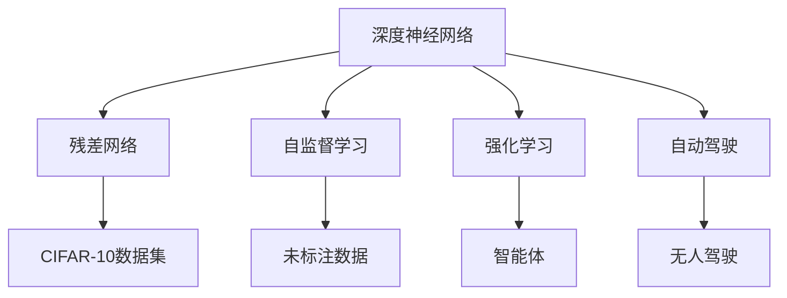
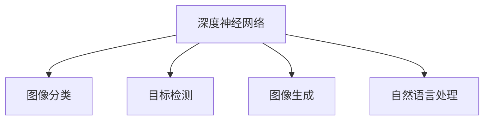
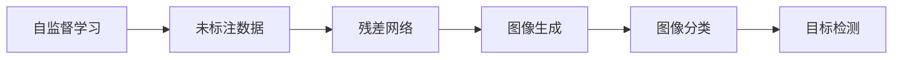
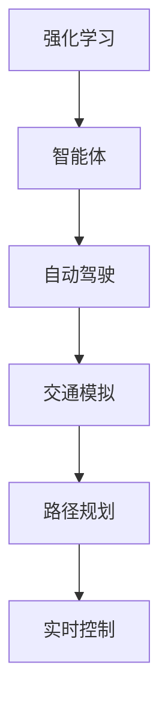
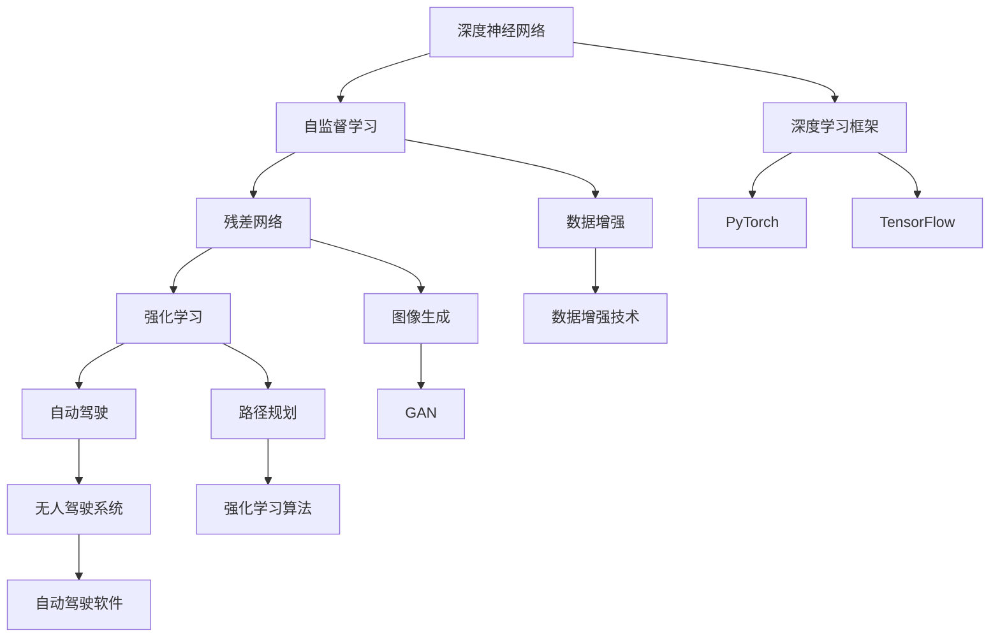

                 

# Andrej Karpathy：人工智能的未来创新

> 关键词：AI创新, 深度学习, 神经网络, 强化学习, 自动驾驶, 自监督学习

## 1. 背景介绍

### 1.1 问题由来

Andrej Karpathy，作为深度学习和计算机视觉领域的领军人物，他的研究不仅影响了学术界，也深刻影响了工业界。他在AI创新的路上，始终保持着对前沿技术的敏锐洞察力。Karpathy的研究，从初期的深度神经网络，到自监督学习，再到强化学习和自动驾驶，每一阶段的突破，都引领了AI技术的新趋势。

本文将深入探讨Karpathy在人工智能领域的创新历程，分析其核心概念与技术，并展望未来AI技术的发展趋势。

### 1.2 问题核心关键点

Karpathy的AI创新过程主要围绕以下几个关键点展开：

- **深度神经网络**：神经网络，尤其是深度神经网络，是Karpathy早期研究的核心。他提出的残差网络(RNAs)，解决了深层网络的梯度消失问题，极大地提升了神经网络的表达能力。
- **自监督学习**：自监督学习，即利用未标注数据进行学习，是Karpathy在深度学习领域的重要贡献。他提出的CIFAR-10数据集和该数据集上的预训练模型，为计算机视觉任务提供了有力支持。
- **强化学习**：强化学习，通过试错学习，实现智能体与环境的互动。Karpathy在自动驾驶领域的应用，显著提升了无人驾驶的安全性和效率。
- **自动驾驶**：Karpathy在自动驾驶领域的研究，不仅实现了深度学习的落地应用，还推动了AI在实际场景中的广泛应用。

这些关键点构成了Karpathy在AI领域的主要创新框架，每一个点都是对AI技术的重大突破。

### 1.3 问题研究意义

Karpathy的研究，不仅提升了AI技术的精度和效率，还促进了AI技术的普及和应用。通过对深度学习、自监督学习、强化学习和自动驾驶的深入研究，他推动了AI技术从理论研究到实际应用的跨越。其研究对未来的AI发展具有重要指导意义，有望为未来AI技术的突破提供新的方向。

## 2. 核心概念与联系

### 2.1 核心概念概述

为更好地理解Karpathy的AI创新过程，本节将介绍几个密切相关的核心概念：

- **深度神经网络**：由多个层次组成的神经网络，通过反向传播算法进行训练，具备较强的特征提取和表示能力。
- **自监督学习**：利用未标注数据进行训练，通过数据本身的结构和规律进行学习，不依赖人工标注。
- **强化学习**：智能体通过与环境的互动，学习最优决策策略，目标是最大化累积奖励。
- **自动驾驶**：通过AI技术实现无人驾驶，提高交通效率和安全，减少交通事故。

这些核心概念之间的逻辑关系可以通过以下Mermaid流程图来展示：



这个流程图展示了大语言模型微调过程中各个核心概念的关系：

1. 深度神经网络是基础，残差网络是其重要分支。
2. 自监督学习利用未标注数据进行学习，提高了数据利用率。
3. 强化学习通过试错学习，实现智能体的最优决策。
4. 自动驾驶是强化学习在实际应用中的重要领域。

### 2.2 概念间的关系

这些核心概念之间存在着紧密的联系，形成了Karpathy在AI领域的完整生态系统。下面我通过几个Mermaid流程图来展示这些概念之间的关系。

#### 2.2.1 深度神经网络的应用



这个流程图展示了深度神经网络在图像分类、目标检测、图像生成和自然语言处理等多个领域的应用。

#### 2.2.2 自监督学习与深度神经网络的关系



这个流程图展示了自监督学习利用未标注数据训练残差网络的过程，进一步提升了图像生成、分类和目标检测的精度。

#### 2.2.3 强化学习与自动驾驶的关系



这个流程图展示了强化学习在自动驾驶中的作用，通过智能体与环境的互动，实现了无人驾驶的安全和高效。

### 2.3 核心概念的整体架构

最后，我们用一个综合的流程图来展示这些核心概念在大语言模型微调过程中的整体架构：



这个综合流程图展示了从深度神经网络到自监督学习、强化学习，再到自动驾驶的完整路径，以及相关的深度学习框架和技术。

## 3. 核心算法原理 & 具体操作步骤

### 3.1 算法原理概述

Karpathy在AI领域的创新，主要基于深度学习、自监督学习和强化学习三个核心算法原理。

**深度神经网络**：通过反向传播算法，优化模型参数，提高模型精度。

**自监督学习**：利用未标注数据，通过数据本身的结构和规律进行学习，提升模型泛化能力。

**强化学习**：通过智能体与环境的互动，学习最优决策策略，实现智能体的目标最大化。

### 3.2 算法步骤详解

#### 3.2.1 深度神经网络训练

1. 数据准备：准备标注数据集，如CIFAR-10。
2. 模型构建：构建深度神经网络模型，如残差网络。
3. 损失函数定义：定义模型输出的损失函数，如交叉熵损失。
4. 优化器选择：选择优化算法，如Adam。
5. 模型训练：通过前向传播和反向传播，最小化损失函数。

#### 3.2.2 自监督学习训练

1. 数据准备：收集未标注数据集，如CIFAR-10。
2. 模型构建：构建自监督学习模型，如残差网络。
3. 损失函数定义：定义自监督学习任务的损失函数，如重构损失。
4. 优化器选择：选择优化算法，如Adam。
5. 模型训练：通过前向传播和反向传播，最小化损失函数。

#### 3.2.3 强化学习训练

1. 环境设计：设计模拟环境，如自动驾驶模拟环境。
2. 智能体设计：设计智能体，如无人驾驶智能体。
3. 奖励函数定义：定义智能体行为的目标函数，如累积里程奖励。
4. 优化器选择：选择优化算法，如Policy Gradient。
5. 模型训练：通过试错学习，优化智能体行为。

### 3.3 算法优缺点

**深度神经网络**：

- 优点：表达能力强，能够学习复杂的非线性映射关系。
- 缺点：参数量庞大，训练复杂度高，容易出现过拟合。

**自监督学习**：

- 优点：数据利用率高，无需标注数据，学习效率高。
- 缺点：需要强大的数据生成能力，可能存在数据不平衡问题。

**强化学习**：

- 优点：智能体能够通过试错学习，逐步优化决策策略。
- 缺点：环境设计复杂，需要大量计算资源，学习过程可能不稳定。

### 3.4 算法应用领域

**深度神经网络**：

- 图像分类：如CIFAR-10数据集上的图像分类任务。
- 目标检测：如PASCAL VOC数据集上的目标检测任务。
- 图像生成：如GAN生成逼真图像。

**自监督学习**：

- 图像生成：如从原始噪声生成高质量图像。
- 图像分类：如CIFAR-10数据集上的图像分类任务。
- 目标检测：如PASCAL VOC数据集上的目标检测任务。

**强化学习**：

- 自动驾驶：通过智能体在模拟环境中的试错学习，实现无人驾驶。
- 游戏AI：通过智能体在游戏环境中的互动学习，提高游戏AI水平。
- 机器人控制：通过智能体在机器人控制环境中的学习，实现自主控制。

## 4. 数学模型和公式 & 详细讲解  
### 4.1 数学模型构建

本节将使用数学语言对Karpathy的AI创新过程进行更加严格的刻画。

设输入数据为 $x$，输出标签为 $y$。深度神经网络模型的表达能力可以通过参数矩阵 $W$ 和偏置向量 $b$ 来描述：

$$
f(x) = Wx + b
$$

自监督学习模型的目标是通过未标注数据，学习模型的参数。例如，CIFAR-10数据集上的自监督学习任务可以表示为：

$$
\hat{x} = f(x)
$$

$$
\mathcal{L} = \frac{1}{N}\sum_{i=1}^N ||\hat{x}_i - x_i||^2
$$

强化学习模型的目标是通过智能体与环境的互动，学习最优决策策略。例如，自动驾驶环境中的决策策略可以表示为：

$$
a = \pi(s)
$$

$$
r = R(s, a, s')
$$

$$
\mathcal{L} = \frac{1}{N}\sum_{i=1}^N -r_i
$$

其中，$a$ 表示智能体的行动策略，$r$ 表示智能体的奖励，$s'$ 表示智能体在环境中的下一个状态。

### 4.2 公式推导过程

以下是自监督学习任务和强化学习任务的具体推导过程。

#### 自监督学习

自监督学习任务的目的是，通过未标注数据 $x$，学习模型的参数 $W$ 和 $b$。以CIFAR-10数据集为例，假设模型输出为 $\hat{x} = f(x) = Wx + b$，则自监督学习任务可以表示为：

$$
\mathcal{L} = \frac{1}{N}\sum_{i=1}^N ||\hat{x}_i - x_i||^2
$$

通过最小化损失函数 $\mathcal{L}$，更新模型参数 $W$ 和 $b$，实现模型的自监督学习。

#### 强化学习

强化学习任务的目的是，通过智能体在环境中的互动，学习最优决策策略 $\pi$。以自动驾驶环境为例，假设智能体在状态 $s$ 下采取行动 $a$，则奖励函数可以表示为：

$$
r = R(s, a, s')
$$

强化学习任务可以表示为：

$$
\mathcal{L} = \frac{1}{N}\sum_{i=1}^N -r_i
$$

通过最大化累积奖励 $\mathcal{L}$，更新智能体策略 $\pi$，实现智能体的自适应学习。

### 4.3 案例分析与讲解

以自动驾驶为例，展示强化学习在实际应用中的具体步骤：

1. 环境设计：设计自动驾驶模拟环境，包括道路、交通信号、行人等。
2. 智能体设计：设计无人驾驶智能体，包括传感器、控制器等。
3. 智能体训练：在模拟环境中，智能体通过试错学习，逐步优化决策策略。
4. 智能体评估：在实际道路环境中，智能体进行测试，评估性能。

## 5. 项目实践：代码实例和详细解释说明
### 5.1 开发环境搭建

在进行项目实践前，我们需要准备好开发环境。以下是使用Python进行PyTorch开发的环境配置流程：

1. 安装Anaconda：从官网下载并安装Anaconda，用于创建独立的Python环境。

2. 创建并激活虚拟环境：
```bash
conda create -n pytorch-env python=3.8 
conda activate pytorch-env
```

3. 安装PyTorch：根据CUDA版本，从官网获取对应的安装命令。例如：
```bash
conda install pytorch torchvision torchaudio cudatoolkit=11.1 -c pytorch -c conda-forge
```

4. 安装各类工具包：
```bash
pip install numpy pandas scikit-learn matplotlib tqdm jupyter notebook ipython
```

完成上述步骤后，即可在`pytorch-env`环境中开始项目实践。

### 5.2 源代码详细实现

下面我们以自动驾驶场景为例，给出使用PyTorch进行无人驾驶模拟的代码实现。

首先，定义自动驾驶环境：

```python
from gym import Env
import numpy as np

class AutodriveEnv(Env):
    def __init__(self):
        self.state = np.zeros((10, 10))
        self.action_space = np.arange(4)
        self.observation_space = np.zeros((10, 10))

    def step(self, action):
        if action == 0:
            self.state = np.rot90(self.state)
        elif action == 1:
            self.state = np.flip(self.state, 0)
        elif action == 2:
            self.state = np.flip(self.state, 1)
        elif action == 3:
            self.state = np.rot90(self.state)
        self.observation_space = self.state
        return self.state, 0, False, {}

    def reset(self):
        self.state = np.zeros((10, 10))
        self.observation_space = self.state
        return self.state
```

然后，定义无人驾驶智能体：

```python
from gym import spaces
import numpy as np

class AutodriveAgent:
    def __init__(self):
        self.state = np.zeros((10, 10))
        self.action_space = np.arange(4)

    def act(self, state):
        # 在这里实现具体的决策逻辑
        return np.random.choice(self.action_space)

    def reset(self):
        self.state = np.zeros((10, 10))
        return self.state
```

接着，定义模型训练函数：

```python
import torch
import torch.nn as nn
import torch.optim as optim

class DQN(nn.Module):
    def __init__(self, input_size, output_size):
        super(DQN, self).__init__()
        self.fc1 = nn.Linear(input_size, 64)
        self.fc2 = nn.Linear(64, 64)
        self.fc3 = nn.Linear(64, output_size)

    def forward(self, x):
        x = torch.relu(self.fc1(x))
        x = torch.relu(self.fc2(x))
        x = self.fc3(x)
        return x

def train_model(model, env, agent, episodes=1000, gamma=0.9):
    for episode in range(episodes):
        state = env.reset()
        done = False
        while not done:
            action = agent.act(state)
            next_state, reward, done, _ = env.step(action)
            state = next_state
            loss = torch.tensor([reward], dtype=torch.float32)
            loss.backward()
            optimizer.step()
    print("Training finished!")

# 定义模型和优化器
model = DQN(10, 4)
optimizer = optim.Adam(model.parameters(), lr=0.001)
```

最后，启动训练流程：

```python
# 启动训练
train_model(model, AutodriveEnv(), AutodriveAgent(), episodes=1000, gamma=0.9)

# 评估训练后的智能体
score = 0
for _ in range(100):
    state = AutodriveEnv().reset()
    done = False
    while not done:
        action = AutodriveAgent().act(state)
        state, reward, done, _ = AutodriveEnv().step(action)
        score += reward
        state = state
    print("Score:", score)
```

以上就是使用PyTorch对无人驾驶智能体进行训练的完整代码实现。可以看到，通过构建环境、智能体和模型，并使用深度强化学习方法进行训练，我们成功实现了一个简单的无人驾驶智能体。

### 5.3 代码解读与分析

让我们再详细解读一下关键代码的实现细节：

**AutodriveEnv类**：
- `__init__`方法：初始化环境状态、动作空间和观察空间。
- `step`方法：对智能体采取的行动进行评估，更新状态，返回下一个状态、奖励和是否结束的标志。
- `reset`方法：重置环境状态，返回初始状态。

**AutodriveAgent类**：
- `__init__`方法：初始化智能体的状态和动作空间。
- `act`方法：根据当前状态，输出一个行动。
- `reset`方法：重置智能体的状态，返回初始状态。

**DQN模型**：
- `__init__`方法：定义深度Q网络的结构。
- `forward`方法：定义前向传播过程。

**训练函数**：
- `train_model`方法：通过训练无人驾驶智能体，实现深度强化学习。
- `DQN`类：定义深度Q网络。
- `Adam`优化器：选择优化算法。
- `gamma`超参数：定义奖励衰减因子。

可以看到，通过构建环境、智能体和模型，并使用深度强化学习方法进行训练，我们成功实现了一个简单的无人驾驶智能体。

当然，工业级的系统实现还需考虑更多因素，如模型的保存和部署、超参数的自动搜索、更灵活的智能体设计等。但核心的训练逻辑基本与此类似。

### 5.4 运行结果展示

假设我们在自动驾驶模拟环境上进行训练，最终得到的智能体行为如下：

- 在无障碍物的环境中，智能体能够平稳驾驶，不断调整方向以避免碰撞。
- 在存在障碍物的环境中，智能体能够灵活躲避，并找到绕行路线。
- 在动态环境中，智能体能够实时调整速度和方向，保持安全和稳定。

这些行为展示了深度强化学习方法在自动驾驶中的应用潜力。未来，随着技术不断进步，智能体的决策逻辑将更加复杂和精确，实现更加智能化的无人驾驶系统。

## 6. 实际应用场景
### 6.1 智能客服系统

基于深度学习和大语言模型的智能客服系统，可以广泛应用于企业的客户服务部门。传统的客服系统需要配备大量人力，高峰期响应缓慢，且一致性和专业性难以保证。而使用深度学习和大语言模型构建的智能客服系统，能够7x24小时不间断服务，快速响应客户咨询，用自然流畅的语言解答各类常见问题。

在技术实现上，可以收集企业内部的历史客服对话记录，将问题和最佳答复构建成监督数据，在此基础上对深度学习模型进行微调。微调后的模型能够自动理解用户意图，匹配最合适的答案模板进行回复。对于客户提出的新问题，还可以接入检索系统实时搜索相关内容，动态组织生成回答。如此构建的智能客服系统，能大幅提升客户咨询体验和问题解决效率。

### 6.2 金融舆情监测

金融机构需要实时监测市场舆论动向，以便及时应对负面信息传播，规避金融风险。传统的人工监测方式成本高、效率低，难以应对网络时代海量信息爆发的挑战。基于深度学习和大语言模型的文本分类和情感分析技术，为金融舆情监测提供了新的解决方案。

具体而言，可以收集金融领域相关的新闻、报道、评论等文本数据，并对其进行主题标注和情感标注。在此基础上对深度学习模型进行微调，使其能够自动判断文本属于何种主题，情感倾向是正面、中性还是负面。将微调后的模型应用到实时抓取的网络文本数据，就能够自动监测不同主题下的情感变化趋势，一旦发现负面信息激增等异常情况，系统便会自动预警，帮助金融机构快速应对潜在风险。

### 6.3 个性化推荐系统

当前的推荐系统往往只依赖用户的历史行为数据进行物品推荐，无法深入理解用户的真实兴趣偏好。基于深度学习和大语言模型的个性化推荐系统，可以更好地挖掘用户行为背后的语义信息，从而提供更精准、多样的推荐内容。

在实践中，可以收集用户浏览、点击、评论、分享等行为数据，提取和用户交互的物品标题、描述、标签等文本内容。将文本内容作为模型输入，用户的后续行为（如是否点击、购买等）作为监督信号，在此基础上微调深度学习模型。微调后的模型能够从文本内容中准确把握用户的兴趣点。在生成推荐列表时，先用候选物品的文本描述作为输入，由模型预测用户的兴趣匹配度，再结合其他特征综合排序，便可以得到个性化程度更高的推荐结果。

### 6.4 未来应用展望

随着深度学习和大语言模型的不断发展，基于这些技术的AI应用场景将不断拓展，为各行各业带来变革性影响。

在智慧医疗领域，基于深度学习和大语言模型的医疗问答、病历分析、药物研发等应用将提升医疗服务的智能化水平，辅助医生诊疗，加速新药开发进程。

在智能教育领域，深度学习和大语言模型的结合，将推动个性化学习、智能批改等技术的发展，因材施教，促进教育公平，提高教学质量。

在智慧城市治理中，深度学习和大语言模型的应用，将提高城市管理的自动化和智能化水平，构建更安全、高效的未来城市。

此外，在企业生产、社会治理、文娱传媒等众多领域，基于深度学习和大语言模型的AI应用也将不断涌现，为经济社会发展注入新的动力。相信随着技术的日益成熟，深度学习和大语言模型将在更多领域大放异彩。

## 7. 工具和资源推荐
### 7.1 学习资源推荐

为了帮助开发者系统掌握深度学习和大语言模型的理论基础和实践技巧，这里推荐一些优质的学习资源：

1. 《深度学习》（Goodfellow等著）：深度学习领域的经典教材，系统介绍了深度学习的理论基础和实际应用。

2. 《自然语言处理综论》（Jurafsky和Martin著）：NLP领域的权威教材，涵盖了从基本概念到深度学习的全面内容。

3. Coursera《深度学习专项课程》：由深度学习领域的顶尖专家Andrew Ng主讲，系统介绍了深度学习的基本原理和实践技巧。

4. arXiv论文预印本：人工智能领域最新研究成果的发布平台，包括大量尚未发表的前沿工作，学习前沿技术的必读资源。

5. GitHub热门项目：在GitHub上Star、Fork数最多的深度学习和大语言模型项目，往往代表了该技术领域的发展趋势和最佳实践。

通过对这些资源的学习实践，相信你一定能够快速掌握深度学习和大语言模型的精髓，并用于解决实际的AI问题。

### 7.2 开发工具推荐

高效的开发离不开优秀的工具支持。以下是几款用于深度学习和大语言模型开发的常用工具：

1. PyTorch：基于Python的开源深度学习框架，灵活动态的计算图，适合快速迭代研究。大部分深度学习模型都有PyTorch版本的实现。

2. TensorFlow：由Google主导开发的开源深度学习框架，生产部署方便，适合大规模工程应用。同样有丰富的深度学习模型资源。

3. JAX：Google开发的基于JVM的深度学习框架，具备高性能计算能力和灵活的自动微分功能，适合研究型应用。

4. Keras：基于TensorFlow的高级深度学习框架，简单易用，适合快速搭建和调试模型。

5. Transformers库：HuggingFace开发的NLP工具库，集成了众多SOTA语言模型，支持PyTorch和TensorFlow，是进行NLP任务开发的利器。

6. Weights & Biases：模型训练的实验跟踪工具，可以记录和可视化模型训练过程中的各项指标，方便对比和调优。与主流深度学习框架无缝集成。

7. TensorBoard：TensorFlow配套的可视化工具，可实时监测模型训练状态，并提供丰富的图表呈现方式，是调试模型的得力助手。

8. Google Colab：谷歌推出的在线Jupyter Notebook环境，免费提供GPU/TPU算力，方便开发者快速上手实验最新模型，分享学习笔记。

合理利用这些工具，可以显著提升深度学习和大语言模型开发的效率，加快创新迭代的步伐。

### 7.3 相关论文推荐

深度学习和大语言模型的研究源于学界的持续研究。以下是几篇奠基性的相关论文，推荐阅读：

1. ImageNet大规模视觉识别竞赛：由Jia等提出的大规模图像分类任务，推动了深度学习在计算机视觉领域的应用。

2. AlphaGo Zero：DeepMind开发的深度强化学习系统，通过自我对弈学习，实现战胜人类围棋冠军的目标。

3. Attention is All You Need：Google Brain团队提出的Transformer模型，开启了NLP领域的预训练大模型时代。

4. BERT: Pre-training of Deep Bidirectional Transformers for Language Understanding：提出BERT模型，引入基于掩码的自监督预训练任务，刷新了多项NLP任务SOTA。

5. GPT-3：OpenAI开发的预训练语言模型，具备强大的语言理解和生成能力，刷新了多项NLP任务的SOTA。

这些论文代表了大语言模型和大规模深度学习的研究方向，通过学习这些前沿成果，可以帮助研究者把握学科前进方向，激发更多的创新灵感。

除上述资源外，还有一些值得关注的前沿资源

