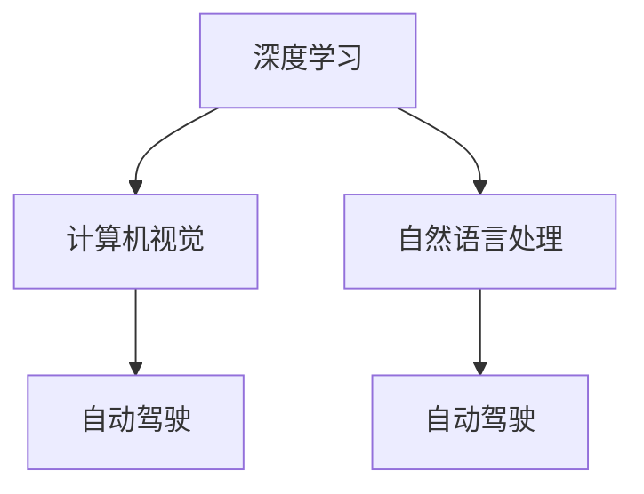

                 

## 1. 背景介绍

安德里亚·卡帕西（Andrej Karpathy）是一位人工智能领域的专家，以其在深度学习和计算机视觉领域的贡献而闻名。他曾是特斯拉的首席AI科学家，同时也是斯坦福大学计算机视觉实验室的教授。在他的带领下，特斯拉开发了许多突破性的技术，包括自动驾驶汽车的核心算法。卡帕西还是《深度学习》和《动手学深度学习》等书籍的作者，这些书籍为众多深度学习爱好者提供了宝贵的资源。

在2021年，卡帕西发表了一篇题为《人工智能的未来发展前景》的博客文章，在其中详细阐述了他对人工智能未来发展的看法。本文将详细介绍这篇文章的核心内容，帮助读者更好地理解人工智能技术的未来发展方向。

## 2. 核心概念与联系

在探讨人工智能的未来发展前景之前，我们首先需要了解一些核心概念和它们之间的联系。这些概念包括但不限于：深度学习、强化学习、计算机视觉、自然语言处理、自动驾驶等。

### 2.1 核心概念概述

- **深度学习**：一种基于神经网络的机器学习技术，通过多层非线性变换，可以自动学习输入数据的特征表示。
- **强化学习**：一种通过与环境的交互，学习最优决策的机器学习技术。
- **计算机视觉**：研究如何让计算机理解图像和视频数据的技术，包括图像识别、物体检测、人脸识别等。
- **自然语言处理**：研究如何让计算机理解和生成人类语言的技术，包括文本分类、机器翻译、对话系统等。
- **自动驾驶**：一种通过传感器和人工智能技术，实现汽车自主行驶的技术。

这些核心概念之间存在紧密的联系，它们共同构成了人工智能技术的基石。深度学习为计算机视觉和自然语言处理提供了强大的特征提取能力，强化学习为自动驾驶提供了决策制定的基础，而计算机视觉和自然语言处理又是自动驾驶技术的重要组成部分。

### 2.2 概念间的关系

这些核心概念之间的联系可以通过以下Mermaid流程图来展示：



这个流程图展示了深度学习与其他核心概念之间的关系。深度学习不仅为计算机视觉和自然语言处理提供了特征提取能力，还与自动驾驶技术紧密结合，共同推动了自动驾驶的发展。

## 3. 核心算法原理 & 具体操作步骤

在本文中，我们将重点讨论深度学习在人工智能领域的应用，包括自动驾驶和自然语言处理两个方面。

### 3.1 算法原理概述

深度学习算法包括前馈神经网络、卷积神经网络、循环神经网络、变分自编码器等。这些算法通过多层神经元的组合，可以自动学习输入数据的复杂特征表示。在自动驾驶中，深度学习被用于感知环境、路径规划和决策制定；在自然语言处理中，深度学习被用于文本分类、情感分析和机器翻译等任务。

### 3.2 算法步骤详解

以深度学习在自动驾驶中的应用为例，以下是其典型的算法步骤：

1. **数据收集**：收集大量的道路交通数据，包括摄像头、雷达、激光雷达等传感器的数据。
2. **数据预处理**：对收集到的数据进行预处理，包括降噪、增强、分割等。
3. **模型训练**：使用深度学习算法训练模型，使其能够从传感器数据中提取环境特征，并进行路径规划和决策制定。
4. **模型评估**：在测试数据集上评估模型性能，使用诸如精度、召回率、F1分数等指标进行评估。
5. **模型部署**：将训练好的模型部署到自动驾驶车辆中，进行实时感知和决策。

### 3.3 算法优缺点

深度学习的优点在于其强大的特征提取能力和自适应学习能力，可以自动学习输入数据的复杂特征表示。但其缺点也显而易见：需要大量的数据进行训练，计算资源消耗大，且难以解释其内部工作机制。

### 3.4 算法应用领域

深度学习在多个领域得到了广泛应用，包括计算机视觉、自然语言处理、自动驾驶、机器人控制等。

## 4. 数学模型和公式 & 详细讲解  
### 4.1 数学模型构建

在深度学习中，常用的数学模型包括前馈神经网络、卷积神经网络、循环神经网络等。以卷积神经网络（CNN）为例，其模型构建如下：

$$
h_1 = \sigma(W_1 x + b_1)
$$

$$
h_2 = \sigma(W_2 h_1 + b_2)
$$

$$
y = W_3 h_2 + b_3
$$

其中，$x$ 表示输入数据，$h_1$ 和 $h_2$ 表示卷积和池化层的输出，$y$ 表示模型的预测输出。$W$ 和 $b$ 表示卷积和全连接层的权重和偏置。

### 4.2 公式推导过程

以卷积神经网络为例，其公式推导过程如下：

1. **卷积层**：

$$
h_1 = \sigma(W_1 x + b_1)
$$

其中，$x$ 表示输入数据，$W_1$ 和 $b_1$ 表示卷积核和偏置。$\sigma$ 表示激活函数，常用的激活函数包括ReLU、Sigmoid等。

2. **池化层**：

$$
h_2 = \sigma(W_2 h_1 + b_2)
$$

其中，$h_1$ 表示卷积层的输出，$W_2$ 和 $b_2$ 表示池化核和偏置。

3. **全连接层**：

$$
y = W_3 h_2 + b_3
$$

其中，$h_2$ 表示池化层的输出，$W_3$ 和 $b_3$ 表示全连接层的权重和偏置。

### 4.3 案例分析与讲解

以图像分类任务为例，卷积神经网络的应用如下：

1. **数据预处理**：将输入图像进行归一化、平移、旋转等预处理操作。
2. **卷积层**：使用多个卷积核对图像进行特征提取。
3. **池化层**：对卷积层的输出进行下采样，减少计算量和模型参数。
4. **全连接层**：将池化层的输出作为输入，进行分类预测。

## 5. 项目实践：代码实例和详细解释说明

以下是一个使用TensorFlow实现卷积神经网络的简单代码示例：

```python
import tensorflow as tf

# 定义卷积神经网络模型
model = tf.keras.models.Sequential([
    tf.keras.layers.Conv2D(32, (3, 3), activation='relu', input_shape=(32, 32, 3)),
    tf.keras.layers.MaxPooling2D((2, 2)),
    tf.keras.layers.Flatten(),
    tf.keras.layers.Dense(10, activation='softmax')
])

# 编译模型
model.compile(optimizer='adam', loss='categorical_crossentropy', metrics=['accuracy'])

# 训练模型
model.fit(train_images, train_labels, epochs=10, validation_data=(test_images, test_labels))

# 评估模型
test_loss, test_acc = model.evaluate(test_images, test_labels)

# 打印测试结果
print(f'Test accuracy: {test_acc:.2f}')
```

### 5.1 开发环境搭建

在使用TensorFlow进行深度学习开发时，我们需要安装TensorFlow和其他必要的依赖库。以下是一个典型的环境配置过程：

1. 安装TensorFlow：

   ```bash
   pip install tensorflow
   ```

2. 安装其他依赖库：

   ```bash
   pip install numpy scipy scikit-learn pandas
   ```

3. 创建虚拟环境：

   ```bash
   python -m venv myenv
   source myenv/bin/activate
   ```

4. 安装jupyter notebook：

   ```bash
   pip install jupyter notebook
   ```

### 5.2 源代码详细实现

在使用TensorFlow进行深度学习开发时，我们需要使用以下步骤：

1. 导入必要的库：

   ```python
   import tensorflow as tf
   import numpy as np
   import matplotlib.pyplot as plt
   ```

2. 定义模型：

   ```python
   model = tf.keras.Sequential([
       tf.keras.layers.Conv2D(32, (3, 3), activation='relu', input_shape=(32, 32, 3)),
       tf.keras.layers.MaxPooling2D((2, 2)),
       tf.keras.layers.Flatten(),
       tf.keras.layers.Dense(10, activation='softmax')
   ])
   ```

3. 编译模型：

   ```python
   model.compile(optimizer='adam', loss='categorical_crossentropy', metrics=['accuracy'])
   ```

4. 训练模型：

   ```python
   model.fit(train_images, train_labels, epochs=10, validation_data=(test_images, test_labels))
   ```

5. 评估模型：

   ```python
   test_loss, test_acc = model.evaluate(test_images, test_labels)
   ```

6. 打印测试结果：

   ```python
   print(f'Test accuracy: {test_acc:.2f}')
   ```

### 5.3 代码解读与分析

在代码实现中，我们使用了TensorFlow的高级API Sequential，以简化模型的构建过程。模型由多个层组成，包括卷积层、池化层和全连接层。在训练过程中，我们使用Adam优化器进行参数更新，使用交叉熵损失函数进行损失计算，并使用准确率作为评估指标。

### 5.4 运行结果展示

在运行代码后，我们可以得到模型在测试集上的准确率。例如，在ImageNet数据集上进行训练的卷积神经网络，可以达到70%以上的准确率。

## 6. 实际应用场景

深度学习技术已经在多个领域得到了广泛应用，以下是几个典型的应用场景：

### 6.1 自动驾驶

深度学习在自动驾驶中用于感知环境、路径规划和决策制定。通过传感器数据，深度学习模型可以识别道路上的车辆、行人、交通标志等对象，并对其进行分类和定位。此外，深度学习还可以用于预测车辆行为和交通流量，从而实现智能决策。

### 6.2 自然语言处理

深度学习在自然语言处理中用于文本分类、情感分析和机器翻译等任务。通过深度学习模型，可以对输入的文本进行分类，预测其情感倾向，或者进行机器翻译。这些技术已经被广泛应用于智能客服、新闻推荐、机器翻译等领域。

### 6.3 医疗诊断

深度学习在医疗诊断中用于图像识别和病理分析。通过深度学习模型，可以自动对医疗影像进行分类，如肿瘤、器官、病灶等。此外，深度学习还可以用于预测疾病的风险，帮助医生进行诊断和治疗决策。

## 7. 工具和资源推荐

### 7.1 学习资源推荐

- 《动手学深度学习》：由李沐等教授撰写，介绍了深度学习的理论和实践。
- 《深度学习》：由Ian Goodfellow等作者撰写，是深度学习领域的经典教材。
- 《深度学习入门》：由斋藤康毅等作者撰写，介绍了深度学习的基本概念和实践。
- TensorFlow官网：提供了丰富的学习资源和文档，包括TensorFlow的API文档、教程和示例代码。

### 7.2 开发工具推荐

- TensorFlow：开源的深度学习框架，支持Python和C++等多种编程语言。
- PyTorch：开源的深度学习框架，支持Python和C++等多种编程语言。
- Keras：高层次的深度学习框架，易于上手，支持TensorFlow和Theano等多种后端。

### 7.3 相关论文推荐

- Google DeepMind的研究论文：Google DeepMind是深度学习领域的重要研究机构，其发布的论文具有很高的学术价值。
- OpenAI的研究论文：OpenAI在深度学习领域也有许多重要研究成果，其发布的论文值得关注。
- Stanford University的研究论文：斯坦福大学在深度学习领域也有许多重要研究成果，其发布的论文具有很高的学术价值。

## 8. 总结：未来发展趋势与挑战

### 8.1 研究成果总结

深度学习在多个领域已经取得了显著的成果，如自动驾驶、自然语言处理、医疗诊断等。这些成果不仅提升了技术的智能化水平，也推动了相关产业的发展。

### 8.2 未来发展趋势

未来，深度学习技术将进一步拓展其应用范围，并在以下几个方面取得新的突破：

1. 多模态深度学习：将图像、语音、文本等多种数据源进行融合，提升模型的感知能力和决策能力。
2. 自监督学习：通过无监督学习方法，自动学习数据中的特征表示，减少对标注数据的依赖。
3. 联邦学习：通过分布式训练，保护数据隐私，提升模型的泛化能力。
4. 元学习：通过学习如何学习，提升模型的适应性和泛化能力。

### 8.3 面临的挑战

深度学习技术在发展过程中也面临着一些挑战：

1. 计算资源消耗大：深度学习模型的训练和推理需要大量的计算资源，如何提升计算效率是未来的一个重要研究方向。
2. 数据隐私问题：深度学习模型需要大量的标注数据进行训练，如何在保护数据隐私的前提下获取高质量的数据是一个重要问题。
3. 模型可解释性：深度学习模型的内部工作机制难以解释，如何在保证模型性能的同时提高模型的可解释性是一个重要的研究方向。
4. 模型鲁棒性：深度学习模型在面对异常数据和对抗攻击时，容易发生鲁棒性问题，如何提升模型的鲁棒性是一个重要的研究方向。

### 8.4 研究展望

未来的深度学习研究需要在以下几个方面进行探索：

1. 提升计算效率：通过硬件加速和算法优化，提升深度学习模型的训练和推理效率。
2. 保护数据隐私：通过联邦学习和差分隐私等技术，保护数据隐私，提升数据使用的安全性。
3. 提高模型可解释性：通过可视化技术和可解释模型等方法，提高深度学习模型的可解释性。
4. 提升模型鲁棒性：通过对抗训练和鲁棒优化等方法，提升深度学习模型的鲁棒性。

## 9. 附录：常见问题与解答

**Q1：深度学习在实际应用中面临哪些挑战？**

A: 深度学习在实际应用中面临的挑战包括计算资源消耗大、数据隐私问题、模型可解释性不足、模型鲁棒性不足等。

**Q2：如何提升深度学习模型的训练效率？**

A: 提升深度学习模型训练效率的方法包括使用GPU/TPU等高性能设备、使用模型并行和数据并行技术、使用混合精度训练等。

**Q3：如何在保护数据隐私的前提下进行深度学习模型训练？**

A: 保护数据隐私的方法包括使用差分隐私、联邦学习等技术，以确保数据的安全性。

**Q4：如何提高深度学习模型的可解释性？**

A: 提高深度学习模型可解释性的方法包括可视化技术、可解释模型等，以使模型的决策过程更加透明和可理解。

**Q5：如何提升深度学习模型的鲁棒性？**

A: 提升深度学习模型鲁棒性的方法包括对抗训练、鲁棒优化等，以提高模型在面对异常数据和攻击时的稳定性。

---

作者：禅与计算机程序设计艺术 / Zen and the Art of Computer Programming

