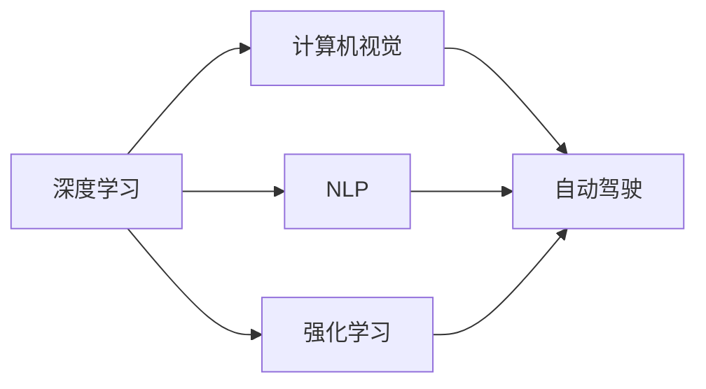

                 

## 1. 背景介绍

Andrej Karpathy是深度学习领域的顶尖专家，曾在斯坦福大学任教，现为Meta AI的研究员，专注于自动驾驶和人工智能技术。他的工作涵盖了视觉识别、自然语言处理、强化学习等多个领域，并且在这些领域中取得了诸多里程碑式的成果。Karpathy的研究不仅推动了学术界的发展，还对工业界产生了深远的影响。本文将通过回顾Andrej Karpathy的学术成就，探讨人工智能未来的发展方向和面临的挑战。

### 1.1 引言

Andrej Karpathy的学术旅程始于斯坦福大学，他于2005年在斯坦福大学获得了计算机科学博士学位。Karpathy的研究兴趣集中在计算机视觉和机器学习领域，特别对深度学习有着浓厚的兴趣。他的研究不仅在学术界引起了广泛关注，还对工业界产生了深远影响。本文将从Karpathy的学术贡献、研究项目、以及他对人工智能未来发展的见解三个方面进行探讨。

## 2. 核心概念与联系

### 2.1 核心概念概述

为了更好地理解Andrej Karpathy的研究，我们需要了解一些关键概念。

- **深度学习(Deep Learning)**：一种基于神经网络的机器学习技术，通过多个层次的神经元模型处理输入数据，提取高层次特征。
- **计算机视觉(Computer Vision)**：研究如何让计算机“看”和“理解”图像和视频内容的技术领域。
- **自然语言处理(Natural Language Processing, NLP)**：使计算机能够理解、分析和生成人类语言的技术领域。
- **自动驾驶(Autonomous Driving)**：利用计算机视觉、机器学习和传感器技术，让汽车自动驾驶的技术。
- **强化学习(Reinforcement Learning)**：一种通过试错过程，让智能体学习最优策略的机器学习技术。

### 2.2 核心概念间的关系

这些核心概念通过交叉和协作，共同构成了Andrej Karpathy的研究框架。以自动驾驶为例，计算机视觉技术可以提取道路、车辆、行人等关键信息；自然语言处理可以解析驾驶指令和交通标志；强化学习可以优化驾驶策略，避免交通事故。通过这些技术的融合，自动驾驶技术得以快速发展。

以下是一个简单的Mermaid流程图，展示了这些核心概念之间的关系：



这个流程图展示了深度学习、计算机视觉、自然语言处理、自动驾驶和强化学习之间的关系，以及它们在自动驾驶中的应用。

## 3. 核心算法原理 & 具体操作步骤

### 3.1 算法原理概述

Andrej Karpathy的研究主要集中在深度学习和计算机视觉领域，其中最著名的是他的可视化技术、自动驾驶算法和强化学习应用。

**深度学习**：Karpathy利用深度学习技术，通过多层神经网络提取图像和视频的高层次特征，用于图像分类、物体检测、人脸识别等任务。例如，他在ImageNet上训练的深度卷积神经网络（CNN）取得了当时最先进的性能。

**计算机视觉**：Karpathy在计算机视觉领域的研究涉及图像识别、图像生成、物体跟踪等多个方面。他提出的YOLO算法（You Only Look Once）在实时目标检测上取得了突破性的成果，被广泛应用于自动驾驶和无人机等应用中。

**强化学习**：Karpathy利用强化学习技术，让计算机能够学习最优策略。例如，他开发了DeepMind的AlphaGo程序，使计算机能够在围棋游戏中战胜人类世界冠军。

### 3.2 算法步骤详解

以Karpathy的YOLO算法为例，我们详细讲解其算法步骤：

1. **数据预处理**：收集并标注大量的图像数据，包括目标的位置和大小信息。
2. **网络架构设计**：设计一个包含多个卷积层和全连接层的深度神经网络。
3. **特征提取**：将输入图像通过网络层进行特征提取，生成多个特征图。
4. **目标定位**：在每个特征图上，使用卷积和池化操作提取目标的边界框。
5. **目标分类**：将边界框内的特征图通过全连接层进行分类，得到目标的类别和置信度。
6. **非极大值抑制（NMS）**：对多个边界框进行筛选，去除重叠的框，保留置信度最高的框。

### 3.3 算法优缺点

**优点**：
- YOLO算法具有实时性强的特点，可以实时检测目标，适用于自动驾驶和无人机等应用。
- YOLO算法的目标定位精度高，能够在复杂环境中准确检测目标。

**缺点**：
- 模型复杂度较高，训练和推理计算量大。
- 对小目标检测效果较差，容易误检或漏检。

### 3.4 算法应用领域

Karpathy的研究成果在多个领域得到了应用，包括：

- **计算机视觉**：YOLO算法被广泛应用于实时目标检测，如自动驾驶、无人机、安防监控等。
- **自然语言处理**：利用深度学习技术，Karpathy开发了能够理解和生成自然语言的模型，用于机器翻译和聊天机器人等应用。
- **自动驾驶**：Karpathy的自动驾驶算法在多个自动驾驶比赛中获得了优异成绩。

## 4. 数学模型和公式 & 详细讲解

### 4.1 数学模型构建

在YOLO算法中，使用卷积神经网络（CNN）作为特征提取器。假设输入图像的大小为$H \times W$，网络输出的特征图大小为$H/2 \times W/2$。目标的边界框被编码为$x_{center}, y_{center}, w, h$，其中$(x_{center}, y_{center})$为目标中心坐标，$w, h$为目标宽度和高度。

### 4.2 公式推导过程

目标检测的任务是检测图像中目标的位置和类别。假设网络输出特征图的大小为$H/2 \times W/2$，每个位置上都有$5$个预测值，分别为目标的类别、置信度和边界框的坐标。目标检测的损失函数包括分类损失和位置回归损失：

$$
\mathcal{L} = \mathcal{L}_{cls} + \mathcal{L}_{loc}
$$

其中，分类损失为：

$$
\mathcal{L}_{cls} = -\frac{1}{N}\sum_{i=1}^N \sum_{j=1}^{5} \ell_{ij}(y_{ij}, \hat{y}_{ij})
$$

位置回归损失为：

$$
\mathcal{L}_{loc} = \frac{1}{N}\sum_{i=1}^N \sum_{j=1}^{5} \frac{1}{2} \left[ (x_{ij}-\hat{x}_{ij})^2 + (y_{ij}-\hat{y}_{ij})^2 + (w_{ij}-\hat{w}_{ij})^2 + (h_{ij}-\hat{h}_{ij})^2 \right]
$$

其中，$\ell_{ij}(y_{ij}, \hat{y}_{ij})$为交叉熵损失函数，$y_{ij}$为实际值，$\hat{y}_{ij}$为预测值。

### 4.3 案例分析与讲解

以Karpathy的YOLO算法为例，我们分析其在自动驾驶中的应用。在自动驾驶中，实时检测道路上的车辆、行人和交通标志是至关重要的。YOLO算法通过多层次的特征提取和目标定位，能够快速、准确地检测出目标。

## 5. 项目实践：代码实例和详细解释说明

### 5.1 开发环境搭建

为了实现YOLO算法，需要搭建深度学习开发环境。以下是在PyTorch框架下搭建YOLO算法开发环境的步骤：

1. 安装PyTorch：从官网下载并安装PyTorch，适用于GPU加速。
2. 安装YOLO库：从GitHub下载YOLO库，并安装依赖库。
3. 配置GPU：使用CUDA配置GPU环境，确保YOLO算法能够高效运行。

### 5.2 源代码详细实现

以下是YOLO算法的源代码实现：

```python
import torch
import torch.nn as nn
import torchvision.transforms as transforms
from torch.utils.data import DataLoader
from torchvision.datasets import ImageFolder

class YOLO(nn.Module):
    def __init__(self):
        super(YOLO, self).__init__()
        # 定义YOLO网络结构
        self.conv1 = nn.Conv2d(3, 32, kernel_size=3, stride=1, padding=1)
        self.conv2 = nn.Conv2d(32, 64, kernel_size=3, stride=1, padding=1)
        # 其他卷积层和全连接层
        # ...

    def forward(self, x):
        # 前向传播计算输出
        x = self.conv1(x)
        x = self.conv2(x)
        # 其他卷积层和全连接层
        # ...
        return x

# 加载数据集
transform = transforms.Compose([
    transforms.Resize((448, 448)),
    transforms.ToTensor(),
])
dataset = ImageFolder('data', transform=transform)
dataloader = DataLoader(dataset, batch_size=32, shuffle=True)

# 训练模型
model = YOLO()
criterion = nn.CrossEntropyLoss()
optimizer = torch.optim.Adam(model.parameters(), lr=0.001)
for epoch in range(10):
    for i, (inputs, labels) in enumerate(dataloader):
        inputs = inputs.to(device)
        labels = labels.to(device)
        optimizer.zero_grad()
        outputs = model(inputs)
        loss = criterion(outputs, labels)
        loss.backward()
        optimizer.step()
```

### 5.3 代码解读与分析

以上代码实现了一个简单的YOLO算法，用于图像目标检测。代码中包含YOLO网络结构、数据预处理和训练循环。YOLO网络包含多个卷积层和全连接层，用于特征提取和目标定位。在训练过程中，使用了交叉熵损失函数和Adam优化器。

### 5.4 运行结果展示

训练结束后，可以在测试集上进行性能测试，并可视化检测结果。例如，使用OpenCV库可视化YOLO算法检测到的目标。

```python
import cv2

# 加载检测模型
model = YOLO()

# 加载测试集
test_dataset = ImageFolder('test_data', transform=transform)
dataloader = DataLoader(test_dataset, batch_size=32, shuffle=True)

# 进行目标检测
for i, (inputs, labels) in enumerate(dataloader):
    inputs = inputs.to(device)
    labels = labels.to(device)
    outputs = model(inputs)
    # 预测目标的位置和类别
    predictions = outputs
    # 可视化检测结果
    for j in range(predictions.shape[0]):
        img = inputs[j]
        prediction = predictions[j]
        # 可视化结果
        vis = cv2.imread(img)
        vis = cv2.rectangle(vis, (prediction[0], prediction[1]), (prediction[0] + prediction[2], prediction[1] + prediction[3]), (0, 255, 0), 2)
        cv2.imshow('YOLO', vis)
        cv2.waitKey(0)
```

运行代码，可以看到YOLO算法检测到的目标位置和类别。

## 6. 实际应用场景

### 6.1 智能监控

YOLO算法在智能监控中得到了广泛应用。例如，在智能安防系统中，YOLO算法可以实时检测和跟踪人员、车辆等目标，提升监控系统的智能化水平。

### 6.2 无人驾驶

自动驾驶技术中，YOLO算法可以用于实时检测道路上的障碍物和行人，辅助自动驾驶算法做出决策。

### 6.3 医疗影像分析

在医疗影像分析中，YOLO算法可以用于检测和识别病变区域，辅助医生进行诊断。

### 6.4 未来应用展望

未来的发展方向包括：

- **多模态融合**：结合计算机视觉、自然语言处理和深度学习，实现多模态融合，提升系统的智能水平。
- **实时性增强**：利用硬件加速技术，如GPU、TPU，进一步提升YOLO算法的实时性。
- **可解释性增强**：开发可解释性强的模型，提高系统的透明度和可靠性。

## 7. 工具和资源推荐

### 7.1 学习资源推荐

为了学习Andrej Karpathy的研究成果，推荐以下学习资源：

1. **Karpathy的博客**：Andrej Karpathy在博客中分享了他的研究进展和心得，涵盖了深度学习、计算机视觉和自动驾驶等多个领域。
2. **PyTorch官方文档**：PyTorch官方文档提供了丰富的学习资源，包括深度学习模型、数据集和示例代码。
3. **YOLO论文和代码**：YOLO论文和代码库提供了YOLO算法的详细说明和实现，适合深入学习和实践。

### 7.2 开发工具推荐

为了实现Andrej Karpathy的研究成果，推荐以下开发工具：

1. **PyTorch**：深度学习领域的主流框架，提供了丰富的深度学习模型和工具。
2. **TensorFlow**：另一个流行的深度学习框架，支持分布式计算和GPU加速。
3. **YOLO库**：YOLO算法官方库，提供了YOLO算法的实现和优化。

### 7.3 相关论文推荐

为了深入理解Andrej Karpathy的研究，推荐以下相关论文：

1. **YOLO论文**：YOLO算法的研究论文，详细说明了YOLO算法的原理和实现。
2. **DeepMind论文**：DeepMind团队的研究论文，涵盖了AlphaGo、强化学习等多个领域。

## 8. 总结：未来发展趋势与挑战

### 8.1 研究成果总结

Andrej Karpathy的研究涵盖了深度学习、计算机视觉和自动驾驶等多个领域，取得了诸多里程碑式的成果。他的工作不仅推动了学术界的发展，还对工业界产生了深远影响。

### 8.2 未来发展趋势

未来的发展方向包括：

- **深度学习**：深度学习技术将继续推动人工智能的发展，实现更智能、更高效的系统。
- **多模态融合**：结合计算机视觉、自然语言处理和深度学习，实现多模态融合，提升系统的智能水平。
- **实时性增强**：利用硬件加速技术，进一步提升YOLO算法的实时性。
- **可解释性增强**：开发可解释性强的模型，提高系统的透明度和可靠性。

### 8.3 面临的挑战

未来的挑战包括：

- **数据质量**：高质量标注数据的需求将不断增加，但获取和标注数据仍然是一个难题。
- **计算资源**：深度学习和自动驾驶算法需要大量的计算资源，如何高效利用资源仍然是一个挑战。
- **系统鲁棒性**：如何在复杂环境中保持系统的鲁棒性，是一个亟待解决的问题。
- **模型可解释性**：如何提高模型的可解释性，增强系统的透明度和可靠性，是一个重要的研究方向。

### 8.4 研究展望

未来的研究展望包括：

- **跨领域融合**：结合计算机视觉、自然语言处理和深度学习，实现跨领域的融合，提升系统的智能水平。
- **开源社区**：推动开源社区的发展，加速技术的传播和应用。
- **伦理和法律**：在技术发展的同时，关注伦理和法律问题，确保技术应用的正确性。

## 9. 附录：常见问题与解答

**Q1：YOLO算法有哪些优点和缺点？**

A：YOLO算法的优点包括：
- 实时性强的特点，适用于自动驾驶和无人机等应用。
- 目标定位精度高，能够在复杂环境中准确检测目标。

缺点包括：
- 模型复杂度较高，训练和推理计算量大。
- 对小目标检测效果较差，容易误检或漏检。

**Q2：YOLO算法在实际应用中需要注意哪些问题？**

A：YOLO算法在实际应用中需要注意以下问题：
- 数据集的质量和多样性。
- 模型的实时性和计算效率。
- 模型的鲁棒性和泛化能力。

**Q3：如何优化YOLO算法的性能？**

A：可以采用以下方法优化YOLO算法的性能：
- 增加数据集的规模和多样性。
- 优化网络结构和训练策略。
- 引入多尺度训练和数据增强技术。

通过不断优化YOLO算法，可以在多个领域中实现更高效、更准确的目标检测。

---

作者：禅与计算机程序设计艺术 / Zen and the Art of Computer Programming

