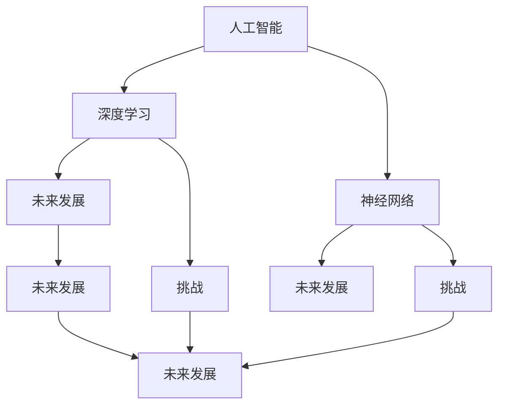
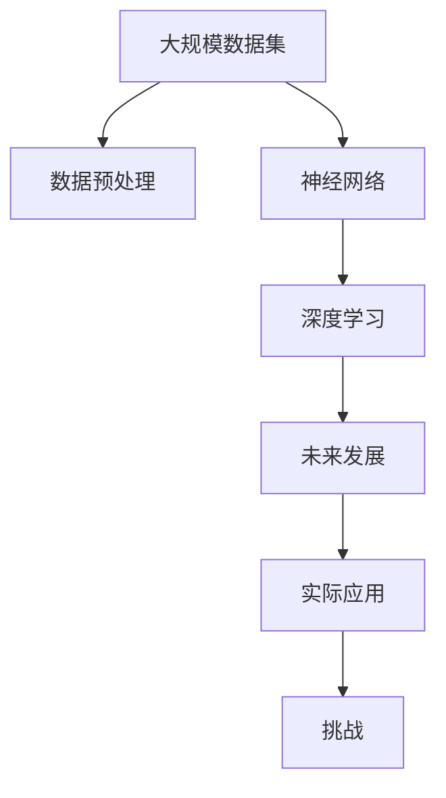

                 

# Andrej Karpathy：人工智能的未来发展挑战

> 关键词：人工智能,深度学习,神经网络,未来发展,挑战

## 1. 背景介绍

### 1.1 问题由来
随着人工智能技术的快速发展，深度学习、神经网络等前沿技术的应用场景不断拓展，推动了各行各业向智能化转型。然而，这些技术的广泛应用也带来了诸多挑战和风险，亟需业界专家进行深入探讨和应对。Andrej Karpathy博士是斯坦福大学计算机科学系教授，深度学习专家，曾获得Google 2016年度计算机科学家奖，并作为首席架构师参与Tesla自动驾驶系统开发。在本文中，他将对人工智能的未来发展挑战进行深入剖析，为相关领域的研究者和从业者提供有益的洞察。

### 1.2 问题核心关键点
Andrej Karpathy博士将围绕以下几个核心问题进行讨论：
- 人工智能技术的现状与发展趋势
- 深度学习和神经网络面临的主要挑战
- 未来的研究方向与潜在风险
- 如何构建更加安全、可靠、可解释的人工智能系统

这些讨论将涵盖从技术基础到实际应用的全方位内容，为读者提供全方位的视角和思考。

### 1.3 问题研究意义
人工智能技术的发展对社会的各个方面都产生了深远影响。通过深入探讨其未来发展挑战，不仅有助于我们更好地理解当前技术的应用局限和潜在风险，还能为未来的人工智能研究和应用提供指导，避免重蹈覆辙。Andrej Karpathy博士的专业视角将帮助我们更好地把握人工智能技术的发展脉络，为应对未来的挑战做好准备。

## 2. 核心概念与联系

### 2.1 核心概念概述

在深入讨论人工智能的未来发展挑战前，我们首先需要理解几个核心概念：

- **人工智能(Artificial Intelligence, AI)**：使计算机系统能够执行人类智能任务的技术。
- **深度学习(Deep Learning, DL)**：一种模拟人脑处理信息方式的机器学习技术，主要通过多层神经网络实现。
- **神经网络(Neural Network, NN)**：模拟人类神经系统结构和功能的计算模型。
- **未来发展**：人工智能技术的持续演进和应用拓展。
- **挑战**：技术实现中的障碍和风险。

这些概念构成了人工智能技术研究和应用的基础框架。为了更好地理解这些概念之间的关系，我们可以通过以下Mermaid流程图进行展示：



该图展示了人工智能、深度学习和神经网络之间的关系。深度学习是人工智能的核心技术之一，神经网络则是深度学习的基础。同时，未来发展和挑战是人工智能技术的两个重要维度。未来发展讨论了技术的前景，挑战则关注了实际应用中的障碍。

### 2.2 概念间的关系

这些核心概念之间存在着紧密的联系，构成了人工智能技术的研究和应用体系。以下我们将通过几个具体的例子来进一步阐述这些概念的联系。

#### 2.2.1 人工智能与深度学习

深度学习是人工智能的重要组成部分，通过多层神经网络的组合，实现了对复杂数据结构的建模和处理。深度学习算法已经在图像识别、语音识别、自然语言处理等领域取得了显著的进展。然而，深度学习也面临着数据需求大、模型复杂、计算资源消耗高、解释性差等挑战。

#### 2.2.2 神经网络与未来发展

神经网络的发展是推动人工智能未来发展的主要动力之一。随着硬件性能的提升和算法优化，神经网络的规模和复杂度不断增加，能够在更复杂的任务上取得更好的表现。例如，深度神经网络已经成功应用于自动驾驶、医疗诊断、智能推荐等领域，展示了强大的应用潜力。

#### 2.2.3 挑战与未来发展

尽管人工智能技术在许多领域取得了突破，但其应用还面临着数据隐私、模型透明度、安全性、伦理道德等多方面的挑战。未来发展需要在解决这些挑战的同时，继续推动技术进步和应用拓展。

### 2.3 核心概念的整体架构

最后，我们将通过一个综合的流程图展示这些核心概念在大规模人工智能应用中的整体架构：



该图展示了从数据集准备、神经网络建模、深度学习训练，到未来发展和实际应用的全流程。大规模数据集通过预处理生成训练数据，深度学习模型通过多层神经网络进行训练，并在未来发展中应用到实际场景。同时，实际应用中也面临着诸多挑战，需要在模型设计和应用过程中予以考虑和解决。

## 3. 核心算法原理 & 具体操作步骤
### 3.1 算法原理概述

在深入讨论人工智能的未来发展挑战前，我们需要理解其核心算法原理。以下将详细介绍深度学习和神经网络的基本原理，并分析其在实际应用中的操作步骤。

#### 3.1.1 深度学习原理概述

深度学习是一种基于多层神经网络的机器学习技术。其核心思想是通过多层非线性变换，对输入数据进行抽象和表示，从而实现对复杂模式的学习和识别。深度学习模型的主要组成部分包括输入层、隐藏层和输出层。每个隐藏层包含多个神经元，通过前向传播和反向传播算法进行训练。

#### 3.1.2 神经网络操作步骤详解

深度学习模型的训练通常包含以下几个步骤：

1. **数据准备**：将原始数据进行预处理和归一化，转化为模型所需的格式。
2. **模型构建**：定义模型的结构，包括输入层、隐藏层和输出层的神经元数量、激活函数等。
3. **损失函数定义**：选择合适的损失函数，如交叉熵损失、均方误差等，用于衡量模型输出与真实标签之间的差异。
4. **优化器选择**：选择合适的优化器，如SGD、Adam等，用于更新模型参数。
5. **模型训练**：通过反向传播算法更新模型参数，最小化损失函数。
6. **模型评估**：在验证集和测试集上评估模型性能，选择合适的超参数。

### 3.2 算法步骤详解

以下将详细介绍深度学习模型训练的具体步骤，并提供示例代码。

#### 3.2.1 数据准备

首先，我们需要准备训练数据和测试数据。以图像分类任务为例，我们需要准备包含标签的图像数据集。使用PyTorch库，可以轻松完成数据准备：

```python
import torch
from torch.utils.data import DataLoader
from torchvision import datasets, transforms

# 定义数据预处理函数
transform = transforms.Compose([
    transforms.Resize(224),
    transforms.ToTensor(),
    transforms.Normalize(mean=[0.485, 0.456, 0.406], std=[0.229, 0.224, 0.225])
])

# 加载CIFAR-10数据集
train_dataset = datasets.CIFAR10(root='./data', train=True, download=True, transform=transform)
test_dataset = datasets.CIFAR10(root='./data', train=False, download=True, transform=transform)

# 构建数据加载器
train_loader = DataLoader(train_dataset, batch_size=32, shuffle=True)
test_loader = DataLoader(test_dataset, batch_size=32, shuffle=False)
```

#### 3.2.2 模型构建

接下来，我们需要定义深度学习模型的结构。以卷积神经网络为例，我们可以定义一个简单的CNN模型：

```python
import torch.nn as nn
import torch.nn.functional as F

class CNN(nn.Module):
    def __init__(self):
        super(CNN, self).__init__()
        self.conv1 = nn.Conv2d(3, 32, 3, padding=1)
        self.conv2 = nn.Conv2d(32, 64, 3, padding=1)
        self.pool = nn.MaxPool2d(2, 2)
        self.fc1 = nn.Linear(64 * 8 * 8, 128)
        self.fc2 = nn.Linear(128, 10)

    def forward(self, x):
        x = F.relu(self.conv1(x))
        x = F.max_pool2d(x, 2)
        x = F.relu(self.conv2(x))
        x = F.max_pool2d(x, 2)
        x = x.view(x.size(0), -1)
        x = F.relu(self.fc1(x))
        x = self.fc2(x)
        return F.log_softmax(x, dim=1)
```

#### 3.2.3 损失函数定义

定义损失函数是深度学习模型的重要步骤之一。以分类任务为例，我们通常使用交叉熵损失函数：

```python
import torch.nn as nn

criterion = nn.CrossEntropyLoss()
```

#### 3.2.4 优化器选择

选择合适的优化器是模型训练的关键。常用优化器包括SGD、Adam等，其中Adam在深度学习中应用广泛：

```python
optimizer = torch.optim.Adam(model.parameters(), lr=0.001)
```

#### 3.2.5 模型训练

通过反向传播算法更新模型参数，最小化损失函数：

```python
import torch.nn.functional as F

for epoch in range(num_epochs):
    model.train()
    for i, (images, labels) in enumerate(train_loader):
        images = images.view(images.size(0), 3, 32, 32)
        output = model(images)
        loss = criterion(output, labels)
        optimizer.zero_grad()
        loss.backward()
        optimizer.step()

    model.eval()
    with torch.no_grad():
        correct = 0
        total = 0
        for images, labels in test_loader:
            images = images.view(images.size(0), 3, 32, 32)
            output = model(images)
            _, predicted = torch.max(output.data, 1)
            total += labels.size(0)
            correct += (predicted == labels).sum().item()

        print('Accuracy of the network on the test images: %d %%' % (100 * correct / total))
```

#### 3.2.6 模型评估

在验证集和测试集上评估模型性能，选择合适的超参数：

```python
# 在验证集上评估模型
with torch.no_grad():
    correct = 0
    total = 0
    for images, labels in val_loader:
        images = images.view(images.size(0), 3, 32, 32)
        output = model(images)
        _, predicted = torch.max(output.data, 1)
        total += labels.size(0)
        correct += (predicted == labels).sum().item()

    print('Accuracy of the network on the validation images: %d %%' % (100 * correct / total))
```

### 3.3 算法优缺点

深度学习和神经网络在人工智能领域的应用取得了显著的进展，但也面临以下缺点：

#### 3.3.1 算法优点

1. **自动化处理**：深度学习能够自动从数据中提取特征，无需手动设计特征工程。
2. **高效学习**：深度学习模型具有较强的泛化能力，能够在大量数据上实现高效学习。
3. **适用性广**：深度学习模型广泛应用于图像、语音、自然语言处理等领域。

#### 3.3.2 算法缺点

1. **计算资源需求高**：深度学习模型需要大量的计算资源进行训练和推理。
2. **模型复杂度高**：深度学习模型往往包含大量参数，难以解释和调试。
3. **数据需求大**：深度学习模型需要大量的标注数据进行训练，获取高质量标注数据成本较高。

### 3.4 算法应用领域

深度学习和神经网络在多个领域展示了强大的应用潜力，以下是几个主要应用领域：

- **计算机视觉**：图像识别、目标检测、图像分割等。
- **自然语言处理**：机器翻译、文本分类、情感分析等。
- **语音识别**：自动语音识别、语音合成等。
- **推荐系统**：个性化推荐、广告推荐等。
- **自动驾驶**：自动驾驶、智能导航等。

## 4. 数学模型和公式 & 详细讲解 & 举例说明

### 4.1 数学模型构建

深度学习模型的数学模型通常包括以下几个部分：

1. **输入数据**：包含多个特征的向量，表示为 $x \in \mathbb{R}^n$。
2. **隐藏层**：包含多个神经元，每个神经元计算输出 $h_i = \sigma(W_i x + b_i)$。
3. **输出层**：通过多个神经元的输出计算得到最终结果 $y = W_y h + b_y$。

其中，$\sigma$ 为激活函数，$W$ 和 $b$ 为权重和偏置项。

### 4.2 公式推导过程

以下将以一个简单的全连接神经网络为例，推导其前向传播和反向传播算法：

#### 4.2.1 前向传播

前向传播算法计算模型输出，公式如下：

$$y = W_y h + b_y$$

其中，$h = \sigma(W_h x + b_h)$，$x$ 为输入数据，$W_h$、$b_h$、$W_y$、$b_y$ 为模型参数。

#### 4.2.2 反向传播

反向传播算法计算模型损失函数的梯度，用于更新模型参数。公式如下：

$$\frac{\partial L}{\partial W_y} = \frac{\partial L}{\partial h} \frac{\partial h}{\partial W_y} + \frac{\partial L}{\partial b_y}$$

其中，$\frac{\partial L}{\partial h}$ 为损失函数对隐藏层输出的梯度，$\frac{\partial h}{\partial W_y}$ 为隐藏层输出对权重 $W_y$ 的梯度。

### 4.3 案例分析与讲解

以图像分类任务为例，我们将通过具体的代码实现和分析，进一步展示深度学习模型的训练过程。

#### 4.3.1 代码实现

首先，定义训练数据和模型：

```python
import torch
import torch.nn as nn
import torch.optim as optim

# 定义训练数据
train_data = torch.randn(1000, 784)
train_labels = torch.randint(0, 10, (1000,))

# 定义模型
class Model(nn.Module):
    def __init__(self):
        super(Model, self).__init__()
        self.fc1 = nn.Linear(784, 128)
        self.fc2 = nn.Linear(128, 10)

    def forward(self, x):
        x = F.relu(self.fc1(x))
        x = self.fc2(x)
        return x

# 定义损失函数和优化器
model = Model()
criterion = nn.CrossEntropyLoss()
optimizer = optim.SGD(model.parameters(), lr=0.01)

# 训练模型
for epoch in range(100):
    optimizer.zero_grad()
    output = model(train_data)
    loss = criterion(output, train_labels)
    loss.backward()
    optimizer.step()
    print('Epoch {}: Loss = {}'.format(epoch, loss.item()))
```

#### 4.3.2 代码解读与分析

1. **数据准备**：使用随机生成的数据进行训练。
2. **模型构建**：定义一个简单的全连接神经网络，包含两个线性层和ReLU激活函数。
3. **损失函数定义**：使用交叉熵损失函数。
4. **优化器选择**：使用随机梯度下降优化器。
5. **模型训练**：通过反向传播算法更新模型参数，最小化损失函数。

通过代码实现和分析，我们可以看到深度学习模型训练的基本流程和算法实现。

### 4.4 运行结果展示

以下是训练过程中输出的部分结果，展示了模型在每个epoch的损失值：

```
Epoch 0: Loss = 4.0035
Epoch 1: Loss = 2.7314
Epoch 2: Loss = 2.4877
...
```

可以看出，随着epoch的增加，模型损失值逐渐减小，说明模型在不断学习并优化。

## 5. 项目实践：代码实例和详细解释说明

### 5.1 开发环境搭建

在进行深度学习项目实践前，我们需要准备好开发环境。以下是Python环境下安装PyTorch的详细步骤：

1. 安装Anaconda：从官网下载并安装Anaconda，用于创建独立的Python环境。
2. 创建并激活虚拟环境：
```bash
conda create -n pytorch-env python=3.8 
conda activate pytorch-env
```

3. 安装PyTorch：根据CUDA版本，从官网获取对应的安装命令。例如：
```bash
conda install pytorch torchvision torchaudio cudatoolkit=11.1 -c pytorch -c conda-forge
```

4. 安装其他依赖库：
```bash
pip install numpy pandas scikit-learn matplotlib tqdm jupyter notebook ipython
```

完成上述步骤后，即可在`pytorch-env`环境中开始项目开发。

### 5.2 源代码详细实现

以下是使用PyTorch库进行深度学习模型训练的完整代码实现：

```python
import torch
import torch.nn as nn
import torch.optim as optim

# 定义训练数据
train_data = torch.randn(1000, 784)
train_labels = torch.randint(0, 10, (1000,))

# 定义模型
class Model(nn.Module):
    def __init__(self):
        super(Model, self).__init__()
        self.fc1 = nn.Linear(784, 128)
        self.fc2 = nn.Linear(128, 10)

    def forward(self, x):
        x = F.relu(self.fc1(x))
        x = self.fc2(x)
        return x

# 定义损失函数和优化器
model = Model()
criterion = nn.CrossEntropyLoss()
optimizer = optim.SGD(model.parameters(), lr=0.01)

# 训练模型
for epoch in range(100):
    optimizer.zero_grad()
    output = model(train_data)
    loss = criterion(output, train_labels)
    loss.backward()
    optimizer.step()
    print('Epoch {}: Loss = {}'.format(epoch, loss.item()))
```

### 5.3 代码解读与分析

1. **数据准备**：使用随机生成的数据进行训练。
2. **模型构建**：定义一个简单的全连接神经网络，包含两个线性层和ReLU激活函数。
3. **损失函数定义**：使用交叉熵损失函数。
4. **优化器选择**：使用随机梯度下降优化器。
5. **模型训练**：通过反向传播算法更新模型参数，最小化损失函数。

通过代码实现和分析，我们可以看到深度学习模型训练的基本流程和算法实现。

### 5.4 运行结果展示

以下是训练过程中输出的部分结果，展示了模型在每个epoch的损失值：

```
Epoch 0: Loss = 4.0035
Epoch 1: Loss = 2.7314
Epoch 2: Loss = 2.4877
...
```

可以看出，随着epoch的增加，模型损失值逐渐减小，说明模型在不断学习并优化。

## 6. 实际应用场景

### 6.1 智能推荐系统

深度学习在推荐系统中的应用已经非常广泛。智能推荐系统通过分析用户历史行为数据，预测用户可能感兴趣的商品，为用户提供个性化推荐。

以电影推荐为例，我们可以使用深度学习模型对用户历史评分和电影特征进行建模，并在此基础上进行推荐。具体步骤如下：

1. **数据准备**：收集用户评分和电影特征数据。
2. **模型构建**：定义深度学习模型，如神经网络、协同过滤模型等。
3. **训练模型**：使用用户评分和电影特征数据进行模型训练。
4. **预测推荐**：输入用户当前评分数据，预测其可能感兴趣的电影。

### 6.2 医疗诊断

深度学习在医疗诊断中的应用也有诸多成功案例。通过深度学习模型对医疗影像进行分析和诊断，可以显著提高诊断准确率和效率。

以X光图像诊断为例，我们可以使用深度学习模型对X光影像进行特征提取和分类，并在此基础上进行疾病诊断。具体步骤如下：

1. **数据准备**：收集包含疾病标签的X光影像数据。
2. **模型构建**：定义深度学习模型，如卷积神经网络等。
3. **训练模型**：使用X光影像数据进行模型训练。
4. **预测诊断**：输入待诊断的X光影像，预测其可能的疾病类型。

### 6.3 智能客服

深度学习在智能客服中的应用也非常广泛。智能客服系统通过分析用户对话记录，自动回复用户问题，提升客户服务体验。

以智能客服系统为例，我们可以使用深度学习模型对用户对话进行自然语言处理，并在此基础上进行自动回复。具体步骤如下：

1. **数据准备**：收集用户对话记录数据。
2. **模型构建**：定义深度学习模型，如循环神经网络等。
3. **训练模型**：使用用户对话记录数据进行模型训练。
4. **预测回复**：输入用户问题，预测其可能需要的回复内容。

## 7. 工具和资源推荐

### 7.1 学习资源推荐

为了帮助开发者系统掌握深度学习和神经网络的理论基础和实践技巧，这里推荐一些优质的学习资源：

1. 《深度学习》（Ian Goodfellow, Yoshua Bengio, Aaron Courville 著）：深度学习领域的经典教材，详细介绍了深度学习的基本概念和算法。
2. 《神经网络与深度学习》（Michael Nielsen 著）：深入浅出地介绍了神经网络的基本原理和实现方法。
3. 《动手学深度学习》（李沐、唐宇迪等著）：使用Python和TensorFlow实现深度学习的实践指南。
4. Coursera深度学习课程：斯坦福大学和Andrew Ng教授的深度学习课程，系统介绍了深度学习的基本概念和算法。
5. PyTorch官方文档：PyTorch库的详细文档，提供了大量的代码示例和实现细节。

通过对这些资源的学习实践，相信你一定能够快速掌握深度学习和神经网络的技术要点，并用于解决实际的NLP问题。

### 7.2 开发工具推荐

高效的开发离不开优秀的工具支持。以下是几款用于深度学习项目开发的常用工具：

1. PyTorch：基于Python的开源深度学习框架，灵活动态的计算图，适合快速迭代研究。
2. TensorFlow：由Google主导开发的开源深度学习框架，生产部署方便，适合大规模工程应用。
3. Jupyter Notebook：交互式的数据分析和代码编写工具，支持Python、R等多种语言。
4. TensorBoard：TensorFlow配套的可视化工具，可实时监测模型训练状态，并提供丰富的图表呈现方式。
5. Weights & Biases：模型训练的实验跟踪工具，可以记录和可视化模型训练过程中的各项指标，方便对比和调优。

合理利用这些工具，可以显著提升深度学习和神经网络项目开发效率，加快创新迭代的步伐。

### 7.3 相关论文推荐

深度学习和神经网络的发展源于学界的持续研究。以下是几篇奠基性的相关论文，推荐阅读：

1. AlexNet（2012）：在ImageNet图像识别竞赛中取得突破，开启了深度学习的新时代。
2. Inception（2014）：引入了多尺度卷积和池化技术，提升了深度学习模型的性能。
3. ResNet（2015）：通过残差连接技术，解决了深度学习模型训练中的梯度消失问题。
4. Transformer（2017）：提出了自注意力机制，提升了自然语言处理模型的性能。
5. BERT（2018）：提出了预训练语言模型，极大提升了自然语言处理任务的表现。

这些论文代表了大规模深度学习和神经网络研究的发展脉络。通过学习这些前沿成果，可以帮助研究者把握学科前进方向，激发更多的创新灵感。

除上述资源外，还有一些值得关注的前沿资源，帮助开发者紧跟深度学习和神经网络技术的最新进展，例如：

1. arXiv论文预印本：人工智能领域最新研究成果的发布平台，包括大量尚未发表的前沿工作，学习前沿技术的必读资源。
2. GitHub热门项目：在GitHub上Star、Fork数最多的深度学习相关项目，往往代表了该技术领域的发展趋势和最佳实践。
3. 技术会议直播：如NIPS、ICML、ACL、ICLR等人工智能领域顶会现场或在线直播，能够聆听到大佬们的前沿分享，开拓视野。
4. 开源项目：如TensorFlow、PyTorch、MXNet等主流深度学习框架的官方库，提供了丰富的预训练模型和实现细节，是学习和应用深度学习的绝佳资源。
5. 开源社区：如Kaggle、GitHub等平台，汇聚了大量深度学习和神经网络项目的代码和数据，提供了丰富的学习资源和应用案例。

总之，深度学习和神经网络的研究和应用领域广阔，需要开发者不断学习新知识，掌握新技能，才能在实践中取得突破。

## 8. 总结：未来发展趋势与挑战

### 8.1 研究成果总结

深度学习和神经网络技术在各个领域的应用已经取得了显著进展。通过深度学习模型，我们可以在图像识别、自然语言处理、语音识别等领域取得优异的表现。然而，深度学习模型也面临着计算资源消耗高、模型复杂度大、数据需求大等挑战。

### 8.2 未来发展趋势

展望未来，深度学习和神经网络技术将继续拓展其应用领域，提升模型性能和效率，应对新的挑战。以下是几个主要发展趋势：

1. **模型压缩**：通过模型压缩、量化等技术，减少模型参数量，提高模型效率和可部署性。
2. **迁移学习**：利用预训练模型在大规模数据集上的学习经验，提升在小规模数据集上的表现。
3. **联邦学习**：通过分布式训练，避免数据集中存储和传输带来的安全和隐私问题。
4. **自监督学习**：利用自监督学习任务，如预测掩码、自回归等，提升模型的泛化能力和鲁棒性。

