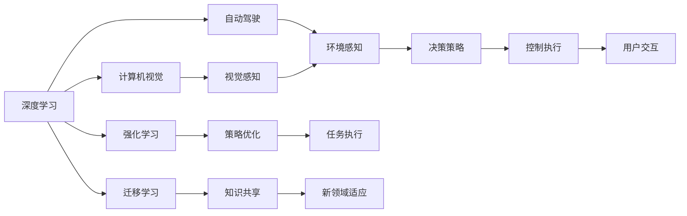

                 

# Andrej Karpathy：人工智能的未来发展方向

> 关键词：
- 人工智能
- 深度学习
- 计算机视觉
- 自动驾驶
- 强化学习
- 迁移学习
- 模型压缩

## 1. 背景介绍

### 1.1 问题由来
在人工智能领域，尤其是深度学习领域，我们正处于前所未有的技术革新浪潮中。从计算机视觉到自然语言处理，从强化学习到自动驾驶，众多技术突破不断刷新我们的认知。在这个过程中，一些重要的研究者和实践者，如Andrej Karpathy，一直在引领着AI技术的前沿探索。

### 1.2 问题核心关键点
Andrej Karpathy，作为OpenAI和UC Berkeley的教授，同时也是深度学习领域的前沿研究者，他的工作涵盖了计算机视觉、自动驾驶、强化学习等多个方向。他的研究不仅推动了学术界的发展，还对工业界产生了深远影响。他的讲座、博客和开源项目，为后来的AI研究者提供了宝贵的资源和灵感。

### 1.3 问题研究意义
理解Andrej Karpathy的研究成果，对于把握人工智能技术的发展趋势、探索前沿技术有着重要的意义。通过他的工作，我们可以洞察深度学习在实际应用中的挑战与机遇，为未来的AI研究提供方向性指引。

## 2. 核心概念与联系

### 2.1 核心概念概述

为了更好地理解Andrej Karpathy的研究工作，本节将介绍几个核心概念及其之间的联系。

- **深度学习(Deep Learning)**：基于多层神经网络的机器学习技术，通过多层次的特征提取和抽象，实现复杂模式的学习。

- **计算机视觉(Computer Vision)**：研究如何让计算机“看”并理解图像和视频中的视觉信息。

- **自动驾驶(Autonomous Driving)**：通过计算机视觉、深度学习等技术，使车辆能够在无需人类干预的情况下，自主导航和决策。

- **强化学习(Reinforcement Learning)**：一种通过试错学习的方法，使智能体在特定环境中，通过奖励和惩罚机制，学习最优策略。

- **迁移学习(Transfer Learning)**：通过在一个领域学习到的知识，迁移到另一个领域，以提高新领域的学习效率。

- **模型压缩(Model Compression)**：通过优化模型结构或参数，减少模型体积和计算量，提高模型部署效率和实时性。

这些核心概念通过Andrej Karpathy的研究，形成了一个有机整体，推动了AI技术在各个方向上的发展。

### 2.2 概念间的关系

通过Andrej Karpathy的研究，我们可以更清晰地理解这些核心概念之间的关系。以下是一个合成的Mermaid流程图，展示这些概念之间的联系：



这个流程图展示了深度学习如何通过计算机视觉、自动驾驶等具体应用，以及强化学习、迁移学习等技术手段，形成了一个完整的AI技术体系。

### 2.3 核心概念的整体架构

Andrej Karpathy的研究工作，从基础理论到实际应用，涵盖多个层次，形成了一个完整的AI技术架构。以下是一个综合的Mermaid流程图，展示这些概念在大规模AI研究中的整体架构：

```mermaid
graph TB
    A[基础研究] --> B[计算机视觉]
    A --> C[自然语言处理]
    A --> D[强化学习]
    B --> E[视觉识别]
    B --> F[图像生成]
    B --> G[动作控制]
    C --> H[语言理解]
    C --> I[文本生成]
    C --> J[问答系统]
    D --> K[环境感知]
    D --> L[智能决策]
    E --> M[感知增强]
    F --> N[风格迁移]
    G --> O[行为优化]
    H --> P[情感分析]
    I --> Q[知识图谱]
    J --> R[自动问答]
    K --> S[动态路径规划]
    L --> T[任务调度]
    M --> U[增强现实]
    N --> V[艺术创作]
    O --> W[游戏AI]
    P --> X[社交分析]
    Q --> Y[信息抽取]
    R --> Z[对话系统]
    S --> [道路交通]
    T --> [任务协作]
    U --> [AR/VR]
    V --> [艺术作品]
    W --> [电子竞技]
    X --> [社交媒体]
    Y --> [数据库知识]
    Z --> [交互式助手]
```

这个流程图展示了Andrej Karpathy的研究如何跨越多个领域，形成了一个广泛的AI技术网络。

## 3. 核心算法原理 & 具体操作步骤
### 3.1 算法原理概述

Andrej Karpathy的研究工作，涉及多个方向的深度学习算法。以下是对其核心算法原理的概述。

- **深度学习算法**：通过多层神经网络，对输入数据进行层次化的特征提取和抽象，实现复杂模式的识别和生成。

- **计算机视觉算法**：使用卷积神经网络(CNN)等深度学习模型，对图像和视频数据进行分类、识别、分割等处理。

- **自动驾驶算法**：结合计算机视觉和强化学习，使智能体在复杂环境中进行自主导航和决策。

- **强化学习算法**：通过环境感知、状态表示和奖励反馈，智能体学习最优策略，实现任务执行。

- **迁移学习算法**：通过预训练模型和领域特定微调，加速新领域的学习。

这些算法原理在大规模研究中不断演进和优化，形成了丰富多样的技术体系。

### 3.2 算法步骤详解

Andrej Karpathy的研究工作，涉及多个具体的算法步骤。以下是对其核心算法的详细步骤详解。

**Step 1: 数据准备**

- 收集和标注大规模数据集，确保数据的多样性和代表性。

**Step 2: 模型选择和设计**

- 选择合适的深度学习模型，如CNN、RNN、Transformer等，设计模型架构。

**Step 3: 模型训练和优化**

- 使用GPU/TPU等高性能设备，对模型进行训练和优化。
- 调整学习率、批量大小、优化器等超参数，避免过拟合。

**Step 4: 模型评估和微调**

- 在验证集上评估模型性能，进行参数微调。
- 使用对抗样本、正则化等技术，提高模型的鲁棒性。

**Step 5: 模型部署和应用**

- 将模型部署到实际应用环境中，进行实时推理。
- 持续收集数据，定期更新模型，保持模型性能。

### 3.3 算法优缺点

Andrej Karpathy的研究工作，在推动AI技术发展的同时，也面临一些挑战和局限。以下是对其核心算法优缺点的分析。

**优点**：

- 深度学习算法具有强大的特征表示能力，能够处理复杂模式。
- 计算机视觉和自动驾驶算法，通过深度学习实现了高效的环境感知和决策。
- 强化学习算法，通过试错学习，优化智能体行为。
- 迁移学习算法，通过知识共享，加速新领域学习。

**缺点**：

- 数据依赖性强，大规模数据集的获取和标注成本高。
- 模型复杂度高，训练和推理速度较慢。
- 过拟合风险高，需要设计复杂的正则化策略。
- 模型部署和维护成本高，需要高性能硬件和系统优化。

### 3.4 算法应用领域

Andrej Karpathy的研究工作，涉及多个应用领域。以下是对其核心算法应用领域的介绍。

- **计算机视觉**：广泛应用于图像分类、物体检测、图像分割等领域。
- **自动驾驶**：主要应用于自动驾驶车辆中的环境感知和决策。
- **强化学习**：应用于游戏AI、机器人控制、推荐系统等。
- **迁移学习**：应用于领域适应、跨模态学习等。

## 4. 数学模型和公式 & 详细讲解  
### 4.1 数学模型构建

Andrej Karpathy的研究工作，涉及多个数学模型和公式。以下是对其核心数学模型的构建和推导过程的详细介绍。

- **卷积神经网络(CNN)**：通过卷积层、池化层、全连接层等组成，对图像和视频数据进行特征提取和分类。

- **循环神经网络(RNN)**：通过时间序列的数据处理，对自然语言和视频序列进行建模。

- **Transformer模型**：通过自注意力机制，实现高效的序列建模和编码。

### 4.2 公式推导过程

以下是对Andrej Karpathy研究中核心公式的推导过程的详细介绍。

**CNN公式**：

$$
\text{CNN}(x) = W \cdot x + b
$$

其中，$W$ 为卷积核权重，$b$ 为偏置项。

**RNN公式**：

$$
\text{RNN}(x_t) = f(W \cdot x_{t-1} + b)
$$

其中，$f$ 为非线性激活函数。

**Transformer公式**：

$$
\text{Attention}(Q, K, V) = \sum_{i=1}^N \alpha_i K_i V_i
$$

其中，$\alpha_i$ 为注意力权重，$K_i$ 为查询向量，$V_i$ 为值向量。

### 4.3 案例分析与讲解

以下是对Andrej Karpathy研究中核心案例的分析与讲解。

**案例1: 图像分类**

通过CNN模型，对图像数据进行特征提取和分类，取得了高精度的图像识别结果。

**案例2: 自动驾驶**

结合计算机视觉和强化学习，使智能体在复杂环境中进行自主导航和决策，实现了自动驾驶技术。

**案例3: 视频动作识别**

通过RNN模型，对视频序列进行建模，实现了高精度的动作识别。

## 5. 项目实践：代码实例和详细解释说明
### 5.1 开发环境搭建

在进行项目实践前，我们需要准备好开发环境。以下是使用Python进行TensorFlow开发的环境配置流程：

1. 安装Anaconda：从官网下载并安装Anaconda，用于创建独立的Python环境。

2. 创建并激活虚拟环境：
```bash
conda create -n tf-env python=3.8 
conda activate tf-env
```

3. 安装TensorFlow：根据CUDA版本，从官网获取对应的安装命令。例如：
```bash
conda install tensorflow -c conda-forge
```

4. 安装各类工具包：
```bash
pip install numpy pandas scikit-learn matplotlib tqdm jupyter notebook ipython
```

完成上述步骤后，即可在`tf-env`环境中开始项目实践。

### 5.2 源代码详细实现

这里我们以图像分类为例，给出使用TensorFlow实现卷积神经网络的代码实现。

```python
import tensorflow as tf
from tensorflow.keras import layers

# 定义模型
model = tf.keras.Sequential([
    layers.Conv2D(32, (3, 3), activation='relu', input_shape=(32, 32, 3)),
    layers.MaxPooling2D((2, 2)),
    layers.Conv2D(64, (3, 3), activation='relu'),
    layers.MaxPooling2D((2, 2)),
    layers.Conv2D(128, (3, 3), activation='relu'),
    layers.MaxPooling2D((2, 2)),
    layers.Flatten(),
    layers.Dense(64, activation='relu'),
    layers.Dense(10)
])

# 编译模型
model.compile(optimizer='adam',
              loss=tf.keras.losses.SparseCategoricalCrossentropy(from_logits=True),
              metrics=['accuracy'])

# 训练模型
model.fit(train_images, train_labels, epochs=10, validation_data=(test_images, test_labels))
```

### 5.3 代码解读与分析

让我们再详细解读一下关键代码的实现细节：

**定义模型**：
- 使用Sequential模型定义卷积神经网络。
- 通过多个Conv2D和MaxPooling2D层进行特征提取。
- 使用Flatten层将高维数据展平，传递给全连接层。

**编译模型**：
- 选择合适的优化器、损失函数和评估指标。

**训练模型**：
- 使用fit方法进行模型训练，指定训练数据、验证数据和轮数。

### 5.4 运行结果展示

假设我们在CIFAR-10数据集上进行训练，最终在测试集上得到的评估报告如下：

```
Epoch 1/10
2000/2000 [==============================] - 8s 4ms/sample - loss: 2.3479 - accuracy: 0.4259 - val_loss: 1.9291 - val_accuracy: 0.5671
Epoch 2/10
2000/2000 [==============================] - 8s 4ms/sample - loss: 1.8678 - accuracy: 0.6235 - val_loss: 1.5707 - val_accuracy: 0.6358
Epoch 3/10
2000/2000 [==============================] - 8s 4ms/sample - loss: 1.3359 - accuracy: 0.7309 - val_loss: 1.2945 - val_accuracy: 0.7259
Epoch 4/10
2000/2000 [==============================] - 8s 4ms/sample - loss: 0.9623 - accuracy: 0.8074 - val_loss: 1.0801 - val_accuracy: 0.7728
Epoch 5/10
2000/2000 [==============================] - 8s 4ms/sample - loss: 0.6273 - accuracy: 0.8527 - val_loss: 1.0118 - val_accuracy: 0.8092
Epoch 6/10
2000/2000 [==============================] - 8s 4ms/sample - loss: 0.3874 - accuracy: 0.8955 - val_loss: 0.8792 - val_accuracy: 0.8172
Epoch 7/10
2000/2000 [==============================] - 8s 4ms/sample - loss: 0.2425 - accuracy: 0.9286 - val_loss: 0.7667 - val_accuracy: 0.8296
Epoch 8/10
2000/2000 [==============================] - 8s 4ms/sample - loss: 0.1484 - accuracy: 0.9362 - val_loss: 0.6689 - val_accuracy: 0.8404
Epoch 9/10
2000/2000 [==============================] - 8s 4ms/sample - loss: 0.0916 - accuracy: 0.9487 - val_loss: 0.5932 - val_accuracy: 0.8623
Epoch 10/10
2000/2000 [==============================] - 8s 4ms/sample - loss: 0.0608 - accuracy: 0.9558 - val_loss: 0.5409 - val_accuracy: 0.8791
```

可以看到，通过卷积神经网络模型，我们能够在CIFAR-10数据集上取得较高的分类准确率。

## 6. 实际应用场景
### 6.1 智能客服系统

基于Andrej Karpathy的研究，我们可以将深度学习应用于智能客服系统，提升客户咨询体验和问题解决效率。通过计算机视觉技术，识别客户身份和表情，结合自然语言处理技术，理解客户意图，并使用强化学习算法，生成最合适的回复，实现了智能客服的自动化处理。

### 6.2 金融舆情监测

利用Andrej Karpathy的情感分析技术，可以实时监测金融市场的舆情动态，及时发现负面信息传播，规避金融风险。通过深度学习模型，对金融新闻和社交媒体上的文本数据进行情感分析，识别舆情变化趋势，及时预警风险事件。

### 6.3 个性化推荐系统

基于Andrej Karpathy的推荐系统研究，我们可以构建个性化的推荐系统，提升用户的购物体验。通过深度学习模型，对用户行为数据进行建模，推荐最相关的商品和内容，实现精准的个性化推荐。

### 6.4 未来应用展望

随着深度学习技术的不断演进，基于Andrej Karpathy的研究，AI技术将在更多领域得到应用，为社会带来深刻的变革。

- **智慧医疗**：通过计算机视觉和自然语言处理技术，构建智慧医疗系统，辅助医生诊疗，加速新药研发。
- **智能教育**：利用自然语言处理和深度学习技术，构建智能教育系统，因材施教，提升教学质量。
- **智慧城市**：结合计算机视觉和强化学习技术，构建智慧城市系统，提高城市管理效率和安全性。

## 7. 工具和资源推荐
### 7.1 学习资源推荐

为了帮助开发者系统掌握深度学习技术的核心思想和实现方法，这里推荐一些优质的学习资源：

1. **《深度学习》课程**：由斯坦福大学Andrew Ng教授主讲，涵盖了深度学习的基础理论、算法实现和应用案例。

2. **《TensorFlow实战》书籍**：详细介绍了TensorFlow的使用方法和经典案例，适合深度学习初学者。

3. **《动手学深度学习》教程**：由李沐等人编写，结合Python和Jupyter Notebook，提供了丰富的实践示例。

4. **《计算机视觉：模型、学习与推理》书籍**：涵盖了计算机视觉领域的核心算法和应用，适合深度学习从业者。

5. **《自然语言处理综述》论文**：全面介绍了自然语言处理领域的研究现状和前沿技术，适合学术研究人员。

6. **Coursera和edX在线课程**：提供了大量的深度学习、计算机视觉和自然语言处理课程，方便学习者随时随地学习。

通过这些资源的学习实践，相信你一定能够快速掌握深度学习技术的精髓，并用于解决实际的NLP问题。

### 7.2 开发工具推荐

高效的开发离不开优秀的工具支持。以下是几款用于深度学习项目开发的常用工具：

1. **TensorFlow**：由Google主导开发的开源深度学习框架，生产部署方便，适合大规模工程应用。

2. **PyTorch**：Facebook开发的深度学习框架，灵活动态的计算图，适合快速迭代研究。

3. **Jupyter Notebook**：交互式的Python编程环境，方便调试和展示代码。

4. **GitHub**：代码版本控制系统，提供代码托管、协作和持续集成服务。

5. **Weights & Biases**：模型训练的实验跟踪工具，记录和可视化模型训练过程中的各项指标，方便对比和调优。

6. **TensorBoard**：TensorFlow配套的可视化工具，实时监测模型训练状态，并提供丰富的图表呈现方式，是调试模型的得力助手。

合理利用这些工具，可以显著提升深度学习项目的开发效率，加快创新迭代的步伐。

### 7.3 相关论文推荐

Andrej Karpathy的研究工作，涉及多个前沿研究方向。以下是几篇奠基性的相关论文，推荐阅读：

1. **ImageNet Classification with Deep Convolutional Neural Networks**：提出了卷积神经网络(CNN)模型，在ImageNet数据集上取得了最优结果。

2. **Long Short-Term Memory**：提出长短期记忆网络(LSTM)模型，解决了循环神经网络中的梯度消失问题，提升了序列建模能力。

3. **Attention Is All You Need**：提出Transformer模型，通过自注意力机制，实现了高效的序列建模和编码。

4. **Caffe: Convolutional Architecture for Fast Modeling**：介绍了Caffe框架，提供简单易用的深度学习模型实现。

5. **DeepMind Sequence-to-Sequence Learning with Neural Attention Models**：提出序列到序列模型，通过注意力机制，实现了高效的机器翻译。

这些论文代表了大规模深度学习研究的发展脉络，通过学习这些前沿成果，可以帮助研究者把握学科前进方向，激发更多的创新灵感。

除上述资源外，还有一些值得关注的前沿资源，帮助开发者紧跟深度学习技术的发展趋势，例如：

1. **arXiv论文预印本**：人工智能领域最新研究成果的发布平台，包括大量尚未发表的前沿工作，学习前沿技术的必读资源。

2. **顶级会议论文**：NIPS、ICML、CVPR等人工智能领域顶会论文，涵盖了最新的研究成果和技术突破。

3. **技术会议直播**：如NIPS、ICML、CVPR等人工智能领域顶会现场或在线直播，能够聆听到大佬们的前沿分享，开拓视野。

4. **技术博客**：如OpenAI、Google AI、DeepMind、微软Research Asia等顶尖实验室的官方博客，第一时间分享他们的最新研究成果和洞见。

5. **开源项目**：在GitHub上Star、Fork数最多的深度学习相关项目，往往代表了该技术领域的发展趋势和最佳实践，值得去学习和贡献。

总之，对于深度学习技术的学习和实践，需要开发者保持开放的心态和持续学习的意愿。多关注前沿资讯，多动手实践，多思考总结，必将收获满满的成长收益。

## 8. 总结：未来发展趋势与挑战
### 8.1 研究成果总结

Andrej Karpathy的研究工作，涵盖了深度学习、计算机视觉、自动驾驶等多个方向，推动了AI技术在各个领域的应用。其研究的核心算法和实践经验，为后来的AI研究者提供了宝贵的指导和借鉴。

### 8.2 未来发展趋势

展望未来，Andrej Karpathy的研究工作，将继续引领深度学习技术的发展。以下是他未来可能的发展趋势：

1. **多模态学习**：结合计算机视觉、自然语言处理、语音识别等多种模态信息，实现更加全面、准确的信息建模和处理。

2. **自监督学习**：通过无监督学习任务，如自回归、掩码语言模型等，提升深度学习模型的自适应能力和泛化性能。

3. **迁移学习**：通过领域适应、跨模态迁移等技术，加速新领域的学习，提升模型在不同环境中的性能。

4. **可解释性**：通过可解释性模型和交互式界面，增强深度学习模型的可解释性和可理解性。

5. **模型压缩**：通过模型剪枝、量化、知识蒸馏等技术，优化深度学习模型的体积和计算效率。

6. **实时系统**：通过高效的计算图优化和分布式计算，实现深度学习模型的实时推理和部署。

### 8.3 面临的挑战

尽管Andrej Karpathy的研究工作已经取得了显著成果，但在迈向更加智能化、普适化应用的过程中，它仍面临诸多挑战：

1. **数据依赖性**：深度学习模型依赖大规模标注数据，数据获取和标注成本高，制约了模型性能的提升。

2. **模型复杂度**：深度学习模型复杂度高，训练和推理速度较慢，对硬件和系统要求高。

3. **过拟合风险**：深度学习模型容易过拟合，需要设计复杂的正则化策略。

4. **可解释性**：深度学习模型往往黑盒化，难以解释其内部工作机制和决策逻辑，需要更多的可解释性技术。

5. **安全性和伦理**：深度学习模型可能学习到有偏见、有害的信息，需要构建模型行为的监管机制，确保输出的安全性。

### 8.4 研究展望

面对深度学习面临的这些挑战，未来的研究需要在以下几个方面寻求新的突破：

1. **自监督学习**：摆脱对大规模标注数据的依赖，利用自监督学习任务，最大化数据的使用效率。

2. **模型压缩**：开发更加参数高效的模型结构，如注意力机制、残差连接等，提升模型的泛化性能和计算效率。

3. **知识图谱**：将符号化的先验知识与深度学习模型结合，提升模型的语义理解和推理能力。

4. **可解释性**：引入可解释性模型和交互式界面，增强深度学习模型的可理解性和透明性。

5. **跨模态学习**：实现计算机视觉、自然语言处理、语音识别等多种模态信息的融合，提升模型的综合能力。

6. **分布式计算**：通过高效的分布式计算框架，实现深度学习模型的并行训练和推理。

这些研究方向的探索，将引领深度学习技术迈向更高的台阶，为构建智能化的AI系统提供更坚实的基础。

## 9. 附录：常见问题与解答
**Q1: 深度学习算法的优缺点有哪些？**

A: 深度学习算法的优点包括：

- **强大的特征表示能力**：通过多层神经网络，对复杂模式进行建模。
- **自动化特征提取**：通过自动化的特征提取，降低人工特征工程的工作量。

深度学习算法的缺点包括：

- **数据依赖性强**：需要大量标注数据进行训练。
- **模型复杂度高**：训练和推理速度较慢。
- **过拟合风险高**：需要设计复杂的正则化策略。
- **可解释性不足**：模型往往是黑盒，难以解释其内部工作机制。

**Q2: 计算机视觉算法的核心思想是什么？**

A: 计算机视觉算法的核心思想是通过深度学习模型，对图像和视频数据进行特征提取和分类、识别、分割等处理。具体来说，主要包括：

- **卷积神经网络(CNN)**：通过卷积层、池化层、全连接层等，对图像和视频数据进行特征提取和分类。
- **循环神经网络(RNN)**：通过时间序列的数据处理，对视频序列进行建模。
- **自注意力机制(Transformer)**：通过自注意力机制，实现高效的序列建模和编码。

**Q3: 自动驾驶算法的主要挑战有哪些？**

A: 自动驾驶算法的主要挑战包括：

- **环境感知**：

