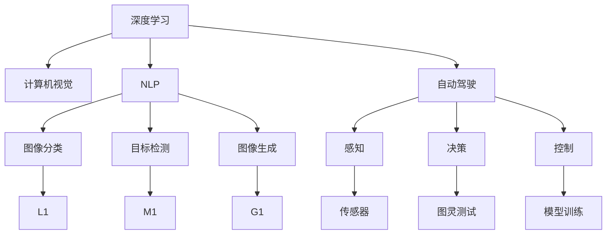

                 

# Andrej Karpathy：人工智能的未来发展机遇

> 关键词：人工智能，深度学习，计算机视觉，自然语言处理，自动驾驶，未来趋势，技术突破

## 1. 背景介绍

### 1.1 问题由来
在人工智能（AI）领域，深度学习技术的迅猛发展已经带来了翻天覆地的变化。其中，计算机视觉、自然语言处理、自动驾驶等方向都在不断突破技术瓶颈，逐渐从实验室走向实际应用。在这过程中，我们有必要反思与展望，未来AI领域有哪些潜在的机遇与挑战。

### 1.2 问题核心关键点
在AI领域，AI技术的突破往往与具体应用场景密切相关。基于此，Andrej Karpathy的讨论将聚焦于以下几个方面：

1. **计算机视觉**：如何构建更加高效、鲁棒的图像识别与处理系统。
2. **自然语言处理（NLP）**：如何提升语言模型在理解与生成任务上的表现。
3. **自动驾驶**：如何实现更加安全、智能的驾驶系统。
4. **技术突破**：如何将AI技术融入更多领域，如医疗、金融等。
5. **未来趋势**：AI技术的未来发展方向。

Andrej Karpathy作为深度学习领域的重要人物，曾在斯坦福大学等机构担任研究职务，并且在特斯拉等企业担任高级技术职位。他的观点将为我们提供重要的参考。

### 1.3 问题研究意义
了解Andrej Karpathy对AI未来发展机遇的见解，对于从事AI相关研究、应用和开发的人员具有重要的指导意义。他的观点能够帮助我们更好地把握AI技术的发展趋势，制定合理的技术策略，并为未来的研究方向提供参考。

## 2. 核心概念与联系

### 2.1 核心概念概述

为了理解Andrej Karpathy的讨论，我们先介绍几个核心概念：

- **深度学习**：利用神经网络进行学习和预测的技术。通过多层神经元进行特征提取与表示学习，提高模型性能。
- **计算机视觉**：让计算机能够理解、解释并处理图像和视频数据。核心技术包括图像分类、目标检测、图像生成等。
- **自然语言处理（NLP）**：使计算机能够理解、处理和生成人类语言的技术。包括文本分类、情感分析、机器翻译等任务。
- **自动驾驶**：利用AI技术实现无人驾驶车辆。包含感知、决策、控制等环节。
- **技术突破**：AI技术在新领域的应用，如医疗、金融、教育等。

这些概念在AI领域的发展中都有着重要的作用，彼此之间相互联系，推动AI技术的不断进步。

### 2.2 概念间的关系

这些概念之间的联系可以通过以下Mermaid流程图来展示：



这个流程图展示了深度学习在计算机视觉、自然语言处理和自动驾驶等领域的应用。通过多层神经网络进行特征提取与表示学习，AI技术在这些领域展现了卓越的能力。

## 3. 核心算法原理 & 具体操作步骤
### 3.1 算法原理概述

Andrej Karpathy的讨论将主要基于以下几个核心算法原理：

- **卷积神经网络（CNN）**：在计算机视觉中，利用卷积层和池化层进行特征提取，提高图像识别和处理能力。
- **循环神经网络（RNN）**：在NLP中，通过RNN进行序列数据的建模，提升语言模型的预测能力。
- **端到端学习（End-to-End Learning）**：在自动驾驶中，通过端到端框架进行端对端训练，实现从感知到决策的控制。

这些算法原理的突破，将为AI技术在不同领域的应用带来新的契机。

### 3.2 算法步骤详解

基于上述算法原理，Andrej Karpathy将介绍以下操作步骤：

1. **数据收集与预处理**：为模型提供高质量的训练数据，并进行数据增强、标注等预处理工作。
2. **模型选择与构建**：根据具体任务选择适合的模型架构，并进行模型训练。
3. **超参数调优**：通过网格搜索、贝叶斯优化等方法，确定模型超参数。
4. **模型评估与部署**：在验证集上进行模型评估，并将其部署到实际应用中。
5. **持续学习与优化**：通过在线学习、对抗训练等方法，提升模型的鲁棒性和泛化能力。

### 3.3 算法优缺点

Andrej Karpathy将对深度学习在各个领域的应用进行优缺点分析：

- **优点**：深度学习通过多层网络结构进行特征提取，提高模型的性能。
- **缺点**：模型复杂度高，训练和推理耗时较长。需要大量的标注数据进行训练。

### 3.4 算法应用领域

深度学习在多个领域都取得了显著的成果。以下是几个典型的应用领域：

- **计算机视觉**：在图像分类、目标检测、图像生成等任务中表现出色。
- **自然语言处理**：在文本分类、情感分析、机器翻译等任务中提升了模型的预测准确度。
- **自动驾驶**：通过感知、决策、控制等环节，实现了无人驾驶车辆。
- **医疗**：利用AI技术进行疾病诊断、医学影像分析等。
- **金融**：用于风险评估、市场分析等任务。

## 4. 数学模型和公式 & 详细讲解  
### 4.1 数学模型构建

基于深度学习的模型通常由多个层次组成，每个层次的输出作为下一层次的输入。以下是一个简单的数学模型：

$$
y = f(x; \theta)
$$

其中 $x$ 为输入数据，$y$ 为输出结果，$\theta$ 为模型参数。

### 4.2 公式推导过程

在深度学习中，常用到以下公式：

$$
y = f(x; \theta) = g(h(x; \theta_1), \theta_2)
$$

其中 $g$ 和 $h$ 为非线性变换函数，$\theta_1$ 和 $\theta_2$ 为不同层次的模型参数。

### 4.3 案例分析与讲解

在计算机视觉中，CNN模型由多个卷积层和池化层组成，通过多层特征提取进行图像分类。

在NLP中，RNN通过循环连接对序列数据进行建模，预测文本分类和情感分析任务。

在自动驾驶中，通过端到端框架实现从感知到决策的控制，提高驾驶系统的安全性。

## 5. 项目实践：代码实例和详细解释说明
### 5.1 开发环境搭建

在搭建深度学习项目环境时，一般需要安装以下依赖：

```bash
pip install torch torchvision torchtext transformers
```

### 5.2 源代码详细实现

以下是一个简单的CNN模型实现，用于图像分类任务：

```python
import torch.nn as nn
import torch.optim as optim
from torch.utils.data import DataLoader, Dataset

class CNNModel(nn.Module):
    def __init__(self):
        super(CNNModel, self).__init__()
        self.conv1 = nn.Conv2d(3, 16, 3)
        self.pool = nn.MaxPool2d(2)
        self.fc1 = nn.Linear(16*16*16, 128)
        self.fc2 = nn.Linear(128, 10)
        
    def forward(self, x):
        x = self.pool(nn.functional.relu(self.conv1(x)))
        x = x.view(-1, 16*16*16)
        x = nn.functional.relu(self.fc1(x))
        x = self.fc2(x)
        return x

model = CNNModel()
optimizer = optim.Adam(model.parameters(), lr=0.001)
criterion = nn.CrossEntropyLoss()

# 训练与评估
def train_epoch(model, data_loader, optimizer, criterion):
    model.train()
    for batch in data_loader:
        x, y = batch
        y_pred = model(x)
        loss = criterion(y_pred, y)
        optimizer.zero_grad()
        loss.backward()
        optimizer.step()

def evaluate(model, data_loader, criterion):
    model.eval()
    total_loss = 0
    total_correct = 0
    with torch.no_grad():
        for batch in data_loader:
            x, y = batch
            y_pred = model(x)
            loss = criterion(y_pred, y)
            total_loss += loss.item()
            total_correct += torch.argmax(y_pred, dim=1).eq(y).sum().item()
    return total_loss / len(data_loader), total_correct / len(data_loader.dataset)

# 训练与评估过程
train_loader = DataLoader(train_dataset, batch_size=32)
dev_loader = DataLoader(dev_dataset, batch_size=32)

for epoch in range(10):
    train_epoch(model, train_loader, optimizer, criterion)
    loss, accuracy = evaluate(model, dev_loader, criterion)
    print(f"Epoch {epoch+1}, Loss: {loss:.4f}, Accuracy: {accuracy:.4f}")
```

### 5.3 代码解读与分析

在上述代码中，我们定义了一个简单的CNN模型，并实现了训练与评估过程。

- `CNNModel` 类：定义了模型结构，包括卷积层、池化层、全连接层等。
- `train_epoch` 函数：在训练阶段，对数据进行前向传播、反向传播、参数更新等操作。
- `evaluate` 函数：在评估阶段，计算模型在验证集上的损失和准确率。

### 5.4 运行结果展示

训练结束后，可以在测试集上评估模型的性能。例如：

```python
test_loader = DataLoader(test_dataset, batch_size=32)
loss, accuracy = evaluate(model, test_loader, criterion)
print(f"Test Loss: {loss:.4f}, Test Accuracy: {accuracy:.4f}")
```

## 6. 实际应用场景
### 6.1 智能推荐系统

在电商、内容推荐等领域，智能推荐系统已经成为不可或缺的一部分。利用深度学习模型，可以对用户行为进行分析和预测，提供个性化的推荐服务。

在实践中，可以使用深度学习模型对用户行为数据进行建模，通过多层网络结构进行特征提取和预测，实现精准推荐。

### 6.2 医学影像分析

在医学影像分析领域，深度学习模型可以用于图像分类、病灶检测等任务。通过预训练模型和微调，模型可以更好地适应特定领域的医疗数据。

例如，在肺部CT影像中，可以使用深度学习模型进行肺部结节检测。预训练模型可以作为初始化参数，在小规模数据集上进行微调，提高检测精度。

### 6.3 自动驾驶

自动驾驶是深度学习在实际应用中的重要方向之一。通过计算机视觉、自然语言处理、决策控制等技术，实现无人驾驶车辆。

在自动驾驶中，深度学习模型可以用于感知环境、理解语义、进行路径规划和决策控制。端到端框架可以整合多个模块，实现从感知到决策的控制。

## 7. 工具和资源推荐
### 7.1 学习资源推荐

以下是几本深度学习经典书籍：

- 《深度学习》：Ian Goodfellow等人著，涵盖了深度学习的各个方面。
- 《计算机视觉：模型、学习和推理》：Karen Simonyan等人著，详细介绍了计算机视觉的原理和应用。
- 《自然语言处理入门》：Andrew Ng等人著，介绍了NLP的基本概念和实现方法。

### 7.2 开发工具推荐

以下是几款常用的深度学习开发工具：

- TensorFlow：Google开发的深度学习框架，支持分布式训练。
- PyTorch：Facebook开发的深度学习框架，易用性强，支持动态计算图。
- Keras：高层次深度学习框架，易于上手。

### 7.3 相关论文推荐

以下是几篇深度学习领域的重要论文：

- 《ImageNet Classification with Deep Convolutional Neural Networks》：Alex Krizhevsky等人著，引入了卷积神经网络，提升了图像分类的准确率。
- 《Attention is All You Need》：Ashish Vaswani等人著，提出了Transformer模型，开创了自注意力机制。
- 《Playing Atari with Deep Reinforcement Learning》：Volodymyr Mnih等人著，首次实现了通过深度学习训练的AI在电子游戏中取得优异成绩。

## 8. 总结：未来发展趋势与挑战
### 8.1 研究成果总结

Andrej Karpathy认为，深度学习在计算机视觉、自然语言处理、自动驾驶等领域有着广泛的应用前景，但同时也面临数据依赖、模型复杂度高、训练时间长等挑战。

### 8.2 未来发展趋势

Andrej Karpathy认为，未来AI技术的发展将呈现以下几个趋势：

1. **大模型与小模型并存**：一方面，大模型可以学习更丰富的知识，另一方面，小模型可以在特定领域快速部署。
2. **多模态融合**：利用图像、文本、语音等多模态数据，实现更全面的认知智能。
3. **自监督学习**：通过无监督学习方法，提高模型的泛化能力。
4. **边缘计算**：在边缘设备上实现AI应用，降低延迟，提高效率。
5. **联邦学习**：在分布式环境中，通过联邦学习方法，保护数据隐私。

### 8.3 面临的挑战

Andrej Karpathy认为，未来AI技术的发展将面临以下挑战：

1. **数据隐私与安全**：如何在保护数据隐私的同时，获取高质量的训练数据。
2. **模型可解释性**：如何让模型输出更易于解释和理解。
3. **计算资源与成本**：如何在有限的计算资源下，训练高质量的模型。
4. **模型鲁棒性**：如何让模型在各种环境下都表现稳定。

### 8.4 研究展望

Andrej Karpathy认为，未来AI技术的研究方向将聚焦于以下几个方面：

1. **高效模型与算法**：研究高效模型与算法，提升模型训练和推理效率。
2. **跨领域应用**：将AI技术融入更多领域，如医疗、金融、教育等。
3. **人机协同**：探索人机协同的方法，提高AI系统的智能水平。

总之，AI技术的发展前景广阔，但也面临着诸多挑战。Andrej Karpathy的见解为我们提供了重要的参考，未来需要在数据、算法、应用等方面进行全面的探索与实践。

## 9. 附录：常见问题与解答

**Q1：深度学习在图像识别任务中的表现如何？**

A: 深度学习在图像识别任务中表现出色，特别是在ImageNet等大型数据集上取得了显著的成果。卷积神经网络（CNN）是深度学习在图像识别任务中的重要模型。

**Q2：深度学习在自然语言处理中的应用有哪些？**

A: 深度学习在自然语言处理（NLP）中也有广泛应用，如文本分类、情感分析、机器翻译等任务。通过RNN、Transformer等模型，深度学习在NLP中展现了强大的能力。

**Q3：如何构建自动驾驶系统？**

A: 自动驾驶系统需要综合应用计算机视觉、自然语言处理、决策控制等多方面的技术。通过端到端框架，可以实现从感知到决策的控制。

**Q4：如何提升模型的泛化能力？**

A: 提升模型的泛化能力，可以通过数据增强、对抗训练、正则化等方法。同时，利用自监督学习，可以从大规模数据中提取更多的知识。

**Q5：未来AI技术的趋势是什么？**

A: 未来AI技术的趋势包括大模型与小模型并存、多模态融合、自监督学习、边缘计算和联邦学习等。这些方向将推动AI技术在更多领域的应用与发展。

---

作者：禅与计算机程序设计艺术 / Zen and the Art of Computer Programming

