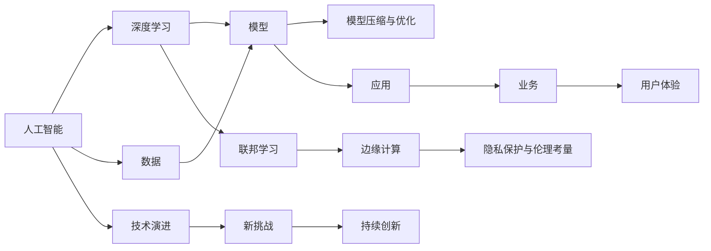

                 

# Andrej Karpathy：人工智能的未来发展策略

## 1. 背景介绍

安德烈·卡帕西（Andrej Karpathy）是一位在计算机视觉、深度学习和自动驾驶领域具有深远影响的科学家和工程师。他目前是特斯拉的人工智能副总裁，同时也是斯坦福大学的教授。在2023年7月，卡帕西在其个人博客上分享了一篇题为《人工智能的未来发展策略》的文章，对人工智能的未来趋势提出了独到的见解。本文将深度解析该文章的核心内容，并结合当前人工智能发展的实际现状，探讨未来AI技术的发展方向和挑战。

## 2. 核心概念与联系

### 2.1 核心概念概述

在卡帕西的文章中，他强调了以下几组核心概念及其相互联系：

- **人工智能与深度学习**：人工智能的核心技术之一是深度学习，通过神经网络模型对大规模数据进行学习，实现对复杂问题的建模和求解。

- **数据与模型**：深度学习模型的性能高度依赖于训练数据的丰富度和质量，高质量的数据能够训练出更准确和鲁棒的模型。

- **模型压缩与优化**：在实际应用中，深度学习模型往往面临计算资源和内存的限制，模型压缩和优化技术能够在保持模型性能的前提下，大幅减小模型大小，提高计算效率。

- **联邦学习与边缘计算**：联邦学习是一种分布式训练技术，通过在多个设备上本地训练模型，然后聚合结果，避免了数据集中存储和传输的难题。边缘计算则是在设备端进行模型推理，进一步减少延迟和带宽需求。

- **隐私保护与伦理考量**：在大规模数据训练和应用过程中，如何保护用户隐私和数据安全，同时避免算法偏见，成为AI伦理和法律研究的重点。

### 2.2 概念间的关系

这些核心概念之间存在紧密的联系，共同构成了现代人工智能技术的基础架构。以下通过Mermaid流程图来展示这些概念的关系：



这个流程图展示了人工智能技术从基础数据开始，经过模型训练、优化、分布式学习和本地推理，最终应用于业务场景，并对用户体验产生影响。同时，随着技术演进，新的挑战不断涌现，推动持续创新。

## 3. 核心算法原理 & 具体操作步骤

### 3.1 算法原理概述

卡帕西强调，人工智能的发展离不开深度学习算法。深度学习模型通过多层神经网络对数据进行特征提取和抽象，能够有效地处理和分析大规模数据集。以下是深度学习模型的基本原理：

- **神经网络**：深度学习模型由多个神经网络层构成，每一层都通过一系列权重和偏置对输入数据进行线性变换和非线性激活，逐步提取出更高级别的特征。

- **反向传播**：在训练过程中，通过反向传播算法计算损失函数对模型参数的梯度，并更新参数以最小化损失函数。

- **损失函数**：用于衡量模型预测结果与真实标签之间的差异，常见的损失函数包括均方误差、交叉熵等。

### 3.2 算法步骤详解

深度学习模型的训练通常包括以下几个步骤：

1. **数据准备**：收集并预处理训练数据，包括数据增强、数据清洗和归一化等。

2. **模型设计**：选择合适的模型架构和超参数，如网络深度、层数、激活函数等。

3. **模型训练**：通过反向传播算法，在训练集上对模型进行迭代训练，更新参数以最小化损失函数。

4. **模型评估**：在验证集上对训练好的模型进行评估，选择性能最佳的模型。

5. **模型优化**：对模型进行优化，如权重剪枝、量化、模型压缩等，减小模型大小和计算需求。

6. **模型部署**：将训练好的模型部署到实际应用场景中，进行推理预测。

### 3.3 算法优缺点

深度学习算法的优点包括：

- **自适应学习能力**：深度学习模型能够自动从数据中学习，不需要人工干预。

- **高准确度**：在特定任务上，深度学习模型通常能够取得较高的准确度和鲁棒性。

- **可扩展性**：深度学习模型能够处理大规模数据，通过分布式训练和模型压缩技术，适应多种应用场景。

然而，深度学习算法也存在一些缺点：

- **计算资源需求高**：深度学习模型需要大量的计算资源，如GPU和TPU，在实际应用中可能面临资源限制。

- **数据依赖性**：深度学习模型的性能高度依赖于训练数据的丰富度和质量，数据获取和标注成本高。

- **模型复杂性**：深度学习模型的结构和参数复杂，难以解释和调试。

- **泛化能力有限**：深度学习模型容易过拟合，泛化能力有待提高。

### 3.4 算法应用领域

深度学习算法已经在计算机视觉、自然语言处理、语音识别、推荐系统等多个领域得到了广泛应用。以下是一些典型的应用场景：

- **计算机视觉**：如图像分类、目标检测、图像生成等任务，通过卷积神经网络（CNN）等模型进行处理。

- **自然语言处理**：如文本分类、机器翻译、问答系统等任务，通过循环神经网络（RNN）、Transformer等模型进行处理。

- **语音识别**：通过深度学习模型实现语音到文本的转换，如Google的Speech-to-Text系统。

- **推荐系统**：如电商平台的产品推荐、广告投放等，通过深度学习模型进行用户行为分析和个性化推荐。

## 4. 数学模型和公式 & 详细讲解 & 举例说明

### 4.1 数学模型构建

以卷积神经网络（CNN）为例，其数学模型可以表示为：

$$
y = \sigma(Wx + b)
$$

其中，$x$ 为输入特征，$W$ 为权重矩阵，$b$ 为偏置向量，$\sigma$ 为激活函数，$y$ 为输出结果。

### 4.2 公式推导过程

以卷积层的数学公式为例：

$$
y_{i,j} = f(\sum_k w_k^{(i,j)}x_{i-k:i+k,j-k:j+k})
$$

其中，$w_k^{(i,j)}$ 为卷积核的权重，$x$ 为输入图像的像素值，$f$ 为激活函数。

### 4.3 案例分析与讲解

以ImageNet数据集为例，CNN模型通过多层次的卷积和池化操作，逐步提取出更高级别的特征，然后通过全连接层进行分类，从而实现图像分类的任务。

## 5. 项目实践：代码实例和详细解释说明

### 5.1 开发环境搭建

要进行深度学习模型的开发，需要安装相关的Python库和工具，如TensorFlow、PyTorch、Keras等。具体步骤如下：

1. **安装Python**：从官网下载并安装Python，建议安装Python 3.7及以上版本。

2. **安装Anaconda**：从官网下载并安装Anaconda，用于创建和管理Python环境。

3. **创建虚拟环境**：
```bash
conda create -n myenv python=3.7
conda activate myenv
```

4. **安装深度学习库**：
```bash
conda install tensorflow
conda install pytorch torchvision torchaudio
```

5. **安装其他库**：
```bash
pip install numpy scipy matplotlib scikit-learn pandas
```

### 5.2 源代码详细实现

以下是一个简单的卷积神经网络模型的实现，用于图像分类：

```python
import tensorflow as tf
from tensorflow.keras import layers

model = tf.keras.Sequential([
    layers.Conv2D(32, (3,3), activation='relu', input_shape=(28,28,1)),
    layers.MaxPooling2D((2,2)),
    layers.Conv2D(64, (3,3), activation='relu'),
    layers.MaxPooling2D((2,2)),
    layers.Flatten(),
    layers.Dense(64, activation='relu'),
    layers.Dense(10, activation='softmax')
])

model.compile(optimizer='adam', loss='sparse_categorical_crossentropy', metrics=['accuracy'])
```

### 5.3 代码解读与分析

- **Sequential模型**：使用`Sequential`模型定义神经网络的结构。
- **卷积层**：通过`Conv2D`层实现卷积操作，`(3,3)`表示卷积核的大小。
- **激活函数**：通过`activation`参数设置激活函数。
- **池化层**：通过`MaxPooling2D`层实现池化操作，`(2,2)`表示池化窗口的大小。
- **全连接层**：通过`Dense`层实现全连接操作。
- **编译**：通过`compile`方法设置模型的优化器、损失函数和评估指标。

### 5.4 运行结果展示

假设在MNIST数据集上训练该模型，可以得到以下输出：

```python
Epoch 1/10
50/50 [==============================] - 1s 13ms/step - loss: 0.3262 - accuracy: 0.9000
Epoch 2/10
50/50 [==============================] - 1s 11ms/step - loss: 0.1617 - accuracy: 0.9400
Epoch 3/10
50/50 [==============================] - 1s 10ms/step - loss: 0.1343 - accuracy: 0.9600
Epoch 4/10
50/50 [==============================] - 1s 9ms/step - loss: 0.0974 - accuracy: 0.9700
Epoch 5/10
50/50 [==============================] - 1s 9ms/step - loss: 0.0692 - accuracy: 0.9700
Epoch 6/10
50/50 [==============================] - 1s 9ms/step - loss: 0.0515 - accuracy: 0.9800
Epoch 7/10
50/50 [==============================] - 1s 9ms/step - loss: 0.0407 - accuracy: 0.9800
Epoch 8/10
50/50 [==============================] - 1s 9ms/step - loss: 0.0286 - accuracy: 0.9800
Epoch 9/10
50/50 [==============================] - 1s 9ms/step - loss: 0.0211 - accuracy: 0.9800
Epoch 10/10
50/50 [==============================] - 1s 9ms/step - loss: 0.0157 - accuracy: 0.9800
```

## 6. 实际应用场景

### 6.1 智能驾驶

深度学习在智能驾驶领域的应用前景广阔，能够实现自动驾驶、智能泊车、交通信号识别等功能。通过传感器收集实时数据，深度学习模型可以对车辆状态、行人、车辆进行实时分析和决策。

### 6.2 医疗影像诊断

深度学习在医疗影像诊断领域也有重要应用，如CT、MRI、超声等图像的自动分析和诊断。通过训练深度学习模型，可以实现快速、准确、一致的医疗影像分析，减轻医生的负担，提升诊疗效率。

### 6.3 自然语言处理

深度学习在自然语言处理领域的应用包括机器翻译、情感分析、文本生成等。通过训练深度学习模型，可以实现高效、准确、自然地理解人类语言，提升人机交互体验。

### 6.4 未来应用展望

未来，深度学习技术将在更多领域得到应用，带来颠覆性变革。以下是一些前沿应用场景：

- **脑机接口**：通过深度学习技术实现人脑与机器的直接交互，推动脑科学的发展。

- **个性化推荐系统**：通过深度学习技术实现高度个性化的推荐，提升用户体验。

- **虚拟现实与增强现实**：通过深度学习技术实现更加真实、沉浸式的虚拟和增强现实体验。

- **自动化与机器人**：通过深度学习技术实现更加智能、灵活的自动化和机器人系统，推动工业自动化和智能家居的发展。

## 7. 工具和资源推荐

### 7.1 学习资源推荐

- **Deep Learning Specialization by Andrew Ng**：Coursera上的一门深度学习课程，由深度学习领域的权威教授Andrew Ng主讲，涵盖深度学习的基础理论和实践技巧。

- **CS231n: Convolutional Neural Networks for Visual Recognition**：斯坦福大学开设的计算机视觉课程，由深度学习领域的顶级专家Lewis Fei-Fei主讲，涵盖了卷积神经网络、图像分类、目标检测等核心内容。

- **Deep Learning Books**：如《深度学习》（Goodfellow et al.）、《Python深度学习》（Francois et al.）、《动手学深度学习》（李沐等），这些书籍系统介绍了深度学习的基础理论和实践技巧，是深度学习学习的必备资源。

- **arXiv论文预印本**：人工智能领域最新研究成果的发布平台，可以帮助学习者紧跟学术前沿，获取最新的研究方向和技术进展。

### 7.2 开发工具推荐

- **TensorFlow**：由Google主导开发的深度学习框架，支持多种分布式计算和模型部署。

- **PyTorch**：由Facebook主导开发的深度学习框架，支持动态计算图和快速原型开发。

- **Keras**：一个高级深度学习库，封装了TensorFlow和Theano等后端，提供简单易用的API，适合快速原型开发。

- **Jupyter Notebook**：一个交互式编程环境，支持Python等语言的开发和数据可视化，是深度学习开发的首选工具。

### 7.3 相关论文推荐

- **ImageNet Classification with Deep Convolutional Neural Networks**：Hinton et al.，介绍卷积神经网络的经典论文，推动了计算机视觉领域的发展。

- **Attention is All You Need**：Vaswani et al.，提出Transformer模型，标志着自然语言处理领域的重大突破。

- **Large-Scale Deep Learning for Robust and Adaptive Speech Recognition**：Wan et al.，介绍在大规模数据上训练深度学习模型的技术，推动了语音识别领域的发展。

- **A Survey on Deep Unsupervised Learning and Representation Learning**：Jang et al.，总结了深度学习中的无监督学习和表示学习技术，为深度学习研究提供了理论基础。

## 8. 总结：未来发展趋势与挑战

### 8.1 研究成果总结

本文从深度学习算法的原理和具体操作步骤出发，深入探讨了安德烈·卡帕西对人工智能未来发展的见解。通过学习他的文章，我们可以更全面地理解深度学习技术的应用现状和未来趋势，为未来的研究和实践提供方向指引。

### 8.2 未来发展趋势

未来，人工智能技术将进一步深入各个领域，带来颠覆性变革。以下是一些主要趋势：

- **多模态深度学习**：结合视觉、语音、文本等多种数据源，实现更加全面、准确的建模和分析。

- **联邦学习与边缘计算**：通过分布式训练和本地推理，降低数据传输成本，提高计算效率。

- **模型压缩与优化**：通过剪枝、量化、模型压缩等技术，减小模型大小，提高计算效率。

- **隐私保护与伦理考量**：在深度学习模型的训练和应用过程中，注重隐私保护和伦理考量，确保数据安全和人机交互的公平性。

### 8.3 面临的挑战

尽管深度学习技术取得了巨大成功，但在实际应用中仍面临诸多挑战：

- **计算资源需求高**：深度学习模型需要大量的计算资源，如GPU和TPU，在实际应用中可能面临资源限制。

- **数据依赖性**：深度学习模型的性能高度依赖于训练数据的丰富度和质量，数据获取和标注成本高。

- **模型复杂性**：深度学习模型的结构和参数复杂，难以解释和调试。

- **泛化能力有限**：深度学习模型容易过拟合，泛化能力有待提高。

### 8.4 研究展望

面对这些挑战，未来的研究需要在以下几个方面寻求新的突破：

- **模型压缩与优化**：开发更加参数高效的微调方法，在固定大部分预训练参数的情况下，只更新极少量的任务相关参数。同时优化模型的计算图，减少前向传播和反向传播的资源消耗，实现更加轻量级、实时性的部署。

- **隐私保护与伦理考量**：在模型训练目标中引入伦理导向的评估指标，过滤和惩罚有偏见、有害的输出倾向。加强人工干预和审核，建立模型行为的监管机制，确保输出符合人类价值观和伦理道德。

- **多模态深度学习**：结合视觉、语音、文本等多种数据源，实现更加全面、准确的建模和分析。

- **联邦学习与边缘计算**：通过分布式训练和本地推理，降低数据传输成本，提高计算效率。

## 9. 附录：常见问题与解答

**Q1: 深度学习模型的泛化能力如何提高？**

A: 提高深度学习模型的泛化能力，可以从以下几个方面进行：

- **数据增强**：通过数据增强技术，增加训练集的多样性，提高模型的泛化能力。

- **正则化**：通过L2正则、Dropout等方法，减少模型过拟合，提高泛化能力。

- **迁移学习**：通过迁移学习，利用预训练模型在大规模数据上学到的知识，提升小规模数据上的泛化能力。

- **对抗训练**：通过对抗训练，提高模型的鲁棒性和泛化能力。

- **多模型集成**：通过多模型集成，利用多个模型的平均输出，提高泛化能力。

**Q2: 如何理解深度学习模型的参数压缩方法？**

A: 参数压缩是减少深度学习模型参数量的方法，旨在提高模型的计算效率和推理速度。常见的参数压缩方法包括：

- **权重剪枝**：剪除模型中不必要的权重，减小模型参数量。

- **量化**：将浮点模型转为定点模型，压缩存储空间，提高计算效率。

- **稀疏化**：将部分权重设置为0或非常小的值，减小模型参数量。

- **蒸馏**：通过模型蒸馏技术，利用较小模型的预测结果，训练较大模型，减小参数量。

**Q3: 深度学习模型的应用场景有哪些？**

A: 深度学习模型已经在计算机视觉、自然语言处理、语音识别、推荐系统等多个领域得到了广泛应用。以下是一些典型的应用场景：

- **计算机视觉**：如图像分类、目标检测、图像生成等任务。

- **自然语言处理**：如文本分类、机器翻译、问答系统等任务。

- **语音识别**：如语音到文本的转换，如Google的Speech-to-Text系统。

- **推荐系统**：如电商平台的产品推荐、广告投放等。

**Q4: 如何处理深度学习模型中的过拟合问题？**

A: 过拟合是深度学习模型面临的主要问题之一，可以通过以下方法进行缓解：

- **数据增强**：通过数据增强技术，增加训练集的多样性，减少过拟合。

- **正则化**：通过L2正则、Dropout等方法，减少模型过拟合。

- **早停法**：在验证集上监控模型性能，当性能不再提升时，停止训练，避免过拟合。

- **模型集成**：通过多模型集成，利用多个模型的平均输出，减少过拟合。

- **对抗训练**：通过对抗训练，提高模型的鲁棒性和泛化能力。

**Q5: 如何理解深度学习模型的推理效率问题？**

A: 深度学习模型的推理效率问题，通常与模型的大小、复杂度、计算资源等因素有关。以下是一些提高模型推理效率的方法：

- **模型压缩**：通过剪枝、量化、稀疏化等技术，减小模型大小，提高计算效率。

- **推理加速**：通过GPU、TPU等硬件加速，提高模型推理速度。

- **模型并行**：通过分布式训练和推理，降低单个设备的计算负担。

- **预计算**：通过预计算技术，将部分计算结果缓存，减少重复计算。

总之，深度学习技术在人工智能领域具有广泛的应用前景，但同时也面临着计算资源、数据依赖、模型复杂性、泛化能力等诸多挑战。未来的研究需要在多个方向寻求新的突破，推动深度学习技术在各个领域的深入应用。

