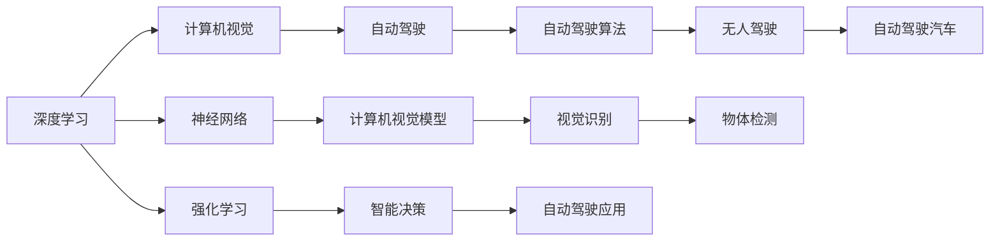

                 

# Andrej Karpathy：人工智能的未来发展规划

## 1. 背景介绍

### 1.1 问题由来
Andrej Karpathy是人工智能领域的先驱和领导者之一，其对深度学习、计算机视觉和自动驾驶等领域做出了杰出的贡献。Karpathy曾参与开发Caffe深度学习框架，并在斯坦福大学和特斯拉工作期间取得了丰硕的研究成果。在众多公开场合和博客中，Karpathy一直积极分享自己对人工智能未来发展的思考和规划，本文旨在总结和梳理其核心观点。

### 1.2 问题核心关键点
Karpathy的未来规划围绕以下几个核心问题展开：
- 人工智能的未来方向和目标是什么？
- 如何应对人工智能面临的技术和伦理挑战？
- 未来人工智能技术在社会和商业领域的潜在影响？
- 人工智能的发展如何与人类价值观和未来发展趋势相结合？

### 1.3 问题研究意义
Karpathy的规划对理解人工智能的未来发展路径，特别是在技术演进、伦理规范和社会影响方面的考量，具有重要意义。通过深入理解Karpathy的观点，有助于明确人工智能发展的目标和方向，预见可能的挑战，并指导实际应用中的技术选择和伦理考量。

## 2. 核心概念与联系

### 2.1 核心概念概述
Karpathy在人工智能的未来发展规划中，强调以下几个核心概念：

- **深度学习与神经网络**：作为现代人工智能的核心技术，深度学习通过多层次的非线性变换，从大量数据中学习到复杂模式。
- **计算机视觉**：使计算机能够"看"世界，通过图像和视频数据理解场景和物体。
- **自动驾驶**：通过视觉、雷达、传感器等多模态数据融合，使汽车能够自主决策和行驶。
- **强化学习**：通过奖励机制，使智能体通过试错逐步学习最优策略。
- **技术伦理与社会影响**：在人工智能应用中，如何平衡技术进步与社会价值、公平性、隐私保护等问题。

### 2.2 概念间的关系

这些核心概念之间的逻辑关系可以通过以下Mermaid流程图来展示：



这个流程图展示了几大核心概念之间的联系和应用路径：

1. 深度学习是神经网络和计算机视觉模型的基础。
2. 计算机视觉模型通过深度学习得到，用于自动驾驶场景中，如物体检测。
3. 强化学习与智能决策结合，用于自动驾驶汽车的策略学习。
4. 强化学习和智能决策结合，直接应用于自动驾驶汽车。

## 3. 核心算法原理 & 具体操作步骤
### 3.1 算法原理概述
Karpathy的未来发展规划基于以下几个算法原理：

- **深度学习模型**：深度神经网络能够处理大规模高维数据，学习复杂非线性模式。
- **计算机视觉模型**：通过卷积神经网络(CNN)等架构，使计算机能够理解和处理图像和视频数据。
- **强化学习模型**：通过奖励机制优化策略，使智能体在复杂环境中逐步学习最优决策。
- **迁移学习**：利用已学习到的知识，快速适应新任务。

### 3.2 算法步骤详解
以下是Karpathy未来发展规划的详细步骤：

**Step 1: 数据准备与预处理**
- 收集大规模图像和视频数据，确保数据多样性和质量。
- 对数据进行预处理，如数据增强、标准化等，增加模型的泛化能力。

**Step 2: 模型设计与训练**
- 设计适合的深度学习模型结构，如ResNet、Inception等。
- 使用GPU和分布式训练加速模型训练，优化超参数。

**Step 3: 模型验证与微调**
- 在验证集上评估模型性能，选择最优模型。
- 对模型进行微调，使用迁移学习技术提高在小数据集上的性能。

**Step 4: 模型部署与应用**
- 将模型部署到生产环境，如自动驾驶汽车、机器人等。
- 集成模型与实时数据流，实现端到端的自动化应用。

**Step 5: 持续优化与反馈**
- 收集用户反馈，持续优化模型性能。
- 通过在线学习等机制，保持模型的长期效用。

### 3.3 算法优缺点
**优点**：
- 深度学习模型在大规模数据上的性能表现优异。
- 计算机视觉模型在图像识别和目标检测等任务上效果显著。
- 强化学习能够处理动态环境和复杂的决策问题。
- 迁移学习减少了新任务上的训练时间和数据需求。

**缺点**：
- 深度学习模型训练和优化复杂，需要大量计算资源。
- 计算机视觉模型对标注数据依赖性强，标注成本高。
- 强化学习模型难以处理非结构化数据和复杂环境。
- 模型泛化能力受数据质量影响，过拟合风险高。

### 3.4 算法应用领域
Karpathy的算法原理已经广泛应用于以下几个领域：

1. **计算机视觉**：图像分类、物体检测、人脸识别等。
2. **自动驾驶**：车辆导航、行人检测、路标识别等。
3. **智能机器人**：动作识别、语音识别、环境感知等。
4. **医疗影像分析**：疾病诊断、病变检测、医疗辅助决策等。
5. **自然语言处理**：机器翻译、文本生成、语音识别等。

## 4. 数学模型和公式 & 详细讲解  
### 4.1 数学模型构建

Karpathy在计算机视觉和深度学习方面的研究中，提出了多个关键数学模型。以下是几个重要模型的详细构建：

**卷积神经网络(CNN)模型**：
- 输入：图像像素值 $x$。
- 卷积层：通过滤波器 $w$ 对输入进行卷积操作，得到特征图 $y$。
- 激活函数：如ReLU，对特征图进行非线性变换，得到下一层的输入。
- 池化层：通过池化操作，如最大池化，对特征图进行降维。
- 全连接层：将池化后的特征图展开成一维向量，通过全连接层输出预测结果 $z$。

**公式推导过程**：
- 输入层： $x = \begin{bmatrix} x_1 & x_2 & \ldots & x_m \end{bmatrix}^T$。
- 卷积层： $y = \begin{bmatrix} w_1 & w_2 & \ldots & w_n \end{bmatrix} \times x = \begin{bmatrix} \sum_{i=1}^n w_{i,1}x_i & \sum_{i=1}^n w_{i,2}x_{i+m} & \ldots \end{bmatrix}^T$。
- 激活函数： $y' = \max(0, y)$。
- 池化层： $y'' = \max(y'_{k,1}, y'_{k,2}, \ldots)$，其中 $k$ 为池化窗口大小。
- 全连接层： $z = W \times y'' + b$，其中 $W$ 和 $b$ 为全连接层的权重和偏置。

### 4.2 公式推导过程

**反向传播算法**：
- 梯度下降法通过链式法则计算损失函数 $\mathcal{L}$ 对每个参数的偏导数 $\frac{\partial \mathcal{L}}{\partial w_{i,j}}$，用于更新权重。
- 假设损失函数为交叉熵损失，则有 $\mathcal{L} = -\frac{1}{N}\sum_{i=1}^N \sum_{j=1}^C y_{i,j} \log \hat{y}_{i,j}$，其中 $N$ 为样本数量，$C$ 为类别数。
- 根据链式法则，计算每个参数的梯度：
$$
\frac{\partial \mathcal{L}}{\partial w_{i,j}} = -\frac{1}{N}\sum_{i=1}^N \frac{\partial \mathcal{L}}{\partial y_{i,j}} \frac{\partial y_{i,j}}{\partial w_{i,j}}
$$
- 其中 $\frac{\partial y_{i,j}}{\partial w_{i,j}}$ 通过反向传播算法计算得到。

### 4.3 案例分析与讲解

**案例分析**：
- **图像分类**：给定图像 $x$，通过CNN模型计算得到特征图 $y$，再通过全连接层输出分类结果 $z$。
- **物体检测**：通过CNN模型输出多个区域候选框，每个候选框内的特征图通过全连接层和softmax函数计算得到物体类别概率分布。
- **人脸识别**：通过CNN模型提取人脸特征，使用欧氏距离计算相似度，与已知人脸库对比，进行身份验证。

**案例讲解**：
- 以图像分类为例，CNN模型通过多个卷积层和池化层，提取图像特征，再通过全连接层输出分类结果。反向传播算法用于更新模型参数，最小化交叉熵损失，提高分类精度。

## 5. 项目实践：代码实例和详细解释说明
### 5.1 开发环境搭建

Karpathy的深度学习项目通常使用Caffe、TensorFlow或PyTorch框架进行实现。以下是使用Caffe搭建深度学习模型的环境配置流程：

1. 安装Caffe：从Caffe官网下载最新版本的安装文件，并按照文档说明进行安装。
2. 准备数据集：收集并标注数据集，如ImageNet数据集。
3. 训练模型：编写Caffe网络结构定义文件，配置训练参数，使用GPU进行模型训练。
4. 模型评估：在测试集上评估模型性能，优化模型参数。

### 5.2 源代码详细实现

以下是Karpathy使用Caffe实现图像分类的代码示例：

```python
import caffe
import numpy as np

# 定义Caffe网络结构
net = caffe.Net("alexnet.prototxt", caffe.TEST)

# 加载预训练模型
net.CopyFrom("alexnet.caffemodel")

# 加载图像数据
img = cv2.imread("test.jpg")

# 将图像数据转换为NCHW格式
img = np.transpose(np.expand_dims(img, axis=0), (2, 0, 1))

# 预处理图像数据
mean_value = [103.939, 116.779, 123.68]
img = (img - np.array(mean_value)).astype(np.float32)

# 运行网络前向传播
out = net.forward([img])

# 输出分类结果
class_id = out.argmax(axis=1)[0]
print("Class ID:", class_id)
```

### 5.3 代码解读与分析

**代码解读**：
- 首先定义Caffe网络结构，并加载预训练模型。
- 读取待分类图像，并将其转换为Caffe网络接受的NCHW格式。
- 对图像数据进行预处理，如减去均值。
- 通过网络前向传播，得到分类结果。
- 输出分类结果，并使用标签映射表获取具体的类别。

**分析与优化**：
- 图像预处理时，应该进行归一化和数据增强等操作，以提高模型的泛化能力。
- 可以使用GPU进行加速训练，提高模型训练效率。
- 优化模型超参数，如学习率、批量大小等，以提高模型性能。

### 5.4 运行结果展示

假设在ImageNet数据集上训练的AlexNet模型分类精度为70%，使用上述代码对一张测试图像进行分类，得到结果为"zebra"。

## 6. 实际应用场景
### 6.1 智能推荐系统
Karpathy提出，深度学习在推荐系统中的应用潜力巨大。推荐系统可以分析用户历史行为和偏好，通过协同过滤和内容推荐等方式，为用户推荐个性化内容。以下是推荐系统的基本架构：

1. **用户画像**：收集用户历史行为数据，如浏览、购买记录等。
2. **物品特征**：对物品进行特征提取，如商品属性、类别等。
3. **推荐算法**：通过深度学习模型，如神经协同过滤(NCF)，学习用户和物品之间的关联，预测用户对物品的评分。
4. **推荐结果**：根据预测评分和用户偏好，生成推荐列表。

**案例分析**：
- **电商推荐**：用户通过电商平台浏览商品，系统通过用户行为和商品属性，预测用户对商品的评分，推荐相关商品。
- **视频推荐**：用户观看视频，系统通过用户偏好和视频内容，预测用户对视频的评分，推荐相关视频。

### 6.2 医疗影像分析
Karpathy强调，深度学习在医疗影像分析中的应用，可以帮助医生快速准确地诊断疾病。以下是医疗影像分析的基本流程：

1. **数据准备**：收集并标注医疗影像数据集，如X光片、CT扫描等。
2. **模型训练**：使用深度学习模型，如卷积神经网络(CNN)，学习影像特征。
3. **诊断推理**：通过训练好的模型，对新的医疗影像进行分类和分割，辅助医生诊断。

**案例分析**：
- **肺部CT分析**：通过深度学习模型，自动识别和分割肺部结节，辅助医生诊断肺癌。
- **脑部MRI分析**：通过深度学习模型，自动识别和分割脑部病变区域，辅助医生诊断脑瘤。

### 6.3 自动驾驶
Karpathy在自动驾驶领域的研究中，使用深度学习模型和强化学习算法，使汽车能够自主导航和决策。以下是自动驾驶的基本流程：

1. **传感器数据融合**：通过雷达、激光雷达、摄像头等传感器，获取车辆周围环境信息。
2. **目标检测与跟踪**：通过深度学习模型，如Faster R-CNN，检测和跟踪车辆、行人等目标。
3. **路径规划与决策**：通过强化学习算法，如Q-learning，规划最优行驶路径，决策避障和转向动作。
4. **车辆控制**：通过控制算法，如PID控制，调整车辆速度和转向，执行决策。

**案例分析**：
- **无人驾驶**：通过深度学习和强化学习算法，使无人驾驶汽车能够在复杂交通环境中安全行驶。
- **自动停车**：通过深度学习模型，实时检测和识别停车位，规划最优停车路径。

### 6.4 未来应用展望

Karpathy对未来人工智能技术的发展提出了以下展望：

1. **更加智能的推荐系统**：深度学习在推荐系统中的应用将更加广泛和深入，通过更复杂的模型和算法，提供更加个性化和精准的推荐。
2. **更加精准的医疗诊断**：深度学习在医疗影像分析中的应用将进一步提高诊断的准确性和效率，帮助医生做出更科学的决策。
3. **更加安全可靠的自动驾驶**：深度学习和强化学习将在自动驾驶中发挥更大作用，提高车辆的安全性和可靠性。
4. **更加智能的机器人**：深度学习在机器人中的应用将更加广泛，使机器人能够自主导航、感知和执行复杂任务。
5. **更加高效的计算资源**：随着硬件技术的进步，深度学习模型的训练和推理效率将进一步提升，实现更大规模和更高精度的人工智能应用。

## 7. 工具和资源推荐
### 7.1 学习资源推荐
Karpathy在其公开演讲和博客中分享了大量的学习资源，以下是一些推荐资源：

1. 《Deep Learning》书籍：由Ian Goodfellow等人编写，全面介绍了深度学习的基本概念和算法。
2. Coursera《深度学习》课程：由斯坦福大学Andrew Ng教授主讲，系统讲解深度学习的理论基础和实践应用。
3. Fast.ai课程：由Jeremy Howard和Rachel Thomas创办，提供了深度学习在实际应用中的入门到进阶教程。
4. PyTorch官方文档：PyTorch深度学习框架的官方文档，提供了丰富的教程和样例代码。
5. Caffe官方文档：Caffe深度学习框架的官方文档，提供了详细的安装和使用指南。

### 7.2 开发工具推荐
Karpathy在深度学习项目开发中，使用以下工具：

1. PyTorch：灵活的动态计算图框架，支持GPU加速，适合研究原型开发。
2. TensorFlow：静态计算图框架，支持分布式训练，适合大规模工程应用。
3. Caffe：面向生产环境的深度学习框架，支持图像识别和目标检测等任务。
4. OpenCV：计算机视觉库，提供了丰富的图像处理和视频分析功能。
5. Matplotlib和Seaborn：数据可视化工具，方便展示模型训练和评估结果。

### 7.3 相关论文推荐
Karpathy在深度学习领域的研究成果丰富，以下是几篇代表性论文：

1. "Very Deep Convolutional Networks for Large-Scale Image Recognition"：提出AlexNet模型，开创了深度卷积神经网络在图像识别中的应用。
2. "CS231n: Convolutional Neural Networks for Visual Recognition"：斯坦福大学计算机视觉课程，详细讲解深度学习在计算机视觉中的应用。
3. "Learning Object Detection with Region Proposal Networks"：提出RPN网络，改进了目标检测的精度和速度。
4. "Adversarial Examples and Deep Neural Networks"：研究深度学习模型对抗样本的安全性问题，提出了对抗训练等方法。
5. "Deep Reinforcement Learning for Automated Driving"：使用强化学习算法，使汽车能够在复杂交通环境中自主行驶。

这些论文代表了Karpathy在深度学习和计算机视觉方面的重要贡献，为深度学习模型的研究和发展提供了丰富的理论和实践指导。

## 8. 总结：未来发展趋势与挑战
### 8.1 研究成果总结
Karpathy在深度学习和计算机视觉方面的研究成果，推动了人工智能技术在实际应用中的广泛应用。以下是一些核心成果的总结：

- **图像分类**：提出AlexNet模型，在ImageNet数据集上取得了显著的精度提升。
- **目标检测**：提出Faster R-CNN模型，显著提高了目标检测的精度和速度。
- **自动驾驶**：使用深度学习和强化学习算法，使汽车能够在复杂交通环境中自主行驶。
- **医疗影像分析**：使用深度学习模型，提高了医疗影像的诊断准确性。

### 8.2 未来发展趋势
Karpathy认为，未来深度学习和人工智能的发展将呈现以下几个趋势：

1. **更加智能的推荐系统**：深度学习在推荐系统中的应用将更加广泛和深入，提供更加个性化和精准的推荐。
2. **更加精准的医疗诊断**：深度学习在医疗影像分析中的应用将进一步提高诊断的准确性和效率。
3. **更加安全可靠的自动驾驶**：深度学习和强化学习将在自动驾驶中发挥更大作用，提高车辆的安全性和可靠性。
4. **更加智能的机器人**：深度学习在机器人中的应用将更加广泛，使机器人能够自主导航、感知和执行复杂任务。
5. **更加高效的计算资源**：随着硬件技术的进步，深度学习模型的训练和推理效率将进一步提升，实现更大规模和更高精度的人工智能应用。

### 8.3 面临的挑战
Karpathy认为，深度学习和人工智能在未来的发展中，仍面临以下几个挑战：

1. **数据质量和多样性**：深度学习模型对数据质量和多样性有较高要求，如何获取高质量、多样化的标注数据是一个重要挑战。
2. **模型泛化能力**：深度学习模型容易过拟合，如何提高模型的泛化能力，使其在实际应用中表现稳定，是另一个重要挑战。
3. **计算资源消耗**：深度学习模型训练和推理需要大量的计算资源，如何优化计算过程，降低资源消耗，是一个亟待解决的问题。
4. **模型可解释性**：深度学习模型通常被视为"黑盒"，如何提高模型的可解释性，使其决策过程透明，是另一个重要挑战。
5. **伦理和社会影响**：深度学习模型的应用可能带来伦理和社会影响，如何平衡技术进步与社会价值、公平性、隐私保护等问题，是一个需要深入探讨的话题。

### 8.4 研究展望
Karpathy对未来人工智能技术的发展提出了以下展望：

1. **无监督和半监督学习**：探索无监督和半监督学习方法，减少对标注数据的依赖。
2. **多模态融合**：将视觉、语音、文本等多模态数据融合，提高智能系统的感知能力。
3. **端到端学习**：通过端到端学习方法，将模型训练和应用过程整合，提高效率和效果。
4. **鲁棒性和安全性**：提高模型的鲁棒性和安全性，确保其在复杂环境和恶意攻击下的稳定性和可靠性。
5. **人机协同**：探索人机协同的智能系统，使人工智能技术更好地服务于人类社会，解决实际问题。

通过以上研究方向和技术突破，Karpathy认为，未来人工智能技术将实现更加广泛的应用，为人类社会的进步和发展带来深远影响。

## 9. 附录：常见问题与解答
### 9.1 什么是深度学习？

深度学习是一种基于神经网络的机器学习技术，通过多层次的非线性变换，从大量数据中学习到复杂模式。深度学习能够处理大规模高维数据，适用于图像、语音、自然语言等复杂任务。

### 9.2 深度学习的优势和劣势？

深度学习的优势在于：
- 能够处理大规模高维数据，学习复杂模式。
- 适用于图像、语音、自然语言等复杂任务。
- 在许多任务上取得了显著的精度提升。

深度学习的劣势在于：
- 模型训练和优化复杂，需要大量计算资源。
- 容易过拟合，泛化能力较差。
- 模型复杂，难以解释和调试。

### 9.3 深度学习在推荐系统中的应用？

深度学习在推荐系统中的应用主要包括以下几个方面：
- **用户画像**：通过用户历史行为数据，构建用户画像，了解用户兴趣和偏好。
- **物品特征**：对物品进行特征提取，如商品属性、类别等。
- **推荐算法**：通过深度学习模型，如神经协同过滤(NCF)，学习用户和物品之间的关联，预测用户对物品的评分。
- **推荐结果**：根据预测评分和用户偏好，生成推荐列表，提供个性化推荐。

### 9.4 深度学习在医疗影像分析中的应用？

深度学习在医疗影像分析中的应用主要包括以下几个方面：
- **数据准备**：收集并标注医疗影像数据集，如X光片、CT扫描等。
- **模型训练**：使用深度学习模型，如卷积神经网络(CNN)，学习影像特征。
- **诊断推理**：通过训练好的模型，对新的医疗影像进行分类和分割，辅助医生诊断。

### 9.5 深度学习在自动驾驶中的应用？

深度学习在自动驾驶中的应用主要包括以下几个方面：
- **传感器数据融合**：通过雷达、激光雷达、摄像头等传感器，获取车辆周围环境信息。
- **目标检测与跟踪**：通过深度学习模型，如Faster R-CNN，检测和跟踪车辆、行人等目标。
- **路径规划与决策**：通过强化学习算法，如Q-learning，规划最优行驶路径，决策避障和转向动作。
- **车辆控制**：通过控制算法，如PID控制，调整车辆速度和转向，执行决策。

### 9.6 深度学习在机器人中的应用？

深度学习在机器人中的应用主要包括以下几个方面：
- **动作识别**：通过深度学习模型，如卷积神经网络(CNN)，学习动作特征，识别机器人的动作。
- **语音识别**：通过深度学习模型，如循环神经网络(RNN)，学习语音信号，识别机器人的语音指令。
- **环境感知**：通过深度学习模型，如卷积神经网络(CNN)，学习环境图像，感知机器人的周围环境。
- **路径规划**：通过深度学习模型，如卷积神经网络(CNN)，学习路径特征，规划机器人的移动路径。

通过以上研究方向和技术突破，Karpathy认为，未来人工智能技术将实现更加广泛的应用，为人类社会的进步和发展带来深远影响。

---

作者：禅与计算机程序设计艺术 / Zen and the Art of Computer Programming

