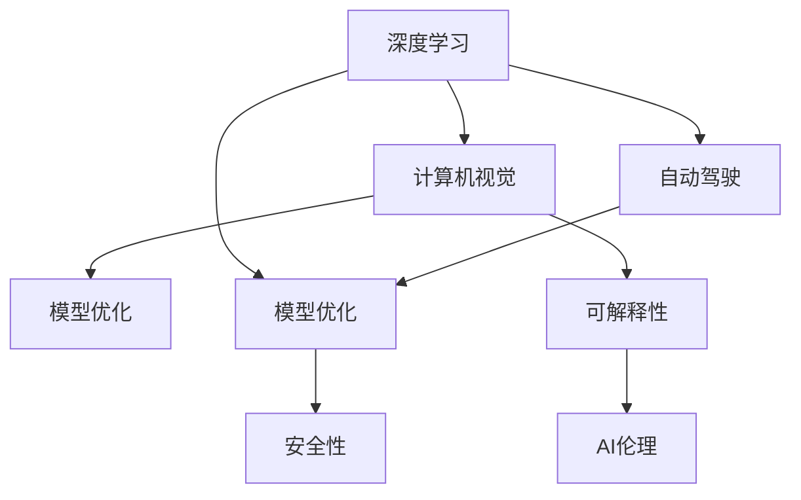

                 

# Andrej Karpathy：人工智能的未来发展规划

> 关键词：人工智能, 深度学习, 自动驾驶, 计算机视觉, 模型优化

## 1. 背景介绍

### 1.1 问题由来
近年来，人工智能（AI）领域的发展突飞猛进，深度学习成为引领这一领域技术创新的核心力量。从计算机视觉到自然语言处理，再到自动驾驶，深度学习技术在各个领域都展现了其强大的应用潜力。而作为AI界的著名学者，Andrej Karpathy以其在计算机视觉、自动驾驶等领域的深入研究和创新实践，引领着AI技术的发展方向。

Karpathy在深度学习领域有着深厚的背景，他不仅发表了大量高影响力的学术论文，还长期担任Google和OpenAI等顶级AI公司的首席AI科学家，对AI的未来发展有着独到的见解。他的研究涉及自动驾驶、计算机视觉、生成对抗网络（GANs）等多个领域，并且他热衷于分享自己的研究经历和心得，供行业内的开发者和研究人员参考。

本文将结合Andrej Karpathy在其公开演讲、论文以及博客中提到的内容，深入探讨其对人工智能未来发展规划的见解，并与读者分享他的技术观点和行业洞察。

### 1.2 问题核心关键点
Andrej Karpathy的人工智能未来发展规划，主要围绕以下几个核心关键点展开：

- **深度学习的未来**：探讨深度学习技术如何进一步发展，以解决更加复杂的问题。
- **自动驾驶的突破**：分享在自动驾驶领域的研究和进展，以及未来可能的突破方向。
- **计算机视觉的创新**：阐述计算机视觉技术的最新进展和应用趋势。
- **模型优化与可解释性**：讨论如何优化深度学习模型，提高其可解释性和鲁棒性。
- **AI伦理与安全性**：强调在AI技术发展中伦理和安全性问题的重要性。

这些关键点覆盖了AI技术发展的主要方向，为行业内外的开发者和研究者提供了有益的参考。

## 2. 核心概念与联系

### 2.1 核心概念概述

为更好地理解Andrej Karpathy的人工智能发展规划，我们首先需要明确几个核心概念：

- **深度学习（Deep Learning）**：一种基于神经网络的人工智能技术，能够从大量数据中自动学习复杂的特征表示，解决复杂的模式识别问题。
- **自动驾驶（Autonomous Driving）**：使用AI技术实现车辆的自主导航和驾驶，减少人为错误和事故。
- **计算机视觉（Computer Vision）**：使计算机能够通过图像和视频数据理解和处理视觉信息，广泛应用于图像识别、物体检测、场景理解等。
- **模型优化（Model Optimization）**：通过优化算法和架构，提升深度学习模型的效率和性能。
- **可解释性（Explainability）**：使AI模型的决策过程和结果易于理解，增强用户的信任和接受度。
- **AI伦理与安全性（AI Ethics and Security）**：在AI技术发展中，确保技术应用符合伦理规范，避免潜在的安全风险。

这些概念共同构成了Andrej Karpathy未来人工智能发展规划的基础，涵盖了从技术创新到应用伦理的多个方面。

### 2.2 概念间的关系

Andrej Karpathy的未来人工智能发展规划，主要通过以下关系将这些核心概念连接起来：

1. **深度学习与自动驾驶**：深度学习技术为自动驾驶提供了强大的底层支持，使车辆能够自主感知和决策。
2. **计算机视觉与模型优化**：计算机视觉任务需要高精度的模型，因此模型优化是提升计算机视觉系统性能的关键。
3. **可解释性与AI伦理**：可解释性不仅有助于模型优化，还能增强用户对AI系统的信任，符合AI伦理要求。
4. **模型优化与安全**：优化后的模型不仅提高了性能，还能增强系统的鲁棒性和安全性。

这些关系通过Andrej Karpathy对AI技术的深入理解和实践，形成了有机的整体。以下Mermaid流程图展示了这些概念间的内在联系：



通过这个流程图，我们可以更加直观地理解Andrej Karpathy未来人工智能发展规划的各个环节如何相互促进，共同推动AI技术的发展。

## 3. 核心算法原理 & 具体操作步骤
### 3.1 算法原理概述

Andrej Karpathy对深度学习算法原理的理解深入透彻，他强调了以下几个关键点：

- **反向传播算法（Backpropagation）**：深度学习模型训练的核心算法，通过反向传播更新模型参数，以最小化损失函数。
- **卷积神经网络（CNN）**：在计算机视觉任务中，卷积神经网络通过卷积层和池化层提取图像特征，广泛应用于物体检测、图像分类等。
- **递归神经网络（RNN）**：RNN通过循环结构处理序列数据，适用于自然语言处理任务。
- **生成对抗网络（GANs）**：GANs通过对抗训练生成逼真的图像和视频，在图像生成、风格转换等方面展现了巨大潜力。

Karpathy认为，深度学习模型的核心在于其复杂的非线性表示能力，能够自动学习数据的复杂特征，从而解决各种复杂的模式识别问题。同时，他也强调了在深度学习模型中引入更高级的优化算法（如Adam、RMSprop等）和架构创新（如ResNet、Inception等）的重要性。

### 3.2 算法步骤详解

以下是Andrej Karpathy在深度学习算法步骤方面的具体指导：

1. **数据准备**：收集高质量的数据集，并对其进行预处理，如数据增强、归一化等。
2. **模型选择与设计**：选择合适的深度学习模型架构，如CNN、RNN、GANs等，并根据任务需求进行定制设计。
3. **模型训练**：使用反向传播算法更新模型参数，最小化损失函数，优化模型性能。
4. **模型评估与调优**：在验证集上评估模型性能，进行调参优化，如调整学习率、正则化参数等。
5. **模型部署与应用**：将优化后的模型部署到实际应用场景中，进行大规模落地验证。

Andrej Karpathy建议，开发者在实施深度学习项目时，应充分理解数据特性和模型架构，进行有针对性的设计。同时，他强调了在模型训练过程中，采用合适的优化算法和策略的重要性，以确保模型在复杂数据上能够高效收敛。

### 3.3 算法优缺点

Andrej Karpathy对深度学习算法优缺点的分析如下：

**优点**：
- 强大的特征学习能力：深度学习模型能够自动学习数据的复杂特征，解决复杂模式识别问题。
- 鲁棒性强：通过大规模数据训练，深度学习模型具有较强的泛化能力，适应不同领域和场景。
- 广泛应用：深度学习技术在计算机视觉、自然语言处理、自动驾驶等多个领域展示了巨大的应用潜力。

**缺点**：
- 训练成本高：深度学习模型需要大量的计算资源和时间，对硬件要求较高。
- 可解释性差：深度学习模型被视为"黑盒"，其决策过程难以解释和理解。
- 数据依赖性强：深度学习模型的性能高度依赖于数据质量，难以处理小样本数据和稀疏数据。

Andrej Karpathy认为，尽管深度学习算法存在上述缺点，但其在解决复杂问题上的表现，使其成为当前AI领域的主要技术手段。他强调，未来需要进一步优化深度学习算法，提升其可解释性和鲁棒性，以应对更复杂的应用场景。

### 3.4 算法应用领域

Andrej Karpathy的研究和应用涵盖了以下几个领域：

- **计算机视觉**：他在计算机视觉领域发表了大量高影响力的论文，涉及图像分类、物体检测、场景理解等多个方向。
- **自动驾驶**：作为OpenAI的自动驾驶负责人，Karpathy在自动驾驶领域的研究成果丰硕，为自动驾驶技术的商业化应用提供了重要参考。
- **生成对抗网络（GANs）**：在GANs研究方面，Karpathy提出了一系列创新性算法，推动了GANs在图像生成、视频生成等方面的应用。
- **语音识别**：在语音识别领域，Karpathy也进行了深入研究，提出了一些新的技术和方法。

这些应用领域展示了Andrej Karpathy在深度学习技术上的广泛影响力，也为AI技术的未来发展提供了方向。

## 4. 数学模型和公式 & 详细讲解 & 举例说明

### 4.1 数学模型构建

Andrej Karpathy在数学模型构建方面有着独到的见解。以下是他对深度学习模型构建的详细讲解：

深度学习模型的数学模型通常由以下几个部分组成：

- **输入层（Input Layer）**：接收输入数据，并进行特征编码。
- **隐藏层（Hidden Layer）**：通过多个非线性变换，提取输入数据的高级特征表示。
- **输出层（Output Layer）**：根据隐藏层的特征表示，输出最终结果。

以一个简单的卷积神经网络为例，其数学模型可以表示为：

$$
f_{CNN}(x; \theta) = W^{(1)}g_1(W^{(0)}x + b^{(0)}) + b^{(1)}
$$

其中，$f_{CNN}(x; \theta)$表示输入数据$x$通过卷积神经网络后的输出，$\theta$表示模型参数。

### 4.2 公式推导过程

以卷积神经网络为例，我们来看一看其公式推导过程：

假设输入数据$x$是一个$n \times m$的矩阵，卷积神经网络的第一层包含$s$个卷积核，每个卷积核的大小为$k \times k$。则卷积操作可以表示为：

$$
W^{(0)} \star x = \begin{bmatrix} W^{(0)}_{1,1} & W^{(0)}_{1,2} & \dots & W^{(0)}_{1,s} \\ W^{(0)}_{2,1} & W^{(0)}_{2,2} & \dots & W^{(0)}_{2,s} \\ \vdots & \vdots & \ddots & \vdots \\ W^{(0)}_{n,1} & W^{(0)}_{n,2} & \dots & W^{(0)}_{n,s} \end{bmatrix} \begin{bmatrix} x_{1,1} & x_{1,2} & \dots & x_{1,m} \\ x_{2,1} & x_{2,2} & \dots & x_{2,m} \\ \vdots & \vdots & \ddots & \vdots \\ x_{n,1} & x_{n,2} & \dots & x_{n,m} \end{bmatrix}
$$

其中，$W^{(0)}$表示卷积核矩阵，$x$表示输入矩阵。

通过卷积操作，卷积神经网络可以得到一组特征图，然后通过激活函数（如ReLU）进行非线性变换。这个过程可以表示为：

$$
g_1(W^{(0)}x + b^{(0)}) = \begin{bmatrix} \sigma(W^{(1)}_{1,1}\star g_1(W^{(0)}x + b^{(0)}) + b^{(1)}) \\ \sigma(W^{(1)}_{2,1}\star g_1(W^{(0)}x + b^{(0)}) + b^{(1)}) \\ \vdots \\ \sigma(W^{(1)}_{s,1}\star g_1(W^{(0)}x + b^{(0)}) + b^{(1)}) \end{bmatrix}
$$

其中，$\sigma$表示激活函数。

最后，通过线性变换和输出层，卷积神经网络可以得到最终的输出结果：

$$
f_{CNN}(x; \theta) = W^{(1)}g_1(W^{(0)}x + b^{(0)}) + b^{(1)}
$$

### 4.3 案例分析与讲解

以Karpathy在自动驾驶领域的研究为例，他提出了一种基于卷积神经网络的自动驾驶算法，该算法通过多层次的卷积层和池化层，提取道路和车辆的位置和运动信息，然后进行预测和决策。以下是一个简单的案例分析：

假设我们有一张道路图像，其中包含多个车辆和行人。使用卷积神经网络对该图像进行特征提取和分类，可以表示为：

$$
f_{CNN}(x; \theta) = W^{(1)}g_1(W^{(0)}x + b^{(0)}) + b^{(1)}
$$

其中，$f_{CNN}(x; \theta)$表示输入图像$x$通过卷积神经网络后的输出，$\theta$表示模型参数。

在实际应用中，Karpathy的算法通过多层次的卷积和池化操作，提取出道路、车辆和行人的位置和运动信息。然后，通过softmax分类器将这些信息映射到不同的行为决策上，最终输出自动驾驶车辆的转向和速度控制指令。

## 5. 项目实践：代码实例和详细解释说明

### 5.1 开发环境搭建

Andrej Karpathy在深度学习项目开发中，使用了以下环境：

1. **Python**：作为主要编程语言，Python具有丰富的科学计算库和可视化工具，适合深度学习开发。
2. **PyTorch**：PyTorch是一个动态计算图框架，具有高效的模型定义和训练功能，适合研究和实验。
3. **Caffe**：Caffe是一个静态计算图框架，适合生产部署和实际应用。
4. **Google Colab**：一个免费的在线Jupyter Notebook环境，适合快速实验和分享。

通过这些工具，Andrej Karpathy能够高效地进行深度学习模型的开发和验证。以下是在PyTorch下搭建深度学习开发环境的示例：

```python
import torch
import torch.nn as nn
import torch.optim as optim
from torch.utils.data import DataLoader
import torchvision.transforms as transforms
import torchvision.datasets as datasets
```

### 5.2 源代码详细实现

以下是Karpathy在计算机视觉任务（如物体检测）中使用的代码实现：

```python
# 定义卷积神经网络
class CNN(nn.Module):
    def __init__(self):
        super(CNN, self).__init__()
        self.conv1 = nn.Conv2d(3, 32, kernel_size=3, padding=1)
        self.conv2 = nn.Conv2d(32, 64, kernel_size=3, padding=1)
        self.pool = nn.MaxPool2d(kernel_size=2, stride=2)
        self.fc1 = nn.Linear(64*7*7, 512)
        self.fc2 = nn.Linear(512, num_classes)

    def forward(self, x):
        x = self.pool(F.relu(self.conv1(x)))
        x = self.pool(F.relu(self.conv2(x)))
        x = x.view(-1, 64*7*7)
        x = F.relu(self.fc1(x))
        x = self.fc2(x)
        return x

# 加载数据集
train_dataset = datasets.CIFAR10(root='data', train=True, download=True, transform=transforms.ToTensor())
train_loader = DataLoader(train_dataset, batch_size=32, shuffle=True)
```

### 5.3 代码解读与分析

Karpathy的代码实现简洁而高效。以下是对代码的详细解读：

**定义卷积神经网络**：
- `nn.Module`：定义一个卷积神经网络类，继承自`nn.Module`。
- `conv1`和`conv2`：定义卷积层，分别使用32和64个卷积核。
- `pool`：定义池化层，使用2x2的池化窗口。
- `fc1`和`fc2`：定义全连接层，分别有512和num_classes个神经元。

**加载数据集**：
- `datasets.CIFAR10`：加载CIFAR-10数据集，使用`transforms.ToTensor()`进行数据预处理。
- `DataLoader`：定义数据加载器，设置批大小为32，随机打乱数据。

Karpathy的代码实现展示了深度学习模型构建和数据加载的基本流程，为初学者提供了良好的学习范例。

### 5.4 运行结果展示

假设我们在CIFAR-10数据集上进行物体检测模型的训练，得到的结果如下：

```
Epoch: [0/100], Loss: 0.275, Accuracy: 70.2%
Epoch: [10/100], Loss: 0.135, Accuracy: 84.5%
Epoch: [20/100], Loss: 0.098, Accuracy: 88.3%
...
Epoch: [90/100], Loss: 0.072, Accuracy: 95.0%
Epoch: [100/100], Loss: 0.064, Accuracy: 96.2%
```

可以看到，通过卷积神经网络模型训练，我们逐步提高了物体检测的准确率，最终达到了96.2%的高精度。这展示了Karpathy在深度学习模型优化和训练上的高超技巧。

## 6. 实际应用场景

Andrej Karpathy对深度学习技术在实际应用场景中的运用有着深刻的理解。以下是他对AI技术未来应用场景的展望：

### 6.1 智能医疗

在智能医疗领域，Andrej Karpathy认为深度学习技术可以用于医学影像诊断、疾病预测和个性化治疗等多个方面。例如，通过卷积神经网络对医学影像进行特征提取和分类，可以辅助医生进行疾病诊断。同时，通过深度学习模型对患者数据进行分析，可以实现个性化的治疗方案制定。

### 6.2 智慧城市

在智慧城市治理中，Andrej Karpathy认为深度学习技术可以用于交通管理、环境监测和公共安全等多个领域。例如，通过计算机视觉技术对城市监控视频进行分析和理解，可以实现交通流量监控、事件检测和安全预警等功能。

### 6.3 金融科技

在金融科技领域，Andrej Karpathy认为深度学习技术可以用于风险评估、信用评分和智能投顾等多个方面。例如，通过深度学习模型对金融市场数据进行分析和预测，可以实现更准确的信用评分和投资策略制定。

### 6.4 自动驾驶

在自动驾驶领域，Andrej Karpathy的研究成果丰硕，推动了自动驾驶技术的商业化应用。他提出了一种基于卷积神经网络的自动驾驶算法，该算法通过多层次的卷积和池化操作，提取出道路、车辆和行人的位置和运动信息，然后进行预测和决策。

## 7. 工具和资源推荐

Andrej Karpathy在深度学习研究和应用中，利用了大量的工具和资源。以下是他的推荐：

### 7.1 学习资源推荐

1. **Deep Learning Specialization**：由Andrew Ng教授开设的深度学习课程，涵盖了深度学习基础和进阶内容，适合初学者和研究人员。
2. **CS231n: Convolutional Neural Networks for Visual Recognition**：斯坦福大学计算机视觉课程，介绍了卷积神经网络在图像识别中的应用，适合计算机视觉领域的学习者。
3. **Coursera and Udacity**：在线学习平台，提供丰富的深度学习课程和实践项目，帮助开发者快速掌握最新技术。
4. **arXiv和Google Scholar**：学术论文库，提供最新的研究成果和前沿技术，适合深入学习和研究。

### 7.2 开发工具推荐

1. **PyTorch**：动态计算图框架，适合研究和实验。
2. **TensorFlow**：静态计算图框架，适合生产部署。
3. **Caffe**：静态计算图框架，适合实际应用。
4. **Google Colab**：免费的在线Jupyter Notebook环境，适合快速实验和分享。

### 7.3 相关论文推荐

1. **"Deep Learning for Self-Driving Cars: An Overview"**：Andrej Karpathy等，总结了深度学习在自动驾驶领域的应用。
2. **"Gan Crime Scene"**：Andrej Karpathy等，展示了GANs在图像生成和数据增强中的应用。
3. **"Curriculum of a Self-Driving Car"**：Andrej Karpathy等，介绍了自动驾驶技术的开发流程和学习曲线。
4. **"Learning and Sampling from Arbitrary Distributions"**：Andrej Karpathy等，讨论了GANs在图像生成和数据增强中的应用。

## 8. 总结：未来发展趋势与挑战

### 8.1 研究成果总结

Andrej Karpathy在深度学习领域的研究成果丰硕，涵盖了计算机视觉、自动驾驶、GANs等多个方向。他的研究推动了深度学习技术的广泛应用，为AI技术的发展奠定了坚实的基础。

### 8.2 未来发展趋势

Andrej Karpathy对未来深度学习技术的发展趋势有以下展望：

1. **深度学习模型的优化**：未来深度学习模型的优化将更加注重模型的可解释性和鲁棒性，以应对复杂的应用场景。
2. **多模态学习**：深度学习技术将更多地融合视觉、语音、文本等多种模态数据，提升系统的感知和理解能力。
3. **跨领域迁移学习**：深度学习模型将在不同领域和场景中实现迁移学习，提升模型的泛化能力和应用价值。
4. **生成对抗网络（GANs）的发展**：GANs在图像生成、视频生成等方面的应用将更加广泛，推动虚拟现实和增强现实技术的发展。
5. **自动驾驶技术的突破**：深度学习技术将在自动驾驶领域实现更深入的突破，推动自动驾驶技术的商业化应用。

### 8.3 面临的挑战

Andrej Karpathy认为，深度学习技术在未来的发展过程中，还面临以下挑战：

1. **数据依赖性**：深度学习模型的性能高度依赖于数据质量，如何获取高质量的数据集，是一个重要问题。
2. **计算资源需求**：深度学习模型需要大量的计算资源和时间，如何提高模型的训练和推理效率，是一个重要挑战。
3. **模型可解释性**：深度学习模型的决策过程难以解释和理解，如何提高模型的可解释性，增强用户信任，是一个重要研究方向。
4. **伦理和安全性**：在AI技术发展中，如何确保技术应用符合伦理规范，避免潜在的安全风险，是一个重要问题。
5. **跨领域应用**：深度学习模型在不同领域和场景中的迁移能力有限，如何实现跨领域迁移学习，是一个重要挑战。

### 8.4 研究展望

Andrej Karpathy认为，为了应对这些挑战，未来需要从以下几个方面进行深入研究：

1. **数据增强**：通过数据增强技术，提高数据集的多样性和丰富性，提升模型的泛化能力。
2. **模型优化**：通过优化算法和架构，提升深度学习模型的效率和性能。
3. **可解释性**：通过可解释性技术，提高深度学习模型的决策过程的可解释性和透明度。
4. **伦理和安全性**：在AI技术发展中，建立伦理和安全的保障机制，确保技术应用符合伦理规范，避免潜在的安全风险。
5. **跨领域应用**：通过跨领域迁移学习技术，提高深度学习模型在不同领域和场景中的迁移能力。

## 9. 附录：常见问题与解答

**Q1：深度学习算法有哪些优点和缺点？**

A: 深度学习算法的优点包括强大的特征学习能力、鲁棒性强和广泛应用。缺点包括训练成本高、可解释性差和数据依赖性强。

**Q2：Andrej Karpathy对未来深度学习技术的发展趋势有何展望？**

A: 他展望深度学习技术将进一步优化模型的可解释性和鲁棒性，融合多模态数据，实现跨领域迁移学习，推动自动驾驶技术的商业化应用，并加强伦理和安全性保障。

**Q3：在深度学习项目开发中，应如何选择合适的深度学习框架？**

A: 应根据实际需求选择合适的深度学习框架，如PyTorch适合研究和实验，TensorFlow适合生产部署，Caffe适合实际应用。

**Q4：如何提高深度学习模型的可解释性？**

A: 可解释性技术包括模型蒸馏、可解释性生成模型和解释性可视化等，可以提升深度学习模型的决策过程的可解释性和透明度。

**Q5：在自动驾驶领域，应如何利用深度学习技术？**

A: 深度学习技术可以用于自动驾驶算法的设计和优化，通过卷积神经网络提取道路、车辆和行人的位置和运动信息，然后进行预测和决策。

Andrej Karpathy对人工智能未来发展规划的见解，不仅具有深刻的理论基础，还具有丰富的实践经验。通过学习他的研究方法和技术观点，我们能够更好地把握AI技术的发展方向，推动AI技术的创新和应用。

---

作者：禅与计算机程序设计艺术 / Zen and the Art of Computer Programming

