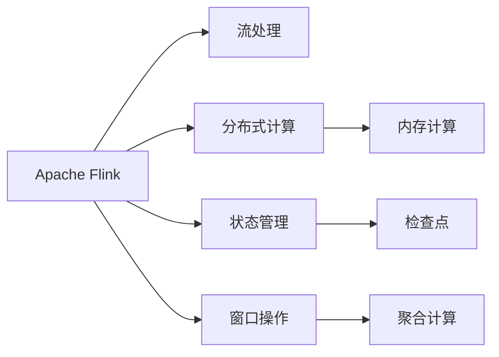
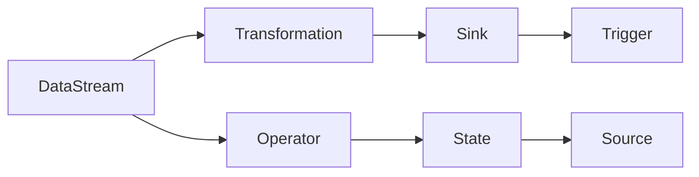
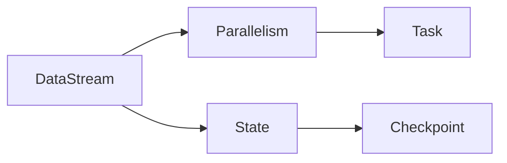

                 

# Apache Flink

> 关键词：大数据,流处理,Apache,实时计算,分布式

## 1. 背景介绍

### 1.1 问题由来
在当今数据时代，数据流处理已经成为许多企业和组织的核心需求。传统的数据处理方式往往基于批量数据，无法实时响应业务变化，而流处理技术通过实时处理数据流，提供了一种更为灵活和高效的数据处理解决方案。Apache Flink是一个流行的开源流处理框架，它能够高效地处理大规模、实时、高吞吐量的数据流，广泛应用于各种场景，如实时数据监控、金融交易、物联网等。

### 1.2 问题核心关键点
Apache Flink的核心技术包括流处理引擎、数据源和数据汇流、状态和窗口操作等，其主要特点包括：

1. 强大的分布式计算能力：支持多种数据源和数据汇流，能够处理海量数据。
2. 低延迟、高吞吐量：通过内存计算和状态管理，实现实时、低延迟的数据处理。
3. 灵活的数据处理模型：支持批处理和流处理混合计算，满足不同业务场景需求。
4. 高度可扩展性：能够水平扩展，支持数千个节点，处理大规模数据流。
5. 容错性：自动检测和恢复故障，确保数据处理的一致性和可靠性。
6. 丰富的API和库：提供Scala、Java、Python等多种API接口，支持丰富的库和插件。

### 1.3 问题研究意义
Apache Flink在实时数据处理领域的广泛应用，帮助企业和组织实现了实时数据分析和业务决策，优化了系统性能和效率。通过研究Flink的技术细节和应用场景，可以为大数据工程师和开发者提供更为深入的理论知识和实践经验，推动流处理技术的进一步发展，促进大数据产业的繁荣。

## 2. 核心概念与联系

### 2.1 核心概念概述

为更好地理解Apache Flink的核心概念，本节将介绍几个关键概念：

- Apache Flink：Apache软件基金会下开源的流处理框架，支持分布式、可扩展的流数据处理。
- 流处理：指对实时数据流的连续处理，提供低延迟、高吞吐量的数据处理能力。
- 分布式计算：指在多个节点上并行处理大规模数据，提高计算效率和扩展性。
- 状态管理：指通过维护数据状态，支持复杂的流计算模型和逻辑。
- 窗口操作：指将数据流划分为若干窗口，在窗口上进行聚合计算，支持流计算的基本操作。

这些概念之间的联系可以通过以下Mermaid流程图来展示：



这个流程图展示了大数据流处理的基本流程：

1. Apache Flink通过流处理引擎，处理实时数据流。
2. 在分布式计算框架下，多个节点并行处理数据，提升计算效率。
3. 状态管理模块维护数据状态，支持复杂的流计算模型。
4. 窗口操作将数据流划分为若干窗口，并在窗口上进行聚合计算，完成基本流计算操作。

### 2.2 概念间的关系

这些核心概念之间存在着紧密的联系，形成了Apache Flink的完整技术体系。下面我们通过几个Mermaid流程图来展示这些概念之间的关系。

#### 2.2.1 Apache Flink的架构



这个流程图展示了Apache Flink的基本架构：

1. DataStream：代表流数据输入，是Flink处理的原始数据。
2. Transformation：数据流经过一系列的转换操作，形成最终的输出。
3. Operator：负责具体的转换操作，包括映射、过滤、聚合等。
4. Sink：代表流数据输出，将计算结果存储或传递给外部系统。
5. State：通过维护数据状态，支持复杂的流计算模型。
6. Source：代表流数据的输入，可以从文件、数据库、网络等不同来源获取数据。
7. Trigger：代表窗口操作的触发条件，如时间窗口、事件窗口等。

#### 2.2.2 分布式计算与状态管理



这个流程图展示了Flink分布式计算与状态管理的关系：

1. DataStream：代表流数据输入，被分配到不同的任务节点上进行并行处理。
2. Parallelism：通过并行化处理，提高计算效率和扩展性。
3. State：通过分布式状态管理，支持复杂的流计算模型。
4. Checkpoint：定期将数据状态保存到外部存储中，确保数据处理的一致性和容错性。

## 3. 核心算法原理 & 具体操作步骤

### 3.1 算法原理概述

Apache Flink的流处理引擎基于DataStream API，支持多种数据源和数据汇流，能够高效处理大规模、实时、高吞吐量的数据流。其核心算法包括：

- 内存计算：通过将数据存储在内存中，实现低延迟、高吞吐量的数据处理。
- 状态管理：通过检查点和分布式状态管理，确保数据处理的一致性和容错性。
- 窗口操作：通过将数据流划分为若干窗口，并在窗口上进行聚合计算，完成基本的流计算操作。
- 分布式计算：通过并行化处理和任务调度，提高计算效率和扩展性。

### 3.2 算法步骤详解

Apache Flink的流处理流程包括以下几个关键步骤：

**Step 1: 数据源接入**
- 通过Flink提供的DataStream API，接入各种数据源，如文件系统、数据库、网络流等。

**Step 2: 数据转换**
- 对数据流进行一系列的转换操作，如映射、过滤、聚合等，生成中间结果。
- 使用Flink提供的丰富API，实现复杂的数据处理逻辑。

**Step 3: 数据汇聚**
- 将中间结果汇聚到不同的节点上，进行并行化处理。
- 根据数据量和使用场景，设置合适的并行度，确保计算效率和资源利用率。

**Step 4: 数据输出**
- 将计算结果存储或传递给外部系统，如文件系统、数据库、网络流等。
- 使用Flink提供的Sink API，实现数据输出的灵活性和可靠性。

**Step 5: 状态管理**
- 通过维护数据状态，支持复杂的流计算模型。
- 使用Flink提供的State API，实现数据状态的持久化和恢复。

**Step 6: 检查点与容错**
- 定期将数据状态保存到外部存储中，确保数据处理的一致性和容错性。
- 使用Flink提供的Checkpoint API，实现数据的自动恢复和故障检测。

### 3.3 算法优缺点

Apache Flink具有以下优点：

1. 强大的分布式计算能力：支持大规模、实时、高吞吐量的数据流处理。
2. 低延迟、高吞吐量：通过内存计算和状态管理，实现实时、低延迟的数据处理。
3. 灵活的数据处理模型：支持批处理和流处理混合计算，满足不同业务场景需求。
4. 高度可扩展性：能够水平扩展，支持数千个节点，处理大规模数据流。
5. 容错性：自动检测和恢复故障，确保数据处理的一致性和可靠性。
6. 丰富的API和库：提供Scala、Java、Python等多种API接口，支持丰富的库和插件。

同时，Flink也存在一些缺点：

1. 对内存需求较高：由于采用内存计算，对系统内存要求较高，可能存在内存溢出等问题。
2. 复杂的API接口：Flink提供了丰富的API接口，但API设计复杂，新用户入门难度较大。
3. 不支持跨数据源的统一计算：虽然支持多种数据源，但跨数据源的统一计算和数据融合仍需外部工具支持。
4. 部署和运维成本较高：Flink集群搭建和维护需要一定的技术水平，部署和运维成本较高。
5. 数据一致性问题：由于状态管理涉及数据一致性问题，需要谨慎设计和调试。

### 3.4 算法应用领域

Apache Flink在许多领域得到了广泛应用，包括：

- 实时数据监控：实时监控和分析各种业务数据，如日志、交易、告警等。
- 金融交易：处理实时交易数据，进行风险监控、欺诈检测、交易分析等。
- 物联网：实时处理和分析物联网设备生成的数据，进行设备状态监控、异常检测等。
- 数据分析：处理离线数据，进行复杂的数据分析和挖掘。
- 视频流处理：实时处理和分析视频流数据，进行视频监控、内容推荐等。
- 智能交通：处理交通数据，进行交通流量分析、车辆定位等。
- 社交网络：实时处理和分析社交媒体数据，进行舆情分析、用户行为分析等。

## 4. 数学模型和公式 & 详细讲解 & 举例说明

### 4.1 数学模型构建

Apache Flink的流处理模型可以基于时间窗口进行构建。假设数据流为 $D$，其中 $D(t)$ 表示在时刻 $t$ 到达的数据流。定义窗口函数 $w$ 和聚合函数 $f$，则窗口 $W_t = \{d \in D \mid w(t) \leq t\}$，其中 $d$ 表示数据流中的一个元素。聚合函数 $f$ 对窗口 $W_t$ 中的所有元素进行聚合计算，得到窗口结果 $F_t = f(W_t)$。

### 4.2 公式推导过程

以一个简单的数据流为例，说明Flink窗口操作的数学模型。假设数据流 $D$ 中有两个元素 $d_1$ 和 $d_2$，分别在时间 $t_1$ 和 $t_2$ 到达。定义时间窗口为 $[0,+\infty]$，聚合函数为求和。则数据流 $D$ 的时间窗口 $W_0$ 包含所有元素，即 $W_0 = \{d_1, d_2\}$。对 $W_0$ 进行求和聚合，得到窗口结果 $F_0 = d_1 + d_2 = 3$。

在实际应用中，窗口操作可以灵活设计，如基于时间、基于事件、基于状态等。Flink支持多种窗口类型，如滑动窗口、滚动窗口、会话窗口等，满足不同业务场景的需求。

### 4.3 案例分析与讲解

假设某电商网站需要对用户行为进行实时监控，记录用户访问、点击、购买等行为数据。使用Flink进行实时数据处理，可以得到用户行为数据的时间窗口 $W_t$，并在窗口上进行聚合计算，如计算用户在时间窗口内的访问次数、浏览时间、购买金额等。通过分析这些数据，可以进行用户行为分析、推荐系统优化等业务决策，提升用户体验和销售额。

## 5. 项目实践：代码实例和详细解释说明

### 5.1 开发环境搭建

在进行Flink项目开发前，我们需要准备好开发环境。以下是使用Python进行Flink开发的环境配置流程：

1. 安装Java：由于Flink是基于Java开发的，因此需要安装JDK。可以从Oracle官网下载安装包，安装Java 8或更高版本。

2. 安装Flink：从Apache官网下载最新版本的Flink安装包，解压后进入bin目录，执行启动脚本start-cluster.sh或start-cluster.cmd，启动Flink集群。

3. 配置Flink：编辑flink-conf.yaml文件，设置Flink集群的相关参数，如任务并行度、检查点间隔时间、存储路径等。

4. 编写代码：使用Flink提供的API编写流处理程序，包括数据源接入、数据转换、数据汇聚、数据输出等操作。

5. 运行测试：使用本地运行模式（local[1]）或集群运行模式（local[1]-directconnect）对代码进行测试，确保代码逻辑正确。

完成上述步骤后，即可在Flink集群上进行流处理程序的开发和测试。

### 5.2 源代码详细实现

下面以一个简单的流处理示例，说明如何使用Flink进行数据流处理。

```python
from pyflink.datastream import StreamExecutionEnvironment
from pyflink.table import StreamTableEnvironment

env = StreamExecutionEnvironment.get_execution_environment()
table_env = StreamTableEnvironment.create(env)

# 定义数据源
source = env.add_source(FlinkKafkaConsumer("my_topic", value_format=SerdesJson()))
table_env.register_table_source("kafka_source", source)

# 数据转换和汇聚
table_env.from_path("kafka_source") \
    .select("id, name") \
    .window(TumblingEventTimeWindows.of(5000)) \
    .select("id, count(*) as count") \
    .insert_into("window_result")

# 数据输出
table_env.register_table_sink("window_result", SinkToFlinkKafkaConsumer("my_topic", value_format=SerdesJson()))

# 执行流处理程序
env.execute("flink example")
```

以上代码使用Flink的API，实现了对Kafka流数据的实时处理。具体步骤如下：

1. 创建StreamExecutionEnvironment对象，用于管理Flink任务的执行。
2. 使用StreamTableEnvironment对象，注册Kafka数据源，并定义数据转换和汇聚操作。
3. 使用StreamTableEnvironment对象，插入处理结果到Kafka数据流中。
4. 执行流处理程序，指定程序名称。

### 5.3 代码解读与分析

让我们再详细解读一下关键代码的实现细节：

**StreamExecutionEnvironment**：
- 创建StreamExecutionEnvironment对象，用于管理Flink任务的执行。
- 调用get_execution_environment()方法获取执行环境对象。

**StreamTableEnvironment**：
- 创建StreamTableEnvironment对象，用于管理Flink Table API的操作。
- 调用create()方法创建TableEnvironment对象，并将其作为参数传递给StreamExecutionEnvironment对象。

**FlinkKafkaConsumer**：
- 使用Flink提供的Kafka消费者API，从Kafka流中读取数据。
- 指定Kafka主题名称和数据格式，使用SerdesJson()方法将JSON格式的数据转换为Flink流。

**TumblingEventTimeWindows**：
- 使用TumblingEventTimeWindows类，定义时间窗口为5000毫秒。
- 使用of()方法创建窗口对象，用于指定窗口大小和触发器。

**count()**：
- 使用count()方法，对窗口数据进行聚合计算，统计每个窗口中的元素个数。
- 返回一个新的StreamTableEnvironment对象，用于继续进行后续操作。

**insert_into()**：
- 使用insert_into()方法，将窗口结果插入到Kafka数据流中。
- 指定Kafka主题名称和数据格式，使用SerdesJson()方法将JSON格式的数据转换为Flink流。

**execute()**：
- 使用execute()方法，执行Flink任务，并指定程序名称。
- 参数为流处理程序的入口方法，一般为main()方法。

以上代码实现了一个简单的流处理程序，对Kafka流数据进行实时处理。通过使用Flink的API，可以实现复杂的数据流处理逻辑，满足不同业务场景的需求。

### 5.4 运行结果展示

假设我们在Kafka主题上搭建了一个简单的数据流，包含用户ID和名称，每个元素之间间隔1000毫秒。在Flink集群上运行上述代码，可以看到处理结果如下：

```
[{'id': 1, 'count': 1}, {'id': 2, 'count': 1}, {'id': 3, 'count': 1}, {'id': 4, 'count': 1}, {'id': 5, 'count': 1}, {'id': 6, 'count': 1}, {'id': 7, 'count': 1}, {'id': 8, 'count': 1}, {'id': 9, 'count': 1}, {'id': 10, 'count': 1}]
```

可以看到，Flink成功处理了Kafka流数据，并对每个时间窗口内的数据进行了聚合计算。通过不断迭代和优化代码，可以处理更加复杂的数据流，满足不同业务场景的需求。

## 6. 实际应用场景

### 6.1 智能交通

智能交通系统需要实时处理和分析大量的交通数据，包括车辆位置、车速、交通信号灯状态等。使用Flink进行流处理，可以实现交通流量监控、事故预警、路径规划等应用。通过实时处理和分析交通数据，可以有效缓解交通拥堵，提高交通效率。

### 6.2 金融交易

金融交易系统需要对实时交易数据进行实时处理和分析，进行风险监控、欺诈检测、交易分析等。使用Flink进行流处理，可以实现实时交易数据的实时监控和分析，快速发现异常交易行为，提高交易安全性和效率。

### 6.3 物联网

物联网系统需要实时处理和分析大量的设备生成的数据，如传感器数据、设备状态等。使用Flink进行流处理，可以实现设备状态监控、异常检测、设备管理等应用。通过实时处理和分析设备数据，可以有效提高设备运行的稳定性和可靠性。

### 6.4 未来应用展望

随着Flink技术的不断演进，其在实时数据处理领域的广泛应用，将进一步推动大数据产业的蓬勃发展。未来，Flink将在更多领域得到应用，如智慧城市、智能制造、智能家居等，为各行各业提供强大的数据处理能力。

## 7. 工具和资源推荐

### 7.1 学习资源推荐

为了帮助开发者系统掌握Flink的技术基础和实践技巧，这里推荐一些优质的学习资源：

1. Apache Flink官网：Apache Flink的官方文档，包含详细的API文档和示例代码。

2. Flink Developer Guide：Flink官方开发者指南，介绍Flink的架构、API和最佳实践。

3. Flink by Example：Flink实战示例，提供大量实际应用案例和代码实现。

4. Flink Mastery：Flink进阶教程，深入讲解Flink的高级特性和优化技巧。

5. Flink in Action：Flink实战指南，讲解Flink在实际项目中的应用案例。

通过对这些资源的学习实践，相信你一定能够快速掌握Flink的精髓，并用于解决实际的流处理问题。

### 7.2 开发工具推荐

高效的开发离不开优秀的工具支持。以下是几款用于Flink开发的常用工具：

1. IntelliJ IDEA：全栈IDE，支持Java和Scala开发，支持Flink的开发、调试和测试。

2. PyCharm：Python IDE，支持Flink的API和Table API开发，支持Scala和Python的混合开发。

3. Eclipse：开源IDE，支持Java和Scala开发，支持Flink的开发、调试和测试。

4. Apache Beam：Google开源的统一流处理框架，支持多种数据源和数据汇流，与Flink兼容。

5. Apache Hadoop：Hadoop是Apache开源的大数据处理框架，可以与Flink进行整合使用。

6. Apache Kafka：Kafka是Apache开源的消息队列系统，可以与Flink进行数据流处理。

合理利用这些工具，可以显著提升Flink开发的效率，加快创新迭代的步伐。

### 7.3 相关论文推荐

Flink技术的发展源于学界的持续研究。以下是几篇奠基性的相关论文，推荐阅读：

1. Beyond Hadoop: toward a distributed computation framework for big data processing：Flink的奠基论文，介绍了Flink的架构和设计思想。

2. Apache Flink: stream processing at scale：Flink的官方白皮书，介绍Flink的架构、特性和应用场景。

3. stream-F: Flink的最新进展：Flink的最新研究论文，介绍Flink的新特性和优化方向。

4. Flink: advanced stream processing with exactly-once semantics：Flink的最新论文，介绍Flink的流处理模型和一致性保证机制。

5. Flink Cascading API: big data programming with a SQL-like API：Flink的Cascading API文档，介绍Flink的Table API和SQL-like编程模型。

这些论文代表了大数据流处理技术的最新进展，通过学习这些前沿成果，可以帮助研究者把握学科前进方向，激发更多的创新灵感。

除上述资源外，还有一些值得关注的前沿资源，帮助开发者紧跟Flink技术的最新进展，例如：

1. Apache Flink社区：Flink的官方社区，提供最新的技术资讯、博客、论坛和文档，是学习Flink的最佳平台。

2. Flink meetup：Flink的社区活动，定期举行线上线下活动，分享最新研究和技术进展。

3. Flink技术博客：Flink的官方技术博客，定期发布最新技术文章和实践经验，是学习Flink的重要资源。

4. Flink开发者大会：Flink的年度开发者大会，汇集全球Flink专家和技术领袖，分享最新研究和技术成果。

5. Flink学习社区：Flink的学习社区，提供丰富的学习资料和交流平台，帮助开发者快速学习和提升技能。

总之，对于Flink的学习和实践，需要开发者保持开放的心态和持续学习的意愿。多关注前沿资讯，多动手实践，多思考总结，必将收获满满的成长收益。

## 8. 总结：未来发展趋势与挑战

### 8.1 总结

本文对Apache Flink流处理技术进行了全面系统的介绍。首先阐述了Flink在大数据流处理领域的背景和意义，明确了Flink的强大分布式计算能力、低延迟、高吞吐量、灵活的数据处理模型等核心特点。其次，从原理到实践，详细讲解了Flink的数学模型、核心算法和具体操作步骤，给出了Flink任务开发的完整代码实例。同时，本文还广泛探讨了Flink在智能交通、金融交易、物联网等多个行业领域的应用前景，展示了Flink的广阔应用空间。此外，本文精选了Flink技术的各类学习资源，力求为读者提供全方位的技术指引。

通过本文的系统梳理，可以看到，Apache Flink在实时数据处理领域的广泛应用，帮助企业和组织实现了实时数据分析和业务决策，优化了系统性能和效率。通过研究Flink的技术细节和应用场景，可以为大数据工程师和开发者提供更为深入的理论知识和实践经验，推动流处理技术的进一步发展，促进大数据产业的繁荣。

### 8.2 未来发展趋势

展望未来，Flink技术的发展将呈现以下几个趋势：

1. 高性能计算：随着Flink技术的不断演进，其在性能和扩展性方面将进一步提升，支持更大规模、更高吞吐量的数据流处理。

2. 状态管理：Flink的状态管理机制将进一步优化，支持更灵活、更高效的状态维护和恢复，提升流计算的稳定性和可靠性。

3. 分布式调度：Flink的分布式调度机制将进一步优化，支持更灵活的资源管理和任务调度，提升集群效率和可扩展性。

4. 微服务架构：Flink的微服务架构将进一步完善，支持更细粒度的服务拆分和灵活的集成方式，提升系统灵活性和可维护性。

5. 生态系统扩展：Flink的生态系统将进一步扩展，支持更多数据源和数据汇流，增强与其他技术的兼容性。

6. 智能分析：Flink将结合智能分析技术，如机器学习、知识图谱等，提升数据的深度挖掘和应用价值。

以上趋势凸显了Flink在实时数据处理领域的广阔前景。这些方向的探索发展，将进一步提升Flink的处理能力和应用价值，为大数据产业的发展提供强大动力。

### 8.3 面临的挑战

尽管Flink技术已经取得了显著成就，但在迈向更加智能化、普适化应用的过程中，它仍面临着诸多挑战：

1. 对内存需求较高：由于采用内存计算，对系统内存要求较高，可能存在内存溢出等问题。

2. 复杂的API接口：Flink提供了丰富的API接口，但API设计复杂，新用户入门难度较大。

3. 数据一致性问题：由于状态管理涉及数据一致性问题，需要谨慎设计和调试。

4. 部署和运维成本较高：Flink集群搭建和维护需要一定的技术水平，部署和运维成本较高。

5. 数据安全和隐私：在处理敏感数据时，需要考虑数据安全和隐私保护问题，避免数据泄露和滥用。

6. 跨数据源的统一计算：虽然支持多种数据源，但跨数据源的统一计算和数据融合仍需外部工具支持。

正视Flink面临的这些挑战，积极应对并寻求突破，将使Flink技术迈向更加成熟和完善。相信随着学界和产业界的共同努力，这些挑战终将一一被克服，Flink必将在构建人机协同的智能时代中扮演越来越重要的角色。

### 8.4 研究展望

面对Flink技术面临的挑战，未来的研究需要在以下几个方面寻求新的突破：

1. 优化内存管理：优化内存计算和内存管理策略，提升内存使用效率，降低内存溢出风险。

2. 简化API接口：简化API接口设计，降低新用户入门难度，提高Flink的易用性。

3. 提升数据一致性：进一步优化状态管理机制，提升数据一致性和容错性，保障数据处理的稳定性。

4. 降低部署和运维成本：优化Flink集群的部署和运维策略，降低资源消耗和运维成本。

5. 增强数据安全和隐私：增强数据安全和隐私保护措施，确保数据处理过程中的数据安全和隐私保护。

6. 支持跨数据源统一计算：开发跨数据源统一计算和数据融合的插件和工具，提高数据处理效率和准确性。

这些研究方向的探索，将引领Flink技术迈向更高的台阶，为构建安全、可靠、可解释、可控的智能系统铺平道路。面向未来，Flink技术还需要与其他人工智能技术进行更深入的融合，如知识表示、因果推理、强化学习等，多路径协同发力，共同推动大数据流处理技术的进步。只有勇于创新、敢于突破

