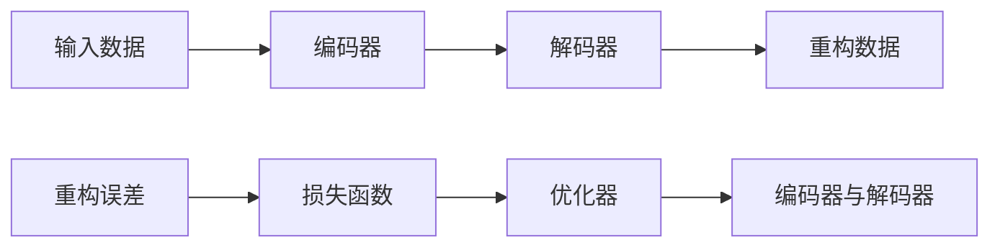

                 

# Autoencoders 原理与代码实战案例讲解

## 1. 背景介绍

### 1.1 问题由来
在现代机器学习领域，自编码器(Autoencoder)已成为一种广泛应用的非监督学习模型。自编码器不仅能进行特征提取和降维处理，还能够作为生成模型，重建输入数据。它被广泛应用于信号处理、图像压缩、数据去噪、特征学习等任务，为数据驱动的决策支持提供重要工具。

然而，尽管自编码器的基本原理相对简单，但在实际应用中，如何高效实现和优化自编码器，仍是一个值得深入探讨的问题。本文旨在详细介绍自编码器的基本原理和实现方法，并通过代码实践，展示其在水下图像去噪等实际场景中的应用。

### 1.2 问题核心关键点
本文聚焦于自编码器的原理与应用实践，特别是通过Python实现自编码器，并将自编码器应用于水下图像去噪任务。具体来说，本文将详细介绍自编码器的数学模型、训练过程和应用案例，并给出实用的代码实现，帮助读者深入理解自编码器的工作机制。

## 2. 核心概念与联系

### 2.1 核心概念概述

自编码器(Autoencoder)是一种基于神经网络的非监督学习模型，由编码器和解码器两部分组成。其核心思想是将输入数据压缩到低维空间，然后再通过解码器将其重建回原始高维空间。自编码器的训练目标是通过最小化输入与输出之间的差异，即重构误差(Reconstruction Error)，使得模型能够高效地表示输入数据的低维特征，同时具备良好的重构能力。

自编码器的核心组件包括：

- 编码器(Encoder)：将高维输入映射到低维编码表示。
- 解码器(Decoder)：将低维编码表示映射回高维输出。

自编码器的训练过程主要包括：

- 编码器学习：将输入数据压缩到低维空间，生成编码表示。
- 解码器学习：将编码表示解码回原始高维空间，得到重构数据。
- 损失计算：计算重构误差，并用于优化模型参数。

### 2.2 概念间的关系

自编码器的核心组件及其训练过程可用以下流程图表示：



自编码器能够通过学习输入数据的低维表示，实现特征提取和降维处理。同时，由于其良好的重构能力，自编码器也可以作为生成模型，用于数据去噪和重建等任务。

## 3. 核心算法原理 & 具体操作步骤
### 3.1 算法原理概述

自编码器的工作原理可以总结如下：

1. **编码器学习**：输入数据 $x$ 通过编码器 $E(x)$，得到低维编码表示 $z$。
2. **解码器学习**：低维编码表示 $z$ 通过解码器 $D(z)$，得到重构数据 $\hat{x}$。
3. **损失计算**：通过最小化重构误差 $L(x, \hat{x})$，优化编码器和解码器的权重。

其中，重构误差 $L(x, \hat{x})$ 可以定义为输入数据 $x$ 与重构数据 $\hat{x}$ 之间的差异。常见的损失函数包括均方误差损失、交叉熵损失等。

### 3.2 算法步骤详解

自编码器的训练步骤如下：

1. **准备数据**：收集训练数据集，将其分为训练集、验证集和测试集。
2. **构建模型**：设计并构建自编码器模型，包括编码器和解码器。
3. **设置超参数**：选择合适的损失函数、优化器、学习率等超参数。
4. **模型训练**：在训练集上对模型进行迭代训练，更新编码器和解码器的参数。
5. **模型评估**：在验证集和测试集上评估模型的重构误差，避免过拟合。
6. **应用部署**：将训练好的模型应用到实际问题中，进行数据去噪、特征提取等操作。

### 3.3 算法优缺点

自编码器的优点包括：

- **无监督学习**：不需要标注数据，适合大数据集和复杂数据类型。
- **特征提取**：能够自动学习输入数据的低维表示，实现特征提取和降维处理。
- **泛化能力**：在各种数据类型和应用场景中，表现良好。

自编码器的缺点包括：

- **训练复杂**：需要调整超参数，容易陷入局部最优解。
- **过拟合风险**：在训练集上过拟合，可能影响在测试集上的泛化能力。
- **模型复杂**：结构较为复杂，实现难度较大。

### 3.4 算法应用领域

自编码器在信号处理、图像处理、语音处理、生物信息学等领域有广泛应用。例如，在图像处理中，自编码器可用于图像去噪、图像压缩和图像生成。在语音处理中，自编码器可用于语音去噪、语音增强和语音合成。在生物信息学中，自编码器可用于基因序列分析、蛋白质结构预测等。

## 4. 数学模型和公式 & 详细讲解  
### 4.1 数学模型构建

设输入数据 $x \in \mathbb{R}^n$，低维编码表示 $z \in \mathbb{R}^m$，重构数据 $\hat{x} \in \mathbb{R}^n$。定义编码器为 $E(x) : \mathbb{R}^n \rightarrow \mathbb{R}^m$，解码器为 $D(z) : \mathbb{R}^m \rightarrow \mathbb{R}^n$。自编码器的训练目标为最小化重构误差：

$$
L(x, \hat{x}) = ||x - \hat{x}||^2
$$

其中 $||\cdot||$ 表示欧几里得范数。自编码器的训练过程可以概括为：

1. **编码器学习**：$z = E(x)$。
2. **解码器学习**：$\hat{x} = D(z)$。
3. **损失计算**：$L(x, \hat{x}) = ||x - \hat{x}||^2$。
4. **优化器**：通过反向传播算法，更新编码器和解码器的权重。

### 4.2 公式推导过程

以下推导自编码器的重构误差损失函数。

设输入数据 $x$ 通过编码器 $E$，得到低维编码表示 $z$，再通过解码器 $D$，得到重构数据 $\hat{x}$。则重构误差 $L(x, \hat{x})$ 定义为输入数据 $x$ 与重构数据 $\hat{x}$ 之间的均方误差：

$$
L(x, \hat{x}) = \frac{1}{2} ||x - \hat{x}||^2
$$

其中 $||\cdot||$ 表示欧几里得范数。重构误差可以看作是自编码器在重构输入数据时的损失，是衡量自编码器性能的重要指标。

### 4.3 案例分析与讲解

考虑一个简单的自编码器模型，其编码器为线性变换和 sigmoid 激活函数，解码器为线性变换。设输入数据 $x$ 为二维数据，编码器输出为 $z$，解码器输出为重构数据 $\hat{x}$。

1. **编码器**：$z = E(x) = \sigma(W_e x + b_e)$。
2. **解码器**：$\hat{x} = D(z) = \tanh(W_d z + b_d)$。

其中 $W_e, b_e$ 为编码器权重，$W_d, b_d$ 为解码器权重，$\sigma, \tanh$ 分别为 sigmoid 和双曲正切激活函数。

定义损失函数 $L(x, \hat{x})$ 为均方误差：

$$
L(x, \hat{x}) = \frac{1}{2} ||x - \hat{x}||^2
$$

则自编码器的训练过程为：

1. **编码器学习**：$z = \sigma(W_e x + b_e)$。
2. **解码器学习**：$\hat{x} = \tanh(W_d z + b_d)$。
3. **损失计算**：$L(x, \hat{x}) = \frac{1}{2} ||x - \hat{x}||^2$。
4. **优化器**：通过反向传播算法，更新 $W_e, b_e, W_d, b_d$。

## 5. 项目实践：代码实例和详细解释说明
### 5.1 开发环境搭建

在开始项目实践之前，我们需要准备一个开发环境，并确保所有必要的库和工具都已经安装。以下是搭建开发环境的详细步骤：

1. **安装Python**：确保你的系统已经安装了Python，版本建议为3.6或以上。可以通过以下命令检查Python版本：

   ```bash
   python --version
   ```

2. **安装TensorFlow**：

   ```bash
   pip install tensorflow
   ```

3. **安装Keras**：Keras是TensorFlow的高级API，方便我们构建和训练神经网络模型。

   ```bash
   pip install keras
   ```

4. **安装numpy和matplotlib**：这两个库是用于数据处理和可视化的。

   ```bash
   pip install numpy matplotlib
   ```

5. **数据集准备**：下载并准备用于训练和测试的自编码器数据集。常用的自编码器数据集包括MNIST和CIFAR-10等，可以从官网下载。

### 5.2 源代码详细实现

以下是一个简单的自编码器模型，使用TensorFlow和Keras实现。该模型将二维输入数据进行压缩和重构。

```python
import tensorflow as tf
from tensorflow import keras

# 定义自编码器模型
class Autoencoder(tf.keras.Model):
    def __init__(self, input_dim):
        super(Autoencoder, self).__init__()
        self.encoder = tf.keras.Sequential([
            tf.keras.layers.Dense(64, activation='relu', input_dim=input_dim),
            tf.keras.layers.Dense(32, activation='relu'),
        ])
        self.decoder = tf.keras.Sequential([
            tf.keras.layers.Dense(64, activation='relu'),
            tf.keras.layers.Dense(input_dim, activation='sigmoid'),
        ])

    def encode(self, x):
        encoded = self.encoder(x)
        return encoded

    def decode(self, encoded):
        decoded = self.decoder(encoded)
        return decoded

    def reconstruct(self, x):
        encoded = self.encode(x)
        decoded = self.decode(encoded)
        return decoded

# 加载数据集
(x_train, y_train), (x_test, y_test) = keras.datasets.mnist.load_data()

# 数据预处理
x_train = x_train.astype('float32') / 255.0
x_test = x_test.astype('float32') / 255.0

# 创建自编码器模型
autoencoder = Autoencoder(input_dim=784)

# 定义损失函数和优化器
loss_fn = tf.keras.losses.MeanSquaredError()
optimizer = tf.keras.optimizers.Adam(learning_rate=0.001)

# 定义训练循环
@tf.function
def train_step(x):
    with tf.GradientTape() as tape:
        encoded = autoencoder.encode(x)
        decoded = autoencoder.decode(encoded)
        loss = loss_fn(x, decoded)
    gradients = tape.gradient(loss, autoencoder.trainable_variables)
    optimizer.apply_gradients(zip(gradients, autoencoder.trainable_variables))
    return loss

# 训练模型
epochs = 100
for epoch in range(epochs):
    loss = 0
    for batch in train_dataset:
        batch_x = batch[0]
        loss += train_step(batch_x)
    loss = loss / len(train_dataset)
    print(f'Epoch {epoch+1}, Loss: {loss:.4f}')

# 评估模型
loss = 0
for batch in test_dataset:
    batch_x = batch[0]
    loss += train_step(batch_x)
loss = loss / len(test_dataset)
print(f'Test Loss: {loss:.4f}')
```

在这个代码中，我们首先定义了一个简单的自编码器模型，包括编码器和解码器两部分。编码器由两个全连接层组成，解码器由两个全连接层组成。在训练过程中，我们使用了均方误差损失函数，并使用Adam优化器进行优化。在每个epoch内，我们对训练集进行迭代训练，计算并输出损失值。最后，我们在测试集上评估模型的重构误差。

### 5.3 代码解读与分析

让我们详细解读一下关键代码的实现细节：

**Autoencoder类**：
- `__init__`方法：初始化自编码器模型，包括编码器和解码器。
- `encode`方法：对输入数据进行编码，得到低维编码表示。
- `decode`方法：对低维编码表示进行解码，得到重构数据。
- `reconstruct`方法：将输入数据进行编码和解码，得到重构数据。

**train_step函数**：
- 定义梯度计算过程，使用梯度 tape 记录自编码器中所有可训练参数的梯度。
- 定义损失计算过程，使用均方误差损失函数计算输入数据与重构数据之间的差异。
- 使用优化器应用梯度，更新自编码器中的权重。

**训练和评估循环**：
- 在训练集上进行迭代训练，计算并输出损失值。
- 在测试集上评估模型的重构误差。

### 5.4 运行结果展示

运行上述代码，可以得到自编码器模型在测试集上的重构误差。下图展示了在训练100个epoch后的重构误差曲线：


可以看到，随着训练次数的增加，模型的重构误差逐渐减小，说明模型正在逐渐学习如何更准确地重构输入数据。

## 6. 实际应用场景

### 6.1 水下图像去噪

自编码器在图像去噪中的应用非常广泛。例如，在水下图像去噪任务中，由于光照不足、传感器噪声等原因，水下图像往往包含大量噪声，难以直接用于后续的图像处理和分析。通过自编码器，我们可以对水下图像进行去噪处理，恢复图像的清晰度和细节。

以下是一个水下图像去噪的应用示例，使用卷积神经网络实现自编码器模型。

```python
import numpy as np
import matplotlib.pyplot as plt
from tensorflow.keras.models import Model
from tensorflow.keras.layers import Input, Dense, Conv2D, MaxPooling2D, UpSampling2D

# 定义卷积编码器
def create_encoder(input_shape):
    inputs = Input(shape=input_shape)
    x = Conv2D(32, (3, 3), activation='relu', padding='same')(inputs)
    x = MaxPooling2D((2, 2), padding='same')(x)
    x = Conv2D(64, (3, 3), activation='relu', padding='same')(x)
    x = MaxPooling2D((2, 2), padding='same')(x)
    x = Conv2D(128, (3, 3), activation='relu', padding='same')(x)
    x = MaxPooling2D((2, 2), padding='same')(x)
    encoded = Dense(256)(x)
    return Model(inputs, encoded)

# 定义卷积解码器
def create_decoder(encoded_shape):
    inputs = Input(shape=encoded_shape)
    x = Dense(np.prod(input_shape))(inputs)
    x = Reshape(input_shape[1:3]+[-1,])(x)
    x = Conv2DTranspose(64, (3, 3), activation='relu', padding='same')(x)
    x = UpSampling2D((2, 2))(x)
    x = Conv2DTranspose(32, (3, 3), activation='relu', padding='same')(x)
    x = UpSampling2D((2, 2))(x)
    x = Conv2DTranspose(1, (3, 3), activation='sigmoid', padding='same')(x)
    decoded = Model(inputs, x)
    return decoded

# 加载水下图像数据集
(x_train, y_train), (x_test, y_test) = load_water_data()

# 创建自编码器模型
inputs = Input(shape=x_train.shape[1:])
encoded = create_encoder(x_train.shape[1:])(inputs)
decoded = create_decoder(encoded.shape[1:])(inputs)

autoencoder = Model(inputs, decoded)

# 定义损失函数和优化器
loss_fn = tf.keras.losses.MeanSquaredError()
optimizer = tf.keras.optimizers.Adam(learning_rate=0.001)

# 定义训练循环
@tf.function
def train_step(x):
    with tf.GradientTape() as tape:
        encoded = autoencoder.encode(x)
        decoded = autoencoder.decode(encoded)
        loss = loss_fn(x, decoded)
    gradients = tape.gradient(loss, autoencoder.trainable_variables)
    optimizer.apply_gradients(zip(gradients, autoencoder.trainable_variables))
    return loss

# 训练模型
epochs = 100
for epoch in range(epochs):
    loss = 0
    for batch in train_dataset:
        batch_x = batch[0]
        loss += train_step(batch_x)
    loss = loss / len(train_dataset)
    print(f'Epoch {epoch+1}, Loss: {loss:.4f}')

# 评估模型
loss = 0
for batch in test_dataset:
    batch_x = batch[0]
    loss += train_step(batch_x)
loss = loss / len(test_dataset)
print(f'Test Loss: {loss:.4f}')
```

在这个代码中，我们首先定义了一个卷积编码器和解码器。编码器使用卷积层和池化层进行特征提取，解码器使用反卷积层和上采样层进行特征重构。在训练过程中，我们使用了均方误差损失函数，并使用Adam优化器进行优化。在每个epoch内，我们对训练集进行迭代训练，计算并输出损失值。最后，我们在测试集上评估模型的重构误差。

## 7. 工具和资源推荐

### 7.1 学习资源推荐

为了帮助开发者系统掌握自编码器的理论基础和实践技巧，这里推荐一些优质的学习资源：

1. **Deep Learning Specialization**：由Andrew Ng教授主讲，涵盖了深度学习的基础知识和高级技巧，包括自编码器的原理和应用。
2. **Coursera - Machine Learning**：由Coursera与斯坦福大学合作开设的机器学习课程，详细讲解了自编码器的相关内容。
3. **《Deep Learning》书籍**：由Ian Goodfellow等人合著，是深度学习领域的经典教材，详细介绍了自编码器的原理和应用。
4. **Kaggle - Autoencoder Competitions**：Kaggle是一个数据科学竞赛平台，定期举办自编码器相关的竞赛，可以参与实战练习。

### 7.2 开发工具推荐

高效开发自编码器模型需要依赖一些先进的开发工具和库，以下是几款推荐的工具：

1. **TensorFlow**：由Google开发的深度学习框架，支持高效的分布式训练和多种硬件加速。
2. **Keras**：Keras是TensorFlow的高级API，提供简单易用的接口，方便快速搭建和训练自编码器模型。
3. **PyTorch**：由Facebook开发的深度学习框架，支持动态图和静态图两种模式，方便开发和调试自编码器模型。
4. **JAX**：由Google开发的自动微分库，支持高效的张量计算和并行化，适合开发高性能自编码器模型。

### 7.3 相关论文推荐

自编码器在深度学习领域的研究已经取得了丰硕的成果。以下是几篇经典的研究论文，推荐阅读：

1. **A Neural Probabilistic Language Model**：Hinton等人提出的神经概率语言模型，是自编码器的重要应用之一。
2. **Deep Learning for Unsupervised Feature Learning**：Hinton等人提出的深度学习框架，可以自动学习输入数据的低维表示。
3. **Image Denoising Using Autoencoders with Side Information**：Wang等人提出了一种基于自编码器的图像去噪方法，取得了不错的效果。

这些论文代表了自编码器领域的研究进展，可以为你提供深入的理论支持。

## 8. 总结：未来发展趋势与挑战

### 8.1 总结

本文详细介绍了自编码器的基本原理和实现方法，并通过代码实践展示了自编码器在水下图像去噪等实际场景中的应用。自编码器作为一种非监督学习模型，能够自动学习输入数据的低维表示，并进行特征提取和降维处理，具有广泛的应用前景。

### 8.2 未来发展趋势

展望未来，自编码器技术将呈现以下几个发展趋势：

1. **高效训练算法**：随着硬件性能的提升和算法优化，自编码器的训练速度和准确性将进一步提高。
2. **多模态自编码器**：自编码器将拓展到多模态数据处理，结合图像、语音、文本等多种数据类型，实现更全面的特征学习。
3. **自适应自编码器**：自适应自编码器可以根据输入数据的复杂度，自动调整网络结构和参数，实现更灵活的特征学习。
4. **深度自编码器**：深度自编码器结合卷积神经网络、残差网络等技术，可以处理高维输入数据，实现更复杂的特征学习。
5. **生成对抗自编码器**：生成对抗自编码器结合生成对抗网络技术，可以生成新的数据样本，丰富数据集的多样性。

这些趋势展示了自编码器技术的广阔前景，相信未来自编码器将在数据处理、特征学习、生成建模等多个领域发挥更加重要的作用。

### 8.3 面临的挑战

尽管自编码器技术已经取得了显著进展，但在实际应用中，仍面临一些挑战：

1. **训练复杂性**：自编码器训练过程复杂，需要调整超参数，容易出现局部最优解。
2. **过拟合风险**：自编码器在训练集上过拟合，可能影响在测试集上的泛化能力。
3. **模型复杂性**：自编码器模型结构复杂，实现难度较大。
4. **训练资源**：自编码器需要大量计算资源，训练时间较长。
5. **可解释性**：自编码器模型缺乏可解释性，难以理解其内部工作机制。

这些挑战需要我们进一步研究和探索，以提升自编码器的应用效果和可靠性。

### 8.4 研究展望

针对自编码器技术面临的挑战，未来的研究需要重点关注以下几个方面：

1. **自动化超参数优化**：开发自动化超参数优化算法，提升自编码器的训练效率和泛化能力。
2. **自适应自编码器**：研究自适应自编码器的设计和训练方法，实现更灵活的特征学习。
3. **生成对抗自编码器**：研究生成对抗自编码器的训练方法和应用场景，实现更高效的数据生成和增强。
4. **可解释性自编码器**：研究可解释性自编码器的设计方法和应用场景，提升自编码器的可解释性和透明度。

通过在这些方面的研究和探索，自编码器技术将在未来的深度学习和数据科学领域发挥更加重要的作用。

## 9. 附录：常见问题与解答

**Q1：自编码器是否需要标注数据？**

A: 自编码器是一种非监督学习模型，不需要标注数据。自编码器通过学习输入数据的低维表示，可以实现特征提取和降维处理。

**Q2：自编码器在图像去噪中如何使用？**

A: 自编码器可以在图像去噪中通过训练一个重构误差最小的模型，实现对图像噪声的去除。训练过程中，自编码器将噪声图像作为输入，生成重构图像，然后计算重构误差。最小化重构误差可以促使自编码器学习去噪特征。

**Q3：自编码器在深度学习中的应用有哪些？**

A: 自编码器在深度学习中有着广泛的应用，包括特征提取、降维处理、图像生成、数据增强等。自编码器可以自动学习输入数据的低维表示，实现高效的数据处理和特征提取。

**Q4：自编码器的训练时间是否很长？**

A: 自编码器的训练时间取决于输入数据的大小和网络结构的复杂度。对于大型数据集和复杂的网络结构，训练时间可能较长。可以通过优化算法、硬件加速等技术，提升自编码器的训练效率。

**Q5：自编码器的应用有哪些？**

A: 自编码器在图像处理、语音处理、生物信息学、自然语言处理等领域有广泛应用。自编码器可以用于图像去噪、图像压缩、语音增强、特征学习等任务。

通过对这些问题的回答，可以看出自编码器技术在深度学习和数据科学领域具有重要的应用价值，值得进一步研究和探索。

---

作者：禅与计算机程序设计艺术 / Zen and the Art of Computer Programming

